# austin70915 四本鐵人賽系列整理（120 篇）

- 使用者文章頁：https://ithelp.ithome.com.tw/users/20152236/articles
- 鐵人檔案頁：https://ithelp.ithome.com.tw/users/20152236/ironman

## 完整性驗證

- 鐵人系列數：4（預期 4）
- 各系列預期篇數總和：120（預期 120）
- 透過系列鏈結抓到篇數：120（預期 120）
- `/users/20152236/articles` 宣告文章數：120
- `/users/20152236/articles` 實際爬到唯一文章數：120
- 系列文章集合 與 使用者文章頁集合一致：是
- 圖片引用數：412
- 圖片下載成功：387
- 圖片下載失敗：0
- mdbook 編譯：失敗

## 系列目錄

- [2022｜新手也能懂得AI-深入淺出的AI課程](#series-2022-5607)（30 篇）
- [2023｜30天內成為NLP大師：掌握關鍵工具和技巧](#series-2023-6669)（30 篇）
- [2024｜從零開始學AI：數學基礎與程式碼撰寫全攻略](#series-2024-7467)（30 篇）
- [2025｜零基礎 AI 入門！從 Wx+b 到熱門模型的完整之路！](#series-2025-8357)（30 篇）

---

<a id="series-2022-5607"></a>

# 2022｜新手也能懂得AI-深入淺出的AI課程

- 系列原址：https://ithelp.ithome.com.tw/users/20152236/ironman/5607
- 預期篇數：30
- 整理篇數：30
- 缺漏天數：無

## 目錄

- [Day 01 - 【day1】python&函式庫 安裝與介紹](#5607-day-01)
- [Day 02 - 【day2】python基礎語法](#5607-day-02)
- [Day 03 - 【day3】來辨識圖像-深度神經網路(Deep Neural Network)](#5607-day-03)
- [Day 04 - 【day4】找到圖片的特徵-捲積神經網路(Convolutional neural network)](#5607-day-04)
- [Day 05 - 【day5】爬蟲與股票預測-長短期記憶模型(Long short-term memory) (上)](#5607-day-05)
- [Day 06 - 【day6】爬蟲與股票預測-長短期記憶模型(Long short-term memory) (下)](#5607-day-06)
- [Day 07 - 【day7】解析gz檔案 & 使用Pytorch做CIFAR10影像辨識 (上)](#5607-day-07)
- [Day 08 - 【day8】解析gz檔案 & 使用Pytorch做CIFAR10影像辨識 (下)](#5607-day-08)
- [Day 09 - 【day9】 讓電腦了解文字資料 & 使用Pytorch做IMDB影評分析](#5607-day-09)
- [Day 10 - 【day10】人工智慧、機器學習、深度學習究竟差異在哪裡?](#5607-day-10)
- [Day 11 - 【day11】集成式學習 & 使用xgboost過濾垃圾郵件](#5607-day-11)
- [Day 12 - 【day12】預訓練模型訓練 & 應用- 使用OpenCV製作人臉辨識點名系統 (上)](#5607-day-12)
- [Day 13 - 【day13】預訓練模型訓練 & 應用- 使用OpenCV製作人臉辨識點名系統 (下)](#5607-day-13)
- [Day 14 - 【day14】預測Hololive七期生的樣貌-生成式對抗網路(Generative Adversarial Network)(上)](#5607-day-14)
- [Day 15 - 【day15】預測Hololive七期生的樣貌-生成式對抗網路(Generative Adversarial Network)(下)](#5607-day-15)
- [Day 16 - 【day16】NLP的首選模型Transformer介紹](#5607-day-16)
- [Day 17 - 【day17】假消息辨識-BERT(Bidirectional Encoder Representations from Transformers)(上)](#5607-day-17)
- [Day 18 - 【day18】假消息辨識-BERT(Bidirectional Encoder Representations from Transformers)(下)](#5607-day-18)
- [Day 19 - 【day19】找到文章的重點-T5( Text-To-Text Transfer Transformer)(上)](#5607-day-19)
- [Day 20 - 【day20】找到文章的重點-T5( Text-To-Text Transfer Transformer)(下)](#5607-day-20)
- [Day 21 - 【day21】分群?分類?傻傻分不清楚-分群演算法介紹](#5607-day-21)
- [Day 22 - 【day22】對Google評論自動分群-HDBSCAN與Sentence-BERT(上)](#5607-day-22)
- [Day 23 - 【day23】對Google評論自動分群-HDBSCAN與Sentence-BERT(下)](#5607-day-23)
- [Day 24 - 【day24】加快程式的運算速度-學習常見的降維演算法](#5607-day-24)
- [Day 25 - 【day25】手刻最簡單的神經網路-單層感知器（Single Layer Perceptron）](#5607-day-25)
- [Day 26 - 【day26】手刻神經網路來解決XOR問題-多層感知器 (Multilayer perceptron) (上)](#5607-day-26)
- [Day 27 - 【day27】手刻神經網路來解決XOR問題-多層感知器 (Multilayer perceptron) (下)](#5607-day-27)
- [Day 28 - 【day28】不要再用準確率(Accuracy)評估分類模型了!-混淆矩陣(Confusion Matrix)與評估指標](#5607-day-28)
- [Day 29 - 【day29 】蒐集資料與訓練模型時會發生的常見問題 & 解決方式](#5607-day-29)
- [Day 30 - 【day30】路途還很遙遠只有良好的基礎才能走向更遠的路-30天的技術總結與心得](#5607-day-30)

---

<a id="5607-day-01"></a>

## Day 01｜【day1】python&函式庫 安裝與介紹

- 原文：https://ithelp.ithome.com.tw/articles/10288056
- 發佈時間：2022-09-05 20:19:03

> 現在正值開學季，我相信有許多的學生進到研究室之後發現
> 
> 欸?我不是資工組的我怎麼會用到AI，我又不會寫程式
> 
> 會這樣子很正常，現在萬物皆可AI的時代，不管是甚麼樣的技術都能套用到AI上去做運算
> 
> 所以這篇文章會告訴你如何在30天從安裝python到學會AI

工具的選擇
-----

今天是第一天，所以先來做一些簡單的事情，就是**安裝python**，雖然現在AI有許多的語言可以使用，但我推薦使用python，因為python的語法與java、C+/C++、R等相比較更容易上手，且擁有大量的AI的函式庫(library)，例如:tensorflow、pytorch、sklearn、opencv...等，所以之後的教學都會使用python來做為撰寫程式的工具。

安裝python
--------

1.前往python官方網站:https://www.python.org/ 點擊上方的Downloads


我們會看到裡面有許多的版本，本篇使用的版本為3.7.8，當然你想下載其他的版本也可以，但請注意python版本千萬不要安裝最新版本或太高的版本。

2.Ctrl+F搜尋3.7.8就能找到本篇教學所使用的python版本了


3.點擊後往下滑會看到Windows x86-64 executable installer(64位元)我們把它下載下來


4.下載完後雙擊安裝(請務必把紅框處打勾)


按下install Now就安裝完畢了!!

安裝完python之後恭喜你!今天的任務你已經完成一半了。前面提到的python有許多函式庫可以做使用，可以幫你輕鬆的完成許多困難的功能，像是矩陣運算、讀取檔案、繪圖等功能都能輕鬆的完成，所以今天的第二步驟就是如何安裝函式庫。

安裝函式庫
-----

1.首先我們先打開cmd視窗(windows搜尋cmd就能找到)


2.輸入pip install XXXX(函示庫名稱)


只要有出現Successfully installed XXXX(函示庫名稱)就代表完成了

_圖中示範的函示庫為pandas後續也會用到可以先安裝_

目前到這裡應該都還算簡單吧~明天會開始教學python的語法

今天就先說到這裡了謝謝大家

---

<a id="5607-day-02"></a>

## Day 02｜【day2】python基礎語法

- 原文：https://ithelp.ithome.com.tw/articles/10288075
- 發佈時間：2022-09-06 00:24:36

> 在開始AI課程之前，我們要先學會如何使用python
> 
> 所以會來教點基礎語法
> 
> 今天的課程會有點難度，建議反覆閱讀並且通過實作來加深印象

0.了解變數與資料型態
-----------

在開始之前我們要先知道如何宣告變數(Variable)與它的資料型態(Type)。

### int、float、str

int:只要是數字在程式中就會被當作是int像是:0、1、1000、-1都是屬於int的類型。

```ini
a = 0    #int
```

float:只要將數字加上.像是0.0、0.1、1.2534都是屬於float。

```ini
a = 0.0  #float
```

在兩者之間加入'' or ""就會是屬於str。

```ini
a = '0'  #str
```

在以上的範例中a就是我們的變數，而這個變數的型態會隨者我賦予它的值去變動它。

### 運算規則

在這些資料型態裡面當然有一些運算規則。

例如:int與float可以互相加減乘除、str只能與int相乘

```makefile
a = 0.1 #float
b = 1   #int
print(a+b)
-------顯示--------
1.1
```

```lua
a='0'
b = 2
print(a*b)
-------顯示--------
'00'
```

### List、Dict、Tuple

如果有一大筆的資料難道要一個一個宣告變數嗎?當然還有幾種資料型態。

#### list[資料1,資料2]:

```lua
list = [1,2,3,4]
print(list[0])
-------顯示--------
1
```

當我們有很多資料時可以放入到一個list當中，若有需要的資料可以直接輸入變數名稱[index]就能呼叫出裡面的資料。

#### dict{'資料的索引1':資料的值1,'資料的索引2':資料的值2}:

```python
dict = {'a':0,'b':1}
print(dict['a'])
-------顯示--------
0
```

dict則是可以依照索引值去尋找你所想要的數值。

#### tuple(資料1,資料2):

```python
tuple = (1,2,3,4)
print(tuple[0])
-------顯示--------
1
```

我們可以看到tuple的效果與list相同，但實際上卻是有差別的，我們用以下程式做個實驗。

```python
tuple = (1,2,3,4)
tuple[0]=0
-------顯示--------
TypeError: 'tuple' object does not support item assignment
```

```lua
list = [1,2,3,4]
list[0]=0
print(list)
-------顯示--------
[0,2,3,4]
```

這一些都搞懂之後我們就來開始一些python的基礎操作吧!!

1.基礎操作
------

### print

> print (* objects , sep = ' ' , end = '\n' , file = sys . stdout , flush = False )

當我們要顯示文字或變數內容時，可以使用print()顯示結果。

```lua
print("hello world")
-------顯示--------
hello world
```

### type

> type(object)

若是我們不知道一個變數的型態，可以使用type()查詢。

```go
b = 1
print(type(b))
-------顯示--------
int
```

### input

> input([prompt])

當我們程式需要一些外部輸入的時候我們可以使用input()。

```lua
n = input('這裡可以輸入你想要的文字:') #輸入123123
print(n)
-------顯示--------
這裡可以輸入你想要的文字:123123
123123
```

### int()、float()、str()

如果把上面的程式修改成做數值相加就會發現系統跳出錯誤提示。

```python
n = input('這裡可以輸入你想要的文字:') #輸入123123
a = 123456
print(n+a)
-------顯示--------
TypeError: can only concatenate str (not "int") to str
```

會發生這樣的問題是因為input回傳是str而不是int與float，所以我們需會用到int()、float()、str()把數值轉型。

```python
n = int(input('這裡可以輸入你想要的文字:')) #輸入123123
a = 123456
print(n+a)
-------顯示--------
246579
```

2.邏輯判斷(if...else、for、while)
---------------------------

### if..else

從這邊開始就會有一些難度了，不過也別擔心，if...else我們每天也都會用到，像是今天如果下雨我就不出門，只是將這種邏輯讓程式看得懂而已，以下是程式的用法。

```bash
if 條件1:
    執行的動作
elif 條件2:
    執行的動作
else:
    執行的動作
```

這樣講可能會比較難理解，我舉個例子來說。

例如:成績80以上的人顯示好棒、60以上的人顯示不錯、60以下的人顯示再加強，用程式就可以這樣子表達:

```bash
if score >=80:
    print('好棒')
elif score >=60:
    print('不錯')
else:
    print('再加強')
```

### for

> range(start, stop[, step])

當我們需要做重複的事情的時候我們就可以使用for 變數名稱 in range(範圍)。

例如:一班10個學生，成績80以上的人顯示好棒、60以上的人顯示不錯、60以下的人顯示再加強。

```python
score = [80,99,10,20,50,60,70,30,20,35]
for i in range(10):
    if score[i] >=80:
        print('好棒')
    elif score[i] >=60:
        print('不錯')
    else:
        print('再加強')
```

不過像上述的寫法會有一種問題，假如今天有轉走了一位學生但範圍還是10，那麼程式執行到最後時就會告知你index out range。

```python
score = [80,99,10,20,50,60,70,30,20]
for i in range(10):
    if score[i] >=80:
        print('好棒')
    elif score[i] >=60:
        print('不錯')
    else:
        print('再加強')
-------顯示--------
好棒
好棒
再加強
再加強
再加強
不錯
不錯
再加強
再加強
IndexError: list index out of range
```

所以我們可以將寫法改變成range(len(score))。

```python
score = [80,99,10,20,50,60,70,30,20]
for i in range(len(score)):#len()可以取得str或list的大小
    if score[i] >=80:
        print('好棒')
    elif score[i] >=60:
        print('不錯')
    else:
        print('再加強')
```

或直接使用score做迴圈。

```bash
score = [80,99,10,20,50,60,70,30,20]
for i in score:#直接拿score做迴圈條件
    if i >=80:
        print('好棒')
    elif i >=60:
        print('不錯')
    else:
        print('再加強')
```

### while

前面說到的for是因為能知道這個迴圈會做幾次，如果不知道要做多少次呢?

舉一個例子，像是寫一個猜數字的小遊戲

```python
n = int(input('輸入數字:'))
num = 80
while(num != n):#未達成條件繼續迴圈
    print('猜錯了!!')
```

我們也可以將while寫成永久迴圈，並且用if控制跳脫迴圈。

```python
n = int(input('輸入數字:'))
num = 80
while(True):#永遠不會停止
    if num == n:.
        break #break為中斷迴圈
    print('猜錯了!!')
```

以上就是迴圈的基本應用。

3.進階教學
------

### function

當我們在寫一個專案的時候，常常會為了方便管理而將一個功能寫在其他地方。

這時就會去定義def function名稱(變數)。

例子:寫一個將兩數相加的function

```css
def add_num(a,b):
    return a+b
    
num = add_num(1,2)
print(num)
-------顯示--------
3
```

但要注意function裡面的變數並不是全域變數，但list、dict、tuple會是為全域變數。

例子:

```sql
def add_num():
    result = list[0]+list[1] #list為全域變數不需傳入function
    return result #result則不是全域變數只存在於這個function中
list = [1,2]
num = add_num()
print(num)
print(result)
-------顯示--------
3
NameError: name 'result' is not defined
```

### class

這個是資料結構的一些技術我盡量簡單的解釋，因為在AI方面這比較不重要，所以我只會提到些基礎的用法，若有興趣的人可以再去查詢這方面的相關知識

```python
class Student:
    # 建構式(Constructor)想放入class的資料會通過__init__建立(放入austin與100到這)
    def __init__(self, name, score):
        self.name = name   #屬性(Attribute):可以使數值在各function之中傳遞
        self.score = score  
        
    # 方法(Method)實際執行動作的地方
    def print_info(self):
        print(f"{self.name}:{self.score}")

people = Student('austin',100)#這邊只會執行__init__
people.print_info()#這邊才是使用print_info這個function
-------顯示--------
austin:100
```

*   類別(Class):在例子中class就是Student
*   物件(Object):在例子中Object就是people
*   屬性(Attribute):在例子中Attribute就是
*   建構式(Constructor):在例子中Constructor就是def **init**(self, name, score)
*   方法(Method):在例子中Method就是def print_info(self)

用一句來講就是:將變數指定為物件(Object)，並且使用建構式(Constructor)賦予屬性(Attribute)，最後用方法(Method)來達成動作

那今天就到這裡，明天會正式講解AI相關技術，謝謝大家

---

<a id="5607-day-03"></a>

## Day 03｜【day3】來辨識圖像-深度神經網路(Deep Neural Network)

- 原文：https://ithelp.ithome.com.tw/articles/10288343

在開始寫程式前，先來看一下最基礎的神經網路DNN的架構圖

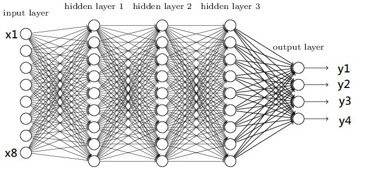

> 圖片來源:https://www.researchgate.net/figure/Deep-Neural-Network-DNN-example_fig2_341037496

圖片是不是看起來有點複雜，其實概念很的簡單，假設我們有個資料集要辨識4種類型得圖片y1~y4，每張圖片有8個特徵(Feature)x1~x8，那神經網路所扮演的角色就是訓練權重(weight)w1~w8，我們可以把權重當作是每一個特徵的分數，分數越高的結果，代表可能性越大，像是在架構圖中的圖片中我們可以用公式能表達為`y = x1w1+x2w2+x3w3+x4w4+x5w5+x6w6+x7w7+x8w8`，找到最高分數的y就是可能性最高的結果。

這樣是不是有一些概念了，接下來開始講解`輸入層(input layer)`、`隱藏層(hidden layer)`、`輸出層(output layer)`的概念。

### 輸入層(input layer)

神經網路的第一層被稱作輸入層，這層取得在外部的資源，像是圖片、文字、音訊、能被接受到的訊息，在這層中不會有任何的公式運算，只是傳送資料至下一層。

### 隱藏層(hidden layer)

隱藏層是在訓練中最重要的一個環節，神經網路就是在這層中學習特徵並產生權重的，一個神經網路至少要有一層隱藏層。

### 輸出層(output layer)

隱藏層會將資料丟給輸出層，這層的輸出大小會根據你所想要的任務而不同，像是辨識貓與狗的圖片(分類任務)輸出層就會是2(只有貓跟狗)，若像是股票預測(回歸)輸出則為1。

看完以上的敘述後，有沒有發現一個問題，輸出是x1w1+...x8w8那不就會是線性了嗎?為了解決這個問題於是有了激勵函數(activation function)，它能夠使神經網路變成非線性，比較常見的激勵函數有:`relu`、`tanh`、`softmax`、`sigmoid`等激勵函數，這些函數選用與解說我會在後續的實作課程中講解，這邊先有個概念就好。

建立環境
----

還記得第一天教的如何安裝函式庫嗎?

今天會用到的函式庫如下:

`numpy`:支援高階大量的維度陣列與矩陣運算，也針對陣列運算提供大量的數學函數函式庫

`tensorflow`:深度學習函式庫，在今天只會做為keras的後端並不會實際用到

`keras`:能夠串接tensorflow，使其能夠簡易的建立神經網路

`jupyter`:Web的互動式計算環境

那麼我們就開始使用pip安裝這些函式庫吧!!

```
pip install tensorflow==2.3.0
pip install keras==2.3.1
pip install jupyter
```

開啟jupyter notebook
------------------

安裝函式庫後，該怎麼開始深度學習的第一支程式呢?

在這邊我會建議先創立一個資料夾，避免資料會混亂，我們先將資料夾命名為"mnist手寫辨識"。


點進去資料夾裡面後按下ALT+D就會就會自動跳到網址列，我們只需要在網址列中輸入cmd。


接下來我們在cmd當中輸入jupyter notebook(注意開啟後cmd不能關掉)。


開啟jupyter後點擊右上角的new選擇python3創立檔案。

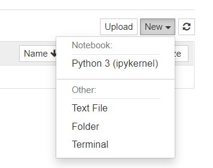

看到這個頁面就代表可以開始寫程式啦~


呼叫函式庫
-----

首先我們要來學習如何呼叫函式庫

當我們想使用一個函式庫時只需用

```
import XXX(函示庫名稱)
```

像是要使用numpy，就能寫成

```
import numpy
```

之後就能使用功能了，例如將list轉換成array只需要在函式庫的名稱後面加入.就能使用function

```
list = [1,2,3]
list = numpy.array(list)
```

但如果今天覺得numpy這個名字太長了就能用以下的寫法

```
#import 函示庫 as 簡化的名稱
import numpy as np
list = [1,2,3]
list = np.array(list)
```

但這樣子import會把函式庫裡面的function通通放到程式裡出來，所以為了節省空間會將一些較常使用的function單獨呼叫

```
#from 函示庫 import 功能 as 簡化名稱
from numpy import array as ar
list = [1,2,3]
list = ar(list)
```

這就是在python呼叫函式庫的辦法，了解之後就開始進入今天的正題的`MNIST手寫辨識`吧!!

MNIST手寫辨識實作
-----------

在這邊我們先將程式分為幾個部分:

1.導入函式庫

2.資料前處理

3.模型的建構

4.模型的訓練

### 1.導入函式庫

```
import numpy as np 
import tensorflow.keras
from tensorflow.keras.datasets import mnist
from tensorflow.keras.models import Sequential
from tensorflow.keras.layers import Dense, Activation
from tensorflow.keras.utils import to_categorical
```

函式庫說明:

1.`keras.datasets`:包含著一些著名的資料集例如:nmist、IMDB影評

2.`keras.models`:架構神經網路

3.`keras.layers`:創建神經網路Dense(DNN)、conv2d(CNN)

4.`keras.utils`:資料正規化

### 2.資料前處理(Data Preprocessing)

在資料前處理之前我們先讀取mnist的資料。

```
(x_train, y_train), (x_test, y_test) = mnist.load_data()
```

> x_train, x_test : uint8 數組表示的灰度圖像，尺寸為(num_samples, 28, 28)。
> 
> y_train, y_test : uint8 數組表示的數字標籤（範圍在0-9 之間的整數），尺寸為(num_samples,)。

拿到資料後先來看一下資料的shape

```
print(x_train.shape)
------顯示------
(60000, 28, 28)
```

第一碼60000代表的是資料大小，總共有60000張圖片

第二碼則是長有28個pixel

第三碼則是寬有28個pixel

我們先回到一開始的架構圖，有沒有發現他的輸入是一整排的(一維)，而我們的資料卻是二維，所以要將28x28(2維)的資料變成784(1維)的資料，在這裡我們是用reshape這個function重新list的大小。

```
x_train = x_train.reshape(60000, 784)
x_test = x_test.reshape(10000, 784)
------顯示------
(60000, 784)
```

現在來觀看一下第一筆訓練資料的內容

```
print(x_train[0])
------顯示------
[....   18  18  18 126 136 175  26 166 255 ...0   0   0   0   0   0   0   0   0]
```

可以看到裡面有許多數值，這數值代表的是顏色越靠近0的是白色，越靠近255則是黑色，這也就是我們圖片的特徵值。

但是在神經網路中數值越大收斂越慢，且會受到極端值的影響，使訓練效果不佳，所以在這邊將數值除255讓數值能夠壓縮在0~1之間

```
x_train = x_train/255
x_test = x_test/255
```

這樣就處理完放入model的圖片資料了。

為了知道神經網路的準確率，我們需要給圖片一個標籤(Label)，但是機器只會看懂0跟1，所以我們需要把數字正規化，在這邊使用`one-hot-encoding`作為正規化的方式。

```
y_train = to_categorical(y_train)
y_test = to_categorical(y_test)
```

假設的label裡面有1與2，那`one-hot-encoding`就會以位置表達數字的涵義

例如:label = [1,2] 那1就會被編譯成[1,0]、2就會被編譯成[0,1]

到這邊我們就完成圖片與標籤的資料前處理了

### 3.模型的建構

首先說明一下在本次訓練內用到的激勵函數`relu`與`softmax`。

`relu`:會將0以下的數值通通當作是0，這能夠加強資料的特徵，同時還能加速程式收斂的速度，通常會用於CNN、DNN等架構上。

`softmax`:會將數值歸一化，且輸出向量中擁有最大權重的項對應著輸入向量中的最大值，通常會定義在分類任務的輸出層。

```
# 建立模型
model = Sequential()
# 輸入層與隱藏層
model.add(Dense(units=256,input_dim=784, activation='relu'))
# 隱藏層
model.add(Dense(units=128, activation='relu'))
# 輸出層
model.add(Dense(units=10,activation='softmax'))
```

用keras建立模型相當的簡單，只需要將Sequential()宣告給一個變數後就能使用add就能加入層數，程式碼的範例是一個784大小的輸入層，並且有兩層隱藏層大小分別維256與128，最後輸出10個結果(辨識0~9)。

### 4.模型的訓練

建立模型之後當然是訓練它了，在訓練之前我們要先了解`損失函數(Loss Function)`與`優化器(Optimizer)`。

`優化器(Optimizer)`:我們在國中應該都學過就是微積分找極值，而在深度學習中就是改良找極值的方式去做到最佳化的，我們叫這種方式為`梯度下降(Gradient Descent)`而這概念則與滑板場相同。想像今天有一個U型滑板場，只要沒有加速最終就會停留在U型的最底部，但若是W型的滑板場就不一定會找到低點了，我們可以想最深的坑會有最陡的坡，所以我們只要給予滑板一定的動力就能一路滑到最深的坑裡爬不出來，而這個名詞就叫做`學習率(Learn Rate)`，若學習率太高(動力太大)就會找不到最低點，若是動力太小找到最低點則會非常的緩慢，所以就會使用一些偷吃步找到最低點，在深度學習中的偷吃步就是optimizer，可以利用不同optimizer來找的最合適的梯度下降法。

`損失函數(Loss Function)`:一個模型學到特徵的好壞，最關鍵的點就是損失函數的設計，在keras中基本上只會使用到兩個:分類任務常用的categorical_crossentropy，以及回歸任務常用的MSE，當然這些都會是一定的，現階段只會會用就可以了。

```
# 宣告loss finction與optimizer
model.compile(loss='categorical_crossentropy',optimizer='adam',metrics=['accuracy'])
# 開始訓練model batch_size一次丟多少資料進去訓練 epochs總共要訓練幾次
history = model.fit(x_train, y_train,
                    batch_size=128, 
                    epochs=10,
                    verbose=1,
                    validation_data=(x_test, y_test))
```

```
#結果
Epoch 1/10
469/469 [==============================] - 1s 2ms/step - loss: 0.2677 - accuracy: 0.9238 - val_loss: 0.1259 - val_accuracy: 0.9622
Epoch 2/10
469/469 [==============================] - 1s 2ms/step - loss: 0.1011 - accuracy: 0.9696 - val_loss: 0.0968 - val_accuracy: 0.9697
Epoch 3/10
469/469 [==============================] - 1s 2ms/step - loss: 0.0662 - accuracy: 0.9804 - val_loss: 0.0781 - val_accuracy: 0.9758
Epoch 4/10
469/469 [==============================] - 1s 2ms/step - loss: 0.0457 - accuracy: 0.9858 - val_loss: 0.0725 - val_accuracy: 0.9762
Epoch 5/10
469/469 [==============================] - 1s 2ms/step - loss: 0.0362 - accuracy: 0.9888 - val_loss: 0.0755 - val_accuracy: 0.9775
Epoch 6/10
469/469 [==============================] - 1s 2ms/step - loss: 0.0266 - accuracy: 0.9913 - val_loss: 0.0672 - val_accuracy: 0.9784
Epoch 7/10
469/469 [==============================] - 1s 2ms/step - loss: 0.0204 - accuracy: 0.9938 - val_loss: 0.0722 - val_accuracy: 0.9793
Epoch 8/10
469/469 [==============================] - 1s 2ms/step - loss: 0.0167 - accuracy: 0.9946 - val_loss: 0.0744 - val_accuracy: 0.9796
Epoch 9/10
469/469 [==============================] - 1s 2ms/step - loss: 0.0158 - accuracy: 0.9950 - val_loss: 0.0826 - val_accuracy: 0.9778
Epoch 10/10
469/469 [==============================] - 1s 2ms/step - loss: 0.0130 - accuracy: 0.9955 - val_loss: 0.0845 - val_accuracy: 0.9784
```

我們可以看到用DNN訓練手寫辨識已經97.84%的辨識率了，是不是很簡單呢?

明天就來教一下CNN的架構與程式，那我們明天再見!

完整程式碼

```
import tensorflow.keras
import numpy as np 
from tensorflow.keras.datasets import mnist
from tensorflow.keras.models import Sequential
from tensorflow.keras.layers import Dense, Activation
from tensorflow.keras.utils import to_categorical

(x_train, y_train), (x_test, y_test) = mnist.load_data()
x_train = x_train.reshape(60000, 784)
x_test = x_test.reshape(10000, 784)
x_train = x_train/255
x_test = x_test/255
y_train = to_categorical(y_train)
y_test = to_categorical(y_test)
# 建立模型
model = Sequential()
# 輸入層與隱藏層
model.add(Dense(units=256,input_dim=784, activation='relu'))
# 隱藏層
model.add(Dense(units=128, activation='relu'))
# 輸出層
model.add(Dense(units=10,activation='softmax'))

model.compile(loss='categorical_crossentropy',optimizer='adam',metrics=['accuracy'])

history = model.fit(x_train, y_train,
                    batch_size=128,
                    epochs=10,
                    verbose=1,
                    validation_data=(x_test, y_test))
```

課程中的程式碼都能從我的github專案中看到

[https://github.com/AUSTIN2526/learn-AI-in-30-days](https://github.com/AUSTIN2526/learn-AI-in-30-days)

---

<a id="5607-day-04"></a>

## Day 04｜【day4】找到圖片的特徵-捲積神經網路(Convolutional neural network)

- 原文：https://ithelp.ithome.com.tw/articles/10288351

經過昨天使用DNN辨識手寫圖片，有沒有發現再怎麼調整參數，準確率都上不去了呢?

這是因為DNN的演算法就只能有這樣的效果，那我們要怎麼提高準確率呢?

也就是今天的主題`卷積神經網路(Convolutional neural network)`

跟昨天一樣先放一張架構圖


> 圖片來源:https://becominghuman.ai/building-a-convolutional-neural-network-cnn-model-for-image-classification-116f77a7a236

看到圖片後有沒有注意到`攤平(Flatten)`後的部分，是不是與昨天學習到到DNN相同，那兩者差別在哪呢?答案就是CNN會通過`捲積(Convolution)`、`池化(Pooling)`等運算方式提取出更重要的特徵，通過`攤平(Flatten)`將特徵放入到全連接層(DNN也是種全連接神經網路)的架構當中，得到更好的輸出結果。

知道上述的概念之後，接下來開始更深入的介紹`捲積層(Convolution Layer)`、`池化層(Pooling Layer)`、`全連接層(Fully Connected Layer)`究竟是什麼。

### 捲積層(Convolution Layer)

捲基層的原理是利用`卷積核(Kernel)`通過`步長(Stride)`的滑動對圖像提取訊息，若超過圖片大小則會對其`填充(Padding)`補值，我們用例子來說明:

可以看到圖片中兩個英文單字X與A，那怎麼知道哪圖片是X又哪張圖片是A呢?


我們可以先畫個方框將圖片拆解


這時候就能用些較簡單的邏輯分辨出特徵，例如:X左上角的區塊是由左上到右下畫出來的，而A左上角的區塊則是右上往左下畫出來的。在圖片中的紅框處，它會先加總方框內的圖像數值之後與卷積核相乘，並通過步長移動方框的位置，產生出新的陣列。

我們架構圖的例子計算一次


圖片的大小是28x28，而我們的捲積核大小為3x3，步長為1，那麼新的陣列大小就會是28(往右)/1(步長)x28(往下)/1(步長)=28x28。

但在例子中3x3的捲積核移動26次(26+3)時就會發現超出圖片的範圍了，那該怎麼辦?這時候會使用`填充`的技巧，把超出外框的值做`墊零(zero padding)`，這樣子就可以防止發生陣列大小不相等的問題了。

池化層(Pooling Layer)
------------------

當經過捲積層計算之後我們會取的一個含有圖片特徵陣列，而在那麼在這一層的工作就是利用pooling的方式處理這些特徵。

我們先來看到圖片中的`MaxPooling`是什麼?


我們可以看到經過`MaxPooling`後的陣列大小從28x28變成了14x14這是因為`MaxPooling`只會保留選取範圍的最大值，這樣子可以有效的取得特徵、並移除`雜訊(noize)`，同時縮減陣列大小從而提高運算速度。

全連接層(Fully Connected Layer)
---------------------------

我們在前面的兩層看到的動作都是在做特徵擷取與強化，到了這層才是真正學習的過程，概念與我們昨天說到的DNN是相同的，這邊就不在講解了，如果沒有跟上的人可以到昨天的課程[**【day3】Deep Neural Network MNIST手寫辨識**](https://ithelp.ithome.com.tw/articles/10288343)學習相關知識

CNN實作
-----

今天的實作會分成以下的部分:

1.導入函式庫與介紹

2.資料前處理

3.建構網路&訓練模型

4.儲存模型

5.評估模型

### 1.導入函式庫與介紹

```
import numpy as np 
import tensorflow.keras
from tensorflow.keras.datasets import mnist
from tensorflow.keras.models import Sequential,load_model,model_from_json
from tensorflow.keras.layers import Conv2D, MaxPooling2D, Flatten, Dense
from tensorflow.keras.utils import to_categorical 
from PIL import Image
import matplotlib.pyplot as plt
```

函式庫說明:

1.`keras.datasets`:包含著一些著名的資料集例如:nmist、IMDB影評

2.`keras.models`:架構神經網路、與神經網路相關操作

3.`keras.layers`:創建神經網路Dense(DNN)、conv2d(CNN)

4.`keras.utils`:資料正規化

5.`PIL`:圖像相關操作

6.`matplotlib.pyplot`:繪畫表格

### 2.資料前處理

我們今天使用的架構為CNN，當使用不同架構時都需要注意他的input_shape，在CNN中輸入則是(長,寬,色彩)，經過昨天的實作我們知道我們的資料是(長,寬)，所以在這邊我們只需要稍微修改昨天的作法將維度reshape成(長,寬,色彩)就可以了。

```
#讀取資料
(x_train, y_train), (x_test, y_test) = mnist.load_data()
#CNN的輸入為(長,寬,色彩) 1代表黑白 3代表彩色
x_train = x_train.reshape(60000, 28, 28, 1)
x_test = x_test.reshape(10000, 28, 28, 1)
#正規化圖像
x_train = x_train/255
x_test = x_test/255
#將label轉換為label
y_train = to_categorical(y_train)
y_test = to_categorical(y_test)
```

### 3.建構網路&訓練模型

這次選用的激勵函式都與昨天的實作相同，我們只需加入三層網路分別是`捲積層Conv2D`、`池化層MaxPooling2D`與`攤平Flatten`就能使網路從DNN架構轉變成CNN架構。

```
#建構網路
model = Sequential()
#CNN輸入為(長*寬*色彩)
model.add(Conv2D(32, kernel_size = 3, input_shape = (28,28,1),padding="same", activation = 'relu'))
#池化層(找最大值不用激勵函數)
model.add(MaxPooling2D(pool_size = 2))
#攤平(攤平不用激勵函數)
model.add(Flatten())
#全連接層
model.add(Dense(16, activation = 'relu'))
#輸出層
model.add(Dense(10, activation = 'softmax'))

# 宣告loss finction與optimizer
model.compile(loss='categorical_crossentropy', optimizer='adam', metrics=['accuracy'])
# 開始訓練model batch_size一次丟多少資料進去訓練 epochs總共要訓練幾次
history = model.fit(x_train, y_train,
                    batch_size=64,
                    epochs=10,
                    verbose=1,
                    validation_data=(x_test, y_test))
                    
-----------------------------------顯示-----------------------------
Epoch 10/10
938/938 [==============================] - 9s 9ms/step - loss: 0.0424 - accuracy: 0.9973 - val_loss: 0.1313 - val_accuracy: 0.9836
```

val_accuracy: 0.9836是不是比之前DNN跑出來的準確率還要高呢!!

### 4.儲存模型

在keras中model有兩種儲存的方式:分別是`model.save`與`model.save_weights`，這兩者差別就在於是否有神經網路。

若我們使用model.save儲存模型，需要使用load_model讀取檔案

```
#儲存model(包含網路)
model.save('model.h5')
#讀取整個model
model = load_model('model.h5')
```

若是使用model.save_weights，需重新定義原本的神經網路以及使用load_weights讀取檔案

```
#只儲存權重
model.save_weights('model_weights.h5')
#需重新定義網路
model = Sequential()
model.add(Conv2D(32, kernel_size = 3, input_shape = (28,28,1),padding="same", activation = 'relu'))
model.add(MaxPooling2D(pool_size = 2))
model.add(Flatten())
model.add(Dense(16, activation = 'relu'))
model.add(Dense(10, activation = 'softmax'))
#讀取權重
model.load_weights('model_weights.h5')
```

### 5.評估模型

當訓練好一個模型之後要怎麼知道這模型好不好呢?我們要先了解什麼是`過擬合(Overfitting)`與`欠擬合(Underfitting)`。


> 圖片來源:https://www.analyticsvidhya.com/blog/2020/02/underfitting-overfitting-best-fitting-machine-learning/

`過擬合(Overfitting)`:是因為過度學習訓練資料，而變得無法順利去預測或分辨不是在訓練資料內的其他資料，也就是在圖片的右半邊`train loss`下降，但`test loss`卻不會再變動了甚至往上升的趨勢。

`欠擬合(Underfitting)`:通常會發生在模型參數過少、模型結構過於簡單或資料過於雜亂時，導致無法捕捉到資料中的規律的現象，也就是我們圖片的左半邊，`test loss`始終追不上`train loss`。

現在我們開始寫程式來繪出train loss與test loss的折線圖找到最好的訓練次數吧!!

我們先來查看訓練過程中的到的loss值

```
print('train loss:',history.history['loss'],'\n\ntest loss:',history.history['val_loss'])
------------------------------------顯示------------------------------------
train loss: [0.41220638155937195, 0.1390567123889923, 0.09521930664777756, 0.07572223246097565, 0.06420597434043884, 0.05522913485765457, 0.049094390124082565, 0.04410300403833389, 0.03952856734395027, 0.03593530133366585] 

test loss: [0.16896437108516693, 0.10513907670974731, 0.08054570108652115, 0.06564835458993912, 0.06614525616168976, 0.05308758467435837, 0.053389910608530045, 0.052831731736660004, 0.05826638638973236, 0.05463290959596634]
```

我們可以看到keras會把每次`epoch`計算的loss值存成一個list，那我們就可以使用`matplotlib.pyplot`快速的畫出一張折線圖。

```
#train loss
plt.plot(history.history['loss'])
#test loss
plt.plot(history.history['val_loss'])
#標題
plt.title('Model loss')
#y軸標籤
plt.ylabel('Loss')
x軸標籤
plt.xlabel('Epoch')
#顯示折線的名稱
plt.legend(['Train', 'Test'], loc='upper left')
#顯示折線圖
plt.show()
```

這樣我們就能觀察到在第5或6次就會是模型最佳的結果

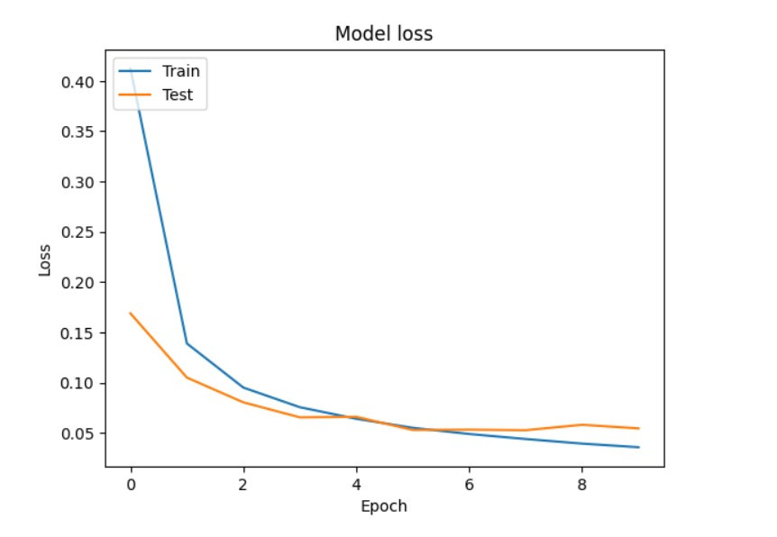

那們今天就到這邊，到現在程式都很簡單吧只需要了解一些理論就能簡單的實作出來，明天會來教近期最後一堂理論課程LSTM，之後就來玩點日常生活中AI的應用吧

完整程式碼
-----

```
import numpy as np 
import tensorflow.keras
from tensorflow.keras.datasets import mnist
from tensorflow.keras.models import Sequential,load_model,model_from_json
from tensorflow.keras.layers import Conv2D, MaxPooling2D, Flatten, Dense
from tensorflow.keras.utils import to_categorical 
from PIL import Image
import matplotlib.pyplot as plt

#讀取資料
(x_train, y_train), (x_test, y_test) = mnist.load_data()
#CNN的輸入為(長,寬,色彩) 1代表黑白 3代表彩色
x_train = x_train.reshape(60000, 28, 28, 1)
x_test = x_test.reshape(10000, 28, 28, 1)
#正規化圖像
x_train = x_train/255
x_test = x_test/255
#將label轉換為label
y_train = to_categorical(y_train)
y_test = to_categorical(y_test)

#建構網路
model = Sequential()
#CNN輸入為28*28*1
model.add(Conv2D(32, kernel_size = 3, input_shape = (28,28,1),padding="same", activation = 'relu'))
#池化層
model.add(MaxPooling2D(pool_size = 2))
#攤平
model.add(Flatten())
#全連接層
model.add(Dense(16, activation = 'relu'))
#輸出層
model.add(Dense(10, activation = 'softmax'))

model.compile(loss='categorical_crossentropy', optimizer='adam', metrics=['accuracy'])
history = model.fit(x_train, y_train,
                    batch_size=128,
                    epochs=10,
                    verbose=1,
                    validation_data=(x_test, y_test))
```

```
plt.plot(history.history['loss'])
plt.plot(history.history['val_loss'])
plt.title('Model loss')
plt.ylabel('Loss')
plt.xlabel('Epoch')
plt.legend(['Train', 'Test'], loc='upper left')
plt.show()
```

```
#儲存model(包含網路)
model.save('model.h5')
#讀取整個model
model = load_model('model.h5')
```

```
#只儲存權重
model.save_weights('model_weights.h5')
#需重新定義網路
model = Sequential()
model.add(Conv2D(32, kernel_size = 3, input_shape = (28,28,1),padding="same", activation = 'relu'))
model.add(MaxPooling2D(pool_size = 2))
model.add(Flatten())
model.add(Dense(16, activation = 'relu'))
model.add(Dense(10, activation = 'softmax'))
#讀取權重
model.load_weights('model_weights.h5')
```

課程中的程式碼都能從我的github專案中看到

[https://github.com/AUSTIN2526/learn-AI-in-30-days](https://github.com/AUSTIN2526/learn-AI-in-30-days)

---

<a id="5607-day-05"></a>

## Day 05｜【day5】爬蟲與股票預測-長短期記憶模型(Long short-term memory) (上)

- 原文：https://ithelp.ithome.com.tw/articles/10288835

遞迴神經網路（Recurrent Neural Networks）
---------------------------------

在開始說明LSTM前，我們要先了解一下什麼是RNN架構。

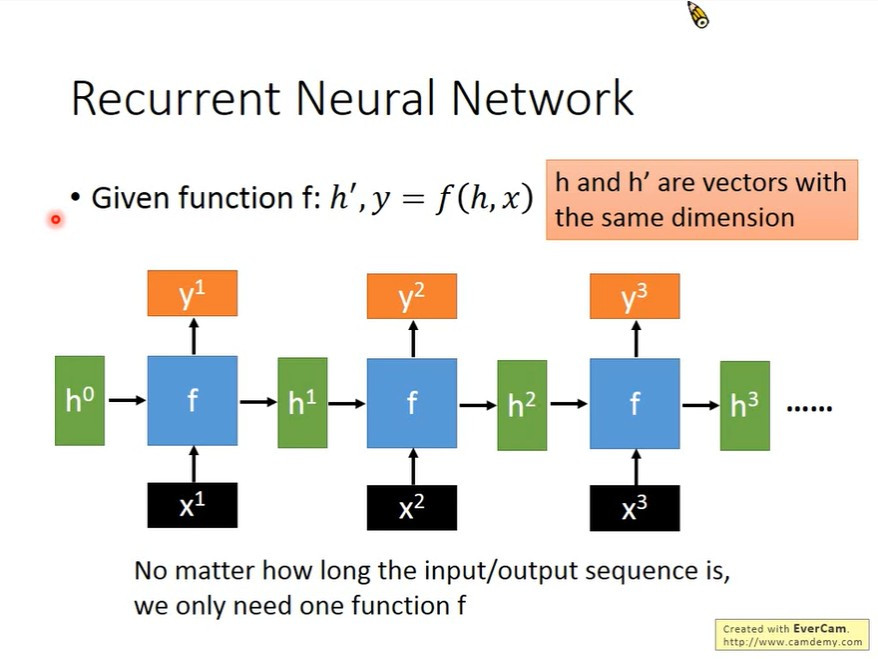

> 圖片來源:李弘毅老師的youtube影片

先說明圖片中的一些重要參數，X1~Xn是我們帶有時間順序的輸入，像是股票的走勢、天氣的溫度、文本的文字，都是帶有時間的數據。H0~Hn是經過RNN計算過後保留下來的資料，初始狀態(H0)這一個狀態可以是0(未經過訓練)，經過每一個輸入(X與上個節點的H)就會更改H的數值並與下一個節點進行運算，使程式有將資訊傳遞的效果。而Y1~Y8是將每一節點的輸出單獨取出的結果，並不會與下個節點計算。

舉一個例子來說:

假設一周的天氣數據是[X1,X2,X3,X4,X5,X6,X7]，我們要讓RNN的神經網路預測第8天的數據，那在RNN的過程就會像是這個樣子`第一節點輸入(H0,X1)->第一節點輸出(Y1,H1)->第二節點輸入(H1,X2)->第二節點輸出(Y2,H2)...第8節點輸出(Y8,H8)`。

通過H傳遞每一節點的資料，使神經網路能夠了解前幾個節點的資料，從而資料帶有時間序而最終訓練的結果也就是我們的Hn狀態，此時狀態會與Yn相同，因為**Y跟H是相同的**，差別在於是否會進入到下個節點進行運算。

LSTM是我們剛剛講解到的RNN模型的改良版，因為RNN模型有一個重大的缺點，就在於他是`短期記憶（Short Term）`我們可以看到，每節點的輸出是會被作為輸入不斷的被計算的，也就意味著會被不斷的稀釋，大概經過3~4節點最開始的輸入就被稀釋光了，LSTM則改良了這個問題。

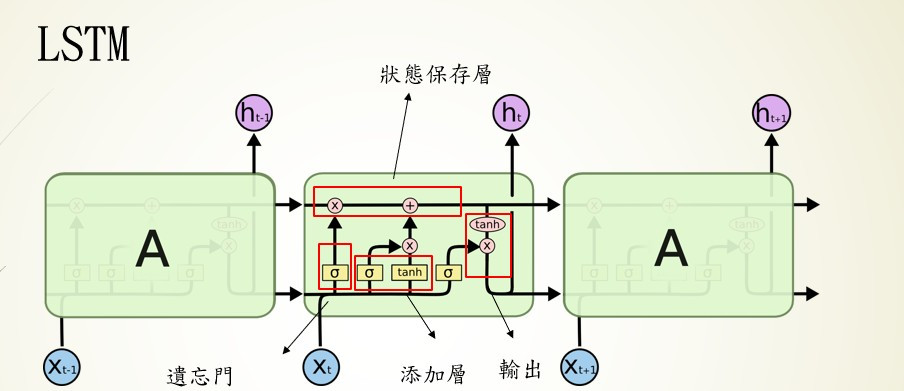

我們把LSTM拆解為4個區塊:`狀態保存層(Cell State)`、`遺忘門層(Forget Gate Layer)`、`添加層`、`輸出層(Output Layer)`。

### 狀態保存層(Cell State)

前面提到RNN的資料會隨著計算迅速消失，為了解決這個問題在LSTM中就將資料獨立儲存，並通過，遺忘門、添加層等運算，保留相關的資訊。

### 遺忘門層(Forget Gate Layer)

在這層中會對`上一個節點的輸出`與`當前輸入`的使用sigmoid計算，將`上個節點的輸出`資料傳送給`狀態保存層`，並丟棄無用的資料。簡單來說就是會忘記不重要的資料，保留重要的資料。

### 添加層

當然有丟棄資料的方式也要有新增資料的方法，所以我們這層的任務就是找到重要的資訊，將`當前節點的輸入`通過sigmoid計算，並通過tanh縮放資料權重，最後將資料傳送給狀態保存層。

### 輸出層(Output Layer)

這階段的作法與添加層的作法相似，也是通過sigmoid與tanh的計算取的所需要的資料，差別在於這次資料的來源是`狀態保存層`。

在這邊作一個簡易的統整:

狀態保存層:負責保留每個節點的資料

遺忘門層:輸入是`上一個節點的輸出`與`當前輸入`使用sigmoid計算，保留`上個節點的輸出`

添加層:輸入是`上一個節點的輸出`與`當前輸入`使用sigmoid與tanh計算，保留`當前輸入`

輸出層:輸入是`狀態保存層`與`當前輸入`使用sigmoid與tanh計算，重新計算`下個節點的輸入`

到這裡是不是了解LSTM中的構造了呢?但在開始LSTM之前我們來先來學一下爬蟲，準備我們LSTM所需要的資料

網路爬蟲
----

在python有兩個比較著名的爬蟲函式庫分別是`requests`與`selenium`，前者難度較高，所以今天會先採用selenium作為基礎教學，後續的課程中再教requests那們進入今天的正題我們先將程式分為幾個部分:

1.架構環境

2.導入函式庫與介紹

3.建立瀏覽器環境

4.迴圈取得網站資料

5.整理資料並存檔

### 1.架構環境

首先我們先到以下網址下載載驅動程式:

| 瀏覽器 | 連結 |
| --- | --- |
| Chrome | [點我](https://chromedriver.chromium.org/downloads) |
| Edge | [點我](https://developer.microsoft.com/en-us/microsoft-edge/tools/webdriver/) |
| Firefox | [點我](https://github.com/mozilla/geckodriver/releases) |
| Safari | [點我](https://webkit.org/blog/6900/webdriver-support-in-safari-10/) |

先找到自己瀏覽器的版本(這邊我就使用chrome作範例)到chrome://settings/help 查看瀏覽器版本


到我們驅動程式的網站下載對應版本(我的版本是104版本)


點進去後下載chromedriver_win32.zip(windows為例)


之後解壓縮到要寫程式的資料夾就可以了


再來我們安裝一下今天要使用到的函式庫不會的可以到我第一天的教學[【day1】python&函式庫 安裝與介紹](https://ithelp.ithome.com.tw/articles/10288056)

```
pip install selenium
pip install bs4
pip install pandas
pip install sklearn
```

### 2.導入函式庫與介紹

```
from selenium import webdriver
from selenium.webdriver.chrome.options import Options
from bs4 import BeautifulSoup
from time import sleep
import pandas as pd
```

1.`selenium`:動態爬蟲

2.`bs4`:分析html網址

3.`time`:時間相關操作

4.`pandas`:excel相關操作

### 3.建立瀏覽器環境

首先我們要知道網站會防止`分散式阻斷服務（DDoS）`，所以會阻擋請求太頻繁或是爬蟲的`請求標頭（request header）`所以我們需要更改selenium的user agent。

```
#設定user agent防止網站鎖IP
chrome_options = Options()
chrome_options.add_argument("user-agent=Mozilla/5.0 (Windows NT 10.0; Win64; x64) AppleWebKit/537.36 (KHTML, like Gecko) Chrome/104.0.0.0 Safari/537.36")

#指定驅動與導入設定
chrome = webdriver.Chrome('chromedriver',options=chrome_options)
```

設定好瀏覽器的環境後我們就可以開始解析網站了

### 4.迴圈取得網站資料

首先我們前往台灣證券交易所的網站(台積電股票為例)，但這個網站卻只有2013/10月的股票數據，所以我們需要使用迴圈幫助我們。

```
https://www.twse.com.tw/exchangeReport/STOCK_DAY?response=html&date=20131001&stockNo=2330
```

先分析一下url，可以看到兩個參數`data=20131001`與`stockNo=2330`，這兩個參數很明顯的一個是日期，另一個是股票編號，所以我們可以統整出以下格式。

```
https://www.twse.com.tw/exchangeReport/STOCK_DAY?response=html&date={年/月/日}&stockNo={股票編號}
```

之後就可以使用迴圈去請求不同頁面的數據

```
#range的內部參數是range(開始, 結尾, 一次加多少)
#2010~2022年
for y in range(2010,2023):
    #1~12月
    for m in range(1,13):
        #網址格式為yyyy/mm/dd 不能少一碼所以要補0
        if m <10:
            #m的格式是int所以要轉成str才能作文字的相加
            m = '0'+str(m)
        url = f'https://www.twse.com.tw/exchangeReport/STOCK_DAY?response=html&date={y}{m}01&stockNo=2330'
```

接下來我們來操作程式前往網站並獲取網站資料

```
#前往網站
chrome.get(url)
#獲取網站資料
soup = BeautifulSoup(chrome.page_source, 'html.parser')
```

接下來我們到網站按下F12可以看到一html的程式碼，可以觀察到我們需要的資料都在tbody>tr這個標籤裡面。

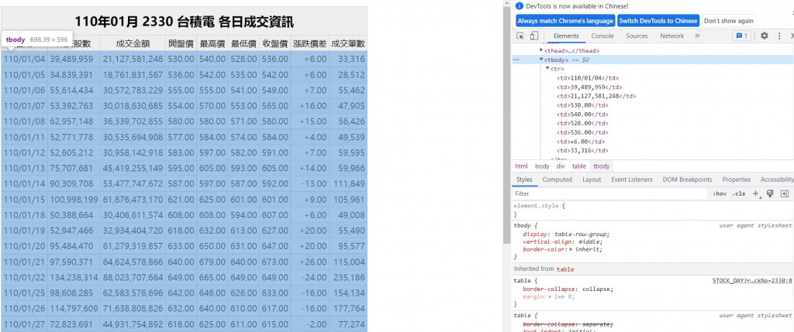

之後就可以利用bs4所提供的CSS選擇器來找到我們要的資料節點，就可以獲取我們想要的資料

```
soup.select('tbody > tr')
```

。

### 5.整理資料並存檔

我們可以看到soup.select('tbody > tr')獲取到的資料長這樣子

```
<tr>
<td>99/01/04</td>
<td>39,511,138</td>
<td>2,557,720,928</td>
<td>65.00</td>
<td>65.00</td>
<td>64.00</td>
<td>64.90</td>
<td>+0.40</td>
<td>8,255</td>
</tr>
```

我們所需要的資料只有裡面的數值，所以我們先把資料轉成str就能取得一個比較乾淨的結果

```
print(tr.text)
----------顯示----------
 99/01/19
47,541,231
2,970,283,048
63.00
63.20
62.00
62.50
-0.40
14,132
```

但有沒有發現這些資料自動換行了，這代表這些字串有一個叫做\n的特殊符號，在程式中\n代表換行符號的意思，所以我們要先將這些資料移除掉，並返回list讓我們更好的處理資料，在這邊我們只要使用split()就可以了

```
#split('需要切割的字')返回是list
td = tr.text.split('\n')
----------------顯示----------------
['', ' 99/01/29', '98,124,608', '5,948,654,037', '60.10', '61.50', '59.40', '61.50', '+1.50', '18,337', '']
```

接下來為了存成csv檔，所以我們先創立一個dict當作存放資料的地方

```
#建立我們資料要的dict
data = {'日期':[],
        '成交股數':[],
        '成交金額':[],
        '開盤價':[],
        '最高價':[],
        '最低價':[],
        '收盤價':[],
        '漲跌價差':[],
        '成交筆數':[]}
```

並且通過append將所有的資料加入到個別的索引

```
#注意td[0] 是 ''
data['日期'].append(td[1])
data['成交股數'].append(td[2])
data['成交金額'].append(td[3])
data['開盤價'].append(td[4])
data['最高價'].append(td[5])
data['最低價'].append(td[6])
data['收盤價'].append(td[7])
data['漲跌價差'].append(td[8])
data['成交筆數'].append(td[9])
```

就能使用pandas裡面的功能將資料存成csv啦

```
#dict轉成dataframe
df = pd.DataFrame(data)
#存成csv檔案
df.to_csv("data.csv")
```

完整程式碼(爬蟲)
---------

```
from selenium import webdriver
from selenium.webdriver.chrome.options import Options
from bs4 import BeautifulSoup
from time import sleep
import pandas as pd

#設定user agent防止網站鎖IP
chrome_options = Options()
chrome_options.add_argument("user-agent=Mozilla/5.0 (Windows NT 10.0; Win64; x64) AppleWebKit/537.36 (KHTML, like Gecko) Chrome/104.0.0.0 Safari/537.36")
#指定驅動與導入參數
chrome = webdriver.Chrome('chromedriver',options=chrome_options)
#建立我們資料要的dict
data = {'日期':[],
        '成交股數':[],
        '成交金額':[],
        '開盤價':[],
        '最高價':[],
        '最低價':[],
        '收盤價':[],
        '漲跌價差':[],
        '成交筆數':[]}
        
#設定年月日(2010~2022)
for y in range(2010,2023):
    for m in range(1,13):
        #網址格式為yyyy/mm/dd 不能少一碼所以要補0
        if m <10:
            #m的格式是int所以要轉成str才能作文字的相加
            m = '0'+str(m)
        url = f'https://www.twse.com.tw/exchangeReport/STOCK_DAY?response=html&date={y}{m}01&stockNo=2330'
        #前往網站
        chrome.get(url)
        #獲取網站資料
        soup = BeautifulSoup(chrome.page_source, 'html.parser')
        #透過CSS選擇器找到在tbody裡面所有的tr標籤
        for tr in soup.select('tbody > tr'):
            #將\n透過split()分割
            td = tr.text.split('\n')
            data['日期'].append(td[1])
            data['成交股數'].append(td[2])
            data['成交金額'].append(td[3])
            data['開盤價'].append(td[4])
            data['最高價'].append(td[5])
            data['最低價'].append(td[6])
            data['收盤價'].append(td[7])
            data['漲跌價差'].append(td[8])
            data['成交筆數'].append(td[9])
        print(data)
       
        #防止過度請求網站被鎖定IP
        sleep(10)
        
#dict轉成dataframe
df = pd.DataFrame(data)
#存成csv檔案
df.to_csv("data.csv")
```

那今天就先到這邊好了，其實今天是想把東西全部教完的，但發現內容太多了，所以明天會接續今天的內容把LSTM實作做完，那我們明天再見。

課程中的程式碼都能從我的github專案中看到

[https://github.com/AUSTIN2526/learn-AI-in-30-days](https://github.com/AUSTIN2526/learn-AI-in-30-days)

---

<a id="5607-day-06"></a>

## Day 06｜【day6】爬蟲與股票預測-長短期記憶模型(Long short-term memory) (下)

- 原文：https://ithelp.ithome.com.tw/articles/10288943

LSTM股票預測
--------

*   1.導入函式庫與介紹
*   2.資料前處理
*   3.架構模型與訓練
*   4.效能評估

### 1.導入函式庫與介紹

```
import numpy as np 
import pandas as pd
import tensorflow.keras
from tensorflow.keras.models import Sequential
from tensorflow.keras.layers import LSTM, Dense
from sklearn.preprocessing import MinMaxScaler
```

1.`numpy`:陣列相關操作

2.`keras.models`:架構神經網路、與神經網路相關操作

3.`keras.layers`:創建神經網路

4.`sklearn.preprocessing`:數值正規化

5.`matplotlib.pyplot`:繪畫表格

### 2.資料前處理

首先我們先從pandas讀取昨天爬蟲拿到的csv檔，沒有的人可以觀看這篇[【day5】爬蟲與股票預測-長短期記憶模型(Long short-term memory) (上)](https://ithelp.ithome.com.tw/articles/10288835)

```
df = pd.read_csv('data.csv')
```

我們在課堂的一開始有說到，大部分深度學習模型都要把數值壓縮到0~1之間，不只能加速收斂速度，所以今天我們股票預測要使用的方式是`最大最小正規化(Min-Max Normalization)`

```
def Min_Max_normalization(name):
    #調整維度成[[資料1],[資料2]]
    name = name.reshape(-1, 1)
    #正規化數值
    scaler = MinMaxScaler(feature_range=(0, 1)).fit(name)
    sc = scaler.transform(name)
    
    #[維度還原]
    return sc.reshape(-1)

#df[row]:可以直接取一整排的數值回傳的type是dataframe
#values:轉成dataframe轉成array
open_p  = Min_Max_normalization(df['開盤價'].values)
max_p = Min_Max_normalization(df['最高價'].values)
min_p = Min_Max_normalization(df['最低價'].values)
fin_p = Min_Max_normalization(df['收盤價'].values)

#replace(old,new)這裡是將文字中的,去除掉
len_p = np.array([int(i.replace(',','')) for i in df['成交筆數'].values])
len_p = Min_Max_normalization(len_p)
```

接下來我們來創建自己的資料集(Date set)，首先我們取每10天的資料預測每第11天的資料，並個資料都要帶有5筆特徵(開盤價、最高價、最低價、收盤價、成交筆數)

```
data = []
tmp = []
label = []
#最後一筆label的範圍是最大數量-11天
for cnt in range(len(open_p)-11):
    #獲取10天的資料
    open_10 = open_p[cnt:cnt+10]
    max_10 = max_p[cnt:cnt+10]
    min_10 = min_p[cnt:cnt+10]
    fin_10 = fin_p[cnt:cnt+10]
    len_10 = len_p[cnt:cnt+10]
    
    #zip可以將每筆資料都同時丟進for迴圈中
    for i,j,k,m,n in zip(open_10,max_10,min_10,fin_10,len_10):
        tmp.append([i, j, k, m, n])
    data.append(tmp)
    tmp = []
    取得收盤價
    label.append(fin_p[cnt+11:cnt+12][0])
```

這樣子我們就能得到一組擁有10天資料5個特徵的訓練資料了(資料數量,天數,特徵)

接下來我們把資料分8:2切割我們的訓練數據與測試數據

```
split_cnt = int(len(data)*0.8)
x_train,y_train = np.array(data[0:split_cnt]),np.array(label[0:split_cnt])
x_test,y_test = np.array(data[0:len(data)-split_cnt]),np.array(label[0:len(data)-split_cnt])
```

這樣資料前處理就完成了~~

### 3.架構模型

今天的模型架構也很簡單，但有一個比較需要注意的return_sequences = True，使我們能夠考慮到前後天的資料，而不是只考慮到昨天的結果

```
model= Sequential()
model.add(LSTM(128,input_shape=(10, 5),return_sequences=True,activation='relu'))
model.add(LSTM(64,return_sequences=False,activation='relu'))
model.add(Dense(1))
#mse為跑回歸任務的其中一個loss function
#回歸任務沒有acc只有loss
model.compile(loss='mean_squared_error',optimizer='adam')
# 開始訓練model batch_size一次丟多少資料進去訓練 epochs總共要訓練幾次
history = model.fit(x_train, y_train,
                    batch_size=64,
                    epochs=10,
                    verbose=1,
                    validation_data=(x_test, y_test))
-------------------------------顯示-------------------------------
Epoch 10/10
39/39 [==============================] - 0s 8ms/step - loss: 7.0062e-05 - val_loss: 8.8297e-06
```

### 4.效能評估

我們直接拿實際值與預測出來的數值作比對

```
y_predicted = model.predict(x_test)
#預測
plt.plot(y_predicted)
#實際值
plt.plot(y_test)
#標題
plt.title('result')
#y軸標籤
plt.ylabel('days')
#x軸標籤
plt.xlabel('value')
#顯示折線的名稱
plt.legend(['predict', 'real'], loc='upper left')
#顯示折線圖
plt.show()
```

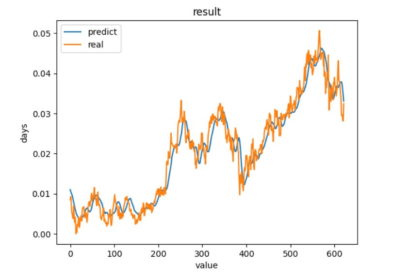

我們可以看到訓練出來的結果還是有貼近實際值，但實際值下降時，預測有時候是上升的，因為股票預測考慮的因素不只有這一些，考慮更多因素說不定能有更好的結果。

完整程式碼(LSTM)
-----------

```
import numpy as np 
import pandas as pd
import tensorflow.keras
from tensorflow.keras.models import Sequential
from tensorflow.keras.layers import LSTM, Dense
from sklearn.preprocessing import MinMaxScaler
import matplotlib.pyplot as plt

def Min_Max_normalization(name):
    name = name.reshape(-1, 1)
    scaler = MinMaxScaler(feature_range=(0, 1)).fit(name)
    sc = scaler.transform(name)
    return sc.reshape(-1)
    
df = pd.read_csv('data.csv')
open_p  = Min_Max_normalization(df['開盤價'].values)
max_p = Min_Max_normalization(df['最高價'].values)
min_p = Min_Max_normalization(df['最低價'].values)
fin_p = Min_Max_normalization(df['收盤價'].values)
len_p = np.array([int(i.replace(',','')) for i in df['成交筆數'].values])
len_p = Min_Max_normalization(len_p)

data = []
tmp = []
label = []
for cnt in range(len(open_p)-11):
    open_10 = open_p[cnt:cnt+10]
    max_10 = max_p[cnt:cnt+10]
    min_10 = min_p[cnt:cnt+10]
    fin_10 = fin_p[cnt:cnt+10]
    len_10 = len_p[cnt:cnt+10]
    for i,j,k,m,n in zip(open_10,max_10,min_10,fin_10,len_10):
        tmp.append([i, j, k, m, n])
    data.append(tmp)
    tmp = []
    label.append(fin_p[cnt+11:cnt+12][0])
        
split_cnt = int(len(data)*0.8)
x_train,y_train = np.array(data[0:split_cnt]),np.array(label[0:split_cnt])
x_test,y_test = np.array(data[0:len(data)-split_cnt]),np.array(label[0:len(data)-split_cnt])

model= Sequential()
model.add(LSTM(128,input_shape=(10, 5),return_sequences=True,activation='relu'))
model.add(LSTM(64,return_sequences=False,activation='relu'))
model.add(Dense(1))

model.compile(loss='mean_squared_error',optimizer='adam')
# 開始訓練model batch_size一次丟多少資料進去訓練 epochs總共要訓練幾次
history = model.fit(x_train, y_train,
                    batch_size=64,
                    epochs=10,
                    verbose=1,
                    validation_data=(x_test, y_test))

y_predicted = model.predict(x_test)
#預測
plt.plot(y_predicted)
#實際值
plt.plot(y_test)
#標題
plt.title('result')
#y軸標籤
plt.ylabel('days')
#x軸標籤
plt.xlabel('value')
#顯示折線的名稱
plt.legend(['predict', 'real'], loc='upper left')
#顯示折線圖
plt.show()
```

到這邊基礎技術基本上都教完了~明天來教一下如何使用pytorch吧

課程中的程式碼都能從我的github專案中看到

[https://github.com/AUSTIN2526/learn-AI-in-30-days](https://github.com/AUSTIN2526/learn-AI-in-30-days)

---

<a id="5607-day-07"></a>

## Day 07｜【day7】解析gz檔案 & 使用Pytorch做CIFAR10影像辨識 (上)

- 原文：https://ithelp.ithome.com.tw/articles/10289155
- 發佈時間：2022-09-11 05:51:34

我們前幾天用的深度學習函式庫是`Tensorflow作為後端`，並用`keras快速實現深度神經網路`，這樣的做法雖然可以簡易的完成一些簡易的AI程式，但無法實現複雜的神經網路及`預訓練模型(pre-trained model)`，所以通常會使用keras學習AI的基礎知識，再來使用Tensorflow或Pytorch作為最終的訓練工具，我這邊會推薦使用Pytorch，所以之後的課程都會以Pytorch為主

解析gz檔
-----

在我們[【day3】來辨識圖像-深度神經網路(Deep Neural Network)](https://ithelp.ithome.com.tw/articles/10288343)的課程中，可以看到透過keras下載的資料集是一個無法打開的文件，須通過程式內部的解析才能了解內容，但如果我今天想要裡面的圖片存在自己的電腦裡或做為資料集使用呢?所以今天要來教如何解開gz檔，在獲得資料的同時也能讓你更理解圖片維度的意義。

*   1.下載資料與安裝函式庫
*   2.讀取資料並整理資料
*   3.迴圈與儲存資料

### 下載資料與安裝函式庫

首先我們先到下載資料[官方網站](https://www.cs.toronto.edu/~kriz/cifar.html)裡面下載[CIFAR-10 python version](https://www.cs.toronto.edu/~kriz/cifar-10-python.tar.gz)

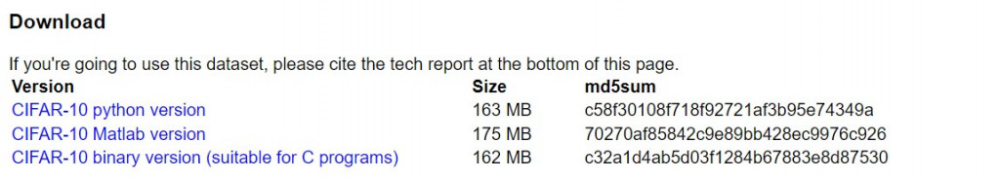

接下來我們把gz檔解壓縮，並且創一個叫做data的資料夾將`data_batch_1`~`data_batch_5`與`test_batch`存放起來，並且在外面創建一個python檔案，此時我們的畫面應該會長這個樣子

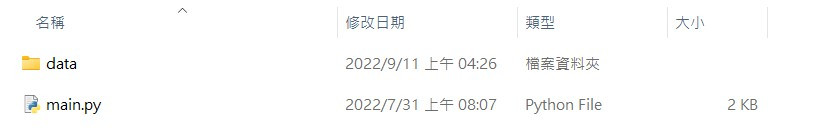

接下來是安裝函式庫

```undefined
pip install opencv-python
```

這樣子就可以開始寫程式啦

### 讀取資料並整理資料

先來導入今天需要的函式庫

```javascript
import pickle as pk
import numpy as np
import cv2
import os
```

接下來看到官方網站中有教我們該如何打開gz的方式，我們先觀察這樣會回傳什麼樣的資料。

```lua
def unpickle(file):
    with open(file, 'rb') as fo:
        dict = pickle.load(fo, encoding='bytes')
    return dict
print(unpickle('data/data_batch_1'))
----------------------------顯示----------------------------
{b'batch_label': b'training batch 1 of 5',
 b'labels': [label資料]
 b'data': array([[圖片資料]], dtype=uint8)
 b'filenames': [檔案名稱]}
```

可以看到這個資料了型態會是一個dict，每一個資料裡面都是一個陣列，我們只需要將labels作為資料夾分類使用filenames作為data的圖片的檔名就可以存檔....個鬼，在官方網站中有這樣一段話

```sql
3072 bytes are the values of the pixels of the image. The first 1024 bytes are the red channel values, the next 1024 the green, and the final 1024 the blue. The values are stored in row-major order, so the first 32 bytes are the red channel values of the first row of the image.
(每張圖片共3072個資料，第一個1024個為紅色的通道的資料，接下來是1024個綠色通道，最後是1024個為藍色，每個資料都是按照優先順序排列的，因此前32個資料是第一行的紅色資料)。
```

在這裡就需要先說明一下電腦儲存影像的方式了首先我們可以知道三原色(紅R、綠G、藍B)可以組合出任一的顏色，所以我們只需要給予一個像素一組紅、綠、藍的資料再將這個資料組合在一起就可以變成一張圖片，在CIFAR10中圖片大小是32x32的，所以在文章中所提到的3072筆其實就是32x32x3。所以按照官方的意思我們在圖片1x1的位子就會是資料中的`第0筆(R)``第1024筆(G)``第2048筆(B)`並依照這個格式組成一張32x32的圖片。

我們先改寫一下官方的範例讓我們更好拿到資料

```python
def unpickle(file):
    #開啟檔案視為2進位
    with open(file, 'rb') as fo:
        #解析開啟後的gz檔
        gz_dict = pk.load(fo, encoding='bytes')
    return gz_dict[b'labels'],gz_dict[b'filenames'],gz_dict[b'data']
    
labels,names, datas = unpickle(f'data/data_batch_1')
```

接下來將每筆data放入迴圈中並將通道分成R,G,B

```kotlin
for data in datas:
    R = data[:1024]
    G = data[1024:2048]
    B = data[2048:3072]
```

最後我們把數據組成圖片一張圖片

```python
img,tmp = [],[]
#enumerate 計數程式用法與range(len(data))回傳值是(計數的值,資料)
for cnt,(r,g,b) in enumerate(zip(R,G,B),1):
    #創立一個像素(在這邊使用b,g,r是因為opencv存檔的格式是bgr)
    tmp.append([b, g, r])
    #每32個像素換下一列
    if cnt % 32 == 0:
        #將整行的像素存入陣列中
        img.append(tmp)
        tmp = []
```

### 迴圈與儲存資料

剛剛只讀取了data_batch_1這個檔案，但我們今天需要重複6次相同的動作，這時我們可以透過os.listdir讀取資料夾內容的名稱，並透過迴圈讀取資料。

```lua
#os.listdir('路徑')回傳值為[檔名1~檔名n]
for path in os.listdir('data'):
    labels,names, datas = unpickle(f'data/{path}')
```

為了儲存圖片可以使用makedirs創建資料夾，但makedirs在迴圈中就會因為創建過資料夾而導致程式錯誤，這邊就能使用try...except的語句做處理。

```python
#嘗試做動作
try:
    os.makedirs(f'pic/train/{label}')
    os.makedirs(f'pic/test/{label}')
#若無法執行則會執行這裡
except:
    #不做任何事情
    pass
```

運用opencv儲存剛剛整理好的影像

```css
cv2.imwrite(path, np.array(img))
```

可以知道資料集需要分成測試數據集與訓練數據集，在CIFAR10中test_batch就是我們的訓練數據集，所以我們就能用if判斷該資料是訓練還是測試資料。

```python
#測試數據集
if path == 'test_batch':
    #把資料存進剛剛建立好的資料夾中 過濾掉檔名裡面的'b'與'符號
    cv2.imwrite(f'pic/test/{label}/{str(name)[2:-1]}', np.array(img))
else:
    cv2.imwrite(f'pic/train/{label}/{str(name)[2:-1]}', np.array(img))
```

最後讓我們把程式組合起來

完整程式碼
-----

```python
import pickle as pk
import numpy as np
import cv2
import os

def unpickle(file):
    with open(file, 'rb') as fo:
        gz_dict = pk.load(fo, encoding='bytes')
        
    return gz_dict[b'labels'],gz_dict[b'filenames'],gz_dict[b'data']

for path in os.listdir('data'):
    labels,names, datas = unpickle(f'data/{path}')
    for label, name, data in zip(labels,names,datas):
        try:
            os.makedirs(f'pic/train/{label}')
            os.makedirs(f'pic/test/{label}')
        except:
            pass
            
        R = data[:1024]
        G = data[1024:2048]
        B = data[2048:3072]
        
        img,tmp = [],[]
        for cnt,(r,g,b) in enumerate(zip(R,G,B),1):
            tmp.append([b, g, r])
            if cnt % 32 == 0:
                img.append(tmp)
                tmp = []
              
        if path == 'test_batch':
            cv2.imwrite(f'pic/test/{label}/{str(name)[2:-1]}', np.array(img))
        else:
            cv2.imwrite(f'pic/train/{label}/{str(name)[2:-1]}', np.array(img))
```

這樣子可以得到資料啦，明天先來說說GPU加速與再來開始pytorch的教學

課程中的程式碼都能從我的github專案中看到

[https://github.com/AUSTIN2526/learn-AI-in-30-days](https://github.com/AUSTIN2526/learn-AI-in-30-days)

---

<a id="5607-day-08"></a>

## Day 08｜【day8】解析gz檔案 & 使用Pytorch做CIFAR10影像辨識 (下)

- 原文：https://ithelp.ithome.com.tw/articles/10289426

為何要使用GPU加速
----------

在實作CNN與LSTM時的因為資料量較小只需用到CPU運算，但後續課程中的資料會越來越多，所以運算時間會越來越久，這時就會使用到GPU去加速程式。

我們先了解GPU為何能夠加速程式就要先知道GPU的構造，GPU是由許多的`乘數累加器（Multiply Accumulate)`組成，這種運算的動作是將資料相乘後加上累加器後再存入累加器(累加器1 <- 累加器1 + 資料1x資料2)，而在神經網路中可以`將矩陣放入累加器中運算`，且在乘數累加器中`只需使用一個指令`就能完成上述的動作，從而提高運算的速度，簡單來說就是`GPU能夠用簡短的方式傳輸大量資料`。

今天的課程會有許多[【day3】來辨識圖像-深度神經網路(Deep Neural Network)](https://ithelp.ithome.com.tw/articles/10288343)與[【day4】找到圖片的特徵-捲積神經網路(Convolutional neural network)](https://ithelp.ithome.com.tw/articles/10288351)的知識與一些延伸，若是有不了解的地方可以回顧一下。

*   1.Pytorch版本安裝
*   2.函式庫介紹與安裝
*   3.創建資料集
*   4.架構神經網路
*   5.訓練神經網路

### Pytorch版本安裝

我們前幾天再安裝函式庫都是使用`pip install 函式庫名稱`安裝程式，但使用這種方式安裝pytorch卻會發現是CPU版本，那麼該怎麼安裝GPU版本呢?

先到Pytorch的[官方網站](https://pytorch.org/)會看到INSTALL PYTORCH，之後選擇安裝的方式(pip)與cuda版本(基本上都是11.3)，就會得到一串pip的指令

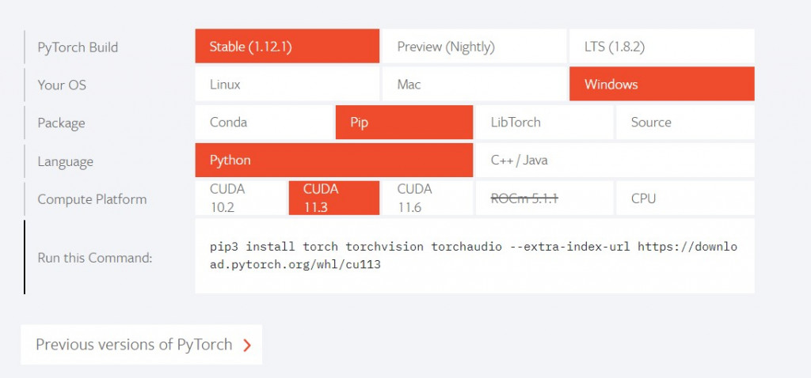

之後輸入就安裝完畢了

```
pip3 install torch torchvision torchaudio --extra-index-url https://download.pytorch.org/whl/cu113
```

### 函式庫介紹與安裝

```
#如果到現在的課程都有跟上，那應該只會缺少tqdm函式庫
pip install tqdm
```

接下來介紹一下今天會使用的函式庫

```
#系統相關操作
import os
#深度學習函式庫
import torch
#神經元架構與損失函數
import torch.nn as nn
#激勵函數
import torch.nn.functional as F
#優化器
import torch.optim as optim
#圖像前處理
import torchvision.transforms as transforms
#矩陣操作
import numpy as np
#圖像操作
from cv2 import imread
#創建資料集
from torch.utils.data import Dataset, DataLoader
#顯示進度條
from tqdm import tqdm
```

### 創建資料集

我們前幾天的實作都是先將資料放入一個array中，再將array給予神經網路去運算，但是在pytorch中不會使用這種方式，因為pytorch沒辦法像keras那樣指定`batch size`與`epoch`，所以在pytorch中會先將變成dataset後再轉換成dataloader，才能夠指定batch size等參數，我們先看一下pytorch創建dataset的方式。

```
#繼承Dataset這一個class(需要繼承pytorch設定好的class並新增自己的資料)
class dataset(Dataset):
    #初始化資料的地方
    def __init__(self,data):
      #創建資料的地方
      
    #每次訓練時會通過__getitem__取得我們需要訓練的資料
    def __getitem__(self,index):
       #訓練當前的index與資料
       
    #判斷資料的大小
    def __len__(self):
        #判斷index的上限
        return len(self.data)
```

在這邊需要注意若我們需要的處理資料(讀檔、正規化)，需要在`init`內完成，而不是在`getitem`裡面，因為pytorch在訓練的時候會從getitem這一個function裡取資料，如果寫在裡面會使每取一筆資料，就需要重新處理一次，這樣子會導致程式訓練的時間變得更久。

若使用GPU訓練的人要注意處理資料時千萬不要在建立資料時，將資料放入GPU中處理，例如:

```
def __init__(self,data):
      #cuda()會將資料放入顯卡
      self.data = data.cuda()
```

這樣子會將所有的資料放入顯卡當中，且**不會釋放**，若是要將資料放入GPU中，應先將資料變成dataloader的形式再使用cuda()放入到GPU當中。

接下來開始處理昨天解析出來的CRFAR10圖像，透過昨天學習到的listdir讀取圖片並放到list當中。

```
data = []
for label in os.listdir(path):
    for pic in os.listdir(path + '/' + label):
        #cv2.imread(path)可以將圖片轉換為array
        cv_pic = imread(f'{path}/{label}/{pic}')
        data.append([cv_pic, int(label)])
```

之後需要對圖片正規化，這裡可以利用`transforms.Compose()`定義我們想要做的操作。

```
#將資料轉化成Tensor後Normalize
transform = transforms.Compose([transforms.ToTensor(),
                                transforms.Normalize((0.5,0.5,0.5),(0.5,0.5,0.5))
                               ])
```

這樣就可以把transform做為一個function使用了

```
transform(data)
```

我們將整個程式組合起來，這樣就可以創建資料集了

```
class CRFAR10(Dataset):
    def __init__(self, path, transform):
        self.data = []
        for label in os.listdir(path):
            for pic in os.listdir(path + '/' + label):
                cv_pic = imread(f'{path}/{label}/{pic}')
                self.data.append([cv_pic, int(label)])
    
    def __getitem__(self,index):
        datas = transform(self.data[index][0])
        labels = torch.tensor(self.data[index][1])
        return datas, labels
    
    def __len__(self):
        return len(self.data)
        
transform = transforms.Compose([transforms.ToTensor(),
                                transforms.Normalize((0.5,0.5,0.5),(0.5,0.5,0.5))
                               ])
                               
train_set = CRFAR10(r'pic/train/', transform)
test_set = CRFAR10(r'pic/test/', transform)
train_loader = DataLoader(train_set, batch_size = 128,shuffle = True, num_workers = 0)
test_loader = DataLoader(test_set, batch_size = 128, shuffle = True, num_workers = 0)
```

### 架構神經網路

先來看pytorch中該怎麼架構神經網路的格式。我們需要在init定義`神經網路的種類`與`每層的輸入大小`，並且使用forward來執行動作。

```
#繼承nn.Module
class CNN(nn.Module):
    def __init__(self):
        #呼叫nn.Module裡面init的資料
        super().__init__()
        #定義神經網路

    def forward(self, x):
        #定義操作
```

知道格式後，就可以來架構神經網路了，今天要的網路構造如下:

```
捲積層1->池化層->捲積層2->池化層->全連接層 (CNN)
```

這代表需要建立`2個CNN`、`1個池化層`與`n個全連接層`我們先看到官方說明:

> torch.nn.Conv2d(in_channels, out_channels, kernel_size, stride=1, padding=0, dilation=1, groups=1, bias=True, padding_mode='zeros', device=None, dtype=None)

官方文件告訴我們在CNN中需要定義三個參數`(in_channels, out_channels, kernel_size)`，在這之中輸入是唯一需要知道的參數，在CRFAR10資料集中圖片是彩色的，這代表我們的`in_channels`會是3(RGB)，`out_channels`與`kernel_size`我們需要通過多次測試與經驗，才能知道最佳的結果，我們可以先隨便設定一個值(這邊先設定out_channels = 6與kernel_size = 5)。

```
self.conv1 = nn.Conv2d(3, 6, 5)
```

接下來設定第二層CNN神經網路(上層設定的out_channels是6，所以我們這層的in_channels一定要是6)

```
self.conv2 = nn.Conv2d(6, 16, 5)
```

然後我們來看一下池化層的說明:

> torch.nn.MaxPool2d(kernel_size, stride=None, padding=0, dilation=1, return_indices=False, ceil_mode=False)

這層是做特徵強化只會縮小圖片大小，所以不會影響到in_channels，所以可以隨意的設定kernel_size

```
self.pool = nn.MaxPool2d(2, 2)
```

接下來就會比較困難了，因為要進入到全連接層之前需要將維度攤平，所以我們要先計算最後一層的大小，我們知道輸入的大小是`3x32x32`的圖像，在經過了第一層CNN之後`in_channels = 3` 會變成`out_channels = 6`，那32x32會變成什麼呢?這邊我們就需要套用到CNN參數計算的方式`(長或寬 + 2*(padding) - 捲積核) / 步長 + 1`，我們將第一層的數據套用到公式裡面`(32 + 2*0 - 5) / 1 + 1 = 28(padding預設是0)`，所以經過第一層後我們的矩陣大小會變成`6x28x28`，在將矩陣放入池化層中(2x2)得到28/2=14，以此類推。最後會得到`16x5x5`的結果。

```
(3*32*32)捲積層1->(6*28*28)池化層->(6*14*14)捲積層2->(16*10*10)池化層->(16*5*5)全連接層(輸出10)
```

計算完之後就可以設定全連接層的參數

```
self.fc1 = nn.Linear(16 * 5 * 5, 120)
self.fc2 = nn.Linear(120, 84)
#最後輸出要為10(10分類)
self.fc3 = nn.Linear(84, 10)
```

這樣就建立好神經網路的架構了

```
def __init__(self):
        super().__init__()
        #捲積層1
        self.conv1 = nn.Conv2d(3, 6, 5)
        #捲積層2
        self.conv2 = nn.Conv2d(6, 16, 5)
        #池化層
        self.pool = nn.MaxPool2d(2, 2)
        #全連接層
        self.fc1 = nn.Linear(16 * 5 * 5, 120)
        self.fc2 = nn.Linear(120, 84)
        self.fc3 = nn.Linear(84, 10)
```

接下來要定義這些神經網路的使用方式(攤平資料、激勵函數等計算)

```
def forward(self, x):
    #第一層使用激勵函數relu計算CNN神經網路1後丟給池化層 input(3,32,32) output(6,14,14)
    x = self.pool(F.relu(self.conv1(x)))
    #第二層使用激勵函數relu計算CNN神經網路2後丟給池化層 input(6,14,14) output(16,5,5)
    x = self.pool(F.relu(self.conv2(x)))
    #將資料攤平
    x = x.view(x.size(0),-1)
    #放入全連接層
    x = F.relu(self.fc1(x))
    x = F.relu(self.fc2(x))
    x = self.fc3(x)
    return x
```

可以看到在pytorch建立神經網路的方式明顯比keras複雜很多，在keras中只需要定義輸入與激勵函數就能輕鬆建立神經網路，而pytorch卻需要計算每層的輸入與輸出，並且還要定義使用的方法，但也因為這樣子的**操作更加的自由**，使我們能夠做到keras無法做到的事情。

### 訓練神經網路

終於來到今天的最後一步了，架構好神經網路後當然是要訓練它囉，先來看一下最基本的範例。

```
for data,label in dataloader:
    #將訓練資料放入model裡面做預測
    outputs = model(data)
    #通過預測結果與label運算損失值
    loss = criterion(outputs, label)
    #梯度歸0
    optimizer.zero_grad()
    #反向傳播每個梯度的損失值
    loss.backward()
    #更新損失值
    optimizer.step()
        
#剛剛建立好的神經網路
model = CNN()
#定義 Loss function 
criterion = nn.CrossEntropyLoss()
#定義優化器(模型參數,學習率)
optimizer = optim.adam(model.parameters(), lr=0.001)
```

這邊有幾個比較重要的資訊`optimizer.zero_grad()`、`loss.backward()`、`optimizer.step()`，

我們知道在深度學習中需要找對最低的梯度，而我們希望每一次訓練的結果是單獨計算的，所以在訓練時常常會看到optimizer.zero_grad()來將梯度初始化，你可能會問pytorch怎麼不直接初始化呢?在訓練神經網路時，有時候希望能持續累積梯度，並通過條件控制梯度的初始化時機，這時如果pytorch把這功能寫死，那可能會導致無法得到預期的效果或是無法訓練神經網路。

loss.backward()、optimizer.step()的概念就比較簡單了，通過設定的loss function做`反向傳播(Backpropagation)`計算梯度後，通過optimizer.step()將計算出來的loss值交給optimizer做運算，使loss能通過優化器更快速的下降。

接下來為了讓我們知道訓練還需要多久，就可以在剛剛的程式中加入tqdm將進度條顯示出來

```
#先宣告tqdm的資料
train = tqdm(train_loader)
#更改剛剛的for迴圈
for cnt,(data,label) in enumerate(train, 1):
    #訓練
    ...
    #顯示放在前面的文字(通常會放這是第幾次的epoch)
    train.set_description(str)
    #顯示放在後面的資料(通常會是loss與acc)
    # train.set_postfix(dict)
```

我們也可以在訓練當中切換訓練模式與測試模式。

```
#訓練模式
model.train()
#測試模式
model.eval()
```

最後把acc與loss等的計算都加入到程式當中

```
epochs = 10
    #訓練幾次
    for epoch in range(epochs):
        #訓練資料、loss、準確率
        train_loss = 0
        train_acc = 0
        train = tqdm(train_loader)
        #切換成訓練模式
        model.train()
        #開始訓練
        for cnt,(data,label) in enumerate(train, 1):
            #將資料放入GPU
            data,label = data.cuda() ,label.cuda()
            #模型預測
            outputs = model(data)
            #計算loss
            loss = criterion(outputs, label)
            #查看模型預測的結果
            _,predict_label = torch.max(outputs, 1)
            #梯度歸0
            optimizer.zero_grad()
            #反向傳播後傳給optimizer
            loss.backward()
            optimizer.step()
            #計算當次epoch的loss值
            train_loss += loss.item()
            #計算當次epoch的acc
            train_acc += (predict_label==label).sum()
            #顯示
            train.set_description(f'train Epoch {epoch}')
            train.set_postfix({'loss':float(train_loss)/cnt,'acc': float(train_acc)/cnt})
        #切換測試模式
        model.eval()
        #測試資料、acc
        test = tqdm(test_loader)
        test_acc = 0
        for cnt,(data,label) in enumerate(test, 1):
            data,label = data.cuda() ,label.cuda()
            outputs = model(data)
            _,predict_label = torch.max(outputs, 1)
            test_acc += (predict_label==label).sum()
            test.set_description(f'test Epoch {epoch}')
            test.set_postfix({'acc': float(test_acc)/cnt})
```

這樣就完成一支pytorch的訓練程式了~

完整程式碼
-----

```
import os
import torch
import torch.nn as nn
import torch.nn.functional as F
import torch.optim as optim
import torchvision.transforms as transforms
import numpy as np
from cv2 import imread
from torch.utils.data import Dataset, DataLoader
from tqdm import tqdm

class CRFAR10(Dataset):
    def __init__(self, path, transform):
        self.data = []
        for label in os.listdir(path):
            for pic in os.listdir(path + '/' + label):
                cv_pic = imread(f'{path}/{label}/{pic}')
                self.data.append([cv_pic, int(label)])
    
    def __getitem__(self,index):
        datas = transform(self.data[index][0])
        labels = torch.tensor(self.data[index][1])
        return datas, labels
    
    def __len__(self):
        return len(self.data)
        
        
class CNN(nn.Module):
    def __init__(self):
        super().__init__()
        self.conv1 = nn.Conv2d(3, 6, 5)
        self.pool = nn.MaxPool2d(2, 2)
        self.conv2 = nn.Conv2d(6, 16, 5)
        self.fc1 = nn.Linear(16 * 5 * 5, 120)
        self.fc2 = nn.Linear(120, 84)
        self.fc3 = nn.Linear(84, 10)
        
    #(輸入 + 2*(padding) - 捲積核) / 移動 + 1
    def forward(self, x):
        x = self.pool(F.relu(self.conv1(x)))
        x = self.pool(F.relu(self.conv2(x)))
        x = x.view(x.size(0),-1)
        x = F.relu(self.fc1(x))
        x = F.relu(self.fc2(x))
        x = self.fc3(x)
        return x

def train(train_loader,test_loader, model ,optimizer, criterion):
    epochs = 10
    for epoch in range(epochs):
        train_loss = 0
        train_acc = 0
        train = tqdm(train_loader)
      
        model.train()
        for cnt,(data,label) in enumerate(train, 1):
            data,label = data.cuda() ,label.cuda()
            outputs = model(data)
            loss = criterion(outputs, label)
            _,predict_label = torch.max(outputs, 1)
            
            optimizer.zero_grad()           
            loss.backward()
            optimizer.step()

            train_loss += loss.item()
            train_acc += (predict_label==label).sum()
            train.set_description(f'train Epoch {epoch}')
            train.set_postfix({'loss':float(train_loss)/cnt,'acc': float(train_acc)/cnt})
            
        model.eval()
        test = tqdm(test_loader)
        test_acc = 0
        for cnt,(data,label) in enumerate(test, 1):
            data,label = data.cuda() ,label.cuda()
            outputs = model(data)
            _,predict_label = torch.max(outputs, 1)
            test_acc += (predict_label==label).sum()
            test.set_description(f'test Epoch {epoch}')
            test.set_postfix({'acc': float(test_acc)/cnt})

transform = transforms.Compose([transforms.ToTensor(),
                                transforms.Normalize((0.5,0.5,0.5),(0.5,0.5,0.5))
                               ])
                               
train_set = CRFAR10(r'pic/train/', transform)
test_set = CRFAR10(r'pic/test/', transform)
train_loader = DataLoader(train_set, batch_size = 128,shuffle = True, num_workers = 0)
test_loader = DataLoader(test_set, batch_size = 128, shuffle = True, num_workers = 0)

model = CNN().cuda()
criterion = nn.CrossEntropyLoss().cuda()
optimizer = optim.SGD(model.parameters(), lr=0.001, momentum=0.9)
train(train_loader, test_loader, model,optimizer,criterion)
```

今天是不是覺得難度突然上升了很多呢?當我們接觸到pytorch時就會發現，資料集需要學會如何使用class存放資料，建立神經網路需要了解網路構造與運算方式，訓練模型要學會如何使用優化器與損失函數找到最合適的梯度，這些都是keras中沒辦法接觸到的。

今天的課程因為有點複雜，有不懂的地方一定要回去看前面的資料，這樣子才能真正了解神經網路的構造與實作方式

課程中的程式碼都能從我的github專案中看到

[https://github.com/AUSTIN2526/learn-AI-in-30-days](https://github.com/AUSTIN2526/learn-AI-in-30-days)

---

<a id="5607-day-09"></a>

## Day 09｜【day9】 讓電腦了解文字資料 & 使用Pytorch做IMDB影評分析

- 原文：https://ithelp.ithome.com.tw/articles/10289649

讓電腦了解文字資料
---------

在前幾天的課程中，我們學會如何利用opencv讀取圖片與如何讀取股票資料，像這一些純數值的資料只需要處理矩陣維度後，就能放到神經網路中訓練。如果今天的輸入是文字呢?可能有些人想到了，就是使用在第3天使用到的正規化技術`one-hot-encoding`。可以將一段文字給予他實際的數字編號後透過one-hot-encoding將資料轉換成機器看得懂的方法。

例如:

```
#文字
text = I am a student

#給予編號
text_to_int = {I:0, am:1, a:2, student:3}
text = [text_to_int(i) for i in text]

#one-hot-encoding
to_categorical(text)
------------顯示------------
[[1,0,0,0],[0,1,0,0],[0,0,1,0],[0,0,0,1]]
```

雖然這種方式電腦會看得懂，但會有兩個問題存在，分別是`無法辨別一詞多意`與`資料量太龐大`。

先來看以下的例子:

```
It's so cold, I've caught a cold
```

我們可以知道第一個cold代表的是寒冷的意思，而第二個cold卻是感冒的意思。若使用one-hot-encoding會把這兩個轉換成相同的list，這代表兩者文字的意思是相同的，這樣訓練效果自然就會很差了。

再來是資料龐大的問題，一個資料集單中假設含有16000個英文單字，那在訓練時一個單字的矩陣大小就會是(1,16000)，假設有100字就是(100,16000)，光一個100字的文件就足以讓電腦負荷不了，我們昨天實作的圖片一張只有3x32x32，使用這樣的做法訓練一個檔案的時間，就會是昨天訓練大小的520倍!!

所以為了改善這兩個缺點從而衍生了另一種技術`詞嵌入(World Embedding)`，這項技術是目前在`自然語言處理(Natural Language Processing)`當中最重要的技術，我們甚至可以說，**NLP模型基本上就是建立出一個好的embedding結果**，那到底什麼是embedding呢?

embedding其實只是一個降維的技術，我們可以將一個數值轉換成embedding的格式例如:

```
#文字
text = I am a student

#給予編號
text_to_int = {I:0, am:1, a:2, student:3}
text = [text_to_int(i) for i in text]
#假設embedding輸出是768維我們把I丟入
print(embedding(text[0]).shape)
#丟入 I am
print(embedding(text[0:1]).shape)
------------顯示------------
(1,768)
(2,768)
```

可以看到不管丟入多少個文字，最後輸出都會是`(batch, embedding_size)`，通過embedding_size設定陣列大小，且矩陣內的每一個數值都是float，這代表將會有幾千萬種可能性能夠表達各種單字。再來就是可以通過神經網路訓練embedding層，這樣就能使相似的字或句排列在一起。

實際上是如何做到的呢?假設神經網路架構是使用LSTM，那就會變成使用`左邊的文字去預測右邊`的文字，或是`右邊的文字預測左邊`的文字(雙向)，通過神經網路學習大量的資料就可以讓神經網路了解下一個`機率最高`的文字是什麼。

接下來進入今天的重點IMDB影評分析。IMDB資料集是一個50000筆電影評論的文本資料集(25000筆訓練25000測試)，我們可以通過神經網路的訓練embedding將偏向正面或負面的文字排列在一起，最後通過全連接層完成我們的分類任務

今天的目錄如下:

*   1.函式庫介紹
*   2.資料前處理與創建資料集
*   3.架構神經網路
*   4.訓練神經網路

### 函式庫介紹

```
#深度學習函式庫
import torch
#神經元架構與損失函數
import torch.nn as nn
#優化器
import torch.optim as opt
#激勵函數
import torch.nn.functional as F
#創建資料集
from torch.utils.data import Dataset,DataLoader

#系統相關操作
import os
#正規化表達操作
import re
#array操作
import numpy as np
#進度條
from tqdm import tqdm
#切割資料用
import torch.utils.data as data
#excel相關操作
import pandas as pd
```

### 資料前處理與創建資料集

在pytorch當創建資料集的方式都大同小異，只差在該如何對資料做前處理，而在NLP中需要經過相當多的資料轉換才能夠放入神經網路做訓練。

首先IMDB的資料集可以使用函式庫輕鬆的取得，但我非常不推薦這一種方式。

```
# import datasets
from torchtext.datasets import IMDB

train_iter = IMDB(split='train')

def tokenize(label, line):
    return line.split()

tokens = []
for label, line in train_iter:
    tokens += tokenize(label, line)
```

原因也很簡單，在訓練自己的資料集時不可能會用到這一個函式庫，若是在練習的時候都是使用這種方式呼叫檔案，那麼就算學會了如何架構神經網路與資料集，卻不了解這資料的型態與讀取方式就有點本末倒置了。所以在[【day7】解析gz檔案 & 使用Pytorch做CIFAR10影像辨識 (上)](https://ithelp.ithome.com.tw/articles/10289155)時教了一些關於解析檔案的技術，藉由這種方式熟悉資料的組成，使程式能夠貼近實際的應用。

不過今天就不先從官方網站下載後解析gz檔開始了(有興趣的可以看我第7天的教學自行解析看看)，而是使用CSV檔的方式(NLP的資料大多是CSV檔案)，首先我們先到google dataset下載別人解析好的IMDB的影評資料[點我下載](https://datasetsearch.research.google.com/search?src=0&query=IMDB&docid=L2cvMTFqY2swejhobA%3D%3D)這樣就可以來進入文字前處理的部分了。

為了不讓不相關的文字影響到我們訓練的效果，所以我們需要先將文字做前處理，我們在IMDB數據集當中有許多的html tag()、單一英文字母(a、b、c)、標點符號(@#$%)，我們可以re正規表達式移除這些文字。

```
def preprocess_text(self,sentence):
        #移除html tag
        sentence = re.sub(r'<[^>]+>',' ',sentence)
        #刪除標點符號與數字
        sentence = re.sub('[^a-zA-Z]', ' ', sentence)
        #刪除單個英文單字
        sentence = re.sub(r"\s+[a-zA-Z]\s+", ' ', sentence)
        #刪除多個空格
        sentence = re.sub(r'\s+', ' ', sentence)
        
        #轉小寫
        return sentence.lower()
```

在這邊為了方便處理我們將文字多餘的空格刪除掉，只留下最後一個空格當作split()的參數來切割文字，最後再統一文字把文字都轉成小寫。

在NLP中可以把單字叫做`令牌(Token)`、解析token的東西叫做`令牌解析器(Tokenize)`，我們需要將token通過tokenize轉換成數字才能放入embedding層作訓練，並且需要固定輸入的大小在NLP中最常做的事情就是截長補短，對短的資料作zero padding，所以我們要寫一個能夠找到所有的token後創立tokenize並找到我們文本的最大長度的function。

```
def get_token2num_maxlen(self, reviews):
        token = []
        for review in reviews:
            #將每筆資料做資料前處理後通過split(' ')把文字存成list
            review = self.preprocess_text(review)
            token += review.split(' ')
            
        #利用set()回傳一個聯集，並且通過迴圈創建一個文字對應的dict方便轉換
        #list(set(token))是包含著我們文本裡面的所有文字資料的聯集
        #這邊要注意開頭是1，0通常會作為padding token
        token_to_num = {data:cnt for cnt,data in enumerate(list(set(token)),1)}
        
        num = []
        max_len = 0 
        for review in reviews:
            review = self.preprocess_text(review)
            tmp = []
            for token in review.split(' '):
                #將文字轉成數字
                tmp.append(token_to_num[token])
                
            #找最大值
            if len(tmp) > max_len:
                max_len = len(tmp)
            num.append(tmp)
           
        return num, max_len
```

接下來我們把程式組合起來後創建我們的資料集

```
class IMDB(Dataset):
    def __init__(self, data):
        self.data = []
        #讀取文本資料
        reviews = data['review'].tolist()
        #讀取label
        sentiments = data['sentiment'].tolist()
        
        #將文字轉換成數字並且回傳最大文字上限作為padding的根據
        reviews, max_len = self.get_token2num_maxlen(reviews)
        
        #GPU不好的可以直接設定數值
        #max_len = 500
        
        for review, sentiment in zip(reviews,sentiments):
            #防止文字維度大小不同需要做zero padding
            if max_len > len(review):
                padding_cnt = max_len - len(review)
                review += padding_cnt * [0]
            else:
                review = review[:max_len]
                
            #判斷label
            if sentiment == 'positive':
                label = 1
            else:
                label = 0
                
            #創建訓練資料
            self.data.append([review,label])

    def __getitem__(self,index):
        datas = torch.tensor(self.data[index][0])
        labels = torch.tensor(self.data[index][1])
        
        return datas, labels
    
    def __len__(self):
    
        return len(self.data)
        
    def preprocess_text(self,sentence):
        #移除html tag
        sentence = re.sub(r'<[^>]+>',' ',sentence)
        #刪除標點符號與數字
        sentence = re.sub('[^a-zA-Z]', ' ', sentence)
        #刪除單個英文單字
        sentence = re.sub(r"\s+[a-zA-Z]\s+", ' ', sentence)
        #刪除多個空格
        sentence = re.sub(r'\s+', ' ', sentence)
    
        return sentence.lower()
    
    
    def get_token2num_maxlen(self, reviews):
        token = []
        for review in reviews:
            #將每筆資料做資料前處理後通過split(' ')把文字存成list
            review = self.preprocess_text(review)
            token += review.split(' ')
            
        #利用set()回傳一個聯集，並且通過迴圈創建一個文字對應的dict方便轉換
        #這邊要注意開頭是1，0通常會作為padding token
        token_to_num = {data:cnt for cnt,data in enumerate(list(set(token)),1)}
        
        num = []
        max_len = 0 
        for review in reviews:
            review = self.preprocess_text(review)
            tmp = []
            for token in review.split(' '):
                #將文字轉成數字
                tmp.append(token_to_num[token])
                
            #找最大值
            if len(tmp) > max_len:
                max_len = len(tmp)
            num.append(tmp)
           
        return num,max_len
```

### 架構神經網路

今天神經網路的架構如下

```
embedding->LSTM層->全連接層->全連接層1
```

我們先看到embedding的官方敘述

> torch.nn.Embedding(num_embeddings, embedding_dim, padding_idx=None, max_norm=None, norm_type=2.0, scale_grad_by_freq=False, sparse=False, _weight=None, device=None, dtype=None)

在這邊只需要輸入兩個參數`num_embeddings`與`embedding_dim`，num_embeddings是前面所創立token的大小，embedding_dim則是我們要的輸出大小，這邊要注意embedding_dim太大會導致無法有效的訓練資料，太小則會導致訊息流失。

```
self.embedding = nn.Embedding(127561,  self.embedding_dim)
```

接下來要了解LSTM層，如果有不太了解的地方建議先觀看[【day5】爬蟲與股票預測-長短期記憶模型(Long short-term memory) (上)](https://ithelp.ithome.com.tw/articles/10288835)。

因為LSTM的官方文件有太多東西需要知道了[官方文件](https://pytorch.org/docs/stable/generated/torch.nn.LSTM.html)，

這邊我先整理出來一些參數`LSTM(input_size, Hidden_state, Num_layer, Bidirectional=True)`接下來我來說明一下這些參數的作用。

`Bidirectional`:在這一層當中最好理解的參數就是他了，這個參數代表的是神經網路是否為雙向網路，當這個參數為True的時候就能從兩個方向(左到右、右到左)傳遞最後在拼接兩方向的資訊。

`Num_layer`:在我們第5天的課程內知道LSTM透過H傳遞每一節點的資料，而這個參數就是H的數量，數量的方向非常值觀一個方向為1，兩個方向為2。

`Hidden_state`:這個參數是指H的大小，若大小太大會影響訓練，太小則會丟失太多資訊

`input_size`:這個參數在LSTM中是最難理解且最複雜的參數了，我們在第5天提到LSTM每一層的輸入是X與H並通過`狀態保存層(C)`決定輸出，這在input_size中代表什麼意思呢?這代表我們需要定義X、H、C的維度，因為我們每一個LSTM節點都需要使用到這些，所以input_size在程式中到底長什麼樣子呢?答案就是

```
((seq_len, batch, input_size), #X
(num_layers * input_size, batch, hidden_size),#H
(num_layers * input_size, batch, hidden_size))#C
```

在這裡突然一次定義了一大堆的狀態是不是頭都花了呢?現在讓我來把整個架構重新整理一下。

X:首先seq_len就是定義的token大小、batch是資料量大小，input_size則是上層網路的輸出也就是embedding_dim。這跟CNN網路基本上是一樣的道理。

名稱|LSTM | CNN

------------- | -------------

in_channels|seq_len | RGB

資料大小|batch | batch

輸入|上層網路的輸出|上層網路的輸出

H & C:我們知道hidden_state(H)是上一節點的輸出，X是輸入，C是狀態保存層所保留的資訊，這邊快速的定義他們之間的關係。

| 名稱 | 輸入 |
| --- | --- |
| H | C與X |
| C | H與X |
| X | 上層網路的輸出 |

到這邊我們有沒有發現H與C都需要通過X來計算，所以我們可以知道H與C的輸入，就是X的大小，也就是embedding_dim，而我們的神經是雙向的所以num_layer = 2 ，所以我們會得到輸入大小是2 x embedding_dim。

到這邊是不是了解LSTM在幹嘛了，那我們開始架構神經網路吧

```
def __init__(self, embedding_dim, hidden_size, num_layer):
        super().__init__()
        #embedding輸出大小
        self.embedding_dim = embedding_dim
        #hidden_state大小
        self.hidden_size = hidden_size
        #雙向為2單向為1
        self.num_layer = num_layer
        
        #token大小,輸出
        self.embedding = nn.Embedding(127561,  self.embedding_dim)
        
        #上層輸入大小,hidden state大小,單為1雙為2,單向還是雙向
        self.lstm =nn.LSTM(self.embedding_dim, self.hidden_size, self.num_layer, bidirectional = True)
        #最後輸出的結果為最後一個狀態的hidden_size * num_layer * 2為最後一個為度長度
        self.fc = nn.Linear(hidden_size *  self.num_layer * 2, 20)
        self.fc1 = nn.Linear(20, 2)

def forward(self, x):
        #將文字降維
        x = self.embedding(x)
        
        #此時狀態為(batch_size, token大小, embedding_dim)我們需要將他轉成LSTM格式
        x = x.permute([1,0,2])
        
        #(token大小,batch_size,embedding_dim)
        states, hidden  = self.lstm(x, None)#H跟C設定成0
        
        #因為是雙向網路所以需要找到從左到右(最後一筆資料)的狀態與從右到左(第一筆資料)
        x = torch.cat((states[0], states[-1]), 1)
        #全連接層
        x = F.relu(self.fc(x))
        x = F.relu(self.fc1(x))
        #二分法所以使用sigmoid
        x = F.sigmoid(x)
        return x
```

### 訓練神經網路

終於到這一步了，今天在這步驟完全跟昨天的方式一樣我們直接複製貼上就好

```
def train(train_loader,test_loader, model ,optimizer, criterion):
    epochs = 10
    for epoch in range(epochs):
        train_loss = 0
        train_acc = 0
        train = tqdm(train_loader)
      
        model.train()
        for cnt,(data,label) in enumerate(train, 1):
            data,label = data.cuda() ,label.cuda()
            outputs = model(data)
            loss = criterion(outputs, label)
            _,predict_label = torch.max(outputs, 1)
            
            optimizer.zero_grad()           
            loss.backward()
            optimizer.step()

            train_loss += loss.item()
            train_acc += (predict_label==label).sum()
            train.set_description(f'train Epoch {epoch}')
            train.set_postfix({'loss':float(train_loss)/cnt,'acc': float(train_acc)/cnt})
           
            
        model.eval()
        test = tqdm(test_loader)
        test_acc = 0
        for cnt,(data,label) in enumerate(test, 1):
            data,label = data.cuda() ,label.cuda()
            outputs = model(data)
            _,predict_label = torch.max(outputs, 1)
            test_acc += (predict_label==label).sum()
            test.set_description(f'test Epoch {epoch}
-------------------------------------------顯示-------------------------------------------
train Epoch 4: 100%|████████████████████████████████████████████| 313/313 [00:18<00:00, 17.03it/s, loss=0.533, acc=95.1]
test Epoch 4: 100%|██████████████████████████████████████████████████████████| 79/79 [00:01<00:00, 73.57it/s, acc=93.2]
```

完整程式碼
-----

```
import torch
import torch.nn as nn
import torch.optim as opt
import torch.nn.functional as F
from torch.utils.data import Dataset,DataLoader

import os
import re
import numpy as np
from tqdm import tqdm
import torch.utils.data as data
import pandas as pd

os.environ['CUDA_LAUNCH_BLOCKING'] = "1"

class IMDB(Dataset):
    def __init__(self, data, max_len =500):
        self.data = []
        reviews = data['review'].tolist()
        sentiments = data['sentiment'].tolist()
        reviews, max_len = self.get_token2num_maxlen(reviews)
        max_len = 500
        
        for review, sentiment in zip(reviews,sentiments):
            if max_len > len(review):
                padding_cnt = max_len - len(review)
                review += padding_cnt * [0]
            else:
                review = review[:max_len]

            if sentiment == 'positive':
                label = 1
            else:
                label = 0

            self.data.append([review,label])

    def __getitem__(self,index):
        datas = torch.tensor(self.data[index][0])
        labels = torch.tensor(self.data[index][1])
        
        return datas, labels
    
    def __len__(self):
    
        return len(self.data)
        
    def preprocess_text(self,sentence):
        #移除html tag
        sentence = re.sub(r'<[^>]+>',' ',sentence)
        #刪除標點符號與數字
        sentence = re.sub('[^a-zA-Z]', ' ', sentence)
        #刪除單個英文單字
        sentence = re.sub(r"\s+[a-zA-Z]\s+", ' ', sentence)
        #刪除多個空格
        sentence = re.sub(r'\s+', ' ', sentence)
    
        return sentence.lower()
    
    
    def get_token2num_maxlen(self, reviews,enable=True):
        token = []
        for review in reviews:
            review = self.preprocess_text(review)
            token += review.split(' ')
        
        token_to_num = {data:cnt for cnt,data in enumerate(list(set(token)),1)}
         
        num = []
        max_len = 0 
        for review in reviews:
            review = self.preprocess_text(review)
            tmp = []
            for token in review.split(' '):
                tmp.append(token_to_num[token])
                
            if len(tmp) > max_len:
                max_len = len(tmp)
            num.append(tmp)
            
                
        return num, max_len
        
       
        
class RNN(nn.Module):
    def __init__(self, embedding_dim, hidden_size, num_layer):
        super().__init__()
        self.embedding_dim = embedding_dim
        self.hidden_size = hidden_size
        self.num_layer = num_layer
        
        self.embedding = nn.Embedding(127561,  self.embedding_dim)
        self.lstm =nn.LSTM(self.embedding_dim, self.hidden_size, self.num_layer, bidirectional = True)
        self.fc = nn.Linear(hidden_size * 4, 20)
        self.fc1 = nn.Linear(20, 2)
        
    def forward(self, x):
        x = self.embedding(x)
        states, hidden  = self.lstm(x.permute([1,0,2]), None)
        x = torch.cat((states[0], states[-1]), 1)
        x = F.relu(self.fc(x))
        x = F.relu(self.fc1(x))
        x = F.sigmoid(x)
        return x
        
   

def train(train_loader,test_loader, model ,optimizer, criterion):
    epochs = 10
    for epoch in range(epochs):
        train_loss = 0
        train_acc = 0
        train = tqdm(train_loader)
      
        model.train()
        for cnt,(data,label) in enumerate(train, 1):
            data,label = data.cuda() ,label.cuda()
            outputs = model(data)
            loss = criterion(outputs, label)
            _,predict_label = torch.max(outputs, 1)
            
            optimizer.zero_grad()           
            loss.backward()
            optimizer.step()

            train_loss += loss.item()
            train_acc += (predict_label==label).sum()
            train.set_description(f'train Epoch {epoch}')
            train.set_postfix({'loss':float(train_loss)/cnt,'acc': float(train_acc)/cnt})
           
            
        model.eval()
        test = tqdm(test_loader)
        test_acc = 0
        for cnt,(data,label) in enumerate(test, 1):
            data,label = data.cuda() ,label.cuda()
            outputs = model(data)
            _,predict_label = torch.max(outputs, 1)
            test_acc += (predict_label==label).sum()
            test.set_description(f'test Epoch {epoch}')
            test.set_postfix({'acc': float(test_acc)/cnt})

           

df = pd.read_csv('IMDB Dataset.csv')

dataset = IMDB(df)
train_set_size = int(len(dataset)*0.8)
test_set_size = len(dataset) - train_set_size
train_set, test_set = data.random_split(dataset, [train_set_size, test_set_size])
train_loader = DataLoader(train_set, batch_size = 128,shuffle = True, num_workers = 0)
test_loader = DataLoader(test_set, batch_size = 128, shuffle = True, num_workers = 0)

model = RNN(embedding_dim = 256, hidden_size = 64, num_layer = 2).cuda()
optimizer = opt.Adam(model.parameters())
criterion = nn.CrossEntropyLoss()
train(train_loader, test_loader, model,optimizer,criterion)
```

這幾天有沒有感覺到資訊量越來越多了，這幾天的pytorch內容盡量反覆閱讀與實作才能夠真正了解網路架構，所以我們明天就來學一些簡單東西來休息一下吧

課程中的程式碼都能從我的github專案中看到

[https://github.com/AUSTIN2526/learn-AI-in-30-days](https://github.com/AUSTIN2526/learn-AI-in-30-days)

---

<a id="5607-day-10"></a>

## Day 10｜【day10】人工智慧、機器學習、深度學習究竟差異在哪裡?

- 原文：https://ithelp.ithome.com.tw/articles/10289995
- 發佈時間：2022-09-14 00:11:45

人工智慧、機器學習、深度學習
==============

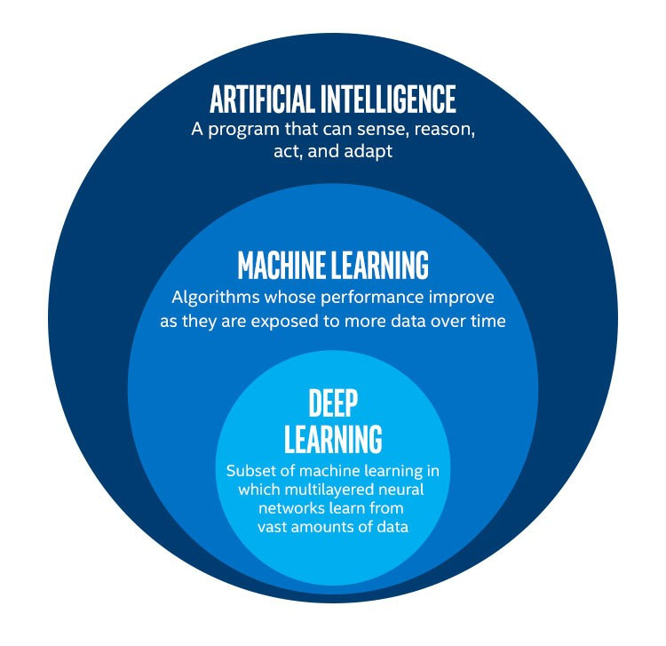

> 來源:https://www.logicmonitor.com/blog/troubleshoot-faster-with-anomaly-visualization

在這張圖片我可以知道我們所說的AI其實包含者許許多多的技術，像是`機器學習(Machine Learning)`就是AI裡面的其中一個分支，在機械學習中`深度學習((Deep Learning)`又是另一個分支，那麼他們的差異在哪呢?

人工智慧(Artificial Intelligence)
-----------------------------

在這邊AI的定義是`人製造出來的機器所能表現出來的智慧`都能夠稱之為AI，那該怎麼知道程式有沒有智慧呢?在1950年，圖靈提出了一個叫做`圖靈測試(Turing test)`實驗，這個實驗的內容非常的簡單，如果一個人(A)詢問這個機器人問題，但回答方一個是由真人(B)，另一個則是電腦(C)，並經過多輪的實驗，看A能不能每次都正確判斷B與C，只要A沒辦法分辨出來，那我們就可以說C是一種AI技術。

那撇除掉深度學習與機器學習這裡的AI還有什麼技術呢?在這邊比較有名的就是`專家系統(Expert System)`，這項技術的核心其實就是資料庫加上`推理機(Inference Engine)`，通過推理的資料庫中的路線找到最合適的解答。

ex:創建某個疾病的常見回答資料庫，並通過推理找到最合適的答案。

機器學習(Machine Learning)
----------------------

機器學習是人工智慧的分支之一那麼差別在哪呢?剛剛提到的專家系統需要靠者許多專家建立資料，花費太多人力與時間，而在機器學習的領域中就能改善這項問題，因為機器學習最重要的技術就是讓`機器可自主學習`。

這裡讓機器學習的方式分成以下4種`監督學習（Supervised Learning）`、`非監督學習（Unsupervised Learning）`、`半監督學習（Semi-supervised Learning）`與`強化學習（Reinforcement Learning）`。

### 監督學習（Supervised Learning）

監督式學習的資料集是由輸入資料和人工標註物件出所組成的，通過資料集建立`模式（learning model）`，在觀察完一些先前標記過的訓練範例（輸入資料和人工標註物件出）後，去預測這個模式可能出現的輸入與輸出，在機器學習中常見的有KNN演算法、SVM。

目前這種學習的方式基本用於深度學習的`迴歸(Regression)`任務與`分類(classifier)`任務中，像是之前實作的迴歸任務的股票預測，以及分類任務的IMDB影評情感分析、CRIFT10影像辨識、MNIST手寫辨識都是屬於監督學習。

### 非監督學習（Unsupervised Learning）

非監督學習與監督學習差別在於沒有預期輸出(也就是人工標註的物件)，這種學習方式，會透過演算法將自行尋找出資料的規律，在機器學習中經常會用在把資料`分群(clustering )`上。

而非監督學習在深度學習中在我們的日常生活中就有很多案例了，例如:IG與抖音上的濾鏡、贏得美術比賽的AI繪圖軟體Midjourney、日本推特上引發熱門議題的仿畫繪圖工具Mimic都是屬於非監督是學習訓練出來的結果。

### 半監督學習（Semi-supervised Learning）

半監督學習的方式比較特殊，他與監督學習很相似，只差在我們資料的label並不是完整的，例如我們的資料集中只有100筆有標註，但卻有1000筆資料，這種訓練方式就會特過100筆的資訊推測並訓練其他900張圖片的結果最常見的技術就是生成任務。

### 強化學習（Reinforcement learning）

這種學習方式就與先前的三種不同了，這種學習方式會透過與電腦互動的方式不斷的計算，來達到最終設定的目標，簡單來說就是我每做出一個動作前，電腦就會計算出我的下一步分數是最高的，並且通過動態的方式不斷的改變這些分數，像是幾年前引發議題的AlphaGo就是以這種方式訓練出來的。

深度學習
----

我們剛剛可以看到在機械學習中講到了許多深度學習的內容，因為深度學習是機械學習的分支，所以機械學習中的概念大多能套用至深度學習，而兩者最大的差異就在於是不是能`自動找到特徵`與`神經網路層`。

在深度學習中我們只需要設定好各神經網路參數就能通過訓練自動截取特徵，並且通過不同神經網路的演算法找到一個最佳的結果，但機械學習中我們卻需要自行找到特徵，在把這個特徵放入的單一的演算法當中。

結論
--

今天看完了這些知識有沒有注意到，深度學習只是在AI這領域的一小部分，且我們在日常生活中也能看到這些模型的應用(車牌辨識、google翻譯、人臉辨識、物件檢測...等)，而且在AI比賽當中有時取得最佳成績的是機器學習的方式，所以我們明天來看一些機器學習的技術吧。

---

<a id="5607-day-11"></a>

## Day 11｜【day11】集成式學習 & 使用xgboost過濾垃圾郵件

- 原文：https://ithelp.ithome.com.tw/articles/10290632

集成式學習(Ensemble learning)
------------------------

`集成式學習(Ensemble learning)`是一種機器學習的學習方式，這種學習方式是將好幾個監督式學習的模型結合在一起，來獲得比使用單獨學習算法更好的效果。我們可以將它這學習方式分成三類，分別是`引導聚集算法(Bagging)`，`提升方法(Boosting)`，`堆疊法(Stacking)`。

引導聚集算法(Bagging)
---------------

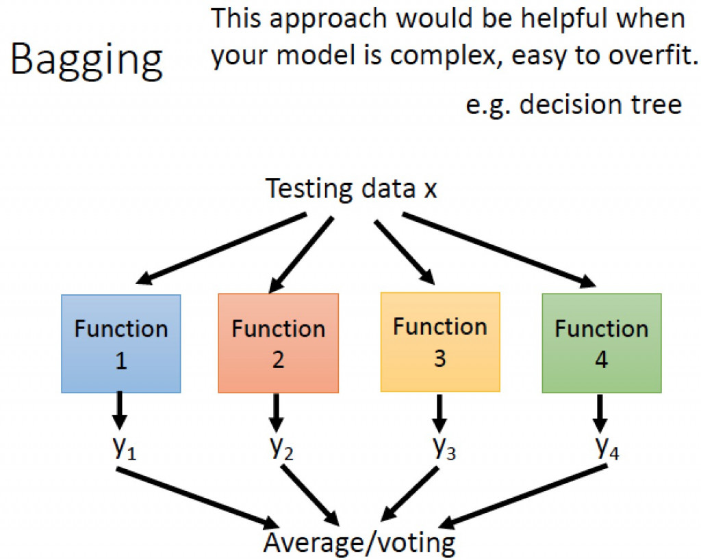

> 圖片來源:李弘毅老師youtube影片

引導聚集算法(Bagging)模型是基於統計學中的`自助法(Bootstrapping)`來實現的，這種算法是將資料集隨機抽樣建立類群後，在重新抽取下一個類群，不斷的重複這個過程後，訓練每個類群的結果拿來做整合，如果是迴歸任務，則會做平均。舉一個例子來說:我們從一個球池裡面隨機抽取幾個球並記錄裡面球的特徵，之後在放回球池當中，在繼續重複這樣的動作，最後統計每一個類群裡球的特徵找到最好的結果，常見的例子有`隨機森林(Random Forest)`與`決策樹(Decision Tree)`。

提升方法(Boosting)
--------------

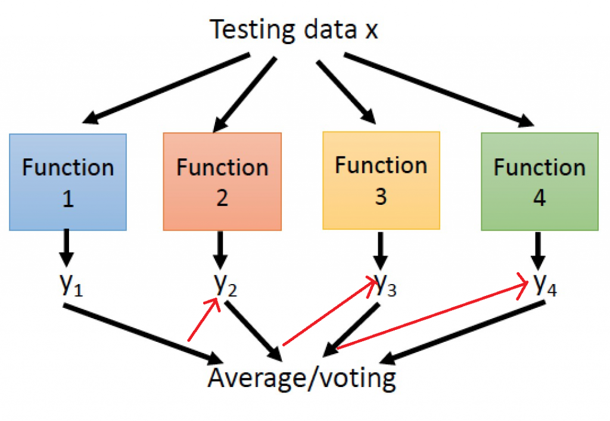

提升方法(Boosting)主要用來減小監督式學習中偏差與方差，一樣會先隨機抽取資料並分類，並通過迭代學習去計算這次模型的誤差(圖片中的紅色箭頭)，之後更新每個樣本被抽到的機率，若前一次分類錯誤率愈高，則權重愈大，最終將每次迭代的結果一起計算，常見的例子`極限梯度下降(Xgboost)`、`自適應增強(adaboost)`。

堆疊法(Stacking)
-------------


> 圖片來源:https://www.geeksforgeeks.org/stacking-in-machine-learning-2/

堆疊法(Stacking)與引導聚集算法非常的相似，只差在一個是訓練`部分資料`，一個是訓練`全部的資料`，意思就是堆疊法訓練出獨立模型，當作最終模型的輸入特徵，並且訓練這個最終模型，藉由這種方式補足某個模型中缺失的資訊，增強迷型的效果。

過濾垃圾郵件
------

今天的目錄如下:

1.安裝函式庫與建立基本環境

2.資料前處理

3.訓練模型

4.測試與比較

安裝函式庫與建立基本環境
------------

### 安裝函式庫

```
pip install xgboost
```

### 引用函式庫

```
import pandas as pd
import numpy as np
import random
from sklearn.feature_extraction.text import TfidfVectorizer
from sklearn.ensemble import RandomForestClassifier
from xgboost import XGBClassifier
from sklearn.tree import DecisionTreeClassifier
```

### 導入資料集

今天的資料集是SMSSpamCollection[點我下載](https://www.kaggle.com/datasets/uciml/sms-spam-collection-dataset)，這個資料集包含者垃圾郵件與真實有用的文件，今天要做的事就是抽取個文件的特徵與分類。我們先利用pandas讀取資料後在開始做資料前處理吧

```
data = pd.read_csv('SMSSpamCollection.csv')
```

資料前處理
-----

還記得我說過機器學習與深度學習差距究竟在哪嗎?沒錯就是`特徵抽取(Feature extraction)`的部分，所以我們在資料處理時就需要加入這一個步驟，而在文本中有一個非常好用的技術叫做`TF-IDF(Term Frequency-Inverse Document Frequency)`，這個技術分成兩個部分`詞頻（Term Frequecny）`與`逆向文件頻率（Inverse Document Frequency）`。

我們來先看一下TF(詞頻)的公式計算

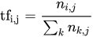

> 來源:https://zh.m.wikipedia.org/zh-tw/Tf-idf

在維基百科中是這樣解釋這個公式的


這樣是不是有一點複雜?其實TF的概念就是出現在文本中的次數越多次，代表這個單字越沒有獨特性所以計算起來的分數越低。所以這公式的的意思其實就是`文字/文字在"單一文件"出現的次數`。

那IDF(逆向文件頻率)是什麼呢?從名稱中可以了解他是一種反向的詞頻計算方式，他的概念與TF相反，在全部的文件中文字出現的越少，代表這文字該資料中是越有獨特性的。

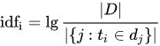

> [https://zh.m.wikipedia.org/zh-tw/Tf-idf](https://zh.m.wikipedia.org/zh-tw/Tf-idf)
> 
> 
> 
> 所以這公式又能解讀成`log10(文字/文字出現在"全部文件"次數)`

為了使我們的資料能夠使用TF-IDF這項技術，所以我們需要先分類出垃圾郵件與真實使用到的郵件。

```
def classfier(data):
    real, fake = [], []      
    for text, label in zip(data['sms'].values, data['class'].values):
        if label == 'spam':
            #記得將文字轉小寫
            fake.append(text.lower())
        else:
            real.append(text.lower())
    return fake,real
```

再來透過sklearn計算出這兩個文件TF-IDF分數，但在這邊要注意回傳的結果並不會是有順序的排列，所以我們還需要再另外寫一個function做`氣泡序法(Bubble Sort)`，將數值從大到小排列出來方便我們取用。

```
def getTopScore(data,text):
    n = len(data)
    while n > 1:
        n-=1
        for i in range(n):
            #若右側資料比左邊大就交換
            if data[i] < data[i+1]:  
                #文字
                text[i], text[i+1] = text[i+1], text[i]
                #數值
                data[i], data[i+1] = data[i+1], data[i]
    return text
```

之後就能用計算TF-IDF分數，並使用剛剛建立的function創建前200分數最高的文字，作為資料的特徵。

```
def getTfIdfText(fake,real,max_val = 200):
    #宣告變數
    vectorizer = TfidfVectorizer()
    #計算TF-IDF
    X = vectorizer.fit_transform([' '.join(fake),' '.join(real)]).toarray()
    #計算分數最高的文字
    fake_text_top = getTopScore(X[0],vectorizer.get_feature_names())
    real_text_top = getTopScore(X[1],vectorizer.get_feature_names())
    #回傳指定的最大結果
    return fake_text_top[:max_val],real_text_top[:max_val]
```

接下來我們通過這200個字將我們的原始資料轉換成數字的格式，若是數字有出現我們就設定2，若沒有出現那就設定成1，若超過範圍我們就做zero padding。

```
def text2num(data, top):
    result = []
    for i in data:
        tmp = []
        for j in i.split(' '):
            if j in top:
                tmp.append(2)
            else:
                tmp.append(1)
        if len(tmp)<80:
            tmp = tmp + (80-len(tmp))*[0]
        else:
            tmp = tmp[:80]
        result.append(tmp)
        tmp = []
    return result
```

接下來需要將資料拆分成測試數據與訓練數據來驗證程式的準確率，為了讓資料平均分布我們要先將真實郵件與垃圾郵件分別依照比例分割。

```
def splitData(data, split_rate=0.8):
    cnt = int(len(data)*split_rate)
    train_data=data[:cnt]
    test_data =data[cnt:]
    
    return train_data,test_data
    
f_train,f_test = splitData(fake_data)
r_train,r_test = splitData(real_data)
```

並將分割的數據組合起來並給予他們label，且需要打亂資料以免造成overfitting(前面學到的都是0後面學到都是1)

def randomShuffle(x_batch,y_batch,seed=100):

random.seed(seed)

random.shuffle(x_batch)

random.seed(seed)

random.shuffle(y_batch)

```
return x_batch,y_batch
```

train_data,train_label = randomShuffle(f_train+r_train,[0 for i in range(len(f_train))]+[1 for i in range(len(r_train))])

test_data,test_label = randomShuffle(f_test + r_test,[0 for i in range(len(f_test))]+[1 for i in range(len(r_test))])

這樣就完成資料前處理了

測試與比較
-----

首先我們先使用決策樹、亂數森林與極限梯度下降法這三個機器學習模型訓練。

我們先快速的建立一下訓練的function

```
def train(train_data,train_label):
    #決策樹模型
    model_tree = DecisionTreeClassifier(criterion = 'entropy', max_depth=6, random_state=42)
    #訓練
    model_tree.fit(train_data, train_label)
    #預測結果
    y_hat_tree = model_tree.predict(train_data)
    
    #亂樹森林模型
    model_RF = RandomForestClassifier(n_estimators=10, max_depth=None,min_samples_split=2, random_state=0)
    #訓練
    model_RF.fit(train_data, train_label)
    #預測結果
    Y_hat_RF = model_RF.predict(train_data)
    
    #極限梯度下降法模型
    model_xgboost = XGBClassifier(n_estimators=100, learning_rate= 0.3)
    #訓練
    model_xgboost.fit(train_data, train_label)
    #預測結果
    Y_hat_xg = model_xgboost.predict(train_data)
    
    #找到label大小作為準確率的分母
    n=np.size(train_label)
    #顯示機率
    print('Accuarcy decisionTree: {:.2f}%'.format(sum(np.int_(y_hat_tree==train_label))*100./n))
    print('Accuarcy RandomForest: {:.2f}%'.format(sum(np.int_(Y_hat_RF==train_label))*100./n))
    print('Accuarcy XgBoost: {:.2f}%'.format(sum(np.int_(predicted==train_label))*100./n))
```

在這邊可以看到，在機器學習中建立模型的方式非常的簡單，只需要三步驟:`宣告`、`訓練`、`看結果`，就能完成訓練，且速度與深度學習相比快了好幾倍，因為我們只是通過**公式的運算**，而不是訓練**神經網路**，那我們來看一下最後訓練的結果。

```
訓練:
Accuarcy decisionTree: 88.31%
Accuarcy RandomForest: 99.42%
Accuarcy XgBoost: 98.95%
測試:
Accuarcy decisionTree: 88.98%
Accuarcy RandomForest: 99.46%
Accuarcy XgBoost: 99.46%
```

我們可以看到決策樹的效果相當的不好，最大的原因就是他每次規劃的路徑都是相同的這代表我們使用決策樹，最後的結果一定會overfitting。而亂樹森林則是以決策樹的方式加以改良，使用隨機抽取資料的方式，大幅增進最終的運算結果。今天的重頭戲xgoost可以看到在訓時準確率較低，但測試數據的準確率卻與亂樹森林相同，這是因我們們的資料比較單調以及數量較少的原因，若今天資料量較多xgboost能夠跌代計算出來的結果就會越準確，那差距就會與亂樹森林以及決策樹更大了。

課程中的程式碼都能從我的github專案中看到

[https://github.com/AUSTIN2526/learn-AI-in-30-days](https://github.com/AUSTIN2526/learn-AI-in-30-days)

---

<a id="5607-day-12"></a>

## Day 12｜【day12】預訓練模型訓練 & 應用- 使用OpenCV製作人臉辨識點名系統 (上)

- 原文：https://ithelp.ithome.com.tw/articles/10291158
- 發佈時間：2022-09-16 01:38:53

到這邊我相信你已經有機器學習與深度學習的概念了，所以接下來的課程中我會開始來教一些預訓練模型的用法，而這次要做的就是使用OPENCV辨識人臉並成功點名，而我們今天要做的事情就是辨識臉部並創建自己的資料集。

辨識臉部
----

今天的目錄如下

*   1.開啟電腦鏡頭並顯示
*   2.下載xml與辨識臉部
*   3.減少電腦資源與可視化

開啟電腦鏡頭並顯示
---------

在開始辨識人臉之前我們需要打開電腦鏡頭，這裡可以使用opencv當中VideoCaptured()開啟鏡頭，但在windows當中卻有一些BUG存在，就是無法每次都成功的開啟，所以我們可以寫一個while迴圈，判斷鏡頭是否開啟，來解決這個問題。

```bash
#開啟鏡頭
cap = cv2.VideoCapture(0)
#確保鏡頭完整的開啟
while(not cap.isOpened()):
    cap = cv2.VideoCapture(0)
```

開啟鏡頭後，就能開始讀取資料了，透過cap.read()能讀取目前鏡頭的照片。

```go
#是否有圖片type:bool,圖片本身
ret, frame = cap.read()
```

但在市面上的人臉辨識系統，都是以影片的樣式來表達，所以我們需要利用肉眼視覺暫留(Persistence of vision)的方式將圖片轉成影片，所以我們要將cap.read()這個function放入到while()當中進行迴圈，最後通過imshow將結果顯示出來，並且能夠使用imwrite來儲存圖片()

```python
cnt = 0
while(True):
    ret, frame = cap.read()
    gray = cv2.cvtColor(frame, cv2.COLOR_BGR2GRAY)
    cv2.imshow('live', frame) 
    cv2.imwrite(f'face/my_face_{cnt}.jpg',frame)
```

這樣我們就可以取得很多的人臉圖片


但我們觀察這張圖片就會發現，照片中含有太多的不是人臉的資料，這樣在訓練時可能就會使準確率下降，甚至是underfitting，所以這時就需要使用opencv的臉部辨識器，來找到我們的人臉。

下載xml與辨識臉部
----------

首先我們前往opencv的github找到"haarcascade_frontalface_alt2.xml"[點我前往](https://github.com/mitre/biqt-face/blob/master/config/haarcascades/haarcascade_frontalface_alt2.xml)


之後點擊紅框處複製文字


最後貼上記事本上並將檔案名稱命名為"haarcascade_frontalface_alt2.xml"，這樣我們就有臉部辨識的設定檔了

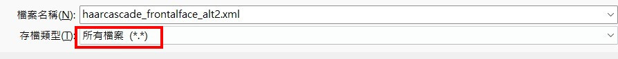

我們剛剛下載的是程式設定檔，所以還需加入模型本身，在這邊只需要使用CascadeClassifier()就能建立一個臉部辨識器了。

```ini
classfier = cv2.CascadeClassifier(cv2.data.haarcascades +"haarcascade_frontalface_alt2.xml")
```

減少電腦資源與可視化
----------

有了辨識器後我們需要去設定他的參數我們先看個範例

```ini
faceRects = classfier.detectMultiScale(gray, scaleFactor = 1.2, minNeighbors = 3, minSize = (32, 32))
```

首先說明一下這些參數的意思

`ScaleFactor`：每次搜尋方塊減少的比例

`minNeighbors`:矩形個數

`minSize`:檢測對象最小值

這樣是不是還是看不懂?因為opencv中是使用一種叫做`蒙地卡羅方法(Monte Carlo method)`的方式，這種方法的中心技術就是**猜**與**賭**，這種做法就像是捕魚一樣，我們先灑網出去猜這個區域究竟有沒有魚，若是有魚我們就開始縮小魚網的範圍，最後把魚抓上來。

我們來看看在opencv中會使用哪些做法，首先使用較大範圍的方格去辨識臉部，在opencv中是使`minNeighbors`這個參數是來辨別相鄰方格的關聯性，關聯性大於等於這個值時電腦才認為區域內有臉部。若區域內有臉部會透過`ScaleFactor`數值減少範圍大小，直到指定的最小範圍時`minSize`時縮小才會停止，而使用這種技術可使減少消耗電腦的資源，畢竟圖像資源是非常吃效能的。

了解後我們會知道，圖片會有機會找不到人臉，這時程式正在擴大範圍在偵測，此時會消耗非常多的效能，若是在繼續執行動作可能會導致程式出現意外狀況，所以我們需要設定成當有人臉時才繼續接續的動作。

```yaml
if faceRects:
```

當條件達成後代表faceRects裡面含有4個數值分別是`x軸座標`、`y軸座標`、`寬`、`長`，但可能不只讀到一張人臉，所以需要將程式寫在一個for迴圈中找到所有的人臉數值

```scss
for (x, y, w, h) in faceRects:
```

有了這些數值後我們能通過縮小圖片的範圍，並且畫出一個方形包住我們的人臉，代表程式有偵測到

```yaml
face = frame[y - 10: y + h + 10, x - 10: x + w + 10]
#圖片,座標,長寬,線條顏色,粗度
cv2.rectangle(frame, (x - 10, y - 10), (x + w + 10, y + h + 10), (0,255,0), 2)
```

為了增加辨識臉部的準確率先將資料轉換成灰階，這可以使小區域的亮度降低防止單一像素過亮的問題，這種做法並不會改變圖片整體的亮度。

```ini
gray = cv2.cvtColor(frame, cv2.COLOR_BGR2GRAY)
```

我們的程式是寫在一個while迴圈中，所以我們要設定一個跳脫條件，我們可以設定成按Q件離開，並且在離開後需要將視窗與鏡頭都一起關閉。

```perl
#按Q跳脫迴圈
if cv2.waitKey(1) == ord('q'):
    break
    
#釋放鏡頭
cap.release()
#關閉視窗
cv2.destroyAllWindows()
```

最後將程式碼組合在一起就完成取得人臉的方式了

完整程式碼
-----

```go
import cv2

cap = cv2.VideoCapture(0)
while(not cap.isOpened()):
    cap = cv2.VideoCapture(0)
    
cnt = 0
classfier = cv2.CascadeClassifier(cv2.data.haarcascades +"haarcascade_frontalface_alt2.xml")
while(True):
    ret, frame = cap.read()
    gray = cv2.cvtColor(frame, cv2.COLOR_BGR2GRAY)

    faceRects = classfier.detectMultiScale(gray, scaleFactor = 1.2, minNeighbors = 3, minSize = (32, 32))

    if len(faceRects) > 0:      
        for (x, y, w, h) in faceRects:
            face = frame[y - 10: y + h + 10, x - 10: x + w + 10]
            c
            cnt+=1
            cv2.imwrite(f'face/my_face_{cnt}.jpg',face)
    
    if cv2.waitKey(1) == ord('q'):
        break
        
    cv2.imshow('live', frame)

cap.release()
cv2.destroyAllWindows()
```

今天的難度是不是變成比較低了呢?因為今天只是在玩一些opencv的套件，明天的難度會開始提升，因為會來玩一下預訓練模型VGG-16

---

<a id="5607-day-13"></a>

## Day 13｜【day13】預訓練模型訓練 & 應用- 使用OpenCV製作人臉辨識點名系統 (下)

- 原文：https://ithelp.ithome.com.tw/articles/10291607

還記得我們在使用LSTM或是CNN時都需要創建Data與Label並花費一些時間訓練我們的神經網路嗎?我相信在訓練神經網路時是會花費相當多的時間的，我們在訓練的這些資料可能只有5萬筆訓練完的時間大約1分鐘左右就可以完成。但如果我們所訓練的資料是幾百萬或幾千萬呢?那就算是3090ti訓練一個月都還跑不完，若我們很需要這一些的訓練的結果呢?那就只能去找看看有沒有人有相似的模型來修改，所以這時就有`遷移學習(Transfer Learning)`這種方式來幫助我們。

遷移式學習(Transfer Learning)
------------------------

首先我們知道，在訓練神經網路後，網路會學習到許多特徵資料與權重，以CNN神經網路為例，在捲積層與池化層會做特徵強化與擷取特徵的動作，最後通過全連接層計算結果。而在遷移式學習中就是將擷取特徵(進入全連接層前的資料)提取出來，並且通過我們任務的需求，去微調這些特徵的權重也就是**用前一個模型的特徵，來找到我們想要的結果**。

預訓練模型
-----

知道的遷移式學習的概念，是不是知道預訓練模型的名稱由來了?因為我們這個模型就被訓練過了，我們只需將這模型的特徵運用在我們的某層神經網路之內，或是對原始模型進行微調就能的到一個很好的結果。目前的預訓練模型分為兩種方式，分別是`基於特徵(feature-based)`與`微調(fine-tuen)`的方法。

`基於特徵(feature-based)`:這一種做法是使用一個經過大數據訓練過的模型結果(通常是特徵值)，套入到模型的其中一層，並且通過自己的資料集，不斷的調整與學習資料。舉個例子在我們[【day9】 讓電腦了解文字資料 & 使用Pytorch做IMDB影評分析](https://ithelp.ithome.com.tw/articles/10289649)中，使用到的神經網路embedding，在第9天我們是通過LSTM的文字前後關係，去更新embedding中的數值變化，若使用基於特徵的預訓練模型像是`ELMO`、`Word2Vec`，就能夠直接在embedding層當中導入這些已經被訓練好的特徵，這樣的效果就會比從0開始好非常的多。

`微調(fine-tuen)`:這種方法會保留原始模型，讓我們新增資料去調整這個原始模型**各階層之間的權重**，之後通過一個額外的接口(fine-tunr中主要是訓練這個接口)，來實現各種不同的`下游任務`，使一個模型來完成多種不同的結果，例如:BERT可以做問答機器人，也可以做分類器，也就是因為這種特性，下游任務的寫法也成為了另一個議題。

1.實作辨識人臉
--------

今天的目錄如下:

*   1.VGG-16介紹
*   2.下載資料與資料前處理
*   3.創建資料集
*   4.使用VGG-16模型並訓練
*   5.VGG-16完整程式碼

VGG-16簡介
--------

在開始寫程式之前我們需要了解一下VGG-16內部構造。VGG-16最重要的概念就是使用大量的3x3捲積核來實現大捲積核的資料，例如:假設輸入為8、步長為1的CNN神經網路，5x5的捲積核最終輸出會是4(輸入-捲積核大小 + 1)，而3x3的捲積核，使用兩次輸出結果也會是4(第一次8-3+1=6 第二次6-3+1=4)，這代表一個5x5的捲積核可以通過2個3x3的捲積核來表達，這種做法的好處，就是在3x3中的捲積核**保留了更多圖像的特徵值**。


> 來源:http://deanhan.com/2018/07/26/vgg16/

可以看到在VGG16的架構圖中其實就是一個CNN的神經網路，但通過大量的數據與拆解捲積核的方式卻能大幅提升準確率

下載資料與資料前處理
----------

了解到VGG16的構造後，就可以開始使用Pytorch實作了，首先為了辨識這個人到底是誰，我們還需要一筆資料，也就是別人的人臉資料，來區分我們需要點名的對象，我們可以先到kaggle下載這些人臉的資料[點我下載](https://www.kaggle.com/datasets/mayumin8211/face-img?resource=download)。

之後我們創建以下的資料夾與檔案，並且開啟jupyter notebook來開始今天的實作

code

└─data(放資料的資料夾)

| ├─myface(放自己臉部的資料夾)

| └─other(放剛剛下載的圖片的資料夾)

└─VGG-16.ipynb(jupyter notebook的檔案)

import今天會用到的函式庫

```
import torch
import torch.nn as nn
import torch.optim as opt
import torch.nn.functional as F
import torchvision as tv
from torch.autograd import Variable
from torch.utils.data import Dataset, DataLoader,random_split
show = tv.transforms.ToPILImage()
```

接下來使用transforms.Compose()來創建要對圖片的操作，在這邊最重要的事情是我們需要將圖片縮放到224x224，因為這是VGG-16的輸入格式

```
transform = tv.transforms.Compose([
    #轉成tensor格式
    tv.transforms.ToTensor(),
    #將短邊等比放大成224
    tv.transforms.Resize(224),
    #裁切多於的部分
    tv.transforms.CenterCrop(224),
    #正規化
    tv.transforms.Normalize(mean=[0.5, 0.5, 0.5], std=[0.5, 0.5, 0.5])])
```

這樣就能完成資料前處理了

創建資料集
-----

還記得前幾天最麻煩的事情嗎?就是使用class的方式建立dataset，在pytorch當中建立"圖片"的dataset其實很容易搞定，只需要將圖片放入到不同資料夾當中，就可以用tv.datasets.ImageFolder()一次性的將資料變成dataset，還能指定參數，去完成前處理的工作，這樣子做是不是能夠省下許多時間呢。

```
data = tv.datasets.ImageFolder('../data/',transform = transform)
train_num = int(len(data)*0.7)
test_num =len(data)-train_num
train_set, test_set = torch.utils.data.random_split(data, [train_num,test_num])
batch_size = 4
train_loader = DataLoader(train_set, batch_size = batch_size,shuffle = True, num_workers = 0)
test_loader = DataLoader(test_set, batch_size = batch_size, shuffle = True, num_workers = 0)
```

我們的資料變成dataset後會依照資料夾名稱排列來當作label，像是我們我們的兩個資料夾myface與other可以知道按照英文排序m比o還要早出現，所以myface的label就會為0，other就會是1，我們可以觀察一下的資料是否如同我們所想並且顯示照片。

```
#label轉換成名稱
classes = {0:'myface', 1:'other'}
#返回處理過後的圖片與label
img, label = data[2000]
顯示名稱
print(classes[label])
#還原正規化結果並顯示
show(img*0.5+0.5)
```


### 使用VGG-16模型並訓練

pytorch中可以通過tv.models.vgg16函式，下載VGG-16的預訓練模型，之後只需要設定好優化器與損失函數就能開始訓練了。

```
model = tv.models.vgg16(pretrained=True).cuda()
criterion = nn.CrossEntropyLoss().cuda()
optimizer = opt.Adam(model.parameters(), lr=0.0001)
```

當我們不知道模型的架構時，可以使用print()來查看模型的疊法與詳細參數

```
print(model)
----------------顯示----------
VGG(
  (features): Sequential(
    (0): Conv2d(3, 64, kernel_size=(3, 3), stride=(1, 1), padding=(1, 1))
    (1): ReLU(inplace=True)
    (2): Conv2d(64, 64, kernel_size=(3, 3), stride=(1, 1), padding=(1, 1))
    (3): ReLU(inplace=True)
    (4): MaxPool2d(kernel_size=2, stride=2, padding=0, dilation=1, ceil_mode=False)
    (5): Conv2d(64, 128, kernel_size=(3, 3), stride=(1, 1), padding=(1, 1))
    (6): ReLU(inplace=True)
    (7): Conv2d(128, 128, kernel_size=(3, 3), stride=(1, 1), padding=(1, 1))
    (8): ReLU(inplace=True)
    (9): MaxPool2d(kernel_size=2, stride=2, padding=0, dilation=1, ceil_mode=False)
    (10): Conv2d(128, 256, kernel_size=(3, 3), stride=(1, 1), padding=(1, 1))
    (11): ReLU(inplace=True)
    (12): Conv2d(256, 256, kernel_size=(3, 3), stride=(1, 1), padding=(1, 1))
    (13): ReLU(inplace=True)
    (14): Conv2d(256, 256, kernel_size=(3, 3), stride=(1, 1), padding=(1, 1))
    (15): ReLU(inplace=True)
    (16): MaxPool2d(kernel_size=2, stride=2, padding=0, dilation=1, ceil_mode=False)
    (17): Conv2d(256, 512, kernel_size=(3, 3), stride=(1, 1), padding=(1, 1))
    (18): ReLU(inplace=True)
    (19): Conv2d(512, 512, kernel_size=(3, 3), stride=(1, 1), padding=(1, 1))
    (20): ReLU(inplace=True)
    (21): Conv2d(512, 512, kernel_size=(3, 3), stride=(1, 1), padding=(1, 1))
    (22): ReLU(inplace=True)
    (23): MaxPool2d(kernel_size=2, stride=2, padding=0, dilation=1, ceil_mode=False)
    (24): Conv2d(512, 512, kernel_size=(3, 3), stride=(1, 1), padding=(1, 1))
    (25): ReLU(inplace=True)
    (26): Conv2d(512, 512, kernel_size=(3, 3), stride=(1, 1), padding=(1, 1))
    (27): ReLU(inplace=True)
    (28): Conv2d(512, 512, kernel_size=(3, 3), stride=(1, 1), padding=(1, 1))
    (29): ReLU(inplace=True)
    (30): MaxPool2d(kernel_size=2, stride=2, padding=0, dilation=1, ceil_mode=False)
  )
  (avgpool): AdaptiveAvgPool2d(output_size=(7, 7))
  (classifier): Sequential(
    (0): Linear(in_features=25088, out_features=4096, bias=True)
    (1): ReLU(inplace=True)
    (2): Dropout(p=0.5, inplace=False)
    (3): Linear(in_features=4096, out_features=4096, bias=True)
    (4): ReLU(inplace=True)
    (5): Dropout(p=0.5, inplace=False)
    (6): Linear(in_features=4096, out_features=1000, bias=True)
  )
```

最後訓練的部分基本上不會改變，所以我們直接把前幾天的程式抄過來，就能夠正常訓練了

```
epochs = 10
for epoch in range(epochs):
    train_loss = 0
    train_acc = 0
    train = tqdm(train_loader)

    model.train()
    for cnt,(data,label) in enumerate(train, 1):
        data,label = data.cuda() ,label.cuda()
        outputs = model(data)
        loss = criterion(outputs, label)
        _,predict_label = torch.max(outputs, 1)

        optimizer.zero_grad()           
        loss.backward()
        optimizer.step()

        train_loss += loss.item()
        train_acc += (predict_label==label).sum()
        train.set_description(f'train Epoch {epoch}')
        train.set_postfix({'loss':float(train_loss)/cnt,'acc': float(train_acc)/(cnt*batch_size)*100})

    model.eval()
    test = tqdm(test_loader)
    test_acc = 0
    for cnt,(data,label) in enumerate(test, 1):
        data,label = data.cuda() ,label.cuda()
        outputs = model(data)
        _,predict_label = torch.max(outputs, 1)
        test_acc += (predict_label==label).sum()
        test.set_description(f'test Epoch {epoch}')
        test.set_postfix({'acc': float(test_acc)/cnt})
```

可以看到結果第一次訓練準確率就高達了96.8%，這是一個非常好的效果。

```
train Epoch 0: 100%|███████████████████████████████████████████| 264/264 [01:54<00:00,  2.30it/s, loss=0.527, acc=92.8]
test Epoch 0: 100%|████████████████████████████████████████████████████████| 113/113 [00:16<00:00,  6.92it/s, acc=96.8]
```

訓練好了就能將我們數據集的權重保存下來之後連結上opencv了

```
torch.save(model.state_dict(), 'model_weights.pth')
```

訓練完整程式碼
-------

```
import torch
import torch.nn as nn
import torch.optim as opt
import torch.nn.functional as F
import torchvision as tv
from torch.autograd import Variable
from torch.utils.data import Dataset, DataLoader,random_split
from tqdm import tqdm
show = tv.transforms.ToPILImage()

transform = tv.transforms.Compose([tv.transforms.ToTensor(),
            tv.transforms.Resize(224),
            tv.transforms.CenterCrop(224),                                
            tv.transforms.Normalize(mean=[0.5, 0.5, 0.5], std=[0.5, 0.5, 0.5])
                               ])
                               
data = tv.datasets.ImageFolder('data/',transform = transform)
train_num = int(len(data)*0.7)
test_num =len(data)-train_num
train_set, test_set = torch.utils.data.random_split(data, [train_num,test_num])

batch_size = 16
train_loader = DataLoader(train_set, batch_size = batch_size,shuffle = True, num_workers = 0)
test_loader = DataLoader(test_set, batch_size = batch_size, shuffle = True, num_workers = 0)
model = tv.models.vgg16(pretrained=True).cuda()
criterion = nn.CrossEntropyLoss().cuda()
optimizer = opt.Adam(model.parameters())

epochs = 1
for epoch in range(epochs):
    train_loss = 0
    train_acc = 0
    train = tqdm(train_loader)

    model.train()
    for cnt,(data,label) in enumerate(train, 1):
        data,label = data.cuda() ,label.cuda()
        outputs = model(data)
        loss = criterion(outputs, label)
        _,predict_label = torch.max(outputs, 1)

        optimizer.zero_grad()           
        loss.backward()
        optimizer.step()

        train_loss += loss.item()
        train_acc += (predict_label==label).sum()
        train.set_description(f'train Epoch {epoch}')
        train.set_postfix({'loss':float(train_loss)/cnt,'acc': float(train_acc)/(cnt*batch_size)*100})

    model.eval()
    test = tqdm(test_loader)
    test_acc = 0
    for cnt,(data,label) in enumerate(test, 1):
        data,label = data.cuda() ,label.cuda()
        outputs = model(data)
        _,predict_label = torch.max(outputs, 1)
        test_acc += (predict_label==label).sum()
        test.set_description(f'test Epoch {epoch}')
        test.set_postfix({'acc': float(test_acc)/(cnt*batch_size)*100})
        
torch.save(model.state_dict(), 'model_weights.pth')
```

是不是覺得少了很多pytorch的程式碼，因為我這次使用了快速創立資料的方式與預訓練模型，減少了建立dataset與創建model的步驟。接下來我們把model放入到opencv中吧。

2.人臉辨識點名系統
----------

我們使用了opencv來找到我們影像中的臉部，也使用了VGG-16預訓練模型來增加預測人臉的效果，那是時候將這兩個技術結合在一起了。

*   1.建立初始環境
*   2.將模型加入鏡頭並顯示結果
*   3.VGG-16完整程式碼

建立初始環境
------

我們一樣先從導入函式庫開始

```
import torchvision as tv
import pandas as pd
import torch
import datetime
import cv2
```

接下來把把模型、權重、點名表、臉部辨識器...等資料先載入進系統。

```
#需要辨識的人名(按照名稱排列)
name = ['myface','other']
#導入VGG-16模型
model = tv.models.vgg16(pretrained=True).eval()
#讀取訓練好的權重
model.load_state_dict(torch.load('model_weights.pth'))
#利用年月日創建資料
excel_path = 'attend/' + datetime.datetime.now().strftime('%Y-%m-%d') + '.csv'  
try:
    df = pd.read_csv(excel_path, index_col="ID")
except:
    df = pd.DataFrame([[i,'未簽到'] for i in name],columns=['ID', '簽到日期'])
    df.to_csv(excel_path, encoding='utf_8_sig', index=False)
    df = pd.read_csv(excel_path, index_col="ID")

#圖像正規化操作
transform = tv.transforms.Compose([
    tv.transforms.ToTensor(),
    tv.transforms.Resize(224),
    tv.transforms.CenterCrop(224),
    tv.transforms.Normalize(mean=[0.5, 0.5, 0.5], std=[0.5, 0.5, 0.5])]) 
臉部辨識器
classfier = cv2.CascadeClassifier(cv2.data.haarcascades +"haarcascade_frontalface_alt2.xml")
```

將模型加入鏡頭並顯示結果
------------

在訓練時怎麼處理圖片，實際使用就需要用相同的方式，但因為圖片的維度是(3,224,224)，訓練時卻是使用(圖片數量,3,224,224)，所以需要再加入一個維度在第0維來解決這個問題。

```
face = transform(face)
#新增維度並預測
result = model(face.unsqueeze(0))
```

之後需要判斷這個人是否簽到完畢，如果有就不用再重新刷新時間了。最後我們在把使用者的ID放在畫面上

```
faceID = name[int(faceID[0])]
if df.loc[faceID]['簽到日期']=='未簽到':
    df.loc[faceID]['簽到日期'] = datetime.datetime.now().strftime('%Y-%m-%d %H:%M:%S')
    df.to_csv(excel_path,encoding='utf_8_sig')
cv2.putText(frame,faceID ,(x - 30, y - 30),cv2.FONT_HERSHEY_SIMPLEX,0.5,(255,0,255),2)
```

一套人臉辨識點名系統，通常會將攝影機放置在一個固定的地方，並且需全天運轉，所以人臉辨識點名系統需要一個可以依照年月日不斷的創建excel的判斷式。

```
system_time = datetime.datetime.now().strftime('%H:%M:%S')
if system_time =='00:00:00': 
    excel_path = 'attend/' + datetime.datetime.now().strftime('%Y-%m-%d') + '.csv'
    df = pd.DataFrame([[i,'未簽到'] for i in name],columns=['ID', '簽到日期'])
    df.to_csv(excel_path, encoding='utf_8_sig', index=False)
    df = pd.read_csv(excel_path)
```

最後我們把昨天的程式與今天的部分組合起來就能以下的效果

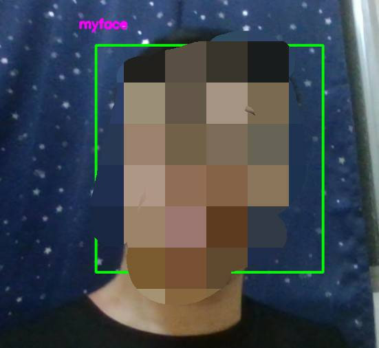

VGG-16版本完整程式碼
-------------

```
import torchvision as tv
import pandas as pd
import torch
import datetime
import cv2

name = ['myface','other']
model = tv.models.vgg16(pretrained=True).eval()
model.load_state_dict(torch.load('model_weights.pth'))
excel_path = 'attend/' + datetime.datetime.now().strftime('%Y-%m-%d') + '.csv'  
transform = tv.transforms.Compose([
    tv.transforms.ToTensor(),
    tv.transforms.Resize(224),
    tv.transforms.CenterCrop(224),
    tv.transforms.Normalize(mean=[0.5, 0.5, 0.5], std=[0.5, 0.5, 0.5])]) 
try:
    df = pd.read_csv(excel_path, index_col="ID")
except:
    df = pd.DataFrame([[i,'未簽到'] for i in name],columns=['ID', '簽到日期'])
    df.to_csv(excel_path, encoding='utf_8_sig', index=False)
    df = pd.read_csv(excel_path, index_col="ID")
classfier = cv2.CascadeClassifier(cv2.data.haarcascades +"haarcascade_frontalface_alt2.xml")

    
cap = cv2.VideoCapture(0)
while(not cap.isOpened()):
    cap = cv2.VideoCapture(0)
    
cnt = 0
classfier = cv2.CascadeClassifier(cv2.data.haarcascades +"haarcascade_frontalface_alt2.xml")

while(True):
    ret, frame = cap.read()
    gray = cv2.cvtColor(frame, cv2.COLOR_BGR2GRAY)

    faceRects = classfier.detectMultiScale(gray, scaleFactor = 1.2, minNeighbors = 3, minSize = (32, 32))

    if len(faceRects) > 0:      
        for (x, y, w, h) in faceRects:
            cv2.rectangle(frame, (x - 10, y - 10), (x + w + 10, y + h + 10), (0,255,0), 2)
            face = frame[y - 10: y + h + 10, x - 10: x + w + 10]
            face = transform(face)
            result = model(face.unsqueeze(0))
            _,faceID = torch.max(result,1)
            faceID = name[int(faceID[0])]
            cv2.putText(frame,faceID ,(x - 30, y - 30),cv2.FONT_HERSHEY_SIMPLEX,0.5,(255,0,255),2)
            
            if df.loc[faceID]['簽到日期']=='未簽到':
                df.loc[faceID]['簽到日期'] = datetime.datetime.now().strftime('%Y-%m-%d %H:%M:%S')
                df.to_csv(excel_path,encoding='utf_8_sig')
                    
    if cv2.waitKey(1) == ord('q'):
        break
    
    system_time = datetime.datetime.now().strftime('%H:%M:%S')
    if system_time =='00:00:00': 
        excel_path = 'attend/' + datetime.datetime.now().strftime('%Y-%m-%d') + '.csv'
        df = pd.DataFrame([[i,'未簽到'] for i in name],columns=['ID', '簽到日期'])
        df.to_csv(excel_path, encoding='utf_8_sig', index=False)
        df = pd.read_csv(excel_path, index_col="ID")
        
    cv2.imshow('live', frame)

cap.release()
cv2.destroyAllWindows()
```

後話:更好的辨識方法Googl FaceNet
-----------------------

我們在使用VGG16的時候，新增或移除資料時都必須重新fine-tune模型，若有人離職或入職就須重新訓練程式，這樣子是很麻煩的事情，所以這時候就有方法叫做`Triplet Loss`，這一種loss function是將圖片的特徵映射到歐式距離中，選取特徵最不相像的圖片與最像的圖片同時進行特徵訓練來改進模型，這能夠使我們只需使用一張照片來創建臉部資料庫，不過我就不多講解這技術的應用了，有興趣的可以到我的git專案中看到Google的人臉辨識寫法[點我](https://github.com/AUSTIN2526/Facial-recognition-auto-login-system)

課程中的程式碼都能從我的github專案中看到

[https://github.com/AUSTIN2526/learn-AI-in-30-days](https://github.com/AUSTIN2526/learn-AI-in-30-days)

---

<a id="5607-day-14"></a>

## Day 14｜【day14】預測Hololive七期生的樣貌-生成式對抗網路(Generative Adversarial Network)(上)

- 原文：https://ithelp.ithome.com.tw/articles/10292214

GAN是一種使用深度學習的模型，GAN在訓練中所做的事情非常簡單，就是利用`判別器(Discriminator)`來判別`生成器(Generator)`所創建的圖片，我們舉一個簡單的例子來說明。

假設今天有一個手藝不好卻想要製作假抄(圖片)的人A(生成器)，與一個負責抓捕他的警察B(判別器)，那最一開始的結果肯定是A一直被B抓到，可是每次A都在被抓的時候能學到一些經驗，並更換一些方法，於是B開始越來越分辨不出來A所製作出來的鈔票是真還是假的，甚至到最後完全分辨不出來，那麼A所製作的鈔票就是一個完美的結果(生成圖片)

簡單來說GAN的概念就是`道高一尺，魔高一丈`，利用這種方是我們可以產生一些非常厲害的圖像，換臉、自動修圖、畫風轉移，AI畫畫與許許多多的IG抖音濾鏡，都是一種GAN技術在生活中能看見的技術。

資料蒐集
----

還記得我們在[【day5】爬蟲與股票預測-長短期記憶模型(Long short-term memory) (上)](https://ithelp.ithome.com.tw/articles/10288835)時介紹的爬蟲嗎?今天我們要使用的就是較困難的requests。

*   1.AJAX介紹
*   2.requests分析pixiv網站
*   3.建立瀏覽器環境
*   4.迴圈取得網站資料
*   5.整理資料並存檔

AJAX(Asynchronous JavaScript and XML)介紹
---------------------------------------

在傳統的網頁中，我們每次向伺服器請求資料時，伺服器會接收並處理傳來的請求，然後送回傳一個結果，但這個做法浪費了許多資源，因為請求與迴傳所看到的網站資訊大致上都相同，每次的請求都需要與伺服器之間做溝通，這會導致伺服器需要處理大量的資訊，導致使用者的網站常常卡住。而AJAX這個技術能夠只將必要的資訊送出，並回傳必要的資料，使我們只接收少量的資源達成相同的效果，那我們在網站中會看到那些AJAX的技術呢?我相信許多人每天都會用到只是不知道而已，這邊我舉幾個例子:youtube的影片清單網下滾動會更新，IG往下滾動會刷新資料，YT影片結束後會自動轉跳。這種在網站上發送請求後更改一小部分的技術基本上都是使用AJAX來達成的。

requests分析pixiv網站
-----------------

首先我們為了要預測hololive的未來成員，可以使用到現有成員圖片來推測未來的風格，但官方的圖片又非常的少，於是我將目標放在二創的圖片上，也就是其他繪師的創作。

我們先前往pixiv搜尋hololive，這時候可以看到這個網址

```
https://www.pixiv.net/tags/hololive
```

但當我們對這個網站發送請求時，會發現找不到想要的資料，pixiv中圖片都是動態請求的資料，所以我們只能取得一些靜態的資料

```
r = requests.get(url)
```


那該怎麼取得動態的資料呢?我們需要去偽造一個AJAX的請求方式

首先我們先按下F12到NetWork的地方


接下來在pixiv中點擊插畫


這時候就會看到NetWork中多出了許多資料，這些資料就是瀏覽器對網站使用的AJAX請求的方式

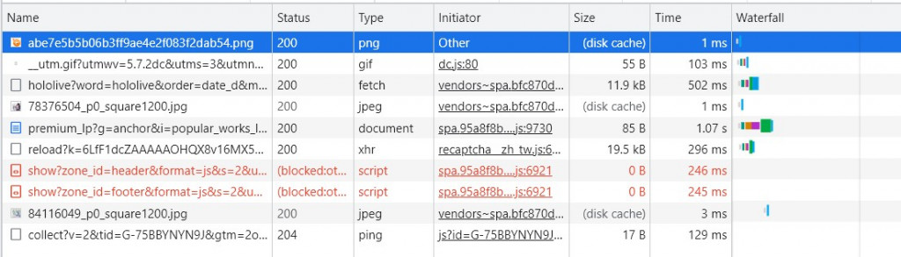

所以我們只需要找到網站是使用了哪一個方式，來顯示我們看到的頁面，這樣就能找到我們要的資料。我們可以考慮網站動作的優先順序，想一下如果是要請求資料，那這個動作會放在哪裡?當然是請求的前幾筆!所以要找到的請求動作應該會靠在蠻前面的地方，我們可以點擊到paylod的地方觀察這些資料。


這時候會看到我們關鍵字"hololive"，並且在其他的請求中沒有這個字，那就大致上確定是這個網址了

之後將頁面切換到headers來取得AJAX的URL，與請求的cookies(若沒有只能請求10頁)


在網址中可以看到幾個參數word、order、mode、s_mode、type、lang，在這邊我只看得懂word、type、lang這三個參數，所以我決定去找到其他標籤與分類的網址

```
https://www.pixiv.net/ajax/search/illustrations/hololive?word=hololive&order=date_d&mode=all&p=1&s_mode=s_tag_full&type=illust_and_ugoira&lang=zh_tw
https://www.pixiv.net/ajax/search/manga/ONEPIECE?word=ONEPIECE&order=date_d&mode=all&p=1&s_mode=s_tag_full&type=manga&lang=zh_tw
```

查看到變動的地方我們可以知道這個網址的參數涵義如下，接下來就能通過網址來操作了。

```
https://www.pixiv.net/ajax/search/{類型}/{搜尋名稱}?word={搜尋名稱}&order=date_d&mode=all&p={頁數}&s_mode=s_tag_full&type=illust_and_ugoira&lang={語系}
```

我們來看看我們用requests.get(AJAX_url)的結果，並通過JSON格式化工具來查看一下結構

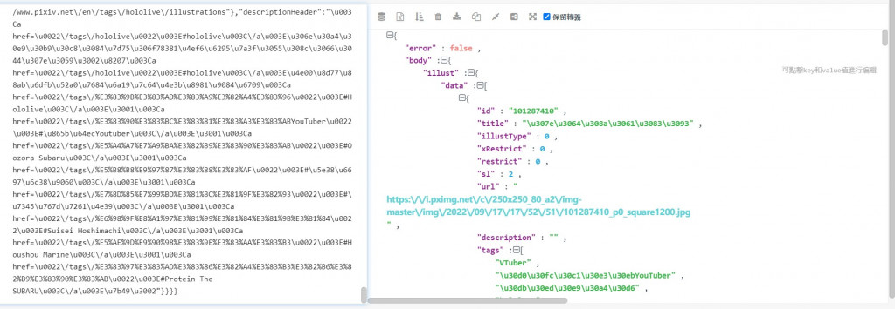

可以看到作品的名稱、圖片網址、ID、上傳時間都在body -> illust的data裡面，所以我們只需要利用pythno保留這部分的資訊即可

```
datas = json.loads(r.text)["body"]["illust"]["data"]
```

最後把程式加入迴圈之中這樣就能換頁並獲取資訊了

```
headers = {'Referer':'https://www.pixiv.net/'}
#初始頁
i = 1
while(1):
    #AJAX url
    holo_url = f'https://www.pixiv.net/ajax/search/illustrations/hololive?word=hololive&order=date_d&mode=all&p={i}&s_mode=s_tag_full&type=illust_and_ugoira&lang=zh_tw'
    r = requests.get(holo_url)
    # 狀態錯誤跳脫迴圈
    if r.status_code != 200:
        break
        
    #保留頁面資訊
    datas = json.loads(r.text)["body"]["illust"]["data"]
    for data in datas:
        #找到作品名稱
        name = data["alt"]
        #找到作品ID
        pic_id = data["id"]
```

保存圖片
----

我們剛剛取的到的資訊只有作品名稱與ID，那該如何找到圖片呢?首先先點進隨便一個圖片裡面，對圖片按右鍵->新分頁中開啟圖片應該會獲得

```
https://i.pximg.net/c/250x250_80_a2/img-master/img/2021/10/21/00/00/07/93576944_p0_square1200.jpg
```

不過怎麼點擊上面的網址都只會顯示403 error，因為我們在發送請求的資料沒有附帶網站的網域。我們知道pixiv的網址是https://www.pixiv.net/ ，但是我們找到的URL卻是https://i.pximg.net/ ，這代表網站需要標頭參數referer，所以我們需要加入pixiv的網址來解決這個問題

```
headers = {'Referer':'https://www.pixiv.net/'}
request.get(AJAXurl,headers=headers)
```

接下來為了能加入程式到迴圈之中，我們需要分析網址，我們可以得到以下的結果

```
https://i.pximg.net/img-master/img/{年}/{月}/{日}/{時}/{分}/{秒}(作品上傳日期)/{作品ID}_p{第幾張圖片}_master1200.jpg
```

所以我們只要將前面的作品ID與時間加入到我們的第二個網址中就能取得我們圖片的資訊，不過在日期中，包含了許多-、t、+、:等不需要的文字，所以先來處理一下格式問題，之後將網址組合起來就可以了。

```
def makeUrl(pic_id,creat_time,j):
    creat_time=creat_time.replace("-",' ')
    creat_time=creat_time.replace("T",' ')
    creat_time=creat_time.replace(":",' ')
    creat_time=creat_time.replace("+",' ')
    creat_time =creat_time.split(' ')
    url =  f"https://i.pximg.net/img-master/img/{creat_time[0]}/{creat_time[1]}/{creat_time[2]}/{creat_time[3]}/{creat_time[4]}/{creat_time[5]}/{pic_id}_p{j}_master1200.jpg"
    return url
```

接下來我們重新用requests.get得到圖片內容，之後用write的方式就能將圖片保存下來了

```
url = makeUrl(pic_id, creat_time, j)
r = requests.get(url, headers=headers)
if r.status_code != 200:
    break     
with open(f'./holo/{pic_id}_{j}.jpg','wb') as f:
    f.write(r.content)
```

最後我們加入一些換頁的動作

完整程式碼
-----

```
import json
import requests

def makeUrl(pic_id,creat_time,j):
    creat_time=creat_time.replace("-",' ')
    creat_time=creat_time.replace("T",' ')
    creat_time=creat_time.replace(":",' ')
    creat_time=creat_time.replace("+",' ')
    creat_time =creat_time.split(' ')
    url =  f"https://i.pximg.net/img-master/img/{creat_time[0]}/{creat_time[1]}/{creat_time[2]}/{creat_time[3]}/{creat_time[4]}/{creat_time[5]}/{pic_id}_p{j}_master1200.jpg"
    return url
headers = {'Referer':'https://www.pixiv.net/'}
i = 1
while(1):    
    holo_url = f'https://www.pixiv.net/ajax/search/illustrations/hololive?word=hololive&order=date_d&mode=all&p={i}&s_mode=s_tag_full&type=illust_and_ugoira&lang=zh_tw'
    r = requests.get(holo_url)
    
    if r.status_code != 200:
        break
        
    datas = json.loads(r.text)["body"]["illust"]["data"]
    for data in datas:
        name = data["alt"]
        pic_id = data["id"]
        creat_time = data["createDate"]
        print(name)
        j = 0
        while(1):
            url = makeUrl(pic_id, creat_time, j)
            r = requests.get(url, headers=headers)
            if r.status_code != 200:
                break     
            with open(f'./holo/{pic_id}_{j}.jpg','wb') as f:
                f.write(r.content)
            j+=1

    i+=1
```

明天來建構一個gan神經網路，來測試看看效果吧

課程中的程式碼都能從我的github專案中看到

[https://github.com/AUSTIN2526/learn-AI-in-30-days](https://github.com/AUSTIN2526/learn-AI-in-30-days)

---

<a id="5607-day-15"></a>

## Day 15｜【day15】預測Hololive七期生的樣貌-生成式對抗網路(Generative Adversarial Network)(下)

- 原文：https://ithelp.ithome.com.tw/articles/10292606

昨天說到GAN是依靠生成器與辨識器不斷交互訓練的方式來產生圖片，所以我們可以建立一個CNN模型稍加修更一下，就能夠建構一個GAN的神經網路，這種網路的名稱叫做`DCGAN(Deep Convolutional Generative Adversarial Networks)。`

今天的目錄如下:

*   1.利用opencv辨識臉部
*   2.建立初始環境
*   3.建立判別器(Discriminator)
*   4.建立生成器(Generator)
*   5.訓練模型

利用opencv辨識臉部
------------

由於pixiv中有許多不同的畫風，要讓機器學習沒有統一性的資料，訓練時間就會相當的久，甚至無法訓練成功，所以這次我使用了[這篇文章](https://medium.com/@crosssceneofwindff/gan%E3%82%92%E7%94%A8%E3%81%84%E3%81%9F%E3%82%A4%E3%83%A9%E3%82%B9%E3%83%88%E7%94%9F%E6%88%90%E3%81%AE%E3%83%87%E3%83%BC%E3%82%BF%E3%82%BB%E3%83%83%E3%83%88-f2a9171e7ec5)的方式，利用opencv擷取角色的臉部，來減少一些無意義的圖像，這方式與我們在臉部辨識時的作法相同，只需要更換XML檔案。

首先我們先到[這裡](https://cdn.jsdelivr.net/gh/XavierJiezou/opecv-face-detect@master/data/lbpcascades/anime/lbpcascade_animeface.xml)來下載XML檔案，之後利用OPENCV來建立角色頭像資料集，這邊在前面有說過怎麼做了就直接丟程式碼與註解快速帶過

```
import cv2
import os
#動漫人臉檢測
cascade = cv2.CascadeClassifier('lbpcascade_animeface.xml')
#找到檔案名稱
for i in os.listdir('data'):
    #讀取
    image = cv2.imread('data/'+i, cv2.IMREAD_COLOR) 
    #轉成灰階
    gray = cv2.cvtColor(image, cv2.COLOR_BGR2GRAY)
    gray = cv2.equalizeHist(gray)
    #使用辨識器
    faces = cascade.detectMultiScale(gray,scaleFactor = 1.1,minNeighbors = 5,minSize = (32, 32))
    #有東西才執行
    if len(faces) > 0:
        #檢測不只會有一張人臉
        for cnt,(x, y, w, h) in enumerate(faces):
            face = image[y: y+h, x:x+w, :]
            #我們要輸入的圖片大小(Lento採用的是96*96)
            face = cv2.resize(face,(96,96))
            #儲存
            cv2.imwrite(f"faces/{i}_{cnt}.jpg",face)
```

建立初始環境
------

首先我們今天的資料夾結構是這個樣子

main.py

├─holo(資料夾)

│ └─train(訓練圖片)

├─model(資料夾)

└─pic(輸出影像資料夾)

之後我們開始導入函式庫與建立資料集

導入函式庫

```
import os
import torchvision as tv
import torch as t
import torch.nn as nn
from tqdm import tqdm
```

建立資料集

```
transforms = tv.transforms.Compose([
    tv.transforms.Resize(96),
    tv.transforms.CenterCrop(96),
    tv.transforms.ToTensor(),
    tv.transforms.Normalize((0.5, 0.5, 0.5), (0.5, 0.5, 0.5))
])
dataset = tv.datasets.ImageFolder('holo', transform = transforms)
dataloader = t.utils.data.DataLoader(dataset,batch_size = 128, shuffle=True,num_workers = 0,drop_last=True)
```

建立判別器(Discriminator)
--------------------

接下來為了要判別圖片是生成器創作的還是pixiv爬蟲取得的，所以在DGCNN中是使用變種的CNN的方式來辨別圖像，首先先移除全連結層，再來maxpooling層都更換成BatchNorm2d(將圖片歸一化)，因為我們不需要強化特徵，而是保有圖片本身，在這邊為了方便創建網路可以使用Sequential來快速創建

```
ndf = 64
        self.main = nn.Sequential(
            # 3 x 96 x 96
            nn.Conv2d(3, ndf, 5, 3, 1, bias=False),
            nn.LeakyReLU(0.2, inplace=True),
            # (ndf) x 32 x 32

            nn.Conv2d(ndf, ndf * 2, 4, 2, 1, bias=False),
            nn.BatchNorm2d(ndf * 2),
            nn.LeakyReLU(0.2, inplace=True),
            # (ndf*2) x 16 x 16

            nn.Conv2d(ndf * 2, ndf * 4, 4, 2, 1, bias=False),
            nn.BatchNorm2d(ndf * 4),
            nn.LeakyReLU(0.2, inplace=True),
            # (ndf*4) x 8 x 8

            nn.Conv2d(ndf * 4, ndf * 8, 4, 2, 1, bias=False),
            nn.BatchNorm2d(ndf * 8),
            nn.LeakyReLU(0.2, inplace=True),
            # (ndf*8) x 4 x 4

            nn.Conv2d(ndf * 8, 1, 4, 1, 0, bias=False),
            nn.Sigmoid()  
        )
```

建立生成器(Generator)
----------------

建立生成器前，我們要知道資料是有label還是沒有label的，例如我們想生成特定髮色與眼睛顏色，那就必須在建構資料集時定義每個圖像的髮色與眼睛顏色，但這個工程非常的浩大。所以今天只用一種比較簡單的方式，就是直接產生一個隨機的數值當作我們的輸入，這樣子就能夠產生圖片了。

```
train_noises = t.randn(128, 100, 1, 1).cuda()
```

在判別器我們是使用CNN將圖片從(batch_size,3,96,96)慢慢的變小變成(batch_size,1, 1, 1)，所以我們要在生成器做一個逆向的動作，將一個(batch_size,輸入資料,1,1)放大到(3x96x96)。

剛剛的判別器輸入=3 輸出=64，之後以倍數增長，一直到輸出變成64x8時才會停止。所以生成器的輸入需要從64x8開始，以倍數遞減。

```
ngf = 64

self.main = nn.Sequential(
    nn.ConvTranspose2d(100, ngf * 8, 4, 1, 0, bias=False),
    nn.BatchNorm2d(ngf * 8),
    nn.ReLU(True),
    # (ngf*8) x 4 x 4

    nn.ConvTranspose2d(ngf * 8, ngf * 4, 4, 2, 1, bias=False),
    nn.BatchNorm2d(ngf * 4),
    nn.ReLU(True),
    # (ngf*4) x 8 x 8

    nn.ConvTranspose2d(ngf * 4, ngf * 2, 4, 2, 1, bias=False),
    nn.BatchNorm2d(ngf * 2),
    nn.ReLU(True),
    # (ngf*2) x 16 x 16

    nn.ConvTranspose2d(ngf * 2, ngf, 4, 2, 1, bias=False),
    nn.BatchNorm2d(ngf),
    nn.ReLU(True),
    # (ngf) x 32 x 32

    nn.ConvTranspose2d(ngf, 3, 5, 3, 1, bias=False),
    nn.Tanh()  
    # 3 x 96 x 96
)
```

訓練模型
----

GAN的訓練可以說是最重要的事情，在這裡我們要經過無數的測試，查看最適合這張圖片的loss值(或動態調整)，每個人控制的方法可能會不太一樣可能是調整學習率，或是控制訓練次數。但在本質上只有一個，就是控制好生成器與辨識器的Loss值(通常其中一個上升另一個就會下降)。

不過在訓練前我們先定義一下、真圖片標籤、假圖標籤、與我們的輸入(noize)

```
#訓練生成器與辨識器的label 結果為128個1(希望生成器的結果是1)
fake_labels = t.ones(128).cuda()
#訓練辨識器的label 結果為0
true_labels = t.zeros(128).cuda()
#亂數產生訓練noize
train_noises = t.randn(128, 100, 1, 1).cuda()
```

接下來定義loss function與優化器、學習率。在這裡使用的loss function是BCELoss，因為BCELoss的輸出會包含所有輸入分類的loss值(保有更多的資料)。

```
model_G = Generator().cuda()
model_D = Discriminator().cuda()
criterion = t.nn.BCELoss().cuda()
optimizer_g = t.optim.Adam(model_G.parameters(),1e-4)
optimizer_d = t.optim.Adam(model_D.parameters(),1e-5)
```

之後就來看一下GAN該怎麼定義訓練方式吧，首先是判別器的訓練，需要判別一次真圖片與假圖片當作一個結果，這裡比較需要注意事情，是我們在訓練判別器時，需要使用生成器產生圖片，但在做這個動作時，生成器多做了一次計算，所以我們要避免這個問題，我們可以使用model.eval()或是detach()的方式來解決。

```
##真實圖片訓練方式
#判別器梯度歸0
optimizer_d.zero_grad()
#將真實圖片交給判別器判斷
output = model_D(real_img)
#利用計算真圖片loss
r_loss_d = criterion(output, true_labels)
#反向傳播
r_loss_d.backward()

#禁止生成器反向傳播(因為我們在訓練的是判別器而不是生成器)
fake_img = model_G(train_noises).detach()
#利用生成器產生的圖片判別結果
output = model_D(fake_img)
#計算假圖片loss
f_loss_d = criterion(output, fake_labels)
#反向傳播
f_loss_d.backward()

#這時才將兩個loss傳給優化器運算
optimizer_d.step()
all_loss_d+=f_loss_d.item()+r_loss_d.item()
```

生成器的訓練方式就與之前相同了，同樣的需要禁止判別器反向傳播

```
#生成器梯度歸0
optimizer_g.zero_grad()
#創造假圖片
fake_img = model_G(train_noises)
#交給判別器判別
output = model_D(fake_img)
#計算loss(這裡要判斷是true因為我們希望生成器是生成真的圖片)
loss_g = criterion(output, true_labels)
loss_g.backward()
#傳送給優化器
optimizer_g.step()
all_loss_g+=loss_g.item()
```

之後我們可以控通過控制 cnt的次數來調整兩者之間的loss值，就可以了

```
for epoch in range(20000):
    all_loss_d = 0
    all_loss_g = 0
    tq = tqdm(dataloader)
    for cnt, (img, _) in enumerate(tq,1):
        real_img = img.cuda()
        if cnt%1 ==0:
            optimizer_d.zero_grad()
            output = model_D(real_img)
            r_loss_d = criterion(output, true_labels)
            r_loss_d.backward()

            
            fake_img = model_G(train_noises).detach()
            output = model_D(fake_img)
            f_loss_d = criterion(output, fake_labels)
            f_loss_d.backward()
            optimizer_d.step()
            all_loss_d+=f_loss_d.item()+r_loss_d.item()
            
        if cnt % 2 == 0:
            optimizer_g.zero_grad()
            fake_img = model_G(train_noises)
            output = model_D(fake_img)
            loss_g = criterion(output, true_labels)
            loss_g.backward()
            optimizer_g.step()
            all_loss_g+=loss_g.item()
            
        tq.set_description(f'Train Epoch {epoch}')
        tq.set_postfix({'D_Loss':float(all_loss_d/cnt),'G_loss':float(all_loss_g/cnt*5)})

    fix_fake_imgs = model_G(train_noises).detach()
    tv.utils.save_image(fix_fake_imgs,f'pic/{epoch}.jpg')
    t.save(model_D.state_dict(), f'model/model_D_{epoch}.pth')
    t.save(model_G.state_dict(), f'model/model_G_{epoch}.pth')
```

接下來看看我使用2000多張的hololive二創圖片訓練1600多次出來的結果


可以看到人物的輪廓與色彩都已經出來了，以一個2000多張的人臉照片來說，我認為效果還算不錯，而且我並沒有手動處理任何的圖像資料，導致訓練樣本裡面有根本不是人臉的圖片，這樣子也影響了些訓練效果，若要更好的效果可以增加圖片量與手動過濾一些圖片。

本來是想把結果跑完，但是電腦已經快要撐不住了...

完整程式碼
-----

```
import os
import torchvision as tv
import torch as t
import torch.nn as nn
from tqdm import tqdm

class Discriminator(nn.Module):
    def __init__(self):
        super().__init__()
        ndf = 64
        self.main = nn.Sequential(
            # 3 x 96 x 96
            nn.Conv2d(3, ndf, 5, 3, 1, bias=False),
            nn.LeakyReLU(0.2, inplace=True),
            # (ndf) x 32 x 32

            nn.Conv2d(ndf, ndf * 2, 4, 2, 1, bias=False),
            nn.BatchNorm2d(ndf * 2),
            nn.LeakyReLU(0.2, inplace=True),
            # (ndf*2) x 16 x 16

            nn.Conv2d(ndf * 2, ndf * 4, 4, 2, 1, bias=False),
            nn.BatchNorm2d(ndf * 4),
            nn.LeakyReLU(0.2, inplace=True),
            # (ndf*4) x 8 x 8

            nn.Conv2d(ndf * 4, ndf * 8, 4, 2, 1, bias=False),
            nn.BatchNorm2d(ndf * 8),
            nn.LeakyReLU(0.2, inplace=True),
            # (ndf*8) x 4 x 4

            nn.Conv2d(ndf * 8, 1, 4, 1, 0, bias=False),
            nn.Sigmoid()  
        )

    def forward(self, x):
        x = self.main(x)
        x  = x.view(-1)
        return x
        
class Generator(nn.Module):
    def __init__(self):
        super().__init__()
        ngf = 64

        self.main = nn.Sequential(
            nn.ConvTranspose2d(100, ngf * 8, 4, 1, 0, bias=False),
            nn.BatchNorm2d(ngf * 8),
            nn.ReLU(True),
            # (ngf*8) x 4 x 4

            nn.ConvTranspose2d(ngf * 8, ngf * 4, 4, 2, 1, bias=False),
            nn.BatchNorm2d(ngf * 4),
            nn.ReLU(True),
            # (ngf*4) x 8 x 8

            nn.ConvTranspose2d(ngf * 4, ngf * 2, 4, 2, 1, bias=False),
            nn.BatchNorm2d(ngf * 2),
            nn.ReLU(True),
            # (ngf*2) x 16 x 16

            nn.ConvTranspose2d(ngf * 2, ngf, 4, 2, 1, bias=False),
            nn.BatchNorm2d(ngf),
            nn.ReLU(True),
            # 上(ngf) x 32 x 32

            nn.ConvTranspose2d(ngf, 3, 5, 3, 1, bias=False),
            nn.Tanh()  
            # 3 x 96 x 96
        )

    def forward(self, x):
        x = self.main(x)
        return x

transforms = tv.transforms.Compose([
    tv.transforms.Resize(96),
    tv.transforms.CenterCrop(96),
    tv.transforms.ToTensor(),
    tv.transforms.Normalize((0.5, 0.5, 0.5), (0.5, 0.5, 0.5))
])

dataset = tv.datasets.ImageFolder('holo', transform = transforms)
dataloader = t.utils.data.DataLoader(dataset,batch_size = 128, shuffle=True,num_workers = 0,drop_last=True)

model_G = Generator().cuda()
model_D = Discriminator().cuda()
optimizer_g = t.optim.Adam(model_G.parameters(), 1e-4)
optimizer_d = t.optim.Adam(model_D.parameters(), 1e-5)
criterion = t.nn.BCELoss().cuda()
fake_labels = t.ones(128).cuda()
true_labels = t.zeros(128).cuda()
test_noises = t.randn(128, 100, 1, 1).cuda()
train_noises = t.randn(128, 100, 1, 1).cuda()

for epoch in range(20000):
    all_loss_d = 0
    all_loss_g = 0
    tq = tqdm(dataloader)
    for cnt, (img, _) in enumerate(tq,1):
        real_img = img.cuda()
        if cnt % 1 ==0:
            optimizer_d.zero_grad()
            output = model_D(real_img)
            r_loss_d = criterion(output, true_labels)
            r_loss_d.backward()

            
            fake_img = model_G(train_noises).detach()
            output = model_D(fake_img)
            f_loss_d = criterion(output, fake_labels)
            f_loss_d.backward()
            optimizer_d.step()
            all_loss_d+=f_loss_d.item()+r_loss_d.item()
            
        if cnt % 2 == 0:
            optimizer_g.zero_grad()
            fake_img = model_G(train_noises)
            output = model_D(fake_img)
            loss_g = criterion(output, true_labels)
            loss_g.backward()
            optimizer_g.step()
            all_loss_g+=loss_g.item()
            
        tq.set_description(f'Train Epoch {epoch}')
        tq.set_postfix({'D_Loss':float(all_loss_d/cnt),'G_loss':float(all_loss_g/cnt*2)})

    fix_fake_imgs = model_G(train_noises).detach()
    tv.utils.save_image(fix_fake_imgs,f'pic/{epoch}.jpg')
    if epoch %10==0:
        t.save(model_D.state_dict(), f'model/model_D_{epoch}.pth')
        t.save(model_G.state_dict(), f'model/model_G_{epoch}.pth'
```

課程中的程式碼都能從我的github專案中看到

[https://github.com/AUSTIN2526/learn-AI-in-30-days](https://github.com/AUSTIN2526/learn-AI-in-30-days)

---

<a id="5607-day-16"></a>

## Day 16｜【day16】NLP的首選模型Transformer介紹

- 原文：https://ithelp.ithome.com.tw/articles/10294494
- 發佈時間：2022-09-20 18:30:22

我們已經在CV(影像辨識)的領域中學習了如何辨識圖像、使用pre-train model以及GAN生成圖像，而我們在NLP中只學會了情緒分析，所以我們這幾天要來學習，如何使用文本的pre-train model與生成文本，於是今天要先來了解電腦是怎麼樣生成文本資料的。

Seq2Seq(Sequence to sequence)
-----------------------------

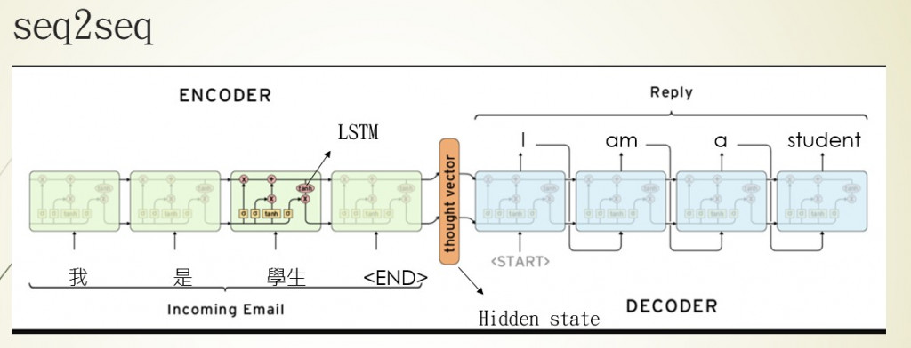

`seq2seq`是一種`encoder-decoder`的架構，架構中的encoder與我們在[【day9】 讓電腦了解文字資料 & 使用Pytorch做IMDB影評分析](https://ithelp.ithome.com.tw/articles/10289649)的作法是相同的，利用RNN神經網路訓練文本資料，取得最後一個輸出狀態`hidden state`(Hn或是Yn)，那這個hidden state就會是我們我們電腦了解的文本訊息。

我們在第9天的作法就是將hidden state通過激勵函數sigmoid把狀態縮放至0~1的範圍，之後使用二分法將結果分成正面與負面。但如果不使用激勵函數而是直接使用hidden state呢?這就是decoder的做法，decoder會利用每次RNN神經網路的輸出的hidden state當作模型的輸入，推敲文字之間的關係，找到下一個文字出現的機率，從而完成文本翻譯或是文本生成的任務。

簡單來說seq2seq的技術就是將資料**通過encoder產生出hidden state**，並且通過**decoder解析hidden state**所包含的內容，最後來達成文本生成或是翻譯的目的。

不過在seq2seq當中有一個重大的缺陷，還記得我們說過RNN會存在者資料經過計算消失的問題嗎?這一點雖然到LSTM有了些改善，但是還是**沒辦法完整的保留資訊**，這就會使的decoder所了解的資訊不足導致生成結果不佳。我們舉個例子來幫助理解。

假設有個老師(encoder)在讀書時只自己有用的資料保留下來，那他在教導學生(decoder)時就會把他認為的重點劃出來並且傳達給學生，但是學生連基礎的不好的情況下，卻吸收到了這些過於精簡的知識，導致無法理解老師想要表達什麼，這樣子的考試結果自然會不佳。

這時老師就想到了一個方式，把他在讀書時，學習知識的過程與與學習到知識都跟學生說，讓學生可以從老師讀書的方法中找到一個最佳的解法，而不是只學習重點，這種方式在深度學習中就叫做`注意力機制(attention)`。


我們先來看加入attention後的seq2seq架構中，hidden state變成了不只一個，因為加入attention後，RNN神經網路會把他所訓練出來的所有結果(H0~Hn)通通交給encoder動態判斷哪一個hidden staete是我要的結果。

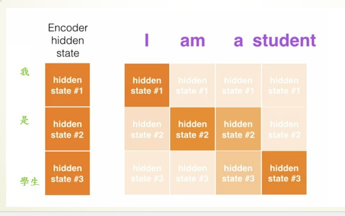

在encoder中不會只判斷一個hiddden state，而是一次**判斷多個hidden state**來找到最佳的結果，以圖片中的例子來說，我輸入我是學生，輸入"我"就會產生第一個hidden state，輸入"是"就會產生第二個，以此類推到最後時共有3個hidden state，那encoder就會認為"我"在第一個hidden state中是權重是最高的，而第二個hidden state當中也有包含"我"的資料，所以他考慮了這兩個hidden state的資料來產生"I"這個單字，當然實際訓練時所產生的例子絕對會更複雜。

傳統RNN的問題
--------

再來就是傳統RNN所產生的問題，不管是LSTM、GRU、simple RNN...等，都有一個相同的問題，就是RNN模型都**需等待上一個節點計算完畢**後，才能進行下一個節點的運算。若輸入資料維度太龐大，那這個訓練時長，將會比相同維度的CNN網路還要來的更久(**LSTM無法平行運算**)，所以這時就有一個新的技術叫做transformer。

什麼是Transformer?
---------------

Transformer是於2017年由`Google Brain`團隊推出的一個模型，因計算的速度遠大於LSTM等RNN模型，所以成為了NLP的首選模型。那transformer是怎麼樣運作的呢?首先我們先看到這張圖片


> 圖片來源:李弘毅老師youtube

在這張圖片中做了一件事情，將原始的RNN神經網路層改成一個`自注意力機制(self-attention)`層，而這個self-attention的做法就是**利用矩陣計算**來替代RNN網路，使原本要經過好幾個節的的計算過程，變得可平行運算，且所有輸出都能夠理解所有的輸入，所以接下來就來看看這個self-attention究竟是做了什麼樣的事吧。


首先我們先看到`x1~x4`，這一個就是我們輸入的文字，在第9天時有說到高維度的文字需先降維(圖中採用embedding)才能夠交給電腦運算，這個結果就是a1~a4也是我們在self-attention裡實際計算的資料。

我們可以看到a1~a4還分出了3個參數q、k、v。這三個參數是在self-attention中相當重要的資料，我們先來看看這些參數所代表的含意

| 名稱 | 用處 |
| --- | --- |
| q | 找到輸入的所有k |
| k | 被所有q找到 |
| v | 代表文字本身a |

我們先來看一下圖片中b1的例子，首先會先計算q1·k1到q1·k4來得到結果a(1,1到1,4)，之後用softmax來計算文字之間的分數，最後將a1,1到a4,4與我們的實際輸入v1到v4相乘後加總起來得到最後的輸出結果b1，公式表達是長這個樣子`b1=sum(softmax(q1·k1/d^0.5)*v1+softmax(q1·k2/d^0.5)*v2+softmax(q1·k3d^0.5/)*v3+softmax(q1·k4/d^0.5)*v4)`，而前面提到v是**我們的輸入**、sofmax(q1·kn/d^0.5)是每個**文字之間的分數**，兩個數字相乘就代表這個文字1對文字n的分數，而最後加總的動作就是將文字1(因為是q1)對**所有輸入文字的分數**，這代表的意思就是的b1就是我們x1~x4之間的文字關係，並且在這個過程中皆採用矩陣平行運算，因此改善了原本RNN計算緩慢的問題，也改善了decoder看不見我們輸入的問題。

但我們原始的self-attention也會產生一種問題就是無法一次注意好幾個文字，我們在看文字時可能會一次關注好幾個相關的資訊，但是在self-attention當中只會找到最相關的，為了改善這個問題，於是衍生了另一種方式`多頭注意力機制(Multi-Head Attention)`，這種方式非常的簡單就是將q、k、v三個參數分成多個，並且每個q、k、vˋ只會與自己相對編號的q、k、v進行運算。


以圖片中為例qi只會找所有的ki，qj只會找所有的kj，利用這種方法使文字能夠關注到更多的資訊，從而運算出更好的結果。

這樣是不是能了解transformer為何會在NLP中非常重要了呢?不過有沒有發現一件事情transformer中的encoder就是一種特徵擷取的方法，decoder則是一種生成方式，這是不是與我們昨天學習到的GAN非常相似。所以transformer其實不只能運用在NLP當中，也能用在圖像之中，只要是CNN可以做到的事情transformer也能夠做到，所以我認為transformer會是將來AI技術中最閃亮的一項技術。

---

<a id="5607-day-17"></a>

## Day 17｜【day17】假消息辨識-BERT(Bidirectional Encoder Representations from Transformers)(上)

- 原文：https://ithelp.ithome.com.tw/articles/10295113
- 發佈時間：2022-09-21 20:48:09

BERT介紹
======

我們昨天說到了transformers，那今天就來談談transformers中最有名的NLP pre-train model，`基於變換器的雙向編碼器表示技術（Bidirectional Encoder Representations from Transformers）`簡稱BERT。BERT是一篇在2018年發表在IEEE的論文，並且在發布時屠殺了當時`GLUE`、`SQuAD`、`SWAG`數據集準確率的排行榜，穩穩地拿下第一的寶座，也影響了後續NLP任務的訓練方式，不過我們在開始介紹BERT之前，先來了解一下當時最強大的兩個語言模型

在BERT發表前的兩個重大model介紹
====================

ELMO
----

在BERT的論文發布前，我們所使用的NLP模型，基本上都是使用transformers或LSTM的方法訓練而成的，例如BERT的前身`語言模型嵌入`(Embeddings from Language Models)簡稱ELMO，是一個featur-based的pre-train model。


> 來源:https://medium.com/programming-with-data/31-elmo-embeddings-from-language-models-%E5%B5%8C%E5%85%A5%E5%BC%8F%E8%AA%9E%E8%A8%80%E6%A8%A1%E5%9E%8B-c59937da83af

ELMO是利用`BiLSTM`所訓練出來的模型，這種LSTM的會創建雙層雙向的神經網路，最後將資訊拚接起來，而ELMO最大的特點就是使用了3層embedding，來訓練不同的結果。

第一層的embedding也叫做`token embedding`，與我們先前使用的embedding並沒有任何差異，這層embedding只代表文本之間最淺層的表示。

第二層的embedding也叫做`segment embedding`是來計算文字之間的上下文關係，在這層的embedding只有0與1，前句代表0，後句代表1，因為在文本中時常會有前文對應不上後文的情形，若將這種資料拿去訓練，神經網路訓練出來的結果就會非常不好，所以在這層embedding中就是為了解決這個問題。

經過了這兩層的輸出，ELMO得到了以下公式:`y = W1xE1 + W2xE2`(w:權重 e:embedding層)， 通過兩層的embedding與兩層的LSTM來計算輸出，若是一句話當中前後句符合(W2E2)又是有邏輯的話(W1E1)那這個Y值就會是一個很高的分數。

最後是第三層的embedding也叫做`positon embedding`，在這層中紀錄著文本輸入的序列，因為我們都知道文字反過來念可能會有不同的涵義，例如"走開"跟"開走"就是一種完全不同的意思，所以我們需要記錄這些文字的位子，以免使神經網路搞錯實際的含意。

GPT2
----

GPT 是一種fine-tune的pre-train model，他是只使用Transformers中的encocder來當作模型的基本，這代表他無法做NER、情緒辨識等需要encodoer的NLP任務，所以GPT只會用於文本生成，例如機器翻譯、文本摘要、文本生成等。如果有想了解GPT文本生成的方式可以觀看我昨天的文章[【day16】NLP的首選模型Transformer介紹](https://ithelp.ithome.com.tw/articles/10294494)。

而這個模型的最大特點就是，模型參數量非常的巨大是當時參數量最龐大的語言模型(1542M)，與ELMO(94M)相比足足大了16.4倍。GPT生產文字的方式就是利用transformers由左到右的讀取文字，並且通過巨量的文本資料(40GB的文本資料)來訓練，得到各文字之間的文字分布。

在訓練資料時GPT使用了一種`word piece`的技巧，word piece的主要實現方式叫做`雙字節編碼（Byte-Pair Encoding）`，BPE的過程可以理解為把一個單詞再拆分，減少資料大小，並且加強文字所代表的意思。例如:"loved"、"loving"、"loves"這三個單詞，本身的意思都是“愛”，但神經網路會認為這三個字是不相同的，只是他們的意思相近，當我們文本裡有太多這種資料，訓練結果肯定會有問題。

所以這時候BET演算法會找出頻率最高相鄰序列，並依次循環把序列合併，我們用以下這張圖片來看BET演算法的計算方式。


看完了圖片後，是不是了解BET演算法的過程了呢?我們可以利用這種方式找到文字中的字根，拆解後墜與實際文字含意，來達成同字不同意的問題。

總結一下GPT所做的事，第一個就是導入word piece的技巧，使後墜不相同的文字也能計算出相同的效果，第二個就是大力出奇蹟，使用了龐大的模型參數跟巨量的訓練集，訓練出一個很好的結果，GPT用了以上的方法在文本生成上取得了相當優良的成績。

BERT為何能屠榜
=========

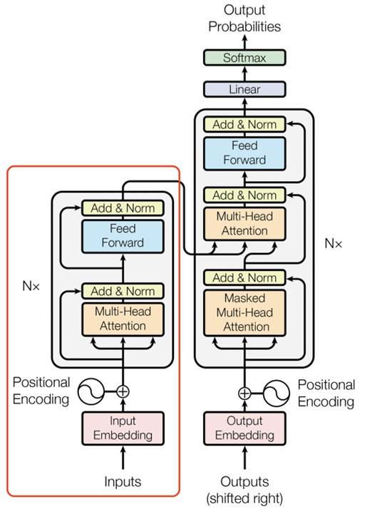

> 來源:李弘毅老師youtube
> 
> 為何BERT能夠屠榜，原因就是作者改善了GPT、ELMO這兩個模型的共有缺點，並且結合兩者的優點，與改善缺點，最後通過MLM的方法，修正了文字只能從左到右理解的問題。

我們先來看BERT結合了哪些GPT與ELMO的優點好了，第一點就是使用GPT中word piece的方式來縮小token大小。再來就是使用ELMO的三層embedding來記錄輸入訊息與上下文關係。並且將ELMO的LSTM層換拋棄掉，改使用transformers中的encoder，因為是採用encoder的架構所以輸出都能看見所有的輸入，所以只需加入一個額外的輸出層，就能在NLP任務上得到不錯的結果。

再來是BERT有一些特殊標籤，來處理一些特殊問題，這點再GPT與ELMO當中雖然都擁有相似的標籤，但BERT的標籤功能是最多的，我們來看到以下表格。

| 名稱 | 說明 |
| --- | --- |
| [CLS] | 這個標籤會放在程式的開頭當中，輸出時這個CLS會作為整個序列的repr. |
| [SEP] | 有兩個句子的文本會被串接成一個輸入序列，並在兩句之間插入這個 token 以做區隔 |
| [UNK] | 沒出現在 BERT token裡頭的字會被這個 token 取代 |
| [PAD] | zero padding 遮罩，將長度不一的輸入序列補齊方便做 batch 運算 |
| [MASK] | 未知遮罩，僅在預訓練階段會用到 |

也許你看完後還不太懂，我們來看看BERT的輸入究竟是什麼樣子。假設今天的輸入是"我是學生，我在上學中"，那經過特殊標籤的轉換就換變成`[CLS]我是學生[SEP]我在上學中[SEP]`，這裡的CLS與SEP都是BERT在訓練下游任務中非常重要的標籤。CLS這個標籤的目的，就是希望我們文本訓練完的資料都能使用這個CLS來表達，因為BERT並沒有decoder，所以透過CLS這個標籤來當作最後的輸出最後與我們的下游任務憶起做計算。再來是SEP標籤，這個標籤的目是來分割上下文，使第二層的segment embedding能夠知道文字的前後關係

但這樣就能成為屠榜機器嗎?答案是否定的，BERT真正強大的地方就是使用了一個新的技巧叫做`Masked Language Model(MLM)`，這種訓練方式可以讓輸入能夠考慮整個文本的資料，不像是ELMO與GPT只考慮一定方向，接下來我們來說說MLM的實際使用方法。

MLM會將先前創建的wordpiece以15%的機率替換為`遮罩(Mask)`，之後有80%的機率轉換成`特殊標籤[MASK]`，`10%轉換成隨機字串`，`10%完全不替換`，這邊只有80%的機率替換成[MASK]是因為[MASK]標籤只會出現在預訓練階段，實際使用時並沒有這個標籤，所以為了能夠更貼近下游任務，所以將剩下的20%來作為我們在實際訓練時會看到的數據

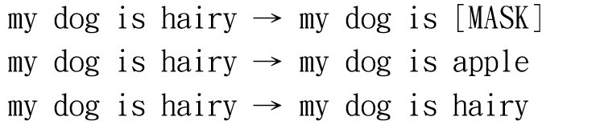

我們來看一下BERT論文中的例子，來方便讓我們理解，為什麼這樣可以使BERT考量到整個文本。可以看到圖片中的文字my dog is hairy 替換成 my dog is [MASK]，在這個階段當中，BERT會去想辦法還原被遮蔽掉的文字，並且經過了多次的運算，來找到MASK當中最適合填入哪些單字。

也就是因為這個任務，更改了後續模型的訓練方式，由原本的單一方向，變成了多方考量，也衍生了許多MLM的變種，例如:採用GAN的方法生成文字來填充MASK這個單字、更換[MASK]特殊記號等方法。

看完了BERT的介紹後是不是想要來看看這麼model到底能做什麼樣的應用呢?所以我們明天要使用BERT辨識假消息，看看效果究竟會如何

---

<a id="5607-day-18"></a>

## Day 18｜【day18】假消息辨識-BERT(Bidirectional Encoder Representations from Transformers)(下)

- 原文：https://ithelp.ithome.com.tw/articles/10296141

該如何辨識假消息
--------

首先我們要先知道假消息傳播的速度在網路中是相當快速的，所以我們只需要知道瀏覽器的一些演算法，就能透過快速的將自己想要的資訊傳播在網路上，所以我們要先聊聊這些演算法是如何運作的。

首先最直觀的想法就是越多人觀看，這篇文章的內容就會越有用，所以演算法應該要把觀看越多次數的文章推播到越上方，但這樣子只要有人特別去刷觀看次數，就算是廢文也能被他刷上到首頁，所以搜尋演算法並沒有這麼笨，演算法還會去考量網站裡實際的文字內容與不同網站之間轉跳的結果，來計算出最符合的答案。但有些人是直接使用相當有名的論壇，來大量傳播自己想要的資訊呢?這樣子就會有問題發生了，因為這些網站本來就是許多人會去點擊的，所以演算法很容易的就會將這些文章推送到搜尋第一頁，我們可能只創立了一些假帳號，或是買一些帳號來到處傳播這些消息，那麼，就會有許多人真的會相信這樣子的結果。

所以在這邊有幾種反制的方法，第一種就是找到一些`專門製造假新聞`的網站，通過AI分析這些URL的排序方式，來過濾掉這些網站或利用這些網站的內容，第二種方式就是`找到散播假消息的ID`，這些ID有可能只是用程式大量產生的假帳號，我們可以通過分析這些假ID的規律，來找到哪一些人可能是在發布假消息，並用AI來找到發布的內容之間的相似度，這樣子就可以順藤摸瓜找到一些被買來的帳號或惡意人士發布的訊息，甚至能夠找到消息的源頭。最後是關於通訊軟體的問題，我們可能常常會看到通訊軟體上有許多`聳動標題的新聞或內容`，這時就會點進去看看內容是什麼，這時候網站演算法就會發現，這個網站的客源來自於各大通訊軟體，這樣會使搜尋演算法認為文章的內容相當的重要，就會把這種造假的資訊放到搜尋第一頁當中，所以我們可以透過分析假消息的寫作風格，與真人的寫作風格來判別假消息。

說了這麼多我們先來看看BERT判別假消息的方式吧。

我們昨天說到的BERT有許多的下游任務，這些下游任務所處理的功能都不相同，而我們為了要判別假消息，我們可以使用`BertForSequenceClassification`，來找到句子之間的關係，來訓練出一個能夠`判別文章風格`的假消息的AI模型。

今天的目錄如下:

*   1.導入BERT與函式庫
*   2.創建資料集
*   3.訓練模型

導入BERT與函式庫
----------

首先我們在原始BERT的github上很難簡易的使用BERT model，所以有一個叫做`hugging face`的網站幫我們把一些非常複雜的pre-train model統整成了pytorch或是tensorflow的格式，並且將很多功能都直接包裝起來，不用一個一個自己寫，例如zero padding、text2num的方法，都能用一行程式執行完畢。

首先我們先來下載假新聞的資料集[點我下載](https://www.kaggle.com/datasets/clmentbisaillon/fake-and-real-news-dataset)這一個資料集是國外新聞網被查證的假新聞與真實新聞資料集，我們今天要通過理解文意的方式來做一個分類器辨別出是真是假。

接下來導入今天用的函式庫，這邊的transformers是能夠幫助我們下載hugging face上所有的pre-train model的一個函式庫

```
from transformers import BertTokenizer, BertForSequenceClassification
from torch.utils.data import Dataset,DataLoader
from tqdm.auto import tqdm
import torch.utils.data as data
import pandas as pd
import torch
import transformers
```

之後我們只需要呼叫就能製作出一個tokenizer與model。

```
tokenizer = BertTokenizer.from_pretrained("ydshieh/bert-base-uncased-yelp-polarity")
model = BertForSequenceClassification.from_pretrained("textattack/bert-base-uncased-yelp-polarity")
```

創建資料集
-----

首先我們一樣先從讀取csv檔開始

```
df_fake = pd.read_csv('Fake.csv')
df_real = pd.read_csv('True.csv')
```

因為我們的資料是直接分成兩個檔案，所以可以直接利用文本的資料大小創建一個新的label

```
inputs = df_fake['text'].tolist() + df_real['text'].tolist()
targets = len(df_fake['text'].tolist())*[0]+len(df_real['text'].tolist())*[1]
```

接下來要使用pytorch的方式創建dataset，相信到現在已經對這種方式不陌生了，但在使用hugging face網站的model時我們還有一個方式，就是利用字典將我們想要的把索引，當輸入名稱來當作訓練資料，但我們要做這件事前，要先知道我們到底要輸入哪一些資料，首先我們可以先到hugging face中BERT的頁面[點我前往](https://huggingface.co/docs/transformers/model_doc/bert)

我們可以看到今天要使用的分類器BertForSequenceClassification的參數有非常多種


但在這裡最重要的其實只有3個參數


在官方文件中寫了相當多的資訊，但其實概念很簡單，我們先看到以下表格

| 參數名稱 | 結果 |
| --- | --- |
| input_ids | 將文字轉換成數字 |
| token_type_ids | 判斷前後文的輸入 |
| attention_mask | zero padding的輸入 |

`input_ids`在理解上應該是沒有甚麼問題，就是我們之前所做的將文字轉換成數字，不過這個數字需要按照BERT當中的規則，`token_type_ids`這一個輸入就是segment embedding輸入的資料，在這個輸入當中只會有**0與1**的結果，`attention_mask`這個參數有一些人可能看完了BERT論文後把這一個mask當成了BERT在預訓練時的[mask]，這一個mask其實只是在對文字做zero padding時，所標註的位子而已，當我們對文字進行**補0時這一個矩陣相對位子也會為0**。你可能會在想不是有三層embedding嗎?怎麼只有2個輸入，因為在positon embedding層的輸入就是我們文字輸入的序列，只需要將資料丟入到model當中就會自動記錄到文字的位子訊息。

接下來只需要將剛剛的文字使用tokenizer的方式轉換，就能當作輸入了

```
tokenizer('I am a student')
-------------------顯示-------------------
{'input_ids': [101, 1045, 2572, 1037, 3076, 102], 'token_type_ids': [0, 0, 0, 0, 0, 0], 'attention_mask': [1, 1, 1, 1, 1, 1]}
```

不過在做假消息辨識時還需要加入label，因為我們做的事監督學習的方式，而不是非監督，所以要在原本產生的字典中加入labels的索引

```
t = tokenizer('I am a student')
t['labels'] = 1
-------------------顯示-------------------
{'input_ids': [101, 1045, 2572, 1037, 3076, 102], 'token_type_ids': [0, 0, 0, 0, 0, 0], 'attention_mask': [1, 1, 1, 1, 1, 1], 'lables':1}
```

知道了以上的作法後，我們就能使用pytorch來創建一個含有所有文本資料的字典了，我相信大家已經對創建資料集的方式很熟悉了，所以這邊就直接上程式碼。

```
class News(Dataset):
    def __init__(self, inputs, targets, tokenizer, max_len=512):
        t = tokenizer(inputs)
        self.data = []
        for ids,sep,mask,label in zip(t['input_ids'], t['token_type_ids'], t['attention_mask'], targets):         
            self.data.append({'input_ids':torch.tensor(ids[0:512])
                              ,'token_type_ids':torch.tensor(sep[0:512])
                              ,'attention_mask':torch.tensor(mask[0:512])
                              ,'labels':torch.tensor(label)})
    def __getitem__(self,index):
       
        return self.data[index]

    def __len__(self):
        return len(self.data)
    
tokenizer = BertTokenizer.from_pretrained("ydshieh/bert-base-uncased-yelp-polarity")
model = BertForSequenceClassification.from_pretrained("textattack/bert-base-uncased-yelp-polarity")

df_fake = pd.read_csv('Fake.csv')
df_real = pd.read_csv('True.csv')

inputs = df_fake['text'].tolist() + df_real['text'].tolist()
targets = len(df_fake['text'].tolist())*[0]+len(df_real['text'].tolist())*[1]
dataset = News(inputs, targets, tokenizer)

train_set_size = int(len(dataset) * 0.8)
test_set_size = len(dataset) - train_set_size
train_set, test_set = data.random_split(dataset, [train_set_size, test_set_size])
```

訓練模型
----

隨然說是訓練模型，但在BERT中其實是在**fine-tune模型，訓練分類器**，在這訓練的過程中也沒有太多的差異，只是在取出資料時做法不相同而已，我們之前的loss值都是經過model與label經過loss function計算後的到的結果，所以我們必須定義一個loss function，但是在BERT中已經將loss function都整合好了，所以只需使用model(data)，就能計算出我們的loss值，而這一個輸出也與我們的輸入一樣，只需使用一行程式，就能將值取出。

我們先來看看輸出結果。

```
SequenceClassifierOutput(loss=tensor(0.4921, device='cuda:0', grad_fn=<NllLossBackward0>), logits=tensor([[-0.0726, -0.5257]], device='cuda:0', grad_fn=<AddmmBackward0>), hidden_states=None, attentions=None)
```

在這邊比較重要的就只有兩個數值，第一個就是loss，第二個則是logits，我們可以通過model.loss將loss取出，並且交給優化器來運算，而第二個數值所代表的意義就是我們的輸出結果，分數越高的結果就會是我們最後一個輸出的label，同樣的可以使用model.logits來取出數值。

了解到了這些之後我們將pytorch訓練方式與model組合在一起

```
model.cuda()
optimizer = torch.optim.AdamW(params = model.parameters(), lr = 1e-4)
for epoch in range(20):
    model.train()
    train = tqdm(train_loader)
    for data in train:
        for key in data.keys():
            data[key] = data[key].cuda()
        outputs = model(**data)
        print(outputs)
        loss = outputs.loss
        train.set_description(f'Epoch {epoch}')
        train.set_postfix({'Loss': loss.item()})
        optimizer.zero_grad()
        loss.backward()
        optimizer.step()
        
    
    model.eval()
    test = tqdm(test_loader)
    correct = 0
    for data in test:
        for key in data.keys():
            data[key] = data[key].cuda()
        outputs = model(**data)
        _,predict_label = torch.max(outputs.logits,1)
        correct += (predict_label==data['labels']).sum()
        test.set_description(f'Epoch {epoch}')
        test.set_postfix({'acc':'{:.4f}'.format(correct / len(test_set) * 100)})
    model.save_pretrained('model_{}'.format(epoch))
```

最後來看看我們測試數據集的結果

```
Epoch 0: 100%
160/160 [00:20<00:00, 8.71it/s, Loss=0.00601]
Epoch 0: 100%
40/40 [00:00<00:00, 41.81it/s, acc=97.5152]
```

可以看到這結果比我們之前用到的NLP模型準確率還要高出許多，僅使用一個epoch就能訓練一個很好的結果，這也能體現出BERT為何能夠在2018年時成為了最佳的模型。

完整程式碼
-----

```
from transformers import BertTokenizer, BertForSequenceClassification
from torch.utils.data import Dataset,DataLoader
from tqdm.auto import tqdm
import torch.utils.data as data
import pandas as pd
import torch
import transformers

class News(Dataset):
    def __init__(self, inputs, targets, tokenizer, max_len=512):
        t = tokenizer(inputs)
        self.data = []
        for ids,sep,mask,label in zip(t['input_ids'], t['token_type_ids'], t['attention_mask'], targets):         
            self.data.append({'input_ids':torch.tensor(ids[0:512])
                              ,'token_type_ids':torch.tensor(sep[0:512])
                              ,'attention_mask':torch.tensor(mask[0:512])
                              ,'labels':torch.tensor(label)})
    def __getitem__(self,index):
       
        return self.data[index]

    def __len__(self):
        return len(self.data)
    
tokenizer = BertTokenizer.from_pretrained("ydshieh/bert-base-uncased-yelp-polarity")
model = BertForSequenceClassification.from_pretrained("textattack/bert-base-uncased-yelp-polarity")

df_fake = pd.read_csv('Fake.csv')[:100]
df_real = pd.read_csv('True.csv')[:100]

inputs = df_fake['text'].tolist() + df_real['text'].tolist()
targets = len(df_fake['text'].tolist())*[0]+len(df_real['text'].tolist())*[1]
dataset = News(inputs, targets, tokenizer)

train_set_size = int(len(dataset) * 0.8)
test_set_size = len(dataset) - train_set_size
train_set, test_set = data.random_split(dataset, [train_set_size, test_set_size])

train_loader = DataLoader(train_set,batch_size = 1,shuffle = True)
test_loader = DataLoader(test_set, batch_size = 1, shuffle = True)  

model.cuda()
optimizer = torch.optim.AdamW(params = model.parameters(), lr = 1e-4)
for epoch in range(20):
    model.train()
    train = tqdm(train_loader)
    for data in train:
        for key in data.keys():
            data[key] = data[key].cuda()
        outputs = model(**data)
        loss = outputs.loss
        train.set_description(f'Epoch {epoch}')
        train.set_postfix({'Loss': loss.item()})
        optimizer.zero_grad()
        loss.backward()
        optimizer.step()
        
    
    model.eval()
    test = tqdm(test_loader)
    correct = 0
    for data in test:
        for key in data.keys():
            data[key] = data[key].cuda()
        outputs = model(**data)
        _,predict_label = torch.max(outputs.logits,1)
        correct += (predict_label==data['labels']).sum()
        test.set_description(f'Epoch {epoch}')
        test.set_postfix({'acc':'{:.4f}'.format(correct / len(test_set) * 100)})
    model.save_pretrained('model_{}'.format(epoch))
```

不過我們做了這麼多，真的能判別假消息嗎?我認為只能做到輔助的功能，我們頂多能運用AI幫助我們初步篩選，然後透過人為的方式調查並且處理，這樣子才能真正到了解假消息的源頭以及真偽。

課程中的程式碼都能從我的github專案中看到

[https://github.com/AUSTIN2526/learn-AI-in-30-days](https://github.com/AUSTIN2526/learn-AI-in-30-days)

---

<a id="5607-day-19"></a>

## Day 19｜【day19】找到文章的重點-T5( Text-To-Text Transfer Transformer)(上)

- 原文：https://ithelp.ithome.com.tw/articles/10296626
- 發佈時間：2022-09-23 18:29:11

NLP四大任務
=======

我們在NLP任務當中，可以大致上分為四種:

第一種是分類任務，在分類中資料通常都是文本與相對的label，這類任務會找到文本之間的關係，並通過softmax(多分類)、sigmoid(二分法)來當作輸出的激勵函數，得到最後的結果。

第二種是`自然語言生成(Natural Language Generation)`，我們在分類任務中資料都是文本與label，在生成任務中就是把label從數字更換成文本資料而已。使用前面的文本資料，來預測後面的文本資料出現的機率，這任務的輸出通常都只是一種文字的分布機率，而不是一個確定的結果。

第三種則是`文本相似度檢測(content similarity detection)`，文本相似度檢測其實與分類任務的做法相似，分類是使用embedding的結果並通過激勵函數計算出一個確定的結果，而文本相似度檢測是使用embedding的結果，並通過數學式計算，兩個文字或句子之間的高維空間距離，距離越相近的文字相似度就越高。

第四種是`序列標註任務(Sequence Tagging)`，這個任務會先輸入的文本資料，將每一個文字都手動增加詞性在裡面，例如我喜歡蘋果就會被標註成 [名詞 我] [動詞 喜歡] [名詞 蘋果]。之後留下文字的詞性當作輸出，來完成標註任務。

為什麼要先介紹NLP四大任務呢?因為今天要介紹的T5模型，它將所有的NLP任務引入到一個`統一的架構中`，意思就是只需一個模型就能夠完成所有NLP任務。

T5簡介
====

`T5( Text-To-Text Transfer Transformer)`，是google在發布BERT一年後所開發出來的預訓練模型，這個模型與BERT相同，狠狠的刷新了GLUE、SuperGLUE等多個資料集的榜單，就算過了3年的時間也還在SuperGLUE的排行榜上位居第8，與第1名相差了1.9%的準確率。可見這模型的效能非常的強大。

這個模型強大的原因很簡單，就是與GPT相同，使用大力出奇蹟的方式，作者們從`Common Crawl`網站每個月爬取資料並且整理出了一份容量高達750GB的訓練數據，取名為`C4(Colossal Clean Crawled Corpus)`，我們知道GPT2使用了40GB的訓練數據，而T5卻使用了將近19倍的訓練資料來完成這個模型。

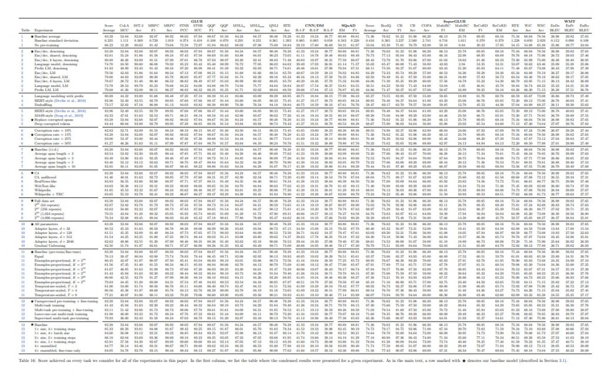

> 圖片皆引用自T5論文:https://arxiv.org/pdf/1910.10683.pdf

當然只有數據是沒有用的，還要有一個良好的訓練方式，我們剛剛提到NLP的四大任務，都很難用一個模型來達成，最主要的問題是，encoder與decoder之間要將資訊拼接起來是有一定難度的。所以作者們在製作T5模型時，用了這750G的數據共做了70幾種的實驗方式(上圖結果)，將每個語言問題轉換成`文本到文本(text to text)`的方式。

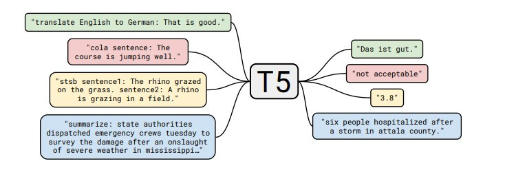

T5在實際使用時text to text前都需要加入一個任務的名稱，來判別任務的需求，像是圖片中的範例英文轉換成德文，我們必須將原始的輸入文字前加入:translate English to German，假設我們想要的輸入英文是That is good，那對應的label就是Das ist gut。

不過你可能在想text to text 要怎麼做分類任務?其實很簡單，我們直接把整數的label當作文字就好，這樣也不需要再去做one-hot-encoding了。

T5的實驗方式
=======

T5在技術上其實並沒有一太多創新的方式，而是通過分析當時比較有名的預訓練模型的訓練方式，並且經過實驗找到最適合的架構，在這邊分成了兩種區塊去做實驗，分別是:`文本的遮蔽方式`與`transformer架購`。

transformer架構
-------------


在原論文中大致把transformer模型分成了3種:

第一種是`encoder-decoder`架構，這種架構我們在[【day16】NLP的首選模型Transformer介紹](https://ithelp.ithome.com.tw/articles/10294494)，時完整的介紹過了，這架構就是透過encoder學習我們輸入的資料，並且將學習過後的狀態給decoder做使用，這模型的缺點也蠻明顯的，就是decoder無法看見我們輸入的資料，完全依靠encoder學習到的資料來當作decoder的輸入。

第二種是只使用了decoder的部分，我們在[【day17】假消息辨識-BERT(Bidirectional Encoder Representations from Transformers)(上)](https://ithelp.ithome.com.tw/articles/10295113)就提到了這個架構的問題，就是只能通過前一個文字的結果來推敲下個文字機率，所以效果自然很差。

第三種就比較特殊了，剛剛提到encoder-decoder的架構中，因為decoder無法看到我們的輸入，所以沒辦法考慮到更多的資訊。我們可以想像第三種transformer是BERT與GPT的混和版本，encoder可以看到一部份的完整輸入，decoder看見一部分先前的消息(而不是通過encoder)，最後再將兩個模型組合起來。

作者們最後得到的結論是encoder-decoder的架構中最適合T5，當然其他兩種的架構**不一定是一個錯誤的方法**，這些架構直到了現在還是有很多不錯的成績，實驗結果僅能代表T5不適合這個架構而已。

文本的遮蔽方式
-------


一個好的模型，一定要有一個好的資料處理的方式，這一點在BERT當中已經幫我們證實過了，所以在T5中對文本的遮蔽方式用了非常多的技巧來找到最好的結果，在這裡又將實驗過程分成了`高級方法(High-level approaches)`、`破壞方式(Corruption strategies)`、`破壞率(Corruption rate)`、`破壞長度(Corruption span length)`。

### 高級方法(High-level approaches)

`語言模型法(Language modeling)`:這個方式與先前提到了很多次，這方式與GPT2方法相同，直接當作文本閱讀，從左側文字來預測右側文字

`BERT-style法`:這個方式就是跟BERT一樣，直接遮蔽或替換掉某些文字

`順序還原法(Deshuffling)`:隨機將文本打亂最後想辦法還原出來。

在這邊是BERT的方式獲勝，不過我覺得順序還原法蠻有趣的，這很像我們在國中高中時，寫考卷會看到的文字重組，如果真的能完美的把文字重組回來，那我覺得效果會比BERT的方式還要來的佳，我認為在這裡會輸給BERT的原因主要是作者把文字打太亂了，我們來看一下作者的範例。


```kotlin
Thank you for inviting  me to your fun party last week.
變成
party me for your to . last fun you inviting week Thank
```

這種打亂方式不用說是電腦，就算是人類也可能也會看不懂，雖然我們常常聽到順序不影響文字的閱讀，但僅限於一小部分的序列遭到變更，但官方的範例中，卻是將整個文本的順序打亂，導致毫無邏輯可言，這是我認為比較可惜的地方。

### 破壞方式(Corruption strategies)

剛剛提到上一輪獲勝的是BERT-style所以在這一輪之中，要來去對原始的BERT破壞方式做變更。

`Mask法`:這個方式與BERT相同，只不過是將[MASK]轉換成[M]這個特殊標籤而已。

`替換法(Replace span)`:這種方法會將隨機替換掉單字並且以不同的特殊符號來表示，例如:替換掉第一個字用[X]表示，替換掉第二個用[Y]表示。

`丟棄法(Drop)`:如同字面的意思，隨機丟棄文字。

在這一輪就變成了替換法的勝利而不是原始BERT的方法了，這也是許多人在討論的地方，因為BERT的MASK效果還不夠好，所以在後續衍生出了許多MASK方式。

### 破壞率(Corruption rate)

接下來就是決定要以多少的機率來替換掉這些文字，在這邊做了4個數值的實驗，分別是10%、15%、25%、50%，在這一輪勝出的機率與BERT相同都是15%。

### 破壞長度(Corruption span length)

最後是破壞長度，與破壞率相同也使用了4個數值的實驗，分別是2、3、5、10，實驗結果是一次破壞3個單字會是最好的效果。

看到了這邊，恭喜你~你已經讀完了一篇T5論文的精簡版，看完了之後是不是覺得T5使用的方法很多都是舊有的技術，只是通過大量的實驗來找到最佳的方式，但也是這種簡單暴力的方法，才能跳脫正常邏輯思維，使結果超乎我們的想像，所以我們明天來玩玩看T5這個模型吧。

---

<a id="5607-day-20"></a>

## Day 20｜【day20】找到文章的重點-T5( Text-To-Text Transfer Transformer)(下)

- 原文：https://ithelp.ithome.com.tw/articles/10297415

為何要找到文章的重點
----------

現在社會的步調越來越快，資訊增長的速度卻越來越迅速，但我們所能利用的時間越來越稀少，那我們該如何從這些文章中，找到我們想看的呢?答案就是文本摘要的技術。

文本摘要與現在youtube的短影片概念相同，利用30秒的短影片試閱，若有興趣就可以點擊留言中的完整版網址，來找到想要觀看的影片。相同的方法也能套用在文本摘要中，我們可以利用這篇文章的重點來當作試閱文章，若讀者有興趣就能夠再去觀看完整版本。

在hugging face上面，也能下載到T5這一個預訓練模型，也因為被統整過的模型，所以訓練起來也與BERT相似。

今天的目錄如下:

*   1.導入T5與函式庫
*   2.創建資料集與訓練模型
*   3.資料評估

導入T5與函式庫
--------

我們今天要使用的是[點我下載](https://www.kaggle.com/datasets/edumunozsala/cleaned-news-summary)資料集是Kondalarao Vonteru的數據集的擴展包，包含了大約9.8萬條新聞與專業作家的文本摘要，這個數據集還對這些新聞做了以下資料前處理。

1.刪除 URL、htmls 標籤、表情符號

2.將簡寫復原

2.將俚語復原

3.刪除標點符號（除了 . ）非字符、換行符號、主題標籤

4.刪除標註其他的@與後面的ID

5.刪除停用詞(stop words)

所以我們在使用資料集時不需要再做資料前處理了

首先我們先安裝T5的必要涵式庫SentencePiece與評估的函式庫

```
pip install SentencePiece
pip install rouge
```

之後導入函式庫

```
from transformers import T5Tokenizer, T5ForConditionalGeneration
from torch.utils.data import Dataset,DataLoader
from tqdm.auto import tqdm
import torch.utils.data as data
import pandas as pd
import torch
import transformers
```

然後與前天一樣直接用transformers的方式下載預訓練模型

```
tokenizer = T5Tokenizer.from_pretrained("t5-small")
model = T5ForConditionalGeneration.from_pretrained("t5-small")
```

接下來開始來看看T5該如何創建我們的訓練資料吧。

創建資料集與訓練模型
----------

昨天說到要對T5使用任務時，必須要加入一個任務名稱當作輸入，而我們今天的任務名稱是文本摘要，所以在讀取CSV之後我們還需要對輸入加入"summarize: "

```
data = pd.read_csv('cl_news_summary.csv')
input_text = data['text'].tolist()
input_text = ["summarize: " + i for i in input_text]
summary = data['summary'].tolist()
```

我們為了知道T5需要哪一些輸入，所以還是要到官方網站上查看詳細的說明[點我前往](https://huggingface.co/docs/transformers/model_doc/t5#transformers.T5ForConditionalGeneration.config)。


在這邊我統整了三個需要的輸入資料，input_ids是代表文字的本身，attention_mask是對應填充的陣列，我相信前天寫過BERT之後對這兩個參數並不陌生。


昨天說明T5時提到了T5統一了所有NLP任務的架框(text to text)，所以這裡的labels代表的，就是由專業人士撰寫文本摘要，這裡需要注意的一點是labels並沒有attention_mask的屬性，但我們一定會填充這些文字的訊息，所以在這裡官方給了我們一個辦法，就是將填充的文字轉通通轉換為-100，這樣就會被程式忽略掉。

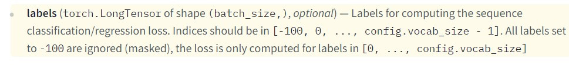

這樣就可以來建立我們的訓練資料集了。

```
class NewsSummary(Dataset):
    def __init__(self, text, summary, tokenizer,max_len = 512):
        self.data = []
        input_t = tokenizer(text,padding="longest")
        label_t = tokenizer(summary,padding="longest")

        for i,j,k in zip(input_t['input_ids'], input_t['attention_mask'], label_t['input_ids']):
            #轉換-100
            for cnt,tmp in enumerate(k):
                if tmp == 0:
                    k[cnt] = -100
                    
            self.data.append({'input_ids':torch.tensor(i[:max_len]),
                              'attention_mask':torch.tensor(j[:max_len]),
                              'labels':torch.tensor(k[:max_len])})

    def __getitem__(self, index):
        
         
        return self.data[index]
        

    def __len__(self):
        return len(self.data)
    
    
data = pd.read_csv('cl_news_summary.csv')
input_text = data['text'].tolist()[:5000]
input_text = ["summarize: " + i for i in input_text]
summary = data['summary'].tolist()[:5000]

tokenizer = T5Tokenizer.from_pretrained("t5-small")
model = T5ForConditionalGeneration.from_pretrained("t5-small")

train_set = NewsSummary(input_text, summary, tokenizer,max_len = 512)
train_loader = DataLoader(train_set,batch_size = 1,shuffle = True)
```

接下來是訓練的部分，因為我們是做文本生成的任務，這類任務通常都會有自己的評估方式，所以我們在訓練時，只需將訓練數據放到pytorch當中訓練即可，不需要查看測試數據集的Loss值，這裡的方式也與BERT相同這裡就不多說了。

```
model.cuda()
optimizer = torch.optim.AdamW(params = model.parameters(), lr = 1e-4)
for epoch in range(20):
    model.train()
    train = tqdm(train_loader)
    for data in train:
        for key in data.keys():
            data[key] = data[key].cuda()
        outputs = model(**data)
        loss = outputs.loss
        train.set_description(f'Epoch {epoch}')
        train.set_postfix({'Loss': loss.item()})
        optimizer.zero_grad()
        loss.backward()
        optimizer.step()
        
    
    model.save_pretrained('model_{}'.format(epoch))
```

資料評估
----

`Rouge(Recall-Oriented Understudy for Gisting Evaluation)`，是評估文本摘要與文本翻譯的一種方式。它通過機器生成的文字與實際文字進行比較計算，得出相應的分值，來衡量兩者之間的相似度。

在python中可以簡易的使用一行程式來完成Rouge的評估方法

```
rouge = Rouge()
rouge.get_scores("句子A","句子B")
```

接下來我們將剛剛訓練好的T5 model來測試看看，在python官方網站上出現的字會出現什麼樣子的文本摘要

```
text = 'The warning Weights from XXX not initialized from pretrained model means that the weights of XXX do not come pretrained with the rest of the model. It is up to you to train those weights with a downstream fine-tuning task.'
```

我們要通過model.generate的方式來產生文字

```
input_ids = tokenizer.encode(text, return_tensors = 'pt')
generated_ids = model.generate(input_ids, num_beams = 2, max_length = 400, repetition_penalty = 2.5, length_penalty = 1.0, early_stopping = True)
preds = [tokenizer.decode(i, skip_special_tokens = True, clean_up_tokenization_spaces = True) for i in generated_ids]
```

最後我們輸入與程式產生的摘要顯示出來，我們可以看到程式可以產生出一個語意通順且能表達重點的摘要了。

```
print(text)
print()
print(preds[0][2:])
--------------------------------------------顯示--------------------------------------------
The warning Weights from XXX not initialized from pretrained model means that the weights of XXX do not come pretrained with the rest of the model. It is up to you to train those weights with a downstream fine-tuning task.

This is a bug that has been fixed in the latest version of Python.
```

接下來我們來看看Rouge評估出來的結果

```
from rouge import Rouge
rouge = Rouge()
rouge.get_scores(text,preds[0][2:])
--------------------------------------------顯示--------------------------------------------
'rouge-1': {'r': 0.35714285714285715, 'p': 0.1724137931034483, 'f': 0.23255813514332083},
'rouge-2': {'r': 0.0, 'p': 0.0, 'f': 0.0},
'rouge-l': {'r': 0.35714285714285715, 'p': 0.1724137931034483, 'f': 0.23255813514332083}}
```

可以看到rouge-1與rouge-l都能達到35%的`召回率(recall)`，這樣其實就是一個不錯的成績了，rouge-2都為0是因為我生成文本的方式不可能達成rouge-2的公式，所以才會都是0。

完整程式碼
-----

```
from transformers import T5Tokenizer, T5ForConditionalGeneration
from torch.utils.data import Dataset,DataLoader
from tqdm.auto import tqdm
import torch.utils.data as data
import pandas as pd
import torch
import transformers

class NewsSummary(Dataset):
    def __init__(self, text, summary, tokenizer,max_len = 512):
        self.data = []
        input_t = tokenizer(text,padding="longest")
        label_t = tokenizer(summary,padding="longest")

        for i,j,k in zip(input_t['input_ids'], input_t['attention_mask'], label_t['input_ids']):
            for cnt,tmp in enumerate(k):
                if tmp == 0:
                    k[cnt] = -100
                    
            self.data.append({'input_ids':torch.tensor(i[:max_len]),
                              'attention_mask':torch.tensor(j[:max_len]),
                              'labels':torch.tensor(k[:max_len])})

    def __getitem__(self, index):
        
         
        return self.data[index]
        

    def __len__(self):
        return len(self.data)
    
    
data = pd.read_csv('cl_news_summary.csv')
input_text = data['text'].tolist()[:200]
input_text = ["summarize: " + i for i in input_text]
summary = data['summary'].tolist()[:200]

tokenizer = T5Tokenizer.from_pretrained("t5-small")
model = T5ForConditionalGeneration.from_pretrained("t5-small")

train_set = NewsSummary(input_text, summary, tokenizer,max_len = 512)
train_loader = DataLoader(train_set,batch_size = 1,shuffle = True)

model.cuda()
optimizer = torch.optim.AdamW(params = model.parameters(), lr = 1e-4)
for epoch in range(20):
    model.train()
    train = tqdm(train_loader)
    for data in train:
        for key in data.keys():
            data[key] = data[key].cuda()
        outputs = model(**data)
        loss = outputs.loss
        train.set_description(f'Epoch {epoch}')
        train.set_postfix({'Loss': loss.item()})
        optimizer.zero_grad()
        loss.backward()
        optimizer.step()
        
    
    model.save_pretrained('model_{}'.format(epoch))
```

我們終於經過了2/3的課程了，如果到現在都有跟上，應該已經學會了架設基礎神經網路模型、靜態與動態爬蟲技巧、預訓練模型的使用、圖像與文字的判別與生成方式、AI之中的分支、機器學習的實作...等，我們不只學習了如何撰寫程式，還學會了這些模型的概念。但有沒有發現，我們每一個專案都是採用一種技術，所以接下來，我們要開始將深度學習、與機器學習這兩種方式開始混和在一起使用，並加強一些關於資料前處理的技巧，來完成更多更加有趣的功能。

課程中的程式碼都能從我的github專案中看到

[https://github.com/AUSTIN2526/learn-AI-in-30-days](https://github.com/AUSTIN2526/learn-AI-in-30-days)

---

<a id="5607-day-21"></a>

## Day 21｜【day21】分群?分類?傻傻分不清楚-分群演算法介紹

- 原文：https://ithelp.ithome.com.tw/articles/10298327
- 發佈時間：2022-09-25 21:40:26

何謂分群(Clustering)?何謂分類(Classification)
=====================================

我們在看一些AI文章時，可能會看到`分群(Clustering)`或`分類(Classification)`這兩個名詞，有些人會覺得這兩個名詞是相同的，但這樣子就大錯特錯了分群與分類是完全不一樣的技術，接下來我來說明一下兩者的差別。

分類(Classification)
------------------

假設我們有一筆數據投射在2維空間中長這一個樣子

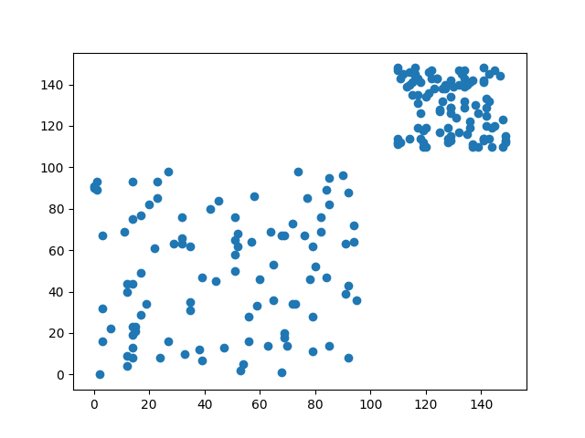

如果叫你把這些數據分類，你會怎麼做呢?你可能會跟我一樣，直接在中間畫一條線，直接將數據分成兩類


那這樣做的根據是什麼呢?可能是中間很明顯有空白區域，也有可能是因為右上密度比左下還要高，不管是哪一種方式都是你使用**你認為的規則**來劃分這些數據。


最後數據的分布狀態，會因為我們所設立的規則，強制的將這些數據收斂到相對應的點當中。分類就像是一個硬幣分類機，將相同的面額放在一起(條件)，最後得到一個**明確的結果**

用一句話來說明分群就是，**給予條件，去實現想要的結果**。

分群(Clustering)
--------------

剛剛提到了分類，那分群是什麼呢?簡單來說就是**使用演算法來計算數據**框列出相似的的群體。在這些群體內因為是通過演算法分析，所以我們**無法知道明確的結果**，需要查看群體內的結果，才能去判別這個群體`主題(Topic)`。


讓我們回到剛剛的圖片，若是採用分群的做法我們的數據分布就可能會長這個樣子(不同顏色代表不同群)，我們能看見，分群並不會像是分類一樣會改變原始數據的分布狀態，而是通過演算法計算出這些數據該在哪群裡面。分群的結果也能代表著**群內數據相似度較高，群外數據相似度較低**

分群演算法
=====

了解到分類與分群的差異後，來看看分群到底有哪一些常用的技術，這些技術又使用了那些方式來達成分群的效果。

K-means分群(K-means Clustering)
-----------------------------

K-means是一種透過計算**資料間的距離**來作為分群的依據的演算法。K-means的演算法需要預設分群數量(k值)，通過設定的分群數量產生相對應的**隨機中心點**，藉由這些中心點向外延伸，找到靠近各中心點的數據點，最後計算出各點到中心點的距離平均，重新建立一個新的中心點，一直不斷的重複以上的動作，直到中心點不再變更後才會停止。這樣說可能概念上有點模糊，我們用圖片的方式來看看K-means分群是如何達成的。


圖片中可以看到各中心點(藍點)會根據距離，來找到距離最近的所有數據點(黃點)，並且計算數據點與各中心點之間的距離平均值，來重新移動中心點的位子，直到中心點不會在移動(綠點)。

K-means的作法在數據分布較乾淨時才能有較好的結果，若資料點較雜亂k-means就很難發揮其優點，我們看到以下例子。


我們可以看到最理想的分類方式，就是移除掉無意義的雜訊，並將藍圈處的資料點分成一群，但是k-means卻會找到所有的數據點，這代表若資料集當中有許多的雜訊，就會因為這些雜訊導致中心點移動到很遠的地方，分群效果自然會不佳，所以k-means無法對**資料分布較大**的數據分群，且**容易受到雜訊影響**。

DBSCAN(Density-based spatial clustering of applications with noise)
-------------------------------------------------------------------

`DBSCAN(Density-based spatial clustering of applications with noise)`顧名思義，就是基於密度的分群方式，與K-means相比DBSCAN不需要設定聚類數量，而是通過資料之間的**密度**來進行分群，這種分群的方式會將特徵相似且密度高的樣本劃分為一群，並且找出密度較低的異常點，我們先來看看DBSCAN的分群方式。

DBSCAN的分群方式是先隨便找到一點數據點，並通過設定的半徑畫圓來查看圓內的資料點有多少，若符合所設定的最低數據量，圓圈就會繼續往前移動，反之重新找到下一個未掃描的資料，一直到掃描完所有的資料點才會停止，我們可以看到下圖DBSCAN的分群結果(同顏色為一群，沒被匡列到的資料點為異常點)。


從結果來看DBSCAN能幫助我們更詳細的找出相似的資料，但再圖片中卻可以發現一個問題，就是在密度較高的區塊(右上方)，有良好的分群效果，但在密度較低(左下方)的區塊，卻會被分類成較多群，這些密度較低群體之間可能也有一定的相似度，但DBSCAN卻會認為這幾組類別並不相同，這是因為DBSCAN若遇見**密度差異大**的資料集，就會導致效果會較差，這時只能去使用一些特徵分析的方式，將特徵較相似的群體合併在一起。

結論
==

從我們今天介紹了兩種分群演算法當中，可以發現到不同的分群演算法，能處理的資料集也都不相同，這就好比我們在深度學習中對圖片會使用CNN，對時間會使用LSTM，在分群演算法也是相同的道理，雖然不是不能做使用，但用錯方式得到的最終結果自然會不佳。

---

<a id="5607-day-22"></a>

## Day 22｜【day22】對Google評論自動分群-HDBSCAN與Sentence-BERT(上)

- 原文：https://ithelp.ithome.com.tw/articles/10298507
- 發佈時間：2022-09-26 21:30:21

DBSCAN的問題
=========

我們昨天提到了分群演算法DBSCAN的分群原理，也提到了密度不同會導致的問題，你可能會覺得這是一個小問題，但在實際使用上卻因這個密度，從而導致很多例外情況發生。我們先看以下例子

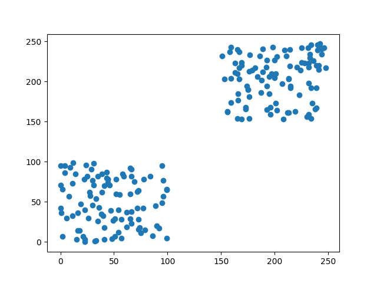

```ini
x = np.random.randint(0, 100, 100).tolist() + np.random.randint(150, 250, 100).tolist()
y = np.random.randint(0, 100, 100).tolist() + np.random.randint(150, 250, 100).tolist()
X = [[i,j] for i,j in zip(x,y)]
X = np.array(X)
```

首先我們先用程式創建一個密度相似的資料集，接下來透過DBSCAN分群來看看結果。


```makefile
dbscan = DBSCAN(eps=30, min_samples=4)
dbscan.fit(X)
label_pred = dbscan.labels_
plt.scatter(X[:, 0], X[:, 1],c=label_pred)
plt.show()
```

可以看到圖片中分群效果是很好的，這是因為我們知道資料分布的狀況，而且數據不混亂，所以可以很快地設定DBSCAN的參數。但在實際的數據中很難像圖片中一樣乾淨。所以我們現在加入一些雜訊，讓資料更能貼近實際狀況。


在這裡我重新調整了DBSCAN的參數(eps=10,min_sample=3)，調整完後可以看到DBSCAN還是能大致分類出兩大群，但效果已經沒有一開始的好，如果這時我們又加入了一筆資料呢?

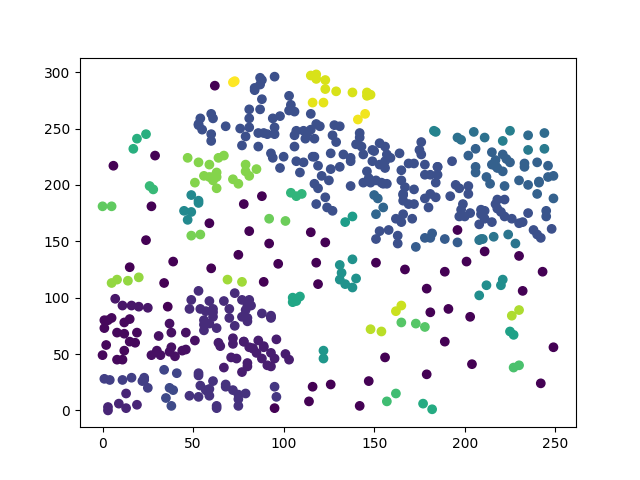

加入資料後分群的結果再度變成了另一種樣子，這就是DBSCAN特性造成的最大的缺點，只要去變動一點資料，或是稍微調整參數值，就會大幅度的改變原先的結果。而且調整DBSCAN的參數時，必須需要對原始資料非常熟悉，不然會非常的難調整參數，可能條整了半天都沒辦法達成想要的結果。

看到了DBSCAN的問題是不是覺得拿來做分群會非常的麻煩，所以我們需要了解一下HDBSCAN這個分群方式

HDBSCAN(Hierarchical DBSCAN)
============================

`HDBSCAN(Hierarchical DBSCAN)`就是為了解決DBSCAN的這些問題從而誕生的技術，不過這一個技術說明起來會牽扯到非常多的相關知識，所以我在這邊挑幾個重點來講解HDBSCAN的分群方式。

空間變換
----

在我們分群時最頭痛的就是異常點，因為不管是K-means還是DBSCAN都會因為異常點從而影響到了分群的結果，為了改善異常點問題，HDBSCAN利用了**密度的關係**來作`空間變換`，因為異常點密度較低，所以只需密度較低的樹據，推移到更遙遠的地方，這樣子程式就更容易忽略這些異常點。

建立最小生成樹
-------

通過了剛剛提到的空間變換，我們會取得一些密度較高，但各群組密度卻不相同的數據，因為這些群組的產生方式，是依照隨機半徑匡列出來的數據點，也因為密度不同的關係，若要有良好的分群效果必須要在這些群組內計算出最有可能的分群結果，所以我們需要在群內使用演算法產生出`最小生成樹`，來計算我們各點之間的權值。

構建與壓縮群組層次結構
-----------

我們給定群內的最小生成樹，下一步是將其轉換為連接組件的層次結構。根據樹之間的距離，對樹的邊緣進行按增加的順序排序，不斷的重複以上動作，直到每條邊都創建一個新的合併的群組(數據點較近的重新分成一群)。這樣子就能夠將龐大而復雜的群組拆分成更小的群組，如果群組內有**少於最小的樣本的點，就會被當成異常點**

統整了以上提到的三種技術，HDBSCAN實際上做了以下的事情來達成分群的效果。

1.隨機找到一個數據點當作圓心，並隨機產生半徑畫圓，匡列到的數據點都會被當成同一群類

2.通過各圓心得距離來初步排除異常點

3.在各群組內的建立最小生成樹

4.通過演算法將群內的數據點分成更小的群組，並根據設定的最小樣本數排除異常點

5.重複以上動作直到掃描完所有的數據點

與DBSCAN不同的地方是，因為半徑是由程式隨機產生，所以我們只需要控制圓圈內的最小數據點(最低密度)，就能夠快速又穩定的完成分群。這樣子的作法雖然能夠達到較穩定的分群結果，但也因為在構建群組層次結構時會將這些結果再分的更小，所以我們基本上都需要手動合併一些主題。

說完了HDBSCAN，接下來我們來看看為何文字分群要使用S-BERT這一個model吧。

Sentence-BERT(S-BERT)
=====================

為了將文字轉換成能夠被分群的資料，我們需要透過一些方式轉換，像是可以通過先前接觸到的BERT，透過訓練文本之間的回歸任務，將文字拼接到網路之中，但如果是使用BERT方式，過程將會十分的緩慢，例如層次分群的方法，分群10,000個句子，BERT大約需要花費65個小時才能夠完成。但我們不可能只是為了分群就等了這麼久，所以我們要來看看S-BERT究竟是什麼?能不能替代BERT當作分群轉換方式。

S-BERT這是個model是對BERT分群的方式改進而產生的model，該model是使用`孿生網路(Siamese network)`和`三重網絡(triplet networks)`結構來產生一個有意義的embedding，embedding結果可以直接通過餘弦相似度或歐式距離等數學公式直接進行比對，這替代了原本BERT對句子之間做回歸的訓練時間。據S-BERT論文所說，可以將BERT原本65小時訓練時長縮短至僅僅5秒。

孿生網路(Siamese network)
---------------------

在開始說明S-BERT之前我們要先知道什麼叫做`孿生網路(Siamese network)`，所謂的孿生神經網路，就是由兩個`權值共享（Shared Weights）`的子網路所建構出的一個網路，你可能會想若是兩個相同的神經網路那並且權值共享，那不就等於是一個相同的網路嗎?幹嘛要多此一舉將一個網路能解決的是分成兩個。這個問題的答案非常簡單。

答案就是我們需要兩個embedding的結果來計算文本之間的相似度，所以我們需要有兩個輸入與兩個輸出，這時就使用一個網路就無法達成這個目的了。

三重網絡(triplet networks)
----------------------

三重網絡是孿生網路的一種延伸，孿生不同的是，三重網路在訓練時，採用三個樣本為一組，分別是`參考樣本`、`同類樣本`、`異類樣本`，這三個樣本是使用相同的網路。

三重網路會有兩個輸出一個是**參考樣本與同類樣本**計算出來的相似距離，另一個是**參考樣本與異類樣本**計算出來的最不相似距離，通過這樣的訓練方式我們就可以找到最相似的樣本與最不相似的樣本。

三重網路的做法與我們在[【day13】預訓練模型訓練 & 應用- 使用OpenCV製作人臉辨識點名系統 (下)](https://ithelp.ithome.com.tw/articles/10291607)稍微提及到的Google Face Net所要做的事情相同，只是對象從人臉變成了文字而已。

接下來我們來看看S-BERT的架構到底是什麼

S-BERT架構
--------


S-BERT做了些實驗比較孿生網路與三重網路哪種方式較佳，而這一方面由孿生網路勝出，所以我們可以看到圖片中S-BERT的基礎架構其實就是，將原始的BERT加上一層池化層並更改成孿生網路的模式而已。

在S-BERT的網路中池化層的功用非常的重要，因為輸入的token都不同，所以輸出的維度也就會不平均，於是就需要在BERT的輸出後面，加入一層mean pooling來取token的平均值，這樣子就可以取得BERT該有的embedding大小。

通過這樣子的結果，我們就可以直接使用這個embedding來各句子之間的相似度，或是直接使用這個embedding來幫助我們對文字做分群。

結論
==

我們今天所講的兩個技術，都是在文字分群中相當重要的，因為我們在分群時最重要的就是準確率以及完成速度，若分群的速度過於緩慢，那不如自己手動分群。

所以我們需要拋棄掉BERT的方式，改用S-BERT幫助我們完成分群的動作，並且利用HDBSCAN這種不容易受到資料影響的分群方式，讓我們能夠找到更仔細的群組，接下來就是看我們該如何把這些群組合併或是移除了，我們明天就來看看如何使用這兩個技術，對google評論分群的效果。

---

<a id="5607-day-23"></a>

## Day 23｜【day23】對Google評論自動分群-HDBSCAN與Sentence-BERT(下)

- 原文：https://ithelp.ithome.com.tw/articles/10298788

今天的目錄如下:

*   1.取得Google地圖評論
*   2.S-BERT安裝與資料轉換
*   3.HDBSCAN安裝與資料合併
*   4.查看最終結果

取得Google地圖評論
------------

今天我們要對"台北101觀景台"的google地圖評論自動分群，雖然這些評論都能用Google Map API取得，不過Google Map API使用太多次是要付費的，所以在這邊還是會使用爬蟲的方式取得我們需要的資料，這次的過程會和上次[【day14】預測Hololive七期生的樣貌-生成式對抗網路(Generative Adversarial Network)(上)](https://ithelp.ithome.com.tw/articles/10292214)的方式差不多，但同樣的東西我當然不可能會讓你們看兩次，所以這次我會說明一些我常用的技巧，讓你能加快找到資料的速度。

之前在找資料時，都是透過網站載入的時間序來去尋找我們想要的AJAX網址，但這樣子的效率實在是太慢了，所以這次我們使用CTRL+F大法，直接搜尋我們要內容(這裡是文字)，就可以通過這個內容快速找到對應的AJAX網址。

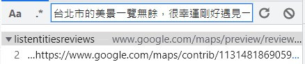

接下來點擊我們剛剛搜尋到的結果，就能夠快速的找到這個資料存放在哪一個AJAX網址裡面

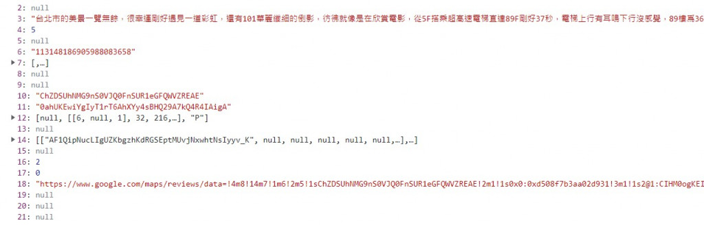

找到了AJAX網址後我們來分析網址，之前我們都是通過手動找到網址的參數，不過當AJAX網址太長時，整理起來就會非常困難，所以在這邊可以直接點到Payload的頁面上，就能夠快速的看到這些網址究竟需要傳送哪一些參數。

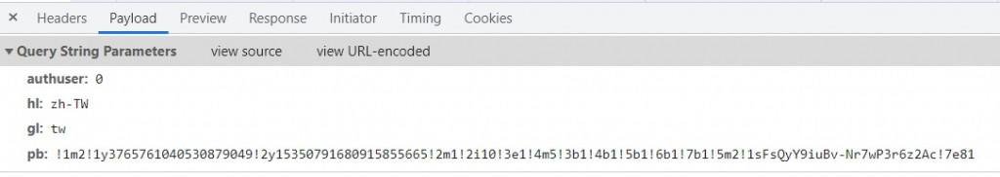

接下來我們就能夠開始撰寫程式了，這邊也與先前用的方式不同，之前我們是直接複製AJAX網站，但這樣子會有些缺點，第一個就是管理起來太不方便了，若需要一次修改很多參數，我們就會一直修改某一段的網址然後再重組，而且這樣的方式也很難讓我們觀看這些參數，所以我們可以直接將剛剛的參數寫成一個字典，這樣子不只能方便觀看，還能夠快速地修改參數值。

```
import requests
params = {
   'authuser': '0',
    'hl': 'zh-TW',
    'gl': 'tw',
    'pb': '!1m2!1y3765761040530879049!2y15350791680915855665!2m1!2i10!3e1!4m5!3b1!4b1!5b1!6b1!7b1!5m2!1sFsQyY9iuBv-Nr7wP3r6z2Ac!7e81'
}
r = requests.get('https://www.google.com/maps/preview/review/listentitiesreviews?' ,params = params)
```

用以上程式取得到JSON資料後，就可以來分析哪一個JSON的節點是我們想要的資料，在這邊需要通過一些JSON結構分析器(Preview也看的到)分析出JSON的結構，才能讓我們知道資料存放在哪些節點。不過我們需要注意一點，就是google map的JSON資料裡面前4碼是錯誤的，所以必須先將這4碼移除掉，分析器才能夠正常運作。


通過結構分析可以看到資料都存放在JSON的第三個節點中，但我們只需要評論資料，所以我們可以透過縮小節點條件的方式只保留文本資料。

```
r_json = json.loads(r[4:])
for i in r_json[2]:
    print(i[3])
```

在爬蟲中必須要不斷的更換網址來達成翻頁的動作，所以我們需要去執行換頁的動作刷新URL來找到其中的規律。

```
!1m2!1y3765761040530879049!2y15350791680915855665!2m1!2i10!3e1!4m5!3b1!4b1!5b1!6b1!7b1!5m2!1sr98yY9iDLrfP2roP7sWVsAc!7e81'

!1m2!1y3765761040530879049!2y15350791680915855665!2m1!2i20!3e1!4m5!3b1!4b1!5b1!6b1!7b1!5m2!1sr98yY9iDLrfP2roP7sWVsAc!7e81'
```

可以看到第一頁的資料在2i10裡面，第二頁的資料在2i20裡面，所以只需要變換這個數字，就能夠達成翻頁的動作了。

最後我們設立停止條件來結束爬蟲(都是None時跳脫)

```
for i in r_json[2]:
        if i[3] == None:
            error_cnt+=1
        else:
            comments.append(i[3])
        if error_cnt ==10:
            flag = 1
    if flag:
        break
```

最後將這些評論存入CSV就完成我們今天要用的資料集了

```
google_comment_df = pd.DataFrame({"評價":comments})
google_comment_df.to_csv("台北101觀景台.csv")
```

### 爬蟲完整程式碼

```
import requests
import json
import pandas as pd

params = {
   'authuser': '0',
    'hl': 'zh-TW',
    'gl': 'tw',
    'pb': '!1m2!1y3765761040530879049!2y15350791680915855665!2m1!2i100!3e1!4m5!3b1!4b1!5b1!6b1!7b1!5m2!1sr98yY9iDLrfP2roP7sWVsAc!7e81'
}
cnt = 0
comments = []
error_cnt =0
flag = 0
while(1):
    params['pb'] = f'!1m2!1y3765761040530879049!2y15350791680915855665!2m1!2i{cnt*10}!3e1!4m5!3b1!4b1!5b1!6b1!7b1!5m2!1sr98yY9iDLrfP2roP7sWVsAc!7e81'
    r = requests.get('https://www.google.com/maps/preview/review/listentitiesreviews?' ,params=params).text
    r_json = json.loads(r[4:])
    print(cnt)
    for i in r_json[2]:
        if i[3] == None:
            error_cnt+=1
        else:
            comments.append(i[3])
            error_cnt = 0
        if error_cnt ==10:
            flag = 1
    if flag:
        break
    cnt+=1
google_comment_df = pd.DataFrame({"評價":comments})
google_comment_df.to_csv("台北101觀景台.csv")
```

S-BERT安裝與使用
-----------

剛剛取得資料所以下一步就是將資料轉換成embedding的形式，才能夠被機器看懂，所以需先安裝S-BERT的函式庫

```
pip install sentence-transformers
```

這個函式庫的下載model的方式與hugging face相似，只是改成使用SentenceTransformer('model名稱')。不過S-BERT沒有專用的中文BERT model，所以我們直接用多國語言的版本來完成我們的轉換工作。

```
from sentence_transformers import SentenceTransformer
model = SentenceTransformer(sentence-transformers/distiluse-base-multilingual-cased-v2)
```

有了model後我們只需要剛讀取CSV檔案透過一行程式碼，就能把每一個句子都更換成embedding的格式啦

```
data = pd.read_csv("台北101觀景台.csv")['評價'].tolist()
embeddings = model.encode(data)
```

HDBSCAN安裝與資料合併
--------------

接下來我們需要安裝HDBSCAN，如果是跟我一樣是windows的用戶在安裝HDBSCAN之前必須下載

[Visual Studio](https://visualstudio.microsoft.com/zh-hant/downloads/)這樣才能夠使用pip安裝HDBSCAN。

```
pip install hdbscan
```

接下來隨便調整min_cluster_size就能夠分群了，因為HDBSCAN分群的效果較穩定，所以並不需要在HDBSCAN上做太多的調整，而是將**重點放在合併主題**的方式上。

```
cluster = hdbscan.HDBSCAN(min_cluster_size = 15).fit(embeddings)
```

分群完畢後你肯定會發現結果實在太多了，所以我們還需要把相似的主題合併為一個主題，在這裡可以使用`TF-IDF`或是`相似度檢測`的方式來合併。在這裡我會試範如何使用相似度檢測的方法合併主題，若對TF-IDF的方式有興趣的人可以在S-BERT的官方文件中找到程式範例[點我前往](https://www.sbert.net/examples/applications/clustering/README.html)。

這邊我採用一種比較暴力的方式，來交給S-BERT做相似度檢測

1.將所有主題內的句子合併成一個文件

2.使用餘弦相似度計算個主題之間的相似度

3.將大於0.5以上的文本合併

4.重複以上動作直到沒有結果符合步驟3

首先我們先將所有的文本合併在一起

```
topics = {}
for comment,label in zip(data, cluster.labels_):
    topics[label]+=' ' +  comment

corpus = [i for i in topics.values()]
```

接下來把文本轉換成embedding的形式，並且通過餘弦相似度來判別各主題之間的相似度

```
epochs = 100
for epoch in range(epochs):
    #找到當前該被查詢的主題
    i = epoch % len(corpus)
    corpus_embeddings = model.encode(corpus)
    query_embeddings = model.encode(corpus[i])
    #計算該主題與其他主題的相似度
    for query, query_embedding in zip(queries[i], query_embeddings):
        #計算餘弦相似度
        distances = scipy.spatial.distance.cdist([query_embedding], corpus_embeddings, "cosine")[0]
```

取得了個主題的相似度後，先將分數由高到低的排列來找到最相似的主題，在這邊我們只合併最相似的主題，這是為了防止這些主題過度合併。

```
#將分數由高排到低
results = zip(range(len(distances)), distances)
results = sorted(results, key=lambda x: x[1])
#找到最佳的結果
for idx, distance in results[0]:
    #只要分數>0.5就合併該主題
    if 1-distance > 0.5:
        corpus[i]+=corpus[idx]
        corpus.remove(corpus[idx])
```

最後結果
----

合併完後我們需要將這些句子還原，因為合併時的方式是利用空白做分割，所以只需要用split()分割文字將結果還原就能存入CSV中觀看結果了。

```
results = {}
for cnt,i in enumerate(corpus):
    results[cnt] = i.split(' ')
    
results_df = pd.DataFrame.from_dict(results, orient = 'index')
results_df = results_df.transpose()
results_df.to_csv('output_result.csv')
```


由左往右數，可以看到主題1是關於101的電梯設備，主題3是觀景台的風景，主題4是門票的價格，在這個結果之中，除了主題2的分類較混亂，其餘的結果都是良好了，不過這個程式還有許多能改善的地方。

例如我們直接採用embedding的結果分群就會因為**維度太大**(768維)，導致HDBSCAN分群效果沒有達到預期的成果，如果使用PCA、T-SNE等**降維**方式，不僅能改善這個問題，還能增加運算速度。

再來是相似度檢測的部分，在這裡我是直接將文字全部當作一個句子去計算相似度，但這樣子在一個句子就會包含太多訊息，這樣會導致S-BERT無法很好的辨識出結果，若比對個主題單一句子之間的相似度，效果肯定會比現在好很多。

最後就是文字前處理的部分，在這程式中我完全沒有做任何的資料前處理，若是能移除掉一些表情符號、URL、標點符號，結果應該會更好。

完整程式碼
-----

```
from sentence_transformers import SentenceTransformer
import scipy.spatial
import hdbscan

model = SentenceTransformer(sentence-transformers/distiluse-base-multilingual-cased-v2)
data = pd.read_csv("台北101觀景台.csv")['評價'].tolist()
embeddings = model.encode(data)
cluster = hdbscan.HDBSCAN(min_cluster_size = 15).fit(embeddings)

topics = {}
for comment,label in zip(data, cluster.labels_):
    topics[label]+=' ' +  comment

corpus = [i for i in topics.values()]
corpus_embeddings = model.encode(corpus)

epochs = 100
for epoch in range(epochs):
    #找到當前該被查詢的主題
    i = epoch % len(corpus)
    query_embeddings = model.encode(corpus[i])
    #計算該主題與其他主題的相似度
    for query, query_embedding in zip(queries[i], query_embeddings):
        #計算餘弦相似度
        distances = scipy.spatial.distance.cdist([query_embedding], corpus_embeddings, "cosine")[0]
        #將分數由高排到低
        results = zip(range(len(distances)), distances)
        results = sorted(results, key=lambda x: x[1])
        #找到最佳的結果
        for idx, distance in results[0]:
            #只要分數>0.5就合併該主題
            if 1-distance > 0.5:
                corpus[i]+=corpus[idx]
                corpus.remove(corpus[idx])
                
results = {}
for cnt,i in enumerate(corpus):
    results[cnt] = i.split(' ')
    
results_df = pd.DataFrame.from_dict(results, orient = 'index')
results_df = results_df.transpose()
results_df.to_csv('output_result.csv')
```

課程中的程式碼都能從我的github專案中看到

[https://github.com/AUSTIN2526/learn-AI-in-30-days](https://github.com/AUSTIN2526/learn-AI-in-30-days)

---

<a id="5607-day-24"></a>

## Day 24｜【day24】加快程式的運算速度-學習常見的降維演算法

- 原文：https://ithelp.ithome.com.tw/articles/10300047
- 發佈時間：2022-09-28 21:56:38

在過去23天內我們學習到了各神經網路模型的架構與原理，並且藉由小專案的方式來使用這些模型，但在AI的技術中除了要運用這些模型，還要學習如何輸入乾淨的的資料，所以在剩下的幾天之內，我會來補充一些實用的資料前處理技巧。

為何要降維(Dimension Reduction)
--------------------------

當我們在運算維度較高的資料時，運算就會需要花費較多的時間與資源，若今天有一個方式能夠將這些資料縮小，卻能保持原始的特性，那豈不是能夠完美的解決問題?所以今天要來說說降維究竟是什麼

降為可以幫我們縮小資料的維度，從而加快程式的運算速度，但降維不只能做到以上兩件事情，它還能夠幫助我們將資料視覺化(我們基本上只看得懂2維與3維)，還能夠解決`維數災難(curse of dimensionality)`的問題。

維度災難的意思是，當一個資料維度太高空間的體積太大時，因而可用數據變得很稀疏(太多雜訊)，導致資料沒有麼用處，但降維可以通過特徵抽取的方式來投影出更小的維度，所以能夠使用降維的方法來處理維度災難的發生。

也因為是一整特徵提取的方式，所以我們常常都會在機器學習的領域中看見這一技巧，了解降維能解決的問題後，我們開始進入今天的主題，我們來看看兩個最常見的降維方式`PCA`與`t-SNE`。

主成份分析(Principal component analysis)
-----------------------------------

`主成份分析(Principal component analysis)`簡稱PCA，也被稱為最簡單的降為方式，其主要方式就是提取高維度的資料特徵投影到一個低維度的空間，來達到**化繁為簡**效果，這種方式能夠讓我們的原始資料在沒有什麼損失的情況下，用更精簡的方式來表達原始資料。

為了知道PCA是如何達成資料降維的動作，我們來看看PCA的實際操作，不過這些操作牽扯到了太多線性代數公式，所以我在這邊舉一個簡單的例子來幫助你了解PCA的構造。

假設我們今天想要買一台筆電但卻不知道該如何挑選，所以找了一些懂電腦的朋友幫助你挑選筆電，他們跟你說買筆電需要看，CPU、顯示卡、電池容量、記憶體大小、螢幕大小，但這兩個人判斷的結果不相同，效能派的朋友認為選擇筆電的優先順序是顯卡>CPU>記憶體>螢幕大小>電池容量，耐久派的朋友認為電池容量>CPU>記憶體>螢幕大小>顯卡，這時候如你是效能派就會在挑選筆電時，用效能派意見為主，耐久派的意見為輔，找到你最想要的筆電。

接下來我們把剛剛提到的例子轉換到PCA的概念上

最想要的筆電是`最終目標`

懂電腦的朋友是`主成份分析`

CPU、顯示卡、電池容量、記憶體大小、螢幕大小是`擷取的特徵`

效能派與耐久派分別代表為`第一主成份`與第`二主成份`

簡單來說PCA就是設立一個想要的目標，找出資料特徵，並且通過演算法計算第一主成份與第二主成份(這個主成份代表著資料維度)，最後通過這些主成份來完成一個更低維度的資料。

t-隨機鄰近嵌入法(t-distributed Stochastic Neighbor Embedding)
------------------------------------------------------

`t-隨機鄰近嵌入法(t-distributed stochastic neighbor embedding)`簡稱t-SNE，這個演算法與PCA相同，都是為了將高維度的空間投影到低維度，不過t-SNE與PCA不相同地方的是，PCA在降維時空間結構會崩塌。

我們可以想像PCA處理降維的動作就是，對一個麵包大槌一揮把它打扁，硬生生的將高維空間扁成低維，這樣子會導致高維平面上的資料重疊。t-SNE則會將麵包分成好幾塊並且將小塊的麵包丟到更遠的地方，不過這解說起來比較複雜，所以我們先看看以下的例子。

假設我們在新生入學的演講現場，校長要求在附近的同學開始溝通，社交能力強的人附近就會有較多人，而沒有社交能力的人附近的人就會較稀少，這時校長根據人數給予各組彈力不同的彈簧，並要求每一組必須在固定的範圍內移動，若在範圍內遇見其他人就需要將他彈走，最後範圍內沒有人能夠彈的時，校長就在這些組別的蓋了一間教室當作它們的班級。

接下來我們把這了例子轉換到t-SNE上

附近的同學代表的是`歐式距離（Euclidean distances）`

社交能力強代表的是`高斯分布(Gaussian distribution)又稱常態分布`

社交能力弱代表的是 `t分布`

範圍代表的是`困惑度（Perplexity）`

結合例子與實際的應用t-SNE實際在做的事情就是，計算各點之間的歐式距離，若密度較高的群組使用高斯分佈計算，密度較低則用t分布計算，並且通過設定困惑度，將密度較低的點彈到更遠的地方或不見(因為不重要)，密度適中得點會稍微移動，最後將這些群組或點保留在設定的平面上。通過這的方式排除無意義的資料，保留相似的資料並且還能保有一定的距離關係。但這樣的作法也有些缺點，就是t-SNE無法接受新的資料，需要重新訓練才行。

---

<a id="5607-day-25"></a>

## Day 25｜【day25】手刻最簡單的神經網路-單層感知器（Single Layer Perceptron）

- 原文：https://ithelp.ithome.com.tw/articles/10300823

課程剩下最後的6天，我們今天要來增加你對神經網路的印象，所以今天要來手刻最簡單的神經網路`單層感知器（Single Layer Perceptron）`

你有想過什麼是最基本的神經網路嗎?答案就是單層感知器（Single Layer Perceptron）。你可以把這個技術想像成我們在課堂最一開始學習到的DNN神經網路的前身，我們看到以下這張圖片你可能就了解為什麼我這麼說了。


> 圖片來源:https://medium.com/nerd-for-tech/flux-prediction-using-single-layer-perceptron-and-multilayer-perceptron-cf82c1341c33

這張圖片已經包含了所有單層感知器該知道的知識，不過我們還是大致上說一下單層感知器做了哪些事情。單層感知器有三的必要的參數分別就是`X、W、B`，用數學式表達這三個之間的關係就是`f(X) = WX+b`，與我們DNN的意思相同X代表輸出，W代表權重(也是我們需要訓練的參數)，B則是偏移量，單層感知器的作法就是利用WX+b的方式計算出f(x)，並以0為分界線，來判斷出最後的結果，我們用程式表達的方式如下

```
if dot(W,X) - b >=0:
    fx = 1
else:
    fx = 0
```

我們可以看到單層感知器不像DNN一樣有很多個輸出，而是只有一個輸出f(x)，並且這一個輸出只會有0與1的結果，這代表單程感知器只能對資料做二分法，超過則沒辦法判斷。

訓練用的參數
------

先前我們在用pytorch訓練神經網路時，我們需要設定`epoch`、`learn rate`與還有`損失函數(loss function)`與`反向傳播 (Backpropagation)`，但我們在單層感知器並沒有反向傳播的動作，所以單層感知器是只使用`前向傳播 (Forwardpropagation)`的方式訓練出來的。

我們先來快速的講解一下反向傳播是什麼。反向傳播是一種用輸出與實際值比對(loss)後重新訓練神經網路的方式，我們目前的課程中，都有使用到反向傳播的方式來訓練程式的，反倒是沒有使用過"只有"前向傳播的網路，這是因為反向傳播能夠損失函數**計算**目前數值與實際數值之間的誤差，最後將這個誤差**更新到每一個隱藏層**，優化每個隱藏層神經網路。

那前向傳播是什麼呢?簡單來說就是**判斷**目標與實際值，如果數值太大就往下降，如果太小就往上增加，直接**更新整個權重**在重新做計算。

這樣你了解到為什麼只有前向傳播的網路到後期沒人在使用了吧，因為後期的神經網路越來越多層，越來越混亂，如果是更新全部的權重，可能會導致每次產生的結果完全不一樣，就算條件設立的在多都無法穩定的更新。

而我們今天要學習的單層感知器就是一種只有前向傳播的單的神經網路，所以我們只需要調整epoch與learn rate就可以了。

手刻單層感知器
-------

今天的目錄如下:

*   1.設定數據集資料
*   2.架構神經網路模型與功能
*   3.使用模型與功能

設定數據集資料
-------

我們今天要來用單層感知器來實現一些邏輯閘(AND、OR)的功能，所以第一步就是設立邏輯閘的資料。

```
AND_x_train = np.array([[0,0],[0,1],[1,0],[1,1]])
AND_y_train = np.array([0,0,0,1])
AND_x_test = np.array([[0,1],[1,1],[0,0],[1,0]])

OR_x_train = np.array([[0,0],[0,1],[1,0],[1,1]])
OR_y_train = np.array([0,1,1,1])
OR_x_test = np.array([[0,1],[1,1],[0,0],[1,0]])
```

架構神經網路模型與功能
-----------

接下來我們可以開始定義model內部的計算公式，剛剛提到公式是WX+b，在這裡的b指的就是向量的角度的數值，我們可以利用國中學習到的內積公式可以反推COSθ(a﹒b = |a|x|b|COSθ)，最後ACOS算出b值，在這邊我將程式碼都寫成像是keras的方式方便讓你理解

```
class Perceptron:
    def model(self,x):
        self.b = np.dot(self.w, x) / (np.linalg.norm(self.w) * np.linalg.norm(x))
        self.b = math.acos(self.b)
        
        # W﹒X - b > 0
        return  np.dot(self.w, x) >= self.b
```

定義好model後我們就可以用開始定義訓練方式了，在最開始說到若數值大於0輸出為1，所以我們要透過公式來降低或提高權重，而這個公式就是`W = W + lr*X`這樣就可以使用學習率的方式來更新權重

```
#隨機初始化權重
self.w = np.random.uniform(-0.5, 0.5, X.shape[1])
#測試是否大於0
y_pred = self.model(x)
#若輸出要為1但是結果<0就要提高權重
if y == 1 and not y_pred:
    self.w += lr * x
#若結果為0但結果>0就要降低權重
elif y == 0 and y_pred:
    self.w -= lr * x
統計正確的結果，方便後續計算準確率
else:
    acc+=1
```

將以上的程式加入epoch來重複訓練，並且紀錄每一個epoch的結果

```
def fit(self, X, Y, epochs = 100, lr = 0.05):
        self.w = np.random.uniform(-0.5, 0.5, X.shape[1])
        self.result = {'acc':[],
                       'w':[],
                       'b':[],
                       'epoch':[]
        }

        for i in range(epochs):
            acc = 0
            for x, y in zip(X, Y):
                y_pred = self.model(x)
                if y == 1 and not y_pred:
                    self.w += lr * x
                elif y == 0 and y_pred:
                    self.w -= lr * x
                else:
                    acc+=1
                    
            #紀錄資訊
            self.result['epoch'].append(i)
            self.result['acc'].append(acc/len(X))
            self.result['w'].append(self.w)
            self.result['b'].append(self.b)

            #全部預測成功中斷程式
            if acc / len(X) ==1:
                break
```

為了觀看我們訓練的過程，我們一些資料化成圖表，一些資料用print的方式顯示出來

```
def show(self, title):
    plt.plot(self.result['acc'])
    plt.title(title)
    plt.xlabel("Epoch")
    plt.ylabel("Accuracy")
    plt.ylim([0, 1])
    plt.show()
    for i in range(len(self.result['acc'])): \
        print(f"Epoch:{self.result['epoch'][i]}\
    Wight:{self.result['w'][i]}\
    θ:{self.result['b'][i]}\
    Acc:{self.result['acc'][i]}\
    ")
```

最後定義一個使用模型的方式，這樣就架構好整個神經網路了。

```
def predict(self,X):
    return [self.model(x) for x in X]
```

使用模型與功能
-------

在這裡我們總共定義了三個方法、fit()、show、與predict()，我們先來使用fit()訓練神經網路

```
#定義model
AND_model = Perceptron()
OR_model =  Perceptron()
#訓練
AND_model.fit(AND_x_train, AND_y_train)
OR_model.fit(OR_x_train, OR_y_train)
```

接下來為了知道模型訓練的效果我們將訓練的歷史紀錄都顯示出來

```
AND_model.show('AND')
OR_model.show('OR')
```

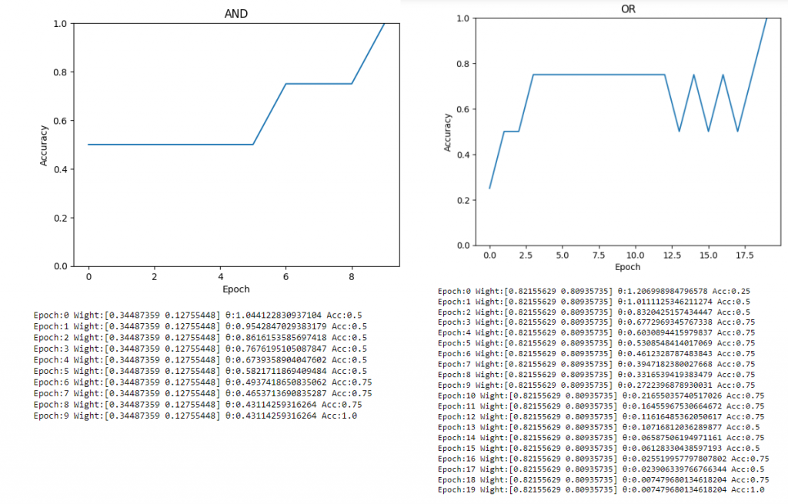

在圖片中可以看到我們的邏輯閘都被訓練完畢了，這時如果有要在使用自己的數據集就能夠用predict的方式呼叫，不需要再重新訓練了。

```
print(AND_model.predict(AND_x_test))
print(OR_model.predict(OR_x_test))
------------------顯示------------------
[False, True, False, False]
[True, True, False, True]
```

今天的課程中，有沒有更能幫助理解AI在python當中是如何被建造出來的，通過手刻神經網路來幫助你學習最扎實AI理論。

完整程式碼
-----

```
import numpy as np
import matplotlib.pyplot as plt
import math

class Perceptron:
    def model(self, x):
        self.b = np.dot(self.w, x) / (np.linalg.norm(self.w) * np.linalg.norm(x))
        self.b = math.acos(self.b)
        
        return np.dot(self.w, x) >= self.b 
    
    def fit(self, X, Y, epochs = 100, lr = 0.05):
        self.w = np.random.uniform(-0.5, 0.5, X.shape[1])
        self.result = {'acc':[],
                       'w':[],
                       'b':[],
                       'epoch':[]
        }

        for i in range(epochs):
            acc = 0
            for x, y in zip(X, Y):
                y_pred = self.model(x)
                if y == 1 and not y_pred:
                    self.w += lr * x
                elif y == 0 and y_pred:
                    self.w -= lr * x
                else:
                    acc+=1
            self.result['epoch'].append(i)
            self.result['acc'].append(acc/len(X))
            self.result['w'].append(self.w)
            self.result['b'].append(self.b)

            #全部預測成功中斷程式
            if acc / len(X) ==1:
                break
            
                    
    def show(self, title):
        plt.plot(self.result['acc'])
        plt.title(title)
        plt.xlabel("Epoch")
        plt.ylabel("Accuracy")
        plt.ylim([0, 1])
        plt.show()
        for i in range(len(self.result['acc'])): \
            print(f"Epoch:{self.result['epoch'][i]}\
 Wight:{self.result['w'][i]}\
 θ:{self.result['b'][i]}\
 Acc:{self.result['acc'][i]}\
            ")
           

    def predict(self,X):
        return [self.model(x) for x in X]
    
AND_model = Perceptron()
OR_model =  Perceptron()
XOR_model = Perceptron()

AND_x_train = np.array([[0,0],[0,1],[1,0],[1,1]])
AND_y_train = np.array([0,0,0,1])
AND_x_test = np.array([[0,1],[1,1],[0,0],[1,0]])

OR_x_train = np.array([[0,0],[0,1],[1,0],[1,1]])
OR_y_train = np.array([0,1,1,1])
OR_x_test = np.array([[0,1],[1,1],[0,0],[1,0]])

print(AND_model.predict(AND_x_test))
print(OR_model.predict(OR_x_test))
```

課程中的程式碼都能從我的github專案中看到

[https://github.com/AUSTIN2526/learn-AI-in-30-days](https://github.com/AUSTIN2526/learn-AI-in-30-days)

---

<a id="5607-day-26"></a>

## Day 26｜【day26】手刻神經網路來解決XOR問題-多層感知器 (Multilayer perceptron) (上)

- 原文：https://ithelp.ithome.com.tw/articles/10301417
- 發佈時間：2022-09-30 13:51:30

前向傳播、反向傳播
---------

昨天大致上提到了`前向傳播 (Forwardpropagation)`與`反向傳播 (Backpropagation)`，但因為是單層感知器所以我們沒有太深入了解，而且我去看昨天的文章發現有些部分會讓人誤會(~~截稿前才快寫完RRRR~~)，所以今天要來重新講解，什麼是前向傳播什麼是反向傳播。


**深度學習基本上就是在做前向傳播與反向傳播**，而前向傳播的定義非常簡單，就是在圖片中紅色箭頭的部分，所謂的前向傳播算法就是，**將上一層的輸出作為下一層的輸入，直到運算到輸出層為止**，前向傳播的概念非常簡單，我們所有的神經網路模型都是要先進行前向傳播計算，從而計算loss值，任何在複雜的神經網路都能用以下公式來表達`Σσ(WnXn+b)`(σ是激勵函數、b是偏移量)，但昨天提到了前向傳播在單層感知器的更新方式是一次更新所有數值，所以只有前向傳播的網路效果自然會很差。

所以才會有了反向傳播的方式，反向傳播是一種與`最佳化理論(Principle of optimality)`結合使用的方法，這個方法會根據所有神經網路的權重來計算損失從而更新梯度，所以我們只需要計算每一層神經網路的梯度，就能夠完成反向傳播，接下來我們看到計算方式(左側為輸入，右側為梯度公式)。


我們知道昨天計算的單層感知器，最後的輸出結果是W1X1+W2X2+b(矩陣表示為w.t+b)，我們把他帶入到∇f公式裡面就會變成


這時候我們就可以利用計算出來的梯度套用至梯度下降的公式裡面(`更新後權重 = 前一次訓練的權重 - 學習率*前一次訓練的梯度`)


最後我們把整個神經網路的公式都統整起來

前向傳播:`y = Σσ(WnXn+b)`

反向傳播計算梯度:`對所有輸入都做偏微分(含隱藏層輸入)`

梯度下降:`更新後權重 = 前一次訓練的權重 - 學習率x前一次訓練的梯度`

這樣子就是所有神經網路所在做的計算了。

XOR問題
-----

如果你昨天有嘗試過OR、AND以外的邏輯閘，你會發現NXOR與XOR不管怎麼調整學習率都無法完成訓練這是因為XOR在單層感知器上是不能被實現的。

我們把單層感知器視覺化，紅點代表XOR為0的數值，藍點代表為1的數值，紅線則是單層感知器，在這個例子中我們不管怎麼畫線都無法將紅點與藍點分開。


那我們該如何把紅藍點分開呢?答案很簡單就是畫兩條線就可以了


也就是我們要將只有單層的神經網路，多增加一層神經網路也就是下圖的形式，這種網路架構就稱之為`多層感知機(Multilayer perceptron)`簡稱MLP。

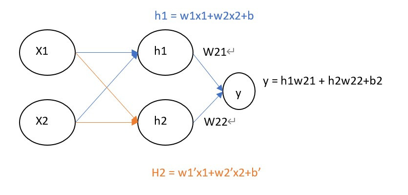

我們可以注意到一件事情，這與我們在[【day3】來辨識圖像-深度神經網路(Deep Neural Network)](https://ithelp.ithome.com.tw/articles/10288343)學習到的DNN是不是很像呢?因為MLP其實與DNN是一樣的，差別在於中間的隱藏層數量不同，通常DNN是指隱藏層數量大於2層的神經網路(畢竟叫做Deep Neural Network)，若只有一層我們通常就會叫他MLP，不過你把DNN與MLP混在一起大家還是會知道你在說什麼。

今天我們就先說到這裡好了，昨天接觸到了一些新程式所以今天只講解理論。明天我們要來講解如何手刻出MLP的神經網路，我們會一次比對兩種寫法分別是通過pytorch來快速的計算梯度與反向傳播，另一種則是手刻公式來計算梯度與反向傳播的方式。

---

<a id="5607-day-27"></a>

## Day 27｜【day27】手刻神經網路來解決XOR問題-多層感知器 (Multilayer perceptron) (下)

- 原文：https://ithelp.ithome.com.tw/articles/10302158

手刻多層感知器
-------

今天的目錄如下:

1.建立與初始化資料

2.架構神經網路模型

3.更新參數

4.顯示結果

建立與初始化資料
--------

與昨天相同我會把它寫成class的形式，因為是多層感知器，我們需要根據資料設定每一層的參數，在這裡我們先設定一下所有邏輯閘的資料集。

```
x = [[0.,0.], [0.,1.], [1.,0.], [1.,1.]]
x = torch.tensor(x)

XOR_y = torch.tensor([[0.], [1.], [1.], [0.]])
AND_y = torch.tensor([[0.], [0.], [0.], [1.]])
OR_y = torch.tensor([[0.], [1.], [1.], [1.]])
```


接下來要建立上圖的神經網路架構，所以需要來了解每一層的維度大小，首先輸入是(4,2)，進入到隱藏層則要縮到(2,2)，並且要完成`y=wx+b`這一個公式，根據上圖可以知道所有的隱藏層輸入都是h=w1x1+w2x2+b，只是每一個輸入的w1、w2、b都不相同而已。

所以我們將公式轉換為矩陣格式y = WX+b中的`W、b`必須符合輸入大小，所以`輸入到隱藏層W是(2,2)`，`隱藏層到輸出則是(2,1)`，最後寫在__init__裡就可以隨時調整各層的神經元數量了。

```
class model:
    def __init__(self,inputs_shape , hidden_shape ,output_shape):
        #requires_grad=True 表示之後能夠被反向傳播(pytorch用法)
        #numpu改用np.random.uniform(size=(input_shape, hidden_shape))
        self.w1 = torch.randn(inputs_shape, hidden_shape, requires_grad=True)
        self.w2 = torch.randn(hidden_shape, output_shape, requires_grad=True)
        
        self.b1 = torch.randn(1,hidden_shape, requires_grad=True)
        self.b2 = torch.randn(1,output_shape, requires_grad=True)
        
        self.loss = []
        self.mse = MSELoss()
```

架構神經網路模型
--------

昨天說到神經網路的三個步驟`前向傳播`、`反向傳播計算梯度`、`梯度下降更新數值`，不過在前向傳播前我們需要定義激勵函數，將我們每一層的結果都變成非線性的結果。

```
def sigmoid(self, x):
    #numpy改用np.exp
    return 1 / (1 + torch.exp(-x))
```

接下來開始定義前向傳播的公式wx+b，這邊用self的寫法是因為我們在反向傳播時還需要用到這些數值

```
def forward(self,x):
        #pytorch中@代表矩陣相乘用*只會代表相同index的數字相乘
        #numpy須將@改用dot EX:np.dot(x, self.w1)
        #輸入到隱藏
        h = x @ self.w1 + self.b1
        h_out = self.sigmoid(h)
        
        #隱藏到輸出
        output = h_out @ self.w2 + self.b2
        outpu_fin = self.sigmoid(output)
        
        return outpu_fin
```

更新參數
----

### pytorch

在pytorch當中計算梯度非常簡單，因為只需設定了`requires_grad=True`，就能夠直接使用`.grad`將梯度計算完畢。pytorch也能夠使用`.backward()`快速的做反向傳播更新梯度數值，這個我們先前用過了很多次只是我們不知道這個function的實際含意。

```
def updata(self, loss, lr):
    loss.backward()
    with torch.no_grad():
        self.w1 -= self.w11.grad * lr            
        self.w2 -= self.w21.grad * lr

        self.b2 -= self.b2.grad * lr
        self.b1 -= self.b1.grad * lr

        self.w11.grad.zero_()
        self.w21.grad.zero_()

        self.b1.grad.zero_()
        self.b2.grad.zero_()
```

### numpy

但numpy更新梯度的方式就很困難了，因為在這裡我們必須對所有要更新的數值做偏微分，而這個過程會非常的複雜。

經過昨天[【day26】手刻神經網路來解決XOR問題-多層感知器 (Multilayer perceptron) (上)](https://ithelp.ithome.com.tw/articles/10301417)的課程中學習到的梯度計算方式，我們能夠知道若要計算出隱藏層的梯度，需要對`計算出的loss值`與`輸入到隱藏層(w1)`的資料做偏微分(O是預測輸出，W是輸入到隱藏層的資料、i是輸入、j連接到第幾個隱藏層神經元)

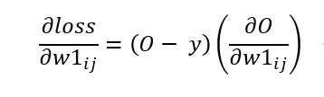

接下來分解∂O/∂w1

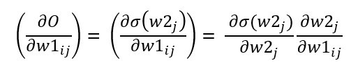

其中∂σ(w2)/∂w2)為sigmoid函數的導數`f'(x) = f(x)(1 - f(x))`。

輸入則是`∂w2/∂w1 = xn`(W = wx+b)

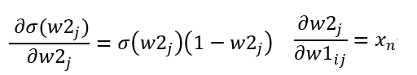

我們就會得到以下公式，這公式也代表`(預測輸出-實際值)*delsigmoid(最後的輸出)*最後的權重*輸入`

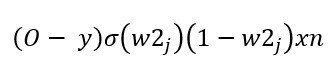

接下來計算好梯度後，就與pytorch更新梯度的方式相同了。

```
def updata(self, x, y, lr):
        loss = 0.5 * (y - self.output_final) ** 2
        self.loss.append(np.sum(loss))
        error_term = (self.output_final - y)

        #隱藏層梯度(注意這裡還多一層simgoid)
        grad1 = x.T @ (((error_term * self.delsigmoid(self.output_final)) * self.w2.T) * self.delsigmoid(self.h1_out))

        #輸出層梯度
        grad2 = self.h1_out.T @ (error_term * self.delsigmoid(self.output_final))

        self.w1 -= lr * grad1
        self.w2 -= lr * grad2
        self.b1 -= np.sum(lr * ((error_term * self.delsigmoid(self.output_final)) * self.w2.T) * self.delsigmoid(self.h1_out), axis=0)
        self.b2 -= np.sum(lr * error_term * self.delsigmoid(self.output_final), axis=0)
        
def delsigmoid(self, x):
        return x * (1 - x)
```

顯示結果
----

最後只要測試結果是否正確，以及繪製出loss折線圖就大功告成了

```
def predict(self, x):
        #pytorch需要加入torch.no_grad
        with torch.no_grad():
            return self.forward(x) >= 0.5 
        

    def show(self, title):
        plt.plot(self.loss)
        plt.title(title)
        plt.xlabel("Epoch")
        plt.ylabel("Loss")
        plt.show()
        
        print(f'第一層W:{self.w11.tolist()} \n第二層W:{self.w21.tolist()} \n第一層?:{self.b1.tolist()} \n第二層?{self.b2.tolist()}')
        
model.show()
```

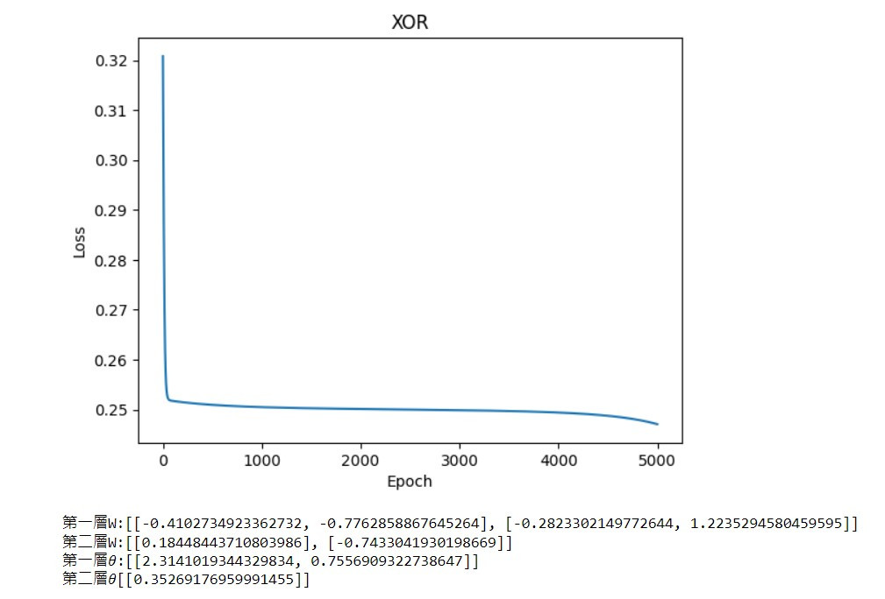

測試XOR結果

```
model.predict(x)
------------------------顯示------------------------
array([[ True],
       [False],
       [False],
       [ True]])
```

今天的程式比單層神經網路還要複雜一點，最主要的原因還是反向傳播的計算，如果都了解了這些計算方式後，我相信手刻出其他神經網路就只是時間早晚的問題了。

完整程式碼(pytorch)
--------------

```
import torch
from torch.nn import MSELoss
import matplotlib.pyplot as plt

class model:
    def __init__(self,inputs_shape , hidden_shape ,output_shape):
        self.w1 = torch.randn(inputs_shape, hidden_shape, requires_grad=True)
        self.w2 = torch.randn(hidden_shape, output_shape, requires_grad=True)
        
        self.b1 = torch.randn(1,hidden_shape, requires_grad=True)
        self.b2 = torch.randn(1,output_shape, requires_grad=True)
        self.loss = []
        self.mse = MSELoss()
        

    def fit(self, x, y , lr=0.2, epoch=200):
        for i in range(epoch):
            output = self.forward(x)
            loss = self.mse(output, y)
            self.loss.append(float(loss))
            self.updata(loss,lr)
            
    
    
    def updata(self, loss, lr):
        loss.backward()
        with torch.no_grad():
            self.w1 -= self.w1.grad * lr            
            self.w2 -= self.w2.grad * lr
            
            self.b2 -= self.b2.grad * lr
            self.b1 -= self.b1.grad * lr

            self.w1.grad.zero_()
            self.w2.grad.zero_()

            self.b1.grad.zero_()
            self.b2.grad.zero_()
            
    def forward(self,x):
        h = x @ self.w1 + self.b1
        h_out = self.sigmoid(h)
        
        output = h_out @ self.w2 + self.b2
        outpu_fin = self.sigmoid(output)
        
        return outpu_fin
    
    def sigmoid(self, x):
        return 1 / (1 + torch.exp(-x))
    
    def predict(self, x):
        with torch.no_grad():
            return self.forward(x) >= 0.5 
        

    def show(self, title):
        plt.plot(self.loss)
        plt.title(title)
        plt.xlabel("Epoch")
        plt.ylabel("Loss")
        plt.show()
        
        print(f'第一層W:{self.w1.tolist()} \n第二層W:{self.w2.tolist()} \n第一層?:{self.b1.tolist()} \n第二層?{self.b2.tolist()}')
```

```
x = [[0.,0.], [0.,1.], [1.,0.], [1.,1.]]
x = torch.tensor(x)

XOR_y = torch.tensor([[0.], [1.], [1.], [0.]])
AND_y = torch.tensor([[0.], [0.], [0.], [1.]])
OR_y = torch.tensor([[0.], [1.], [1.], [1.]])

XOR_model = model(2, 2, 1)
AND_model = model(2, 2, 1)
OR_model = model(2, 2, 1)

XOR_model.fit(x, XOR_y, 0.2, 5000)
AND_model.fit(x, AND_y,0.2, 5000)
OR_model.fit(x, OR_y,0.2, 5000)
```

```
XOR_model.show('XOR')
AND_model.show('AND')
OR_model.show('OR')
```

```
print(XOR_model.predict(x),AND_model.predict(x),OR_model.predict(x),sep='\n\n')
```

完整程式碼(numpy)
------------

```
import numpy as np

class model:
    def __init__(self, input_shape, hidden_shape, output_shape):
     

        self.w1 = np.random.uniform(size=(input_shape, hidden_shape))
        self.w2 = np.random.uniform(size=(hidden_shape, output_shape))

        self.b1 = np.random.uniform(size=(1, hidden_shape))
        self.b2 = np.random.uniform(size=(1, output_shape))

        self.loss = []

    def updata(self, x, y, lr):
        loss = 0.5 * (y - self.output_final) ** 2
        self.loss.append(np.sum(loss))
        error_term = (self.output_final - y)

        #隱藏層梯度(注意這裡還多一層simgoid)
        grad1 = x.T @ (((error_term * self.delsigmoid(self.output_final)) * self.w2.T) * self.delsigmoid(self.h1_out))

        #輸出層梯度
        grad2 = self.h1_out.T @ (error_term * self.delsigmoid(self.output_final))

      

        self.w1 -= lr * grad1
        self.w2 -= lr * grad2
        self.b1 -= np.sum(lr * ((error_term * self.delsigmoid(self.output_final)) * self.w2.T) * self.delsigmoid(self.h1_out), axis=0)
        self.b2 -= np.sum(lr * error_term * self.delsigmoid(self.output_final), axis=0)

    def sigmoid(self, x):
        return 1 / (1 + np.exp(-x))

    def delsigmoid(self, x):
        return x * (1 - x)

    def forward(self, x):

        self.h1 = np.dot(x, self.w1) + self.b1
        self.h1_out = self.sigmoid(self.h1)

        self.output = np.dot(self.h1_out, self.w2) + self.b2
        self.output_final = self.sigmoid(self.output)

        return self.output_final

    def predict(self, x):
        return self.forward(x) >= 0.5

    def fit(self,x,y,lr,epoch):
        for _ in range(epoch):
            self.forward(x)
            self.updata(x,y,lr)
            
    def show(self, title):
        plt.plot(self.loss)
        plt.title(title)
        plt.xlabel("Epoch")
        plt.ylabel("Loss")
        plt.show()

        print(f'第一層W:{self.w1.tolist()} \n第二層W:{self.w2.tolist()} \n第一層?:{self.b1.tolist()} \n第二層?{self.b2.tolist()}')
```

```
x = np.array([[0,0], [0,1], [1,0], [1,1]])

XOR_y = np.array([[0], [1], [1], [0]])
AND_y =np.array([[0], [0], [0], [1]])
OR_y = np.array([[0], [1], [1], [1]])

XOR_model = model(2, 2, 1)
AND_model = model(2, 2, 1)
OR_model = model(2, 2, 1)

XOR_model.fit(x, XOR_y, 0.2, 5000)
AND_model.fit(x, AND_y,0.2, 5000)
OR_model.fit(x, OR_y,0.2, 5000)
```

```
XOR_model.show('XOR')
AND_model.show('AND')
OR_model.show('OR')
```

```
print(XOR_model.predict(x),AND_model.predict(x),OR_model.predict(x),sep='\n\n')
```

課程中的程式碼都能從我的github專案中看到

[https://github.com/AUSTIN2526/learn-AI-in-30-days](https://github.com/AUSTIN2526/learn-AI-in-30-days)

---

<a id="5607-day-28"></a>

## Day 28｜【day28】不要再用準確率(Accuracy)評估分類模型了!-混淆矩陣(Confusion Matrix)與評估指標

- 原文：https://ithelp.ithome.com.tw/articles/10302523
- 發佈時間：2022-10-02 22:05:57

資料不平衡產生的問題
----------

我們先前在判斷分類任務時，只使用了`準確率(Accuracy)`來判別，但只依靠Accuracy來判斷分類模型卻不是一種最佳的方法，我們先看到以下例子:

假如我正在做一個關於**正面評論**會造成什麼影響的研究，但資料集卻是不平衡的狀態，在資料集中負面評論比例高達了90%，正面評論卻只有僅僅10%，如果這時程式都猜測結果是負面的Accuracy就會高達90%，這樣子的評估方式肯定是有問題的。

混淆矩陣(Confusion Matrix)
----------------------


所以在分類任務中應該要**根據需求**去調整評估方式，我們今天的主題`混淆矩陣(Confusion Matrix)`，就一種是用於分類問題的評估技術，這種技術衍生出了許多不同的指標，接下來讓我先介紹圖片中的`TP(Ture Positive)`、`FP(False Positive)`、`FN(False Negative)`、`TN(Ture Negative)`所代表的含意。

| 名稱 | 說明 |
| --- | --- |
| TP(Ture Positive) | 預測為YES 實際也為YES |
| FP(False Positive) | 預測為YES 實際為NO |
| FN(False Negative) | 預測為NO 實際為YES |
| TN(Ture Negative) | 預測為NO 實際也為NO |

TP、TN代表程式預測正確，FP、FN代表預測失敗的結果，其中FP、FN則是在4個參數中最為重要的兩個指標，這就與我們在觀看餐廳評價時相同，我們不會觀看5星評價而是觀看1星評價(畢竟沒有人會想給自己店刷1星吧)，所以在混淆矩陣中，我們會先考慮FP與FN的數值，因為通過這兩個指標**我們能知道錯誤究竟在哪裡**。

FP也會叫`Type I Error`，實驗中會**非常在意Type I Error**，因為這樣代表實驗中的**理論是錯的**，但實驗**結果卻是對**的。我們可能花費了一堆時間與金錢去做實驗，最後結果也是好的，但後來發現研究的理論跟方向是錯的，那就可就問題大了。所以Type I Error的數值通常都會設定很小，若實驗中超過這個數值就能拋棄掉這個做法了。

FN也叫做`Type II Error`，Type II Error與Type I Error相反，是代表**理論正確**，但**實驗結果**是錯誤的，這時只需要更換實驗方式來達成正確的結果。

混淆矩陣產生的評估指標
-----------

接下來我們來說到，從混淆矩陣中產生的4種最常見的評估指標`準確率(Accuracy)`、`精確率(Precision)`、`召回率(Recall)`、`F1 Score`。

| 名稱 | 公式 |
| --- | --- |
| 準確率(Accuracy) | (TP+TN)/total data |
| 精確率(Precision) | TP/(TP+FP) |
| 召回率(Recall) | TP/(TP+FN) |
| F1 Score | 2/(1/Precision)+(1/Recall)) |

我相信Accuracy大家都很熟悉了，所以我只說Precision、Recall與F1 Score。

### 精確率(Precision)與召回率(Recall)

Precision主要是計算`警告誤報(False alarm)`出現的的機率，這種評估方式是計算所有的正面結果中(實際值、預測值)實際為正面的機率，也就是說Precision是在**判斷正面資料的準確率**。

Recall則是再計算`目標的判斷失誤率(Miss)`，這種評估方式與Precision相似，不過與精確率不同的是，Recall是在**判斷成功的資料內，正面資料的準確率**。

兩者都是判斷正面的準確率但好像又不太同，那麼這兩個評估方式該怎麼使用?該用在哪些狀況上面呢?我們舉兩個例子來幫助理解。

例子1:

今天有一個自動門的系統，當判斷這個人為大樓住戶時才會開啟，這時候我們只需要了解這一個系統判斷大樓住戶的成功率究竟是多少，這時我們就會利用Precision來評估這個系統。

例子2:

今天警政署做了一個系統，要來判斷哪些人是通緝犯，這時不能放過任何一個通緝犯，我們就需要使用Recall來評估這個系統

若我們想要做出一個**叫重要的系統**(例子2)我們就會參考Recall值來評估，這時程式的精確率可能很低(匡列到很多路人)但召回率卻很高(找出很多通緝犯)。

但若是**比較簡易的系統**(例子1)就會採用Precision，這時Precision就會比較高(判斷到的基本上是大樓的住戶)，但recall卻會很低(大樓的住戶可能會被擋在外面)。

### F1 Score

但今天覺得Recall與Precision都很重要呢?這時候就要用F1 Score這個評估方式，這個公式的計算方式其實就是計算Recall與Precision的`調和平均數(harmonic mean)`，當這個分數越靠近1，我們系統的效能就會越好。

結論
--

在AI的模型中評估方式相當的重要，因為這直接代表了這個神經網路模型的好壞，而我們判斷一個神經網路模型，基本上不會只使用一個指標，因為如果只使用一種指標，只能代表這個評估方式與我們的神經網路模型相性很好，所以我們需要使用多樣評估方式，來評估神經網路的實際效能。

---

<a id="5607-day-29"></a>

## Day 29｜【day29 】蒐集資料與訓練模型時會發生的常見問題 & 解決方式

- 原文：https://ithelp.ithome.com.tw/articles/10303380
- 發佈時間：2022-10-03 20:27:37

今天是課程倒數第二天，我相信你在學習的過程中產生了很多的疑問，所以今天我要來統整在訓練時常見的問題與解決方式。但注意這些回答**都是參考解答不一定是最佳解**，因為在深度學習的技術中，我們沒有經過實驗是不會知道結果的。

loss值相關問題
---------

Q1:train loss與test loss趨近不變

A1:這通常代表神經網路學習完畢，若準確率不足可以嘗試更換神經網路架構。

Q2:為什麼train loss與test loss不管怎麼樣訓練都會非常的高，但卻會穩定下降

A2:通常這種情況會發生在回歸任務，最主要是因為資料沒有縮放到0~1之間導致loss值很高。

Q3:train loss 下降，test卻不會變動了該怎麼辦?

A3:神經網路已經overfitting了，若準確率足夠應該要做Early stopping的動作，若不足應該降低學習率或增加神經網路的深度來解決這個問題

Q4:train loss下降(不變)，test卻上升了這是怎麼回事?

A4:通常不會遇到這些種狀況，當你遇到這種情況最大的可能性就是**資料集有問題**(亂數資料)，可以試試將資料前處理後再放入神經網路訓練，看問題能否被改善

Q5:train loss不斷上升，test loss不斷上升

A5:會產生這問題的主要原因是**神經網路無法有效學習到資料的特徵**，通常遇到此情況只要降低學習率就會有不錯的結果。

模型相關問題
------

Q1:神經網路的各層參數該選擇多少?

A1:一般會以2的倍數去建立參數，若是圖片的部分(CNN)會有2n+1來設定，但還是要經過實驗才能知道最好的結果。

Q2:每層該選用那些激勵函數?

A2:通常在RNN神經網路中會選用tanh當作激勵函數(在RNN中比較重要的是資料分布狀態而不是特徵)，在CNN中會選用relu(與RNN相反比較需要知道特徵而不是分布)，回歸任務會選擇liner(為了能夠貼近實際值)，多分類任務會選擇softmax(softmax會回傳位子訊息及各機率很適合多分類)，二分類任務會選用sigmoid(數值會在0~1之間可以使用0.5作為分界線)。

Q3:損失函數該怎麼選擇?

A3:在回歸任務中若覺得異常資料不重要會選擇MAE，不重要則會選擇MSE，而在分類任務中多分類任務會選擇Categorical Crossentropy，二分法會選擇Binary Crossentropy

Q4:優化器該怎麼選擇?

A4:最通用的優化器我認為是adam，但若有無法收斂的問題可以試試用SGD[詳細內容可以看這裡](https://medium.com/ai-blog-tw/deep-learning-%E7%82%BA%E4%BB%80%E9%BA%BCadam%E5%B8%B8%E5%B8%B8%E6%89%93%E4%B8%8D%E9%81%8Esgd-%E7%99%A5%E7%B5%90%E9%BB%9E%E8%88%87%E6%94%B9%E5%96%84%E6%96%B9%E6%A1%88-fd514176f805)

Q5:學習率多少才適合?

A5:沒有特定的答案，通常我會使用1e-4來測試結果，若遇見問題再調整(可以觀看loss相關問題)

資料前處理相關問題
---------

Q1:為何要將圖像灰階化

A1:因為灰階化能夠移除掉影像中的部分亮點，還能夠加速程式運算速度

Q2:圖片有雜訊、光影差距大該怎麼辦?

A2:可以使用一些濾波器(中值濾波器、平均濾波器、高斯濾波器...等)，來增強影像品質

Q3:有些圖片是斜的，但我需要這些數據可是會影響到準確率，該怎麼做?

A3:可以使用透視變換(Perspective Transformation)的方式將圖片轉正

Q4:什麼時候該降維資料?

A4:當資料維度太高、資料較混亂、需快速計算時都能夠使用

Q5:為何要資料標準化(縮放到0~1之間)，可以不要嗎?

A5:資料標準化是為了使梯度能夠快速且正常的下降，若沒有標準化loss值的差距就會過高，這樣不僅會影響準確率，還會增加訓練時間。

Q6:為何要做資料清洗(Data Cleansing)

A6:在訓練神經網路時我們需要去計算出每個結果的權重，若放入的資料是較混亂的，那計算上肯定會發生問題。

Q7:做NLP任務時該把符號刪除嗎?

A7:應該要刪除一些大量重複出現的符號(逗號、分號、引號)，留下一些能表達語氣的符號(驚嘆號、問號)

Q8:該刪除停用語嗎?

A8:這要看模型的架構才能夠決定，基本上無法解決多義詞的模型都應該刪除停用語

Q9:為何在做文字前處理時是將文字轉換成小寫而不是大寫

A9:這其實沒有什麼差，只是大寫符號通常在程式代表的是參數

Pytorch、爬蟲常見問題
--------------

Q1:為何我訓練的速度會越來越慢

A1:通常是因為CPU或GPU的散熱問題導致效能越來越差

Q2:在pytorch訓練中為什麼會跑到一半才會提示無法在將資料放入GPU中了

A2:這是因為放入GPU的時機不對，通常出現這個問題是因為在dataset建立時就放入GPU中了，這導致python認為你還需要這些變數因此無法正常釋放GPU空間(python會自動釋放無用變數)

Q3:為什麼我在網頁上能看到我想要爬的資料，但程式內看不到?

A3:因為網站是採用AJAX的方式來取的資料的，所以我們該請求的網址應該是AJAX的網址。

Q4:selenium是一種動態爬蟲的方式可以簡易的寫出爬蟲程式為何大家都不用?

A4:最主要的原因還是因為selenium太緩慢了，我們使用requests的爬蟲方式只須對單一AJAX網址發送請求，但selenium卻是模仿瀏覽器的動作一次性的請求過多無用資料。

Q5:request該如何操作網頁上的物件?

A5:通常我們可以觀察網址中的參數來做一些基礎操作，但有些較複雜的動作(例如登入)就必須採用cookie的方式才能夠操作物件。

---

<a id="5607-day-30"></a>

## Day 30｜【day30】路途還很遙遠只有良好的基礎才能走向更遠的路-30天的技術總結與心得

- 原文：https://ithelp.ithome.com.tw/articles/10303512
- 發佈時間：2022-10-04 21:51:37

前言
==

在過去的29天內我們共完成了13個專案，並用實作為主理論為輔的方式學習AI，過程中不單單只使用了別人的資料集，還使用到了在AI中相當重要的技術"網路爬蟲"來幫助我們獲取想要的資料，我們透過了以上的方法，讓你能一次了解"實際狀況"、"技術理論"與"程式撰寫"。

不過你可能會覺得程式都是複製貼上真的能學到東西嗎?我的答案是肯定的，因為我認為**學習最快的方式就是模仿**，不過模仿是要有技巧的，當你模仿完一個程式後，並不是只需要讀懂它，而是要在不參考解答的情況下，將內容**重新呈現出來**，這樣才是學習程式的正確方法。

技術總結
====

今天是最後一天，所以我們不教任何新技術，而是開始加強我們先前學過技術，因為在AI的領域中要有一定的基礎與知識才能夠改善AI的結果，所以在這邊我幫大家統整出了在這29天內的文章，來幫助大家可以能夠快速的找到自己想要學習到的知識，並且能夠重頭看過一次，我相信在第二次閱讀時一定會更能理解到這些理論的意思，畢竟**只有良好的基礎才能走向更遠的路**。

### Python基礎

[python安裝與介紹](https://ithelp.ithome.com.tw/articles/10288056)

[python基礎語法](https://ithelp.ithome.com.tw/articles/10288075)

### 基礎理論講解

1.[DNN理論講解與keras實作](https://ithelp.ithome.com.tw/articles/10288343)

2.[CNN理論講解與keras實作](https://ithelp.ithome.com.tw/articles/10288351)

3.[LSTM理論講解與keras實作](https://ithelp.ithome.com.tw/articles/10288943)

4.[單層感知器講解與實作](https://ithelp.ithome.com.tw/articles/10300823)

5.[正向傳播與反向傳播](https://ithelp.ithome.com.tw/articles/10301417)

6.[多層感知器講解與實作](https://ithelp.ithome.com.tw/articles/10302158)

### 網路爬蟲

1.[selenium爬蟲](https://ithelp.ithome.com.tw/articles/10288835)

2.[requests爬蟲](https://ithelp.ithome.com.tw/articles/10292214)

### 電腦視覺(CV)

1.[CNN理論講解與keras實作](https://ithelp.ithome.com.tw/articles/10288351)

2.[從解析gz檔來了解圖像在電腦中的組成](https://ithelp.ithome.com.tw/articles/10289155)

3.[用Pytorch建立CNN網路](https://ithelp.ithome.com.tw/articles/10289426)

4.[使用OpenCV辨識人臉](https://ithelp.ithome.com.tw/articles/10291158)

5.[預訓練模型VGG-16圖像辨識](https://ithelp.ithome.com.tw/articles/10291607)

6.[GAN生成圖片](https://ithelp.ithome.com.tw/articles/10292606)

### 自然語言處理(NLP)

1.[用pytorch建立LSTM網路](https://ithelp.ithome.com.tw/articles/10289649)

2.[Transformer介紹](https://ithelp.ithome.com.tw/articles/10294494)

3.[預訓練模型BERT介紹](https://ithelp.ithome.com.tw/articles/10295113)

4.[預訓練模型BERT辨識假新聞](https://ithelp.ithome.com.tw/articles/10296141)

5.[預訓練模型T5介紹](https://ithelp.ithome.com.tw/articles/10296626)

6.[預訓練模型T5文本摘要](https://ithelp.ithome.com.tw/articles/10297415)

7.[HDBSCAN與S-BERT介紹](https://ithelp.ithome.com.tw/articles/10298507)

### 機器學習

1.[機器學習分類講解與Xgboost實作](https://ithelp.ithome.com.tw/articles/10290632)

2.[HDBSCAN與S-BERT介紹](https://ithelp.ithome.com.tw/articles/10298507)

### 知識補充

1.[人工智慧、深度學習、機器學習的差異](https://ithelp.ithome.com.tw/articles/10289995)

2.[分群與分類的不同](https://ithelp.ithome.com.tw/articles/10298327)

3.[學習降維演算法](https://ithelp.ithome.com.tw/articles/10300047)

4.[認識混淆矩陣與評估方式](https://ithelp.ithome.com.tw/articles/10302523)

5.[訓練時常出現的問題解答](https://ithelp.ithome.com.tw/articles/10303380)

參賽心得
====

這次是我第一次參加鐵人賽，這次會參賽主要的目的就是想留下一個經驗，所以沒有做太多的準備，我在正式開始前只想好這30天的大綱就開始了。在開賽初期因為程式很簡單，理論也相當的基本，所以一天只需花費1~2兩小時就能夠完成文章，但到了課程中期程式碼越來越複雜，理論越來越多，到後面一篇文章都需花費5小時以上去才能夠結束，但我還是堅持過來了!!!

在參賽的過程中我最氣的就是發文系統，因為發文系統沒有自動存檔的緣故，我有時又手殘把網站關掉，於是我花費好幾小時的寫的文章就這樣不見了，當下是真的很無奈又很無助，只能跟朋友抱怨一下後繼續趕工...。不過參加鐵人賽我認為蠻有成就感的，當有人追蹤或訂閱系列文章時，我就會覺得我寫的文章能夠被人認可，這件事情讓我蠻開心的。

最後向大家致個歉，小弟我的文筆不太好表達可能不夠清楚，若有不明白的事情歡迎留言或站內信我，我看到後就會一一回答，那我們的課程就到這裡了，大家有緣再相見~

---

<a id="series-2023-6669"></a>

# 2023｜30天內成為NLP大師：掌握關鍵工具和技巧

- 系列原址：https://ithelp.ithome.com.tw/users/20152236/ironman/6669
- 預期篇數：30
- 整理篇數：30
- 缺漏天數：無

## 目錄

- [Day 01 - 【Day 1】學習NLP前我們應該要準備什麼?](#6669-day-01)
- [Day 02 - 【Day 2】電腦該怎麼理解人類的語言 (上) - 文字怎麼輸入到模型中](#6669-day-02)
- [Day 03 - 【Day 3】電腦該怎麼理解人類的語言 (下) - 模型理解文字的方式](#6669-day-03)
- [Day 04 - 【Day 4】Pytorch & TorchText的正確開啟方式](#6669-day-04)
- [Day 05 - 【Day 5】深度神經網路該怎麼改變Embedding向量(上)-揭密神經網路訓練的過程](#6669-day-05)
- [Day 06 - 【Day 6】深度神經網路該怎麼改變Embedding向量(下)-PyTorch訓練的策略和方法](#6669-day-06)
- [Day 07 - 【Day 7】文字也是一種有時間序列的資料(上)-時間序列模型大揭密](#6669-day-07)
- [Day 08 - 【Day 8】文字也是一種有時間序列的資料(下)-用IMDB影評探索文字中的情緒](#6669-day-08)
- [Day 09 - 【Day 9】掌握文字翻譯的技術(上)-Seq2Seq與時間序列模型](#6669-day-09)
- [Day 10 - 【Day 10】掌握文字翻譯的技術(中)-為何需要注意力機制](#6669-day-10)
- [Day 11 - 【Day 11】掌握文字翻譯的技術(下)-英法語言翻譯模型](#6669-day-11)
- [Day 12 - 【Day 12】該如何選擇損失函數與激勵函數?中文該如何斷詞?](#6669-day-12)
- [Day 13 - 【Day 13】預訓練模型的強大之處? 我們要怎麼使用它?](#6669-day-13)
- [Day 14 - ​【Day 14】​解析詞嵌入預訓練模型的奧秘(上)-深度探索Word2Vec的奧妙之處](#6669-day-14)
- [Day 15 - ​【Day 15】​解析詞嵌入預訓練模型的奧秘(中)-全域統計的重要性GloVe技術解析](#6669-day-15)
- [Day 16 - 【Day 16】解析詞嵌入預訓練模型的奧秘(下)-fastText中Subword建立的重要性](#6669-day-16)
- [Day 17 - 【Day 17】解析詞嵌入預訓練模型的奧秘(終)-利用預先訓練的詞嵌入來保護隱私](#6669-day-17)
- [Day 18 - 【Day 18】會根據上下文改變的詞嵌入向量 (上) - 預訓練模型ELMo震撼登場](#6669-day-18)
- [Day 19 - 【Day 19】會根據上下文改變的詞嵌入向量 (下) - ELMo該如何使用與Embedding可視化](#6669-day-19)
- [Day 20 - 【Day 20】萬物皆可Transformer(上)-Transformer中所使用的技巧解析](#6669-day-20)
- [Day 21 - 【Day 21】萬物皆可Transformer(下) - 使用Transformer找出文本中重要的訊息](#6669-day-21)
- [Day 22 - 【Day 22】因為站在巨人的肩膀上才能眺望更遠的風景(上)-BERT的出現與溫故知新的重要性](#6669-day-22)
- [Day 23 - 【Day 23】因為站在巨人的肩膀上才能眺望更遠的風景(下)-使用SQuAD做QA問答](#6669-day-23)
- [Day 24 - 【Day 24】用暴力美學屹立於不敗之地(上) - GPT家族的霸道之路](#6669-day-24)
- [Day 25 - 【Day 25】用暴力美學屹立於不敗之地(下) - 用GPT-J來告訴你大型語言模型該如何用LoRA微調](#6669-day-25)
- [Day 26 - 【Day 26】當今最強大的SOTA模型ChatGPT(上)-prompt?instruction?RLHF?](#6669-day-26)
- [Day 27 - 【Day 27】當今最強大的SOTA模型ChatGPT(下)-讓ChatGPT成為你的私人助理](#6669-day-27)
- [Day 28 - 【Day 28】ChatGPT的挑戰者LLaMA(上) - 目前最強大的開源語言模型LLaMA究竟做了什麼](#6669-day-28)
- [Day 29 - 【Day 29】ChatGPT的挑戰者LLaMA(下) - 用RLHF與QLoRA調整大型語言模型](#6669-day-29)
- [Day 30 - 【Day 30】自然語言處理的旅程總結與未來學習方向](#6669-day-30)

---

<a id="6669-day-01"></a>

## Day 01｜【Day 1】學習NLP前我們應該要準備什麼?

- 原文：https://ithelp.ithome.com.tw/articles/10317977
- 發佈時間：2023-09-16 14:26:59

前言
--

在去年的這個時候，我參加了2022年的iThome鐵人賽，起初的原因是想要找一個平台來儲存個人筆記並與他人分享。雖然在比賽中我取得了佳作的成績，但我認為那時的我只是個小菜鳥，沒有辦法很好得傳遞我的想法。

經過一年的訓練，我現在已經準備出版人生中的第一本書了。因此今年我打算在30天內將我在這一年中所學到的所有知識和工具都濃縮在一起，而這個主題就是`自然語言處理(Natural Language Processing, NLP)`。

自然語言處理的應用
---------

人工智慧的熱潮近年來不斷上升，而ChatGPT則是其中最受討論和關注的議題之一，其優秀的語言生成和對話能力使其能夠進行各種形式的自然語言交互，因此在多個領域都有廣泛的應用。不過大部分的人的認知僅限於此而已，而我在這30天的目的就是要讓你們`從頭學習這些NLP的技術`，並且通過1~3天一個專案的方式，來逐步帶領你如何撰寫有關於這些人工智慧的程式碼。

這30天內你會學到什麼?
------------

*   電腦如何通過`Embedding`讀懂文字
*   `Pandas`處理資料的方式
*   `Pytorch`程式碼與對應的理論
*   `TorchText`的使用時機與案例
*   `DNN`、`RNN`、`LSTM`用於自然語言處理
*   `Transformer`的強大之處與實作
*   `BERT`、`T5`、`GPT`等應用與實作
*   `GPT`家族介紹與`ChatGPT`的正確使用方式

在接下來的30天，我將詳細地教導你這些熱門語言模型的原理與概念，並在每個專案中逐步向你介紹分析這些語言模型的方法，例如:`Attention可視化`、`Embedding可視化`、`文字關聯性分析`...等技術。

這樣做的目的是讓你逐漸理解在自然語言處理中常用的技術在實際應用方面的用途，並藉此在未來的發展中更好地應用這些技術。

在這30天的學習過程中，你不僅僅只會學到理論知識，還會通過撰寫程式碼的實作方式，來讓你打造最紮實的基礎。

需要準備哪些工具?
---------

*   Python 3.7.8
*   顯示卡(NVDIA 950以上)
*   Windows作業系統
*   一個認真學習的心

在這次的內容中不會從Python基礎語法開始學習，而是從人工智慧的理論開始。而這些NLP分析工具或函式庫，我將在後續的幾天中逐步教你安裝並指導如何查看它們的官方文件，以確保你能夠按照本文進行學習，而不受這些網站更新的影響。

後話
--

如果你對其他領域有興趣，或者是一個對程式沒有基礎的人，你可以到我的[GitHub](https://github.com/AUSTIN2526/learn-AI-in-30-days-book-version)上觀看我今年出版的書籍所包含的程式碼，這些程式碼可以幫助你理解這些領域的概念!

當然如果有問題也歡迎詢問，畢竟在學習的路上需要互相幫助才能共同進步。那麼我們明天再見!

---

<a id="6669-day-02"></a>

## Day 02｜【Day 2】電腦該怎麼理解人類的語言 (上) - 文字怎麼輸入到模型中

- 原文：https://ithelp.ithome.com.tw/articles/10318965

今日學習重點
------

今天的主要內容是快速理解**文字輸入給模型**時所需進行的轉換動作，而這些轉換的概念和技術則是自然語言處理領域中的基本操作。對於深入研究和應用自然語言處理技術來說，這些基礎技術是至關重要的，所以在後續的內容中將會補充這些技術的最新應用。

今天的內容主要包括以下4點：

1.   `斷詞(Word Segmentation)`在中文與英文上的差別
2.   傳統斷詞法所造成的問題
3.   程式中如何取得`詞彙(Token)`
4.   建立`標記器(Tokenizer)`的方式

電腦理解文字的方式
---------

在我們開始學習自然語言處理之前，應該先了解電腦如何理解人類的文字。

[](http://)

在文字領域中，我們無法像圖片一樣使用能通過`三元色(RGB)`的`像素(pixel)`來將一張完整的圖片`數值化(Digitization)`，因此我們勢必要使用其他方法來轉換這些文字，所以接下來我會用2個步驟來帶你瞭解文字是如何被轉換成模型能接受的格式。

### 【STEP 1】 對文字資料進行斷詞(Word Segmentation)


在自然語言處理的領域中，首要的任務是通過`斷詞(Word Segmentation)`的方式來建立一個包含人類常用的`詞彙(Token)`，這個任務在英文上相對較簡單，但對中文而言卻是非常困難的，這是因為中文字並不是通過空白分隔而成，針對這個問題我們先看到以下例子來方便理解：

```
english = 'I love natural language processing'
english_tokens = english.split(' ')      # 通過空格分割

chinese = '我喜歡自然語言處理'
chinese_tokens = chinese.split(' ')      # 通過空格分割

print(english_tokens)
print(chinese_tokens)                    # 無法分割
#---------------------輸出---------------------
['I', 'love', 'natural', 'language', 'processing']
['我喜歡自然語言處理']
```

我們可以看見在英文中每個詞彙都是通過**空白分隔**來建立的，因此最基礎也是最簡單的斷詞方式，就是直接使用Python中的`split()`函數來進行斷詞的動作，因此在英文斷詞的方式上通常會較為容易。

不過對於中文就會沒有效果，所以對於中文的斷詞方式就需要使用到許多**統計學的數學模型**才能夠進行斷詞的動作，而常見的方法則有:`隱藏式馬可夫模型(HMM)`、`Byte Pair Encoding(BPE)`...等算法，這些算法不只能運用在中文的斷詞上，而是可以用於各種語言中，因此在後續的章節中我會向你介紹該算法的特性與目的，這邊我們只要稍微的知道許多斷詞算法都是通過統計學的數學模型所達成的技術。

讓我們先回到程式的例子中，在以上的程式裡儘管它具有簡單且快速的特性，但仍存在一些問題，我們可以看到以下兩個問題:

1.   英文單字還存在著**字首**和**字尾**的特性。舉例來說，Processing和Process兩個詞彙可能也相同的含意，但這種做法會使得程式誤認為它們是不同的意思，因此這種方式不利於模型學習詞彙之間的關聯性，雖然透過大數據與訓練模型的方式就能解決該問題，但這種作法卻會增加模型的複雜度。而在深度學習的模型中，我們需要**合適量的資料集**和**適當的模型複雜度**來才能訓練出優秀的模型。
2.   該算法很難處理罕見的詞彙例如:`火山矽肺症(Pneumonoultramicroscopicsilicovolcanoconiosis)`，該文字其實是由:`關於肺部的(pneumono)`、`超過(ultra)`、`極微小的(microscopic)`、`矽(silico)`、`火山(volcano)`、`塵埃引致的疾病(coniosis)`這6個詞彙組成，這6個詞彙也能很好的表達該症狀的特徵，但在該算法上卻會將火山矽肺症視為一個新的單字而忽略文字間該有的特性。

所以這種方式並不嚴謹，但在瞭解後續改良的算法之前，我們仍然需要瞭解這種經典的算法的缺點與特性。

> **小提示:**
> 
> 在理解中文斷詞方式之前，仍需要掌握許多相關知識。因此在今天的講解中，我將使用英文的資料來進行說明。直到後續的內容，我將展示如何對中文進行斷詞，並再次討論這個問題，同時介紹最新且實用的斷詞技術。

### 【STEP 2】 標記器(Tokenizer)介紹與建立方式

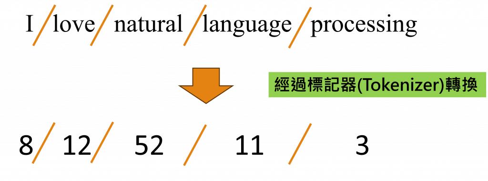

經過了上一個小節，我們獲得該句子的所有詞彙，但對於在現實情況中，我們往往需要使用程式的迭代功能來獲取整個文本資料中的詞彙，但對於電腦而言我們還需要將這些詞匯轉換成數字，因為電腦只能理解數值類型的資料，所以為了進行斷詞和轉換的動作，我們需要建立一個`標記器(Tokenizer)`，而建立標記器的第一步是獲得所有的詞彙，所以我們需要使用程式來進行此步驟:

```
#假設該資料集中的句子如english_sentence
english_sentence = [
    'I love natural language processing',
    'Hello Python',
    'I like Apple',
    'I am a human',
    'You are a robot',
]

tokens = []
for sentence in english_sentence:
    tokens.extend(sentence.split(' '))  # 將一段句字進行斷詞後加入列表(List)
tokens = set(tokens)                    # 通過set()過濾重複單字
print(tokens)                           # 注意此時的資料型態是集合(Set)
#---------------------輸出---------------------
{'like', 'am', 'natural', 'I', 'Apple', 'You', 'robot', 'Python', 'love', 'language', 'a', 'are', 'Hello', 'human', 'processing'}
```

當上述程式執行完成後，我們將能夠取得該資料集的詞彙，不過我們還會遇到一些問題，在所有的文字中，我們很難僅依靠手上的資料收錄到現實中的所有的詞彙。


所以當這些未被收錄的詞彙輸入到模型時就會導致模型錯誤。因此我們需要處理這些未知的詞彙，其中最常使用的方式是建立一個特殊標籤`[UNK]`來表示這些未知的詞彙已保留該文字的部分特徵。

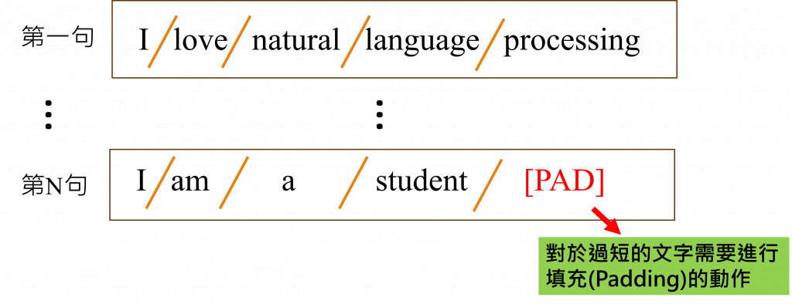

另外還需要有一個特殊標籤，這個特殊標籤是因為在深度學習的模型中，每筆資料輸入的長度是需要固定的所以我們需要對過短的文字進行截長補短的動作，使模型在運算的過程中不會因為輸入大小不同而導致錯誤，對於這種狀況我們則是會創立一個名為`[PAD]`的特殊標籤。

> **小提示:**
> 
> [UNK]和[PAD]都只是識別符號，你可以用你自己喜歡的特殊符號來替換它們，只要你自己能理解就可以了。不過這兩個符號通常在許多大型語言模型(Large Language Model, LLM)中都被這樣表示，所以我們通常不會去修改這些標籤。

我們可以通過以下程式將這些特殊符號加入到我們所得到的詞彙中，以便進行後續的標記器建立。

```
special_token = ['[UNK]','[PAD]']       # 建立特殊的詞彙表
tokens = special_token + list(tokens)   # Tokens為Set型態，因此需要轉型成List才能夠相加
print(tokens)
#---------------------輸出---------------------
['[UNK]', '[PAD]', 'Hello', 'love', 'are', 'natural', 'robot', 'am', 'a', 'You', 'processing', 'language', 'I', 'Python', 'like', 'human', 'Apple']
```

當我們建立完所有的詞彙後還需要建立一個能夠將詞彙和數字互相轉換`字典(Dictionary)`，這樣子我們可以通過字典的特性來進行快速轉換的動作，當然我們還能夠建立一個將數字轉換為詞彙的字典，使我們之後想要觀看轉換後的結果。

```
token2num = {tokens:num for num, tokens in enumerate(tokens)}  #詞彙轉數字
print(token2num)
#---------------------輸出---------------------
{'[UNK]': 0, '[PAD]': 1, 'processing': 2, 'Apple': 3, 'natural': 4, 'are': 5, 'love': 6, 'I': 7, 'robot': 8, 'Hello': 9, 'like': 10, 'You': 11, 'human': 12, 'Python': 13, 'a': 14, 'language': 15, 'am': 16}
```

```
num2token = {num:tokens for num, tokens in enumerate(tokens)}   #數字轉詞彙
print(num2token)
#---------------------輸出---------------------
{0: '[UNK]', 1: '[PAD]', 2: 'like', 3: 'are', 4: 'natural', 5: 'human', 6: 'am', 7: 'I', 8: 'language', 9: 'love', 10: 'Apple', 11: 'You', 12: 'a', 13: 'Hello', 14: 'Python', 15: 'robot', 16: 'processing'}
```

完成上述步驟後我們就能夠建立出標記器，使其能夠幫助我們進行斷詞、`填充(Padding)`、轉換的動作，在這邊我使用了函數的作法使其能夠被重複使用。

```
def tokenizer(input_text, token2num, max_len = 5):
    UNK_IDX = token2num['[UNK]']                 # 取得未知詞彙的索引值
    PAD_IDX = token2num['[PAD]']                 # 取得填充詞彙的索引值
    
    tokens = input_text.split(' ')               # 斷詞

    output_num = []
    for token in tokens:
        num = token2num.get(token, UNK_IDX)      # 轉換成數字(不存在於字典時轉換成[UNK])
        output_num.append(num)
        
    padding_num = max_len - len(output_num)      # 計算需填充的數量
    return output_num + [PAD_IDX] * padding_num  # 補齊最大長度

input_text = 'I like Banana'
output_num = tokenizer(input_text, token2num)
print(f'原始輸入: {input_text}')
print(f'轉換結果: {output_num}')
#---------------------輸出---------------------
原始輸入: I like Banana
轉換結果: [16, 7, 0, 1, 1]
```

這時你可能會想要觀看轉換後的文字究竟轉換成什麼樣子，因此為了方便查看輸入給模型的文字內容，我們還需要撰寫一個將數字轉換回詞彙的函數。

```
def num2tokens(input_list):
    output_list = [num2token[num] for num in input_list]
    return ' '.join(output_list)

restore_text = num2tokens(output_num)
print(f'還原結果: {restore_text}')
#---------------------輸出---------------------
還原結果: I like [UNK] [PAD] [PAD]
```

到這邊我們已經完成了完整的詞彙轉換程式，使我們能夠將輸入的詞彙被電腦識別。但上述的程式碼比較分散且不易重複使用。因此我將上述的程式碼進行改寫，並轉換成類別(Class)的形式，這樣在未來中我們就能夠重複使用該程式碼了。

完整程式碼
-----

```
class Tokenizer:
    def __init__(self, english_sentence, max_len = 5, special_token = None, padding = True):
        
        tokens = []
        for sentence in english_sentence:
            tokens.extend(sentence.split(' '))  # 將一段句字進行斷詞後加入列表(List)
        tokens = set(tokens)                    # 通過set()過濾重複單字
        
        if special_token is not None:
            tokens = special_token + list(tokens)
        
        self.token2num = {tokens:num for num, tokens in enumerate(tokens)}
        self.num2token = {num:tokens for num, tokens in enumerate(tokens)}
        
        self.max_len = max_len
        self.padding = padding
    
    def __call__(self, input_text):
        tokens = input_text.split(' ')              
        UNK_IDX = self.token2num['[UNK]']
        PAD_IDX = self.token2num['[PAD]'] 

        output_num = []
        for token in tokens:
            num = self.token2num.get(token, UNK_IDX)  # 轉換成數字(不存在於字典時轉換成UNK_IDX)
            output_num.append(num)
            
        padding_num = self.max_len - len(output_num)  # 計算需填充的數量
        return output_num + [PAD_IDX] * padding_num   # 補齊最大長度
       
    
    def num2tokens(self, input_list):
        output_list = [self.num2token[num] for num in input_list]
        return ' '.join(output_list)
    
    
# 所有句子
english_sentence = [
    'I love natural language processing',
    'Hello Python',
    'I like Apple',
    'I am a human',
    'You are a robot',
]

# 建立初始值
tokenizer = Tokenizer(english_sentence, special_token = ['[UNK]','[PAD]'])

#使用建立的Tokeizer
input_text = 'I like Banana'
output_num = tokenizer(input_text)
restore_text = tokenizer.num2tokens(output_num)

#顯示結果
print(f'原始輸入: {input_text}')
print(f'轉換結果: {output_num}')
print(f'還原結果: {restore_text}')
```

後話
--

今天原本打算一次性寫完有關電腦如何理解文字的部分，但在過程中發現在建立Tokenizer的動作越寫越多，所以我將這一部分分成了兩個章節。在今天的內容中，我主要教你如何**將文字作為模型輸入**的方式。而在明天的內容中，我將開始探討**電腦如何理解文字**。希望通過這種分章的方式能讓你更全面地了解自然語言處理的基本概念。

那麼我們明天再見！

內容中的程式碼都能從我的GitHub上取得:

[https://github.com/AUSTIN2526/iThome2023-learn-NLP-in-30-days](https://github.com/AUSTIN2526/iThome2023-learn-NLP-in-30-days)

---

<a id="6669-day-03"></a>

## Day 03｜【Day 3】電腦該怎麼理解人類的語言 (下) - 模型理解文字的方式

- 原文：https://ithelp.ithome.com.tw/articles/10321193

今日學習重點
------

我們昨日學習了如何進行詞彙的劃分以及建立標記器，今天我們將繼續進階內容，探討模型如何理解文字。今日的主要學習內容將包含以下三點:

1.   One-hot Encoding(獨熱編碼)在NLP上的應用與問題
2.   `詞嵌入(Word Embedding)`的理論分析與程式應用
3.   詞嵌入的`可視化(Visualization)`方式

One-hot Encoding(獨熱編碼)
----------------------

在自然語言處理的領域中，一種常見的`資料前處理(Data Preprocessing)`技術就是`One-Hot Encoding(獨熱編碼)`，其主要功能是將**詞彙轉換成一個向量空間**，透過這種方法，我們能夠創建出一個與詞彙表相同大小的向量。

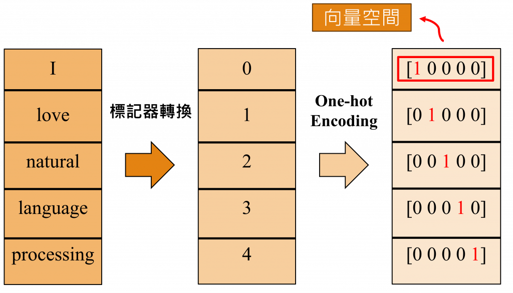

如上圖所示在這個向量中，絕大部分元素都是0，只有單一個元素為1。**這個元素值為1的索引，對應到的就是標記器所轉換出的數字**，如此一來我們就能將每一個詞彙轉換成向量空間中的一座標點。

不過使用這種方法將會有稀疏性的問題，因為在One-hot Encoding中的大部分元素都是0，導致**生成的向量非常稀疏**，這意味著如果詞彙量過大，使用該表示方式會產生非常龐大的向量。

如上圖中的例子，即使只有5個詞彙，也會產生一個`5*5`的向量，而在一個語言模型中通常有30000個以上詞彙，這代表將會有一個`30000*30000`的向量，這不僅增加了記憶體的負擔，還會降低模型的運算速度。


並且One-Hot Encoding的方法存在一些嚴重問題，我們以圖中的「It's so cold, I've caught a cold」這句為例，在這個句子裡，我們可以看出前一個「cold」的意思是代表「寒冷」，而後一個「cold」則代表「感冒」。

但在One-Hot Encoding的轉換中，每個詞彙都會被賦予一個獨一無二的向量，這就導致了**文字之間並沒有關聯性**與**無法表達出一詞多意的概念**等問題，於是出現了改良這中方式的技術，該技術的名稱就是`詞嵌入(Word Embedding)`

詞嵌入(Word Embedding)
-------------------

詞嵌入是將文本中的詞彙轉變成連續向量的技術，這種技術將詞彙映射到高維度的向量空間中，使**具有相似意義的詞彙能在同一個空間聚集**。


這點可能用說得過於抽象，所以我將以程式語言的方式，逐步介紹詞嵌入層在進行什麼樣的運作，首先我們需要先導入並安裝必須的函式庫。

### 【STEP 1】安裝&與使用函式庫

首先我們將初步安裝Pytorch與matplotlib，來幫助我們將詞彙映射至`詞嵌入層(Embedding Layer)`與`可視化(Visualization)`詞嵌入的動作，我們可以透過`pip`指令來安裝這兩個函式庫。

```
pip install torch
pip install matplotlib
```

當完成安裝後，我們可以透過`import`和`from`這兩種方式使用該函式庫的功能，而在以下的程式中我還會使用昨天在[【Day 2】電腦該怎麼理解人類的語言 (上) - 文字怎麼輸入到模型中](https://ithelp.ithome.com.tw/articles/10318965)中創建的類別來做為我們的標註器。

```
import torch
import torch.nn as nn
import matplotlib.pyplot as plt
from tokenizer import Tokenizer # 昨日建立的類別
```

> 在我的GitHub上方已建立了`tokenizer.py`這一檔案，你可以直接下載該檔案或到昨天的內容中取得該程式碼。

### 【STEP 2】建立正面與負面詞彙表

在建立完程式環境後，我們還需建立一些詞彙，並從類別中取得`token2num`與`num2token`兩個用於詞彙轉換建的字典，以便後續能在可視化詞嵌入中的計算結果。

```
negative_words = ["disappointed", "sad", "frustrated", "painful", "worried", "angry"]
positive_words = ["happy", "successful", "joyful", "lucky", "love", "hopeful"]

# 建立初始值
all_words = negative_words + positive_words
tokenizer = Tokenizer(all_words, special_token = ['[UNK]','[PAD]'], max_len = 1)
token2num, num2token = tokenizer.token2num, tokenizer.num2token
```

### 【STEP 3】將詞彙映射到詞嵌入層中

首先我們需要先取得`num2token`的字典，並將其轉換成`張量(Tensor)`。這樣做的原因是GPU和TPU等硬體加速器上進行張量計算效率極高，這對於深度學習中大規模的數值運算十分重要，並且神經網絡通常有著大量的參數和數據需要處理，這種方式還能夠追蹤每一個神經元的梯度變化，以達到優化模型的目的。

```
# 取得所有轉換後的詞彙
token_nums = torch.tensor([i for i in num2token])
# 創建一個詞嵌入層(Embedding layer)
emb = nn.Embedding(len(token_nums), 2)
# 將Token映射到詞嵌入層中
embedding_matrix = emb(token_nums).detach().numpy()
```

### 【STEP 4】可視化的建立方法

在這裡我們建立了一個函數，用於視覺化這些向量，而這個方式非常簡單，因為在建立詞嵌入的時候，我們只使用了兩個維度，所以可以直接將這兩個軸視為平面上的x和y軸，作為我們視覺化向量的方式，不過在當前我們的數據資料是數字型態，於是我們需要用到`num2token`字典，將已經轉換成數字的詞彙替換回來。

```
def visualization(embedding_matrix, num2token):
    
    # 提取降維後的坐標
    x_coords = embedding_matrix[:, 0]
    y_coords = embedding_matrix[:, 1]

    # 繪製詞嵌入向量的散點圖
    plt.figure(figsize=(10, 8))
    plt.scatter(x_coords, y_coords)

    # 標註散點
    for i in range(len(embedding_matrix)):
        plt.annotate(num2token[i], (x_coords[i], y_coords[i]))
        
    plt.xlabel('Dimension 1')
    plt.ylabel('Dimension 2')
    plt.title('Visualization of Embedding Vectors')
    plt.show()

visualization(embedding_matrix, num2token)
```

從下圖中我們可以發現，在詞嵌入被建立的過程中，每一個文字初始都是隨機定位的，然而在深度學習模型的幫助下，我們可以通過調整這些文字在空間上的位置來找到最合適的向量，使電腦能理解與這些詞彙之間的相關性與涵義。


> 若詞嵌入的向量設定超過2時我們還需要使用到許多降維(Dimension Reduction)的技術， 例如:主成分分析(Principal Component Analysis, PCA)，t-隨機鄰近嵌入法(t-distributed Stochastic Neighbor Embedding, t-SNE)等，才能夠將這些維度顯示出來。

### 【STEP 5】讀取已訓練好的模型權重

因為並未在前文中提及模型訓練的概念，不過為了方便理解被訓練過後的詞嵌入向量究竟會長什麼樣子，所以我已經利用訓練模型的方式來調整這些詞嵌入的權重，該權重已公開於我的GitHub中，我們需要做的就是下載這些權重並放至指定的檔案路徑以方便我們進行讀取的動作。

```
emb = nn.Embedding(len(token_nums), 2)
emb.weight = nn.Parameter(torch.load('embedding_weights.pth'))   # 讀取權重
embedding_vector = emb(token_nums).detach().numpy()              # 建立向量
visualization(embedding_vector, num2token)                       # 視覺化
```

現在我們可以明確地看到正向詞彙如`"happy"、"successful"、"joyful"`和負向詞彙如`"disappointed"、"sad"、"frustrated"`被清楚地區分出來，這就是一個很好的詞嵌入層，通過這一層我們可以進行後續的運算，例如將這些向量透過某種`時間序列模型(Time Series Model)`來計算文字之間的語句上下文關係，而這種方法也能在後續運算中考量到向量中相近的詞彙特性，使模型能更全面的考量詞與詞之間的關係。

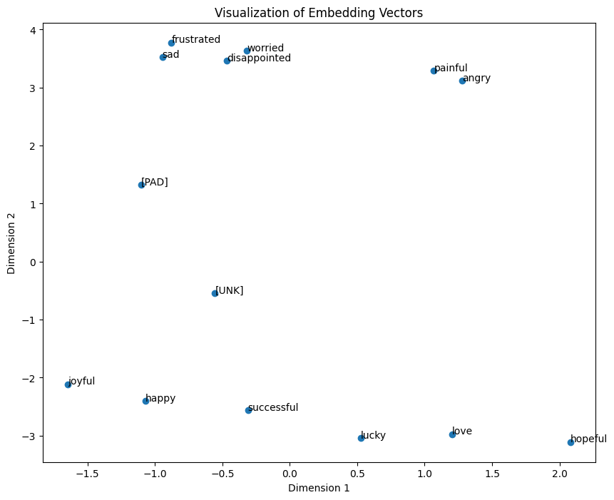

以上就是電腦理解文字的方式，在後續的內容中我將透過不同的模型來訓練詞嵌入層，以加深我們對詞嵌入層的理解。

完整程式碼
-----

```
import torch
import torch.nn as nn
import matplotlib.pyplot as plt
from tokenizer import Tokenizer # 昨日建立的函式庫
```

```
negative_words = ["disappointed", "sad", "frustrated", "painful", "worried", "angry"]
positive_words = ["happy", "successful", "joyful", "lucky", "love", "hopeful"]

# 建立初始值
all_words = negative_words + positive_words
tokenizer = Tokenizer(all_words, special_token = ['[UNK]','[PAD]'], max_len = 1)
token2num, num2token = tokenizer.token2num, tokenizer.num2token
```

```
def visualization(embedding_matrix, num2token):
    
    # 提取降維後的坐標
    x_coords = embedding_matrix[:, 0]
    y_coords = embedding_matrix[:, 1]

    # 繪製詞嵌入向量的散點圖
    plt.figure(figsize=(10, 8))
    plt.scatter(x_coords, y_coords)

    # 標註散點
    for i in range(len(embedding_matrix)):
        plt.annotate(num2token[i], (x_coords[i], y_coords[i]))
        
    plt.xlabel('Dimension 1')
    plt.ylabel('Dimension 2')
    plt.title('Visualization of Embedding Vectors')
    plt.show()

# 取得所有轉換後的詞彙
token_nums = [i for i in num2token] 
# 轉換成Tensor
token_nums = torch.tensor(token_nums)
# 創建一個詞嵌入層(Embedding layer)
emb = nn.Embedding(len(token_nums), 2)
# 將Token映射到詞嵌入層中
embedding_matrix = emb(token_nums).detach().numpy()
# 顯示該向量
visualization(embedding_matrix, num2token)
```

```
emb = nn.Embedding(len(token_nums), 2)
emb.weight = nn.Parameter(torch.load('embedding_weights.pth'))
embedding_vector = emb(token_nums).detach().numpy()
visualization(embedding_vector, num2token)
```

後話
--

看到這裡我相信你對於電腦如何理解文字已經有了一定程度的了解，但你可能仍然對某些內容不太熟悉，因此我打算先讓你放鬆一夏，所以我在明天只教你如何安裝Pytorch的GPU版本以及一個在自然語言處理中非常重要的函式庫TorchText，你可以在這段時間中好好的統整這兩天的知識，以便更好理解後續章節的內容。

那麼我們明天再見！

內容中的程式碼都能從我的GitHub上取得:

[https://github.com/AUSTIN2526/iThome2023-learn-NLP-in-30-days](https://github.com/AUSTIN2526/iThome2023-learn-NLP-in-30-days)

---

<a id="6669-day-04"></a>

## Day 04｜【Day 4】Pytorch & TorchText的正確開啟方式

- 原文：https://ithelp.ithome.com.tw/articles/10322104
- 發佈時間：2023-09-19 23:18:27

今日學習重點
------

TorchText是PyTorch生態系統中的一個函式庫，它的主要目的是為了**簡化文字資料的處理**與**NLP模型建構**的過程，不過該函式庫基於PyTorch運行，因此在安裝TorchText時，可能會遇到兩者版本不同的相容性問題，今天我將教你如何正確地安裝PyTorch及TorchText，以避免這種問題的發生，今日的主要學習內容將包含以下三點:

1.   檢查電腦GPU的CUDA版本
2.   安裝GPU版本的Pytorch
3.   查詢TorchText與Pytorch的對應版本

該怎麼安裝Pytorch GPU與TorchText呢?
----------------------------

我相信許多已熟悉Python的人都知道，我們可以使用`pip`指令來安裝函式，但如果你用`pip`的方式去安裝Pytorch，你只會安裝到CPU版本而非GPU版本。

雖然網路上有許多教學文章介紹如何安裝Pytorch的GPU版本，但你可能會發現大多數的文章中的做法在某些電腦上可能會遇到無法順利執行的問題。

而會發生這樣的原因是因為這些文章並未清楚告知安裝的前提條件和必備知識，所以在今天的內容中，我將詳盡地指導你如何成功於**各種環境中安裝Pytorch的GPU版本與TorchText**。

### 【STEP 1】檢查電腦GPU中的CUDA版本

首先我們需要確認自己的GPU中的CUDA版本，我們可以在`CMD(命令提示字元)`輸入下列指令，以獲取電腦中有關GPU的相關訊息。

```undefined
nvidia-smi
```

當我們完成輸入後，可以在結果的右上方中發現`CUDA Version XX.X`的字眼，而這就是我們的GPU能支援的**最高版本**。

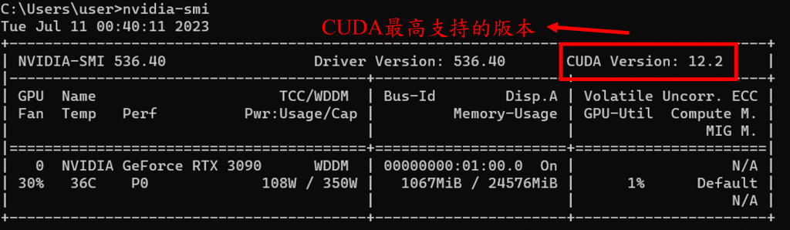

> **小提示:**
> 
> 截至目前為止Pytorch的CUDA最新版本是11.8，而絕大多數的中高階GPU皆能支援此一最新版的Pytorch，如果你的CUDA版本低於11.8，可以試試看更新顯卡驅動程式。

### 【STEP 2-1】安裝最新Pytorch GPU(CUDA版本足夠)

接下來我們需要前往[Pytorch的官方網站](https://pytorch.org/)尋找安裝指令，如果**你的顯示卡高於目前支援的最新版本**，可以直接在該網頁找到的安裝指令。


我們可以在`Run this Command:`後面找到我們所需要的安裝指令。

```perl
pip3 install torch torchvision torchaudio --index-url https://download.pytorch.org/whl/cu117
```

### 【STEP 2-2】安裝最新Pytorch GPU(CUDA版本不足)

不過對於CUDA版本過低的的人來說，該如何安裝Pytorch GPU版本呢?這時我們就需要尋找該頁面上方的`install previous versions of PyTorch`來轉跳到另一個頁面。

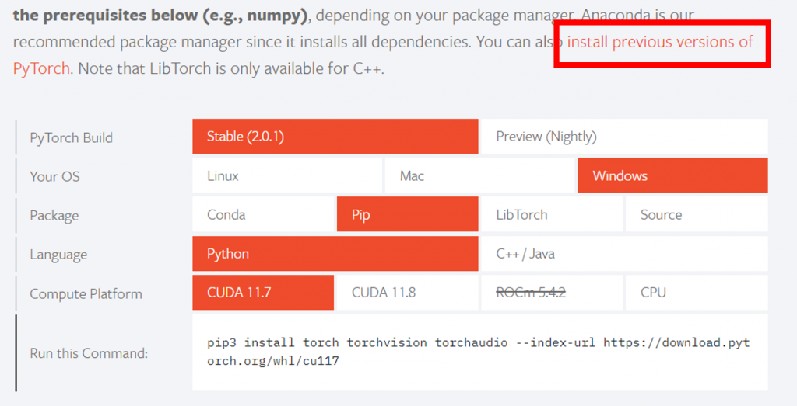

假設我們的顯示卡僅支援到CUDA 10.2版本，我們可以在該頁面下按下鍵盤中的`CTRL+F`，然後輸入`CUDA 10.2`後按下`Enter`，此時我們就能夠看到下圖中的畫面，該畫面是在Pytorch中對於較低版本CUDA的安裝指令。


這時我們只需要找到比自己CUDA版本還要低或是相同的版本就能完成GPU版的安裝，而在CUDA 10.2版本的狀況下只需輸入以下指令，同樣的能安裝最新版本的Pytorch。

```perl
pip install torch==1.12.1+cu102 torchvision==0.13.1+cu102 torchaudio==0.12.1 --extra-index-url https://download.pytorch.org/whl/cu102
```

### 【STEP 3】檢查Pytorch GPU環境

當安裝完畢後，我們可以測試看看GPU的環境，這時我們可以先在 CMD 中輸入 `python` 來進入 Python 環境中，接下來輸入：

```cpp
import torch
torch.cuda.is_available()
```


這個時候我們只需要觀察程式執行的結果是否為`True`，如果是`True`那就表示GPU環境已經準備好了。

【STEP 4】查看PyTorch與TorchText依賴源
------------------------------

在前幾步中我們花大量時間來安裝Pytorch的GPU版本，而在安裝TorchText時有很大的機率會遇到一個大坑，如果我們直接輸入`pip install torchtext`指令，你就會發現PyTorch被替換成CPU版本。

所以我們需要針對該函式庫的安裝還需要做特別的處理，因此我們需要到[TorchText的GitHub](https://github.com/pytorch/text)頁面，找到`README.rst`說明文件，並到下圖中的相關區塊。


在該區塊中我們可以看到Pytorch與TorchText之間的相容性，在這邊我會先透過`pip list`來查找Pytorch的函式庫的版本，當我們輸入該指令後你可以看到與下列相似的結果：

```undefined
tokenizers                0.13.3
tomli                     2.0.1
torch                     1.13.1+cu117
torchaudio                0.13.1+cu117
```

其中我們需要注意`torch 1.13.1+cu117`這一行，該行表示我們的Torch版本是`1.13.1`，所以我們可以通過這個版本號對應文件來找到TorchText版本，從以上結果得知我們需要安裝0.14.0版本的TorchText，這時我們可以輸入：

```undefined
pip install torchtext==0.14.0
```

這樣子我們就能在維持PyTorch的GPU環境下，順利使用TorchText這個自然語言處理的函式庫了。

> **小提示:**
> 
> 當函式庫裝完畢後你可以在檢查看看GPU環境以免有未知的意外發生。

後話
--

到現在你應該已經理解了電腦是怎麼理解我們人類的語言以及建立在後續內容中所需要的環境了，而在明天我會使用深度神經網路來傳達深度學習的概念，在這過程中可能會有一些數學公式，如果你有不明白的地方可以私訊我或是在下方留言我都會很樂意幫你解答的。

那麼我們明天再見！

內容中的程式碼都能從我的GitHub上取得:

[https://github.com/AUSTIN2526/iThome2023-learn-NLP-in-30-days](https://github.com/AUSTIN2526/iThome2023-learn-NLP-in-30-days)

---

<a id="6669-day-05"></a>

## Day 05｜【Day 5】深度神經網路該怎麼改變Embedding向量(上)-揭密神經網路訓練的過程

- 原文：https://ithelp.ithome.com.tw/articles/10323386
- 發佈時間：2023-09-20 19:32:24

今日學習重點
------

訓練深度學習模型實質上就是計算答案與優化答案的過程，在此過程中常常涉及許多複雜的計算，而在今天我們將探討深度學習能自動抽取特徵的原因以及講講整個模型訓練的過程，今日的學習重點如下:

1.   學習`深度神經網路(Deep Neural Networks, DNN)`的原理
2.   理解`前向傳播(Forward Propagation)`與`反向傳播(Backward Propagation)`的目的
3.   認識`優化器(Optimizer)`、`學習率(Learning rate)`、`損失值(Loss)`之間的關係。

深度神經網路(Deep Neural Networks, DNN)
---------------------------------


`深度神經網路（Deep Neural Networks，DNN）`是一種`多層感知器（Multilayer Perceptron，MLP）`，由多層`神經元（Neuron）`組成。其目的是跨越不斷調整神經元之間的`權重（Weight）`來模仿人類大腦的功能。這種結構能夠**自動學習複雜的輸入特徵和模式**，以進行對未知資料的分類或預測。在上圖中的範例是通過創建1維的詞嵌入向量來進行深度神經網路的運算，使其能夠分類出該單字是正面評價還是負面評價的。

> **小提示:**
> 
> 通常詞嵌入層的維度都會是高維向量(BERT是768維)，在這裡使用1維的目的是為了方便後續的公式理解。

深度神經網路主要由三個部分組成，分別是`輸入層(input layer)`、`隱藏層(hidden layer)`以及`輸出層(output layer)`。其中隱藏層越多層能處理的輸入資料也就越複雜。但要注意的是，如果處理的資料相對簡單，那麼使用較少的隱藏層，模型的效果會更好。接下來讓我們深入了解這三個部分的各自角色。

### 輸入層(input layer)

深度神經網路的第一層被稱作輸入層，該層的主要目的是獲取外部數值資料，如在進行文字分類時，我們會將詞嵌入層的資料傳送至此。在這層中**並無特殊的計算公式**，僅負責將資料傳送至下一層。

### 隱藏層(hidden layer)

隱藏層是深度神經網路的關鍵部分，該層接收特徵`x1、x2、x3...xn`的輸入，並透過和各隱藏層中的權重`w1、w2、w3...wn`進行運算，來計算出每個隱藏層神經元的結果。以上圖為例各神經元的計算結果`h1 = x1w1`、`h2 = x1w2`、`h3 = x1w3`。當有了`h1`、`h2`、`h3`的值之後，我們就可以根據這些數據來算出模型的整體輸出結果。

### 輸出層(output layer)

當隱藏層將資料傳遞給輸出層後，該層會透過`h1`、`h2`、`h3`來計算出模型的結果，也就是`y1 = h1w11 + h2w21+ h3w31`的結果，這個結果便是模型預測的機率。這樣解釋可能不夠清楚，假設正面評價的標籤是`y1`，那麼`y1`的輸出結果應該更接近`1`；若反面評價的標籤是`y2`，那麼`y2`的輸出結果就應該更接近於`0`。如此一來我們就能夠根據最終的輸出`y1`、`y2`的結果來判斷最有可能的情況。

在以上的步驟中也就是深度學習的`前向傳播(Forward Propagation)`過程，所以我們也可以說**前向傳播是模型計算結果的過程**。

模型該怎麼修正輸出結果
-----------

在任何神經網路裡，兩個步驟都是不可或缺的，它們分別是前向傳播與`反向傳播(Backward Propagation)`，而我們已經掌握了前向傳播的概念，接下來需要解析的則是反向傳播的過程，此部分將會被分成以下幾步：

### 【STEP 1 對最後一層輸出進行Softmax】


首先我們需要透過`損失函數(Loss Function)`來計算出模型在這次運算中的損失值，如同我們在前面的小節所提到的，輸出層的結果是模型的機率輸出，這需要透過名為`Softmax`的`激勵函數(Activation Function)`進行轉換，該函數能將輸出層的數字轉換為機率值，這個步驟的目的就是為了更精確地計算模型的損失值。

> **小提示**
> 
> 激勵函數是一種在模型不同層中所使用的數學函數，該函數的目的是為了將計算出來的線性結果轉換成非線性，這樣做的原因是因為現實中的數據通常是以非線性呈現的，因此我們加入激勵函數能夠使計算結果更符合現實。

### 【STEP 2 計算模型的損失】

接著我們就能夠通過該方式計算模型的損失，最簡單的計算模型方式，就是計算`標籤(Lable)`與`預測機率`的誤差。

這時我們能先將標籤進行One-Hot Encoding轉換的動作，讓正面評價的標籤為`[1, 0]`，並假設預測輸出是`[0.88, 0.12]`，那麼在計算模型的損失時，我們可以直接算出`|1 - 0.88| + |0 - 0.12| = 0.24`的損失結果。

> **小提示:**
> 
> 在前幾天，我們提到One-Hot Encoding在自然語言處理上的問題，這是針對詞彙轉換成向量時可能會遇到的問題，而這次我們選擇使用詞嵌入來進行詞彙轉換，而One-Hot Encoding則用於標籤的轉換過程。

### 【STEP 3 計算輸出層梯度】


我們現在來到最困難的部分，那就是計算神經元梯度的過程，而我們計算梯度的目的就是為了**找到各神經元的變化方向**，以幫助我們找到最小值或極小值，而計算的第一步進行我們需要找到損失函數 _L_ 對輸出層的輸出的梯度。

假設輸出層有n個神經元，我們計算每個神經元的梯度為:

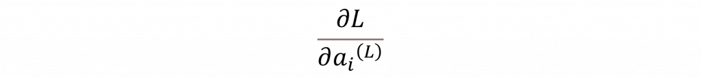

其中`ai(L)`是輸出層的第`i`個神經元的輸出。

### 【STEP 4 計算隱藏層梯度】

接下來，我們需將**梯度向後傳播至隱藏層**，以計算出每一層的梯度，在這步驟我們可以透過**輸出層梯度**進行連鎖率運算，我們便可以得出第`L`層中第`i`個神經元的梯度。

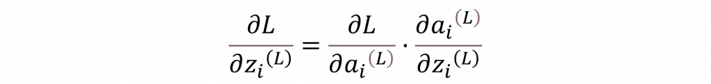

這樣就會一直將梯度傳播到上一層的神經元，重複這個過程，直到**計算出輸入層的梯度**為止。

### 【STEP 5 計算各權重梯度】

最後我們可以計算**每個權重的梯度**，對於連接第`L-1`層第`j`個神經元與第`L`層第`i`個神經元的權重，我們可以透過以下公式來進行計算。


### 【STEP 6 更新權重】

當我們計算出各權重的梯度後，我們就能得知該曲線的變化程度，這時我們可以選擇使用`梯度下降法(Gradient Descent)`或其他`優化器(Optimizer)`來更新權重，以降低損失函數的數值。對於梯度下降法的更新規則，如下所示：

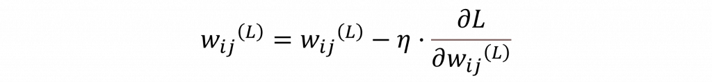

其中 _𝜂_ 代表的是學習率，這是用來調整移動速率的值，**若該值設定過大，會導致無法收斂的狀況**。因此在大多數的優化器中，該值通常只設定為`1e-3`。

不過你可能聽到這裡會有些不太了解的地方，所以我在這裡簡單把整個訓練過程說明一遍：首先我們會**通過模型計算結果(前向傳播)**，接下來透過**損失函數計算目標與預測結果的誤差**，然後**反向傳播計算各神經元的梯度**，最後透過**優化器調整權重**。

按照這個過程來，模型將能夠不斷地通過**調整權重的方式降低模型的損失值**，以期算出最佳的目標，這就是我們所說的訓練模型實際上正在進行的動作，而在不同後神經網路中，不外乎都是通過這種方式進行訓練的。

後話
--

今天我們已經坦討並說明了在深度學習中會使用的一些數學公式，同時解釋了深度神經網路的模型架構，而在明天的內容中我將利用Pytorch程式碼來向你示範該如何使用深度神經網路訓練出我們在第三天所使用的詞嵌入層權重。

那麼我們明天再見！

內容中的程式碼都能從我的GitHub上取得:

[https://github.com/AUSTIN2526/iThome2023-learn-NLP-in-30-days](https://github.com/AUSTIN2526/iThome2023-learn-NLP-in-30-days)

---

<a id="6669-day-06"></a>

## Day 06｜【Day 6】深度神經網路該怎麼改變Embedding向量(下)-PyTorch訓練的策略和方法

- 原文：https://ithelp.ithome.com.tw/articles/10323930

今日學習重點
------

前幾日我們已經把自然語言處理的基礎知識都學習完畢了，所以在今日最主要的目的就是將這些理論都轉換成程式碼，而我會在撰寫這些程式碼的同時告訴你，該部分對應的理論內容，今日的學習重點如下:

1.   建立訓練資料集和選擇適當的`資料型態(Data type)`
2.   訓練模型程式碼與`批次量(Batch Size)`對效能的影響
3.   可視化詞嵌入層與儲存嵌入層權重

在深度學習的程式中，五個核心步驟包括`讀取資料`、`資料前處理與資料正規化`、`定義模型/優化器/損失函數`、`前向傳播`、以及`反向傳播`這幾個動作，而我為了解釋這些動作的涵義，我將逐一拆分這些步驟，來簡單解說程式碼中的內容。

### 【STEP 1】讀取/創建資料

首先我們要載入今天會使用到的所有函式庫，這些函式庫大部分都在[【Day 3】電腦該怎麼理解人類的語言 (下) - 模型理解文字的方式](https://ithelp.ithome.com.tw/articles/10321193)中使用過，只有`import torch.optim as optim`是新引入的函式庫，**這個函式庫內包含許多實用的優化器**，所以我們需要用到它來幫助我們優化模型的損失。

```
import torch
import torch.nn as nn
import torch.optim as optim
import matplotlib.pyplot as plt
from tokenizer import Tokenizer # 昨日建立的函式庫
```

接下來我們會先建立正面與負面的詞彙資料，接著將它們合併，以便使用`Tokenizer()`建立詞彙表。

```
negative_words = ["disappointed", "sad", "frustrated", "painful", "worried", "angry"]
positive_words = ["happy", "successful", "joyful", "lucky", "love", "hopeful"]

# 建立初始值
all_words = negative_words + positive_words
tokenizer = Tokenizer(all_words, special_token = ['[UNK]','[PAD]'], max_len = 1)
token2num, num2token = tokenizer.token2num, tokenizer.num2token
```

在我們建立完成之後，就能透過`tokenizer`變數來進行詞彙轉換，同時也能從中呼叫出能映射詞彙與數字的兩個字典`token2num`和`num2token`。

### 【STEP 2】資料前處理與資料正規化

當我們獲取資料後就可以進行資料前處理和資料的正規化了，在這裡我們僅進行簡單的資料正規化操作，即將**文字轉換為數字**，並**定義One-Hot Encoding標籤**。

```
input_data = torch.tensor([token2num[i] for i in negative_words + positive_words])
labels = len(negative_words) * [[1., 0.]] + len(positive_words) * [[0., 1.]]
labels = torch.tensor(labels)
print('第0筆訓練資料:', input_data[0])
print('第0筆訓練標籤:', labels[0])
#---------------------輸出---------------------
第0筆訓練資料: tensor(3)
第0筆訓練標籤: tensor([1., 0.])
```

在上述程式中，我們先將負面和正面的**詞彙數值化**，然後**轉化為張量格式**，以配合模型的輸入和計算需求。接著，我們開始定義標籤。在標籤的定義部分，我們直接使用One-Hot Encoding的方式，將負面定義為[1,0]，正面定義為[0,1]

但我們需要注意這個標籤的型態必須定義為`float`，因為我們的模型輸出的機率是小數點(float)而非整數(int)，如果我們之後沒有加上「.」，模型在計算時就會發生錯誤。

### 【STEP 3】定義模型/優化器/損失函數

在Pytorch中建構模型需要兩個步驟，首先我們需要建立模型的結構，再來定義模型的前向傳播方式，在這過程中繼承`nn.Module`類別是關鍵一步，因為這個類別包含了許多模型常用的操作，如模型儲存、獲取參數、及凍結參數等功能。因此我們在初始化模型時，可以使用以下的寫法:

```
class EmbDNN(nn.Module):
    def __init__(self, vocab_size, embedding_dim, output_size, padding_idx):
        super().__init__()
        self.embedding = nn.Embedding(
                                num_embeddings = vocab_size, 
                                embedding_dim = embedding_dim,
                                padding_idx = padding_idx

                             )
        
        self.fc = nn.Linear(embedding_dim, output_size)
```

在上述的程式中，我們先使用`super()`繼承`nn.Module`所定義的一些方法，接著我們就能夠定義模型的層，在今日的內容中，我們需要定義一層詞嵌入層和一層深度神經網路層，而在詞嵌入層中，我們需要知道以下幾個重要的參數:

| 參數名稱 | 說明 |
| --- | --- |
| num_embeddings | 詞彙表的總數量 |
| embedding_dim | 詞嵌入層的維度 |
| padding_idx | 填充字元的索引值 |
| 根據上表我們仍需要從外部輸入一些資訊進入模型中，為了能夠直接將詞嵌入層可視化，我們在這裡將其設定為`2`，同時我們也必須將詞彙表的總數量與填充字元的索引值一同輸入模型，因此我們可以用以下的程式取得必要的資料。 |  |

```
vocab_size = len(token_nums)      # 詞彙表大小
embedding_dim = 2                 # 詞嵌入層维度
output_size = 2                   # 輸出大小（分類數量）
padding_idx = token2num['[PAD]']  # 取得PAD索引

model = EmbDNN(vocab_size, embedding_dim, output_size, padding_idx)
```

我們之前已經提到，除了定義模型結構外，我們還需要定義前向傳播的方式，因此我們將在這個類別中建立一個`forward()`方法，使模型能夠推理出答案。

```
class EmbDNN(nn.Module):
    def __init__(self,...)
    # 定義模型區塊
       .
       .
       .
    # 定義模型區塊
    
    #定義前向傳播方式
    def forward(self, x):
        embedded = self.embedding(x)
        out = self.fc(embedded)  
        return out
```

今天我不打算詳細討論我們所用的損失函數`criterion`和優化器`optimizer`這些實際的運算原理，我會在接下來的章節中向你們詳細解說。因為這部份的理論非常複雜，因此我認為有必要把它視為一個獨立的主題進行探討。

```
criterion = nn.CrossEntropyLoss()
optimizer = optim.Adam(model.parameters(), lr=0.001)
```

### 【STEP 4】顯示訓練過程

在訓練過程中，我們通常會參考Loss曲線來找出可能出現的問題，所以我們需要繪製一張訓練過程的折線圖作為參考。這時我們可以利用matplotlib這個工具來幫助我們繪製折線圖，而我們只需要撰寫一個函數，讓這個函數會接收每次訓練時的Loss值就可以了。

```
def show_training_loss(train_loss):
    plt.plot(train_loss)
    #標題
    plt.title('Result')
    #y軸標籤
    plt.ylabel('Loss')
    #x軸標籤
    plt.xlabel('Epoch')
    #顯示折線的名稱
    plt.legend(['train'], loc='upper left')
    #顯示折線圖
    plt.show()
```

### 【STEP 5】訓練模型

在模型訓練時，最基本的單位稱為`Epoch`，我們稱一次完整的訓練過程為一個`Epoch`，通常在這個完整的Epoch中，會將資料拆分為多個`批量(Batch Size)`來進行訓練，這樣做的原因是因為電腦的記憶體空間有限，無法一次將大量資料輸入模型。

然而在今天的內容中，我們只有14筆輸入資料，因此並不需要將資料集拆分成批次，可以直接進行訓練。

```
loss_record = []
epochs = 30000
for epoch in range(epochs):
    # 梯度初始化
    optimizer.zero_grad()
    # 前向傳播計算答案
    outputs = model(input_data)
    # Loss計算損失
    loss = criterion(outputs, labels)
    loss_record.append(loss)        # 紀錄該次Epoch的損失值
    
    # 反向傳播計算梯度
    loss.backward()
    # 優化器更新權重
    optimizer.step()
    
    # 每訓練1000次顯示Loss值
    if (epoch + 1) % 100 == 0:
        print(f'Epoch [{epoch+1}/{epochs}], Loss: {loss.item()}')
```

在以上的程式中，我們可以看到除了前向傳播、反向傳播、更新權重之外，還多了一個**梯度初始化**的步驟，這一步驟的必要性是因為程式的設計方式。

當我們將資料轉換成張量後，程式會自動追蹤神經元的權重梯度，讓我們能快速進行反向傳播操作，但在執行過程中，我們**無法預知每一個Epoch將包含多少批量的運算**，若我們沒有進行梯度初始化，程式會把每個批量的計算結果累加到下一次的運算中，導致運算錯誤，所以我們必須要在每一次運算前進行梯度初始化的動作。

```
show_training_loss(loss_record)
```

當模型訓練完畢後，我們可以將`loss_record`這個儲存模型訓練Loss值的變數，提供給STEP 4所完成的函數，這樣就能夠從該曲線中即可觀察到模型訓練的過程。


我們可以看到模型的收斂狀態顯示得非常良好，這是因為我們的任務較簡單，所以可以輕鬆的收斂。

### 【STEP 6】儲存詞嵌入權重與可視化

在Pytorch中，我們可以藉由呼叫模型的 `__init__` 方法中的參數，來獲取該神經元層的資料，在這裡我們只需要得到模型中的詞嵌入權重，所以我們可以使用下列的程式碼來進行這個動作。

```
embedding_layer = model.embedding
embedding_weights = embedding_layer.weight.data
torch.save(embedding_weights, 'embedding_weights.pth')
```

此時我們就能夠通過[【Day 3】電腦該怎麼理解人類的語言 (下) - 模型理解文字的方式](https://ithelp.ithome.com.tw/articles/10321193)的方式將最終結果可視化。

```
def visualization(embedding_matrix, num2token):
    
    # 提取降維後的坐標
    x_coords = embedding_matrix[:, 0]
    y_coords = embedding_matrix[:, 1]

    # 繪製詞嵌入向量的散點圖
    plt.figure(figsize=(10, 8))
    plt.scatter(x_coords, y_coords)

    # 標註散點
    for i in range(len(embedding_matrix)):
        plt.annotate(num2token[i], (x_coords[i], y_coords[i]))
        
    plt.xlabel('Dimension 1')
    plt.ylabel('Dimension 2')
    plt.title('Visualization of Embedding Vectors')
    plt.show()

token_nums = [i for i in num2token] 
token_nums = torch.tensor(token_nums)
emb = nn.Embedding(len(token_nums), 2)
loaded_embedding_weights = torch.load('embedding_weights.pth')
emb.weight = nn.Parameter(loaded_embedding_weights)
embedding_vector = emb(token_nums).detach().numpy()
visualization(embedding_vector, num2token)
```

上述程式碼執行完畢後，我們將能夠獲得如下圖中所示的結果。


完整程式碼
-----

```
import torch
import torch.nn as nn
import torch.optim as optim
import matplotlib.pyplot as plt
from tokenizer import Tokenizer # 昨日建立的函式庫
```

```
negative_words = ["disappointed", "sad", "frustrated", "painful", "worried", "angry"]
positive_words = ["happy", "successful", "joyful", "lucky", "love", "hopeful"]

# 建立初始值
all_words = negative_words + positive_words
tokenizer = Tokenizer(all_words, special_token = ['[UNK]','[PAD]'], max_len = 1)
token2num, num2token = tokenizer.token2num, tokenizer.num2token
```

```
input_data = torch.tensor([token2num[i] for i in negative_words + positive_words])
labels = len(negative_words) * [[1., 0.]] + len(positive_words) * [[0., 1.]]
labels = torch.tensor(labels)
print('第0筆訓練資料:', input_data[0])
print('第0筆訓練標籤:', labels[0])
```

```
class EmbDNN(nn.Module):
    def __init__(self, vocab_size, embedding_dim, output_size, padding_idx):
        super().__init__()
        self.embedding = nn.Embedding(
                                num_embeddings = vocab_size, 
                                embedding_dim = embedding_dim,
                                padding_idx = padding_idx

                             )
        
        self.fc = nn.Linear(embedding_dim, output_size)

    def forward(self, x):
        embedded = self.embedding(x)
        out = self.fc(embedded)  
        return out

    
vocab_size = len(token2num)       # 詞彙表大小
embedding_dim = 2                 # 詞嵌入層维度
output_size = 2                   # 輸出大小（分類數量）
padding_idx = token2num['[PAD]']  # 取得PAD索引

model = EmbDNN(vocab_size, embedding_dim, output_size, padding_idx)
```

```
# 定義損失函數與優化器
criterion = nn.CrossEntropyLoss()
optimizer = optim.Adam(model.parameters(), lr=1e-3)
```

```
loss_record = []
epochs = 30000
for epoch in range(epochs):
    # 梯度初始化
    optimizer.zero_grad()
    # 前向傳播計算答案
    outputs = model(input_data)
    # Loss計算損失
    loss = criterion(outputs, labels)
    loss_record.append(loss)        # 紀錄該次Epoch的損失值
    
    # 反向傳播計算梯度
    loss.backward()
    # 優化器更新權重
    optimizer.step()
    
    # 每訓練1000次顯示Loss值
    if (epoch + 1) % 100 == 0:
        print(f'Epoch [{epoch+1}/{epochs}], Loss: {loss.item()}')
```

```
def show_training_loss(train_loss):
    plt.plot(train_loss)
    #標題
    plt.title('Result')
    #y軸標籤
    plt.ylabel('Loss')
    #x軸標籤
    plt.xlabel('Epoch')
    #顯示折線的名稱
    plt.legend(['train'], loc='upper left')
    #顯示折線圖
    plt.show()

show_training_loss(loss_record)
```

```
embedding_layer = model.embedding
embedding_weights = embedding_layer.weight.data
torch.save(embedding_weights, 'embedding_weights.pth')
```

```
def visualization(embedding_matrix, num2token):
    
    # 提取降維後的坐標
    x_coords = embedding_matrix[:, 0]
    y_coords = embedding_matrix[:, 1]

    # 繪製詞嵌入向量的散點圖
    plt.figure(figsize=(10, 8))
    plt.scatter(x_coords, y_coords)

    # 標註散點
    for i in range(len(embedding_matrix)):
        plt.annotate(num2token[i], (x_coords[i], y_coords[i]))
        
    plt.xlabel('Dimension 1')
    plt.ylabel('Dimension 2')
    plt.title('Visualization of Embedding Vectors')
    plt.show()

token_nums = [i for i in num2token] 
token_nums = torch.tensor(token_nums)
emb = nn.Embedding(len(token_nums), 2)
loaded_embedding_weights = torch.load('embedding_weights.pth')
emb.weight = nn.Parameter(loaded_embedding_weights)
embedding_vector = emb(token_nums).detach().numpy()
visualization(embedding_vector, num2token)
```

後話
--

今天我們初步探討了Pytorch中的訓練方式和模型堆疊方法，不過這次我們僅用了一些簡單的資料作為測試，結果使得程式碼顯得相對簡單，所以在接下來的幾天，我將開始使用網路上的經典資料集，並會向你展示如何編寫一個完整的Pytorch訓練程式。

那麼我們明天再見！

內容中的程式碼都能從我的GitHub上取得:

[https://github.com/AUSTIN2526/iThome2023-learn-NLP-in-30-days](https://github.com/AUSTIN2526/iThome2023-learn-NLP-in-30-days)

---

<a id="6669-day-07"></a>

## Day 07｜【Day 7】文字也是一種有時間序列的資料(上)-時間序列模型大揭密

- 原文：https://ithelp.ithome.com.tw/articles/10324660

前言
--

經過前幾日的訓練，我相信你已對自然語言處理有初步的理解，因此從今天開始，我將轉變教學方向，開始導讀現今NLP中常用的技術，而今天的主題我會介紹時間序列模型，今天我們會學習以下四個重點:

1.   從數學公式理解時間序列模型的概念
2.   理解`循環神經網路(Recurrent Neural Network, RNN)`的優缺點
3.   探討`長短期記憶(Long Short-Term Memory, LSTM)`的各層功能
4.   理解`門控循環單元(Gated Recurrent Unit, GRU)`出現的目的

循環神經網路(Recurrent Neural Network, RNN)
-------------------------------------


`循環神經網絡（Recurrent Neural Network, RNN）`的主要應用為**處理序列數據**，其特色在於其具備**循環連接結構**，可捕捉到序列數據中的時間依賴性與上下文資訊，我們可以透過比較下方兩個公式，來了解它與深度神經網路的不同點:


在上述兩個公式中，我們可以看到深度神經網路和循環神經網路之間的差異並不大，而循環神經網路最主要的概念就是，它能**持續傳遞深度神經網路中的隱藏層結果**並且與下一個序列進行運算，並且對該結果使用`tanh`函數，這個函數能返回一個介於`-1`與`1`的範圍，能有效地從而計算出下一`隱狀態（Hidden State）`的資料分布。


對於文字資料，我們能透過循環神經網路來計算**前面文字的機率分布狀態**，因此能夠考慮到文字的**前後文關係**，使我們在處理大量資料時，能更全面理解其文字訊息。

不過這種方式存在一個重大的問題，那就是當我們的輸入序列過長（一次輸入的文字太多）時，最初的序列資料可能會被遺忘，因為我們不斷的將資料傳送到下一層進行運算，這將導致在長時間的運算後，最初的序列資訊被稀釋掉，這種情況可能就會導致梯度消失`（Gradient Vanishing）`或梯度爆炸`（Gradient Exploding）`的問題發生。

> **小提示**
> 
> 梯度消失是指在深度神經網絡中，由於反向傳播算法計算出的梯度值變得極小接近於零，導致神經元的權重幾乎不會被更新，因此無法有效地進行訓練;梯度爆炸是指在深度神經網絡中，由於反向傳播算法計算出的梯度值變得過大，導致權重的更新變得極端，使得模型變得不穩定或無法達到收斂。

長短期記憶(Long Short-Term Memory, LSTM)
-----------------------------------

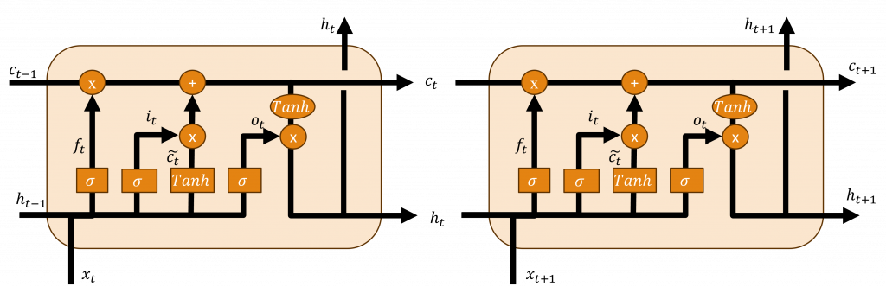

`長短期記憶網絡(Long Short-Term Memory,LSTM)`的設計就是**為了解決循環神經網路中遭遇的梯度消失和梯度爆炸問題**。它在原有的循環神經網路架構上新增了`遺忘門(Forget Gate)`、`輸入門(Input Gate)`、`狀態保存層(Cell State)`以及`輸出門(Output Gate)`，透過這些部分，使其能更有效地處理長序列數據。

其中狀態保存層的設計是為了儲存重要的資訊，並將這些資訊傳遞至整個時間序列中，這些資訊的加入和移除過程，則需要透過輸入門和遺忘門的運算來實現，所以接下來我將介紹這些層的運算過程與其原理。

### 遺忘門(Forget Gate)

遺忘門主要透過計算**上一個時間序的隱狀態**與**當前的輸入**來調整狀態保存層中的內容，其實現公式如下所示：


在該公式中代表著將輸入與上個時間序列的隱狀態進行計算，並利用`σ(Sigmoid)`轉換來獲取一個介於0和1之間的數值，這個數值用於決定哪些新的資訊需要被保留。當計算結果越接近1時，表示該數據較重要應該被保留；而當結果越接近0時則表示該訊息不夠重要可以被忽略，透過這樣的機制，使我們可以將重要的資訊保留，並將不重要的資訊剔除。

### 輸入門(Input Gate)

在輸入門中有兩個步驟，在兩個步驟中皆使用**先前的隱狀態**與**當前的輸入**進行計算，而在第一個步驟的計算公式與功能都與遺忘門相同，其計算公式如下:


在該公式中的結果`i(t)`的計算與`f(t)`相同，只不過計算的權重是不相同的，因此它可以在計算上考慮更複雜的問題。

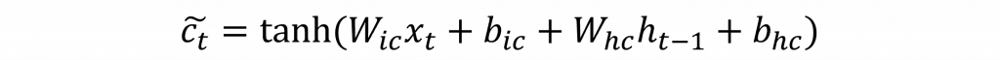

而在第二步驟，會先由**先前的隱藏狀態**和**當前輸入**串聯，接下來透過`tanh`來計算出`h(t-1)`與`x(t)`的資料分佈狀態，最後將這個分佈狀態與上述的`i(t)`進行計算，以確保該被遺忘的資訊不會被加入至狀態保存層中。

### 狀態保存層(Cell State)

一旦我們計算出遺忘門層的輸出後，我們就可以計算該神經元中狀態記憶保存層中的資料，因此我們可以用以下公式來表示該層的狀態。

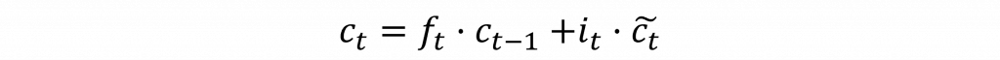

該公式代表著遺忘門主要負責從狀態保存層中遺忘資訊，並將新的資訊從輸入層加入到狀態保存層中。

### 輸出門(Output Gate)

在所有上述結果計算完畢之後，我們就能得到模型輸出至下一層的結果，該層會利用**狀態保存層**和**當前層的向量分布狀態**來進行運算，同時該層會先運用`σ`來忽視一些資料，其計算公式如下：


最後只需通過狀態保存層的資料分布狀態，並與上述的`o(t)`進行運算，就能計算出下一層的隱狀態了。


如此一來長短期記憶網絡便能夠計算出最終的答案，並通過狀態保存層傳遞重要的資料訊息，但該模型還存在一個問題，就是其計算公式過於複雜，導致運算速度極為緩慢。

門控循環單元(Gated Recurrent Unit, GRU)
---------------------------------

`門控循環單元(Gated Recurrent Unit, GRU)`是一種長短期記憶的簡化版本，他簡化了一些不必要的公式，使在維持準確率的同時，增加計算的速度其架構主要由`更新門（Update Gate）`、`重置門（Reset Gate）`這兩個架構組成，並只使用`單一隱狀態（Single Hidden State）`傳遞資訊。


### 更新門（Update Gate）

在更新門中主要簡化了長短期記憶的輸出門與輸入門，因此再該層中主要會**更新門控循環單元單一隱狀態**與並將其輸入到下一個神經元中，而該層的計算方式就是通過**先前的隱狀態**與**當前的輸入**進行計算，其公式如下：

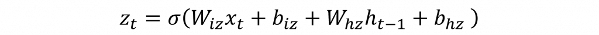

### 重置門（Reset Gate）

門控循環單元還設計了一個重置門，它的作用與長短期記憶相同，也就是透過**當前的輸入**與**先前的隱狀態**進行運算，以遺忘掉不重要的資訊，其公式也與長短期記憶相似。


同樣的`r(t)`計算公式與`z(t)`相同主要就是權重不相同而已

### 單一隱狀態（Single Hidden State）

在門控循環單元中，**並未採用狀態保存層**，而是只使用單一隱狀態，這部分的設計，就是增加運算速度的主要原因，它通過公式的變化，簡化了遺忘、更新、輸出動作的過程。


首先我們將先前計算出來的重製門結果`r(t)`與**先前的隱狀態**進行運算已計算出何種資料該被丟棄，接下來直接**當前的輸入**進行運算使這些新的資料能夠被加入到隱狀態中。


接下來因重製門的計算結果只**保留了重要的資訊並遺忘掉無用的資訊**並將該結果更新到單一隱狀態中，此時我們的單一隱狀態中包含了`σ(h(t-1))`與`x(t)`這兩個資訊，若我們再將更新門的資料透過`σ`運算時就會使單一隱狀態中`σ(h(t-1))`的數值變得更大，因此在此處更新時我們須透過`z(t)`的補數`1-z(t)`來遺忘該結果，使其能夠平均的傳遞到下一個神經元中。

在門控循環單元和長短期記憶之間的差別在於，門控循環單元在每一個神經元中**進行完整的計算**，而長短期記憶則是通過**比對之前的序列資料**來進行運算。

後話
--

你今天可能會覺得大腦非常的混亂，因為我在今天解釋三個模型的公式，雖然我原先計劃將這三個模型單獨講解，但我認為一次性學習會有最好的效果，主要是因為所有的時間序列模型都彼此相連繫，這樣的方式可以增加你學習模型的速度，而明天我將會展示這三個模型的訓練方式，以及在處理大型資料集時其執行速度與準確率的比較。

那麼我們明天再見！

內容中的程式碼都能從我的GitHub上取得:

[https://github.com/AUSTIN2526/iThome2023-learn-NLP-in-30-days](https://github.com/AUSTIN2526/iThome2023-learn-NLP-in-30-days)

---

<a id="6669-day-08"></a>

## Day 08｜【Day 8】文字也是一種有時間序列的資料(下)-用IMDB影評探索文字中的情緒

- 原文：https://ithelp.ithome.com.tw/articles/10324839

前言
--

今天的內容非常的重要，因為模型訓練與評估的方式，直接影響到了模型最終的效能，我們在[【Day 6】深度神經網路該怎麼改變Embedding向量(下)-PyTorch訓練的策略和方法](https://ithelp.ithome.com.tw/articles/10323930)的作法只不過是最基礎的用法而已，而今天我將會告訴你最完整最有用的訓練方式，而這種方式也被廣泛運用於AI的比賽，今日的學習重點如下:

1.   學習TorchText的基礎用法
2.   理解固定`亂數種子(Random seed)`的重要性
3.   看懂模型的訓練曲線圖與訓練策略
4.   `過度擬合(Over fitting)`與`欠擬合(under fitting)`對模型的影響

電腦該如何從文字中理解情緒?
--------------

首先讓我們回顧一下前幾天的文章，我相信有認真閱讀的讀者，對這部分已有所理解，但我們還是做個快速複習來回顧相關重點，你也可以趁這個時候看看還有那些知識是被遺漏的。在[【Day 2】](https://ithelp.ithome.com.tw/articles/10318965)和[【Day 3】](https://ithelp.ithome.com.tw/articles/10321193)的文章裡，我們探討了如何讓電腦理解人類的文字，並透過詞嵌入層進行解析。而[【Day 5】](https://ithelp.ithome.com.tw/articles/10323386)和[【Day 6】](https://ithelp.ithome.com.tw/articles/10323930)則展示了模型如何調整這些詞嵌入層。到了[【Day 7】](https://ithelp.ithome.com.tw/articles/10324660)，我們學習了如何利用時間序列理解文字的前後文關係。

在這些文章中，我都用**正面**與**負面**這兩種情緒的例子來展示詞嵌入層的向量空間。這樣的設計就是為了銜接今日的主題：電腦如何從文字中理解情緒，透過先前這些學習你應該已經明白，相近的詞彙其向量空間也會相近，所以我們在先前訓練結果中也可以看到正負情緒被很好的區分出來，但這次我們的訓練目標是一段完整的句子，因此我們還需要考慮文字之間的前後關係，而今天我主要會將這部分拆成以下幾步，並告知你每一個步驟該知道的知識點。

### 【STEP 1】準備資料集

這次我們會使用在自然語言處理領域中極為熱門的IMDB情緒分析資料集，這個資料集是從IMDB網站上抽取的電影評論並以`正面（positive）`或`負面（negative）`的方式進行標註而成。該資料集包含50,000條電影評論，其中25,000條用於`訓練（Train）`，另外的25,000條則分配給`測試（Test）`使用。

今天我們將透過這個資料集模擬自然語言處理時，最可能使用的數據儲存方式 - CSV檔案，而取得該資料的方式我們可以前往[Kaggle](https://www.kaggle.com/datasets/lakshmi25npathi/imdb-dataset-of-50k-movie-reviews?datasetId=134715&sortBy=dateRun&tab=profile)進行下載。


當我們進入Kaggle網站後，先點擊【Data Card】選項，然後將頁面往下滑，這時我們就可以看到該檔案的下載按鈕(如下圖)，當我們檔案下載完畢只需要將該資料存入程式資料夾中即可。


### 【STEP 2】函式庫安裝與介紹

在取得資料集後，我們需要安裝一個名為Pandas的函式庫，該函式庫能夠幫助我們快速讀取CSV檔案，並且該CSV檔案並未幫我們分割`訓練集(Train Dataset)`及`驗證集(Valid Dataset)`，所以還需要另一個名為sklearn的函式庫，以協助我們快速切割資料集，而我個人會在訓練時觀看訓練的進度，因此還會額外安裝一個名為tqdm的函式庫，以上三個函式庫我們可以透過`pip`指令進行安裝。

> **小提示:**
> 
> 在深度學習的訓練中，我們通常將資料分為訓練、驗證、和測試三個部分，如果我們面對的是一個尚未被切割的資料集，通常會先將其劃分為訓練和驗證兩部分，用以評估模型的表現，接著再利用實際的測試資料進行二次評估。
> 
> 
> 而在AI比賽中，測試集通常是不會有標籤資料的，所以我們只能通過訓練與驗證來尋找最佳的模型，然後對測試集進行模型推理，以繳交最終的答案。

```
pip install pandas
pip install scikit-learn
pip install tqdm
```

今天我們將使用九個函式庫進行深度學習的運算，其中包含兩個我們以前未曾提及的函式庫，即numpy及collections。numpy是Python中一個極其重要的`array(矩陣)`操作函式庫，其主要目的是**讓Python能透過矩陣來進行高效的運算**;而collections是Python內建的高階函式庫，在我們後續的內容中，它將幫助我們**計算詞彙的出現次數**。

```
import torch 
import torch.nn as nn 
import torch.optim as optim 
import numpy as np 
import pandas as pd
from torch.utils.data import Dataset, DataLoader
from tqdm import tqdm 
import matplotlib.pyplot as plt 
import random 
from torch.nn.utils.rnn import pad_sequence
from sklearn.model_selection import train_test_split
from collections import Counter
from torchtext.vocab import vocab
from torchtext.data.utils import get_tokenizer
```

### 【STEP 3】固定亂數種子(Random seed)

在深度學習的模型中，由於初始權重是隨機產生，並且運算結果也會採用一些隨機的方式，這都能夠為模型增加隨機性以此提升訓練效果。然而這種方式的一個副作用是使我們在訓練過程中難以確切理解問題所在，例如:在比較模型的效能優劣時，不同的亂數種子導致每次訓練的結果都不一樣，這就使我們難以進行有效的比較，所以我們可以通過以下程式將Python中的亂數種子固定住，使我們能比較RNN、LSTM、GRU之間的效能差距。

```
def set_seeds(seed):
    random.seed(seed) 
    np.random.seed(seed)  
    torch.manual_seed(seed)
    if torch.cuda.is_available():
        torch.cuda.manual_seed(seed)
        torch.cuda.manual_seed_all(seed) 
    torch.backends.cudnn.benchmark = False
    torch.backends.cudnn.deterministic = True
    
set_seeds(2526)
```

### 【STEP 4】讀取文字資料 & TorchText資料前處理

接下來我們通過Pandas函式庫中的`read_csv()`讀取IMDB資料集中的檔案內容，該函數會將csv檔案轉換成一個`DataFrame`類別，使其能夠進行計算資料關聯性、取得某一`欄(column)`、取得某一`列(row)`...等多樣性的功能。

```
df = pd.read_csv('IMDB Dataset.csv')
reviews = df['review'].values
sentiments = df['sentiment'].values
```

在上述程式中，我們先通過**欄位名稱作為索引**來獲取相對應的資料，如【reviews】代表著在IMDB影評資料集中的文字訊息，而【sentiment】則表示該資料集的情緒標籤，同時我們也通過`values`功能將其從`DataFrame`類別轉換成`array`型態，以便後續的運算操作。

接下來，我們利用TorchText中的`get_tokenizer()`作為文本標記器，這個標記器的索引值與詞彙資料都是由TorchText預先定義的。

```
tokenizer = get_tokenizer('basic_english')
```

當我們有了標記器後，就可以開始計算這些文字的出現次數，這麼做的原因是因為若某個文字的出現次數過少，調整該詞彙向量時的難度就會提高，並起與其他較常見詞彙相比，其前後文的訊息相對匱乏讓向量調整錯誤，並且這種操作也會增加模型計算的複雜度，所以在這裡我們應該直接將這些低頻詞彙替換成`<unk>`，以確保保留一定訊息量的同時進行訓練。

```
counter = Counter()
for review in reviews:
    token = tokenizer(review)
    counter.update(token)

token_vocab = vocab(counter, min_freq=10, specials=('<pad>', '<unk>'))
token_vocab.set_default_index(token_vocab.get_stoi()['<unk>'])
```

在以上程式中，我們先通過了剛創立的標記器來**切割文字(尚未轉換成數字)**，接下來透過`update()`的方式來更新`Counter()`容器內該詞彙的出現次數，最後使用TorchText中的`vocab()`來將低於10次出現的詞彙給過濾掉，同時加入`<pad>`、`<unk>`這兩個特殊標籤，然而我們需要注意我們要將`<unk>`的索引設定為預設值，不然**程式將會出現錯誤，並且不會有有任何的提示。**

> **小提示:**
> 
> 在這個步驟中，你可以把它想像為我們之前使用的tokenizer.py的功能，之前我們是使用split()來進行分割，然後用tokenizer()進行初始化;但在這裡，我們則是直接使用tokenizer()進行分割，然後再透過vocab來初始化類別，為後續的轉換動作做好準備。

接下來我們就能夠進行轉換成數字與轉換張量的動作了，而在這裡我們需要注意，因今天會使用一個名為`二元交叉熵損失(Binary Cross Entropy Loss)`的損失函數來進行運算，而該公式需要讓輸出在`0~1`之間，因此我們需要將標籤轉換成`float`型態。

```
# 轉換詞彙
reviews_ids = [torch.tensor(token_vocab.lookup_indices(tokenizer(i))) for i in reviews]
# 轉換標籤
labels = (sentiments=='positive').astype('float32')
# 切割資料集
x_train, x_valid, y_train, y_valid = train_test_split(reviews_ids, labels, train_size=0.8, random_state=46, shuffle=False)
```

當資料都轉換完畢後，就能使用到sklearn中的`train_test_split()`進行切割了，在這裡我們採用了8:2比例進行切割，並且固定亂數結果，以確保每次程式的切割方式都相同。

### 【STEP 5】使用Dataset與DataLoader包裝資料

在Pytorch訓練中，我們通常會遵循一個模式，該方式就是先將原始資料用`Dataset`類別進行包裝，然後賦予給`DataLoader()`，這樣做的好處是`DataLoader()`能將`Dataset`所包裝的數據分割成固定批量的大小，並且提供打亂和多進程的功能。

```
class IMDB(Dataset):
    def __init__(self, x, y):
        self.x = x
        self.y = y
          
    def __getitem__(self, index):
        return self.x[index], self.y[index]
       
    def __len__(self):
        return len(self.x)
    
trainset = IMDB(x_train, y_train)
validset = IMDB(x_valid, y_valid)
```

在以上的程式碼中的主要操作是透過`__len__`函數獲取所有檔案的大小，並利用`__getitem__`函數將定量的資料進行迭代。

而我們需要做的事情就是將訓練數據和對應的標籤提供給這個類別，然後再將整個`Dataset`類別送入`DataLoader()`裡，接下來我們先看一下以下的部分程式碼:

```
train_loader = DataLoader(trainset, batch_size = 64, shuffle = True, num_workers = 0, pin_memory = True, collate_fn=collate_fn)
valid_loader = DataLoader(validset, batch_size = 64, shuffle = True, num_workers = 0, pin_memory = True, collate_fn=collate_fn)
```

在程式碼中，我們首先對已經初始化完畢的`Dataset`類別`trainset`與`validset`進行包裝，並設定批量大小為64，接下來確保數據被打亂，且這些批量大小的記憶體位址被固定，以便提升運算速度。

但是我們需要特別注意的一點是，在先前的幾次訓練中，我們提到**訓練時每批數據的大小必須相等**，然而我們先前的處理中並未對此作出調整，雖然我們可以從一開始就針對該文本資料的最大長度來進行填充，但這會使模型的計算量大增，這是因為計算最大長度以外，程式還需要排除`<PAD>`這一個索引。

因此我們需要修改`DataLoader`中的`collate_fn`函數，實際上`collate_fn`所做的事情非常簡單，它只是負責回傳`Dataloader()`中的批量資料，我們可以看到以下程式:

```
def collate_fn(batch):    
    return batch
```

所以我們可以將這些批量資料取出，並透過`pad_sequence()`的方式進行動態填充，從而提升計算速度。

```
def collate_fn(batch):  
 (x, y) = zip(*batch)
    return pad_sequence(x, padding_value=PAD_IDX, batch_first=True), torch.tensor(y)
```

### 【STEP 6】建立RNN & LSTM & GRU 模型

在模型初始化的部分，我們實際上是在之前做的詞嵌入層和深度神經網路之間插入了一層時間序列模型，在這裡為了便於通過修改參數來更換模型，我一次性地宣告了三個時間序列模型，並透過if...else語句來進行選擇。

```
class TimeSeriesModel(nn.Module):
    def __init__(self, embedding_dim, hidden_size, num_layers=1, bidirectional=True, model_type = 'LSTM'):
        super().__init__()
        self.embedding = nn.Embedding(INPUT_DIM,  embedding_dim, padding_idx = PAD_IDX)
        if model_type == 'LSTM':
            self.series_model =nn.LSTM(embedding_dim, 
                               hidden_size = hidden_size, 
                               num_layers = num_layers,
                               bidirectional = bidirectional,
                               batch_first=True
            )
        elif model_type =='GRU':
            self.series_model =nn.GRU(embedding_dim, 
                               hidden_size = hidden_size, 
                               num_layers = num_layers,
                               bidirectional = bidirectional,
                               batch_first=True
            )
            
        else:
             self.series_model =nn.RNN(embedding_dim, 
                               hidden_size = hidden_size, 
                               num_layers = num_layers,
                               bidirectional = bidirectional,
                               batch_first=True
            )
            

        hidden = hidden_size * 2 if bidirectional else hidden_size
        self.fc = nn.Linear(hidden, 1)

        self.sigmoid = nn.Sigmoid()
```

在以上的程式中可以發現，所有的時間序列模型中都有以下幾個參數:

| 參數名稱 | 說明 |
| --- | --- |
| hidden_size | 隱藏層數量 |
| num_layers | 指定要有幾個時間序列模型 |
| bidirectional | 是否要雙向計算 |
| batch_first | 批次量是否在第一維度 |

在該表格中，`hidden_size`代表每一層時間序列模型的隱藏層數量，`num_layers`則代表需要的時間序列模型層數。擁有這個參數後，我們就無需一直宣告模型的層數。

`bidirectional`和`batch_first`為我們的重點參數，當`bidirectional=True`時，意味著時間序列模型會先從左到右運算一次，再從右到左運算一次，使得`hidden_size`的數量變成兩倍，原因在於它考慮了兩個方向。

至於`batch_first`，在時間序列模型中，預設的輸入為`(序列長度, 批量大小, 詞嵌入維度)`，若選擇`batch_first=True`，則變為`(批量大小, 序列長度, 詞嵌入維度)`。

根據上述的資料，我們可以定義前向傳播的流程。首先我們需要將時間序列模型計算完畢後的結果中的**最後一個時間步**提取出來，然後傳入到深度神經網路中，在模型的最後我們使用了`self.sigmoid()`函數，將結果縮放到`0~1`範圍內，以符合二元交叉熵損失的計算要求。

```
def forward(self, x):
    emb_out = self.embedding(x)
    out, (h, c)  = self.series_model(emb_out)
    x = out[:, -1, :]
    x = self.fc(x)

    return self.sigmoid(x)
```

最後我們將這些模型類別進行初始化並宣告優化器與損失函數，但在此過程中我們使用了特殊的方式來動態判別Pytorch是否有GPU環境，如果環境設定無誤，那麼Pytorch將會透過`to()`的方式將資料放入GPU中。

```
device = torch.device('cuda' if torch.cuda.is_available() else 'cpu')
model = TimeSeriesModel(embedding_dim = 300, hidden_size= 128, model_type = 'RNN').to(device)
criterion = nn.BCELoss()
optimizer = optim.Adam(model.parameters(), lr=1e-3)
```

### 【STEP 7】模型訓練策略與結果判別

在模型訓練的過程中，我們會使用到tqdm這個函式庫來顯示訓練進度，使用方式非常簡單，只需用`tqdm()`來包裝`DataLoader()`。

而模型的訓練方式則與先前相同，只不過增加了些準確率計算的部分，由於輸出值是介於`0~1`之間，所以我們用`0.5`作為分界，將`0.5`以上的輸出值視為標籤`1`，反之則為`0`。

```
def train(epoch):
    train_loss, train_acc = 0, 0
    train_pbar = tqdm(train_loader, position=0, leave=True) # 宣告進度條
    
    model.train() # 將模型切換成訓練模式
    for input_datas in train_pbar: 
        features, labels = [i.to(device) for i in input_datas] # 將資料放入到GPU中
        optimizer.zero_grad()  # 梯度清零
        outputs = model(features).view(-1) # 模型計算答案(前向傳播)
        
        loss = criterion(outputs, labels) # 計算Loss值
        loss.backward() # 返向傳播
        optimizer.step() # 更新模型權重
        
        train_pbar.set_description(f'Train Epoch {epoch}')  # 顯示訓練次數
        train_pbar.set_postfix({'loss':f'{loss:.3f}'}) # 顯示當下模型損失
        
        pred = outputs > 0.5
        train_acc += sum(pred == labels) # 計算預測成功的數量
        train_loss += loss.item()  # 模型總損失
    return train_loss/len(train_loader), train_acc/len(trainset) # 計算一次訓練的Loss與準確率
```

在模型驗證的部分，我們只需要將調整權重相關的程式區塊移除便可。而為了提升計算速度，我還使用了`torch.no_grad()`這個函數，該函數的功能是忽略梯度的追蹤，因此可以使計算速度更快。

```
def valid(epoch):
    valid_loss, valid_acc = 0, 0
    valid_pbar = tqdm(valid_loader, position=0, leave=True)
    
    model.eval()
    with torch.no_grad(): 
        for input_datas in valid_pbar:
            features, labels = [i.to(device) for i in input_datas]
            outputs = model(features).view(-1)
            loss = criterion(outputs, labels)
            
            valid_pbar.set_description(f'Valid Epoch {epoch}')
            valid_pbar.set_postfix({'loss':f'{loss:.3f}'})

            pred = outputs > 0.5
            valid_acc += sum(pred == labels)
            valid_loss += loss.item()

    return valid_loss/len(valid_loader), valid_acc/len(validset)
```

最後我們還要使用`plot()`繪製折線圖以觀看最後的結果，這樣子基本的函數都定義完畢了

```
def show_training_loss(loss_record):
    train_loss, valid_loss = [i for i in loss_record.values()]
    
    plt.plot(train_loss)
    plt.plot(valid_loss)
    #標題
    plt.title('Result')
    #y軸標籤
    plt.ylabel('Loss')
    #x軸標籤
    plt.xlabel('Epoch')
    #顯示折線的名稱
    plt.legend(['train', 'valid'], loc='upper left')
    #顯示折線圖
    plt.show()
```

在我們完成訓練函數的定義後，我們就可以開始制定訓練策略，我最常用的策略是在每一步的模型訓練過程中儲存歷史最低的Loss值或準確率，並進行`提前停止（Early Stopping）`的操作。這種操作的主要目的在於，一旦模型進入`過度擬合(Over fitting)`的狀態，Loss曲線將開始上升，而模型很可能不會再有進一步的下降，原因是模型已經過度熟悉訓練資料，導致在處理未見過的資料時，其泛化能力降低。

```
epochs = 15                              # 訓練次數
early_stopping = 7                       # 模型訓練幾次沒進步就停止
stop_cnt = 0                             # 計數模型是否有進步的計數器
model_path = 'model.ckpt'                # 模型存放路徑
show_loss = True                         # 是否顯示訓練折線圖
best_acc = 0                             # 最佳的準確率
loss_record = {'train':[], 'valid':[]}   # 訓練紀錄

for epoch in range(epochs):   
    train_loss, train_acc = train(epoch)
    valid_loss, valid_acc = valid(epoch)
    
    loss_record['train'].append(train_loss)
    loss_record['valid'].append(valid_loss)
    
    # 儲存最佳的模型權重
    if valid_acc > best_acc:
        best_acc = valid_acc
        torch.save(model.state_dict(), model_path)
        print(f'Saving Model With Acc {best_acc:.5f}')
        stop_cnt = 0
    else:
        stop_cnt+=1
    
    # Early stopping
    if stop_cnt == early_stopping:
        output = "Model can't improve, stop training"
        print('-' * (len(output)+2))
        print(f'|{output}|')
        print('-' * (len(output)+2))
        break

    print(f'Train Loss: {train_loss:.5f} Train Acc: {train_acc:.5f}', end='| ')
    print(f'Valid Loss: {valid_loss:.5f} Valid Acc: {valid_acc:.5f}', end='| ')
    print(f'Best Acc: {best_acc:.5f}', end='\n\n')

if show_loss:
    show_training_loss(loss_record)
```

當以上程式執行完畢代表訓練結束，因此我們來比對一下三個模型的效能差異，並觀察三個訓練的曲線圖。


| 模型名稱 | 準確率 |
| --- | --- |
| RNN | 69.54% |
| LSTM | 88.04% |
| GRU | 88.71% |
| 在以上的結果中，我們可以發現**GRU與LSTM在初期並未有太大的波動**，這是因為如同我們昨天所學，這兩個演算法會進行較複雜的資料計算處理。因此在初期調整詞嵌入空間時的行為接近隨機向量，但經過一段時間的訓練後，這個神經網路學習到了資料句子的上下文關係，因而詞嵌入空間逐漸被訓練得更為準確使準確率開始提升。至於RNN就因其對長時間序列的適應性較差，我們可以發現其Loss值變動起伏並不大，也造成最終的精確率並不理想。 |  |

而這些模型到後面也都產生了過擬合的狀況，也就是驗證數集損失上升而訓練損失下降（反之則是欠擬合），這時我們可以考慮降低`early_stopping`參數的數值，使之能在損失上升後立即中斷訓練，以減少訓練次數。

### 【STEP 8】實際應用

在模型訓練時，我僅儲存了模型的權重，所以我們需要在將這些權重導入回來前，先重新建構該模型的初始值。因此我們需要先執行以下的程式碼:

```
model = LSTM(embedding_dim = 300, hidden_size= 128).to(device)
model.load_state_dict(torch.load(model_path))
model.eval()
```

在模型的應用上，由於我們在訓練時第一個維度是**批量大小**，因此我們需在第一軸增加維度，以還原模型的輸入。

```
label_decoding = {0:'negative', 1:'positive'}
text = x_valid[0].unsqueeze(0).to(device)

output = model(text)                                     
pred = (output.view(-1) > 0.5)
label = y_valid.tolist()[0]                                # 取得Label

print('Pred Label:',label_decoding[int(pred)])             # 顯示文字 
print('Real Label:',label_decoding[label])                 # 顯示文字 
print('Reivew:\n', " ".join(token_vocab.lookup_tokens(x_valid[0].tolist())))
```

這時我們就能夠看到模型的預測結果如下:

```
Pred Label: negative
Real Label: negative
Reivew:
 first off i want to say that i lean liberal on the political scale and i found the movie offensive . i managed to watch the whole <unk> disgrace of a film . this movie brings a low to original ideas . yes it was original thus my 2 stars instead of 1 . are our film writers that uncreative that they can only come up with this ? ? acting was horrible , and the characters were unlikeable for the most part . the lead lady in the story had no good qualities at all . they made her <unk> into some sort of a bad guy and i did not see that at all . maybe i missed something , i do not know . he was the most down to earth , relevant character in the movie . i did not shell out any money for this garbage . i almost wish peta would come to the rescue of this awful , offensive movie and form a protest . disgusting thats all i have to say anymore !
```

可以看到在該句子中出現了如`garbage`、`awful`、`disgrace`等負面詞彙，因此在情緒分析上，這些詞的向量空間將更接近於負面的區域，所以系統將會將這結果判斷為負面情緒。

後話
--

這次的程式碼內容較為龐大，可能會在學習過程中感到困難，然而這種訓練方式可以適用於大部分的模型，在AI比賽中，我們通常會變更亂數種子並進行多次訓練，以計算各模型的平均數值，從而使模型達到最大的效用。今天只是介紹了在自然語言處理中最基礎且有效的訓練方式，而明天我將開始教你如何擴展這些基本模型的結構。

那麼我們明天再見！

內容中的程式碼都能從我的GitHub上取得:

[https://github.com/AUSTIN2526/iThome2023-learn-NLP-in-30-days](https://github.com/AUSTIN2526/iThome2023-learn-NLP-in-30-days)

---

<a id="6669-day-09"></a>

## Day 09｜【Day 9】掌握文字翻譯的技術(上)-Seq2Seq與時間序列模型

- 原文：https://ithelp.ithome.com.tw/articles/10326701
- 發佈時間：2023-09-24 22:24:58

今日學習重點
------

昨天我們撰寫了大量的程式碼，所以現在你的大腦可能會有些混亂，因此今天我們不打算學習太多新知識，而是讓你讓心情先平復一下，所以我們來稍微了解一下時間序列模型的進階概念`Seq2Seq`吧，如果你已經瞭解時間序列模型，那麼對於今天的內容，你一定能輕易掌握，今日的重點如下：

1.   理解`Seq2Seq(序列到序列)`的數理公式
2.   學習`Encoder(編碼器)`與`Decoder(解碼器)`所扮演的角色
3.   `Teacher Forcing(教師強制)`與`貪婪解碼(Greedy Decoding)`的策略

Seq2Seq(序列到序列)
--------------

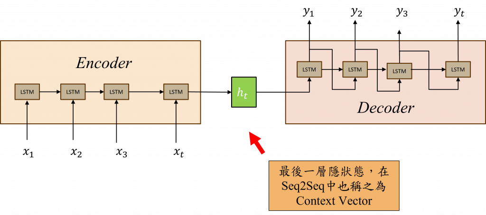

`Seq2Seq(序列到序列)`是由Google的研究團隊於2014年開發的模型架構，其目的在於解決先前的DNN模型(包括LSTM、RNN)在輸入和輸出都是固定維度的問題，因在大多數的機器翻譯、文本摘要、語音辨識任務中，輸入與輸出都是不固定的，因此該模型的出現使自然語言處理領域取得了重大突破。

Seq2Seq模型由兩個部分組成：`Encoder（編碼器）`和`Decoder（解碼器）`，這兩者的主要運作方式是**透過時間序列模型進行組合與運算**而成，接下來我將分別解釋這兩個部件的架構，讓你更清楚地理解他們各自的工作原理。

### Encoder（編碼器）

`Encoder（編碼器）`的功能與我們昨日執行的行動類似，即透過時間序列模型來理解文字間的前後文關係，在Seq2Seq模型中，Encoder的最終狀態`h(t)`反映了模型對資料分布的狀況，因此也被稱作`上下文向量（Context Vector）`。整個步驟的核心目的在於將**文字分布的訊息傳遞至Decoder，以產生新的目標序列**。


在Encoder的階段運用了一些特殊的技術，來幫助模型更有效地將上下文向量傳遞到Decoder中，首先我們需設定輸入序列的最後一個符號為`<EOS>`(End of Sequence)，這個策略的目的是**使模型能在所有可能的序列長度中，瞭解其分布狀態。**

這是因為在Decoder生成步驟中，是無法識別文字之間的長度的，所以在Encoder階段，我們讓模型學習何時能結束文字，這樣模型在Decoder階段便能做出判斷。

第二招則是逆向訓練文字，經過實驗結果表明將文字反向輸入至Encoder，效果會顯著提升，作者對此的解釋是因為**RNN、LSTM、GRU等時間序列模型，並未能完美解決長時間序列的問題**，因此這種訓練方式能讓模型的**第一個輸入與第一個輸出**更緊密地結合在一起。

### Decoder（解碼器）

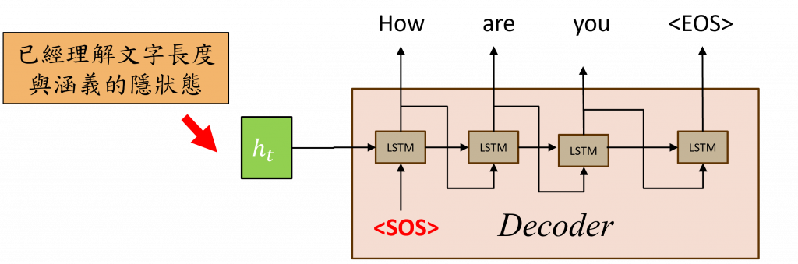

在Seq2Seq架構中，`Decoder（解碼器）`的角色是產生目標序列，這個生成過程會先將Encoder的上下文向量傳遞給Decoder的作為它的初始隱狀態，然後再配上`<SOS>`(Start of Sequence)來進行運算以計算出下一個文字，隨後不斷地將該文字與Decoder中的隱狀態`hd(t)`進行運算，直到產出`<EOS>`(序列結束標誌)時才停止。

這樣的說明可能比較抽象，我們可以從Decoder的生成公式來看（以下`hat`表示Decoder向量，並以LSTM為例）:

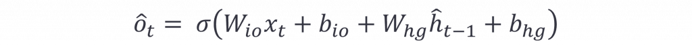

在這個公式中我們看到LSTM的時間序列輸出`o(t)`，是由Decoder的`x(t)`與`hd(t)`運算出來的，並且該狀態的 `hd(0)`會等同於Encoder的`h(t)`，這時我們就能取得每一層神經元的輸出結果。但是我們還需要從這些結果中運算出最可能的文字，因此我們可以用以下公式來表示每個時間序列輸出的文字:

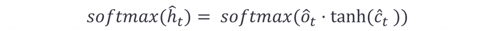

如此一來我們就能夠從每一個神經元的輸出機率中選出**機率最高的元素**作為當前時間步的輸出，並且將此結果在與下一個時間步進行運算，已達到機器翻譯、文本摘要、語音辨識等效果。

Seq2Seq的訓練策略
------------

在我們前面的內容中，我們提到一個深度學習模型**除了輸入文字外，也要有對應的標籤**，而這種方式稱之為`監督式學習(Supervised learning)`，那麼在機器翻譯的過程中，我們如何做到這一步呢?

在Seq2Seq最常用的方法稱為`Teacher Forcing(教師強迫)`，其運作方式就是在訓練階段時使用**真實目標序列**的元素作為**Decoder的輸入**，而非使用上一個時間步(上一個文字)的資料。

在這個做法主要包含兩個階段，分別為`訓練階段`與`推理(inference)階段`，以下我將會快速的告訴你這兩個步驟的目的。

### 訓練階段

在訓練期間的每個時間步驟，Decoder的輸入會被設定為實際的目標序列元素，例如:對於機器翻譯，我們會將待翻譯的目標文字設為輸入，並將其翻譯後的文字設為標籤，這樣做的用意是，當Decoder在每一步都知道自己應該產生什麼時，就能夠讓模型更快地學習目標序列的結構和模式。

### 推理階段

在模型訓練完成後，由於帶有先前目標序列元素的記憶，因此在產生新的序列時，Decoder不需要依賴真實的目標序列了，這時它會運用在**訓練期間所獲得的知識來推理出新的序列**，這時Decoder在產生每個時間步的輸出時，才會依賴前一個時間步產生的結果進行推理，而這種方式也被稱為`貪婪解碼（Greedy Decoding）`。

但Seq2Seq架構中仍存在一些缺點，產生問題的部分原因是**其核心架構採用的是時間序列模型進行運算**，因此當處理長序列時，我們可能會遇到梯度消失或梯度爆炸的問題，這也導致計算速度較慢。

並且在該架構中，Encoder與Decoder之間僅仰賴一個上下文向量傳遞資訊，所以Decoder只會**獲得Encoder學習過的特徵，並忽視掉原始輸入特徵**，這種特性使得訓練Seq2Seq需要大量的數據，而且如果採用貪心解碼策略，還會使得生成的序列**並非全域的最佳解，僅是局部的最佳解**。

> **小提示:**
> 
> 若要解出一個全域最優解，我們必須考慮整體的合理性，就像遊樂園一樣，如果我們憑著最短的路徑選擇每個遊樂設施，可能會因為排隊的時間而導致總消耗時間更長，同理使用貪婪解碼方案時，我們只考慮每次機率最高的文字，而並非組合最合理的文字。

後話
--

今天我們學習了Seq2Seq這項經典架構，很多強大的後續模型都源自於它的改良，因此Seq2Seq在自然語言處理中相當於基石的角色。但從現在的觀點看來，Seq2Seq存在許多問題，其中最嚴重的就是它只依靠一個上下文向量來傳遞資訊。因此，明天我會教你們另一項重要技術稱`注意力機制(Attention)`。

那麼我們明天再見！

內容中的程式碼都能從我的GitHub上取得:

[https://github.com/AUSTIN2526/iThome2023-learn-NLP-in-30-days](https://github.com/AUSTIN2526/iThome2023-learn-NLP-in-30-days)

---

<a id="6669-day-10"></a>

## Day 10｜【Day 10】掌握文字翻譯的技術(中)-為何需要注意力機制

- 原文：https://ithelp.ithome.com.tw/articles/10327536
- 發佈時間：2023-09-25 16:57:13

今日學習重點
------

現在你已經了解一些有關於Seq2Seq的知識，接下來我們要告訴你的是`注意力機制(Attention)`的特點，以及它如何解決僅通過上下文向量傳遞資訊的問題。

1.   學習`注意力機制(Attention)`的功能
2.   理解Encoder與Decoder之間的訊息拼接方式
3.   理解Decoder怎麼通過注意力機制生成文字

注意力機制(Attention)
----------------

`注意力機制(Attention)`模擬了人類的專注力特性，讓電腦在處理信息時**有選擇地專注於某些部分，而忽略其他不重要的訊息**，而注意力機制在Seq2Seq這種Encoder-Decoder模型架構裡的核心功能即是將各層Encoder的隱狀態`h(t)`選擇出最佳解，使其傳遞給Decoder進行比對後進行生成的動作，藉此讓Decoder能更深入地理解這些信息。


而在注意力機制，需要先計算`注意力分數（Attention Scores）`、`注意力權重（Attention Weights）`已產生更好的`上下文向量（Context Vector）`，以下我將會用公式對此進行詳細的解析動作。

### 注意力分數（Attention Scores）

在採用注意力機制的Encoder架構中，我們**不會僅用一個隱狀態**讓Decoder進行生成，而是讓Decoder需要在**每次生成文字**時，都找出最有可能的Encoder的隱狀態，所以我們必須使其先行計算出注意力分數，使其能找到最有可能的結果，其計算公式如下:


在上述公式中，Encoder隱狀態`h(i)`將與每一個Decoder的隱狀態`hd(t)`進行對比與分析，其中`score()`有非常多的變化與形式，它可以透過內積、點積和拼接等方法進行計算，而大多數會用運以上公式來進行計算注意力分數的動作。


不過要如何選擇這些方式就需要進行實驗比對才能判別對當前任務的效用，而這些公式的含意接代表著將Encoder與Deceder兩者的隱狀態訊息完整的整合在一起。

### 注意力權重（Attention Weights）

在以上的公式中，我們只是計算出所有的排列組合分數，然而這個分數通常表示的是一個數值而不是機率，因此當我們計算出注意力分數後，還需要透過softmax函數來轉換為注意力權重，這樣能夠讓我們**找出這些組合中機率最高的結果**。

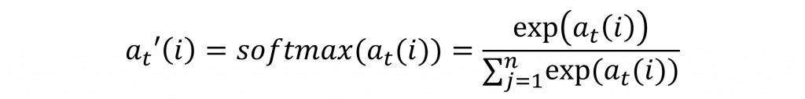

透過以上的公式透過不斷的迭代運算，使其能夠計算出`h(i)`與`hd(t)`之間的機率，這時我們就可以透過這個機率與Encoder中的`h(i)`進行運算，藉此找出輸入給Decoder的上下文向量。

### 上下文向量（Context Vector）

因此在計算上下文向量的過程中，我們需要將`h(i)`不斷的與所有的注意力權重`at'(i)`進行運算，其計算公式如下:


通過以上的計算流程，我們讓Encoder中的的隱狀態動態地調整注意力權重，使Decoder可以產生更準確的序列輸出，在模型訓練的過程中，將會訓練出Encoder-Eeocder的隱藏狀態與權重組合，進而提供了更多特徵輸入序列的資訊。

後話
--

在昨日與今天我們學習了Seq2Seq的完整架構以及其改善方法，你或許已經注意到與先前相比，這兩天的學習內容相對較少，原因在於我們才剛剛掌握了時間序列模型的基本理論，因此在學習Seq2Seq時，你可能會發現自己常常需要回頭檢視先前學過的公式內容。加上Seq2Seq與Attention的公式特別多，因此在撰寫程式時建構的複雜程度也相當的高，因此我決定用兩天的時間來詳細講解這個部分，並規劃在明天教你一個如何建立完整的機器翻譯模型。

那麼我們明天再見！

內容中的程式碼都能從我的GitHub上取得:

[https://github.com/AUSTIN2526/iThome2023-learn-NLP-in-30-days](https://github.com/AUSTIN2526/iThome2023-learn-NLP-in-30-days)

---

<a id="6669-day-11"></a>

## Day 11｜【Day 11】掌握文字翻譯的技術(下)-英法語言翻譯模型

- 原文：https://ithelp.ithome.com.tw/articles/10328763

今日學習重點
------

今天我們終於來到了文字翻譯技術的總結了，這次的內容會非常複雜，你可以將其想像為我們從第1天到第10天學習到的知識的綜合體，所以在今天我將把這些程式碼進行拆解，讓你理解Pytorch中該怎麼使用公式來實現Seq2Seq+Attention的架構，今天的學習內容如下：

1.   加深你對Seq2Seq的印象
2.   理解在文字翻譯上的前處理方法
3.   學習Pytorch實現Decoder架構的方式
4.   注意力機制可視化

掌握文字翻譯的技術
---------

今日我們將透過Pytorch實現文字翻譯的技術，而這次選擇的語言對象是英語和法語。至於為何選擇英語和法語呢？這是因為英語和法語是全球使用範圍最廣的語言之一，所以已經有大量的線上及書面資源，並且英語和法語同為印歐語系，因此許多詞彙在某些層面上非常相似，所以選擇它們作為訓練的目標語言更為合適。

### 【STEP 1】準備資料集

首先我們需要先前往[Pytorch官網下載](https://download.pytorch.org/tutorial/data.zip)今天將要使用的資料集，當然你可以用自己想要翻譯的語言集，但是在資料整理的步驟你就需要進行改良或參考以下的輸入格式。

在此資料集中的英語和法語儲存方式是透過一個txt檔案進行的，該資料集內容上，左側是英文，右側則是法語，其內容如下所示:

```
Go.	Va !
Run!	Cours !
Run!	Courez !
Wow!	Ça alors !
Fire!	Au feu !
Help!	À l'aide !
Jump.	Saute.
```

我們所需要做的就是利用Python讀取該txt的內容，並建立英文與法語的標記器，確保能夠正常進行轉換。

### 【STEP 2】讀取檔案與計算詞彙出現次數

在該步驟中我們應該不會太陌生，因為我們在[【Day 8】文字也是一種有時間序列的資料(下)-用IMDB影評探索文字中的情緒](https://ithelp.ithome.com.tw/articles/10324839)的學習過程中，我們就已經使用過這種方式了。但是這裡有些細節和會語之前不相同。

之前我們在TorchText中的`get_tokenizer()`的可以直接使用`basic_english`的方式呼叫標記器，但對於其他語言，我們必須採用其他函式庫的檔案，因此我們需要先安裝spacy的法語的資料包，可以透過以下指令進行安裝：

```
!pip install spacy
!python -m spacy download fr_core_news_sm
```

當安裝完畢後我們還需要建立兩個不同的標記器，已分別針對英語和法語斷詞的動作。

```
from torchtext.data.utils import get_tokenizer

# 建立標記器
french_tokenizer = get_tokenizer('spacy', language='fr_core_news_sm')
englisg_tokenizer = get_tokenizer('basic_english')
```

接下來我們將撰寫一個函數，此函數需要回傳每句話中詞彙的出現次數，但在此之前，我們需要先利用Python的`open()`函數讀取我們的資料集。

```
with open('data/eng-fra.txt', 'r',encoding='utf-8') as f:
    text_datas = f.readlines()
```

在上述程式中，我們是利用`readlines()`讀取整份文件的資料，但該方式會在每行結尾預設一個`\n`作為換行符，並且該資料集的內容是以`TAB`鍵作分隔英語和法語，故會產生`\t`符號，因此每筆資料在程式中的結果如下所示。

```
[
Go.\tVa !\n, 
Run!\tCours !,
\nRun!\tCourez !\n,
...
]
```

因此該函數的計算方式可以寫成下方這種格式，使其能夠幫助我們快速的統計出最終結果，並將被斷詞的詞彙回傳給主程式以方便後續的使用。

```
from collections import Counter
def preprocessing(french_tokenizer, englisg_tokenizer):
    en_counter, fr_counter = Counter(), Counter()
    
    english, french = [], []
    for text_data in text_datas:
        en, fr = text_data.strip('\n').split('\t')
        en_tokens, fr_tokens = englisg_tokenizer(en), french_tokenizer(fr)

        english.append(en_tokens)
        french.append(fr_tokens)
        
        en_counter.update(en_tokens)
        fr_counter.update(fr_tokens)

    return en_counter, fr_counter, english, french
    
en_counter, fr_counter, english, french = preprocessing(french_tokenizer, englisg_tokenizer)
```

在上述程式中，我們的主要處理步驟是先使用`strip()`來刪除文字前後的`\n`，然後再利用`\t`來分割文字。這樣我們將會得到一個**包含兩個元素的串列資料**，分別是英語和法語。

同時我們還可以取出相應的字串，並利用各自的斷詞器進行斷詞操作，使其能通過`Counter()`統計每個詞彙出現的次數。

### 【STEP 3】取得模型輸入與建立詞彙表

這次建立詞彙表的方式也是通過`vocab()`來處理，但在這裡要特別注意，我們這次需要加入4個特殊的詞彙標籤：`<PAD>`、 `<SOS>`、`<EOS>`、`<UNK>`，其中`<SOS>`和`<EOS>`是需要添加到每句話的開頭和結尾的特殊標籤，其目的是為了提醒模型知道何時該結束。

```
from torchtext.vocab import vocab

# 建立詞彙表
en_vocab = vocab(en_counter, min_freq=5, specials=('<PAD>', '<SOS>','<EOS>','<UNK>'))
en_vocab.set_default_index(en_vocab.get_stoi()['<UNK>'])

fr_vocab = vocab(fr_counter, min_freq=5, specials=('<PAD>', '<SOS>','<EOS>','<UNK>'))
fr_vocab.set_default_index(en_vocab.get_stoi()['<UNK>'])
```

接下來我們需要取得詞嵌入層的大小以及一些特定的索引值，以便後續直接使用這些索引進行超參數的設定。

```
# Ecoder與Decoder的Embedding輸入大小
INPUT_DIM =  len(en_vocab)
OUTPUT_DIM = len(fr_vocab)

# 取得給予模型的索引值
SOS_IDX = en_vocab.get_stoi()['<SOS>']
EOS_IDX = en_vocab.get_stoi()['<EOS>']
PAD_IDX = en_vocab.get_stoi()['<PAD>']
```

### 【STEP 4】資料前處理與建立Dataloader

在資料前處理的步驟中，我們需要在英語和法語文本的尾端加上結束標記`<EOS>`，並且還需要確保每一批次的文本長度相同，因此我們必須在程式中將這兩種語言的文本維度統一。

```
from torch.nn.utils.rnn import pad_sequence
english_num, french_num = [], []
for i in range(len(english)):
    en_num = en_vocab.lookup_indices(english[i]) + [EOS_IDX]
    fr_num = fr_vocab.lookup_indices(french[i])  + [EOS_IDX]

    english_num.append(torch.tensor(en_num))
    french_num.append(torch.tensor(fr_num))

all_seq = english_num + french_num
pad_seq = pad_sequence(all_seq, padding_value=PAD_IDX, batch_first=True)
```

在這裡，為了方便處理我先將兩者文本進行相加，接下來我使用`pad_sequence()`使所有長度能夠統一，這一步在之前的情緒分析訓練時，我們是把它放入`collate_fn()`中處理。

但上次我們這樣處理，主要是因為文章長短相差過大，所以以最長的序列作為填充時就會導致訓練時間過長，但這次序列的差距並不大，所以我選擇在一開始就進行填充，如此一來，在訓練過程中不需要轉換資料，進而加快模型訓練的速度。

```
english_num, french_num = pad_seq[:len(english_num)], pad_seq[len(english_num):]
MAX_LEN = len(english_num[0])

x_train, x_valid, y_train, y_valid = train_test_split(english_num, french_num, train_size=0.8, random_state=46, shuffle=False)
```

接下來我們在處理完填充資料後還需要將其分割回來，在這裡我直接使用了英語資料的長度作為索引進行分割，當分割完畢後，還需要計算出每一個序列的長度，這是因為在**Decoder產生的文字需要與我們的目標文字等長**才能計算損失。當我們都執行完畢後就能夠將資料切分成訓練集與驗證集，並將其包裝為`Dataset`後接著交由`Dataloader`處理。

```
class TranslateDataset(Dataset):
    def __init__(self, x, y):
        self.x = x
        self.y = y
          
    def __getitem__(self, index):
        return self.x[index], self.y[index]
       
    def __len__(self):
        return len(self.x)

trainset = TranslateDataset(x_train, y_train)
validset = TranslateDataset(x_valid, y_valid)

train_loader = DataLoader(trainset, batch_size = 1024, shuffle = True, num_workers = 0, pin_memory = True)
valid_loader = DataLoader(validset, batch_size = 1024, shuffle = True, num_workers = 0, pin_memory = True)

device = torch.device('cuda' if torch.cuda.is_available() else 'cpu')
```

### 【STEP 5】建立Encoder模型

這次的計算量相對較大，因此我選擇使用GRU作為時間序列模型，其模型的堆疊方式與先前情緒分析是一樣的，但在這裡，我們需要獲取**完整的輸出狀態和隱藏狀態**，因為這些狀態將會是注意力機制和Decoder的輸入資料。

```
import torch.nn as nn
class EncoderRNN(nn.Module):
    def __init__(self, input_size, hidden_size, dropout_p=0.1):
        super(EncoderRNN, self).__init__()
        self.hidden_size = hidden_size

        self.embedding = nn.Embedding(input_size, hidden_size, padding_idx=PAD_IDX)
        self.gru = nn.GRU(hidden_size, hidden_size, batch_first=True)
        self.dropout = nn.Dropout(dropout_p)

    def forward(self, input):
        embedded = self.dropout(self.embedding(input))
        output, hidden = self.gru(embedded)
        return output, hidden
    
encoder = EncoderRNN(input_size = INPUT_DIM, hidden_size = 128).to(device)
```

### 【STEP 6】建立注意力機制

這個步驟是我們在昨天的教學[【Day 10】掌握文字翻譯的技術(中)-為何需要注意力機制](https://ithelp.ithome.com.tw/articles/10327536)注意力機制的程式碼，我們可以先看到以下程式:

```
import torch.nn.functional as F

class BahdanauAttention(nn.Module):
    def __init__(self, hidden_size):
        super(BahdanauAttention, self).__init__()
        self.Wa = nn.Linear(hidden_size, hidden_size)
        self.Ua = nn.Linear(hidden_size, hidden_size)
        self.Va = nn.Linear(hidden_size, 1)
```

在初始化注意力機制的過程中，其實是透過一系列`Linear()`進行計算的，你可能會想到`Linear()`不就是深度神經網路的部分嗎？在這裡我們可以回憶一下[【Day 7】文字也是一種有時間序列的資料(上)-時間序列模型大揭密](https://ithelp.ithome.com.tw/articles/10324660)這篇文章的內容。

我們曾提到在LSTM等模型的公式中，將會分為`x(t)`和`h(t)`兩部分，這兩個部分會分別與其對應的權重進行乘法運算，然後再加總後透過`tanh`函數進行計算其資料分布。在這個過程中，**某個輸入與其權重的乘法運算**實際上就是深度神經網路的計算原理。

因此針對Decoder的注意力機制來說，公式主要是將`hd(t)`和`h(t)`這兩部分的數據進行運算，並將結果的前向傳播計算，其實際方式可以看下方的程式碼（下方程式有公式代號可供參考）。

```
def forward(self, query, keys):
    # v * tanh(query(hd) * w + keys(h) * w)  Score的其中一種計算方式(可自行修改)
    # 注意力分數的計算方式
    scores = self.Va(torch.tanh(self.Wa(query) + self.Ua(keys)))   # a(t)
    scores = scores.squeeze(2).unsqueeze(1)

    # 注意力權重的計算方式
    weights = F.softmax(scores, dim=-1)   # a'(t)

    # 兩個矩陣後兩個維度需相同大小 
    context = torch.bmm(weights, keys)    # c(t)

    return context, weights
```

在以上的程式中，我們首先計算出注意力分數，並利用`softmax()`將其轉換為注意力權重，但在後續計算`c(t)`時你可能會發現，似乎沒有計算每個隱狀態之間的結果的這一個步驟。

這正是我要說明的`bmm()`計算方式的用途，這種方式類似於矩陣相乘的動作，但不會進行加總，因此在過程中**每一個元素都會被完整計算**，所以我們可以用這種方法快速計算每個隱狀態之間的結果。

### 【STEP 7】建立Decoder

我們終於進行到今天最複雜的部分Decoder了，要開始這個步驟錢，因為需要將先前所完成的每一個動作都放在Decoder中，因此前向傳播時我們還需處理許多細節，首先我們來看看初始化的部分。

```
class AttnDecoderRNN(nn.Module):
    def __init__(self, hidden_size, output_size, dropout_p=0.1):
        super(AttnDecoderRNN, self).__init__()
        self.embedding = nn.Embedding(output_size, hidden_size, padding_idx=PAD_IDX)
        self.attention = BahdanauAttention(hidden_size)
        self.gru = nn.GRU(2 * hidden_size, hidden_size, batch_first=True)
        self.out = nn.Linear(hidden_size, output_size)
        self.dropout = nn.Dropout(dropout_p)
```

在這部分，我們只是將先前的注意力機制層引入到解碼器層中。然而，前向傳播方式較為複雜，所以接下來我將把程式碼仔細拆解，以讓你更清楚這程式的具體意義。

首先我們需要創建一個與當前批次大小相等的`<SOS>`標籤，該標籤是Decoder的第一個輸入資料，使其能夠進行推理的動作，接下來我們也需建立`decoder_outputs`這個串列，用以儲存每次生成的文字，讓其能被損失函數所使用，`attentions`則是可視化注意力機制時所用到的結果。

```
def forward(self, encoder_outputs, encoder_hidden, target_tensor=None):
    batch_size = encoder_outputs.size(0)
    decoder_input = torch.empty(batch_size, 1, dtype=torch.long, device=device).fill_(SOS_IDX)
    decoder_hidden = encoder_hidden
    decoder_outputs = []
    attentions = []
```

另外在Decoder的部分由於需要考慮到Encoder的隱狀態`h(t)`與decoder的隱狀態`hd(t)`，以及為了滿足注意力機制的需求，所以我們必須考量Encoder中的所有隱狀態`encoder_outputs`。

為此我需要新增一個`forward_step()`方法，該方法的目的是讓這些參數可以給注意力機制進行運算來定位最適合的上下文向量`c(t)`，並將這個上下文向量`c(t)`與Decoder的輸入`<SOS>`...`<EOS>`透過`cat()`函數結合之後，再提供給GRU進行運算，來計算出文字的生成結果。

```
def forward_step(self, input, hidden, encoder_outputs):
        embedded =  self.dropout(self.embedding(input))

        query = hidden.permute(1, 0, 2)
        context, attn_weights = self.attention(query, encoder_outputs)
        input_gru = torch.cat((embedded, context), dim=2)

        output, hidden = self.gru(input_gru, hidden)
        output = self.out(output)

        return output, hidden, attn_weights
```

當完成上述步驟後，我們就能透過迴圈不斷生成文字，直至達到設定的最大值，在這裡我所採用的訓練策略是Teacher forcing，也就是**透過將實際標籤給予Decoder生成**，因為此方法能有效加快收斂速度。

```
for i in range(MAX_LEN):
    decoder_output, decoder_hidden, attn_weights = self.forward_step(
        decoder_input, decoder_hidden, encoder_outputs
    )
    decoder_outputs.append(decoder_output)
    attentions.append(attn_weights)

        if target_tensor is not None:
            # Teacher forcing
            decoder_input = target_tensor[:, i].unsqueeze(1) # Teacher forcing
        else:
            # 不使用Teacher forcing(不給予標籤進行訓練)
            _, topi = decoder_output.topk(1)
            decoder_input = topi.squeeze(-1).detach()  # detach from history as input

    decoder_outputs = torch.cat(decoder_outputs, dim=1)
    # 計算文字機率
    decoder_outputs = F.log_softmax(decoder_outputs, dim=-1)
    attentions = torch.cat(attentions, dim=1)

    return decoder_outputs, decoder_hidden, attentions
    
decoder = AttnDecoderRNN(hidden_size = 128, output_size = OUTPUT_DIM).to(device)
```

> **小提示:**
> 
> 在這個階段因為我一步步地分解並說明程式碼，可能會導致你不知道實際的排版狀快，所以我建議你可以到我的GitHub上對照這些程式碼的位置，避免在邏輯上產生混淆。

### 【STEP 8】建立訓練函數

訓練模型的方式與先前相同，然而這次我們有兩個模型，因此需宣告兩個優化器，而這次我們使用的是 `NLLLoss()`，這是一種多分類的損失函數，它與`CrossEntropyLoss()`相似，但不同之處在於`CrossEntropyLoss()` 是用 softmax 來計算機率，而`NLLLoss()`是使用 log softmax（softmax 的結果再取對數）。

```
import torch.optim as optim
encoder_optimizer = optim.Adam(encoder.parameters(), lr=1e-3)
decoder_optimizer = optim.Adam(decoder.parameters(), lr=1e-3)
criterion = nn.NLLLoss()
```

模型訓練的方式與先前相同，差異在於這次有兩個模型，因此在這部分我們需要分別調整兩個模型的權重，並且需要將Encoder所產生的最後一個狀態`h(t)`與完整的`h(0)~h(t)`給予Decoder進行生成，並且在損失函式計算時將所有維度攤平，使其能夠符合`NLLLoss()`的計算方式。

```
def train(epoch):
    train_loss = 0
    train_pbar = tqdm(train_loader, position=0, leave=True) 

    encoder.train()
    decoder.train()
    for input_datas in train_pbar: 
        
        inputs, targets = [i.to(device) for i in input_datas]
        encoder_optimizer.zero_grad()
        decoder_optimizer.zero_grad()
       
        encoder_outputs, encoder_hidden = encoder(inputs)

        decoder_outputs, _, _ = decoder(encoder_outputs, encoder_hidden, targets)
        loss = criterion(
            decoder_outputs.view(-1, decoder_outputs.size(-1)),
            targets.view(-1)
        )

        loss.backward()
        encoder_optimizer.step()
        decoder_optimizer.step()

        train_pbar.set_description(f'Train Epoch {epoch}')  
        train_pbar.set_postfix({'loss':f'{loss:.3f}'}) 

        train_loss += loss.item()

    return train_loss/len(train_loader)
```

同樣地對於驗證的方式，我們只需將全部有關梯度的部分移除即可，其他部分皆與訓練相同。

```
def valid(epoch):
    valid_loss = 0
    valid_pbar = tqdm(valid_loader, position=0, leave=True) 

    encoder.eval()
    decoder.eval()
    with torch.no_grad(): 
        for input_datas in valid_pbar: 
            
            inputs, targets = [i.to(device) for i in input_datas]
         
            encoder_outputs, encoder_hidden = encoder(inputs)
            decoder_outputs, _, _ = decoder(encoder_outputs, encoder_hidden, targets)
            loss = criterion(
                decoder_outputs.view(-1, decoder_outputs.size(-1)),
                targets.view(-1)
            )
    
        
    
            valid_pbar.set_description(f'Valid Epoch {epoch}')  
            valid_pbar.set_postfix({'loss':f'{loss:.3f}'}) 
    
            valid_loss += loss.item()
    
        return valid_loss/len(valid_loader)
```

### 【STEP 9】訓練模型與評估

接下來我們將進行100次的模型訓練並評估模型，此部分基本上不會有太大的修改空間，因為這就是訓練模型時所使用到的策略，所以在下方的程式碼中，你將看到與我們情緒辨識時的程式碼非常相似。

```
epochs = 100                             # 訓練次數
early_stopping = 10                      # 模型訓練幾次沒進步就停止
stop_cnt = 0                             # 計數模型是否有進步的計數器
model_path = 'model.ckpt'                # 模型存放路徑
show_loss = True                         # 是否顯示訓練折線圖
best_loss = float('inf')                 # 最佳的Loss
loss_record = {'train':[], 'valid':[]}   # 訓練紀錄

for epoch in range(epochs):   
    train_loss = train(epoch)
    valid_loss = valid(epoch)
    
    loss_record['train'].append(train_loss)
    loss_record['valid'].append(valid_loss)
    
    # 儲存最佳的模型權重
    if valid_loss < best_loss:
        best_loss = valid_loss
        torch.save(encoder.state_dict(), 'e' + model_path)
        torch.save(decoder.state_dict(), 'd' + model_path)
        print(f'Saving Model With Loss {best_loss:.5f}')
        stop_cnt = 0
    else:
        stop_cnt+=1
    
    # Early stopping
    if stop_cnt == early_stopping:
        output = "Model can't improve, stop training"
        print('-' * (len(output)+2))
        print(f'|{output}|')
        print('-' * (len(output)+2))
        break

    print(f'Train Loss: {train_loss:.5f}' , end='| ')
    print(f'Valid Loss: {valid_loss:.5f}' , end='| ')
    print(f'Best Loss: {best_loss:.5f}', end='\n\n')

if show_loss:
    show_training_loss(loss_record)
```

這次的訓練量可能會較大，因此可能需要稍待一些時間，不過程式順利完成執行後，我們就能看到以下的結果。

```
Train Epoch 87: 100%|████████████████████████████████████████████████████| 107/107 [00:25<00:00,  4.18it/s, loss=0.087]
Valid Epoch 87: 100%|██████████████████████████████████████████████████████| 27/27 [00:03<00:00,  8.95it/s, loss=0.570]
Train Loss: 0.08440| Valid Loss: 0.55161| Best Loss: 0.54151
```


我們可以看到，當該**模型訓練進入後期階段時，曲線會微微上升**，在這裡其時就有過擬合的現象了，而我們所設定的訓練模式是**只要連續10次loss值沒有改變，那麼模型就會停止訓練**，這樣一來就能夠省下後續Epoch的時間。

但在這裡我們能發現一個問題，就是訓練資料的Loss值與驗證資料相比，訓練的Loss值低很多，這個情況主要是由於我們的資料集範圍不夠廣泛，因此在驗證時模型經常無法預測到資料裡的文字，而這種改善的方式就需要輸入更多的歷史資料，使訓練和驗證的Loss值達到平衡。

### 【STEP 9】使用模型進行翻譯

當模型訓練完成後，我們將採用貪婪解碼的方式生成文字，使用方法相當簡單，首先透過`x_valid`取得驗證集的資料(或是自行輸入一段文字)，然後提升其維度並傳給Encoder進行解析，然後將其狀態給予Deocder進行解析。當程式生成完畢後我們每次將選取這些文字分布中機率最高的`topk`文字，並持續的迭代直到遇到`<EOS>`為止。

```
input_tensor = x_valid[0].to(device)
with torch.no_grad():
    encoder_outputs, encoder_hidden = encoder(input_tensor.unsqueeze(0))
    decoder_outputs, decoder_hidden, decoder_attn = decoder(encoder_outputs, encoder_hidden)
    
    _, topi = decoder_outputs.topk(1)
    decoded_ids = topi.squeeze()

    decoded_words = []
    for idx in decoded_ids:
        if idx.item() == EOS_IDX:
            break
        decoded_words.append(idx.detach().cpu().tolist())
encoder_text = " ".join([en_vocab.lookup_token(i) for i in input_tensor if i!= PAD_IDX])
decoder_text = " ".join([fr_vocab.lookup_token(i) for i in decoded_words])
print("EN:", encoder_text)
print("FR:", decoder_text)
```

我們可以看到以下模型的輸出結果，該結果表明了我們的模型在文字理解上已有不錯的效果，如果我們增加更多的資料量，那麼在文字翻譯的任務上就會表現得更好。

```
EN: she went shopping with him last monday . <EOS>  # 上週一她和他一起去購物
FR: Elle est allée faire les courses avec lui , au soir . # 晚上她和他一起去購物
```

### 【STEP 9】注意力機制可視化

在今天的最後一步，我將教你們如何將**注意力機制作可視化**。還記得我們在Decoder中所儲存的注意力權重嗎? 其實，我們存放這些數據的目的，就是為了現在的這一步。

在這裡所需做的動作相當簡單，因注意力權重是一個經過softmax的分數，所以只需將給予Encoder的序列資料與Decoder的序列資料進行比對，至於`<PAD>`標籤的部分我們忽略即可。而我們的注意力權重目前會是一個`[1, 64, 64]`的向量，然而我們的Encoder的向量只有`[12]`，Decoder的向量只有9，因此我們需要將注意力權重轉變為`[12, 12]`(第一個12對應Encoder，第二個對應Decoder)，使其能夠忽略掉不重要的訊息。

```
import matplotlib.ticker as ticker

def showAttention(input_sentence, output_words, attentions):
    fig = plt.figure()
    ax = fig.add_subplot(111)
    cax = ax.matshow(attentions.cpu().numpy(), cmap='bone')
    fig.colorbar(cax)

    # Set up axes
    ax.set_xticklabels([''] + input_sentence.split(' '), rotation=90)
    ax.set_yticklabels([''] + output_words.split(' '))

    # Show label at every tick
    ax.xaxis.set_major_locator(ticker.MultipleLocator(1))
    ax.yaxis.set_major_locator(ticker.MultipleLocator(1))

    plt.show()

showAttention(encoder_text, decoder_text, decoder_attn[0,:len(decoded_words),:len(decoded_words)])
```

當我們完成上述程式後，可以看到生成出來的法語文字所對應的英文單字，其詞彙意思與基本位置皆相同，而Decoder中不需要生成向量的部分顏色則接近於0。

且這張圖片中，我們可以得知是哪些字的隱狀態讓模型獲得一個較佳的效果，所以我們還可以根據這些結果來調整模型的訓練方式。


後話
--

經過前幾日的理論學習與今天的程式的一連串砲轟之下，我想你可能會覺得快累死了。因此，明天我不再為你加碼難題，而是將這11天以來我提到名詞但未解釋知識，全部在明天補充給你，這些知識不會太過複雜。例如：損失函數和激勵函數的講解、以及中文的斷詞方式等，這些我都會從明天開始慢慢補充。

那麼我們明天再見！

內容中的程式碼都能從我的GitHub上取得:

[https://github.com/AUSTIN2526/iThome2023-learn-NLP-in-30-days](https://github.com/AUSTIN2526/iThome2023-learn-NLP-in-30-days)

---

<a id="6669-day-12"></a>

## Day 12｜【Day 12】該如何選擇損失函數與激勵函數?中文該如何斷詞?

- 原文：https://ithelp.ithome.com.tw/articles/10329094

今日學習重點
------

先前有些重要的知識我們尚未完全補充，因此我在今天我將會把這些部分都告訴你，讓你知道我們為何選擇使用此種損失函數與激勵函數，同時也會實作我一直未提及的中文斷詞方式，今天的主要內容包括以下幾點：

1.   `隱藏式馬可夫模型(HMM)`斷詞方式
2.   損失函數的應用場景與解析
3.   激勵函數解析與可視化

隱藏式馬可夫模型(HMM)
-------------

在中文斷詞的處理上，存在許多不同的方法，其中最基本的方式就是使用預先建立的詞彙字典來匹配文本中的詞語，這種策略稱為`字典匹配法(Dictionary Matching Method)`，但然而這種方法在處理廣大的中文字時，可能會遇到因異體字而導致該詞彙不在字典中的問題，或者遇到過多的生僻字等相關問題。

不過在中文的文法中，有些任務可能需要包含這些生僻字，因此許多方法傾向於採用統計學的做法，其中最常見的一種方法就是`隱藏式馬可夫模型(HMM)`。

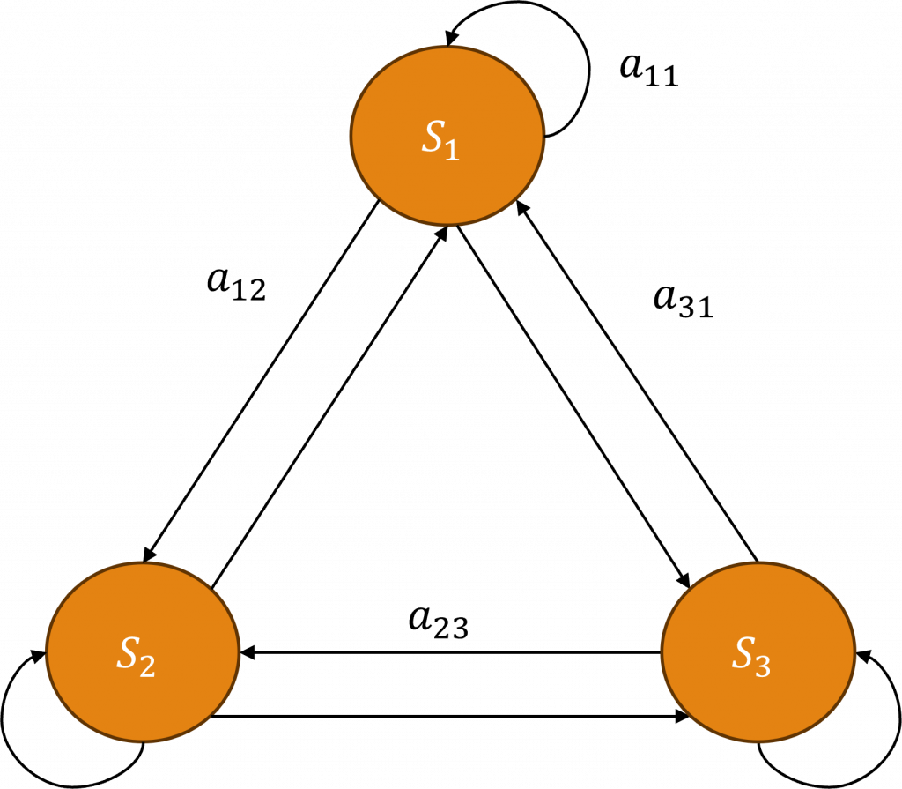

在隱藏式馬可夫模型中，我們將每一個文字稱之為`S`，並將連接兩個文字序列的稱為`a`，當進行文字處理時，該模型會發放出三個邊，其中包括自我連接`a11`、與下一個序列的連接`a12`以及與上一個序列的連接`a13`，這三個邊的總和將會等於1。

在演算的方式上，我們會隨機選擇一個狀態作為起點`S0~Sn`，然後按照設定的邊`a`進行移動，直到達到預先設定的最大步數，這樣我們便可以**計算每一條路徑的機率值**，擁有這個機率值後，我們能設定一個閾值，用來將可能文字路徑儲存下來。

雖然理論看起來相當簡單，可是實際上程式碼的應用稍微複雜一些，畢竟該演算法主要工作內容是計算出所有的路徑，並針對所有序列的概率進行估算，以從中找出最有可能的文字解析，因此還會衍生出更多的演算法，但這可能跟深度學習關聯性不大，在這裡我們只需瞭解該演算法的基本原理即可。

在實現程式碼的部分，Python中有個名為Jieba的中文斷詞函式庫，其可以幫助我們進行這些複雜的計算。在以下的程式中你將會看到，只需執行該段程式碼，就能輕鬆地完成斷詞工作。

```
# 需先執行pip install jieba

import jieba
text = "我喜歡自然語言處理"
seg_list = jieba.cut(text, HMM=True)
print("/".join(seg_list))
#---------------輸出------------
我/喜歡/自然/語言/處理
```

損失函數
----

我們在訓練模型時，使用了多種不同的損失函數來進行訓練，但對於剛開始學習這些知識的你，可能對於其用法並不十分理解，因此當時我並未深度講解，而現在我決定將我們使用過的所有損失函數進行整理並解析，並指出在哪些情況下需要使用這些損失函數。

### 二值交叉熵损失(Binary Cross-Entropy Loss, BCEloss)

`二值交叉熵損失（Binary Cross-Entropy Loss)`是一種針對**二分類問題**的損失函數，該函數主要對模型在二分類任務中的最後輸出結果進行評估，其計算方式如下：


在計算公式中，`y`是我們賦予模型的標籤，它通常是0或1，而`p`則是模型最終的輸出結果，常常會使用`sigmoid`函數來將其縮放至`0~1`的範圍內。當`y`等於1時，我們希望「`(p)`越接近1越好」，這對映的是公式`ylog(p)`;當`y`等於0時，我們則希望「`(p)`越接近0越好」，這對映的是公式`(1 - y)log(1 - p)`。透過這樣的調整方式，使`p`的數值能越來越接近實際的標籤數值。

### 交叉熵損失（CrossEntropyLoss）

`交叉熵損失（CrossEntropyLoss）`主要適用於分類任務，包含二分類與多分類，它常見於**多類別分類任務**中，交叉熵損失的基本概念是去評估模型預測輸出和標籤之間的差距，對於一個使用One-hot encoding編碼的樣本，交叉熵損失的計算是如下進行的：


此公式中我們進行了不同的類別機率的對比，通過`p(i)`以及`log(p(i))`的相乘，我們可以嚴懲預測機率和標籤`1`之間的差異，同時也對其他類別的預測機率與`0`之間進行處置，如果模型的預測趨近於真實標籤。

> 在Pytorch中，該公式已經內含了softmax與One-hot encoding的運算，因此針對我們的模型輸出，就不應該再進行softmax處理，以免產生計算上的錯誤。

### NLLLoss (Negative Log Likelihood Loss)

`NLLLoss (Negative Log Likelihood Loss)`與`交叉熵損失`都專門用於多類別分類任務且十分相似。不過NLLLoss的公式不需要進行One-hot encoding的轉換，所以在運算速度上會較快。

因此在處理輸出量大的情況時，我們通常會使用NLLLoss，該方法的計算原理非常直觀，它透過`-log`來衡量預測值與實際值之間的差距，透過這樣的方法，可以使數值更穩定，下列是它的計算公式:


> **小提示:**
> 
> `-log`是一種常用的方法，用來簡化機率分佈的變異數，當我們選擇使用對數概似函數作為損失函數，它可輕易的與其他損失函數進行對比及組合，以滿足不同問題的需求，因此在損失函數中常常會看到`-log`的身影。

激勵函數
----

我們先前已經介紹過許多激勵函數，所以你應該對此有基礎的認識了，而現在我將進一步地將這些函數可視化，並解釋它們的使用場合，但在開始之前我們需要先定義一個函數，讓我們能接收外部輸入的激勵函數公事以及x軸範圍為參數，以便進行可視化的動作。

```
def draw(x, label, activation):
    # 標題
    plt.title(f'{label} Function')
    # X Y軸名稱
    plt.xlabel('Input')
    plt.ylabel('Output')
    
    # 圖表大小
    plt.figure(figsize=(8, 6))
    
    # 繪製折線圖
    plt.plot(x, activation(x), label=label, color='b')
    
    # 格線樣式
    plt.axhline(0, color='black',linewidth=0.5)
    plt.axvline(0, color='black',linewidth=0.5)
    # 顯示格線
    plt.grid(True)
    plt.legend()
    plt.show()
```

### ReLU

ReLU函數的主要功能在於協助神經網路學習非線性關係，在處理複雜數據和任務時，這維度的重要性不言而喻，這原因可以歸結為`Wx+b`的最終計算結果均為線性，因此使用該函數能更破壞掉這種線性關係，使其更有效地產出接近實際狀態的輸出，讓我們一起看下方的公式：

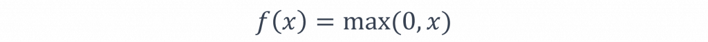

該公式代表著，當輸`x`大於零時ReLU函數傳回`x`本身，當`x`小於或等於`0`時ReLU返回`0`，這同時也代表著該神經元並不會被啟用，這種方式有助於神經網路進行**強化特徵和剔除特徵**的功能，該曲線我們可以透過以下程式來生成:

```
def relu(x):
    return np.maximum(0, x)
    
x = np.linspace(-5, 5, 100)
draw(x, 'ReLu', relu)
```

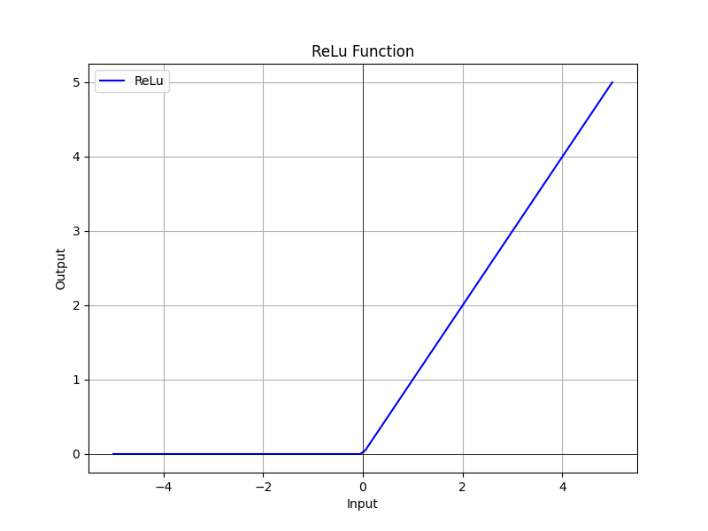

但這種方式也存在一些問題，當輸入為負數時，輸出平均值為零，於是會產生所謂的`死亡神經元問題(Dead ReLU Problem)`，也就是某些神經元可能永遠無法被激活，不過ReLU的效能仍然十分強大，因此仍然是神經網路中最常用的激活函數之一。

### Softmax

softmax的作用主要是將一組原始分數`z(i)`轉換成表示機率分佈，該函數能夠將每個`z(i)`轉換為介於0到1之間的機率值，並同時確保所有類別的機率總和等於1。

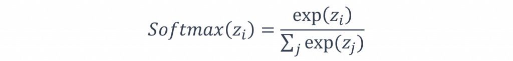

該公式我們有在[【Day 10】掌握文字翻譯的技術(中)-為何需要注意力機制](https://ithelp.ithome.com.tw/articles/10327536)中，曾經簡單提及過注意力分數的計算方式，其實現方式如下。

```
def softmax(x):
    e_x = np.exp(x - np.max(x))  
    return e_x / e_x.sum()
    
x = np.linspace(-5, 5, 100)
draw(x, 'Softmax', softmax)
```


### tanh

tanh函數的輸出範圍在`-1~1`之間，這表示對於任何實數輸入，輸出都會在這個範圍內，並且該函數**輸出均值為0**。這意味著當輸入接近`0`時，tanh的輸出接近`0`，所以它包含正負值的資料更具區分性(中心化性質)，所以該函數常見於時間序列模型中，作為計算資料機率分布的狀態，該曲線的公式如下。

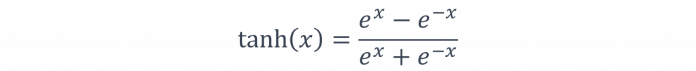

它通常被應用在神經網路的隱藏層，因`中心化`性質與`S曲線`的特色使其能夠處理各種資料分佈，進而解決一些梯度消失的問題，在許多情況下它被認為是sigmoid函數的替代選擇，以下是該曲線的實現方式：

```
def tanh(x):
    return np.tanh(x)
    
x = np.linspace(-5, 5, 100)
draw(x, 'tanh', tanh)
```


### sigmoid

Sigmoid函數的輸出範圍介於`0~1`之間，這對於處理**二元分類問題極為實用**，因為我們可以將該**輸出直接作為機率值**，同時Sigmoid是一種平滑曲線函數，意味著它在整個輸入範圍內都可以連續求導，此特性對於梯度下降等最佳化演算法的運作非常重要，其數學函數公式如下：

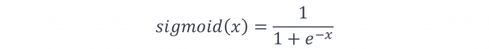

Sigmoid也有一些缺點，其中一個主要問題是**當輸入遠離零時，梯度會接近於零**，這與ReLU所造成的問題相同，因此他也會產生梯度消失問題，其實現曲線的方式如下:

```
def sigmoid(x):
    return 1 / (1 + np.exp(-x))
    
x = np.linspace(-5, 5, 100)
draw(x, 'Sigmoid', sigmoid)
```


從以上的激勵函數中，我們可以瞭解到雖然不同的激勵函數對應的動作各有所異，並也都存在各自的優缺點，因此在設計神經網路時，我們必須考慮這些函數的特性，並進行實驗以決定什麼樣的設計最合理才是最正常的模型設計方式。

後話
--

這次我將介紹了一些在深度學習中至關重要但之前未提及的概念和技術，深入理解這些內容對於掌握神經網路的調整與訓練過程十分關鍵，如果你已經掌握了我們到目前為止所學習的內容，那麼對於當下市面上的自然語言處理模型，你應有一定程度的認識，不過你還需要進一步強化模型訓練策略，所以我將會陸續介紹一些在自然語言處理領域中，市場上的經典模型。

那麼我們明天再見！

內容中的程式碼都能從我的GitHub上取得:

[https://github.com/AUSTIN2526/iThome2023-learn-NLP-in-30-days](https://github.com/AUSTIN2526/iThome2023-learn-NLP-in-30-days)

---

<a id="6669-day-13"></a>

## Day 13｜【Day 13】預訓練模型的強大之處? 我們要怎麼使用它?

- 原文：https://ithelp.ithome.com.tw/articles/10330137
- 發佈時間：2023-09-28 21:48:33

前言
--

現在許多企業都不是從零開始訓練模型，而是使用大型企業提供的`預訓練模型(pre-trained model)`以實現企業自身的目標，而在這個步驟中，接著他們會`微調(Fine-tune)`這些模型，讓模型的權重更適合自身的具體需求，在今日的學習內容中，我們主要探討的就是以下幾個主題:

1.   理解`遷移學習(Transfer Learning)`的原理
2.   `源資料(Source Data)`與`源模型(Source Model)`的用處
3.   `目標資料(Target Data)`與`目標模型(Target Model)`的用途

預訓練模型(Pre-trained Model)
------------------------

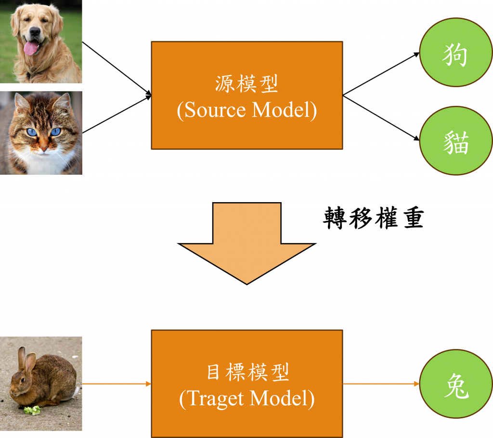

`預訓練模型（Pre-trained Model）`通常是由大型數據集上的大量訓練過程得來，這個動作讓模型已經初步掌握了豐富的語言或圖像特徵，並且該模型在訓練期間常會透過一些特殊訓練策略使模型更能應對後續的調整或目標。

而這種訓練方法也被稱為`遷移學習(Transfer Learning)`，我們可以將遷移式學習分為兩大部分：`源模型(Source Model)/源資料(Source Data)`和`目標模型(Target Model)/目標資料(Target Data)`。

預訓練階段(源模型/源資料)
--------------

在預訓練階段，強大的模型架構（源模型）通常被頂尖的資料科學家們所開發，並在大量的資料集（源資料）上進行訓練，這個過程通常需要消耗非常多的電腦資料並且該步驟非常耗時，我們在[【Day 11】掌握文字翻譯的技術（下）-英法語言翻譯模型](https://ithelp.ithome.com.tw/articles/10328763)這篇文章中，僅用MB級別的資料以及一個較為複雜的神經網路就已經花去了許多時間，對於搭載有RTX 3090與i9第10代處理器的電腦來說，這樣的訓練過程大概需要50分鐘。

但當我們以GPT3(ChatGPT的老祖宗)這類`大型語言模型（Large Language Model, LLM)`來看，其模型參數量大約是我們模型的16500倍，資料集的大小更擁有上萬倍以上的差距，若我們只用一張顯卡來進行訓練，就有可能需要好幾百年才能完成，因此這種類型的模型訓練，通常需要用到多張GPU或TPU，以GPT-3為例，OpenAI訓練過程使用了10000張A100顯卡，但即便如此卻還是需要大約15天的時間完成訓練，所以訓練這種大型模型通常只有頂尖的科學家與公司能力所及。

那麼使用大量的資料與模型來進行訓練的目的到底是什麼呢?你可以將模型想像成一個箱子當參數量越大時，模型的「箱子」就越大。而我們所設計的模型架構，則可以被想像成「箱子內部的配置」。當這個配置越合理，我們就能更有效地利用和理解這些資料，所以**增加模型的參數量和優化其結構**是深度學習模型上兩個相當重要的部分。

> **小提示:**
> 
> 除了模型與資料之外，預訓練模型在訓練過程中的策略也佔有重要之地，這一點我將在後續的內容中逐步詳述，讓你能夠理解這些模型的訓練方式是如何形成的。

微調階段(目標模型/目標資料)
---------------

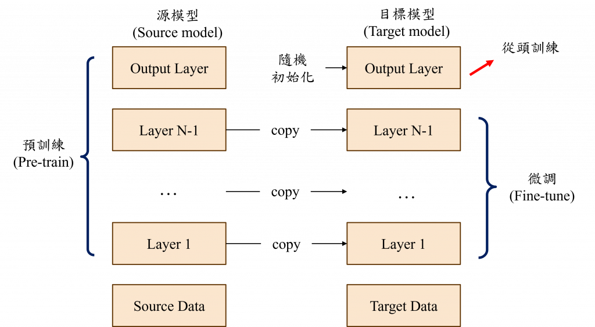

> 圖片來源:[從零開始的AI程式設計養成之路](https://www.tenlong.com.tw/products/9786263336025?list_name=r-zh_tw) 作者:我自己

當源模型完成訓練後，許多公司會選擇將其開源，例如 「Google 的 BERT」、「OpenAI 的 GPT-J」，以及 「Facebook 的 Llama2」，這些都會被稱為預訓練模型，簡單來說預訓練模型就是是透過大型資料訓練一個模型來獲得豐富的特徵，然後再進行第二次的訓練，因此在這個階段我們通常需要做的工作就是對模型進行`微調（Fine-tune）`。那為何我們稱預訓練模型的這一步驟為微調，而非訓練呢？原因在於原始資料量通常是目標資料量的上千倍，這意味著當我們為模型提供目標資料時，模型只會對權重作微小的調整，其影響就好比在大海中加入幾滴自來水，基本上並不會引起太大變化。

但微調的效果自然有其限制，當模型使用**源資料訓練時所對應到的標籤並不涵蓋我們目標資料所需的標籤**，那麼無論我們如何努力訓練，都無法有效調整模型的權重，所以通常情況下，我們會直接將最後一層的**輸出層權重進行隨機初始化**，這樣一來當我們的目標資料輸入給模型時，可以透過前幾層的特徵進行判斷並**大幅調整輸出層的結果**，這種方式好比我們已經學習到了許多動物的特徵，但遇到新的動物，我們就會通過以前學習到的這些特徵來形容這個新動物，從而理解這個動物的真實樣貌。

後話
--

現在你已經了解預訓練模型和自主訓練模型的差異，因此在後續的內容中，我將逐步告訴你自然語言處理領域中，有那些具有劃時代意義的預訓練模型，並深入介紹他們如何實行強大且有效的訓練策略，這一點是我們學習自然語言處理不可或缺的一部分，因為許多預訓練策略不僅僅只用在預訓練階段，而是被大量運用在自然語言任務中，因此掌握這些策略能夠在我們開發自己的模型時，提供極佳的參考價值。

那麼我們明天再見！

內容中的程式碼都能從我的GitHub上取得:

[https://github.com/AUSTIN2526/iThome2023-learn-NLP-in-30-days](https://github.com/AUSTIN2526/iThome2023-learn-NLP-in-30-days)

---

<a id="6669-day-14"></a>

## Day 14｜​【Day 14】​解析詞嵌入預訓練模型的奧秘(上)-深度探索Word2Vec的奧妙之處

- 原文：https://ithelp.ithome.com.tw/articles/10330450

前言
--

我們之前有學過要訓練一個優質的自然語言處理模型，必須打造出一個良好的詞嵌入向量，因此在今天的文章裡，我將為你介紹`Word2Vec`預訓練模型的訓練原理以及其模型架構在Pytorch中的實現方法，當然我們不是直接呼叫的函式庫而是手動的將模型給建構出來這樣子就能夠加深你對這模型的理解度我們今天的學習重點如下:

1.   學習`Word2Vec`的基礎理論
2.   實現`Skip-gram`與`CBOW`
3.   理解`Word2Vec`所產生的問題

Word2Vec是一種將**單個詞彙轉換為連續向量**的詞嵌入技術，其目的是更有效地捕捉詞彙之間的語義相似度。這種技術與我們先前使用的時間序列模型有所不同。在我們過去的方法中，我們嘗試透過某一方向的文字推斷下一個的文字，而Word2Vec則採用了`Skip-gram`或`CBOW`兩種方法，這些方法都能使詞嵌入層能夠學習到從**詞彙中心擴散出的文字機率**，從而產生出一個更完整的詞嵌入，接下來我們將詳細探討這兩種方法的實現方式。

Skip-gram
---------


`Skip-gram`的目標是根據**特定詞彙來預測上下文詞彙機率**，該模型的運作方式是先輸入一個目標詞彙`t(i)`，然後輸出與該詞彙上下文`c(i±j)`相關的詞彙機率，並且學習到最大化上下文的機率，這可以用以下的公式來表示：


整體的模型架構與我們先前的相比，實際上非常簡單，我們只需建立兩個詞嵌入層，來轉換目標詞彙與其詞彙上下文，第一個詞嵌入層負責將`t(i)`轉換為`t'(i)`，而第二個則負責將`c(i±j)`轉換為`c(i±j)`，此時我們只需計算這兩個詞嵌入層之間的機率即可。


`score()`的計算方式與注意力機制相同有非常多種算法，這些算法的只要能結合兩者之間的訊息並計算出機率，都可以被適用作為`score()`的算法，在這裡我將列舉三種常見的方法：


我相信你學習了關於注意力機制的算法後，應能理解上述這三個公式在Pytorch中的實現方式，然而為了讓你有更深入的理解，我將通過以下程式碼詳細介紹如何構建這些公式，程式碼中的`return`對應的是整個詞彙表中的機率，而標籤為1代表該詞彙存在於上下文中反之則為0，例如當標籤是`[0, 1, 1]`，輸出可能為`[0, 0.8, 0.4]`，如此一來就可以透過損失函數計算損失了。

(1) 加總方式

```
class SkipGram(nn.Module):
    def __init__(self, vocab_size, embed_size):
        super().__init__()
        self.emb_in = nn.Embedding(vocab_size, embed_size)
        self.emb_out = nn.Embedding(vocab_size, embed_size)
        self.in = nn.Linear(embed_size, output)
        self.out = nn.Linear(embed_size, output)
        
    def forward(self, target, context)
        in_embeds = self.in_embedding(target)
        out_embeds = self.out_embedding(context)
        
        return self.in(in_embeds) + self.out(out_embeds)
```

(2) 相乘方式

```
class SkipGram(nn.Module):
    def __init__(self, vocab_size, embed_size):
        super().__init__()
        self.emb_in = nn.Embedding(vocab_size, embed_size)
        self.emb_out = nn.Embedding(vocab_size, embed_size)
       
    def forward(self, target, context)
        in_embeds = self.in_embedding(target)
        out_embeds = self.out_embedding(context)
        
        return torch.matmul(in_embeds, out_embeds.t())
```

(3) 機率計算方式

```
class SkipGram(nn.Module):
    def __init__(self, vocab_size, embed_size):
        super().__init__()
        self.emb_in = nn.Embedding(vocab_size, embed_size)
        self.emb_out = nn.Embedding(vocab_size, embed_size)
        
    def forward(self, target, context)
        in_embeds = self.in_embedding(target)
        out_embeds = self.out_embedding(context)
        matmul_emb = torch.matmul(in_embeds, out_embeds.t())
        
        return F.softmax(matmul_emb, dim = 1)
```

透過上述的方法，我們就能讓這些文字學習到目標文字周遭的關聯性。

CBOW(Continuous Bag of Words)
-----------------------------

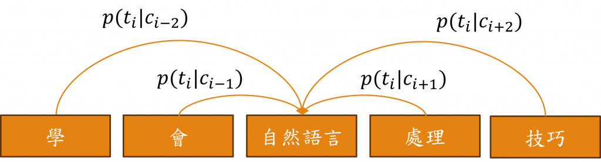

`CBOW(Continuous Bag of Words)`和Skip-gram是相反的方法，CBOW是基於**上下文來預測目標詞彙**，換句話說，Skip-gram是通過對每個上下文`t(i)`進行規划以導出`c(i±j)`的機率，而CBOW則是由`c(i±j)`反推出`t(i)`的機率，因此對於每個機率我們可以如此表示:

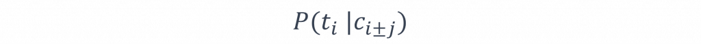

與Skip-gram不同的是因Skip-gram需要從`t(i)`中比對`c(i±j)`的機率，所以需要將兩者訊息拼接後計算出最後的機率，但CBOW的作法則相反因為我們只需要取得`c(i±j)`整體的語義資訊即可作為`score()`的計算公式，這邊我也簡單的舉出三種作法。


同樣的我們將以上的結果透過Pytorch將其實現出來，已加深你對該公式的印象。

(1) 加總方式

```
class CBOWModel(nn.Module):
    def __init__(self, vocab_size, embedding_dim):
        super().__init__()
        self.embeddings = nn.Embedding(vocab_size, embedding_dim)
        self.linear = nn.Linear(embedding_dim, vocab_size)

    def forward(self, context):
        embedded = self.embeddings(context)
        summed = torch.sum(embedded, dim=1)
        output = self.linear(summed)
        return output
```

(2) 平均方式

```
class CBOWModel(nn.Module):
    def __init__(self, vocab_size, embedding_dim):
        super().__init__()
        self.embeddings = nn.Embedding(vocab_size, embedding_dim)
        self.linear = nn.Linear(embedding_dim, vocab_size)

    def forward(self, context):
        embedded = self.embeddings(context)
        embedded_avg = torch.mean(embedded, dim=1)
        output = self.linear(embedded_avg)
        return output
```

(3) 機率計算方式

```
class CBOWModel(nn.Module):
    def __init__(self, vocab_size, embedding_dim, context_size):
        super().__init__()
        self.embeddings = nn.Embedding(vocab_size, embedding_dim)
        self.linear = nn.Linear(embedding_dim, vocab_size)
        self.context_size = context_size

    def forward(self, context):
        embedded = self.embeddings(context)
        embedded_avg = embedded.mean(dim=1)
        output = self.linear(embedded_avg)
        return F.softmax(output, dim=1)
```

這兩種方法各有其優劣如word2vec的作者Mikolov所述，Skip-gram能有效處理較少數量的數據，並且能更好地表達罕見的詞語。然而CBOW的計算速度卻更迅速，並且對於頻繁出現的詞語具有更佳的表達能力。

> **小提示:**
> 
> Skip-gram的方法由於是基於少數推理大部分的思考方式，因此輸入的特徵訊息相對較少，相反地CBOW則是從大量資訊推理細節，因此它需要的輸入訊息相對較多，這也使得CBOW可以更好地獲得並理解文字周遭的情境訊息

而模型相較於現今的預訓練模型相比擁有較為簡單的結構，這是因為該模型出自2013年，當時的電腦設備並不如現今強大，因此我們現在仍有訓練出Word2Vec的可能性，而使用這種類型的預訓練模型時，我們主要會將其詞嵌入向量，取代我們自身的詞嵌入層，並對模型進行微調訓練，已取得一個更好的結果。

不過Word2Vec在句子中**忽視了詞彙的順序信息**，僅依據詞彙在文本語料庫中的共現頻率來學習詞向量，這樣的方式使得所有詞彙被視為具有相同的語義，導致在處理多意詞的效果上相較於時間序列模型表現較差，因此這也使後續的人針對這些問題對Word2Vec模型進行改良。

後話
--

今天我主要講解了Word2Vec這個詞嵌入預訓練模型，而在這次的主題中我將主要闡述三種不同的詞嵌入預訓練模型，並在最後的部分透過實際任務，比較這三種模型的效能。因此內容將會分為（上）、（中）、（下）、（末）四個環節，其中（末）的章節中將會是一系列的程式學習環節，明天我將會告訴你另一個詞嵌入預訓練模型GloVe的特性與原理。

那麼我們明天再見！

內容中的程式碼都能從我的GitHub上取得:

[https://github.com/AUSTIN2526/iThome2023-learn-NLP-in-30-days](https://github.com/AUSTIN2526/iThome2023-learn-NLP-in-30-days)

---

<a id="6669-day-15"></a>

## Day 15｜​【Day 15】​解析詞嵌入預訓練模型的奧秘(中)-全域統計的重要性GloVe技術解析

- 原文：https://ithelp.ithome.com.tw/articles/10331153
- 發佈時間：2023-09-30 19:49:08

前言
--

我們昨天提到，Word2Vec在分析句子時忽視了詞彙的順序信息，這是因為它並未考慮到整體詞彙的訊息而僅集中於局部，並且我們在講解Seq2Seq+Attention的階段，也曾經提到這種問題。

你可能會問為什麼這些方式都沒有考慮這些問題呢？其實原因很簡單，通常只考慮局部解的方法就能創造出大多數的有效演算法，然而全域解的產生往往是在優化這些局部解的基礎上得出的，所以今天我將會介紹優化Word2Vec的預訓練模型GloVe。

1.   `Glove`介紹與實踐
2.   `共現矩陣(Co-occurrence Matrix)`的建構
3.   Glove損失函數的建構過程

Glove
-----

`Glove（Global Vectors for Word Representation）`是由史丹佛大學的研究團隊開發的詞嵌入技術，它透過統計大規模文本語料庫中詞彙之間的共現關係來學習詞嵌入層的權重，它的建立思想源自源我們先前所提及的Word2Vec還有將`文件詞項矩陣(Document-term matrix)`的SVD分解法，透過將這兩種方式進行結合與改良，使其能提升捕獲語義關係的能力，Glove的主要工作階段可以分為兩部份：共現矩陣的建立以及最佳化目標，接下來我將為你詳細介紹這兩項工作階段的原理。

> **小提示:**
> 
> 文件詞項矩陣是一種根據詞彙的出現頻率與詞彙的逆向檔案頻率（TF-IDF）所產生的矩陣，該方法透過將詞彙與其逆向檔案頻率進行計算從而得出詞彙的加權指數，而對其進行SVD分解的主要目的是將文件詞項矩陣進行降維處理，已提取區該矩陣中的詞彙特徵，該方法也是一種全局特徵的矩陣分解方法

共現矩陣的建立
-------

在我們昨天探討`t(i)`與`t(j)`兩個字之間的關係時，是通過統計兩者附近相關訊息的方式進行的，然而正如我們昨日所提，這種方法難以解決一字多義的問題。因此GloVe依此進行了一些改良，它將數據輸入的計算不再依賴於單個詞彙，而是依賴於`t(i)`與`t(j)`的共現矩陣，使其更有助於考慮全域特徵，因此在第一步我們需要進行將詞換轉換成共現矩陣的動作，其詳細方式如下方的程式碼所示:

```python
import numpy as np

# 1. 建立詞彙表
corpus = ["I like to play soccer", "Soccer is a fun sport", "I enjoy playing soccer"]
words = ' '.join(corpus).split()
vocab = list(set(words))

# 2. 初始化共現矩陣
co_occurrence_matrix = np.zeros((len(vocab), len(vocab)))

# 3. 定義前後窗口
window_size = 2

# 4. 計算數值並更新共現矩陣
for sentence in corpus:
    tokens = sentence.split()
    for i in range(len(tokens)):
        for j in range(max(0, i - window_size), min(len(tokens), i + window_size + 1)):
            if i != j:
                word_i, word_j = tokens[i], tokens[j]
                if word_i in vocab and word_j in vocab:
                    index_i, index_j = vocab.index(word_i), vocab.index(word_j)
                    co_occurrence_matrix[index_i][index_j] += 1

print(co_occurrence_matrix)
```

在上述程式碼中我們首先遍覽所有詞彙，並設定一個`window_size`用於記錄**該詞彙前後文的出現次數**，接下來透過這種方式統計不斷的加總結果並紀錄到共現矩陣中，當我們完成共現矩陣的建立時，就能夠找到第`i`個詞彙與第`j`個詞彙的共現次數。

最佳化目標
-----

在優化目標的過程中，該模型採用了一種全新的損失函數，具體操作方法是隨機抽取一個詞彙樣本`k`，並計算它和目標詞彙`t(i)`以及`t(j)`的關聯。

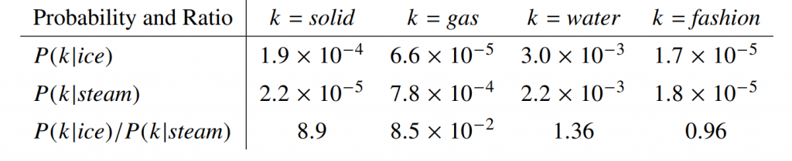

> 出自於:[GloVe論文](https://nlp.stanford.edu/pubs/glove.pdf)

我們以圖片中的solid(堅硬的)、gas(氣體)、water(水)及fashion(時尚)為例，分析它們與ice(冰)、steam(蒸氣)的詞頻關係，而我們能發現若詞彙`k`的關聯性數值與目標詞彙`t(i)`和`t(j)`數值較高，那麼該詞的則能作為第三方指標進行評估。

基於這原因我們可以計算`P(k|t(i))`與`P(k|t(j))`的比值，如果這比值接近於1，則代表詞彙`k`與`t(i)`和`t(j)`有正關聯或沒有關聯;反之如果比值遠超過1，則`k`可能與其中一個目標詞彙有較強的相關性，因此在進行模型訓練時，我們可以使用以下公式來表示這些文字的權重。


不過在上述的步驟中這些權重都是由`k`決定的，並且該方式無法在目標詞彙`t(i)`與`t(j)`之間形成明顯的線性關係，而一個有效的詞嵌入向量應當讓**相似度越高的詞彙向量越接近，而相似度較低的則相對疏遠**，但這種方法只考慮了與`k`的關係，卻忽視了`t(i)`和`t(j)`之間的線性關係，因此為了在這兩者間形成線性關係，論文中採用了以下的公式：


而在這公式中我們讓`w(i)-w(j)`使其能夠計算出兩者之間的距離，若`w(i) > w(j)`整體的向量空間會傾向於正軸移動，反之如果`w(i) < w(j)`則會向負軸移動，其中`w(k)`主要控制這兩種情況下**目標詞彙間的移動距離**，進而影響整體的向量空間

此外而在這個公式還有一個特別的地方就是它具有指數特性，因此基於這點我們可以如下表達該函數：


而在上述的公式中我們將會發現去掉`log(X(i))`後，該函式將會顯現出對稱性，其中`log(X(i))`因與`k`無關，因此我們可以將`log(X(i))`這一個定值轉換到`w(i)`的偏移量`b(i)`中，最後我們只需補上`w(k)`的對應偏移量`b(k)`，便可以完成整個損失函數的設計。


> **小提示:**
> 
> log(X(i))能被轉入到偏移量b(i)中，這是由於X(i)和b(i)都是固定值。X(i)代表著我們的輸入，因此不會變動，其次b(i)是模型的偏移量，此值是模型的選擇條件，如同我們在經濟拮据的時候，我們會選擇較為價廉的餐廳，而b(i)就是模擬出這種拮据狀況的條件。

那麼在程式中該怎麼設計呢?在這邊我幫你把整個GloVe的模型用Pytorch重現出來了，我們可以看到以下的程式結果

```scss
class GloVe(nn.Module):
    def __init__(self, vocab_size, embedding_dim):
        super().__init__()
        self.embeddings = nn.Embedding(vocab_size, embedding_dim)
        self.bias_target = nn.Embedding(vocab_size, 1)
        self.bias_context = nn.Embedding(vocab_size, 1)

    def forward(self, target, context):
        embed_target = self.embeddings(target)
        embed_context = self.embeddings(context)
        bias_target = self.bias_target(target).squeeze()
        bias_context = self.bias_context(context).squeeze()
        
        dot_product = torch.sum(embed_target * embed_context, dim=1)
        log_co_occurrences = torch.log(co_occurrence_matrix[target, context]) 
        loss = torch.mean((dot_product + bias_target + bias_context - log_co_occurrences))
        return loss
        

co_occurrence_matrix = torch.LongTensor([[0, 0, 1, 0, 1],
                                  [0, 0, 0, 1, 0],
                                  [1, 0, 0, 1, 1],
                                  [0, 1, 1, 0, 0],
                                  [1, 0, 1, 0, 0]])

vocab_size = co_occurrence_matrix.shape[0]
model = GloVe(vocab_size, embedding_dim)
target, context = np.where(co_occurrence_matrix > 0)
model(target, context)
```

在以上程式中，我們使用`self.embeddings`來表示`w(i)`和`w(k)`，這樣做的原因是我們向模型提供的是一個共現矩陣，至於該模型的偏移量`b(i)`和`b(k)`，我們分別使用了`bias_target`和`bias_context`來表示，最後我們透過`sum()`來將將`i`和`k`向量的信息重新整合，這時就能夠透過GloVe的損失函數進行計算，使其能夠達到最佳化目標值。

後話
--

從程式設計的角度來看，GloVe所做的事情其實非常簡單，就是將輸入變成了共現矩陣，但也因為這樣我們必須考慮不同的損失函數計算方式，為此GloVe利用了第三個詞彙`k`來調整共現矩陣的資料分布，由此兩點疊加使能考慮到全面的訊息，不過這種方法有當然也有缺點，就是無法理解資料的詞性，所以我將在明天介紹另一種詞嵌入的預訓練模型，以理解文字中的詞性。

那麼我們明天再見！

內容中的程式碼都能從我的GitHub上取得:

[https://github.com/AUSTIN2526/iThome2023-learn-NLP-in-30-days](https://github.com/AUSTIN2526/iThome2023-learn-NLP-in-30-days)

---

<a id="6669-day-16"></a>

## Day 16｜【Day 16】解析詞嵌入預訓練模型的奧秘(下)-fastText中Subword建立的重要性

- 原文：https://ithelp.ithome.com.tw/articles/10332218
- 發佈時間：2023-10-01 21:13:03

前言
--

今天我們將結束對詞嵌入預訓練模型理論的討論，在前面的幾天中你可能會發現範例程式碼中，有些部分和公式有所出入，這是因為這些詞嵌入預訓練模型原本並非「深度學習」模型，而是屬於「機器學習」的範疇，並且最一開始是採用`非監督式學習(Unsupervised Learning)`來進行任務，也就是在無標籤的情況下進行學習。不過這些技術已被廣泛運用於「深度學習」的詞嵌入層中，因此我採取了一些方法將其轉換成深度學習模型。

那為何要這樣做呢？因為我們可以運用這些已經被訓練過的詞嵌入預訓練模型，並通過**時間序列模型來更全面地調整這些文字的權重**。而今天我們將會學習這些詞嵌入預訓練模型的最後一項重要技術`fastText`，今天的學習重點如下:

1.   理解`子詞（Subword）`的建立方式
2.   理解`子詞（Subword）`的向量合併方法
3.   學習`層次Softmax（Hierarchical Softmax）`的原理

fastText
--------

相較於我們前幾天所講解的兩種詞嵌入預訓練模型，FastText的效能表現出類拔萃，它是基於Word2Vec中的CBOW方法進行變化的方法，使其不僅考慮每個字的上下文訊息，還能分析詞彙內部的`子詞（Subword）`訊息，因為這樣的設計FastText能夠理解並處理詞彙中的詞綴，對於**處理稀有詞彙或罕見詞彙**也有極其出色的表現，所以這項技術非常適合處理特定領域的文本或高度專業化的任務，而它的主要技術特點包括了`子詞嵌入（Subword Embeddings）`和`層次Softmax（Hierarchical Softmax）`。

### 子詞嵌入（Subword Embeddings）

在Word2Vec與GloVe的模型中，我們都是透過滑動一個視窗來找尋文字的前後詞彙，這種動作的專有名詞叫做`N-Gram`，它這是語言模型的一種演算法，其基本概念是按照文字內容的位元組順序進行大小為N的滑動視窗操作，最終生成長度為N的位元組片段序列。

而在模型fastText中就會先對**每一個詞彙**進行N-gram的切割，然後將其放入到詞嵌入向量空間中，我們可以先看到以下的簡易程式碼:

```sql
def create_subwords(word, min_length=3):
    subwords = []
    length = len(word)
    
    for start in range(length):
        for end in range(start + min_length, length + 1):
            subword = word[start:end]
            subwords.append(subword)
    subwords[0] = "<" + subwords[0]
    subwords[-1]= subwords[-1]+ ">" 
    
    return subwords

word = "apple"
subwords = create_subwords(word)
print(subwords)
#----------------輸出----------------
['<app', 'appl', 'apple', 'ppl', 'pple', 'ple>']
```

在上述的程式碼中，我們可以看到`<`代表文字的開頭，而`>`代表文字的結尾，而在fastText模型中`apple`這個詞彙的向量表達就是這六個詞彙向量的整合（我們可以透過torch.mean來整合向量訊息），當然在實際模型運作中，詞彙的切割方式可能會更加繁複，這裡我們只是提供一個簡化的範例程式。

### 層次Softmax（Hierarchical Softmax）

我們先前所使用的Softmax需要透過不斷的迭代計算出每一個結果的機率，導致在計算效率上極度緩慢，其時間複雜度達到`O(N)`，然而在fastText中，它選擇使用`層次Softmax（Hierarchical Softmax）`的方式來將時間複雜度降至`O(logN)`，而能讓它降低複雜度的方法就是透過`霍夫曼樹（Huffman Tree）`來找出每個解的最短路徑，現在讓我們來看看這種方式的具體操作。

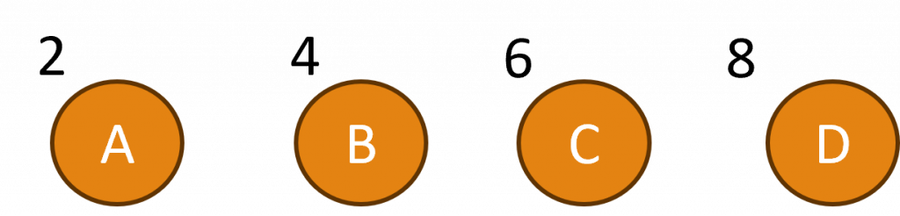

假設我們有一個向量`z`，包含四個類別(葉節點)`N`，而每一個類別都有其對應的權重資訊。

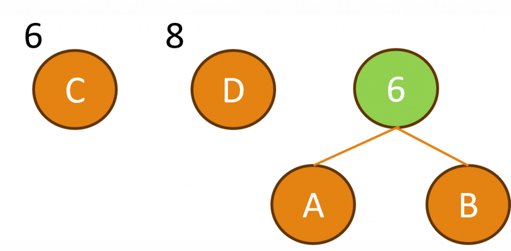

接下來我們將運用霍夫曼樹來建立一個二元樹結構，在此過程中會將**兩個最小的葉節點N合併成一個新的內部節點**，而這個新節點的權重將等於原先兩個葉節點的權重相加。


接下來不斷的重複這個合併的過程直到所有節點都被合併完畢，當樹建立完畢後我們將右節點編號作為1，左節點編號作為0，藉此建立了一個霍夫曼樹的結構。

而我們對於層次Softmax需要計算從根節點到每個葉節點的路徑機率，當計算到達葉節點的機率時，就代表得出了一個特定的類別，我們可以使用以下公式來進行計算：

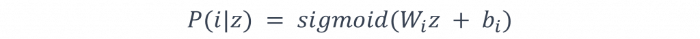

在這個公式中我們首先將向量`z`與每個內部節點的權重`W(i)`進行內積運算，然後將結果通過Sigmoid函數`σ`，來將其轉換為範圍在`0~1`之間的機率值，**根據這個機率值，我們便可以決定是選擇左子節點或是右子節點**，而我們會持續這樣的操作，直到到達葉節點為止，最終則會輸出該葉節點所對應的類別機率。

這也就是層次Softmax的運作原理，簡單來說它就是透過利用霍夫曼樹的結構，來降低計算時間的複雜度，以簡化多類別分類的計算過程，以下是該方法程式碼實作的實際結果：

```python
class HierarchicalSoftmax(nn.Module):
    def __init__(self, input_size, num_classes):
        super(HierarchicalSoftmax, self).__init__()
        self.num_classes = num_classes
        self.tree = self.build_tree(input_size)

    def build_tree(self, input_size):
        tree = nn.ModuleList()
        for i in range(self.num_classes):
            tree.append(nn.Sequential(
                nn.Linear(input_size, 1),  
                nn.Sigmoid(),
            ))
        return tree

    def forward(self, x):
        outputs = []
        for i in range(self.num_classes):
            output = self.tree[i](x)
            outputs.append(output)
        return torch.cat(outputs, dim=1)
```

在上述程式碼中，因建立一個葉節點需要知道模型的輸出大小，但我們不確定模型的輸出大小，因此我們可以使用`ModuleList()`來動態建立葉節點，而整體計算過程相單簡單，我們只需分別針對各類別使用不同的`σ(W(i)z+b)`進行計算，並將計算結果存入`outputs`串列中，最後將這些串列結合，就能代表每個葉節點的機率。

後話
--

你是否發現FastText的算法看起來比其他兩種更簡單一些呢？這是因為FastText的出現時間要晚於Word2Vec和GloVe，（分別是在2016年、2013年及2014年），較晚的發展給FastText帶來了一個優勢，就是可以直接以深度學習的角度來進行計算，因此與基於機器學習的Word2Vec和GloVe相比它的算法公式更為精簡，如果你想深入瞭解如何簡化Word2Vec和GloVe的公式，你可以參考我過去寫的程式碼，那裡有詳細地實現了用深度學習方法簡化複雜機器學習公式的過程，明天我將正式比較這三種模型的效能差異。

那麼我們明天再見！

內容中的程式碼都能從我的GitHub上取得:

[https://github.com/AUSTIN2526/iThome2023-learn-NLP-in-30-days](https://github.com/AUSTIN2526/iThome2023-learn-NLP-in-30-days)

---

<a id="6669-day-17"></a>

## Day 17｜【Day 17】解析詞嵌入預訓練模型的奧秘(終)-利用預先訓練的詞嵌入來保護隱私

- 原文：https://ithelp.ithome.com.tw/articles/10332582

前言
--

首先我要為你們先打好預防針，因為今天的程式碼量非常龐大，這次我們將會一次性地處理Word2Vec、FastText、GloVe各模型的文字前處理方式，並且今天進行對文本資料的去識別化(De-identification)的動作，在該動作中我們需學習以下的知識。

1.   `去識別化(De-identification)`的程式建構方式
2.   `B-I-O`標籤理解與使用
3.   預訓練詞嵌入權重微調與載入

去識別化(De-identification)
-----------------------

`去識別化（De-identification）`是一種技術，主要用來去除文章中可能會識別出個人身份的資訊，此技術的目的在於，確保資料在分享或分析時，不會被聯想到特定的組織、人名、或者地址等資訊，這樣的過程可以保護資料主體的隱私權，讓研究、分析和數據工作能在不洩露個人身份的情況下進行。這種技術通常會使用的方法，叫做B-I-O標籤。這種方案將文本序列中的每一個詞語都劃分為三個類別：B（開始）、I（內部）、O（其他），B標籤一般用於標示實體的開始，I標籤用於接續該實體的部分，而完全不相關的部分則會分類為O。而今天我們將會使用[CoNLL-2003](https://data.deepai.org/conll2003.zip)這一個去識別化資料集來進行比對，我們先來看看以下步驟:

### 【STEP 1】載入資料集

當我們下載CoNLL-2003這一個資料後應該會有`train.txt`、`valid.txt`、`test.txt`這三個資料集，而每一份檔案應該都會跟下述格式相似:

```
SOCCER NN B-NP O
- : O O
JAPAN NNP B-NP B-LOC
GET VB B-VP O
LUCKY NNP B-NP O
WIN NNP I-NP O
, , O O
CHINA NNP B-NP B-PER
IN IN B-PP O
SURPRISE DT B-NP O
DEFEAT NN I-NP O
```

首先讓我們慢慢解析這些資料的格式，在這份資料集的首行`SOCCER NN B-NP O`，我們可以看到註記了一個詞彙`SOCCER`，而在該詞彙後方的部分則表示該詞彙相關的實體註記，例如:`名詞 (NN)` 、`名詞片語 (B-NP)`，其中`O` 代表這並非一個命名實體。

而在這次的程式實作中，我們需要的是最後一部分的標記，舉例來說第三行的`JAPAN NNP B-NP B-LOC`，我們只需要`JAPAN`作為輸入`B-LOC(地點)`作為標籤即可，所以在這裡我們可以撰寫一個簡單的函式將這些結果拆分開來。

```
def load_data(file_path):
    sentences, labels = [], []
    sentence, label = [], []
    with open(file_path, 'r', encoding='utf-8') as file:
        for line in file:
            if not line.strip():
                if sentence and label:
                    sentences.append(sentence)
                    labels.append(label)
                sentence, label = [], []
            else:
                parts = line.strip().split()

                sentence.append(parts[0])
                label.append(parts[-1])
    
    return sentences, labels
```

在該程式中我們首先將每個資料讀進來，並將**每個標籤與對應的文字內容儲存起來**，而該資料集的每一段句子都設定用`\n`來做分隔，因此我們需要建立兩個暫存串列`sentence`和`label`來處理這部分，這樣每當碰到`\n`符號時，我們就將這兩個暫存串列的內容分別放入到完整的串列`sentences`和`labels`中。

### 【STEP 2-1】資料前處理(非預訓練)

因為我們這次需比較4個模型的優劣，因此會用到2種不同的前處理架構，而第一種前處理架構是不經過預訓練模型的資料進行，在這裡同樣的可以使用我們的TorchText函式庫進行處理。這裡的處理方式與先前相同，直接使用`Counter`進行計數後，交付給`vocab`處理即可。

```
def torchText(all_sentences, all_labels, specials = ('<PAD>', '<UNK>')):
    token_counter, label_counter = Counter(), Counter()
    for sentence, labels in zip(all_sentences, all_labels):
        token_counter.update(sentence)
        label_counter.update(labels)
        
    token_voc = vocab(token_counter, specials=specials)
    token_voc.set_default_index(token_voc.get_stoi()['<UNK>'])
    
    label_voc = vocab(label_counter)
    
    return token_voc, label_voc
```

> **小提示:**
> 
> 在資料前處理的階段，我們通常會預先定義所有需要去識別化的標籤。因此對於`label_voc`，我們並不需執行加入特殊符號的步驟，只需直接進行轉換就能達成我們的目標。

### 【STEP 2-2】資料前處理(Word2Vec、GloVe、fastText)

而在預訓練模型的過程中我們則需要完成兩項工作，第一點當然是首先是下載模型了，所以這時我們需要先安裝gensim這個函式庫，我們可以透過以下程式安裝它

```
pip install gensim
```

在這個函式庫中我們可以透過`gensim.downloader.load()`方法來取得大量的預訓練模型，而在這次的實作中，我們將使用`word2vec-google-news-300`、`glove-wiki-gigaword-100`以及`fasttext-wiki-news-subwords-300`這三個預訓練模型來進行訓練。當我們取得這些模型後，還需要進行從目標資料集中提取出詞彙的動作，所以我們需要撰寫一個函數，使其通過這個函數方便地切換這些預訓練模型的向量。

```
import gensim.downloader as api

def pre_trained_model(model_name, all_sentences, all_labels, specials = ('<PAD>', '<UNK>')):
    # 下載模型
    model = api.load(model_name)
    
    # 通過上面的torchText函述進行詞彙的切割
    token_voc, label_voc = torchText(all_sentences, all_labels, specials = specials)
    
    # 取得<UNK>的索引
    unk_idx = token_voc.get_stoi()['<UNK>']
    
    # 建立串列與一個紀錄詞彙的字典
    pretrained_voc, word2vec_voc = [], {}
    for word in token_voc.get_stoi():                 # 取得所有詞彙
        idx = model.key_to_index.get(word, unk_idx)   # 當無法轉換時返回<unk>
        if idx != unk_idx:                            # 不加入無法轉換的詞嵌入向量
            pretrained_voc.append(model[idx])
            word2vec_voc.update({word:1})
            
   
    word2vec_voc = vocab(word2vec_voc, specials=specials)    # 更新詞彙表
    word2vec_voc.set_default_index(word2vec_voc.get_stoi()['<UNK>'])
    
    pretrained_emb = torch.tensor(pretrained_voc)           # 建立新詞嵌入向量
    pretrained_emb = torch.cat((torch.zeros(len(specials), pretrained_emb.shape[1]), pretrained_emb))
    
    return word2vec_voc, label_voc, pretrained_emb
```

然而在程式中我們還需要執行新增向量的操作，這是因為我們在**這些預訓練模型中並未使用到特殊標籤**，所以在取得該詞彙的資料時，還需對其進行向量的組合，在程式裡我們先通過了`torch.zeros`創建出一個與`specials`長度相等的向量空間，接下來再使用`torch.cat`將此向量與已創建完畢的`pretrained_emb`向量進行拼接，使其向量能夠與我們的輸入長度相等。

> **小提示:**
> 
> 為了方便觀看，在這裡並未將fastText的輸入轉換成subword的格式，如果你需要找到轉換的方式可以參閱昨天的[【Day 16】解析詞嵌入預訓練模型的奧秘(下)-fastText中Subword建立的重要性](https://ithelp.ithome.com.tw/articles/10332218)，或是直接到我的GitHub中查看程式碼，已找到最正確的切割方式。

### 【STEP 3】轉換數字並取得必備超參數

我們在建立完這些預訓練詞向量與詞彙表之後，還需將這些詞轉換成數字，這部分我們應該都非常熟悉了，只需要用`lookup_indices`就能實現。

```
def tokens2nums(sentences, labels, token_voc, label_voc):

    token_nums, label_nums = [], []
    for word, label in zip(sentences, labels):
        token_num = token_voc.lookup_indices(word)
        label_num = label_voc.lookup_indices(label)

        token_nums.append(torch.tensor(token_num))
        label_nums.append(torch.tensor(label_num))

    return token_nums, label_nums
```

> **小提示:**
> 
> 我已將這步前的所有程式碼都整合成一個名為`Preprocessing.py`的檔案，這是因為由於我們需要訓練四種模型，這些程式碼將會被多次呼叫，所以將其整合到單一檔案中不僅可以增加視覺美觀性，也能提高重複利用性。

在這個步驟中，我們還需要獲取一些超參數，以便作為模型後續的輸入參數。

```
PAD_IDX = token_voc.get_stoi()['<PAD>']
O_IDX = label_voc.get_stoi()['O']
INPUT_DIM = len(token_voc)
OUTPUT_DIM = len(label_voc)
embedding_dim = 300
```

在這裡我們必須獲取兩個填充索引值`PAD_IDX`及`O_IDX`，前者主要用來設定詞嵌入層的參數，而後者則是在去識別化時的重要參數，而這項餐數是因為`O`這個標籤在資料集中的數量最多，因此在評估模型的準確率時，這些`O`的出現常會對我們的結果造成影響，所以我們需要在計算時忽略這些結果。

### 【STEP 4】建立Dataset與Dataloader

在這個步驟裡，因資料長度較短所以我們同樣會先使用`pad_sequence`來進行序列填充的動作。

```
from torch.nn.utils.rnn import pad_sequence

x_train, y_train = pad_sequence(x_train, padding_value=PAD_IDX, batch_first=True), \
                   pad_sequence(y_train, padding_value=PAD_IDX, batch_first=True)

x_valid, y_valid = pad_sequence(x_valid, padding_value=PAD_IDX, batch_first=True), \
                   pad_sequence(y_valid, padding_value=PAD_IDX, batch_first=True)
```

接下來將這些訓練與驗證資料集一同放入到pytorch中的`Dataset`與`DataLoader`中，這樣子我們就可以開始訓練模型了

```
from torch.utils.data import Dataset, DataLoader
import torch
class NERDataset(Dataset):
    def __init__(self, x, y):
        self.x = x
        self.y = y
          
    def __getitem__(self, index):
        return self.x[index], self.y[index]
       
    def __len__(self):
        return len(self.x)

trainset = NERDataset(x_train, y_train)
validset = NERDataset(x_valid, y_valid)

train_loader = DataLoader(trainset, batch_size = 1024, shuffle = True, num_workers = 0, pin_memory = True)
valid_loader = DataLoader(validset, batch_size = 1024, shuffle = True, num_workers = 0, pin_memory = True)

device = torch.device('cuda' if torch.cuda.is_available() else 'cpu')
```

### 【STEP 5】建立模型與導入預訓練權重

在這個步驟中，我們使用了一個LSTM模型來實現去識別化的功能，不過不同於先前的操作，這次不再只使用模型中的最後一個隱狀態進行訓練，而是運用了整個LSTM的隱狀態，而也因為這樣的改動，所以在模型後續的訓練過程中，還需要做出一些調整才能夠正常運作。

```
import torch.nn as nn
import torch.optim as optim

class NERModel(nn.Module):
    def __init__(self, vocab_size, embedding_dim, hidden_dim, tagset_size):
        super(NERModel, self).__init__()
        self.embedding = nn.Embedding(vocab_size, embedding_dim, padding_idx = PAD_IDX)
        self.lstm = nn.LSTM(embedding_dim, hidden_dim, batch_first=True, bidirectional=True)
        self.hidden2tag = nn.Linear(hidden_dim * 2, tagset_size)

    def forward(self, sentence):
        embeds = self.embedding(sentence)
        lstm_out, _ = self.lstm(embeds)
        tag_space = self.hidden2tag(lstm_out)
        return tag_space

hidden_dim = 100
model = NERModel(INPUT_DIM, embedding_dim, hidden_dim, OUTPUT_DIM).to(device)
try:
    model.embedding.weight.data.copy_(pretrained_emb)
except:
    pass
optimizer = optim.Adam(model.parameters(), lr=1e-3)
criterion = nn.CrossEntropyLoss()
```

而在這時我們也可以將這些預訓練的詞嵌入權重通通導入到該模型中了。

### 【STEP 6】模型訓練的方式

在模型訓練時，我們需要處理兩件重要事情，首先由於我把所有的隱狀態都輸出了，這導致輸出維度多出了一個維度，為解決此問題，我們需要採用`view`方法將其攤平進行計算，當然你也可以選擇其他的計算方式，只需要每次攤平後的序保持相同就可以了。

```
from sklearn.metrics import f1_score

def train(epoch):
    train_loss, train_acc = 0, 0
    train_pbar = tqdm(train_loader, position=0, leave=True)
    
    model.train()
    all_preds, all_true = [], []
    for input_datas in train_pbar: 
        features, labels = [i.to(device) for i in input_datas] 
        optimizer.zero_grad()  
        outputs = model(features)
        loss = criterion(outputs.view(-1, OUTPUT_DIM), labels.view(-1)) 
        loss.backward() 
        optimizer.step() 
        
        train_pbar.set_description(f'Train Epoch {epoch}')
        train_pbar.set_postfix({'loss':f'{loss:.3f}'}) 
        
        _, preds = torch.max(outputs, dim = 2)
        train_loss += loss.item()  # 模型總損失
        
        all_preds.extend(preds.cpu().numpy())
        all_true.extend(labels.cpu().numpy())
        
    all_true = np.concatenate(all_true, axis=0)
    all_preds = np.concatenate(all_preds, axis=0)
    idx = all_true != O_IDX
    
    return f1_score(all_true[idx], all_preds[idx], average = 'micro'), train_acc/len(trainset)
```

再來就是有關於Loss值這項指標的問題，因在去識別化的任務中的輸出標籤中出現的太多的`O`，所以在這部分我們很難去計算出它的實際Loss值，當然我們也能夠直接忽略到`O`的Loss值給清除掉，但這樣做的結果可能就會導致模型的調整時發生錯誤，此在這裡我們需要使用到一個全新的指標F1-Score，該公式的計算方式如下

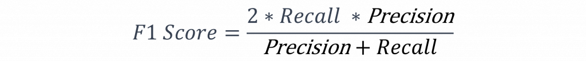

該公式中主要有兩個部分需要解釋，第一個是`精確度（Precision）`，它表示**實際為陽性的樣本中被正確預測為陽性的比例**，另一個是`召回率（Recall）`，它代表的是**所有陽性樣本中被正確預測為陽性的比例**。

讓我們以一個例子來解釋這兩者之間的區別，精確度可以用來評估門禁系統，因為該指標強調了不能誤放非法人員，而召回率則適合用在逃犯檢測系統中，該指標代表即使誤抓了許多人，也不能放過任何一名逃犯，不過這兩種評估方式都可能偏極端，因此有了F1-Score，它是一種在兩者之間取得平衡的算法

因此我們在進行去識別化的任務時，時常使用這個指標，而對於該算法，我們不需要自己手動進行計算，僅需要使用sklearn中的函式，就能輕易地求得該公式但是我們需要特別留意的是，在去識別化的任務中應該要忽略`O_IDX`，以免導致計算上的錯誤。

### 【STEP 6】模型訓練與比較

在這裡，我們依然使用原有的訓練程式進行訓練，但不同的是，我們將儲存指標的方式改為F1-Score，同時忽略了最後生成的Loss圖(因為無效)。

```
epochs = 10000                              # 訓練次數
early_stopping = 10                      # 模型訓練幾次沒進步就停止
stop_cnt = 0                             # 計數模型是否有進步的計數器
model_path = 'model.ckpt'                # 模型存放路徑
show_loss = False                         # 是否顯示訓練折線圖
best_f1 = 0                              # 最佳的準確率
loss_record = {'train':[], 'valid':[]}   # 訓練紀錄

for epoch in range(epochs):   
    train_f1, train_loss= train(epoch)
    valid_f1, valid_loss = valid(epoch)
    
    loss_record['train'].append(train_loss)
    loss_record['valid'].append(valid_loss)
    
    # 儲存最佳的模型權重
    if best_f1 < valid_f1:
        best_f1 = valid_f1
        torch.save(model.state_dict(), model_path)
        print(f'Saving Model With F1 {best_f1:.5f}')
        stop_cnt = 0
    else:
        stop_cnt+=1
    
    # Early stopping
    if stop_cnt == early_stopping:
        output = "Model can't improve, stop training"
        print('-' * (len(output)+2))
        print(f'|{output}|')
        print('-' * (len(output)+2))
        break
        
    print(f'Train Loss: {train_loss:.5f} Train F1: {train_f1:.5f}', end='| ')
    print(f'Valid Loss: {valid_loss:.5f} Valid F1: {valid_f1:.5f}', end='| ')
    print(f'Best F1: {best_f1:.5f}', end ='\n\n')

if show_loss:
    show_training_loss(loss_record)
```

當你執行這個程式時，你會注意到F1-Score幾乎都是0，而會發生這種情況其實是因為在訓練這些預訓練模型時，並未將去識別化這個因素考量進來，所以我們先在使用LSTM進行訓練時，其實就是在微調這些權重，這樣子我們將能夠讓該權重更適合我們的任務，現在我們來看一下表格中這些模型訓練出來的成果:

名稱 | LSTM | Word2Vec| GloVe| fastText

------------- | -------------

F1-score |0.69471|0.75022 |0.77032|0.83053|

在以上結果中，我們可以看到fastText的訓練結果在比較與其他三個模型後顯示了最佳的效能，這個優異的成果主要要歸功於subword的特性，因為在處理去識別化的過程中，我們經常會遇到像是HWSI-1246(ID)這類的資訊，而這些ID基本上是不可能被組成詞彙的，所以這些標籤並不會被Word2Vec和GloVe這兩個模型所建立，因此該部分將被轉換成`<UNK>`這一個特殊字元，所以這些模型都是通過前後文的關聯來推斷這個`<unk>`詞彙的出現時間來進行去識別化的動作。

而fastText與之不同的是，它會透過使用subword特性來將這些向量進行分割和重組，因此它不會出現太多的`<UNK>`字元，所以在最終的結果展示上，fastText模型表現得最為出色。

後話
--

我們可以從這項實驗中我們發現，導入預訓練模型的LSTM模型其效能可以大幅超越獨立訓練的結果，並且每一個模型的演進，都會比原先的模型再更好一些，因此我們更應著重學習這些模型的理論，這樣在遭遇問題時，才能熟練地修改模型中的演算法。然而還有一個我們要重視的預訓練模型ELMO，它的這項技術正是當今熱門模型的基礎，因此明天我將花些時間為大家詳細介紹ELMO這個預訓練模型。

那麼我們明天再見！

內容中的程式碼都能從我的GitHub上取得:

[https://github.com/AUSTIN2526/iThome2023-learn-NLP-in-30-days](https://github.com/AUSTIN2526/iThome2023-learn-NLP-in-30-days)

---

<a id="6669-day-18"></a>

## Day 18｜【Day 18】會根據上下文改變的詞嵌入向量 (上) - 預訓練模型ELMo震撼登場

- 原文：https://ithelp.ithome.com.tw/articles/10333583
- 發佈時間：2023-10-03 22:40:06

前言
--

我們之前提到的幾項技術都有其獨特的問題，例如word2vec常常會忽視詞彙的順序信息，而GLoVe則無法充分理解資料的詞性，至於時間序列模型則只能學習到下一個詞彙表示，不過在這些模型中還有一個相同的問提就是**他們無法根據上下文調整詞嵌入向量**，雖然他們能將相似語意的詞放在一起，但最終還是會偏向於特定向量，以GLoVe中的「Play」詞彙為例，該詞的向量會傾向於「運動」的語意。

而在理想的狀況應是根據上下文來動態的調整每個詞彙的向量位置，而這種概念也是最新的自然語言處理技術中的關鍵之一，因此我們今天的重點將會如下:

1.   `ELMo中的詞嵌入方式`
2.   `Contextualized Word Embedding(上下文詞嵌入)`的理解
3.   模型中權重共享的對象
4.   `基於特徵(base-feature)`與`微調(fine-tine)`的預訓練模型區別

ELMO（Embeddings from Language Models）
-------------------------------------

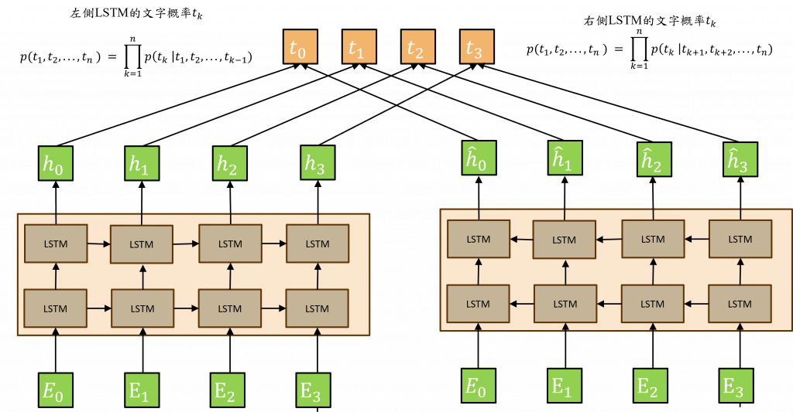

`ELMO（Embeddings from Language Models）`是一種利用**雙向雙向LSTM**來學習每個詞彙在特定上下文中的向量的方法，它與一般的雙向LSTM不同的是它的LSTM層具有**權重共享的特性**，並且**每一個詞彙都自己的詞嵌入向量**，因此每一個詞彙能夠根據它的上下文能計算出不同詞嵌入空間，現在我們來看看該模型的實現方式。

### ELMo中的詞嵌入層


ELMo的詞嵌入與先前的詞嵌入層不同，它主要具備三個詞嵌入層以對應這些不同的特性，最底部的詞嵌入層被稱為`Token Embedding(詞彙的詞向量)`，它針對**每一個詞彙產生出不同的詞嵌入向量**。

第二、第三的詞嵌入層則是分別對應該詞彙經過第一與第二層LSTM計算出來的**隱狀態的詞向量**，在這兩層中主要學習的是每一個隱狀態所理解的上下文意義，也就是說ELMo的預訓練過程不僅學會單字的Token Embedding，還會學習到一個雙層雙向的LSTM網路結構，而這兩層的詞嵌入被稱為`Contextualized Word Embedding(上下文詞嵌入)`。

### ELMo中的目標生成方式

由於ELMo的詞嵌入層是針對**每個詞彙建構**，因此在模型輸出時一個詞彙會有多個Contextualized Word Embedding，但這樣做會導致單個詞彙的表示變得更加豐富，因此ELMo的方法是**將這些Contextualized Word Embedding進行加權總和**以結合它們的訊息，其作法如下:

1.   根據LSTM的層數n建立出參數`Wc(n)`
2.   將每一層的`Contextualized Word Embedding`與該層的`Wc(n)`進行計算
3.   將`Token Embedding`與每一層的`Contextualized Word Embedding`進行加總

對於一個雙層的ELMo模型，詳細的計算過程如下：首先我們將一個詞彙轉換成Token Embedding向量，然後將這個向量交給LSTM進行計算，這部分的操作與我們在[【Day 6】深度神經網路該怎麼改變Embedding向量(下)-PyTorch訓練的策略和方法](https://ithelp.ithome.com.tw/articles/10323930)中的作法相同。在這一階段每一個文字都會產生一個相對應的隱狀態`h(t)`。

接下來在ELMo模型中，由於它採用的是雙向的LSTM模型，所以我們需要將正反LSTM計算出來的兩個相同時序的隱狀態`h(t)`合併再傳遞給詞嵌入層，而這個新生成的詞嵌入就稱為Contextualized Word Embedding。接著該Contextualized Word Embedding會與參數`Wc(1)`進行運算，然後將這個結果傳遞到下一層的LSTM中，並重複上述的過程。

直到在ELMo模型的最後一層時，我們會將**Token Embedding與兩個Contextualized Word Embedding進行加總**，以產生最終的輸出結果。

> **小提示:**
> 
> 每一個Contextualized Word Embedding都會學習到上一個階段中更抽象的特徵，因此若直接將Contextualized Word Embedding作為最後一個輸出結果，將會導致原始的訊息丟失，因此再加權總合階段時我們必須將Token Embedding的資訊加入回來，才不會導致模型無法收斂。

### 權重共享的對象

這種複雜的計算可能導致模型無法收斂，因此需要將部分權重需要進行共享，其中最需要共享的參數便是正反兩個LSTM層中的Contextualized Word Embedding與Token Embedding權重，其原因很簡單若Token Embedding的權重與Contextualized Word Embedding在進行權重加總時不同，則可能導致序列位置與詞彙相同，卻有不一樣的輸出涵義。

這種狀況就好像一個我們已知的文字（Token Embedding）被水打翻而變模糊（Contextualized Word Embedding），但我們想要知道這個字時卻因為左側人告知的文字（左側LSTM）與右側人告知的文字（右側不同）而不同，造成你還是不知道該文字到底是什麼，而這種狀況就會造成語意混亂的情形。

### 預訓練詞向量的使用方式

不過你有沒有想起我們所說的，ELMo其實只是一種詞嵌入的預訓練模型，因此我們應該只會使用到它的詞嵌入層，雖然上述的模型架構看起來非常完整，但該模型的作用只是為了培養出好的Contextualized Word Embedding而已，而這種預訓練模型其實就是一種`基於特徵(Base-feature)`的方式，**不會完整將這個預訓練模型給予到自己的模型中，而是指使用部分的權重**，這種方式這包括我們所介紹的Word2Vec、GloVe、fastText。

而將這些詞嵌入層進行後續訓練時作者們發現在所有層級中，ELMo的第一層Contextualized Word Embedding的效果最佳，尤其在找出代詞和解答這兩個任務上其表現更是突出。

後話
--

當我寫到這裡時才突然想到，我忘記在[【Day 13】預訓練模型的強大之處? 我們要怎麼使用它?](https://ithelp.ithome.com.tw/articles/10330137)解說基於特徵的預訓練模型的概念了，因為這類模型的概念叫簡易，就是將已經訓練好的權重放入到自己的模型中，並且這種方式已經越來越少見了，所以我那天主要只解釋了**微調**方式的預訓練模型，所以我在今天將這方面的知識補充近來，不過剛好今天是基於特徵的預訓練模型的最後一個理論章節，這樣子應該會更讓你能記住這些基於特徵的模型概念，而在明天我將教導你如何使用這個ELMo模型。

那麼我們明天再見！

內容中的程式碼都能從我的GitHub上取得:

[https://github.com/AUSTIN2526/iThome2023-learn-NLP-in-30-days](https://github.com/AUSTIN2526/iThome2023-learn-NLP-in-30-days)

---

<a id="6669-day-19"></a>

## Day 19｜【Day 19】會根據上下文改變的詞嵌入向量 (下) - ELMo該如何使用與Embedding可視化

- 原文：https://ithelp.ithome.com.tw/articles/10334221
- 發佈時間：2023-10-04 23:47:32

前言
--

過去我們已經完成了情緒分析、文字生成、去識別化等等的NLP任務，這些任務分別代表分類、生成、及命名實體(NER) 這些也就是自然語言處理中的三大任務，基本上市面上的90%模型都是通過這三大任務完成的，但我們仍有一項任務未有詳細解釋，所以我計劃在介紹ELMo模型之後，將會馬上告訴你這個任務的詳細訓練方式。而在今天的目標中的詞向量使用方法與前幾天相似，所以不會在執行訓練的動作，所以在今天中主要舊視教會大家如何在Pytorch中使用到ELMo，並將其可視化。

1.   ELMo的下載方式
2.   ELMo的詞向量取得方式
3.   ELMo的詞向量可視化

ELMo的使用方式
---------

今天的程式碼雖然只有短短幾行，但這裡有一點需要留意，由於ELMo所處的時代較為老舊所以大多函式庫並未支援，所以我們今天所使用的函式庫會先將GPU版本的Torch解除安裝，不過不會影響到我們今天的使用。

首先下載的就是ELMo這個模型，可以在[vectors.nlpl.eu](http://vectors.nlpl.eu/repository/)中找到該模型的`json`檔案與權重`hdf5`兩個檔案，該模型的使用方式如下程式碼所示:

```python
# pip install allennlp
from allennlp.modules.elmo import Elmo, batch_to_ids

options_file = "options.json"
weight_file = "weights.hdf5" 

elmo = Elmo(options_file, weight_file, 1, dropout=0)

sentence_lists = [['I', 'love', 'you', '.'], ['Sorry', ',', 'I', 'don', "'t", 'love', 'you', '.']] 

character_ids = batch_to_ids(sentence_lists)  # (2, 8, 50)
```

當我們載入模型後，我們可以將被斷詞的文本一次性地輸入到`batch_to_ids()`函數進行轉換，此時我們可以得到一個`(2, 8, 50)`大小的`character_ids`，其中，`2`代表輸入了兩句話，`8`代表輸入文本的最大長度，而`50`則代表該**詞彙透過詞彙建立之Embedding的輸入形式**。

在這兩個例句中:`I Love You.` 和 `Sorry, I don 't love you`，傳統的詞嵌入方式會將`I`、`Love`、`You`的詞嵌入都放在相同的維度，然而我們之前提到ELMo會根據上下文的關係來整合詞嵌入，因此為了驗證該模型的結果，我們將編寫一段詞嵌入可視化的程式碼。

但在進行此步驟之前，我們需要用PCA方法對ELMo的Embedding進行降維，因為其維度為1024，而不是我們之前設定的2維。

```javascript
from sklearn.decomposition import PCA
import matplotlib.pyplot as plt
pca = PCA(n_components=2, random_state=2526)

v1 = tsen.fit_transform(embeddings[0].detach().numpy())
v2 = tsen.fit_transform(embeddings[1].detach().numpy())
all_vec = np.concatenate((v1,v2), axis = 0)
flattened_list = ['I', 'love', 'you', '.', 'None', 'None', 'None', 'None', 'Sorry', ',', 'I', 'don', "'t", 'love', 'you', '.']
```

接下來我們將以前寫的程式碼呼叫回來，在這一步中加入我們上述的文字向量和對應的文字。

```scss
def visualization(embedding_matrix, flattened_list):
    # 提取降維後的坐標
    x_coords = embedding_matrix[:, 0]
    y_coords = embedding_matrix[:, 1]
    
    # 繪製詞嵌入向量的散點圖
    plt.figure(figsize=(10, 8))
    plt.scatter(x_coords, y_coords)
    
    # 標註散點
    for i in range(len(embedding_matrix)):
        plt.annotate(flattened_list[i], (x_coords[i], y_coords[i]))
        
    plt.xlabel('Dimension 1')
    plt.ylabel('Dimension 2')
    plt.title('Visualization of Embedding Vectors')
    plt.show()
visualization(all_vec, flattened_list)
```

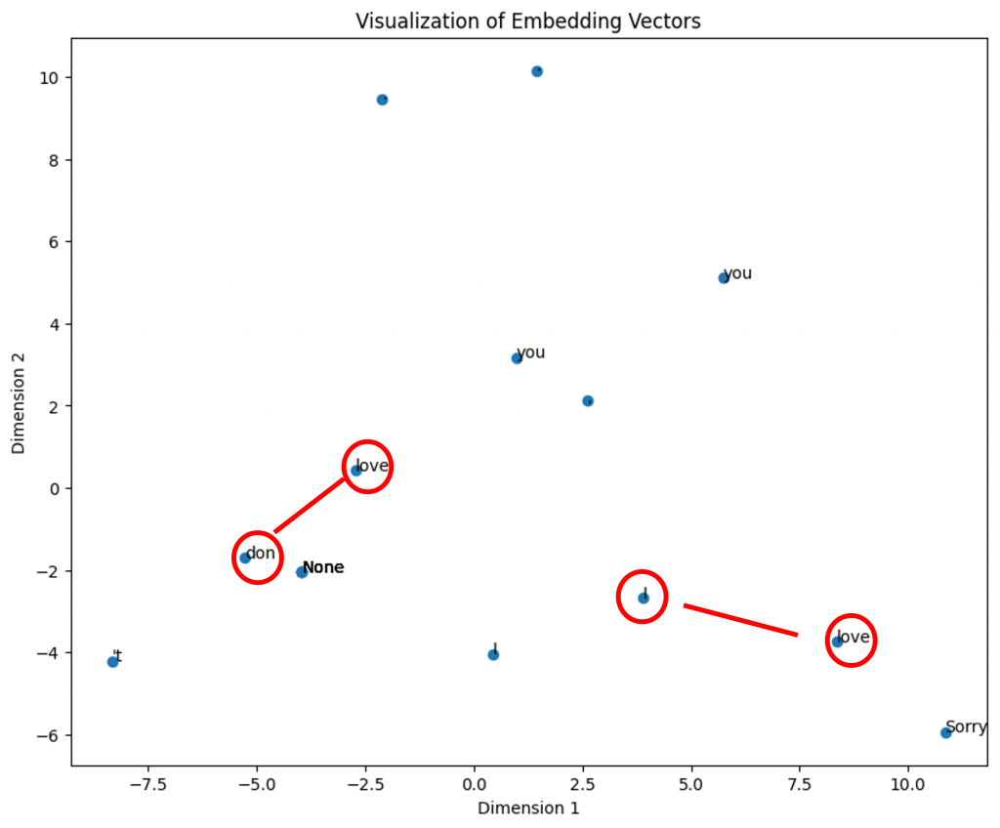

在此我們可以觀察到，其中一個`Love`的向量更接近`don't`，另一個`Love`則更接近`I`，這種特性正是ELMo模型最重要的部分。

這時這些詞向量也就是我們在Word2Vec等章節中所需要的詞嵌入向量了，我們需要使用它時只需將這些向量拼接回來後方入到模型即可。

後話
--

我們今天學習了如何使用ELMo模型，同時將每個詞彙的結果可視化，不過你可能會發現這次的詞嵌入向量與先前相比，格式似乎有所差異，這種狀況導致在訓練ELMo模型時，讓我需要不斷地依據上下文轉換這些向量，並且這些轉換後的結果還要放入模型中進行運算並與時間序列模型的進一步計算結合，這將會使推理速度降低，因此我將在明天介紹你目前自然語言處理中最強的架構Transformer是如何解決這些問題的。

那麼我們明天再見！

內容中的程式碼都能從我的GitHub上取得:

[https://github.com/AUSTIN2526/iThome2023-learn-NLP-in-30-days](https://github.com/AUSTIN2526/iThome2023-learn-NLP-in-30-days)

---

<a id="6669-day-20"></a>

## Day 20｜【Day 20】萬物皆可Transformer(上)-Transformer中所使用的技巧解析

- 原文：https://ithelp.ithome.com.tw/articles/10334540

前言
--

昨天我們以精簡的內容來加深你對ELMo的理解，而內容簡短的原因除了其訓練方式與Word2Vec等相似之外，最主要的理由在於今天將介紹的內容極為重要，所以我希望你能將所有精力放在此次學習上，因這種語言模型在後續的發展中極具影響力，許多熱門的語言模型都是其的衍生的，包括當今最強的語言模型ChatGPT（更精確的說，是GPT-4）也使用這種架構，今天的學習重點如下:

1.   `Transformer`架構與公式理解
2.   `Self-Attention`的實現方式
3.   自然語言中常看到的`Query`、`Key`、`Value`之理解


`Transformer`是一種衍生自`Encoder-Decoder`架構的變化方式，它於2017年最初出現在`Attention Is All You Need（注意力機制就是你全部所需）`的期刊論文中，它的設計理念具有革命性地影響了人工智慧領域，因為它**不再依賴於傳統的時間序列模型**，並且正如論文的名稱所述，這種架構能適用於音訊、文字、圖像等不同的場域，而這一點特性這都歸功於他所建立的`Self-Attention（自注意力機制）`概念，現在讓我們深度的解析該模型的架構吧。

> **小提示:**
> 
> 該架構需要具備Seq2Seq中的Attention知識，若有內容不清楚或不瞭解的，建議先看我在[掌握文字翻譯的技術](https://ithelp.ithome.com.tw/articles/10326701)中所提到Attention理解與實作。

### Positional Encoding

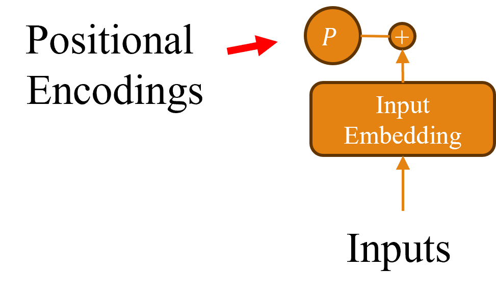

在Transformer中，由於其與時間序列模型模型不同，採取的是平行運算方式，所以對於每一個輸入的詞彙，該架構無法得知順序，因此我們需要在此步驟利用`Positional Encoding`對每個輸入進行編碼。讓我們先來看以下的公式:


其中`dmodel`是指詞嵌入層的維度，`i`則代表該詞向量的第`i`個維度，而`POS`則表示輸入詞彙的位置，而該公式這樣的設計主要基於`sin()`和`cos()`函數的周期性特性，因為**這兩種函數特別適合表現循環性的特徵**，由於這種方法能讓數值的**最初的序列與最後的序列在性質上更接近**，因此能夠解決因詞彙距離過遠而產生的稀疏問題，進一步使模型能夠更好地學習詞與詞之間的相對位置關係。

### Self-Attention


在我們開始介紹Transformer Encoder之前，必須先理解Self-Attention這個機制，不過先讓我們來回顧一下Attention的概念，該方式是透過`注意力權重a(t)`來計算出`Enocder隱狀態h(t)`與`Decoder的隱狀態hd(t)`，對於時間序模型能有最佳表現，而在這裡他將會跨足Encoder與Decoder兩個架構，因此在訊息上的結合就會比較困難。

這次所使用的Self-Attention被稱為「Self」，是因為其運算中使用的是文字內部的向量，讓我們來看看圖片中的`k`、`q`、`v`這三個參數，這三個向量是經過Positional Encoding計算過後，再與`Wk`、`Wq`、`Wv`三個權重進行的運算的新結果，而這三個新向量分別代表了該詞彙之後將進行的動作，我們先看到下圖中的簡易的例子。


當我們進行尋找代詞的命名實體任務時，必須要留意代詞可能的特性，在LSTM任務中我們通常只會觀察到下一個詞彙的文字資料，因此這樣子可能會讓較遠的資料的注意力權重變得更低，而在Self-Attention中的做法，就是先把每一個詞彙`q(我)`向量，與其他剩餘詞彙的`k(是)...k(胖虎)`向量進行比對運算，接下來我們根據`q(我)`向量去決定哪一個`k`向量與該向量的關聯性最高，來計算出注意力權重`a(t)`，其詳細作法非常簡單直接將`softmax(q·k)`就能夠計算出該權重了。

而這樣做的目的是希望**讓每個文字能動態地鎖定其應有的焦點**，在我們圖片中透過這種方式找出了詞彙「我」與接下來的「胖虎」和「孩子王」的注意力連接強度(透過顏色深淺呈現)，這也代表著每個詞彙都會產生出需要的注意力對象，不過該方式還要考慮其他更多的因素，我們先來看到下面的公式:

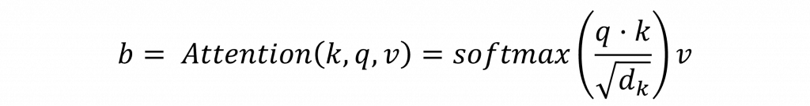

可以發現在該公式中多出了除上`√(𝑑(k))`的動作，其原因是在`q`與`k`向量進行運算時，數值可能會變得過大，從而**導致經過Softmax的輸出梯度可能會過小**。

你可能會感到好奇，既然Transformer被設計來取代時間序列模型，那麼它是如何產生類似於時間序列模型的隱狀態`h(t)`的資料呢？在時間序列模型中我們輸出的資料即為該時序的隱狀態，因此當你察看上述的公式，會發現還多了一個與`v`相乘的部分，這個向量`v`的作用，就是**呈現出該詞彙本身的特性**，因此我們可以認為這個運算結果就是由向量`v`所算出的狀態。

### Transformer Encoder


但在實際的Transformer中，是使用了一種名為`Muti-Head Attention(多頭注意力機制)`的技術，而這樣的目的是因為在Self-Attention中，每一組`q`、`k`向量都只會對同一個詞彙的語意有所注意，然而我們在ELMo的學習過程中，明白到每一個詞彙都應該被分割出多種語意，這樣才能得到更好的結果，因此我們在這裡的作法是在Self-Attention中加入更多組的`k`、`q`、`v`向量，使每一個詞彙能對應到不同的語意環境中。

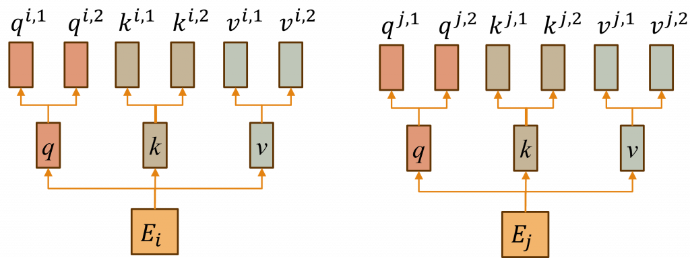

該動作的執行方式與Self-Attention相同，只不過在計算出最後結果時，因為會對同一個時序的資料產生多個輸出`b`，因此我們需要將其轉換成一個完整的向量，在這裡我們只需要將此輸出`b`進行維度結合的動作，在與其權重`Wb`進行矩陣運算，這樣子就完成了Muti-Head Attention的計算方式。


在Transformer的輸出結果中，還會增加了一層`Layer Normalization`，這個設計的目的是要減少`Internal Covariate Shift(內部協變量偏移)`的問題。

Internal Covariate Shift的發生，是因為在神經網路裡每一層的輸入分佈都會不斷的變化，這樣會導致訓練過程不穩定，而為了解決這個問題，我們需要一種方式來穩定每層中數值，而在Layer Normalization中就是通過輸入的`x`、均值`E[x]`與方差`Var[x]`來轉換每一層的輸出結果，其計算公式如下:


其中`𝜖`的用途主要是為了防止出現除以零的情況，因此其數值通常會設定得非常小，至於`𝛾`則是用來控制縮放輸出的幅度，而`𝛽`則是代表該層的偏移量，這樣子模型每一層的訊息會比較穩定，使其收斂效果更佳。

### Transformer Decoder

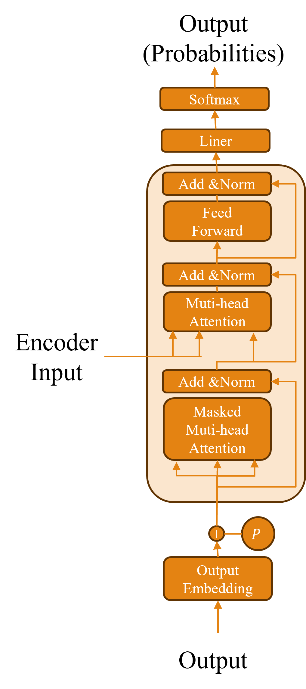

在Transformer的Decoder中，多出了一個`Masked Multi-head Attention(遮蔽式多頭注意力機制)`的層，這層的目的出現是由於Transformer是使用平行運算的，但我們在Decoder中通常是採用Teacher Forcing的訓練方式，這時如果我們將完整的序列傳入，Transformer就會考量到尚未出現的字元，從而導致運算錯誤。


這裡讓我們先回憶一下Teacher Forcing的訓練方式，當我們在進行翻譯任務時，若Decoder的輸出的資料是法文的`J'ai un chat <EOS>`，而Decoder的輸入資料是`<SOS> I have a cat`，在這種情況下`<SOS>`這個序列輸入給Decoder後應該要生成`J'ai`這個詞彙，而`<SOS> I`生成`un`這個詞彙，以此類推直到出現`<EOS>`。

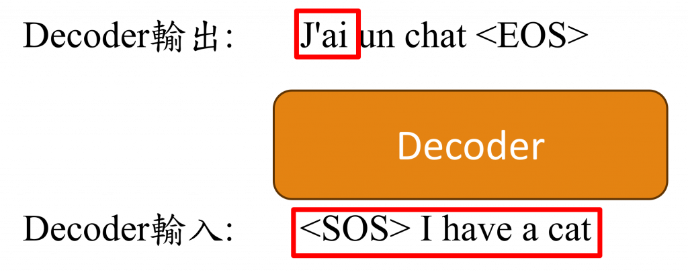

但在Transformer中，當我們輸出`J'ai`這個詞彙時，它會完整地將`<SOS> I have a cat`考慮在內，這可能導致在Decoder未完成訓練時就接收了過多的信息，使模型難以收斂，因此對於Decoder的第`i`個輸出，我們需要對`i+1`之後的文字位置進行Mask的操作，

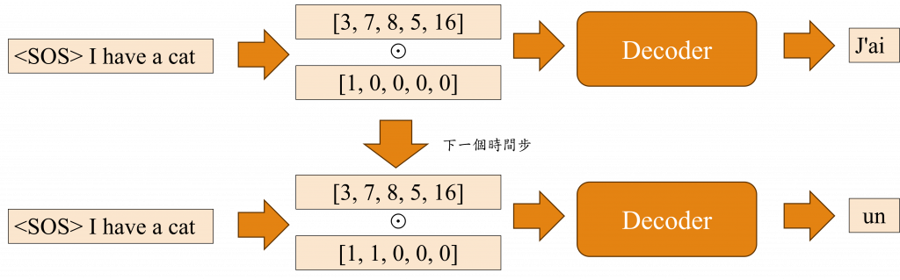

換句話說，當生成'J'ai'這個詞彙時，Decoder的輸入會是`<SOS> I have a cat`和`[1, 0, 0, 0, 0]`運算後的結果，這一點就是Masked Multi-head Attention中新增的部分，其餘的部分則與相同。

後話
--

這次的Transformer的架構與Seq2Seq+Attention非常類似，只是做了一些細微的變動和設計，例如他使用Self-Attention來取代時間序列模型中的複雜運算，並用Positional Encoding來賦予文字時序的概念，而對於ELMo針對詞彙的詞嵌入向量，Transformer則在內部加入了Multi-Head Attention來改進詞嵌入的計算過程，現在你已經用Seq2Seq+Attention的概念來理解Transformer模型了，感覺是不是簡單許多呢？明天我將進一步加深你對這個模型的印象，這次我會Pytorch來教你如何建立一個Transformer模型。

那麼我們明天再見！

內容中的程式碼都能從我的GitHub上取得:

[https://github.com/AUSTIN2526/iThome2023-learn-NLP-in-30-days](https://github.com/AUSTIN2526/iThome2023-learn-NLP-in-30-days)

---

<a id="6669-day-21"></a>

## Day 21｜【Day 21】萬物皆可Transformer(下) - 使用Transformer找出文本中重要的訊息

- 原文：https://ithelp.ithome.com.tw/articles/10335390

前言
--

今天我們將主要實現出Transformer的完整的Encoder與Decoder架構，而這次的程式碼可說是我們在這30天內接觸的最複雜程序，因為他不僅需要非常清楚了解Transformer的理論，還要有矩陣操作的能力，因此我會盡可能詳細解釋程式碼中的每一部分，來協助你理解每段程式的對應理論。

1.   `Transformer`所需要做的資料前處理
2.   `Mask`的矩陣創立方式與使用
3.   `Encoder`與`Decoder`建立方式

Kondalarao Vonteru文本摘要
----------------------

這次我們將使用[Kondalarao Vonteru的數據集](https://www.kaggle.com/datasets/edumunozsala/cleaned-news-summary)的擴展包進行文本摘要的工作，這個資料集含有約9.8萬條**由專業作家所撰寫的新聞及文本摘要**，而我們的目的即是利用此資料集來訓練Transformer模型，使我們能夠快速理解文章中的重點，接下來讓我們透過以下的程式碼來建構這個模型:

### 【STEP 1】讀取資料

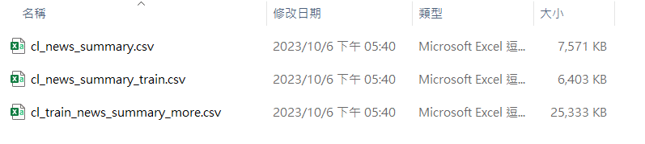

這次我們將資料儲存於CSV檔案中，將其劃分為`Train`與`Valid`兩個資料夾，每一個資料夾中，我們都存放了三個CSV檔案，為了讀取這些資料，我們需要透過迴圈操作來執行。在這些CSV檔案中，資料分成了`summary(摘要)`與`text(原始資料)`兩個部分，因此我們需要將這兩個欄位分開處理，其中`text`將會被用作Encoder的輸入，而`summary`則會被用作Decoder的輸入。

```
import pandas as pd
import os

def load_data(path):
    x_train, y_train, x_valid, y_valid= [], [], [], []
    for types in os.listdir(path):
        classes_path = f'{path}/{types}'
        for classes in os.listdir(classes_path):
            file_path = f'{classes_path}/{classes}'
            df = pd.read_csv(file_path).values
            input_text, summary = df[:,1], df[:,0] # summary 欄位0 text欄位1
            if types == 'Train':
                x_train.extend(input_text)
                y_train.extend(summary)
            
            else:
                x_valid.extend(input_text)
                y_valid.extend(summary)
    return  x_train, y_train, x_valid, y_valid

x_train, y_train, x_valid, y_valid = load_data('SummaryData')
```

在這次的程式處理過程中，我們無需手動將數據分割成訓練集和驗證集，就像上述程式所展示的，我們可以簡單地通過**資料夾名稱**迅速切割CSV文件的內容，該程式主要是利用`listdir()`方法來取得所有資料夾或文件的名稱，然後在最底層的文件夾中使用`read_csv()`來讀取資料。

### 【STEP 2】建立詞彙表與超參數

這一步我相信大家都很熟悉，我們首先透過`get_tokenizer()`來進行英文的斷詞工作，然後用`vocab`統計這些詞彙已建立起詞彙表，而在這種Encoder-Decoder架構中，我們還需要加入特殊的標籤`<SOS>`、`<EOS>`，使讓模型能學會這部分的特性，這和我們先前[【Day 11】掌握文字翻譯的技術(下)-英法語言翻譯模型](https://ithelp.ithome.com.tw/articles/10328763)使用的技術相同，不過在這裡我並未先用`pad_sequence()`來填充這些詞彙，因為這次的資料詞彙量非常大，高達8000個以上如果一次全部填充，那麼會大大增加模型的運算時間。

```
from torchtext.data.utils import get_tokenizer
from torchtext.vocab import vocab
from collections import Counter

def get_vocab(inputs, tokenizer, train_len, special = ('<PAD>', '<SOS>','<EOS>','<UNK>')):
    counter = Counter()

    new_inputs = []
    for sentence in inputs:
        tokens = tokenizer(sentence)
        counter.update(tokens)
        new_inputs.append(tokens)

    token_vocab = vocab(counter, min_freq=5, specials=special)

    return token_vocab, new_inputs[:train_len], new_inputs[train_len:]

all_input = x_train + x_valid
all_target = y_train + y_valid
tokenizer = get_tokenizer('basic_english')

input_vocab, x_train, x_valid= get_vocab(all_input, tokenizer, len(x_train))
traget_vocab, y_train, y_valid= get_vocab(all_target, tokenizer, len(y_train))

input_vocab.set_default_index(input_vocab.get_stoi()['<UNK>'])
traget_vocab.set_default_index(traget_vocab.get_stoi()['<UNK>'])

# Ecoder與Decoder的Embedding輸入大小
INPUT_DIM =  len(input_vocab)
OUTPUT_DIN = len(traget_vocab)

# 取得給予模型的索引值
SOS_IDX = input_vocab.get_stoi()['<SOS>']
EOS_IDX = input_vocab.get_stoi()['<EOS>']
PAD_IDX = input_vocab.get_stoi()['<PAD>']
```

### 【STEP 3】將詞彙轉換成數字

為了讓電腦能理解文字，我們先把詞彙轉換成數字。這項轉換過程我們可以透過`lookup_indices()`來完成，但在此步驟中**我們還需於每一個句子對的最末句中加入`<EOS>`這種特殊符號**。並且為了節省計算資源，我們還讓單個句子的詞彙數量上限為5000個（如果電腦處理能力不足，可將此數量縮減），若超過此數量的部分，將會直接被切除。

```
import torch

def token2num(inputs, targets):
    encoder_input, decoder_input = [], []
    for i in range(len(inputs)):
        encoder_in = input_vocab.lookup_indices(inputs[i])[:4999] + [EOS_IDX]
        decoder_in = traget_vocab.lookup_indices(targets[i])[:4999] + [EOS_IDX]

        encoder_input.append(torch.tensor(encoder_in))
        decoder_input.append(torch.tensor(decoder_in))
    return encoder_input, decoder_input

x_train, y_train= token2num(x_train, y_train)
x_valid, y_valid= token2num(x_valid, y_valid)
```

### 【STEP 4】建立訓練與驗證資料集

當我們建立好訓練資料與驗證資料後，我們先使用`Dataset()`來封裝這些資料。

```
from torch.utils.data import Dataset, DataLoader

class SummaryeDataset(Dataset):
    def __init__(self, x, y):
        self.x = x
        self.y = y
          
    def __getitem__(self, index):
        return self.x[index], self.y[index]
       
    def __len__(self):
        return len(self.x)
    
trainset = SummaryeDataset(x_train, y_train)
validset = SummaryeDataset(x_valid, y_valid)
```

接下來我們將進行一些特別的處理，在這次的資料前處理中步驟中，因我們並未使用`pad_sequence()`，所以我們必須在模型訓練時進行該步驟，由於我們採用的是Encoder-Decoder架構，所以**Encoder的輸入大小必須與Decoder的輸入大小相同**。因此我們需要先將資料組合起來再使用`pad_sequence()`，接著通過`split()`將Encoder和Decoder的輸入資料分開。

```
from torch.nn.utils.rnn import pad_sequence

def collate_fn(batch):    
    (x, y) = zip(*batch)
    
    pad_data = pad_sequence(x + y, padding_value=PAD_IDX, batch_first=True)
    src, tgt = torch.split(pad_data, split_size_or_sections=[len(x), len(y)], dim=0)

    return src.permute(1, 0) , tgt.permute(1, 0)
    
train_loader = DataLoader(trainset, batch_size = 2, shuffle = True, num_workers = 0, pin_memory = True, collate_fn = collate_fn)
valid_loader = DataLoader(validset, batch_size = 2, shuffle = True, num_workers = 0, pin_memory = True, collate_fn = collate_fn)
```

在這裡我們需要注意幾個細節，當我們填充完資料後，`return`時使用了`permute(1, 0)`這個動作，這是因為我們的原始輸入維度是`(batch_size, seq_len)`，而在Pytorch裡，時序相關的參數大多需要在該模型中設置`batch_first=True`才能用這種輸入維度，但這個參數的預設值通常是`False`，因此我選擇直接將輸入維度轉變為`(seq_len, batch_size)`，這樣在建立複雜的模型時，我們就可以避免過度使用`batch_first=True`參數。

### 【STEP 5】建立Positional Encoding

建立Positional Encoding的部分主要是實踐該公式的方式，不過我們在這裡仍選擇將整個程式分成多段來講解，以防你無法理解程式的內容。

```
class PositionalEncoding(nn.Module):
    def __init__(self, emb_size, dropout, maxlen = 5000):
        super(PositionalEncoding, self).__init__()
```

首先我們需要理解在Positional Encoding中，一個重要的`dmodel`參數，這個參數決定了我們在Encoder及Decoder中給予Positional Encoding的維度大小，因此我們需要傳寫一個`emb_size`來獲取該參數，並且在Positional Encoding中我們通常會設置`dropout`和`maxlen`兩個參數。

`dropout`的設置主要是為了防止模型過度擬合。至於`maxlen`它的設置源於一個實際問題，由於我們的電腦通常無法負擔過大的計算量，因此當我們無法將輸入的大小合理調整時，我們就需要將它直接截斷，並且**該大小的上限必須大於等於我們在【STEP 3】時所設置的長度設定**。

```
den = torch.exp(- torch.arange(0, emb_size, 2)* math.log(10000) / emb_size)
        pos = torch.arange(0, maxlen).reshape(maxlen, 1)
        pos_embedding = torch.zeros((maxlen, emb_size))
        pos_embedding[:, 0::2] = torch.sin(pos * den)
        pos_embedding[:, 1::2] = torch.cos(pos * den)
        pos_embedding = pos_embedding.unsqueeze(-2)
        
        self.dropout = nn.Dropout(dropout)
        self.register_buffer('pos_embedding', pos_embedding)
```

在這個程式的內部，首先是將所有的輸入通過公式計算成固定位置的數值，該公式也就是我們昨天所提到的轉換公式，接著我們需要計算出包含位置信息的張量`pos`，該變數的目的是通過`sin()`與`cos()`方法來計算張量在**奇數和偶數列中的位置信息**，此外我們還需要擴展整體維度的向量來符合後續Transformer的運算需求。

並且在這裡，我們還使用了一個特別的技巧，即`self.register_buffer`，它的功能是使**定義的參數不能被更新**，這是因為在Positional Encoding中，位置資訊是不能被更動的。

```
def forward(self, token_embedding: Tensor):
        return self.dropout(token_embedding + self.pos_embedding[:token_embedding.size(0), :])
```

在該模型的前向傳播過程中，操作相當簡單了，我們只需將輸入的embedding向量與對應的位置訊息進行結合，當我們完成這個步驟後，該模型的**詞嵌入向量就已經附加了位置訊息**。

### 【STEP 6】建立詞嵌入層

我們昨天在Transformer中，由於需建立Encoder和Decoder的詞嵌入層，因此我們將其規劃為一個獨立的類別，在這裡，可以看到一個特別的操作是`math.sqrt(self.emb_size)`，這個操作主要用來**調整嵌入向量的尺度**，與`q`、`k`向量的縮放作法相似。

```
class TokenEmbedding(nn.Module):
    def __init__(self, vocab_size: int, emb_size):
        super(TokenEmbedding, self).__init__()
        self.embedding = nn.Embedding(vocab_size, emb_size)
        self.emb_size = emb_size

    def forward(self, tokens: Tensor):
        return self.embedding(tokens.long()) * math.sqrt(self.emb_size)
```

### 【STEP 6】建立Transformer

首先我們來介紹傳入該模型的超參數，在Transformer中，我們不僅可以控制Multi-head attention中head的數量，還能控制其Encoder和Decoder的層數，越多層的Transformer計算會更抽象，因此需要大量的實驗才會知道結果，至於其餘的參數，看到這邊的你應該已經有相當瞭解了所以不再多做解釋了。

```
class Seq2SeqTransformer(nn.Module):
    def __init__(self, num_encoder_layers,  # Encoder數量
                 num_decoder_layers,        # Decoder數量
                 emb_size,                  # Embedding輸出
                 nhead,                     # head的數量
                 src_vocab_size,            # Encoder Embedding大小
                 tgt_vocab_size,            # Deocder Embedding大小
                 dim_feedforward = 512,     # feedforward神經元數量
                 dropout = 0.1,             # 每層丟棄多少神經元
            ):
        super(Seq2SeqTransformer, self).__init__()
```

在一個Pytorch的Transformer類別中，我們需要定義出`emb_size`、`nhead`和`dim_feedforward`這幾個參數，在原始的論文中，作者設定的`nhead`數量是8，`dim_feedforward`數量是2048，在這裡一樣是經過實驗才會知道他的效果，若沒有想法時直接使用預設值在後在使用窮舉法測試就是一個很好的實驗方式。

我們還需要要注意的是`num_encoder_layers`與`num_decoder_layers`這兩個參數，它們分別代表Encoder和Decoder的模型架構數量，在Transformer類別中主要有兩種宣告方式，一種是你可以自行建立這些模型後，將它們放入到Transformer中，而另一種就是直接給予數字，那麼會直接按照預設來幫你建立Encoder和Decoder。

```
self.transformer = Transformer(d_model=emb_size,
                                       nhead=nhead,
                                       num_encoder_layers=num_encoder_layers,
                                       num_decoder_layers=num_decoder_layers,
                                       dim_feedforward=dim_feedforward,
                                       dropout=dropout)
```

其餘的層數就很好理解了，主要包含詞嵌入層以及Positional Encoding，其中`generator`則是指在Decoder輸出時的全連接層。

```
self.generator = nn.Linear(emb_size, tgt_vocab_size)

        self.src_tok_emb = TokenEmbedding(src_vocab_size, emb_size)
        self.tgt_tok_emb = TokenEmbedding(tgt_vocab_size, emb_size)
        self.positional_encoding = PositionalEncoding(
            emb_size, dropout=dropout)
```

前向傳播的處理方式相對較為複雜，因為我們需要考慮到Decoder中的生成方法來處理，為此我們需要運用到兩種`MASK`，分別是`mask`和`padding_mask`。

其中padding_mask可以理解為忽略PAD_IDX的索引，而`src_mask`、`tgt_mask`的建立就變得稍微複雜些，因為我們需要創建一個能夠**遮蔽輸入的矩陣**，在通常情況下`src_mask`不需要遮蔽任何值，而`tgt_mask`則需要建立一個與Encoder相對應的矩陣，關於這種建立方式，我會在後面進一步解釋。

```
def forward(self,
                src,                  # Encoder輸入
                trg,                  # Decoder輸入
                src_mask,             # Encoder輸入忽略的訊息
                tgt_mask,             # Decoder輸入忽略的訊息
                src_padding_mask,     # Encoder輸入忽略PAD_IDX的索引
                tgt_padding_mask,     # Decoder輸入忽略PAD_IDX的索引
                memory_key_padding_mask):
        src_emb = self.positional_encoding(self.src_tok_emb(src))
        tgt_emb = self.positional_encoding(self.tgt_tok_emb(trg))
        outs = self.transformer(src_emb, tgt_emb, src_mask, tgt_mask, None,
                                src_padding_mask, tgt_padding_mask, memory_key_padding_mask)
        return self.generator(outs)
```

### 【STEP 7】建立tgt_mask與src_mask

首先，在建立`tgt_mask`的過程中，我們只需要了解輸入陣列的長度，昨天我們提到，針對Decoder的第`i`個輸出，我們需要對`i+1`及其之後的文字位置進行Mask的操作(圖片中左上座標為0, 0)

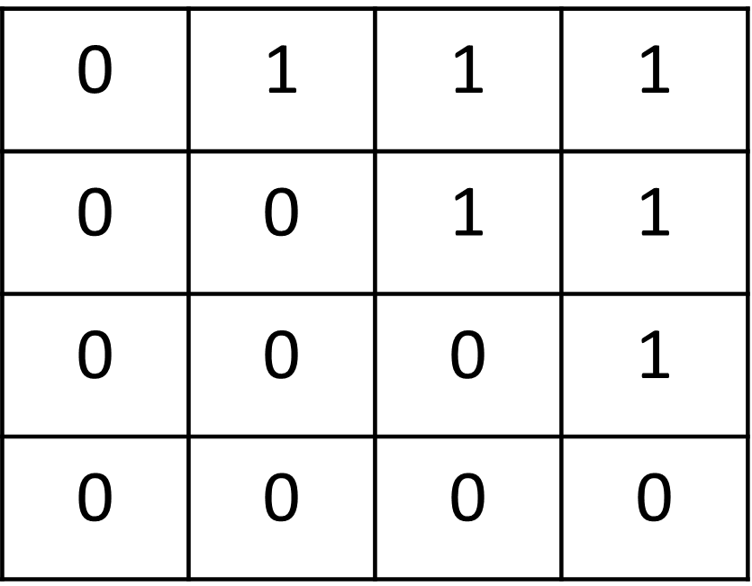

這種語句在矩陣上的實現方式，就是把該矩陣的下三角部分全都改為`0(代表不遮蔽)`，而對於該矩陣的解讀我們要輸出第`2`個文字(X軸為2)時需要使用`3`個Mask遮罩(Y軸為3)，以此類推就能夠完成上述矩陣的建立。

而在程式中建立該舉證的最快方式就是建立一個全為`1`的矩陣，接下來直接通過`triu()`的方式將下三角改為`0`，如此一來就能滿足我們的輸入需求。

```
def generate_square_subsequent_mask(sz):
    mask = (torch.triu(torch.ones((sz, sz), device=device)) == 1).transpose(0, 1)
    mask = mask.float().masked_fill(mask == 0, float('-inf')).masked_fill(mask == 1, float(0.0))
    return mask
```

不過，在Pytorch的對於浮點運算時，`float('-inf')`才代表被保留，而其餘的則保持不變。因此我們需要把`0`的部分修改為`float('-inf')`，`1`的部分修改為`0`。

至於剩下的Mask建立方式就很簡單了，因為我們的Encoder不需被遮被，所以只需要建立一個全都是`0`的矩陣即可，而`padding_mask`就只需要找到PAD_IDX就能夠處理了。

```
def create_mask(src, tgt):
    src_seq_len = src.shape[0]
    tgt_seq_len = tgt.shape[0]

    tgt_mask = generate_square_subsequent_mask(tgt_seq_len)
    src_mask = torch.zeros((src_seq_len, src_seq_len),device=device).type(torch.bool)

    src_padding_mask = (src == PAD_IDX).transpose(0, 1)
    tgt_padding_mask = (tgt == PAD_IDX).transpose(0, 1)
    return src_mask, tgt_mask, src_padding_mask, tgt_padding_mask
```

### 【STEP 8】建立訓練的方式

在訓練方式上，我們依然使用原本的方法，但在訓練時我們需要對Decoder的`tgt`進行處理。這是因為`tgt_input`提供了先前已知的目標序列，相較之下`tgt_out`提供了模型所預期的下一個詞彙，所以兩者在時間序列中會有一個時間差，因此模型會在根據`tgt_input`進行預測後，需要轉換序列才能對同樣序列的`tgt_out`進行損失計算。

```
def train(epoch):
    train_loss = 0
    train_pbar = tqdm(train_loader, position=0, leave=True) 

    model.train()
    for input_datas in train_pbar: 
        
        src, tgt = [i.to(device) for i in input_datas]
        tgt_input = tgt[:-1, :]
        src_mask, tgt_mask, src_padding_mask, tgt_padding_mask = create_mask(src, tgt_input)

        logits = model(src, tgt_input, src_mask, tgt_mask,src_padding_mask, tgt_padding_mask, src_padding_mask)
        optimizer.zero_grad()
        tgt_out = tgt[1:, :]
        loss = criterion(logits.reshape(-1, logits.shape[-1]), tgt_out.reshape(-1))
        loss.backward()
        optimizer.step()

        train_pbar.set_description(f'Train Epoch {epoch}')  
        train_pbar.set_postfix({'loss':f'{loss:.3f}'}) 

        train_loss += loss.item()

    return train_loss/len(train_loader)
```

### 【STEP 8】模型訓練策略

本次的訓練方式與我們在[【Day 11】掌握文字翻譯的技術(下)-英法語言翻譯模型】](https://ithelp.ithome.com.tw/articles/10328763))所介紹的完全相同，不過需要注意的是，本次的訓練量特別大，故訓練所需的時間可能較長，若你的電腦硬體負荷不起，可以考慮減少文本中的字數或是降低模型的層數來進行訓練，以下是訓練的程式碼：

```
epochs = 100                             # 訓練次數
early_stopping = 10                      # 模型訓練幾次沒進步就停止
stop_cnt = 0                             # 計數模型是否有進步的計數器
model_path = 'model.ckpt'                # 模型存放路徑
show_loss = False                        # 是否顯示訓練折線圖
best_loss = float('inf')                 # 最佳的Loss
loss_record = {'train':[], 'valid':[]}   # 訓練紀錄

for epoch in range(epochs):   
    train_loss = train(epoch)
    valid_loss = valid(epoch)
    
    loss_record['train'].append(train_loss)
    loss_record['valid'].append(valid_loss)
    
    # 儲存最佳的模型權重
    if valid_loss < best_loss:
        best_loss = valid_loss
        torch.save(model.state_dict(), 'e' + model_path)
        print(f'Saving Model With Loss {best_loss:.5f}')
        stop_cnt = 0
    else:
        stop_cnt+=1
    
    # Early stopping
    if stop_cnt == early_stopping:
        output = "Model can't improve, stop training"
        print('-' * (len(output)+2))
        print(f'|{output}|')
        print('-' * (len(output)+2))
        break

    print(f'Train Loss: {train_loss:.5f}' , end='| ')
    print(f'Valid Loss: {valid_loss:.5f}' , end='| ')
    print(f'Best Loss: {best_loss:.5f}', end='\n\n')

if show_loss:
    show_training_loss(loss_record)
```

程式執行完成後，我們即能見到以下的訓練結果，這時我們便能利用該模型來進行貪婪解碼或進行其他更佳的文字生成操作，對於該部分我在此就不再詳細說明，如果你對如何生成感興趣，可以進一步觀看我在GitHub中存放的程式碼。

```
Train Epoch 67: 100%|██████████| 45869/45869 [21:57<00:00, 34.82it/s, loss=0.121] 
Valid Epoch 67: 100%|██████████| 56887/56887 [08:40<00:00, 109.26it/s, loss=0.162] 
Train Loss: 0.12940| Valid Loss: 0.14608| Best Loss: 0.14608
```

後話
--

你有沒有發現，雖然這次的程式碼與Seq2Seq時十分相似，但所需的處理動作卻更多？這個問題存在的原因是Transformer並沒有時間序列的概念，因此在處理上，需要使用到大量的矩陣進行相乘與計算，而這也是Transformer的一大特點，因為在GPU上執行矩陣運算的速度通常是最快的，所以與時間序列模型相比，我們可以看出，雖然該模型的運算量大幅增加，但它的運算速度卻比Seq2Seq快其效能也更好，而明天我將教你使用Transformer的熱門預訓練模型BERT。

那麼我們明天再見！

內容中的程式碼都能從我的GitHub上取得:

[https://github.com/AUSTIN2526/iThome2023-learn-NLP-in-30-days](https://github.com/AUSTIN2526/iThome2023-learn-NLP-in-30-days)

---

<a id="6669-day-22"></a>

## Day 22｜【Day 22】因為站在巨人的肩膀上才能眺望更遠的風景(上)-BERT的出現與溫故知新的重要性

- 原文：https://ithelp.ithome.com.tw/articles/10335931

前言
--

在過去的兩天我們學習到了Transformer的理論與實作程式碼，不過我們所使用的Transfomer是完整的Encoder-Decoder架構所以他的模型大小也會叫大，而在這些預訓練模型中通常會為了減少計算的複雜度所以只會使用到其中一個架構，例如進行分類時只需要使用到Encoder架構，而生成時只使用到Decoder架構，這一點的作法也是我們今天要說到的BERT這一個模型所用的方式，今天的學習重點如下:

1.   理解`BERT`的原理與架構
2.   `BPE(Byte Pair Encoder)`斷詞技術解講
3.   預訓練任務`NSP(Next Sentence Prediction)`的理解
4.   `MLM(Mask Language Model)`的使用原因

BERT(Bidirectional Encoder Representations from Transformers)
-------------------------------------------------------------

`BERT(Bidirectional Encoder Representations from Transformers)`是對ELMo模型的改良與提升，該模型通過12層各有12個head的Transformer Encoder來建構，而我將其比喻為「站在巨人肩膀上」的原因在於，它實際上是**結合了最新研究的成果與技術**，例如：`Transformer Encoder架構`、`BPE斷詞技術`、`Transfer learning的權重轉移方式`，`還有特殊Token的文字表示（Representations）方法`等，這些都是該模型的重要組成部分而BERT就是這樣一步一步地，借助這些新技術和研究成果使其被建而成。


不過該模型真正厲害的地方在於**自創的預訓練策略**，這種策略讓模型更進一步理解雙向上下文訊息，這個改動使得BERT論文一經發布後，便在GLUE、SQuAD、SWAG等資料集的準確率排行榜上穩坐龍頭，並且該方式對後續自然語言模型產生了大規模影響，現在讓我們一起來探索該模型的訓練方式吧!

### BPE(Byte Pair Encoder)

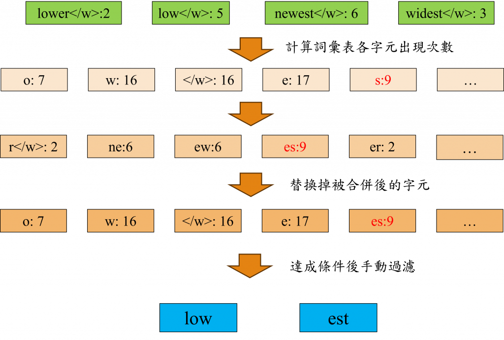

一個優質的模型需要有出色的斷詞策略，這點我們在[【Day 16】解析詞嵌入預訓練模型的奧秘(下)-fastText](https://ithelp.ithome.com.tw/articles/10332218)中瞭解了這些道理，透過Subword來為詞彙建構的這種表達方式，能進而大幅提升效能。

因此在這裡，BERT採用一種名為`BPE(Byte Pair Encoder)`的Subword斷詞法，不過該段詞法從文字敘述上來解釋，可能比較難理解，所以在講解理論的過程中，我將結合程式碼來實現，讓你更易於記住和理解這個過程。

#### 【STPE 1】 將詞彙拆成字元

首先我們需要統計每個詞彙的出現次數，在此過程中我們使用了`vocab`變數進行模擬詞彙的數量。同時我們使用`</w>`來標示每個詞彙的邊界，而在BPE演算中的第一步就是將這些詞彙轉換為字元，再統計這些字元的出現次數。

```
def get_tokens(vocab):
    tokens = collections.defaultdict(int)
    for word, freq in vocab.items():
        word_tokens = word.split()
        for token in word_tokens:
            tokens[token] += freq
    return tokens
    
vocab = {'l o w </w>': 5, 'l o w e r </w>': 2, 'n e w e s t </w>': 6, 'w i d e s t </w>': 3}
# -----------------輸出-----------------
{'l': 7, 'o': 7, 'w': 16, '</w>': 16, 'e': 17, 'r': 2, 'n': 6, 's': 9, 't': 9, 'i': 3, 'd': 3}
```

#### 【STPE 2】 計算鄰近的字元出現次數

接下來BPE算法中會持續**重組詞彙表中所有相鄰的兩個字元**，並計算出這兩個字元重組後在文本中一共出現了幾次。例如，`lo`字元在`low</w>`(出現5次)與`lower</w>`(出現2次)，因此它的出現次數總計為7次。

```
def get_stats(vocab):
    pairs = collections.defaultdict(int)
    for word, freq in vocab.items():
        symbols = word.split()
        for i in range(len(symbols)-1):
            pairs[symbols[i],symbols[i+1]] += freq
    return pairs

pairs = get_stats(vocab)
# -----------------輸出-----------------
('l', 'o'): 7, ('o', 'w'): 7, ('w', '</w>'): 5, ('w', 'e'): 8, ('e', 'r'): 2, ('r', '</w>'): 2, ('n', 'e'): 6, ('e', 'w'): 6, ('e', 's'): 9, ('s', 't'): 9, ('t', '</w>'): 9, ('w', 'i'): 3, ('i', 'd'): 3, ('d', 'e'): 3
```

#### 【STPE 3】 找到組合次數最高的結果並合併

接下來我們還要尋找出組合次數最高的結果，在此案例中`e`與`s`這兩個字元的出現次數是最高的，因此我們將這兩個字元合併成`es`，然後**統計新產生的`es`字元在文章中的出現次數**，接下來我們會使用新結果來取代掉原本的`s`字元(因為出現次數相同)並更新字元詞彙表，如此循環`STEP 1`至`STEP 3`的步驟直到所有條件都達到為止後，我們就能取得斷詞後的SubWord。

```
def merge_vocab(pair, v_in):
    v_out = {}
    bigram = re.escape(' '.join(pair))
    p = re.compile(r'(?<!\S)' + bigram + r'(?!\S)')
    for word in v_in:
        w_out = p.sub(''.join(pair), word)
        v_out[w_out] = v_in[word]
    return v_out
    
best = max(pairs, key=pairs.get)
vocab = merge_vocab(best, vocab)
tokens = get_tokens(vocab)
print(tokens)
# -----------------輸出-----------------
'l': 7, 'o': 7, 'w': 16, '</w>': 16, 'e': 8, 'r': 2, 'n': 6, 'es': 9, 't': 9, 'i': 3, 'd': 3
```

#### 【STPE 4】 設定停止條件

而設定停止條件的方式非常多種，在這裡我主要介紹兩種方式，第一種就是直接設定迴圈次數，但這樣將需要我們不斷地測試合併的結果，若迴圈次數設定不足，將可能導致字元無法有效的重組；反之若設定的迴圈次數過多，則可能會導致分割結果不夠乾淨。

```
num_merges = 10
for i in range(num_merges):
    pairs = get_stats(vocab)
    if not pairs:
        break
    best = max(pairs, key=pairs.get)
    vocab = merge_vocab(best, vocab)
    tokens = get_tokens(vocab)
```

因此第二種方式是我們可以依照**該詞彙的出現次數進行設定**，當某些詞彙出現一定數量時才會停止，例如在我們的範例裡面，我們知道`low`這個詞彙共出現了`7`次，因此我們可以用此作為設立條件讓它自動停止。

```
cnt = 0
while(tokens.get('low') != 7):
    pairs = get_stats(vocab)
    if not pairs:
        break
    best = max(pairs, key=pairs.get)
    vocab = merge_vocab(best, vocab)
    tokens = get_tokens(vocab)
    cnt +=1
    
    print(tokens)
# -----------------輸出----------------- 
'low': 7, '</w>': 7, 'e': 8, 'r': 2, 'n': 6, 'w': 9, 'est</w>': 9, 'i': 3, 'd': 3
```

這時我們可以看到`low`與字跟`est`被有效的分割出來，而這一點當文本資料越大時，該演算法的最終結果越好，不過BERT中的表示方式有一些小改動，它會將最後的結果`est</w>`修改成`##est`，來作為它的詞彙之一。

### NSP(Next Sentence Prediction)


`NSP(Next Sentence Prediction)`是BERT模型的預訓練任務之一，這項任務的目的是讓模型理解文本中，特別是兩個句子之間的主要邏輯關係，透過該方式我們可以判斷**兩個輸入句子是否是連貫的**，也就是「下一句」是否是「前一句」的延續，而在BERT中採用了Segment Embedding的方式來進行編碼，將屬於第一個句子或段落的部分標為`0`，而屬於第二個句子或段落的部分則標記為`1`，並且透過神經網路來訓練已理解這些文本之間的關係。

> **小提示:**
> 
> 在BERT中有三層詞嵌入層，第一層對應到Transformer的Token Embedding這邊兩者是相同的，不過第二層的Position Embedding與Transformer中的Positional Encoder有些不同，雖然兩者看起來相似，但其實有著重要的不同之處。主要的區別在於BERT的位置編碼是可以進行訓練的，然而在Transformer中的位置編碼卻是固定的(Embedding與`sin()`、`cos()`，的轉換差距)。至於第三層的Segment Embedding，它其實就是我們上述所提到的NSP任務中的訊息資訊。

### MLM（Masked Language Model）

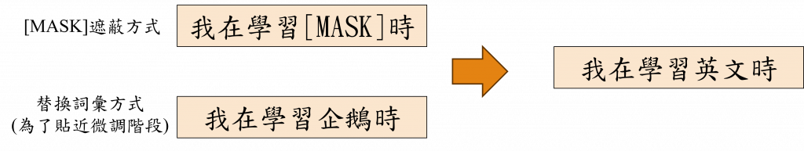

`Masked Language Model (MLM)` 的主要特點是其能夠**預測句子中遺失部分的詞語或標記**，在訓練過程中，BERT會隨機選取輸入文本中的15％詞彙替換成特殊的`[MASK]` 標記，並**要求模型去預測被替換掉的詞彙**，這樣的設計能讓模型能夠學習詞彙間的相依性，同時強化對未見過單詞的泛化能力。

不過在微調階段中並沒有`[MASK]`這樣的標記，因此BERT並不是完全使用`[MASK]`，而是將其替換為其他的詞彙，使其能夠更貼近微調時的效果。而這樣的預訓練方式在後繼的預訓練模型中幾乎已成為必使用的關鍵技術，甚至有很多研究著重在改進這種方法。

### 特殊標籤

在BERT的特殊標籤中，主要有兩個我們可能不太熟悉的標籤，分別是`[CLS]`和`[SEP]`。

| 名稱 | 說明 |
| --- | --- |
| [CLS] | 用於捕獲整個序列的語義信息 |
| [SEP] | 區隔句子的前後文 |
| [MASK] | 遮蔽文字字元，僅出現在預訓練階段 |
| [UNK] | 表示未知字元 |
| [PAD] | 表示填充字元 |
| `[CLS]`標籤的主要用途是提供一種方式，讓模型能夠**利用這個單一標籤來理解整個句子的訊息**，例如:我們輸入`[CLS]今天天氣好嗎?`給模型，BERT的設計者希望模型能夠僅透過`[CLS]`這個標籤就能理解`今天天氣好嗎?`這句話的意義，這樣設計的原因在於BERT的輸出結構會在這個`[CLS]`標籤的序列位子上添加一個簡單的線性分類器，以此作為模型的輸出，而**不是將整個語意訊息融合後再輸出**。 |  |

而`[SEP]`標籤則類似於`<EOS>`的用途，它可以幫助模型識別出第一個句子的結尾，並擔任第一句和第二句之間的分隔標記，並通過神經網路訓練的方式來得到文本之間的前後訊息與關聯性。

以上就是強大的預訓練模型BERT所運用的關鍵技巧，如你所見這一理論與我們先前所學的模型有密切的聯繫，這也正是我想要傳達的核心訊息：在學習自然語言處理的過程中，理解這些理論的重要性不容小覷，而BERT模型的成效，證明了我們先前所學的技術並非在自然語言處理領域中是種短暫性的技術，反而是其基石之一，因此在學習自然語言處理時，溫故知新是至關重要的！

後話
--

至此你應該對自然語言處理的技術用途有更深的理解，而先前我在整個過程中不斷使用程式碼的目的，是希望你能了解這些技術在實踐過程中可能遇到的問題，這些問題在專業論文或理論中並不會提及，透過這種方式你對相關模型的理解將更為深入，不過再次提醒文章中的程式碼只包含重要片段，因此你需要前往我的GitHub查看完整的程式碼，而明天我還是會以這種方式進行學習，所以明天將會是程式碼實作環節，而這次我會教你如何實現使用BERT進行QA問答的任務。

那麼我們明天再見！

內容中的程式碼都能從我的GitHub上取得:

[https://github.com/AUSTIN2526/iThome2023-learn-NLP-in-30-days](https://github.com/AUSTIN2526/iThome2023-learn-NLP-in-30-days)

---

<a id="6669-day-23"></a>

## Day 23｜【Day 23】因為站在巨人的肩膀上才能眺望更遠的風景(下)-使用SQuAD做QA問答

- 原文：https://ithelp.ithome.com.tw/articles/10336290

前言
--

今天我們將會來完成最後一個NLP的任務QA問答，不過你可能會想BERT只有Encoder所以它無法生成文字，那它要怎麼進行回答呢?與Seq2Seq、ChatGPT等生成式的語言模型不同，而BERT它主要是通過文章中的訊息來進行分類，也就是說它的回答必須從原始的文章內容中找尋答案，而今天我們就是要來學習這件事情該怎麼處理，今天的學習重點如下:

1.   `SQuAD`資料集解析與整裡
2.   `BERT`的使用與呼叫方式
3.   `BERT`QA問答的方式與應用

`SQuAD（Stanford Question Answering Dataset）`是由史丹佛大學的研究團隊所建立的，該資料集用於測試模型在閱讀理解任務上的性能，它的資料來源主要來自於維基百科文章中，目前它有多種版本而在這次的任務中我們會使用[SQuAD 2.0](https://huggingface.co/datasets/GEM/squad_v2/blob/main/squad_data/train-v2.0.json)資料集來進行練習，在下方提供的圖片中，我們可以看見這是一個結構複雜且龐大的`JSON`檔案，因此我先將該文件結構整理出來，讓我們可以更方便地理解它。


在該`json`結構中所有的內容都被彙整於`data`節點內，該節點下有多個稱為`object_1`的子節點，而每一個`object_1`節點中包含有專門描述題目的`title`欄位以及具體的題目內容`context`，並且在每一個`object_1`節點中，還參雜了數個稱為`object_2`的子節點，該節點設計存放有關問題的資訊。

在這些`object_2`節點內，存有問題`question`、問題的編號`id`、標示該問題是否有解答的`is_impossible`欄位，以及在`answers`節點中存放的問題解答`text`與該解答在`context`中的起始位置`answer_start`。

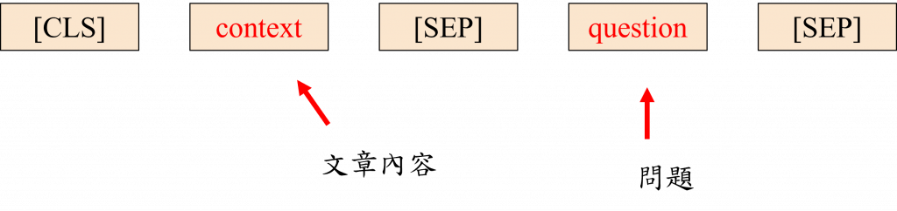

而在今天的任務中我們只會使用到`context`、`question`、`text`、`is_impossible`這四個資料而已，不過在開始實作前我們先來了解BERT是怎麼處理QA任務的。

BERT用於QA的方式
-----------

當我們進行QA任務時，答案會是來自`context`中的一段文字範圍，因此對於該模型的標籤，我們需建立答案在`context`中起始位置與結束位置這兩個索引值，因此在模型輸出的方面我們需要計算出兩個輸出向量。而這兩個向量的計算方式就是對BERT的輸出進行softmax運算後產生的最大機率位子，因此該層的輸出大小必須與**文字序列的長度相同**，這樣當我們可以把起始位子視為`1`，其他位子視為`0`時(結束位置也要做相同操作)，模型便能進行損失值的計算。


在BERT的模型架構中，`[CLS] context [SEP]`是模型的第一句輸入，也是我們最終要處理QA任務時的答案範圍區域，透過`[SEP]`與Segment Embedding的設定使模型能學習**答案的輸出範圍**，而在第二句中的`question [SEP]`將做為模型的第二句輸入，由於兩句輸入Segment Embedding的輸入數字不同，所以`question [SEP]`不會被視為第一句的資料，如此一來模型就能夠來理解第二句的資訊，並從第一句的序列中找到正確的答案範圍。接下來我們來看看該如何用程式處理這一項任務吧。

### 【STEP 1】讀取JSON資料

我們之前提到這個資料集是`JSON`格式的，因此我們無法用同讀取`txt`檔的方式來讀取它，如果嘗試用`txt`的`readlines()`函數，你會發現資料整理起來非常困難。

所以為解決這個問題，我們需要引入`import json`來幫助我們將`json`資料轉換為`list`和`dict`形式，藉以讓我們更方便地整理資料，而它的使用方式就是將先前所使用的`readlines()`函數替換掉而已

```
# pip install json
import json 

def load_json_data(path):
    with open(path) as f:
        json_data = json.load(f)
    return json_data['data']

json_datas = load_json_data('data/train-v2.0.json')
```

### 【STEP 2】BERT Tokenizer

在我們之前的步驟中，都是使用了TorchText作為斷詞的工具但這次我們不再需要了，因為我們將要使用的BERT是一種極具熱度的模型，而這類模型都被Hugging face公司所收錄，因此可以透過他們的API輕易下載與使用。其中他們針對了不同的預訓練模型製作了不同的斷詞器，而這個斷詞器能將大量資料快速地轉換成張量，進行填充，以及文字轉數字等功能，我們可以使用以下的程式碼來使用該斷詞器。

```
# pip install transformers
from transformers import AutoTokenizer
tokenizer = AutoTokenizer.from_pretrained("deepset/bert-base-cased-squad2")
```

在上述的程式中，`deepset/bert-base-cased-squad2`代表我們今天使用的模型型號，其他的型號我們可以在[這個網站中](https://huggingface.co/models?search=bert)找到不同語言與任務的BERT版本。

不過BERT的模型輸入方式比較特殊，特別是在問答(QA)的部分，因此我們在此先了看到下方程式來瞭解一下該段詞器中的返回參數有哪些吧。

```
a_sent = 'Hello My Name Is Austin'                   # 第一句
b_sent = "What Is your name"                         # 第二句
new_sent = tokenizer(a_sent, b_sent)                 # 斷詞並轉換成數字
decode_sent = tokenizer.decode(new_sent.input_ids)   # 數字轉換成文字
print(new_sent)
print(decode_sent)
# -------------輸出-------------
{'input_ids': [101, 8667, 1422, 10208, 2181, 5202, 102, 1327, 2181, 1240, 1271, 102], 'token_type_ids': [0, 0, 0, 0, 0, 0, 0, 1, 1, 1, 1, 1], 'attention_mask': [1, 1, 1, 1, 1, 1, 1, 1, 1, 1, 1, 1]}
[CLS] Hello My Name Is Austin [SEP] What Is your name [SEP]
```

在上述的程式碼執行結果中，我們可以看到該**斷詞器後可以一次處理兩個句子**，並把它們轉換成`input_ids`、`token_type_ids`以及`attention_mask`三種輸出形式。

首先`input_ids`是將詞彙轉換為數字的結果；`token_type_ids`則是配合Segment Embedding層運作，該項目中的`0`和`1`代表了第一句和第二句，並且在第一句中的`[SEP]`標籤被標記為`0`，因為這個標籤與我們以前介紹過的`<EOS>`特殊標籤含義相同，都是用於判斷文字的結尾；而`attention_mask`則代表了遮蔽機制，在進行需要填充資料的任務時，需在相對應的位置需設定為`0`。

### 【STEP 3】整理json資料

在這個步驟中我們需要取出`json`中的`context`，使其做為我們的第一句，不過一個`context`中可能包含多個`question`，所以我們需要先取出`context`，再將其與後續的`question`進行組合，才能形成一組完整的訓練資料。

而對於`context`的處理我們可以透過迴圈的方式，先將第一個`object_1`的資料提取出來。

```
#存放資料用
input_data = {'input_ids':[], 'token_type_ids':[], 'attention_mask':[], 'start_positions':[], 'end_positions':[]}    

for json_data in json_datas:
    
    paragraphs = json_data['paragraphs'][0]
    
    # 取得內文
    context = paragraphs['context']
    
    # 取得QA資料
    qas = paragraphs['qas']
```

接下來我們將撰寫一個函數，其功能是確定我們**答案在問題之中的位置**，這是因為BERT使用BPE斷詞方式，所以實際的詞彙長度將會大於原始長度，因此我們不能直接使用`answer_start`提供的位置，而在這裡我們就需要通過**將答案與內文轉換成數字**，然後再將其組合，之後才能更新開頭與結尾的索引已找到正確的答案位置。

```
def find_target_sublist(my_list, target_sublist):
    target_length = len(target_sublist)
    for i in range(len(my_list)):
        if my_list[i:i + target_length] == target_sublist:
            return i, i + target_length
```

接下來我們可以進一步透過另一個迴圈將所有問題與內文結合，並通過上述的函數來計算出答案實際存在的位置，不過我們需要注意在該資料集中，有些文字沒有完整的斷詞，並且還有一些答案實際上並不存在於內文中，因此我在此將這部分的資料省略。

但更為正確的處理方式應該是，當問題與內文結合後，若標籤為`is_impossible`，則將設定起始位置及結束位置為`0`，這樣一來，只要程式回傳兩個`0`的標籤，我們就能判斷該答案是否無解。

```
for qa in qas:
        if not qa['is_impossible']: # 不使用不可能的QA解答
            # 取得問題
            question = qa['question']   

            # 取得答案
            answers = qa['answers'][0]['text']
            answers_ids = tokenizer(answers).input_ids[1:-1]

            # 轉換成數字
            inputs = tokenizer(context, question, return_tensors="pt")
            inputs_ids = list(inputs.input_ids[0])

            #更新答案位子
            start_positions, end_positions = find_target_sublist(inputs_ids, answers_ids)
            start_positions, end_positions = torch.tensor([start_positions]), torch.tensor([end_positions])
            
             # 存入字典中
            input_data['input_ids'].append(inputs.input_ids[0])
            input_data['token_type_ids'].append(inputs.token_type_ids[0])
            input_data['attention_mask'].append(inputs.attention_mask[0])
            input_data['start_positions'].append(start_positions)
            input_data['end_positions'].append(end_positions)
```

這一次我們存放資料的方式不是採用`list`，而是選擇使用`dict`的方式，這種作法的好處是我們可以透過`**arg`的形式，直接將參數傳給模型，而當我們這樣做時`key`將代表傳入的參數欄位，`value`則代表傳入的值，我們可以先看到已下的範例。

```
def f(a, b, c):
    print(a, b, c)
    
arg = {'a':1, 'b':2, 'c':3}
f(**arg)
# -------------輸出-------------
1 2 3
```

當然使用這樣的方式還是需要將資料給填充到相同的維度，這時我們只需將所有的值補上`0`即可，因為在BERT中attention_mask只要為0，其他值都不會被計算到。

```
input_data = {k:pad_sequence(v, padding_value=0, batch_first=True) for k, v in input_data.items()}
```

### 【STEP 4】建立訓練資料

當我們在建立`Dataset()`和`DataLoader()`時，由於我們的資料為`dict()`格式，所以我們無法直接利用之前的`train_test_split()`來分割資料，這時我們需要借助於另一種方式`random_split()`來切割，這種切割方式可以將已經包裝好的`Dataset()`以及訓練和驗證的樣本數量作為輸入就能夠輕易使用了。

```
from torch.utils.data import Dataset, DataLoader
class QADataset(Dataset):
    def __init__(self, data):
        self.data = data

    def __getitem__(self, index):
        return {k:v[index] for k, v in self.data.items()}     
        
    def __len__(self):
        return len(self.data['input_ids'])

dataset = QADataset(input_data)

train_simple = int(len(input_data['input_ids']) * 0.8)
valid_simple = len(input_data['input_ids']) - train_simple
trainset, validset = torch.utils.data.random_split(dataset, [train_simple, valid_simple])

train_loader = DataLoader(trainset, batch_size = 32, shuffle = True, num_workers = 0, pin_memory = True)
valid_loader = DataLoader(validset, batch_size = 32, shuffle = True, num_workers = 0, pin_memory = True)
```

### 【STEP 5】建立模型與優化器

在使用基於為調版本的預訓練模型時，我們無需自行搭建一個完整的模型架構，因為在這些函式庫內都已經為我們做好了這個工作，因此我們只需指定模型的版本，讓程式就會自動下載並導入該模型的權重，就能夠完成模型的建立了。

```
import torch.optim as optim
device = torch.device('cuda' if torch.cuda.is_available() else 'cpu')
model = BertForQuestionAnswering.from_pretrained("deepset/bert-base-cased-squad2").to(device)
optimizer = optim.Adam(model.parameters(), lr=1e-4)
```

### 【STEP 6】建立訓練函數

在建立訓練函數時我們需要了解一個BERT模型的輸出包含哪些資料，我們可以先觀察以下這個模型的輸出結果:

```
QuestionAnsweringModelOutput(loss=tensor(1.3877, device='cuda:0', grad_fn=<DivBackward0>), start_logits=tensor([[-5.4010, -4.5337, -3.8622,  ..., -8.9466, -8.9047, -9.0650],
        [-6.0552, -2.0189,  3.2075,  ..., -9.2172, -9.2660, -9.2848],
        [-4.3217,  0.3849, -2.1667,  ..., -9.3862, -9.4180, -9.4363],
        ...,
        [-5.9702, -2.4483, -6.4202,  ..., -8.9942, -9.0365, -9.0596],
        [-4.7156, -3.0598, -6.9935,  ..., -9.3051, -9.2981, -9.3762],
        [-6.3898, -3.7676, -5.8136,  ..., -9.2414, -9.2260, -9.2718]],
       device='cuda:0', grad_fn=<CloneBackward0>), end_logits=tensor([[-4.8597, -4.5322, -5.3140,  ..., -8.7468, -8.7832, -8.6681],
        [-4.9756, -2.8353, -1.3049,  ..., -8.5606, -8.5292, -8.5106],
        [-4.5155, -5.0386, -3.8397,  ..., -8.4292, -8.4087, -8.3857],
        ...,
        [-4.9849, -4.3610, -5.4201,  ..., -8.6628, -8.6316, -8.5959],
        [-4.5276, -5.3441, -2.6401,  ..., -8.4837, -8.4688, -8.3980],
        [-5.9687, -3.2888, -3.1393,  ..., -8.5364, -8.5641, -8.5204]],
       device='cuda:0', grad_fn=<CloneBackward0>), hidden_states=None, attentions=None)
```

在這個結果中我們需要理解`loss`、`start_logits`、和`end_logits`的實際意義，首先`loss`代表了我們這次運算的損失值，這是因為模型內部已經定義了損失函數，所以我們不需要再自行定義，而`start_logits`和`end_logits`則反映了我們在文字輸出序列上的機率值。

當然我們也可以選擇不用模型給出的損失函數，而是透過這兩個機率值與實際輸出進行計算，而在訓練函數的最簡單架構方式就是直接取出損失值並進行反向傳播。

```
from tqdm import tqdm
import matplotlib.pyplot as plt 

def train(epoch):
    train_loss, train_acc = 0, 0
    train_pbar = tqdm(train_loader, position=0, leave=True) # 宣告進度條
    
    model.train() 
    for input_datas in train_pbar: 
        for key in input_datas.keys():
            input_datas[key] = input_datas[key].to(device)
        optimizer.zero_grad() 
        
        outputs = model(**input_datas) 
        
        loss = outputs.loss

        loss.backward()
        optimizer.step() 
        
        train_pbar.set_description(f'Train Epoch {epoch}') 
        train_pbar.set_postfix({'loss':f'{loss:.3f}'})

        train_loss += loss.item()  
    return train_loss/len(train_loader)
```

### 【STEP 7】訓練與評估

我們使用相同的`early stopping`策略和以loss值為指標來訓練模型，考慮到這段程式碼已經出現過許多次，就不再進行詳細的解釋了。

```
epochs = 100                             # 訓練次數
early_stopping = 10                      # 模型訓練幾次沒進步就停止
stop_cnt = 0                             # 計數模型是否有進步的計數器
model_path = 'model.ckpt'                # 模型存放路徑
show_loss = True                         # 是否顯示訓練折線圖
best_loss = float('inf')                 # 最佳的Loss
loss_record = {'train':[], 'valid':[]}   # 訓練紀錄

for epoch in range(epochs):   
    train_loss = train(epoch)
    valid_loss = valid(epoch)
    
    loss_record['train'].append(train_loss)
    loss_record['valid'].append(valid_loss)
    
    # 儲存最佳的模型權重
    if valid_loss < best_loss:
        best_loss = valid_loss
        torch.save(model.state_dict(), model_path)
        print(f'Saving Model With Loss {best_loss:.5f}')
        stop_cnt = 0
    else:
        stop_cnt+=1
    
    # Early stopping
    if stop_cnt == early_stopping:
        output = "Model can't improve, stop training"
        print('-' * (len(output)+2))
        print(f'|{output}|')
        print('-' * (len(output)+2))
        break

    print(f'Train Loss: {train_loss:.5f}' , end='| ')
    print(f'Valid Loss: {valid_loss:.5f}' , end='| ')
    print(f'Best Loss: {best_loss:.5f}', end='\n\n')

if show_loss:
    show_training_loss(loss_record)
# -------------輸出-------------
Train Epoch 1: 100%|███████████████████████████████████████████████████████| 59/59 [00:40<00:00,  1.45it/s, loss=1.482]
Valid Epoch 1: 100%|███████████████████████████████████████████████████████| 15/15 [00:03<00:00,  4.08it/s, loss=1.155]
Saving Model With Loss 1.28788
Train Loss: 0.90966| Valid Loss: 1.28788| Best Loss: 1.28788
```

在這次的訓練結果中，你會發現該模型的收斂速度相當的快速，模型在第2次訓練時已達到最佳的效能值，不過在後續的訓練中你可能會發現模型的Loss值持續上升，而這情況的產生主要是因為BERT屬於微調型預訓練模型，也就是除了最後一層的輸出有所變化外，其他層面的基本不會有太大的變動，所以當我們完成第2次訓練後，最後一層的輸出便已被訓練到最佳狀態，這樣就容易導致Overfitting的問題，所以為了預防這種情況，我們在訓練過程中，只會保存最佳的結果。

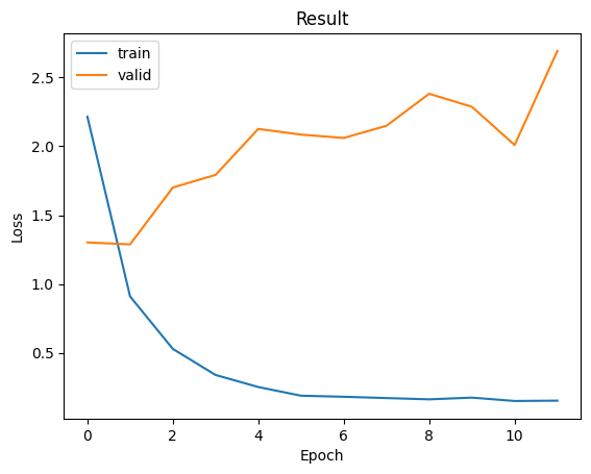

### 【STEP 8】實際應用

在我們的模型訓練完成後，我們可以用驗證資料集來進行預測，不過在此之前，我們需要先讀取模型的權重，然後再進行預測，在這裡注意我們輸入的資料必須先放入到GPU中，不然程式將出現錯誤

```
model = BertForQuestionAnswering.from_pretrained("deepset/bert-base-cased-squad2").to(device)
model.load_state_dict(torch.load(model_path))

preds = next(iter(valid_loader))
for k in preds:
    preds[k] = preds[k].to(device)
output = model(**preds)
```

在模型預測完畢後，我們需要先取得所有`batch_size`大小的`start_logits`與`end_logits`，接著透過`argmax()`這個方法來尋找最大機率對應的座標，而在這裡只會取出其中一個`batch_size`的結果作為範例。

```
IDX = 13

start = preds['start_positions'][IDX]
end = preds['end_positions'][IDX]

pred_start = output.start_logits.argmax(dim = 1)[IDX]
pred_end = output.end_logits.argmax(dim = 1)[IDX]
```

當我們有了位子的資料後還仍需進行一些處理，因為在訓練期間為讓訓練長度保持一致，我們填入了`0`也就是 `[PAD]` 標籤的索引值，所以在取出資料時就會出現一對`[PAD]`標籤，所以我們在此階段就需要把它們過濾掉再進行解碼的動作。同時`[CLS]`和`[SEP]`也需要被過濾掉，所以在這裡我選擇了**先去除開頭兩個標籤**再進行數字轉為詞彙的動作，並透過連接第一與第二句中間的`[SEP]`索引，來有效分割出問題與答案。

```
input_ids = preds['input_ids'][IDX] 
input_ids = input_ids[input_ids !=0]

context, question = tokenizer.decode(input_ids[1:-1]).split('[SEP]')                                                               
pred_answer = tokenizer.decode(input_ids[pred_start:pred_end])
answer = tokenizer.decode(input_ids[start:end])

print('文章內容:', context)
print('問題:', question.strip())
print('預測解答:', pred_answer)
print('實際解答:', answer)
# -------------輸出-------------
文章內容: Scientists do not know the exact cause of sexual orientation, but they believe that it is caused by a complex interplay of genetic, hormonal, and environmental influences. They favor biologically - based theories, which point to genetic factors, the early uterine environment, both, or the inclusion of genetic and social factors. There is no substantive evidence which suggests parenting or early childhood experiences play a role when it comes to sexual orientation. Research over several decades has demonstrated that sexual orientation ranges along a continuum, from exclusive attraction to the opposite sex to exclusive attraction to the same sex. 
問題: What three factors do scientists believe are the cause of sexual orientation?
預測解答: genetic, hormonal, and environmental
實際解答: genetic, hormonal, and environmental
```

現在你可以試著更改`IDX`的索引值，你將會發現預測解答與實際解答所顯示的結果大多都是完全相符的，而這種做法使我們得以見識到，BERT在回答問答題時展現了極大的效能，並且由於訓練時間快，因此許多企業非常喜歡使用BERT來做為他們的語言模型。

後話
--

現在你已知道，擁有僅有`Encoder架構`的模型，其基本上主要適合從分類的角度來處理文字，這也是`BERT`模型的主要問題之一，因為它無法有效處理某些NLP任務，頂多可視為一個非常強大的分類模型，因此在後續的模型改良中還有`BART`這類完整`Encoder-Decoder`的架構，並且該模型的延伸可說是2018年~2022年之間的熱門議題，因此BERT的模型變種也是目前最多的一種預訓練模型，如果對這部分有興趣可以到Hugging face觀看該模型的各種版本。而在明天我會告訴你有關`BERT`這一個模型的死對頭，也就是ChatGPT的老祖宗`GPT-1`、`GPT-2`和`GPT-3`所使用的技術。

那麼我們明天再見！

內容中的程式碼都能從我的GitHub上取得:

[https://github.com/AUSTIN2526/iThome2023-learn-NLP-in-30-days](https://github.com/AUSTIN2526/iThome2023-learn-NLP-in-30-days)

---

<a id="6669-day-24"></a>

## Day 24｜【Day 24】用暴力美學屹立於不敗之地(上) - GPT家族的霸道之路

- 原文：https://ithelp.ithome.com.tw/articles/10337089
- 發佈時間：2023-10-09 21:01:59

前言
--

若把BERT視為Transformer Encoder的代表，那麼GPT則可以說是Decoder的最佳代表，不過基於Decoder的模型會有一些小問題存在，而該問題就是它較難以理解語意，不過但在GPT中透過增加模型大小和訓練資料，這種簡單但有效的方式解決這個問題，也因這兩種模型具有完全相反的特性，所以往往被用來進行比較，所以今天我們將重點探討GPT家族在訓練模型時所採用的方法。今天學習重點如下：

1.   學習`GPT`的不同版本
2.   理解`zero-shot`與`few-shot`
3.   學會`MAML`演算法與`meta learning`的概念

GPT-1
-----

GPT-1是在ELMo模型出現一年後誕生的這也是最初的GPT版本，而它之所以會出現，主要是因為傳統的自然語言模型需利用大量數據進行監督式學習以完成預訓練任務，然而這種基於監督式學習的語言模型，不但**需要花費大量時間來標註標籤**，並且訓練完畢後的模型也無法一次解決所有自然語言處理的任務。

因此GPT-1採用了一種稱為`自回歸(Autoregressive)`的訓練方式 (`x(0)~x(t-1)用來預測x(t)`)，這是因為對於文字資料來說，**當前時間點的起始值會受到先前時間點起始值的影響**，因此只需利用**過去的幾個時間點的資訊**便能預測未來的起始值。

這種概念與我們之前學過的Word2Vec的CBOW相似，唯一的區別在於它是採用**單向操作**而非CBOW的雙向表示，不過GPT-1採用了12個Transformer Decoder，並充分利用了Transformer的Multi-head Attention特性，因此在語義表達上比Word2Vec更為豐富，而選擇使用Decoder的主要原因在於，因為作者希望透過**生成而非分類的方式來完成所有的自然語言任務**。

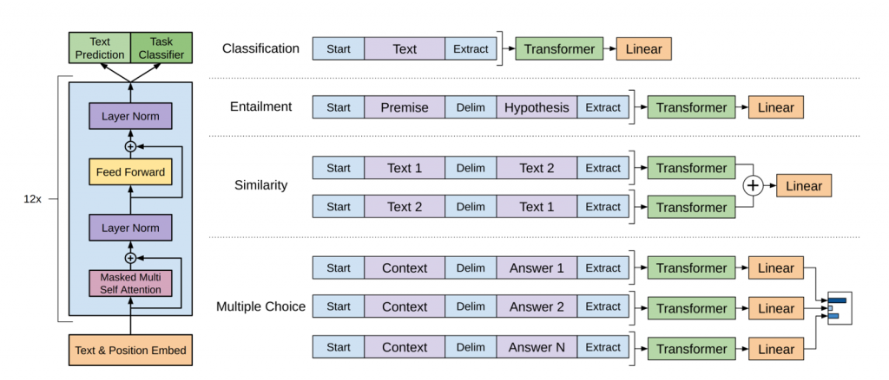

> 圖片來源:[Radford, A., Narasimhan, K., Salimans, T., & Sutskever, I. (2018). Improving language understanding by generative pre-training.](https://s3-us-west-2.amazonaws.com/openai-assets/research-covers/language-unsupervised/language_understanding_paper.pdf)

雖然GPT-1的設計讓它成為一個通用模型，但在特定領域的任務處理時仍然是需要微調的，如上圖所示在處理`分類（Classification）`的任務時，它會在輸出端接上一個線性分類器以進行分類；而第二項`Entailment（文字蘊涵）`的任務，它需要判斷兩句間的關聯性，這與BERT中的NSP任務有點類似；第三項任務它會進行`相似度（Similarity）`分析，是透過`孿生網路（Siamese networks）`的結構比對兩句的輸出並計算其關聯性；最後`Multiple Choice`任務，它就是我們昨天進行的QA任務，只不過它的作法是將文章內容與問題結合，並將答案視為第二句，因為GPT主要的主要概念是推理，而非跟BERT一樣是分類。

在2018年GPT-1在九項任務中表現卓越成為了該領域的`領先模型(state-of-the-art, SOTA)`，雖然未經微調的GPT-1在各項任務中也顯示出一定的效果，但其在未經微調的任務中的泛化能力遠不及經過微調的有監督任務，因此該模型的的實驗結果可說是不如預期，因它最初的概念就是成為一個全面的語言模型。

GPT-2
-----

GPT-1的模型擁有約1億的參數量，並採用了約5G的BooksCorpus資料集進行訓練，上面我們有提到雖然此方法取得了不錯的效果，但並未滿足GPT的野心。於是GPT-2在模型參數量和資料集的規模上進一步提升，它選用了約15億的參數量（48層的Transformer Decoder）並從Reddit收集了40GB的文本資料進行訓練。

而該模型的出現就是為了驗證GPT-1的理念「只要語言模型的容量和使用的資料量能夠充足，該模型便能適應多元的任務」，而這個理念相當直觀就是把**所有的驗證集都都能被當成是訓練集就是GPT-3的核心原理**

而經過實驗的結果GPT-2僅透過zero-shot的方式就在八項任務中的七項成為了SOTA模型，然而由於其參數量過大，所以導致在微調上基本上沒有太大的變化，甚至可能出現微調後效能反而降低的情況。

> **小提示:**
> 
> 「Zero-shot」指的是在輸入模型的文本中，不提供任何參考樣本的方式。例如當我們向模型提出問題：「數字8是多少？」模型需要自行推理出答案，這種方式就是zero-shot。然而如果我們提供一組參考數據，例如「2 4」、「6 8」，這樣子模型推理出的答案可能會更準確，這種方法則稱為「few-shot」。

GPT-3
-----

雖然GPT-2在微調上的表現並未達到理想效果，但它卻證明只要不斷增加資料量與模型大小，便有可能達成通用模型的目標，因此GPT-3直接**使用了1750億的模型參數量**（當時第二大的模型參數量只有200億），並利用45TB從網路上取得的資料進行訓練，

而在GPT-3這個模型中，它所要完成的目標就是希望透過結合few-shot與zero-shot的概念來解答所有有關於文字的任務。因此它需要使用一種名為`元學習（meta learning）`的訓練方式，這種學習方式**是一種透過學習結果進行學習的方法**。

GPT-3則是使用了一種名為`MAML（Model-Agnostic Meta-Learning）`的元學習策略，該策略的目標是學習一個能夠代表所有任務的`meta initialization（元初始化參數）`，為了學習這個參數，我們需要將每個自然語言任務依照其性質分為`support set（支援集）`和`query set（查詢集）`。


在MAML的過程中首先利用支援集來進行`內循環（Inner Loop）`的訓練，也就是針對每一個獨立任務進行學習，然後模型會進入`外循環（Outer Loop）`的階段，在此階段中則會檢視內循環得出的學習結果，以此並更新meta initialization，將其結果更新再回到內循環進行訓練，將下來不斷反覆循環到meta initialization不再有所變化時模型就訓練完畢了。

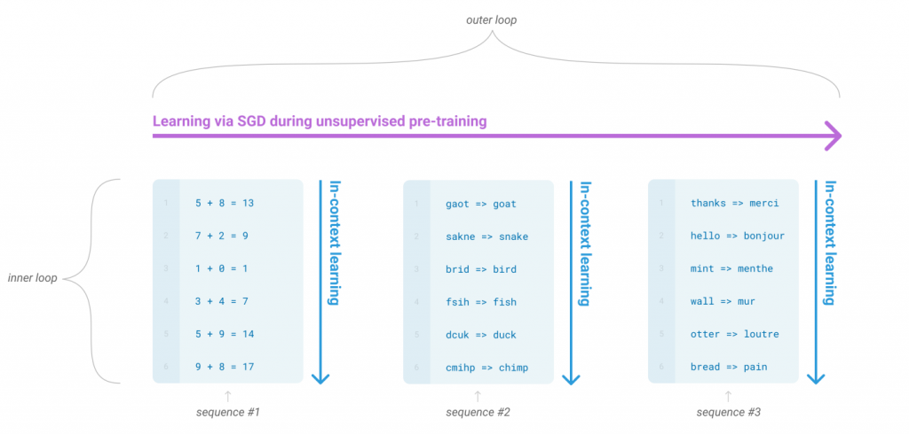

> 圖片來源:[Brown, T., Mann, B., Ryder, N., et.al. (2020). "Language models are few-shot learners" in neural information processing systems, 33, 1877-1901.](https://arxiv.org/pdf/2005.14165.pdf)

在該論文的圖片中，還介紹了一種名為`In-Context Learning(上下文學習)`的方法，這指的是在內循環中的每一個支援集的分類方式，所有相似的任務都應該劃分到同一個支援集裡，因為我們在詢問問題時通常是在同一個領域內，透過這種訓練方式，GPT-3能夠根據上下文更精準地回答問題。


> 圖片來源:[Brown, T., Mann, B., Ryder, N., et.al. (2020). "Language models are few-shot learners" in neural information processing systems, 33, 1877-1901.](https://arxiv.org/pdf/2005.14165.pdf)

根據GPT-3的實驗結果，證實**模型參數量越高，並配合越多的few-shot實際效果將越出色**，而在GPT-3的實驗還比較了在有`Prompt`與無`Prompt`兩種情境下的效能差異。所謂的`Prompt`是指在問題開始處加入特定語境設定，例如當我們需要進行翻譯任務時，會輸入`翻譯中文到英文:你好`，其中的`翻譯中文到英文:`即是`Prompt`的一種應用。

GPT-3的效果無疑是2020年中最強的模型，而它與Google所開發的模型之間存在著深深的競爭關係，每當Google開發出新的模型，GPT就會響應著推出更強的模型從時間線上來看`ELMo -> GPT1 -> BERT -> GPT2 -> T5 -> GPT3`，不過前幾個模型之間的效能相差並不大，但自GPT-3誕生之後則遠遠超過了先前的模型。但GPT-3並未開源且在模型訓練上較困難，因此多數企業仍選擇使用BERT作為語言模型。

後話
--

現在你應該能理解為何這篇文章的標題是「用暴力美學屹立於不敗之地」了吧！這種需要大量訓練的模型已變成現在自然語言處理的主流，他們被統稱為`大型語言模型（Large Language Model, LLM）`，當然要建立出這類的模型還是依賴於我們先前所學習的所有技術。明天我將會透過GPT-J來教你如何微調只有Decoder架構的模型。

那麼我們明天再見！

內容中的程式碼都能從我的GitHub上取得:

[https://github.com/AUSTIN2526/iThome2023-learn-NLP-in-30-days](https://github.com/AUSTIN2526/iThome2023-learn-NLP-in-30-days)

---

<a id="6669-day-25"></a>

## Day 25｜【Day 25】用暴力美學屹立於不敗之地(下) - 用GPT-J來告訴你大型語言模型該如何用LoRA微調

- 原文：https://ithelp.ithome.com.tw/articles/10337638

前言
--

雖然GPT可以像BERT一樣利用起始與結尾進行訓練，但這樣會讓今天的內容顯得無趣，因此我將用ChatGPT的概念讓GPT-J在閱讀完SQuAD的文章後進行推理並得出答案，不過今天我們訓練的ChatGPT的模型參數量實在太大，所以我會教你該如何微調大型語言模型，並探討GPT如何生成這些文字的方式，今天的學習重點如下:

1.   `LoRA`技術簡介
2.   `PEFT`函式庫的安裝與使用
3.   `GPT-J`實作與生成

LoRA(Low-Rank Adaptation)
-------------------------

在微調大型語言模型時我們一定會遇到一個問題也就是**GPU的記憶體不夠大!!!**所以我們再調整模型使往往要用到更多張的GPU或是一些特殊的方法，而在今天因為我們要使用的`GPT-J`是擁有60億的參數的大型語言模型，這使得我們就算用24GB記憶體的RTX 3090顯卡進行訓練，**也無法將它和訓練數據同時放入GPU進行運算**，當然解決策略並不是投資在更多昂貴的顯示卡上，而是用`LoRA(Low-Rank Adaptation)`這項技術來幫助我們解決這個問題。

LoRA這項技術的主要理念是在我們微調模型時，將每一層的輸出都定義為原始權重`W`加上更新的權重ΔW(`h = Wx + ΔW`)，而在微調模型的目標就是要計算出`ΔW`的數值，但我們在求取`ΔW`的值需經過前向與反向傳播的計算，因此需要花費更多的記憶體空間去追蹤這些梯度的操作，並且在訓練時間也會增加，所以作者大膽地提出**可以訓練一個體積更小的`可訓練權重（Trainable Weight）`來省去一些複雜計算的步驟**。

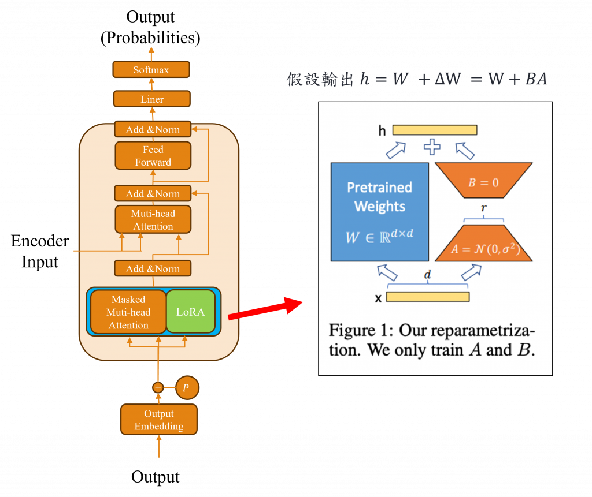

基於這個原理在LoRA所採取的策略是利用`近似低秩矩陣（Low-Rank Matrix Approximation）`來降低原始層權重`W`並**通過這個近似低秩矩陣求出新的答案**，同時將部分的層數凍結防止進行反向傳播，同時因模型使用的是`32bit`來建立的，所以其記憶體使用率較高，因此在這個過程中還能將資料型態轉換為`8bit`以大幅縮小模型的大小。最後在建立完畢近似低秩矩陣後，我們還需要建立特定層的權重矩陣`B`，這樣子讓在模型進行前向傳播時僅需運算`BA`，就可取代大量的運算。


> [Aghajanyan, A., Zettlemoyer, L., & Gupta, S. "Intrinsic dimensionality explains the effectiveness of language model fine-tuning", In arXiv preprint.](https://arxiv.org/pdf/2012.13255.pdf)

而根據實驗結果LoRA的效果甚至比傳統微調更出色，而對於這些大型語言模型的Transformer架構最需要LoRA的部分是Muti head attention的`q`、`k`、`v`、和`o`層，在上圖揭示了attention向量的`q`、`k`、`v`、`o`以及進行降維的`r`(Rank)與模型效能之間的相關性。

用大型語言模型GPT-J來推理SQuAD資料
----------------------

現在你已經懂了LoRA的技術員裡，所以我將教你如何利用這項技術來完成我們今天的QA任務。而在程式中我們需要通過Hugging Face打造的`PEFT`函式庫，這個函式庫已經完美包裝了大型語言模型的LoRA方式，使我們能夠大幅縮短程式撰寫時間，接下來就讓我門看看該如何使用它來微調GPT-J吧！

### 【STEP 1】 安裝依賴函式庫

在PEFT中需要使用非常多的相關函式庫，雖然官方有提供範例供我們參考，但這些函式庫卻多數與最新版的Pytorch和Windows不相符，因此我們首要的任務是確認自己的Pytorch版本是否低於CUDA 11.6版，這是因為在相關函式庫中`bitsandbytes`只支援到CUDA 11.6版。

雖然我們可以不安裝它，但這個函式庫的重要性不容忽視，它能夠幫我們把模型從`32bit`轉換成`8bit`，若版本確實低於CUDA 11.6，我們只需要直接輸入以下的`pip`指令即可，如此Windows版本的PEFT安裝便告一段落。

```
pip install -q accelerate loralib jmespath
pip install -q git+https://github.com/huggingface/transformers.git@main git+https://github.com/huggingface/peft.git
pip install bitsandbytes --prefer-binary --extra-index-url=https://jllllll.github.io/bitsandbytes-windows-webui
```

不過若你是Mac或是linux的用戶你需要輸入下方的指令才能夠正常安裝。

```
pip install -q accelerate loralib jmespath
pip install -q git+https://github.com/huggingface/transformers.git@main git+https://github.com/huggingface/peft.git
pip install -q bitsandbytes
```

### 【STEP 2】下載GPT-J


下載GPT-J的方法我們同樣的可以從Hugging Face網站來取得，而我們可以到[這個連結](https://huggingface.co/models?search=GPT-J)中，搜尋GPT-J來找到最適合你的版本，而這次我們以最初的版本`gpt-j-6B`進行訓練。

```
from transformers import AutoModelForCausalLM

model = AutoModelForCausalLM.from_pretrained(
    "EleutherAI/gpt-j-6B",
    load_in_8bit=True, 
    device_map='auto',
)
```

在程式中我們只需輸入模型的名稱即可透過API下載該模型。但必須記住我們必須在參數上要加上`load_in_8bit=True`，如此模型才能被轉換成`8 bit`，同時我們需要使用`device_map='auto'`來自動指派模型被傳入的GPU設備。

### 【STEP 3】凍結參數並轉換模型參數

現在我們已將模型架構轉換成`8bit`型態，並且當前的資料型態為`float32`，而我們可以通過轉換型態的方式來增加訓練速度，因此我們可以透過`model.parameters()`讀取所有的參數，同時關閉梯度追蹤功能以凍結它們的權重。

```
for param in model.parameters():
  param.requires_grad = False 
  if param.ndim == 1:
    param.data = param.data.to(torch.float16)
```

接下來我們需要使用`gradient_checkpointing_enable`來減少記憶體的使用量，並且使用`enable_input_require_grads`讓模型的Embedding層能夠更適合當前的任務，尤其是我們有加入Special token時更需要開啟`enable_input_require_grads`。

```
model.gradient_checkpointing_enable()  
model.enable_input_require_grads()
```

最後我們需要修改模型的輸出層，因為該層並非模型本身的一部分，而是在微調階段時才加入的，所以我們需要單獨去修改它，而今天我們需要修改的最後一層，你可以透過以下的程式碼找到該層參數的名稱。

```
print(model)
# --------------輸出----------
PeftModelForCausalLM(
  (base_model): LoraModel(
              .
              .
              .
      (lm_head): CastOutputToFloat(
        (0): Linear(in_features=4096, out_features=50400, bias=True)
      )
    )
  )
)
```

此時我們可以明瞭`lm_head`在程式中即為模型的輸出，在這裡修改它的方法需重新建立一個繼承了`lm_head`的子類，並將其修改為`float16`的形式即可。

```
class CastOutputToFloat(nn.Sequential):
  def forward(self, x): return super().forward(x).to(torch.float16)
model.lm_head = CastOutputToFloat(model.lm_head)
```

### 【STEP 4】啟用LoRA

在`PEFT`的函式庫中我們只需要透過`LoraConfig()`來設定`r`、`lora_alpha`以及`target_modules`等參數，即可於指定層數添加LoRA的功能，而這次我主要針對Attention中的`q`、`v`向量進行運算，因此我則選擇了`q_proj`與`v_proj`作為微調的部分，若你有其他想要訓練的層數你可以通過`print(model)`來找出這些參數的名稱。

```
from peft import LoraConfig, get_peft_model 

config = LoraConfig(
    r=16,
    lora_alpha=32,
    target_modules=["q_proj", "v_proj"],
    lora_dropout=0.05,
    bias="none",
    task_type="CAUSAL_LM"
)

model = get_peft_model(model, config)
```

接下來我們可以使用下列的程式來計算模型經過LoRA後，來看看剩餘的參數總數。

```
def print_trainable_parameters(model):
    trainable_params = 0
    all_param = 0
    for _, param in model.named_parameters():
        all_param += param.numel()
        if param.requires_grad:
            trainable_params += param.numel()
    print(
        f"trainable params: {trainable_params} || all params: {all_param} || trainable%: {100 * trainable_params / all_param}"
    )

    print_trainable_parameters(model)

# ----------輸出----------
trainable params: 7340032 || all params: 6058222816 || trainable%: 0.12115817167725645
```

可以看到當我們使用LoRA後模型的參數量只剩下原來的0.12%，因此我們在運算時就不需要使用到太大的記憶體空間。

### 【STEP 5】讀取並整理資料集

我們同樣使用json函式庫來讀取資料，不過在資料整理方面有些許不同，這次我們不僅要加入先前未能訓練的`is_impossible`問答，還需要將其轉換成`prompt`的輸入格式。

```
import json 

def load_json_data(path):
    with open(path) as f:
        json_data = json.load(f)
    return json_data['data']

json_datas = load_json_data('data/train-v2.0.json')
```

在資料處理時我們這邊對`context`、`answer`與`question`前方加入了一個前綴，因為我希望**模型能透過這個前綴來識別他們本身的含意**，接下來我還加入了一個`instruction(指令)Read the context and question to find the correct answer`來告知模型它現在該做的事情。

```
from sklearn.model_selection import train_test_split
train_data = []
for json_data in json_datas:
    paragraphs = json_data['paragraphs'][0]
    context = paragraphs['context']
    qas = paragraphs['qas']
    for qa in qas:
        question = qa['question']   

        if qa['is_impossible']:
            answer = 'answers not in context'
        else:
            answer = qa['answers'][0]['text']

        output = f'Read the context and question to find the correct answer:\n context:{context} question:{question}\nanswer:{answer}' 
        train_data.append(output)
        
x_train, x_valid = train_test_split(train_data, train_size=0.8, random_state=46, shuffle=False)
```

### 【STEP 6】增加填充的索引值

接下來因為我們在GPT-J中並沒有填充的詞彙，所以我們必須自行加入這個詞彙，不然我們在使用`tokenizer()`進行轉換時就會沒有這個詞彙而填充錯誤，而在這裡我直接將文字的結尾`eos_token`來替代這個詞彙。

```
from transformers import AutoTokenizer
tokenizer = AutoTokenizer.from_pretrained("EleutherAI/gpt-j-6B")
tokenizer.pad_token = tokenizer.eos_token
```

### 【STEP 7】建立資料集

在這裡我們不會先進行文字的處理，這主要是因為我們將在`collate_fn`中直接使用`tokenizer`來執行填充和設定標籤的操作，而對於GPT-J這種基於Decoder的模型來說輸入會有`input_ids`、`attention_mask`等參數(如果你忘記可以回到[Day 23](https://ithelp.ithome.com.tw/articles/10336290)查看)，而他們所對應的標籤就是input_ids，因為我們在訓練時就是使用Teacher Forcing的方法([Day 9](https://ithelp.ithome.com.tw/articles/10326701))，但請注意，這次我們不使用pin_memory參數，這是因為**該參數會將數據固定在記憶體中讓記憶體的需求更大**。

```
from torch.utils.data import Dataset, DataLoader
import torch

def collate_fn(batch):    
    x = list(batch)
    x = tokenizer(x, truncation=True, padding="longest", return_tensors='pt')
   
    return {**x, 'labels':x.input_ids}
    
    
class QAdataset(Dataset):
    def __init__(self, x):
        self.x = x
     
    def __getitem__(self, index):
        return self.x[index]

    def __len__(self):
        return len(self.x)
    
trainset = QAdataset(x_train)
validset = QAdataset(x_valid)
train_loader = DataLoader(trainset, batch_size = 8, shuffle = True, num_workers = 0, collate_fn = collate_fn)
valid_loader = DataLoader(validset, batch_size = 8, shuffle = True, num_workers = 0, collate_fn = collate_fn)
```

在tokenizer的部分，我們需要特別注意的是`truncation=True`這個參數，如果我們沒有設定此參數，詞彙在轉換時可能會超過模型的最大輸入1024，而`padding="longest"`則是用來進行截長補短的操作。如果你的GPU記憶體不夠大，可以考慮將`padding='longest'`改為`padding='inputs_text'`，並設定`max_length=你想要的長度`以解決記憶體不足的問題，但這樣的設定可能會導致模型的結果變差，因此如果GPU記憶體夠大的話，建議還是直接使用`padding="longest"`。

### 【STEP 8】訓練模型與文字生成

這段訓練模型的程式碼我想大家看過了很多次，而這次甚至與[【Day 23】因為站在巨人的肩膀上才能眺望更遠的風景(下)-使用SQuAD做QA問答](https://ithelp.ithome.com.tw/articles/10336290)中的【STEP 6】到【STEP 7】完全相同，因此我在此不再重覆撰寫，你可以直接點選該連結或至GitHub查看訓練的程式碼。

```
Train Epoch 0: 100%|██████████| 386/386 [11:40<00:00,  1.81s/it, loss=1.146]
Valid Epoch 0: 100%|██████████| 97/97 [00:45<00:00,  2.12it/s, loss=1.303]
Saving Model With Loss 1.36042
Train Loss: 1.31501| Valid Loss: 1.36042| Best Loss: 1.36042
```

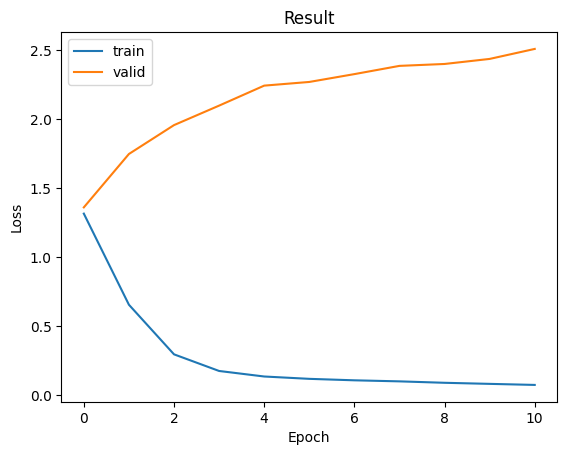

從模型的最終訓練結果來看，我們可以觀察到在完成第一次訓練後就直接出現了`Overfitting`的情況，這種情形比我們在使用BERT模型時還要嚴重，因為在大型語言模型中有非常強大的權重，因此在輸入資料較小的狀況下，模型的收斂就會非常快。

那我們該怎麼使用模型進行文字生成的動作呢?在這裡我們不必自己撰寫解碼的程式，因為在該模型中已經定義了一個`generate()`方法，在這邊我列出一些我常使用的參數與其概念，我們可以看到下表:

| 名稱 | 說明 |
| --- | --- |
| num_beams | 每次生成文字時有多少個選項，並根據設定挑選結果 |
| max_length | 生成文本最大長度 |
| repetition_penalty | 控制重複詞彙的懲罰力度，數值越高重複詞會出現次數越低 |
| early_stopping | 是否在達到生成文本的最大長度時就停止生成 |
| length_penalty | 平衡生成文本的長度，1.0 表示對生成文本的長度不進行任何調整 |

接下來我們就可以調整參數，並將文字放入模型中使模型推理並給出回應，在這裡我們需要將訓練時的`instruction`和`answer`兩部分去除，並將其轉換成`input_ids`這樣模型就能進行zero-shot的推理了。

```
inputs_text = "".join(x_valid[0][54:].split('answer:')[:-1])
input_ids = tokenizer(inputs_text, return_tensors="pt")
generated_ids = model.generate(**input_ids, num_beams = 2, max_length = 132, repetition_penalty = 2.5, length_penalty = 1.0, early_stopping = True)
```

當完成之後我們只需將生成的數字轉換成文字就可以看到其推理的結果了。

```
generated_tokens = tokenizer.decode(generated_ids[0], skip_special_tokens=True).split('answer:')
print(generated_tokens[0])
print(generated_tokens[1])
print(x_valid[0].split('answer:')[2])
#--------輸出--------
context:A railway electrification system supplies electric power to railway trains and trams without an on-board prime mover or local fuel supply. Electrification has many advantages but requires significant capital expenditure. Selection of an electrification system is based on economics of energy supply, maintenance, and capital cost compared to the revenue obtained for freight and passenger traffic. Different systems are used for urban and intercity areas; some electric locomotives can switch to different supply voltages to allow flexibility in operation. question:A railway electrification system supplies power to trains and trams with an on-board what? 
answers not in context
answers not in context
```

而我們可以看到，即使答案並不存在於文章當中仍能觀察到GPT-J能夠優秀地判別並產出最終結果，這是因為GPT-J在預訓練的過程中已經得到了有效的訓練讓它的表現出色，當然我們還可以增加更多的prompt或few-shot進行測試，這使得模型能生成出更佳的效果。

後話
--

今天是我們首次學習大型語言模型，但有些人即便使用LoRA的技術來微調，電腦可能仍然承受不了壓力，在這種情況下，我們可以轉用GPT-2模型來體驗今天的程式，雖然效能有差但是在概念上卻是差不多的。

而我們要學習這些的原因是因為ChatGPT的出現，而它的強大性能是有目共睹的，所以現今的自然語言處理的最新研究方向，就是繞者大型語言模型來進行的。而在後續的內容中我將持續解釋大型語言模型的理論與應用，並且在接下來的一兩天，我將會教你如何使用ChatGPT讓它成為你的助手。

那麼我們明天再見！

內容中的程式碼都能從我的GitHub上取得:

[https://github.com/AUSTIN2526/iThome2023-learn-NLP-in-30-days](https://github.com/AUSTIN2526/iThome2023-learn-NLP-in-30-days)

---

<a id="6669-day-26"></a>

## Day 26｜【Day 26】當今最強大的SOTA模型ChatGPT(上)-prompt?instruction?RLHF?

- 原文：https://ithelp.ithome.com.tw/articles/10338188
- 發佈時間：2023-10-11 22:02:03

前言
--

我們常在與ChatGPT相關的文章中看到`prompt`、`instruction`、`RLHF`等名詞，而這些技術在ChatGPT中擔任相當重要的角，今天我們就要來探討這些ChatGPT中的名詞與技術，但我們在介紹前我們需要了解`instructGPT`這一項GPT的前身，今天的學習重點如下:

1.   `InstructGPT/ChatGPT`的原理
2.   `Prompt`與`Instruction`的差別
3.   `RLHF`的實際用處與介紹

InstructGPT/ChatGPT
-------------------

InstructGPT是基於微調GPT-3的語言模型，它的出現是為了改變GPT-3可能會回復一些產生攻擊性或是隱私文章，並且增加GPT-3的效能，讓使用者可以提出問題或提出具體的指令，讓機器能針對這些需求進行特定領域的回覆，至於該技術的核心，便是名為`Instruction learning`的學習方式，這種方式會在輸入的文字中增加一些**指導性信息**來提供給模型學習，雖然其概念與GPT-3的`Prompt learning`相似，但實質上兩者其實存在差別，下面我將為你深度解析這兩者的差異。

Prompt與Instruction的差別
---------------------

在[【Day 24】用暴力美學屹立於不敗之地(上) - GPT家族的霸道之路](https://ithelp.ithome.com.tw/articles/10337089)中，我們已討論過GPT-3中的`Prompt learning`方式，其方式的主要目的在於**提升模型的填空能力**。例如在昨天的實作過程中，我們在進行問答QA的微調時，會設定輸入格式`context:內容`、`question:問題`、`answer:答案`就是一種`Prompt learning`的方法。

此目的在於進行文字生成時，當模型生成到`answer:`這一個詞彙時，能夠繼續根據歷史的紀錄生成下一個文字的結果，以便推理出答案。當然我們也可以在輸入中使用few-shot的方式來讓模型推理的更精確，而這種作法也都屬於Prompt learning的範疇。


而`Instruction learning`的目的則在於**激發語言模型的理解能力**，透過提供更明確的指示，模型就能產生合適的回應，這就是我昨天在微調GPT-J時為何要將 「Read the context and question to find the correct answer」 這段文字加到輸入的原因，因為我期望模型根據這段文字進行適當的推理來得出答案。

RLHF（Reinforcement Learning with Human Feedback）
------------------------------------------------

當然有了訓練的方式我們還是需要一些方式來優化模型，而`RLHF（Reinforcement Learning with Human Feedback）`這項技術就是利用**人類反饋來提升機器學習模型性能的技術**。簡單來說這項技術就是讓我們根據模型輸出結果的來進行評判好壞，如果模型的生成效果不理想，我們可以實施懲罰機制讓模型調整權重，反之則設立一個獎勵機制。

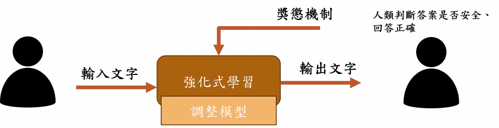

在這個過程中我們還設置了特定的懲罰機制，對於**不應該被生成的危險內容進行懲罰**，當生成內容為色情、暴力、違法等問題時，我們將會給予模型一個較低的評分，通過這樣的調整讓模型能避免生成這些不被人喜歡的內容。

而這樣運用了`Instruction learning`、`Prompt learning`、以及`RLHF`三種技術的結合來調整GPT-3模型，使得InstructGPT變得更無害且其生成能力更強。

ChatGPT中的GPT-3.5、GPT-4
----------------------

而ChatGPT便是透過這樣的方式訓練而成的模型，在OpenAI的官網中有4個模型是採用InstructGPT方式來微調GPT-3的結果，目前能夠被稱為GPT3.5的版本包括:

*   `code-davinci-002`(InstructGPT 模型)
*   `text-davinci-002`(改進版的code-davinci-002)
*   `text-davinci-003`(改進版的text-davinci-002)
*   `GPT-3.5-turbo`(針對聊天版的GPT模型)

在這些版本中，`GPT-3.5-turbo`是我們在ChatGPT網站上所使用的免費版本，並且ChatGPT的生成能力也是我們有目共睹的，然而這種強大的力量並非僅源於訓練的方法。回想GPT家族所採用的訓練方式，就會發現其強大來源於更龐大的模型參數以及更多的訓練資料，儘管有許多文章推測ChatGPT模型的參數量已經達到兆的級別，但官方至今並未公開該模型的實際參數量，但以往常的訓練方式應該八九不離十了。

但如此龐大的模型在訓練或微調時固然需耗費大量時間與金額，因此微軟成為OpenAI的主要贊助商，所以在微軟的產品中，我們時常能看到ChatGPT的蹤影。當然要運用此模型，亦需有強大的硬體支援，因此我們可以推算出OpenAI在營運ChatGPT這個網站上的投入金額。

不過他們營運網站的最大目的很可能是透過我們這些用戶來進行RLHF的訓練，並且「有可能」私下蒐集我們傳入的這些文本資料，雖然這部分並未被證實，但我們在使用時仍需要特別留意，不應該將個人隱私或公司機密資訊散露其中。

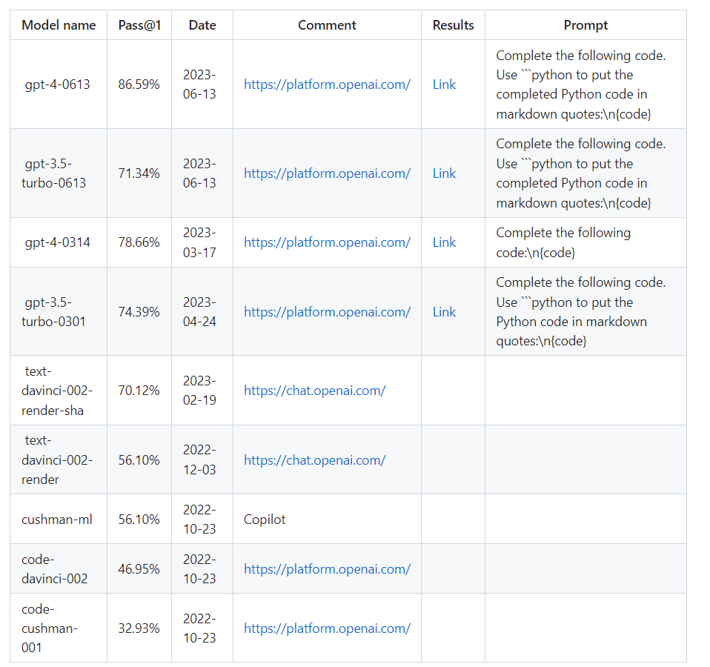

當然對於ChatGPT的能力有多厲害，許多研究已經如火如荼的開始進行測試，在GitHub上，有一個公開倉庫專門用於統計ChatGPT的準確率，這個倉庫是利用HumanEval資料集進行測試的，該測試數據集包含了164個程式問題，並探討不同版本的準確率。其中GPT-4的最新穩定版可以解決`86.59%`的問題，這個成績甚至能媲美大多數的程式開發人員。而經過大量的期刊與文獻測試大多數的結論都確定了GPT-4是當代最強大的SOTA模型。

然而在**網站版本的ChatGPT中，其權重會持續被修正**，因此對於網站版本的效能評估相當困難，於是我們在進行此類研究時，通常會參考`0317`和`0613`這兩個版本的ChatGPT，因為在公開的`ChatGPT API`中，我們只能選用這兩個版本。

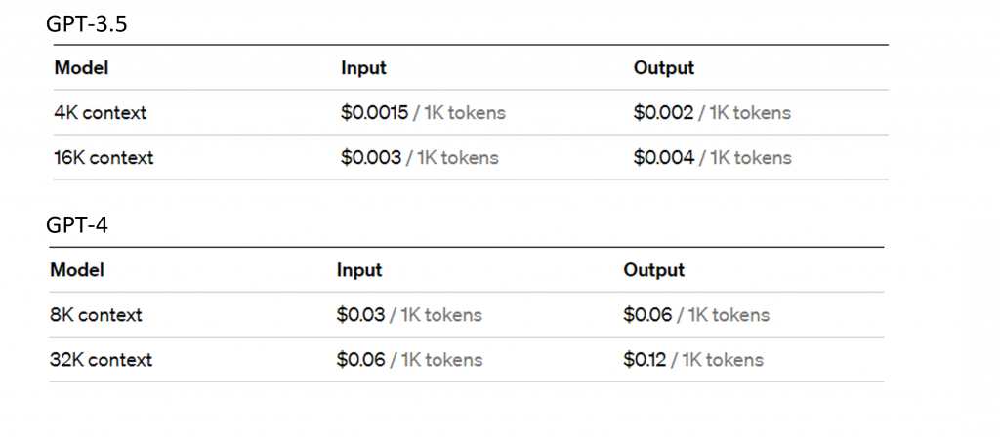

> 圖片來源:https://openai.com/pricing

事實上市場上已經有許多利用這些API開發完成的程式，例如：ChatPDF、ChatPaper等都是運用此技術開發出來的。而API的花費與ChatGPT的模型運作成本相比，其API的價格相對低廉，模型輸出每1000個詞彙的花費僅為0.002美元這一點非常適合用於企業的營運上。

我們現在可以在Azure平台中使用GPT的各種模型，由於微軟所擁有的設備較OpenAI優良因此回應的速度更快，每分鐘的處理流量也更高。而且對於學生來說，微軟還提供了100美金的免費額度，讓我們能夠體驗到使用GPT模型的便利。

後話
--

現在你應該對ChatGPT的運作原理有更深的瞭解了，而我們在這類大型語言麼型所需要學習的就是如何透過`Instruction learning`以及`Prompt learning`來優化它的文字生成效果，因此我會在明天先教你如何申請ChatGPT的API，並教你如何撰寫一個較佳的`Instruction`和`Prompt`並通過程式碼實作讓ChatGPT能成為你的私人小幫手或者幫助企業完成特定的任務。

那麼我們明天再見！

內容中的程式碼都能從我的GitHub上取得:

[https://github.com/AUSTIN2526/iThome2023-learn-NLP-in-30-days](https://github.com/AUSTIN2526/iThome2023-learn-NLP-in-30-days)

---

<a id="6669-day-27"></a>

## Day 27｜【Day 27】當今最強大的SOTA模型ChatGPT(下)-讓ChatGPT成為你的私人助理

- 原文：https://ithelp.ithome.com.tw/articles/10338444

前言
--

ChatGPT雖然有提供API供我們使用，但在這部分我們是無法對模型進行微調的，所以我們需要使用不同的方式來讓ChatGPT針對某項任務進行處理。而在這裡最好的做法就是設計一個較好的instruction並用prompt中few-shot來處理這一個問題，今天我就會來告訴你該如何使用到這項方式讓ChatGPT成為你的私人助理或公司客服人員。

1.   `ChatGPT`申請教學
2.   `instruct`設計方式
3.   `ChatGPT`程式實作

ChatGPT API申請
-------------

在實作ChatGPT之前，我們需要先申請其API金鑰，而主要有兩種申請方式：**使用OpenAI平台**與**使用Azure平台**。不過如果選擇使用Azure平台，所需的過程可能會稍嫌繁瑣，因為它要求填寫表單並建立自己的GPT端點，但是Azure的處理速度相對較快。而在API版本的選擇上，你只需要選擇其中一種方式申請即可，接下來我們來看看這兩種平台該如何申請API金鑰。

### 【1. OpenAI】

在OpenAI的平台中，只需擁有ChatGPT的帳號，就可以快速前往[OpenAI API](https://platform.openai.com/)進行申請。其操作方式相當簡易，僅需登入上述網站後，你應該能在畫面右上方看到相關介面。


我們需要先按下圖片中的【Upgrade】按鈕，此一動作將**引導系統轉跳至設定付款方式的畫面**，接著在這個畫面內，我們需要選擇並點擊【Add payment details】，進而開啟輸入付款方式的操作界面。


在這裡我們選擇個人的付款方式【Individual】，此時你將會看到下方的信用卡付款介面，在該介面中你只需依序填寫相關資訊並選擇需要存入的金額，就能順利開通ChatGPT的API功能了。


接下來我們點擊左側欄位中的【API keys】以轉跳到申請金鑰的頁面，並且點擊【Create new secret key】，然後輸入你想要識別該API的名稱，這樣就能成功創建API金鑰了。


### 【2. Azure】

而在Azure平台上，首先我們需要建立Azure的帳號，若你是學生可以利用學校給予的微軟帳號進行申請，這時你就能透過[Azure 學生版](https://azure.microsoft.com/zh-tw/free/students)開通帳號，這樣就能免費使用ChatGPT的API了!


為了開通在Azure平台上OpenAI的服務，我們需要先在Azure中填寫[Request Access to Azure OpenAI Service](https://customervoice.microsoft.com/Pages/ResponsePage.aspx?id=v4j5cvGGr0GRqy180BHbR7en2Ais5pxKtso_Pz4b1_xUOFA5Qk1UWDRBMjg0WFhPMkIzTzhKQ1dWNyQlQCN0PWcu)這份表單，但在此過程中我們需要找出自己Azure帳號的識別碼。


故我們需要前往[Azure 首頁](https://portal.azure.com/#home)並於下方的【瀏覽】欄位找到【訂用帳戶】選項，當我們進入到該滅面後便能在訂用帳戶中找尋到【訂用帳戶 ID】，而這正是在我們需要在表單中填寫的資料。


表單填寫完畢後我們還需要約1天的時間等待審核通過，當審核通過時我們可以在[Azure 首頁](https://portal.azure.com/#home)上方的搜尋欄位中輸入【OpenAI】，然後找到並點選【Azure OpenAI】這項選擇。


由於我們目前沒有任何的群組資源，我們需先點擊【Azure OpenAI】按鈕來建立一個群組資源，而該群組的名稱可以依自行偏好設定。不過在這個頁面裡最重要的是選擇【區域】和【名稱】選項，對於區域的選擇我們需要參考[Azure OpenAI 服務配額和限制](https://learn.microsoft.com/zh-tw/azure/ai-services/openai/quotas-limits)這一網站，特別是如果要使用GPT-4的API我們必須選擇正確的區域，不然預設只有GPT-35-turbo，至於名稱則將是我們未來使用的端點名稱，因此要確保其不與其他人重複。


輸入完畢後，我們就可以搜尋到我們的API資源，這時我們只需記住【金鑰】與【API網址】兩項即可，這兩項也就是我們在程式中所需要的模型通道。


最後我們點擊該頁面上的【Azure OpenAI Studio】->【部署】->【建立新部署】，並選擇你自己心儀的模型，同時設定名稱，這樣就完成了Azure的API的建立。


在成功建立ChatGPT的API之後，我們可以開始撰寫程式了，這次我將使用[新竹市政府所有常見問答資料](https://data.gov.tw/dataset/139268)作為資料集，並採用這些資料作為ChatGPT的few-shot輸入使其能夠變為智能客服。

不過ChatGPT的輸入最大限制為32k個字，我們需要採用一些特殊技巧來處理few-shot的候選名單，現在我們就來看看如何建立資料的步驟。

### 【STEP 1】建立設定檔

在這次的程式中，我將設定一個`.env`檔來傳遞ChatGPT的相關參數與設定，而我將會使用一個程式但能使用兩個API平台的方式撰寫，以下是程式碼範例：

```
API_ENDPOINT=https://你的端點名稱.openai.azure.com/
API_KEY=你的金鑰
API_TYPE=azure
API_VERSION=2023-03-15-preview
GPT_VERSION=gpt-35-turbo
```

在該設定檔中我主要設定了Azure和OpenAI兩個版本的檔案，對於OpenAI只需要填寫`GPT_VERSION`和`API_KEY`這兩個欄位。不過需要注意`GPT_VERSION`的填寫規則，Azure版本需要填寫的是部屬名稱，而OpenAI則需要填寫模型名稱。當然你也可以像我一樣將Azure版本的部署名稱設定得和模型版本一樣，這樣子比較不會搞混。

### 【STEP 2】設定ChatGPT API環境

在程式中我們則需要利用dotenv讀取剛剛建立好的`.env`檔案，在這裡我們可以在進行宣告函式庫的時候，就先透過以下的程式碼來進行讀取。

```
# pip install dotenv-python
import os
from dotenv import load_dotenv
load_dotenv()
```

但請注意我們並非僅使用`load_dotenv`進行讀取，因為該函數的功能只會將參數名稱轉換為環境變數，因此我們在讀取資料時還需利用`os.getenv()`來調用這些環境變數的資訊，接下來我們就能夠使用該環境變數，幫助我們為兩個平台撰寫環境設定的程式。

```
# pip install openai
if os.getenv('API_TYPE') != 'azure':
    openai.api_key = os.getenv('API_KEY')
    gpt_version = os.getenv('GPT_VERSION')
else:
    openai.api_type = os.getenv('API_TYPE')
    openai.api_version = os.getenv('API_VERSION')
    openai.api_base = os.getenv('API_ENDPOINT')
    openai.api_key = os.getenv('API_KEY')
    gpt_version = os.getenv('GPT_VERSION')
```

在這裡當我們指定輸入參數為`azure`時，系統將讀取整份`.env`檔案的內容，這是因為Azure平台所需的設定資料相對眾多，然而對於OpenAI版本來說，流程會變得更簡潔，因為我們只需傳入API金鑰與版本即可。

### 【STEP 3】讀取歷史資料並計算相似度

當我們讀取歷史資料時，我們選擇直接採用prompt方式來轉換其格式，這樣做的原因在於這次的指示中，我希望透過`question:`和`answer:`來讓模型區分用戶所輸入的文字和其應生成的目標訊息。

```
def load_simple(path):
    df = pd.read_csv(path)
    Q = df['question']
    A = df['answer']
    
    
    return [f'question:{q} answer:{a}' for q, a in zip(Q, A)]
```

在系統運行時，我們需要考慮到ChatGPT的對話內容，因此初始的內容的設定不能過長，以免詞彙數量超出限制，為了解決這個問題，我們需要使用文本的相似度檢測技術，在這個部分我們可以選擇自行訓練一個模型，或是直接使用`Sentence BERT`模型進行計算。

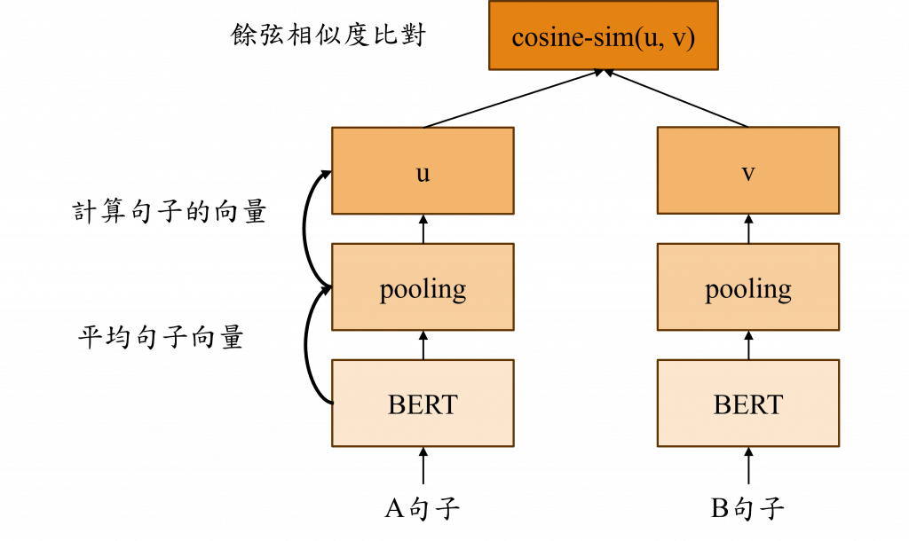

Sentence BERT的原理其實很簡單，**它只需要將兩個完全一樣的BERT模型進行複製**，再將句子輸入到`平均池化層(mean pooling)`中以便對每一個詞彙的向量進行平均化，就時就能透過計算餘弦相似度來比較兩句之間被平均化後的向量`u`、`v`的距離，如果該值越接近於1，表示這兩句話越相似。

我們可以利用sentence-transformers函式庫來實作上述的原理，在此我僅選出10句最可能的句子作為few-shot的範例，而我在這裡使用的策略是當用戶的輸入文字時與資料中的文字進行比對，這樣就可以在每次的對話中更新few-shot。

```
def creat_fewshot(model, inputs, simple, num = 10):
    simple_emb = model.encode(simple)    # 轉換成Embedding向量
    inputs_emb = model.encode([inputs])  # 轉換成Embedding向量
    
    cos_sim = util.cos_sim(simple_emb, inputs_emb)  # 計算餘閒相似度
    combo = [[cos_sim[i], i] for i in range(len(cos_sim))] # 取得所有的結果
    combo = sorted(combo, key=lambda x: x[0], reverse=True) # 排序分數
    
    few_shot = [simple[i] for _, i in combo[:num]]  #取得前10筆分數最高的結果
    
    return few_shot
```

### 【STEP 4】建立Instruction

在建立模型時，我們需要考慮一些重要因素，首先是`ChatGPT的角色`、`要執行的任務`以及`輸出的限制`。在此階段我們可以先行建立ChatGPT的角色，並給予一些簡單的任務，在觀察ChatGPT的輸出後進行調整，例如：你現在是客服人員，你需要幫助我解答問題。

```
# 輸入[1]
輸入:未滿18能租YouBike嗎?
# 輸出[1]
question:若我未滿18歲，能否租借YouBike?
answer:根據YouBike租借規定，未滿18歲的人士無法租借。然而，未滿14歲的人 士若在家長或監護人陪同下可進行租借。

question:我可以在YouBike站點外還車嗎？ 
answer:抱歉，您只能在YouBike的還車站點還車， 不能在站點外進行還車。
.
.
.
```

在這個過程中可以看到輸出並不如我們預期，因此我們需要更具體的描述要執行的任務，並且給予它一些生成文字的限制。

而在我們問題中給予模型的是基礎的Instruction與計算相似度的few-shot結果，這時雖然它的確能回答我們的問題，但他們的回答方式與few-shot的格式相當類似，但我們的期望是，ChatGPT能成功地模擬客服人員的工作。因此我調整了整體Instruction，使其變成了下方所示的格式。

```
def gpt_instruct(dialog, few_shot):
    instruct = '你是客服人員，在接收到用戶詢問時，需要盡可能地以專業、簡短且易懂的方式提供答案。如果用戶的問題不夠清晰，你需要引導他們提供更多訊息以便更準確地回答。以下是一些你可能需要參考的資料，以便更有效地應對用戶的問題。'
    init_instruct = instruct + '\n' + "".join(few_shot)
    
    return {"role": "system", "content": f'{init_instruct}'}
```

在這裡，我加入了`簡短且易懂的方式提供答案`、`引導他們提供更多訊息`和`以下是一些你可能需要參考的資料`這幾種模式來指導模型的生成結果，這時你就會發現到此時ChatGPT生成出來的結果，更能模擬客服人員的操作了。

```
# 輸入[1]
請輸入問題:YouBike多收我一堆錢
# 輸出[1]
GPT回復: 用戶: 請問我如果出現借還車交易產生的異常扣款要怎麼處理呢？
客服人員: 請您立即撥打YouBike客服專線03-659-0022(付費)，我們的服務人員將會協助您處理。
```

在程式中你會看到其資料傳輸方式是採用字典型態，這正是ChatGPT API中的資料輸入格式，所有的對話上下文會被儲存在一個串列中，然後輸送給ChatGPT API。在這個格式中`role`代表了輸入者的身份或權限等級，`content`則對應到輸入的內容，而該步驟中我們設定系統的初始語句，因此將`role`設定為`system`。

### 【STEP 4】建立ChatGPT的回覆

現在我們需將幾項步驟結合起來，而在程式中的第一步我們透過`creat_fewshot()`方法，將使用者的最後一句對話`dialog[-1]`與歷史資料進行比對，因為在模型錯誤回復時人們可能會給予它一個更完整的敘述或更多的資料訊息，因此我們將其作為新特徵來與舊有的資訊進行比對，已替換掉初始的系統文字敘述使其生成更完善。

```
def GPT(model, dialog, simple, gpt_version, TYPE, num = 10):
    few_shot = creat_fewshot(model, dialog[-1], simple, num)
    dialog[0] = gpt_instruct(dialog, few_shot)
    if TYPE == 'azure':
        response = openai.ChatCompletion.create(
            engine=gpt_version, 
            messages=dialog
        )
    else:
        response = openai.ChatCompletion.create(
            model=gpt_version,
            messages=dialog
        )  
        
    return response.choices[0].message.content
```

在回答方面由於OpenAI與Azure間存在一些微小差異，所以必須先確定要使用何種方式進行回答因此我們需要設定一個條件來判斷回復的版本。而在模型生成完畢後，文字資訊將存放於response ->choices->message->content的結構下，因此需要我們將其提取出來。

### 【STEP 5】宣告主程式

在主程式中，我們需要撰寫一個永久迴圈來儲存上下文的資訊，並且在初始的宣告時我們也需多宣告一個`[]`，這是因為系統在進行回復的動作時，會將第`0`個輸入的資訊修改為系統指令，若我們在此沒有新增一個串列，就會導致使用者的輸入資訊被替換掉。

```
simple = load_simple('qa_data.csv')
model = SentenceTransformer('sentence-transformers/all-MiniLM-L6-v2')
dialog = [[]]
while(1):
    user_input = input('請輸入問題:')
    dialog.append({"role": "user", "content": f'{user_input}'})
    response = GPT(model, dialog, simple, gpt_version, os.getenv('API_TYPE'))
    dialog.append({"role": "assistant", "content": f'{user_input}'})
    print('GPT回復:',response)
```

在一個對話中，我們需要將使用者的輸入設定為`user`，而ChatGPT的回覆設定為`assistant`，以確保不會導致角色判斷出現錯誤。而我們可以看到以下的結果，透過這種方法的處理，我們能讓輸入與輸出的效果顯著提昇，因此企業不但可以引入自己的資料集，還能創造出多元變化的智能客服。

```
# 輸入[1]
請輸入問題:若騎乘的車輛故障了，該如何處理
# 輸出[1]
GPT回復: 請您先將車輛停放在YouBike站點內的柵欄，並撥打YouBike客服專線03-659-0022(付費)，告訴客服人員具體的車輛號碼及故障情形，客服人員會為您做出相應的處理。

# 輸入[2]
請輸入問題:我該怎麼樣使用youbike
# 輸出[2]
GPT回復: 首先，您需要先完成YouBike的會員註冊，並進行實名認證。接著，您可以選擇使用電子票證（悠遊卡或一卡通）、信用卡或電子支付方式（悠遊付或LINE Pay）來支付租賃費用。

在站點側邊的機台上刷卡，並選擇一台自行車，搖下停車桿即可借車。還車時，將自行車停入空位，聽到「嗶」的一聲且看到藍色指示燈常亮後，即完成還車。

若選擇租借YouBike 2.0，則直接在自行車車頭的機台刷卡，看到螢幕出現「請搖下停車桿」的訊息後，即可將腳踏車推出進行使用。
```

當然，我們也能夠將這套系統移植至Line bot或網站平台，供大眾使用。如果你對這方面有興趣，可以參考我在Github中的[另一個倉庫](https://github.com/AUSTIN2526/learn-AI-in-30-days-book-version/tree/main/Ch.12%20ChatGPT%20Prompt%E8%A8%AD%E8%A8%88%E8%87%87%E6%87%89%E7%94%A8)來撰寫這方面的程式。


這種聊天機器人的設計方法能夠將客服人員無法解答的專業問題交由ChatGPT回復，就能夠進而減輕客服人員及公司於訓練員工時的負擔，當然我們也可以收集ChatGPT回答錯誤的問題，並更新到歷史資料中。如此一來模型的效能將會隨著時間更加的完善。

後話
--

這類型的聊天機器人與傳統的系統有所不同其所有資訊完全由推理生成，因此這樣的設計更簡便且自由度較高，但是也有明顯的缺點，例如無法透過微調使模型專注於特定目標、無法在本地端執行、回答可能錯誤...等，儘管如此該系統的效果在許多研究上有了非常多良好的結果，因此這類的聊天機器人設計方式可能會成為未來中的趨勢。不過在這裡面臨到的最大挑戰還是有關於資訊安全等問題，因此我將在明天告訴你一種可以本地部屬、微調的大型語言模型。

那麼我們明天再見！

內容中的程式碼都能從我的GitHub上取得:

[https://github.com/AUSTIN2526/iThome2023-learn-NLP-in-30-days](https://github.com/AUSTIN2526/iThome2023-learn-NLP-in-30-days)

---

<a id="6669-day-28"></a>

## Day 28｜【Day 28】ChatGPT的挑戰者LLaMA(上) - 目前最強大的開源語言模型LLaMA究竟做了什麼

- 原文：https://ithelp.ithome.com.tw/articles/10338745
- 發佈時間：2023-10-13 21:34:06

前言
--

近期中研院運用了一個名為`Llama-2-7b`的模型來對兩個資料集：`COIG-PC`和`dolly-15k`進行微調，但由於這些資料都是簡體中文，因此在上線時引發了不少烏龍事件，我相信大家對此並不陌生。然而我們對於模型究竟做了哪些事情，以及為何有人將其稱為ChatGPT的本地端？它和ChatGPT有何關聯性？都非常不了解，因此今天要來深入探討這個模型的運作原理，今天的學習重點如下:

1.   `LLaMA 1`與`LLaMA 2`的理解
2.   理解模型的預訓練策略
3.   學習`LLaMA RLHF`計算方式

LLaMA
-----

`LLaMA(Large Language Model Meta AI)`是Meta AI公司於2023年2月推出的大型語言模型，因其開源的特性與其擁有ChatGPT相似的效能，使得該模型受到許多人喜愛，所以許多人會加以微調以達成預定的目的，甚至有許多人將這種模型視為「本地端ChatGPT」或「開源ChatGPT」。

令人驚訝的是儘管LLaMA的參數量較少，卻能完成通常需要更多模型參數的任務，根據開發團隊的報告`LLaMA-13b`在大多數的基準測試中，其**表現甚至超越了擁有17.5B參數的GPT-3**，現在我們來看看下圖中有關於該模型性能的詳細資訊。


> 圖片來源:[How Does Llama-2 Compare to GPT-4/3.5 and Other AI Language Models](https://www.promptengineering.org/how-does-llama-2-compare-to-gpt-and-other-ai-language-models/)

圖中主要展示了LLaMA的各種能力，特別是在`MMLU`與`AGIEval`兩個**測試語意理解程度**的資料集上，`Llama-2-70B`表現出眾，其效能甚至遠超乎同類參數量的`Llama-1-65B`和其他兩種大型語言模型。在`TriviaQA`這個測試集上，`Llama-2-70B`的性能更是達到了85%。

除此之外該模型在`Winogrande`常識推理資料集和`BoolQ`邏輯判斷資料集上的表現也十分出色，這使我們認為`LLaMA 1`與`LLaMA 2`都是**具有強大推理能力的語言模型**，眾多研究結果進一步指出`Llama-2-70B`的模型能力已足以超越`gpt-35-turbo(0317)`版本，因此它甚至被視為目前SOTA模型`GPT-4`的挑戰者。

該模型與`ChatGPT`、`PaLM`、`Chinchilla`等大型語言模型最主要的不同之處，就是在它的**完全開源的特性**。這種設計讓我們可以自行運用和調整該模型的權重，打造出更專精的語言模型。同時也能隨時增添新的資料以優化模型。在所有的開源模型之中，該模型是目前唯一一個採用`RLHF`訓練的因此在生成能力與穩定性也能夠超出其他的大型模型，此外ChatGPT不同的是該模型**並未設置太多的道德限制**，雖然這雙刃的特性一方面能提升特定行業的效率，但在另一方面也可能引發社會風險。

相較於OpenAI，LLaMA在訓練階段時使用的數據也開放，它使用了`CommonCrawl`、`C4`、`Github`、`Wikipedia`、`ArXiv`、`StackExchange`等資料作為訓練資源，其中`CommonCrawl`和`C4`的資料占了訓練資料的80%，主要是用來培養**模型理解和回答問題的能力**。同時`Github`和`StackExchange`的資料被用來訓練它的程式撰寫能力，`ArXiv`和`Wikipedia`的資料則用於培養它的學術研究能力，並且訓練時的這些資料都是開源的資料集，也就是說只要硬體設備充足，我們就可以復現這個實驗。

LLaMA的訓練方式
----------

而LLaMA之所以能用更少的參數來實現更高參數量的模型所能達成的功能，主要是因為他**改善了一些大型語言模型的缺點**，而改良的第一步就是針對Transformer中的**每一層進行正規化**，而非只對Transformer的輸出進行正規化。並且在這個步驟中`LayerNorm`的公式中的平均值被認為是不必要的，而是只需要模型保留標準差作為正規化後的特徵，就能夠有更好的性能，這點在實驗中也被證實，因此它修改了`LayerNorm`成了`RMSNorm`來解決這項問題。

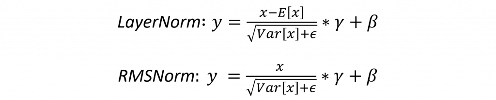

在Transformer的`feed-forward`層中是使用了`ReLU`作為激勵函數，但我們從[【Day 12】該如何選擇損 失函數與激勵函數?中文該如何斷詞?](https://ithelp.ithome.com.tw/articles/10329094)這篇文章中知道了若使用`ReLU`會有可能發生神經元死亡的問題。

因此為了解決這個問題，LLaMA在這裡選擇使用了`SwiGLU`這是`ReLU`的一種變化，它能給予**負值區間的數值一定的適應性**這讓它與`feed-forward`層更為匹配，這是因為經過`RMSNorm`處理後的數值已經趨近穩定，所以如果這裡的負值太高，就該進行截斷處理以防止在更深的層中導致資料發散。


並且由於`Positoinal Embedding`的編碼方式還不夠完善，因此在LLaMA中便採用了`旋轉位置編碼（Rotary Embeddings）`的方法，這種方法能嘗試將**位置資訊與資料內容融合**，以便更好地適應各種不同的任務和資料類型，該方式採用數學中的**極座標系統表示位置資訊**，將**位置資訊編碼為複數**，其中複數的長度表示了位置的距離，而複數的負角則表示了位置在複數平面上的方向，因此這種表達方式的特性能夠被Multi-Head Attention更好地計算，使其生成的向量具有更高的結構性。

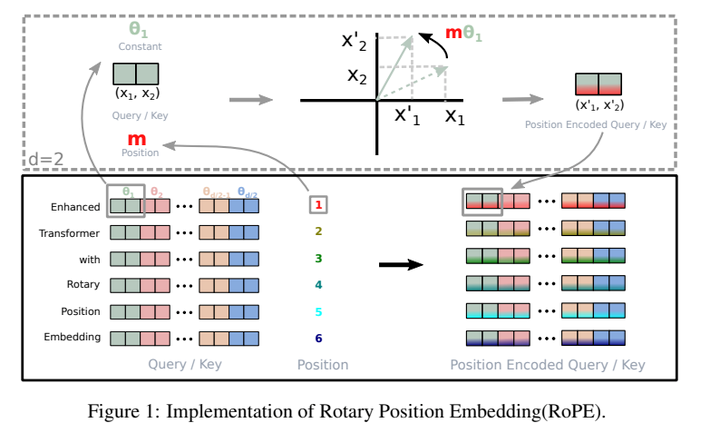

> [Su, J., Lu, Y., Pan, S., et. al.(2021). "Roformer: Enhanced transformer with rotary position embedding" In arXiv preprint](https://arxiv.org/abs/2104.09864)

另外對於傳統的Multi-head Attention其需計算`q`、`k`、`v`向量，進而需求更多的記憶體，而為了提升訓練效率，該模型採用了Grouped-query Attention的方式，讓所有head能共享`k`、`V`矩陣，而根據作者們的根據實驗結果，兩者在效能上的差異並不顯著，因此在這選擇了Grouped-query Attention來增加模型的速度

這個模型採用了以小模型大數據的方式進行訓練，這種方式能夠讓模型**更充分地吸收資料的內容**，然而這種方法需要謹慎考慮模型的結構設計。基於這個原因LLaMA對基礎Transformer進行了上述三個改動目的是優化模型在收斂過程中的表現。而在LLaMA 2中還以此為基準添加了一個RLHF機制進行模型調整。

最後我們使用RLHF的方式對該模型進行調整，使其能更好地遵循`人類偏好(Human Preferences)`和`遵循指令(Instruction Following)`這兩個目標，在這個過程中我們利用獎勵機制和懲罰機制來對模型進行調適。我們首先讓模型產生一次文本，接著通過人工比對找出最佳的生成結果。


在`LLaMA 2`中對於RLHF的損失函數的計算方式是先透過`𝑟𝜃 (𝑥,𝑦)`來計算分數，其中`yc`代表正面的回覆，`yr`則代表負面的回覆，而`x`是首先設立的Instruction，然而在訓練過程中，評分方式是將**分數訓練成四個階級**，這相對於二元分類使得收斂更為困難，為了解決這個問題，所以設計了一個`m(r)`的離散函數以穩定生成結果。

同時我們希望該模型不僅有用，也能保證安全性，然而這裡可能存在著**訊息有用但不安全**的狀況，因此對於RLHF的評分，我們需要建立兩個不同的評估模型。

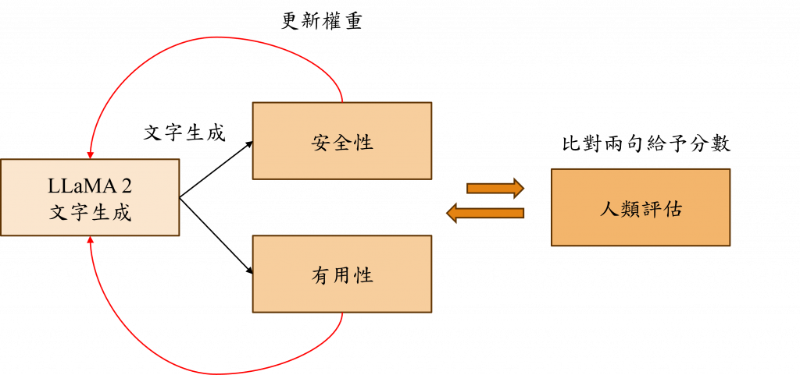

這樣子我們就能夠根據人類的反饋來調整模型之間的權重使其更安全更有用。

後話
--

今天你應該已經理解了LLaMA的優點以及實現方式，而這個模型也代表了目前自然語言處理的最新進展，並且在這種開源模型的推動下，自然語言處理與模型改進的速度大幅提升。現在LLaMA正與GPT-4爭奪SOTA模型的榮譽。而對於企業來說，這種開源的大型模型更能提供彈性調整以達到他們的需求，我相信在不久的將來可能會有更多微調版本的LLaMA出現，足以將GPT-4挑戰下神壇，所以明天我將會教你你如何用Pytorch進行RLHF與微調的操作。

那麼我們明天再見！

內容中的程式碼都能從我的GitHub上取得:

[https://github.com/AUSTIN2526/iThome2023-learn-NLP-in-30-days](https://github.com/AUSTIN2526/iThome2023-learn-NLP-in-30-days)

---

<a id="6669-day-29"></a>

## Day 29｜【Day 29】ChatGPT的挑戰者LLaMA(下) - 用RLHF與QLoRA調整大型語言模型

- 原文：https://ithelp.ithome.com.tw/articles/10339382

前言
--

終於來到我們這個系列的最後一個階段啦~今天的主要內容是教你如何運用RLHF與QLoRA來調整這些龐大的語言模型。在這個部分裡，如果你在網路上查詢資料，可能會發現這些程式都是一些經過精心打包的專案或函式庫來協助你訓練，但是這會讓你在實際練習時無法理解其程式原理，因此在這裡我們將採用本系列文章的程式風格，並且一步步地引導你完成這次的程序，今天的學習重點如下：

1.   QLoRA微調實作
2.   LLaMA 2申請
3.   RLHF損失計算與微調實作

QLoRA的技術源自於[QLoRA: Efficient Finetuning of Quantized LLMs](https://arxiv.org/abs/2305.14314)這篇期刊論文，其主要創新之處在於使用`4bit`來壓縮模型，並且其微調效能與`16bit`的相當接近，`QLoRA`的運作原理與`LoRA`基本相同，但它使用了一種新型的資料型態`4位元NormalFloat`來表達模型資料，並**配合記憶體管理技術來優化操作**。

根據作者的實驗結果，使用`QLoRA`微調的模型甚至能以較小的參數量達成部分`SOTA`模型的成績，而今天我們將需要此技術來幫助我們完成微調`LLaMA` 2這一個語言模型，我們先來看看以下的步驟。

### 【STEP 1】下載資料集

這次我們可以選擇兩個資料集進行訓練。第一種是[openai_summarize_comparisons](https://huggingface.co/datasets/CarperAI/openai_summarize_comparisons)資料集，該資料集提供了**模型生成後經人工選擇的資料，以及被人工拒絕的資料**，有助於我們快速完成`RLHF`的任務，而第二種選項是使用[PTT 中文語料](https://github.com/zake7749/Gossiping-Chinese-Corpus)以協助我們訓練出**能針對繁體中文回答的鄉民版本LLaMA 2模型**，但這需要我們自行生成文字並用`RLHF`進行調整，這次我將選用第二個資料集作為實際訓練的範例，因為它和我們模型上線時的操作方法較為接近。

### 【STEP 2】申請LLaMA 2的模型權限

首先我們先到Hugging Face網站，隨找到到一個官方版本的Llama 2的模型在這裡我將會使用[Llama-2-7b-chat-hf](https://huggingface.co/meta-llama/Llama-2-7b-chat-hf)作為範例。

在該頁面中我們需先到Meta的官方網站申請模型的使用權限，在這一步只要資料填寫正確，基本上馬上就會收到審核通過的Email。當審核通過我們就能夠回到Hugging Face的官方網站，**使用你審核時所用的Email**進行註冊或登入，這樣才能申請模型的權限。


在模型申請完成後，我們需要前往右上方的[設定](https://huggingface.co/settings/tokens)，來建立一個代表你的 Hugging Face 帳號的 token，當成功建立 token 之後，我們就可以在載入模型時，使用此 token 獲得模型下載權重的權限。

```
from transformers import AutoModel
access_token = "你的token"
model = AutoModel.from_pretrained("private/model", token=access_token)
```

或是我們也能透過`huggingface-cli`來預先設定Token於我們的電腦環境中，如此一來我們就不需要在每次載入模型時都重新輸入token。

```
huggingface-cli login
huggingface-cli login --token $你的token
```

### 【STEP 3】使用QLoRA載入模型

接下來我們將運用`Llama-2-7b-chat-hf`這一個模型，這是**Llama 2針對聊天專用所微調的版本**，而該模型的的讀取方式，我們需要透過`4位元NormalFloat(nf4)`來載入模型權重，因為該模型的參數量極大。這與我們先前使用的LoRA的程式相似，但有一點不同就是我們還需要利用`BitsAndBytesConfig`來創建模型參數，隨後再將它們傳遞給`AutoModelForCausalLM`。

```
import torch
from transformers import AutoTokenizer, AutoModelForCausalLM, BitsAndBytesConfig

base_model_id = "meta-llama/Llama-2-7b-chat-hf"
bnb_config = BitsAndBytesConfig(
    load_in_4bit=True,
    bnb_4bit_use_double_quant=True,
    bnb_4bit_quant_type="nf4",
    bnb_4bit_compute_dtype=torch.bfloat16
)

model = AutoModelForCausalLM.from_pretrained(base_model_id, quantization_config=bnb_config)
```

接下來我們同樣會透過PEFT函式庫來轉換模型的結構，同時開啟QLoRA在計算梯度時的檢查點。

```
from peft import prepare_model_for_kbit_training

model.gradient_checkpointing_enable()
model = prepare_model_for_kbit_training(model)
```

之後的用法就是看你想要對模型在哪些地方需要用到QLoRA的方式進行調整，並且將其輸入到`target_modules`即可，在這裡的用法與我們之前的並無任何差異。

```
from peft import LoraConfig, get_peft_model

config = LoraConfig(
    r=32,
    lora_alpha=64,
    target_modules=[
        "q_proj",
        "k_proj",
        "v_proj",
        "o_proj",
        "gate_proj",
        "up_proj",
        "down_proj",
        "lm_head",
    ],
    bias="none",
    lora_dropout=0.05,  # Conventional
    task_type="CAUSAL_LM",
)

model = get_peft_model(model, config)
```

在我們檢查模型參數量的時候可以發現，與LoRA相比QLoRA在模型壓縮率上更佳，以LLaMa-7b模型為例，我們甚至可以壓縮至僅剩下約2%的參數量。

```
def print_trainable_parameters(model):
    trainable_params = 0
    all_param = 0
    for _, param in model.named_parameters():
        all_param += param.numel()
        if param.requires_grad:
            trainable_params += param.numel()
    print(
        f"trainable params: {trainable_params} || all params: {all_param} || trainable%: {100 * trainable_params / all_param}"
    )

print_trainable_parameters(model)
#-------------輸出-------------
trainable params: 81108992 || all params: 3581521920 || trainable%: 2.264651559077991
```

### 【STEP 4】載入資料集並轉換成特定格式

在`Llama-2-chat-hf`版本中，因在微調時是使用一定格式進行的，所以我們需要遵循這種格式，以便讓模型理解每一輪的對話內容，而對於模型的單輪對話輸入，其格式如下:

```
<s>[INST] <<SYS>>
{{ system_prompt }}
<</SYS>>

{{ user_message }} [/INST]
```

其中，`<s>`代表文字的開頭，`[INST]`包含在這輪對話的所有內容，因此對於多輪對話的輸入，我們可以遵照以下格式:

```
<s>[INST] <<SYS>>
{{ system_prompt }}
<</SYS>>

{{ user_msg_1 }} [/INST] {{ model_answer_1 }} </s><s>[INST] {{ user_msg_2 }} [/INST] {{ model_answer_2 }} </s><s>[INST] {{ user_msg_3 }} [/INST]
```

在這個格式中的第一輪的對話主要由`system`與`user`進行對話與模型的輸入，而在後續的對話中則由`model`與`user`進行，因此現階段的在微調時，我們需要將問答資料轉換成該格式，不過該格式稍顯複雜，所以我選擇使用ChatGPT的輸入方式來轉換成LLaMA 2模型的實際輸入，所以我們需撰寫一個函數進行轉換：

```
def format_dialogue_prompt(messages, system_prompt="你是一個在社群網路上回覆訊息的用戶"):
    # 定義特殊標記
    INST_START, INST_END = "[INST]", "[/INST]"
    SYS_START, SYS_END = "<<SYS>>\n", "\n<</SYS>>\n\n"
    BOS, EOS = "<s>", "</s>"

    # 在對話開始處添加系統提示
    system_instruct = f'{BOS}{INST_START} {SYS_START}{system_prompt}{SYS_END}'

    context = []
    context_cnt = 0  

    for message in messages:
        role = message['role']

        if context_cnt % 2 == 0 and role == 'user':
            content = message['content']
            context.append(f'{content} {INST_END}')
        elif context_cnt % 2 == 1 and role == 'assistant':
            content = message['content']
            context.append(f' {content} {EOS}{BOS}{INST_START} ')
        else:
            raise ValueError("Input order of roles is incorrect; input must be 'user' followed by 'assistant'.")

        context_cnt += 1  

    # 組合對話提示
    output = system_instruct + "".join(context)

    # 如果結尾不是assistant，返回完整的prompt
    if role != 'assistant':
        return output
    else:
        return output[:-len(BOS + INST_START)-1]
```

當我們使用ChatGPT的輸入格式時，就能夠順利地轉換成LLaMA 2的格式了。

```
messages = [
    {'role':'user', 'content': '你今天看起來很開心?'},
    {'role':'assistant', 'content': '對阿'},
    {'role':'user', 'content': '為什麼?'},
    {'role':'assistant', 'content': '因為我今天走在路上撿到錢'},
    {'role':'user', 'content': '分喔'},
]

formatted_prompt = format_dialogue_prompt(messages)
print(formatted_prompt)
#-------------輸出-------------
<s>[INST] <<SYS>>
你是一個在社群網路上回覆訊息的用戶
<</SYS>>

你今天看起來很開心? [/INST] 對阿 </s><s>[INST] 為什麼? [/INST] 因為我今天走在路上撿到錢 </s><s>[INST] 分喔 [/INST]
```

這樣我們就能將資料讀取進來後，運用ChatGPT的QA格式轉換成LLaMA 2的格式以建立我們的資料集，不過由於該資料集的資料量龐大，約有超過100萬筆，因此在進行測試時我們可以先自行將資料量縮減。

```
import pandas as pd 
df = pd.read_csv('Gossiping-QA-Dataset-2_0.csv' , encoding='utf-8-sig').values
data = []
for question, answer in df:
    print(question)
    qa = [
            {'role':'user', 'content': f'{question}'}, 
            {'role':'assistant', 'content': f'{answer}'}
    ]
    
    data.append(llama_v2_prompt(qa))
```

### 【STEP 5】建立訓練與驗證資料集

我們同樣會在經過`train_test_split`後，利用`collate_fn`進行填充的動作，在這過程中我們所採取的策略與訓練GPT-J的方法相同，都是直接使用最大長度進行填充，超過的部分則進行截斷。

```
from torch.utils.data import Dataset, DataLoader
import torch
class QAdataset(Dataset):
    def __init__(self, x):
        self.x = x

          
    def __getitem__(self, index):
        return self.x[index]
            
       
    def __len__(self):
        return len(self.x)
        
def collate_fn(batch):    
    x = list(batch)
    x = tokenizer(x, truncation=True, padding="longest", return_tensors='pt')
   
    return {**x, 'labels':x.input_ids}
    
x_train, x_valid = train_test_split(x_data, train_size=0.8, random_state=46, shuffle=False)

trainset = QAdataset(x_train)
validset = QAdataset(x_train)
    
train_loader = DataLoader(trainset, batch_size = 32, shuffle = True, num_workers = 0, collate_fn = collate_fn)
valid_loader = DataLoader(validset, batch_size = 32, shuffle = True, num_workers = 0, collate_fn = collate_fn)
```

### 【STEP 6】微調模型

我們使用這種方式的好處在這裡就能夠得到充分的體現，因為在Hugging face中，模型的輸入基本上並無太大的差異。所以我們在進行訓練時，無需對程式碼進行大幅度的修改，只需調整`collate_fn`的傳入參數即可。

```
def train(epoch):
    train_loss = 0
    train_pbar = tqdm(train_loader, position=0, leave=True) # 宣告進度條
    
    model.train() 
    for input_datas in train_pbar: 
        for key in input_datas.keys():
            input_datas[key] = input_datas[key].to(device)
        optimizer.zero_grad() 
        
        outputs = model(**input_datas) 
        
        loss = outputs.loss

        loss.backward()
        optimizer.step() 
        
        train_pbar.set_description(f'Train Epoch {epoch}') 
        train_pbar.set_postfix({'loss':f'{loss:.3f}'})

        train_loss += loss.item()  
    return train_loss/len(train_loader)
```

不過這次的訓練量相當巨大，以單張3090顯示卡訓練70萬筆資料的時間已經達到了一週，因此我在這裡只設定了進行一次訓練。

```
epochs = 1                             # 訓練次數
early_stopping = 0                       # 模型訓練幾次沒進步就停止
stop_cnt = 0                             # 計數模型是否有進步的計數器
model_path = 'model.ckpt'                # 模型存放路徑
show_loss = False                         # 是否顯示訓練折線圖
best_loss = float('inf')                 # 最佳的Loss
loss_record = {'train':[], 'valid':[]}   # 訓練紀錄

for epoch in range(epochs):   
    train_loss = train(epoch)
    valid_loss = valid(epoch)
    
    loss_record['train'].append(train_loss)
    loss_record['valid'].append(valid_loss)
    
    # 儲存最佳的模型權重
    if valid_loss < best_loss:
        best_loss = valid_loss
        torch.save(model.state_dict(), model_path)
        print(f'Saving Model With Loss {best_loss:.5f}')
        stop_cnt = 0
    else:
        stop_cnt+=1
    
    # Early stopping
    if stop_cnt == early_stopping:
        output = "Model can't improve, stop training"
        print('-' * (len(output)+2))
        print(f'|{output}|')
        print('-' * (len(output)+2))
        break

    print(f'Train Loss: {train_loss:.5f}' , end='| ')
    print(f'Valid Loss: {valid_loss:.5f}' , end='| ')
    print(f'Best Loss: {best_loss:.5f}', end='\n\n')

if show_loss:
    show_training_loss(loss_record)
```

雖然在訓練一次的狀況下，我們對訓練的最終效能並不十分清楚，但從訓練初期至今，我觀察到模型的Loss值從4開始逐步降低，並在0.02的地方穩定下來。

```
Train Epoch 0:  100%|█████████████████████████████████████████████| 19353/19353 [187:01:34<00:00:00, 93.54s/it, loss=0.0234]
```

### 【STEP 6】RLHF人工微調

而在這一步我們實際上已可將模型作為後端上傳到網路來使用，但該模型的其中一項亮點，就是我們也能夠像ChatGPT一樣讓模型進行RLHF的操作，假設在使用著前端運行了下列程式並對產生的結果不滿意。

```
messages = [
    {'role':'user', 'content': '你今天看起來很開心?'},
    {'role':'assistant', 'content': '對阿'},
    {'role':'user', 'content': '為什麼?'},
    {'role':'user', 'content': '因為我今天走在路上撿到錢'},
]

formatted_prompt = format_dialogue_prompt(messages)
inputs = tokenizer(formatted_prompt, return_tensors="pt")
sentence_A = model.generate(**inputs, max_length=800)   # 正面回覆
sentence_B = model.generate(**inputs, max_length=800)   # 被拒絕的回覆
```

這時使用者通常會點下重新生成的動作。這樣我們將會產生兩句不同的`sentence`，這時我們就可以建立損失函數的計算函數，以此計算出獎勵與懲罰機制的結果。

```
def RLHF_loss(sentence_A, sentence_B):
    j = tokenizer(sentence_A, return_tensors="pt")
    k = tokenizer(sentence_B, return_tensors="pt")
    
    rewards_j = model(**j)[0]
    rewards_k = model(**k)[0]
    
    loss = -nn.functional.logsigmoid(rewards_j - rewards_k).mean()
    
    retuen loss
```

這時我們就能計算出每次生成後的RLHF損失結果，使其能根據根據用戶的反饋進行調整，當然你也可以直接使用我們一開始提及的資料集1進行訓練與比對。

```
messages = [
    {'role':'user', 'content': '你今天看起來很開心?'},
    {'role':'assistant', 'content': '對阿'},
    {'role':'user', 'content': '為什麼?'},
    {'role':'user', 'content': '因為我今天走在路上撿到錢'},
]

formatted_prompt = format_dialogue_prompt(messages)
inputs = tokenizer(formatted_prompt, return_tensors="pt")
sentence_A = model.generate(**inputs, max_length=800)   # 正面回覆
sentence_B = model.generate(**inputs, max_length=800)   # 被拒絕的回覆
loss = RLHF_loss(sentence_A, sentence_B)
loss.backward()
optimizer.step()
```

在這裡因為RLHF非常花費時間，所以我只進行了10次測試，而這時模型的QA問答已經表現相當優秀，當我們看到以下模型的生成結果，可以發現此模型已經非常熟悉PTT鄉民的回答風範。

雖然我使用十次的RLHF來調整模型可能不會帶來很大的影響，所以通常我們可以把這個訓練好的LLaMA進行部署後，撰寫一個與ChatGPT類似的網站，進而讓使用者協助我們調整這個模型。

```
# [0]
輸入: PTT的水準越來越差了
輸出: 你自己程度差少來這邊秀下限
# [1]
輸入: 同志婚姻早該合法，為何拖到今天?
輸出: 什麼時候輪到近親婚姻
# [2]
輸入: 宅宅可以跟二次元合法結婚了嗎?
輸出: 初音犯重婚罪不用負責咪
```

以上也就是在單張顯示卡上進行QLoRA與RLHF的所有內容，而有關RLHF的損失函數計算，我們可以參考不同論文的作法以找到模型最佳的損失值。

後話
--

我們終於完成了最後一個模型的理論學習與訓練方式，相較於前段的內容，你可能已注意到後續部分的公式大幅度減少了? 這是因為大部分的模型變化並不大，主要都以Transformer的架構作為基礎進行在刪減與改良，因此與先前的基礎公式比較，這部分的公式並未出現太多變化。

而這種大型語言模型對於許多企業來說，如何以最低的成本進行模型訓練，已經成為了一個全新的挑戰，以我們此次訓練的`7b`的LLaMA為例，在中研院的研究中已經投入了約30萬的資金來調整，所以我們文章中的主要目標，是讓你能使用單張顯示卡去運作這些大型語言模型並學習調整的方式，以減少這些不必要的花費。

對於正在學習的我們來說，理解這些策略的原理才是最為重要的，因為在未來我們有可能會自行開發出自己的模型，這時舊有的理論就顯得相當關鍵，因此我將在明日協助你整理過去30天的重點，讓你能夠統整這些語言模型的奧秘!

那麼我們明天再見！

內容中的程式碼都能從我的GitHub上取得:

[https://github.com/AUSTIN2526/iThome2023-learn-NLP-in-30-days](https://github.com/AUSTIN2526/iThome2023-learn-NLP-in-30-days)

---

<a id="6669-day-30"></a>

## Day 30｜【Day 30】自然語言處理的旅程總結與未來學習方向

- 原文：https://ithelp.ithome.com.tw/articles/10339616

在最後一天的這個時間我們就不學習新東西了，而是回想一下在過去30天內每一個章節中該理解什麼、學會甚麼，因此在這理我將會幫你整理出我在這30天內想要傳達給你的文章重點，若你在這個時候有看不懂的地方你就可以馬上回到當天的內容進行複習，這樣子就能夠穩固你對於該技術的知識。

### 【Day 1~3】新手學習時期

在學習自然語言處理的過程中，大部分的人對於電腦如何讀取文字並沒有太深入的理解。所以在[Day 2](https://ithelp.ithome.com.tw/articles/10318965)的教學中，我們初步學習了如何進行**句子斷詞**，同時也介紹了兩個特殊詞彙`[PAD]`和`[UNK]`。`[PAD]`在填補不同長度資料時特別有用，因為在執行深度學習的程式時，**輸入的資料長度必須相同**；而`[UNK]`則能夠幫我們解決面對未知字元的困擾，使模型可以**通過上下文推測出該字元的意義**。

在[Day 3](https://ithelp.ithome.com.tw/articles/10321193)所學習的內容中，我們探索了`One-hot encoding`的概念，並討論到該編碼方式會導致**生成的向量非常稀疏**、**記憶體消耗大**，以及**文字之間缺乏關聯性**等問題，因此我們也介紹了`詞嵌入(Word Embedding)`這種文字向量表達方式，並透過程式的實作，說明這些文字向量在實際運用上的效果。

### 【Day 4~8】深度學習概念培養

在[Day 4](https://ithelp.ithome.com.tw/articles/10322104)中，我注意到網路上有許多文章並沒有完善的告訴讀者如何**正確安裝Pytroch與TorchText**，但這兩個工具在自然語言處理中卻極其重要，所以我用了一整天的時間來教你你如何設置這些安裝環境。

而在[Day 5](https://ithelp.ithome.com.tw/articles/10323386)，我開始教你有關`深度神經網路(DNN)`前向傳播的計算公式。我也稍微講解了`softmax`這種激活函數對輸出結果的影響，並**解釋了模型在反向傳播過程中是如何被調整的**，並且通過[Day 6](https://ithelp.ithome.com.tw/articles/10323930)的內容，我使用Pytorch將模型實現出來，以此加深你對該模型的印象。

在[Day 7](https://ithelp.ithome.com.tw/articles/10324660)的部分，我們主要探討了**文字作為時間序列資料的特性**，並且闡述了基於`循環神經網路(Recurrent Neural Network, RNN)`的**時間序列模型的運算機制**。我們同時也介紹了`tanh`和`sigmoid`兩種在深度學習中常見的激勵函數的特性，最後在[Day 8](https://ithelp.ithome.com.tw/articles/10324839)的內容裡，我們透過IMDB情緒分析來示範TorchText的使用方式，以及如何正確應用這些時間序列模型進行分類。同時我們也探討了`過度擬和(Overfitting)`的成因與概念。

### 【Day 9~12】正式踏入自然語言處理

從[Day 9](https://ithelp.ithome.com.tw/articles/10326701)開始，我們進入了**文字生成的範疇**，在此部分，我們首先需要理解基於`Encoder-Decoder`架構`Seq2Seq`的特性，即`Encoder`負責理解`Decoder`則用於生成，並且在這過程中告訴你，生成式語言模型中將會常用的`Teacher Forcing(教師強制)`訓練方式，以及`貪婪解碼(Greedy Decoding)`的文字生成方法。

在[Day 10](https://ithelp.ithome.com.tw/articles/10327536)中，我們開始探討自然語言處理中的一個核心概念`注意力機制(Attention)`。這個概念主要是通過**利用兩個向量生成一個全新的向量**，其實踐過程包括了透過`Encoder`的各個隱狀態和`Decoder`的各個隱狀態進行運算，以此得出`注意力分數(Attention Scores)`，並在此基礎上，我們進一步介紹了如何應用`softmax`進行實際的運算，從而計算出最後的`注意力權重(Attention Weights)`，以找出最適合的`上下文向量(Context Vector)`。

[Day 11](https://ithelp.ithome.com.tw/articles/10328763)進一步解析了`Seq2Seq+Attention`的概念，並透過程式實作該模型的架構。在這裡我們提到了`<SOS>`和`<EOS>`兩個特殊詞彙，前者代表`Decoder`的輸入，後者則標示文字輸出的結尾，這樣模型便能自動調整生成的文字結果。最後我們將生成文的注意力機制可視化，使我們可以更清楚地了解文字在生成時對隱狀態的注意力分布狀態。

最後在[Day 12](https://ithelp.ithome.com.tw/articles/10329094)的部分，我們講解了`隱藏式馬可夫模型(HMM)`這種基於統計學的斷詞方式，並逐一釐清每個損失函數的實際計算公式，同時我們深度分析了每個激勵函數的優缺點與特性，並以圖形方式呈現其效果。

### 【Day 13~19】只有詞嵌入向量的預訓練模型

在[Day 13](https://ithelp.ithome.com.tw/articles/10330137)中，我們主要學習了`遷移學習(Transfer Learning)`的基本概念以及如何進行模型的`微調(fine-tune)`的作法。接著在[Day 14](https://ithelp.ithome.com.tw/articles/10330450)、[Day 15](https://ithelp.ithome.com.tw/articles/10331153)和[Day 16](https://ithelp.ithome.com.tw/articles/10332218)學習了`基於特徵(feature base)`的預訓練模型以及相關的技術，並且在此過程中我使用了Pytorch將這些公式進行了轉換。在這些內容中主要學習了`Word2Vec`的`CBOW`和`Skip-gram`、`Glove`的`共現矩陣(Co-occurrence Matrix)`以及最佳化的目標方式，還有`fastText`中最重要的`Subword(子詞)`概念和`層次Softmax（Hierarchical Softmax）`的實踐方法。

[Day 17](https://ithelp.ithome.com.tw/articles/10332582)，我們針對這三個模型進行比較，同時學習如何導入這些預訓練向量導入模型的方法，同時學習了如何進行對敏感資料`去識別化(De-identification)`的動作。

最後在[Day 18](https://ithelp.ithome.com.tw/articles/10333583)我們了解到**每個文字的詞嵌入向量應該根據上下文進行變化**，在這之前的模型並沒有完整地考慮這一點，他們的詞嵌入向量往往會偏向於某個領域的向量區間，就因為這一問題所以我在[Day 19](https://ithelp.ithome.com.tw/articles/10334221)展示了ELMo的詞嵌入向量與其他模型的獨特之處。

### 【Day 20~21】Transformer模型的強大之處

在這兩天內我主要來與你們解析人工智慧領域中被認為最強大的模型`Transformer`的理論架構，在[Day 20](https://ithelp.ithome.com.tw/articles/10334540)中，我們先學習了`Positional Encoding`—這種為文字賦予**絕對位置**的編碼方式，接著我們了解到了`Muti-Head Attention`是如何計算每一個詞彙的注意力的，我們也詳細道解說它式如何以此方式實現類似ELMo的概念。

接下來我們將對`Transformer Decoder`中，由於平行運算方式所需使用的`Mask(遮罩)`一事作詳細解說，此外考慮到該模型架構通常需要多層訓練，我們也討論了`Internal Covariate Shift(內部協變量偏移)`的問題，並探討`Layer Normalization`是如何有效解決這一問題。

[Day 21](https://ithelp.ithome.com.tw/articles/10335390)針對該模型的程式實作方法進行介紹，我們透過文本摘要的任務來進行訓練，在這裡我們**主要瞭解了在Pytorch中Transformer參數該如何使用**，以及遮罩的使用方法。

### 【Day 22~23】BERT的強大預訓練策略

在[Day 22](https://ithelp.ithome.com.tw/users/20152236/articles?page=1)裡，我們學習了`BPE(Byte Pair Encoder)`斷詞法的實現方式並理解其原理，在這一天中最重要的是我們理解為何`NSP(Next Sentence Prediction)`與`MLM(Mask Language Model)`這兩個預訓練任務可以更有效地提升模型的推理能力，同時從`BERT`這個模型中我們體認到**參考歷史模型的技術的重要性**。

[Day 23](https://ithelp.ithome.com.tw/articles/10336290)我們開始初步使用Hugging face這個平台的模型，而當天的主要內容是學習如何讓模型進行推理，從而作出QA形式的回答，這實我們也理解到了Hugging face平台**模型的輸入特性和標記器的使用方式**。

### 【Day 24~29】大型語言模型的應用與訓練

在[Day 24](https://ithelp.ithome.com.tw/articles/10337089)的文章中，主要介紹了GPT系列如何透過`自回歸(Autoregressive)`的模式達到優秀的效果，並說明了`元學習(Meta Learning)`的核心概念以及實際運作的演算法。而在GPT-3的介紹中也詳細提及了`In-Context Learning(上下文學習)`這項主要透過`少量樣本(few-shot)`在`內循環（Inner Loop）`執行訓練的策略，這種策略的優勢不僅能用於訓練過程，也能在後續的模型推理階段進行應用，以獲得更佳的成果。

在[Day 25](https://ithelp.ithome.com.tw/articles/10337638)，我們介紹了一種名為`LoRA(Low-Rank Adaptation)`的技巧，該技巧用於處理**大型語言模型因無法適用單張GPU運算的問題**，而LoRA透過轉換模型的資料型態並使用更小的矩陣來與配合**動態凍結參數**的方式，來增加模型的運算效率，在這個部分我利用GPT-J來示範如何對模型進行轉換，以及該如何進行這些模型的後續訓練。

[Day 26](https://ithelp.ithome.com.tw/articles/10338188)則是介紹了ChatGPT這一個當今最強大的`SOTA`模型以及其技術內容。在這裡我們比對了`Prompt`與`Instruction`的差異，並且探討了`RLHF（Reinforcement Learning with Human Feedback）`這項技術的原理與概念，但由於ChatGPT的使用限制性，我們無法進行模型的微調，因此在[Day 27](https://ithelp.ithome.com.tw/articles/10338444)中，我將教大家如何最大程度地設計`Instruction`，並利用文本相似度分析的方法來找出最適合的`Prompt`候選值。

最後在我們的[Day 28](https://ithelp.ithome.com.tw/articles/10338745)中，我們談到了為何在LLaMA這一個與ChatGPT有著相似效能的模型中，為何要使用`RMSNorm`、`SwiGLU`以及`Rotary Embeddings`這三項技術改零Transfromer架構，同時我們也討論了LLaMA實驗的結果以及其開源的重要特性。由於LLaMA 2的模型參數量最高已達到了`70B`因此在[Day 29](https://ithelp.ithome.com.tw/articles/10339382)的實作當中，我單獨為你介紹了另一種名為`QLoRA`的實作方法，同時我還會教你如何微調LLaMA 2的聊天版本，以及如何利用RLHF來修正這些文本的生成結果。

這些就是目前自然語言處理中常用的技巧，雖然我在過程中省略了一些不太重要的技術細節，但對於目前的學習進度並無影響，因為**我們主要學習的都是自然語言處理中的基礎技術**，而我相信你看到這裡應該已經清楚後續的模型大多是這些基礎技術演化而成的。

而你現在擁有了這30天內所習得的基礎，這讓你在接觸新的技術時，理解起來會更加的流暢，從而減少陌生感，在此之後，你需要持續學習並累積處理文字的實務經驗，有了這些理論知識和經驗，我相信你在接手任何自然語言相關的任務時，都能輕鬆上手！

賽後感想
----

我不確定透過這種結合理論與實作的學習方式，是否能夠讓你掌握自然語言處理的技巧，但我必須承認在觀看並理解這篇文章是有一些難度在的，這主要是因為我撰寫這篇文章的動機，主要是我認為**自然語言處理一直沒有一個清晰而徹底的學習流程**。以我在學習的經驗我發現在程式碼的撰寫過程中，將理論概念與實際程式碼結合起來是一件相當困難的事情，所以我在解釋每一種技術或是概念之後，都會實際建構該模型的程式碼，並結合一個特定的自然語言處理任務，讓你能在學習模型建立的同時，也能實際感受如何根據任務需求去做適當的調整。

對於參加比賽的過程來說，雖然去年比賽結束後，我本來打算今年會提前準備，但因為9月開始變得非常忙碌所以還是沒做到這件事情，但好險經過了出一本書與去年的比賽經驗在程式碼編寫和文章撰寫方面變得更加迅速，而且在內容編排和文字流暢度方面，我認為也有非常大的提升。

在這個過程中，我翻閱了無數的期刊，搜尋了許多有趣的資料集，希望能通過這種像30天懶人包般的方式，讓你能迅速掌握過去幾十年來自然語言發展的脈絡。而這30天的程式我將會上傳到我的GitHub中，若你在學習的過程中有任何的問題或是程式上的問題也歡迎與我討論，那麼我們這次就到這邊，感謝大家的閱讀小弟我所寫的文章~

---

<a id="series-2024-7467"></a>

# 2024｜從零開始學AI：數學基礎與程式碼撰寫全攻略

- 系列原址：https://ithelp.ithome.com.tw/users/20152236/ironman/7467
- 預期篇數：30
- 整理篇數：30
- 缺漏天數：無

## 目錄

- [Day 01 - 【Day 1】學習 AI 之前我們需要準備什麼?](#7467-day-01)
- [Day 02 - 【Day 2】人工智慧? 機器學習? 深度學習? 他們的差異在哪呢?](#7467-day-02)
- [Day 03 - 【Day 3】使用單層感知器學習AI基礎數學](#7467-day-03)
- [Day 04 - 【Day 4】用Numpy實作完整的模型訓練過程-用單層感知器解邏輯閘問題](#7467-day-04)
- [Day 05 - 【Day 5】單層感知器為何無法解決XOR問題-多層感知器介紹與數學證明](#7467-day-05)
- [Day 06 - 【Day 6】用Numpy實作完整的模型訓練過程2-用多層感知器解XOR邏輯閘問題](#7467-day-06)
- [Day 07 - 【Day 7】深度神經網路與多層感知器的差異解析及PyTorch安裝指南](#7467-day-07)
- [Day 08 - 【Day 8】使用Pytorch實現深度神經網絡進行MNIST手寫數字辨識](#7467-day-08)
- [Day 09 - 【Day 9】辨識圖像的神工利器-卷機神經網路數學證明](#7467-day-09)
- [Day 10 - 【Day 10】用卷積神經網路解CIFAR10影像辨識 - 建立一套屬於自己優化方式的訓練器](#7467-day-10)
- [Day 11 - 【Day 10】用卷積神經網路解CIFAR10影像辨識 - 如何建立一個通識化神經網路](#7467-day-11)
- [Day 12 - 【Day 12】在深度學習中電腦是如何辨識文字資料的](#7467-day-12)
- [Day 13 - 【Day 13】探索文字與時間依賴關係-時間序列模型介紹與數學推導](#7467-day-13)
- [Day 14 - 【Day 14】用LSTM解IMDB情緒分析- 排成器的使用與空白分詞](#7467-day-14)
- [Day 15 - 【Day 15】圖片生成的老前輩-DCGAN介紹與數學推導](#7467-day-15)
- [Day 16 - 【Day 16】用DCGAN生成假的MNIST手寫辨識集](#7467-day-16)
- [Day 17 - 【Day 17】文字生成的老前輩-Seq2Seq介紹與數學推導](#7467-day-17)
- [Day 18 - 【Day 18】Seq2Seq中的上下文向量為何無法很好的傳遞訊息-Attention介紹與數學推導](#7467-day-18)
- [Day 19 - 【Day 19】用Seq2Seq+Attention進行文字翻譯](#7467-day-19)
- [Day 20 - 【Day 20】主宰的AI世界強大模型架構-Transformer數學證明](#7467-day-20)
- [Day 21 - 【Day 21】用Transformer來進行文本摘要](#7467-day-21)
- [Day 22 - 【Day 22】何謂遷移式學習? 預訓練模型又是什麼?](#7467-day-22)
- [Day 23 - 【Day 23】BERT的出現雙向Transformer模型的崛起與強大預訓練策略](#7467-day-23)
- [Day 24 - 【Day 24】用BERT再次進行IMDB情緒分析](#7467-day-24)
- [Day 25 - 【Day 25】Decoder Transformer的模型演進 - 從GPT-1到GPT-3的技術突破介紹](#7467-day-25)
- [Day 26 - 【Day 26】用GPT-2解squad_v2問答資料集 - Prompting Learning與遮蔽策略的調整](#7467-day-26)
- [Day 27 - 【Day 27】大型語言模型的常用技巧Instruction Learning 與 COT Few-Shot 技術解析](#7467-day-27)
- [Day 28 - 【Day 28】Meta大規模語言模型 LLaMA 介紹：LLaMA 系列的歷史與數學推導](#7467-day-28)
- [Day 29 - 【Day 29】探索大型語言模型的高效微調方式與優化技巧：QLoRA 和 NEFTune](#7467-day-29)
- [Day 30 - 【Day 30】用LLaMA 3訓練屬於你的鄉民風格聊天機器人 - 從資料轉換到微調的完整教學](#7467-day-30)

---

<a id="7467-day-01"></a>

## Day 01｜【Day 1】學習 AI 之前我們需要準備什麼?

- 原文：https://ithelp.ithome.com.tw/articles/10347088
- 發佈時間：2024-09-15 10:02:41

前言
--

在不知不覺中這已經是我參加鐵人賽的第三年了，回顧這段時間我已經從一個 AI 新手逐步成長為多次在 AI 競賽中獲獎的人。而我現在我也在 AI 領域工作了一段時間，累積了不少實戰經驗，因此在這次為期 30 天的鐵人賽中，我將彙整出每項技術中需要用到的重點，並分享自己如何利用網路資源自學這些知識。讓我的這些經驗能夠幫助其他人進行學習。

這30天內你會學到什麼?
------------

在這 30 天內我將主要介紹該模型的基礎架構，並解析這些數學公式的原理。了解這些數學公式在 AI 中至關重要，因為 AI 本質上是一種應用數學。若想進行優化和調整，必須理解其中的道理。而且在閱讀最先進的論文時，數學公式也無處不在。因此我會在這 30 天內告訴你這些重要模型中最關鍵的數學原理。

不過即使不完全理解這些數學知識，你仍然可以完成基本的 AI 程式設計。對於 AI 學習的新手而言，閱讀這篇文章時只需了解這個模型進行了哪些操作即可。等到你有了一定的基本概念和程式設計經驗後，再回來重讀這篇文章，將會對你的學習更有幫助。

需要準備哪些工具?
---------

*   一台有GPU的電腦
*   Windows作業系統
*   一個認真學習的心

在這次的內容中，我們將從最簡單的`AI——單層感知器開始`學習。我會向你展示如何僅使用 `numpy` 在程式中實現單層感知器，從而解決 AND 與 OR 邏輯閘的問題。在接下來的幾天裡，我將開始使用 `Pytorch` 教你如何建構更複雜的 AI 程式碼，並逐步指導你如何安裝和查看官方文件，以確保你可以按照本文進行學習，而不受這些網站更新的影響。

後話
--

如果你對其他領域有興趣，或者沒有程式基礎，可以到我的[GitHub](https://github.com/AUSTIN2526)上觀看我歷年來的程式碼與教學文章。這些資源可以幫助你理解這些領域的概念！有任何問題都歡迎詢問，畢竟在學習的路上需要互相幫助才能共同進步。那麼，我們明天再見！

---

<a id="7467-day-02"></a>

## Day 02｜【Day 2】人工智慧? 機器學習? 深度學習? 他們的差異在哪呢?

- 原文：https://ithelp.ithome.com.tw/articles/10350854
- 發佈時間：2024-09-16 11:39:51

前言
--

我想大家在學習人工智慧時，可能會發現很多人在說明這些技術時會稱它為人工智慧，但也有時候會說它是機器學習，甚至會稱它是深度學習。那麼這些差異在哪裡呢？它們之間的關聯性又是什麼呢？今天我會在短短的時間內解決你的疑惑。

### 人工智慧(Artificial Intelligence)

`人工智慧(Artificial Intelligence, AI)`是指機器展示出來的智能行為，其主要目標是讓機器能夠模仿人類的思考和行動。這個定義本身非常廣泛，在程式設計中，這個定義甚至可以僅通過`if...else...`語句來實現。這裡的定義傾向於一種有邏輯的策略，例如，我們可以編寫一套股票交易策略，當股票連續下跌幾天時賣出股票，這樣的基礎邏輯操作都可以被稱為人工智慧。

而這種方式被稱為`法則學派(Rule Based Approach)`。法則學派指的是機器模仿人類，以邏輯推論的方式，根據預先設定的規則進行操作，並根據環境變數變化推理出判斷結果，此派人工智慧**注重的是「推理」而非「學習」**。最具代表性的系統是`專家系統(Expert System)`。

> 專家系統是一種類似於人類專家的電腦程式，它能夠根據特定領域內的規則和知識，做出決策或解決問題。在某些專業領域，例如醫療診斷或金融分析，專家系統能夠提供高效且準確的幫助。

### 機器學習(Machine Learning)

`而機器學習(Machine Learning, ML)`是人工智慧的另一個分支，不同於法則學派，它**專注於讓機器能夠從數據中學習和改進效能**，而不需要明確的程式規則。這類型的程式碼通常是通過一些高階演算法所建立而成。這些演算法主要功能是透過分析大量的數據，識別出這些數據的的模式，並能自動調整其模型內部的權重，以提升預測或決策的準確度。

這些機器學習方法通常會依賴不同的訓練模型，例如`監督式學習(Supervised learning)`、`非監督式學習(Unsupervised learning)`、`強化學習(Reinforcement learning)`等，每種方法都有其特定的應用場景。例如，監督式學習**需要有標籤(Label)的數據**來訓練模型，而非監督式學習則能在**沒有標籤的數據中找到潛在的結構或分類**。強化學習則**透過試錯的方式，讓機器在動態環境中學習最佳行為策略**。這些方法在機器學習領域中都有廣泛的應用。

### 深度學習(Deep Learning)

`深度學習(Deep Learning, DL)`是機器學習的進一步發展，這種技術通常需要通過`多層神經網絡(Neural Network)`來進行**自動找出資料中的的特徵**。因此與純機器學習的技術相比，深度學習通常需要更長的訓練時間以及更多元的資料來去對模型進行學習與改進。

深度學習技術在我們日常生活中應用非常廣泛，例如語音辨識、影像處理、自動駕駛等都是深度學習技術的應用。與純機器學習技術相比，**深度學習的資料相對而言不需過多的數據特徵強化與過濾**，因為這類模型在學習過程中能自動辨識數據中的`雜訊（Noise）`，並學習正確的資料特徵。而有這樣的特性甚至能夠學**習到適當雜訊的數據以增強模型的泛化能力。**

總結
--

簡單來說人工智慧是一個大範疇，而機器學習則是人工智慧中的一部分，深度學習則是機器學習中的一個特殊方法，這些技術通過逐漸改進和調整，發展成了我們今天所見的AI時代。然而深度學習不一定是解決問題的最佳方法，傳統的人工智慧和機器學習方法在許多比賽中仍然能名列前茅。

~~我絕對不會說我去年的AI CUP就是被Rule Based Model幹掉的~~

---

<a id="7467-day-03"></a>

## Day 03｜【Day 3】使用單層感知器學習AI基礎數學

- 原文：https://ithelp.ithome.com.tw/articles/10352907
- 發佈時間：2024-09-17 19:52:45

前言
--

在昨日的內容中我們學習到了深度學習、機器學習和人工智慧之間的差異，讓我們對這些概念有了初步的理解。今天我們將進一步深入深度學習的領域，並介紹其中最基礎、也是最簡單的模型架構`單層感知器(Single Layer Perceptron)`

而我們在接下來的幾天裡，將會透過這個模型，先清楚地了解深度學習如何通過複雜的計算過程，從輸入數據中生成預測結果，並通過這些預測結果來修正模型的錯誤計算，以提高預測的準確性。最後我們將通過程式碼實作的方式把這些數學式轉換成對應的程式碼。這樣你能對深度學習的內部運作有更直觀的認識，並打下紮實的基礎，以便在未來進一步探索和應用更高階的深度學習技術。

單層感知器(Single Layer Perceptron)
------------------------------

單層感知器是神經網路的最簡單形式之一，它最早由 Frank Rosenblatt 在 1958 年提出。**單層感知器是一種二元分類器，主要用來解決線性可分的問題**。它能夠根據輸入特徵來預測輸出是否屬於某一類別。


單層感知器由`輸入層（Input Layer）`、`權重（Weights）`、`輸出層（Output Layer）`三個部分組成，輸入層將資料以`向量(Vector)`的形式輸入，每個輸入對應一個`特徵(Feature)`，而**每個輸入特徵都會有一個`權重值(Weights)`**，這些權重會與輸入相乘，最後經過輸出層將輸入特徵與權重相乘的結果加總，然後通過一個`激勵函數(Activation Function)`來決定輸出的類別，其數學表達式如下:


其中`f(x)`在單層感知器中會使用的是`階梯函數(Step Function)`

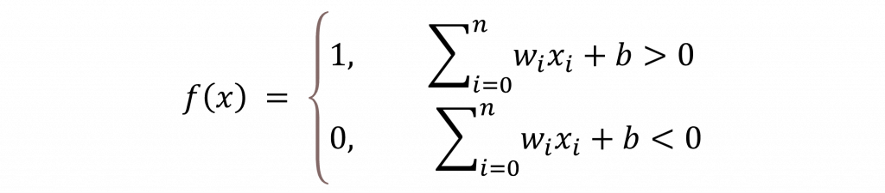

該函數的用法是將計算結果大於 0 的轉換成 1，小於 0 的結果轉換成 0，這樣就能完成一個簡單的二元分類器。而這種通過模型計算出答案的過程在深度學習中被稱之為`前向傳播(Forward Propagation)`

> 偏移量 `b` 可能為 0，其參數代表答案的偏向。例如，當我們知道答案可能會偏向於正值時，偏移量可以設定為大於 0 的常數；若答案可能為負值，偏移量則可以設定為小於 0 的常數。

不過由於權重是隨機初始化的狀態，因此在模型的初始狀態基本上運算出的答案都是錯誤的，因此我們需要有一個有效的方式來調整其權重的變化，而這個動作就叫做反向傳播`(Backward Propagation)`，其基本概念就是通過計算出預測標籤與實際標籤的`損失值(Loss)`，並計算出會變動的`參數(Parameter)`的`梯度(Gradient)`，以找出這些參數的變化方向。

上述公式中，我們可以發現輸入 `x` 並不會改變，且偏移量 `b` 是常數，因此我們應該調整適當的權重 `w` 來計算出正確的答案。因此我們需要計算出損失值對於權重的變化量 `𝜕Loss/𝜕w`。在這裡我們先假設`損失函數 (Loss Function)` 是使用`均方誤差 (Mean-Square Error, MSE)`，其數學式如下:


接下來我們需要針對這個損失函數對`w`進行偏微分的動作，以計算出損失值對於權重的變化量 `𝜕Loss/𝜕w`，不過由於階梯函數是一種不連續的函數，因此我們可以忽略其計算結果，直接使用`wx+b`的運算結果進行處理即可，這時我們將能夠使用`連鎖律(Chain rule)`推理出以下結果。

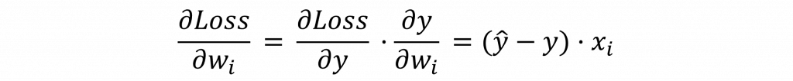

而計算完的結果將代表者每個權重的變化量與變化方向，我們可以將權重、損失值與梯度整理成下圖之間的關係。


在我們的最終目的就是計算出 `𝜕Loss/𝜕w = 0`，這也代表著在上圖中我們會想要讓右邊的紅點向右移，左邊的紅點向左移，因此對其優化方是我們可以採用`梯度下降法(Gradient descent)`，其數學式如下：

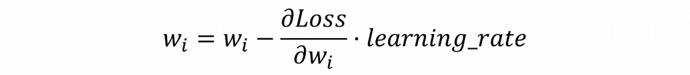

其中我們可以發現，在調整權重時還會與`學習率(Learning rate)`進行運算。學習率通常是一個非常小的數值，原因是如果我們計算出來的梯度太大，圖中的紅點就會一次移動得很遠。因此通過這個學習率超參數，我們可以控制紅點的移動速度，使其逐漸收斂到損失值較低的位置。而這種優化的算法在深度學習中則被稱之為`優化器(Optimizer)`

總結
--

這次我們學習了深度學習中監督式學習的完整流程，並解析了其中的數學原理。你可能會覺得今天的內容有些複雜，因此在今天的最後，我會用一句話來總結我們今天學到的內容。其實**整個深度學習的過程就是前向傳播計算答案、損失函數計算損失值、反向傳播計算梯度、使用梯度配合優化器更新可調參數**，通過不斷迭代最終計算出答案。這樣子理解整個深度學習的概念就變得簡單許多了!

---

<a id="7467-day-04"></a>

## Day 04｜【Day 4】用Numpy實作完整的模型訓練過程-用單層感知器解邏輯閘問題

- 原文：https://ithelp.ithome.com.tw/articles/10353483
- 發佈時間：2024-09-18 19:02:48

前言
--

昨天我們證明了單層感知器的完整數學推導，而在今天我們將把這些理論知識轉換成對應的程式碼。這個過程在學習深度學習技術時是至關重要的一步，因為我們今天所做的事情是所有深度學習程式的基本概念，當你理解這些內容後，你在去接觸到其他深度學習的函式庫時，就能更好地理解它們的原理和運作方式。

單層感知器解邏輯閘問題
-----------

我們知道邏輯閘是一種二元分類的元件，因此非常適合用來作為單層感知器的資料型態。因此今天在撰寫程式碼時，我們將使用AND邏輯閘作為範例，示範如何建立一個單層感知器並進行模型的訓練，現在讓我們來看看建立模型的步驟

### 【STEP 1】初始化單層感知器類別

在建立模型時，通常會將會變動的參數放在 `__init__` 方法中，並**在這個步驟中進行基本的隨機初始化**，這樣子做的好處是當模型訓練完畢後其參數的變化將會被保存在這個類別中使我們能夠快速地讀取與儲存。

因此在這一步驟中，我會先在這裡宣告偏移量及對應的權重，同時**由於我們在更新權重時會使用梯度下降法，這還需要一個學習率參數**，因此我也會在 `__init__` 中設定它。

```python
import numpy as np

class Perceptron:
    def __init__(self, input_shape, bias=0, learning_rate=0.1):
        # 初始化權重
        self.weights = np.random.randn(input_shape)
        
        # 初始化偏移量
        self.bias = bias
        
        # 初始化學習率
        self.learning_rate = learning_rate
```

在這個步驟中，由於**我們的權重會根據輸入資料的數量而有所變化**，因此我們需要傳入一個`input_shape`參數，以幫助模型建立正確的資料維度。在深度學習的模型中，**如果資料計算的維度錯誤，就會導致模型發生Shape Error的問題**。這一點是在剛學習深度學習程式時最容易遇到的錯誤。

### 【STEP 2】定義前向傳播方式

而在深度學習的第一步中，就是要定義它的前向傳播方式。這個過程也就是昨日提到的 `wx+b` 這個數學公式，並搭配階梯函數來轉換其類別，因此對於該方法的定義如下所示：

```ruby
def forward(self, x):
        # 前向傳播公式 wx+b
        z = np.dot(x, self.weights) + self.bias
        # 階梯函數轉換結果
        y_hat = self.step_function(z)
        return y_hat
        
    def step_function(self, z):
        return (z >= 0).astype(int)
```

在這裡要注意的是，**我們使用的程式碼採用矩陣相乘的方式**，因此需要調用 `np.dot` 來進行運算。此外在階梯函數的部分，我們設定了一個條件式 `z >= 0`。該條件式會將符合條件的結果轉換為 `True`，不符合的則為 `False`。而這正好符合我們需要的 0 與 1 類別，不過我們需要將其轉換成 int 型態即可。

### 【STEP 3】定義反向傳播

在這一步驟中由於我們已經將損失函數和反向傳播證明簡化完畢，因此不需要先計算損失值的部分，而是直接依照昨日公式定義的反向傳播方法，同時進行參數優化。不過我們在這邊還是選擇保留損失函數的計算，因為可以通過該損失值來判斷模型當前的訓練效果。

```ruby
def backward(self, x, y, y_hat):
        # 計算梯度
        grad = (y - y_hat)
        
        # 優化器更新參數
        self.weights += self.learning_rate * grad * x
        self.bias += self.learning_rate * grad
        
     def loss_function(self, y_hat, y):
        # MSE計算損失值
        return 0.5 * (y - y_hat) ** 2
```

### 【STEP 4】定義預測方式

最後當我們訓練完模型後，需要一個方法來調用訓練好的參數。此時我們可以簡單地用前向傳播方式進行包裝。

```ruby
def predict(self, x):
        # 預測時直接調用訓練好的前向傳播函數
        return self.forward(x)
```

如此一來我們就完成模型的建立了。

### 【STEP 5】定義訓練方式

模型的訓練方式非常簡單，而且通常不會有過多的變化。在這裡我們通常會以一個`週期（Epoch）`為單位。在每個週期中，我們會將資料集拆分成多個`批次（Batch）`。這樣做的原因是因為計算時需要適當的記憶體空間或GPU空間，如果一次給予過大的資料，就會導致`記憶體不足（Out of memory, OOM）`的問題。在這裡我們也可以調用模型的損失函數來查看每個週期的損失值變化。

```python
def training(model, x_train, y_train, epochs=10):
    for epoch in range(epochs):            # 週期
        total_loss = 0                     # 紀錄每個周期的損失值
        for x, y in zip(x_train, y_train): # 批量
            y_hat = model.forward(x)
            loss = model.loss_function(y_hat, y)
            total_loss += loss
            model.backward(x, y, y_hat)
        print(f'Epoch {epoch}, Loss: {total_loss:.5f}')
    print('訓練完畢!')
```

### 【STEP 6】準備資料並建立單層感知器

首先，我們需要為模型提供訓練數據。在這裡，我們的目標是模擬 AND 閘的邏輯，因此我們需要 AND 閘的輸入和對應的輸出結果。這裡我們以兩個輸入作為範例，當然你也可以使用更多個輸入並相對應地調整標籤與輸入。

```lua
x_train = np.array([[0, 0], [0, 1], [1, 0], [1, 1]])
y_train_AND = np.array([0, 0, 0, 1])
```

接下來我們需要建立一個單層感知器模型，在這裡我們使用剛剛建立`Perceptron`並輸入對應的`input_shape`即可完成模型的建立，在這裡我們可以使用`x_train.shape[1]`取的其資料的第二軸維度，以此獲取輸入資料的大小

> `x_train`的資料維度是`(4, 2)`，分別對應`(batch_size, input_shape)`，這也代表我們的輸入資料有4筆，每筆包含2個特徵。

```ini
# 建立單層感知器模型
model = Perceptron(input_shape=x_train.shape[1], learning_rate=0.1)
```

最後我們只需要調用訓練用的函數 `training`，就能更完整地實現前向傳播與反向傳播來更新這些可變動的參數了。在這裡我們要注意 `epochs` 的次數，**若設定得太少則會導致訓練不完全，設定得太多則會導致`過度擬合(Overfitting)`的問題**。不過在這裡，由於訓練資料比較簡單且只有訓練資料，因此不必考量過度擬合的問題，所以我們可以將 `epochs` 的次數設定高一些。

```scss
# 訓練模型
training(model, x_train, y_train_AND, epochs=20)
```

### 【STEP 7】訓練結果

最後我們將使用訓練好的權重來預測這些邏輯閘的效果。在這裡我們可以看到其預測的類別已經能完美地呈現AND邏輯閘的功能。當然我們也可以重新調整參數或更換成不同的邏輯閘，來觀察模型的訓練效果。我非常建議大家對這部分進行調整與實驗，這樣你更能理解這些超參數的實際用意。

```python
# 測試模型預測結果
print("\n測試訓練模型:")
for x in x_train:
    print(f'輸入: {x}, 預測輸出: {model.predict(x)}')
#-----輸出-----
輸入: [0, 0], 預測輸出: 0
輸入: [0, 1], 預測輸出: 0
輸入: [1, 0], 預測輸出: 0
輸入: [1, 1], 預測輸出: 1
```

總結
--

現在你學會了如何使用單層感知器來模擬不同的邏輯閘，並在這過程中理解了感知器的基本原理與訓練過程。透過實作前向與反向傳播、梯度下降優化，以及訓練過程的方式，你在基礎上就對深度學習有了深刻的印象。這樣在後續的章節中，你將能夠更好地銜接不同的模型與數學公式。

---

<a id="7467-day-05"></a>

## Day 05｜【Day 5】單層感知器為何無法解決XOR問題-多層感知器介紹與數學證明

- 原文：https://ithelp.ithome.com.tw/articles/10354209
- 發佈時間：2024-09-19 14:50:00

前言
--

在昨天如果你有嘗試調整超參數並更換其他邏輯閘，你可能會發現**無論怎麼調整，XOR與NXOR這兩個邏輯閘都無法正確的被預測**。這是因為單層感知器的原理是**在一個平面座標上畫一條直線來分割不同的分類(也就是非線性可分)**，因此當XOR與NXOR的輸入對應到x和y座標時，我們會發現無法用一條線進行分割。因此今天我們將學習如何解決這個問題。

多層感知器(Multilayer Perceptron)
----------------------------

`多層感知器(Multilayer Perceptron, MLP)`能解決非線性可分的關鍵在於它引入了`隱藏層(Hidden layer)`，這使得每一個每個隱藏層中的`神經元(Neuron)`能夠學習更高階的複雜特徵，從而處理非線性問題。這個概念也就是通過增加神經網路的深度與隱藏層神經元數量，能夠大幅提升模型的表現與準確性。

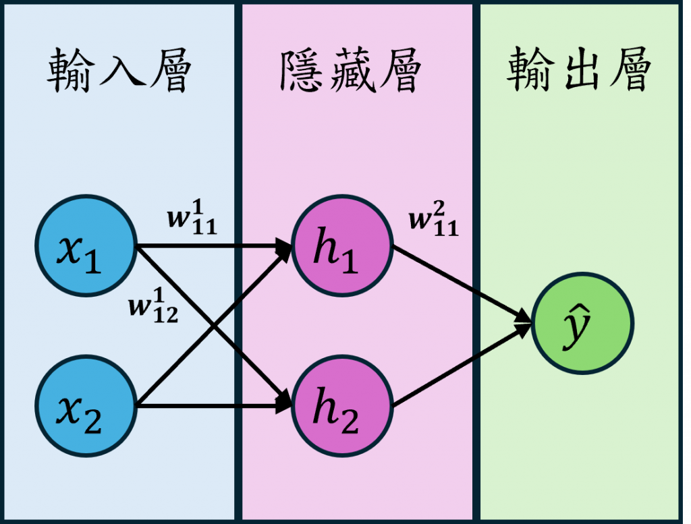

在多層感知器中通常會在層與層之間設定不同的激勵函數，將`wx+b`這一個線性運算轉換成非線性的結果，我們可以設定多個隱藏層經過多次線性變換和非線性激活，逐層提取更高階的特徵，現在讓我們看看圖片中的數學公式是如何計算出來的吧。

### 前向傳播

多層感知器的前向傳播公式其實相當直觀，其基本原理就是**將單層感知器的結果不斷向後面的神經網路傳遞**。因此我們首先要計算從輸入層到隱藏層神經元 `h` 的結果，其計算方式與單層感知器相同，都是使用 `wx+b`。不過為了方便運算，這裡暫時省略了偏移量。

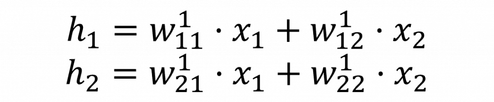

接下來我們要計算從隱藏層到輸出層的過程，我們選擇使用`sigmoid`激勵函數。該函數可以將數值縮放到0到1之間，這對於二元分類或一些開關控制特別有效。在這裡，我們先計算出未經過激勵函數運算前的結果`z`，並將其帶入到`sigmoid`函數中，以計算出預測輸出`ŷ`。


而之所以加入 `sigmoid` 函數，是因為**當我們的計算複雜度變大時，輸出的輕微調整可能會帶來很大的變化**。因此我們通過使用 `sigmoid` 函數來縮放其輸出數值，確保最終的損失值不會出現過大的變動。這樣在計算梯度時，變化會更為合理。以下圖示展示了 `sigmoid` 函數的輸入與輸出變化。


### 反向傳播

而在這多層的神經網路架構中其反向傳播是非常繁雜的，同樣的我們先從損失函數與預測輸出開始進行連鎖律運算，其數學式如下:


其中我們可以直接計算出`𝜕Loss/𝜕ŷ`的答案，但是我們並不知道`𝜕ŷ/𝜕w`的答案。這是因為對於`𝜕ŷ/𝜕w`來說，它還經過了激勵函數的轉換與隱藏層的計算。因此，我們還需要針對`𝜕ŷ/𝜕w`再次使用連鎖律進行展開。因此我們可以再次證明出以下的數學公式。


這裡計算到目前為止，我們已經能夠取得**隱藏層到輸出層**的權重梯度變化值，但這還不夠我們還必須計算出**輸入層到隱藏層**的權重梯度變化值。

因此我們需要**針對每個隱藏層的神經元，計算損失值相對應的偏微分**，也就是計算`𝜕Loss/𝜕h`這個結果。這部分的計算過程與先前類似，所以在這裡我們直接將其一次證明完畢(紅字的部分是使用連鎖律再次展開)


到這裡我們已經完成了整個圖片中多層感知器的前向傳播和反向傳播。可以看到當我們的神經網路越深時，其計算量和反向傳播的公式會變得更加複雜。因此在實際使用程式進行運算時，並不會真的手動計算這些反向傳播的公式，而是採用自動微分的方法來追蹤和計算梯度，這樣能更高效且準確地完成梯度的計算。

總結
--

我相信你今天看到這裡可能已經對反向傳播的概念更清楚一些了，但還是無法完全理解每一個數學式該如何計算。這樣其實非常正常，因為神經網路的關係過於複雜，很難一下子就掌握這些方程式之間的關係。所以當我們在計算反向傳播時，只需要記得一件事：**如果我們所求的目標無法直接進行偏微分，那麼就一定要進行連鎖律展開**。而連鎖律展開的相關變數，會是當前神經網路層的上一層輸出變數。

---

<a id="7467-day-06"></a>

## Day 06｜【Day 6】用Numpy實作完整的模型訓練過程2-用多層感知器解XOR邏輯閘問題

- 原文：https://ithelp.ithome.com.tw/articles/10354833
- 發佈時間：2024-09-20 11:25:22

前言
--

今天我們一樣要來用Numpy手刻一下多層感知器這個神經網路。不過今天我對昨天神經網路結構圖進行了一些簡單的改造，目的是為了讓神經網路更加有效，並減少調參的部分。在接下來的內容中，我將會告訴你如何建立和使用這些改進後的神經網路。

多層感知器解XOR邏輯閘問題
--------------

在這次的程式撰寫邏輯上，基本上與我們在[第4天](https://ithelp.ithome.com.tw/articles/10353483)接觸到的寫法相似。**但是這次的寫法我會以批次運算取代透過for迴圈逐一運算每個輸入與輸出**。因此運算難度和模型建構的難度都有所增加，因此，如果遇到看不懂的程式碼部分，可以先回去看看第4天的程式碼寫法，這樣會比較容易理解今天的內容。

### 【STEP 1】初始化類別

初始化的動作與單層感知器基本上並無太大的差異，但我們在此增加了一個 `hidden_shape` 參數，該參數代表輸入層連接了多少個隱藏層。例如在昨天的例子中，我們使用了 2 個隱藏層神經元，因此在這裡該參數的設定為 2。

```python
import numpy as np

class MLP:
    def __init__(self, input_shape, hidden_shape=2, output_shape=1, learning_rate=1):
        # 初始化權重和偏移量
        self.W1 = np.random.randn(input_shape, hidden_shape)
        self.b1 = np.zeros((1, hidden_shape))
        self.W2 = np.random.randn(hidden_shape, output_shape)
        self.b2 = np.zeros((1, output_shape))
        
        # 初始化學習率
        self.learning_rate = learning_rate
```

### 【STEP 2】定義前向傳播方式

接下來我們針對前向傳播的公式做了一些調整，具體來說就是在輸入層到隱藏層之間加入sigmoid函數，其目的是讓模型能更好地解決非線性的問題。

```python
def sigmoid(self, x):
        return 1 / (1 + np.exp(-x))
 
    def forward(self, x):
        # 前向傳播：計算每層的輸出
        self.z1 = np.dot(x, self.W1) + self.b1
        self.a1 = self.sigmoid(self.z1)
        self.z2 = np.dot(self.a1, self.W2) + self.b2
        self.a2 = self.sigmoid(self.z2)
        return self.a2
```

### 【STEP 3】定義反向傳播

我們昨天學習到反向公式是非常繁瑣的。而在這些公式中，你可能發現了只要看到與`𝜕𝑧`相關的部分，都會產生`y * (1 - y)`這個公式。事實上**這個動作就是Sigmoid函數的求導過程**。因此我們可以寫一個`sigmoid_derivative`函數，這樣當我們需要使用Sigmoid函數的導數時，就可以直接調用這個函數。

```ruby
def sigmoid_derivative(self, y):
        return y * (1 - y)
```

在這裡同樣地，我們保留尚未被簡化前的損失函數，但要注意的是由於**我們是以批次為單位進行計算，因此我們實際上返回的是每一個計算誤差的平均值。**

```ruby
def loss_function(self, y_hat, y):
        # 計算均方誤差 (MSE) 損失
        return np.mean(0.5 * (y - y_hat) ** 2)
```

而在定義公式時我們只需要輸入昨天的公式即可，首先我們先將隱藏層到輸出層的權重梯度公式定義為`delta2`，而輸出層到隱藏層的公式定義為`delta1`。不過**由於我們在一開始在輸出層到隱藏層之間多加了一個sigmoid函數**，因此在定義`delta1`的公式時，我們需要多計算一個`sigmoid_derivative`。

```python
def backward(self, x, y):
        # 計算梯度並更新權重和偏移量
        m = x.shape[0]
        delta2 = (self.a2 - y) * self.sigmoid_derivative(self.a2)
        dW2 = (1 / m) * np.dot(self.a1.T, delta2)
        db2 = (1 / m) * np.sum(delta2, axis=0, keepdims=True)
        
        delta1 = np.dot(delta2, self.W2.T) * self.sigmoid_derivative(self.a1)
        dW1 = (1 / m) * np.dot(x.T, delta1)
        db1 = (1 / m) * np.sum(delta1, axis=0, keepdims=True)
```

這裡有一個需要注意的地方，由於我們採用的是批量運算，因此**所有的梯度都應該計算其平均值**。所以在程式碼中我們使用到`1/m`來計算當前批量內每一個梯度的平均值，這樣才能夠正確地更新權重與偏移量，而更新其參數的方式，我們同樣採用梯度下降法來調整參數。

```python
# 更新權重與偏移量
        self.W2 -= self.learning_rate * dW2
        self.b2 -= self.learning_rate * db2
        self.W1 -= self.learning_rate * dW1
        self.b1 -= self.learning_rate * db1
```

### 【STEP 4】定義預測方式

而在**進行預測時我們需要預測的目標是類別**，但調用前向傳播 `forward()` 函數只會產生一個介於 0 到 1 之間的數值。因此我們可以**選擇這個數值的中間值作為類別的預測結果**。到這邊我們已經完成模型的建立了

```python
def predict(self, x):
        # 預測時直接進行前向傳播
        y = self.forward(x) > 0.5
        return y.astype(int)
```

### 【STEP 5】定義訓練方式

在這次的訓練方式中，由於是批量運算因此**我們不需要撰寫一個 for 迴圈逐筆將資料傳送給模型進行運算**，因此可以直接移除該迴圈的部分，其他的計算方式和顯示方式則與先前相同。

```scss
def training(model, x_train, y_train, epochs=100):
    for epoch in range(epochs):
        y_hat = model.forward(x_train)
        loss = model.loss_function(y_hat, y_train)
        model.backward(x_train, y_train)
        if epoch % 1000 == 0:    
            print(f'Epoch {epoch}, Loss: {loss:.5f}')
    print('訓練完成!')
```

### 【STEP 6】開始訓練並預測結果

最後我們準備XOR的訓練數據，並建立多層感知器模型進行訓練。在這裡我們將`epochs`設定得比較高，這是因為這次的運算難度較高。為了確保模型能夠收斂所以增加了訓練的次數。

```makefile
# XOR 訓練數據
x_train = np.array([[0, 0], [0, 1], [1, 0], [1, 1]])
y_train_XOR = np.array([[0], [1], [1], [0]])

# 建立 MLP 模型
model = MLP(input_shape=x_train.shape[1])

# 訓練模型
training(model, x_train, y_train_XOR, epochs=10000)

# 模型訓練後預測結果
print("\n模型訓練後預測結果:")
pred = model.predict(x_train)    # 一次預測而非單筆資料預測
for x, y in zip(x_train, pred):
    print(f'輸入: {x}, 預測輸出: {y}')
# -----輸出-----
Epoch 9000, Loss: 0.00030
訓練完成!

模型訓練後預測結果:
輸入: [0 0], 預測輸出: [0]
輸入: [0 1], 預測輸出: [1]
輸入: [1 0], 預測輸出: [1]
輸入: [1 1], 預測輸出: [0]
```

這時我們將會發現，即使更換成其他邏輯閘也能訓練出正確的結果。這就是為什麼現在的神經網路模型需要增加更多的層數和神經元數量。例如在我們這個任務中，我們讓其訓練的曲線在平面上進行轉彎的動作。這一發展就延續到現今像是ChatGPT、Stable Diffusion等技術，使其能在更高維的空間中進行運算。

總結
--

在這短短幾天內我們不只學習到了單層與多層感知器的詳細結構，還學會了如何透過矩陣計算來減少 for 迴圈的次數以加快模型運算速度，同時我們還證明了這些不同模型的反向傳播過程。而即使不完全理解這些證明也不用擔心，隨著後續神經網路變得越來越複雜，這些反向傳播的證明將變得不太重要，因為有函式庫可以幫助我們進行計算。因此我們實際上需要理解的是這些模型在前向傳播中所使用的技術，這才是在深度學習技術中最重要的事情。

若你理解了這些內容後，不妨試著調整一些超參數的設定。例如我們可以增加或減少隱藏層神經元的數量，也可以調整學習率和訓練次數等。我們學習的目標是了解如何調整這些參數，使其能夠產生最低的損失值。這個調整參數的經驗與過程在我們優化模型時非常重要。

本文中的程式碼都放置在我的GitHub中:

[Learning-AI-in-30-Days-by-Using-Math-for-Better-Understanding](https://github.com/AUSTIN2526/Learning-AI-in-30-Days-by-Using-Math-for-Better-Understanding)

---

<a id="7467-day-07"></a>

## Day 07｜【Day 7】深度神經網路與多層感知器的差異解析及PyTorch安裝指南

- 原文：https://ithelp.ithome.com.tw/articles/10355689
- 發佈時間：2024-09-21 20:47:02

前言
--

我相信被這幾天的數學式砲轟你應該不會想再繼續看數學了，所以我們今天來學點輕鬆的。在我們昨天的內容中提到，計算反向傳播時層數越多，數學公式就會變得更加複雜。當我們想要疊加數十層神經網路時，必須進行大量數學運算來撰寫程式。尤其在前向傳播公式非常複雜的情況下，反向傳播幾乎變得無法運算。因此在今天**我將告訴你如何使用Pytorch函式庫來建立前向傳播與反向傳播**，並解釋多層感知器與`深度神經網路（Deep Neural Network, DNN）`之間的差異。

深度神經網路(Deep Neural Network)
---------------------------


> 圖片來源:[點我](https://www.researchgate.net/publication/341037496/figure/fig2/AS:885845418598400@1588213414923/Deep-Neural-Network-DNN-example.ppm)

我們學習到的多層感知器是一種前饋神經網路，該模型架構包含輸入層、多個隱藏層和輸出層，這種模型架構也被稱為`全連接層 (Fully Connected Layer)`。但這種簡單的模型無法做到過於非線性的運算，因此隨著深度學習的發展，我們需要更複雜的運算和模型。

於是深度神經網路就出現了，**深度神經網路與多層感知器的主要差異在於層的數量**。事實上多層感知器可以被認為是深度神經網路的一種應用，但無論你稱它為多層感知器或深度神經網路，兩者實際上是相似的。對於學習 AI 的人來說，你說出這些名詞（全連接層、多層感知器、深度神經網路）都能理解，因為它們的數學原理都是基於 `wx+b`。

而這些名詞之間只有些微的差異，例如全連接層通常指某個不同模型連接後的層數；深度神經網路指使用 `wx+b` 公式的多層網路；而多層感知器通常指僅有一層輸入、一層隱藏和一層輸出的深度神經網路模型。這也是我們在學習 AI 中最容易發生的狀況之一「**多個名詞指向類似的技術原理**」。

> 在學習人工智慧時其實有蠻多時間在搞清楚這些名詞之間的關聯性與上下級關係，而知道這一點的用處就是當你在觀看Paper時，更能夠知道該作者所想表達的意圖。

Pytorch的安裝
----------

而向深度神經網路這樣子較為龐大的模型我們就必須使用深度學習函式庫進行反向傳播的運算，並且由於計算量較於複雜，因此通常要使用 GPU 或是 TPU 進行運算，所以我將告訴該如何正確的安裝 GPU 版本的Pytorch。

### 【STEP 1】檢查顯示卡CUDA支援的版本

首先，我們需要安裝 NVIDIA 的顯示卡驅動程式。大部分電腦預設上應該已經安裝，但如果沒有，你可以自行到 [NVIDIA官網](https://www.nvidia.com/zh-tw/drivers/)進行下載。當完成這個步驟後，我們需要檢查自己顯示卡支持的 CUDA 版本。這時可以在 `命令提示字元 (CMD)` 中輸入以下指令：

```undefined
nvidia-smi
```

此時我們將會看到顯卡的相關資訊並在訊息欄的右上角可以看到 CUDA 支持的最高版本，而這一點就是我們在後續選擇 PyTorch 版本 時所能安裝的最高版本。

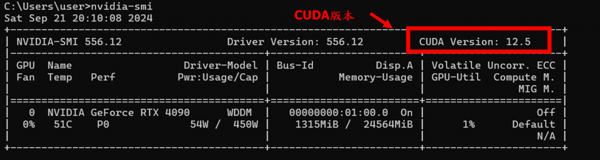

### 【STPE 2】前往Pytorch官方網站

我們可以在 [PyTorch 官方網站](https://pytorch.org/) 找到以下畫面。在這個頁面上，你需要做的是**挑選出較上一個步驟中 CUDA 版本更低的 PyTorch安裝指令**。因此根據本文所述情況，我們可以選擇 CUDA 12.4 版本進行安裝。


> 若你的顯示卡較為老舊且最高支援的 CUDA 版本不足最低需求，可以選擇該頁面上方的`install previous versions of PyTorch`。這樣你也能夠成功安裝 Pytorch 的 GPU 版本。

### 【STEP 3】輸入安裝指令並測試

接下來，我們將在命令提示字元中輸入上圖中的文字並等待安裝。這個過程大約會下載3GB左右的文件，因此可能需要一些時間來完成。

```perl
pip3 install torch torchvision torchaudio --index-url https://download.pytorch.org/whl/cu124
```

這時我們無法確認電腦是否成功安裝了 Pytorch 的 GPU 版本，尤其是在 Windows 環境中較為複雜，甚至可能因安裝了多個 Python 版本而導致 `pip` 指令不確定裝在哪個版本的 Python 中。因此我們可以在 Python 作業環境中輸入以下指令：

```python
import torch
print(torch.cuda.is_available())
# -----輸出-----
True
```

這時當回傳`True`時將代表之後可以使用 Pytorch 的 GPU 版本功能來加速運算了，**若顯示`False`不妨先檢查自己的Python版本是否高於3.8**，並且檢查是否有存在多個 Python 致環境變數錯亂。

> 即使沒有 GPU 你仍然可以安裝 PyTorch 的 CPU 版本，只需輸入 `pip install torch` 即可完成安裝。不過需要注意的是，CPU 版本的運算速度遠遠不及 GPU 版本。這是因為 GPU 可以利用`乘數累加器(Multiply Accumulate, MAC)`進行大量的矩陣運算，相比之下在CPU上計算時，則需要使用多個步驟來完成相同的運算。

總結
--

我們今天簡單地區分了多層感知器與深度神經網路的差異，以讓你對這些名詞更加熟悉。同時我們也解釋了全連接層這一個關鍵名詞，這個名詞通常會出現在模型的最後一層，因此應該是最常見的。

而今天我主要還是告訴你如何安裝正確的 PyTorch GPU 版本，以加速大型模型的計算過程。這一點非常重要，因為當初我在學習 AI 時，光是安裝 PyTorch 就花費了非常多的時間。尤其是由於我的顯卡很舊加上網路不穩，每次重新下載 PyTorch 都需要等待3GB的下載時間，因此我在這裡特別強調這些重點，讓你少走些冤枉路。

---

<a id="7467-day-08"></a>

## Day 08｜【Day 8】使用Pytorch實現深度神經網絡進行MNIST手寫數字辨識

- 原文：https://ithelp.ithome.com.tw/articles/10356442

前言
--

現在你已經了解了什麼是深度神經網路，所以今天我們主要學習如何使用 Pytorch 來完成前幾天所講的前向傳播和反向傳播方法。我們將使用MNIST這個手寫辨識資料集，進行模型的訓練和預測，讓你瞭解實際上的深度學習運算過程。

這次我們同樣使用監督式學習和深度神經網絡來解決 MNIST 手寫數字辨識問題。我會從下載數據集、定義模型、訓練模型到最終進行測試，詳細告訴你如何在 Pytorch 中實現。現在讓我們來看看以下步驟。

### 【STEP 1】下載資料集並進行資料前處理

首先我們需要`import`這次程式所必須的 Pytorch 函式庫，而由於我們將進行圖像辨識，因此我們會使用`torchvision`及其中的`transforms`來對圖像進行處理。

```
import torch
import torch.nn as nn       # 建立神經網路用
import torch.optim as optim # 建立優化器用
import torchvision
import torchvision.transforms as transforms
import matplotlib.pyplot as plt
import numpy as np
import random
```

接下來我們需要進行`資料前處理 (Data Preprocessing)`的步驟，這個步驟主要包括兩個部分。首先，將我們的`陣列 (List)`轉換成`張量 (Tensor)`類型。其次，對圖像進行`正規化 (Normalization)`處理。使用正規化的原因是，若輸入的資料數值過高，容易導致模型的梯度和損失值也變得很高，進而使每次的權重變動變得更加不可控制，讓模型更難收斂。因此，在資料前處理時，需要先完成這兩個重要的步驟。

> 張量是一種多維陣列，廣泛應用於深度學習中的資料處理，特別是在神經網路訓練過程中使用。張量可以是標量 (0 維)、向量 (1 維)、矩陣 (2 維) 及更高維度的資料結構。

```
# 數據預處理
transform = transforms.Compose([transforms.ToTensor(), transforms.Normalize((0.5,), (0.5,))])
```

接下來我們通過以下程式碼將定義好的 `transform` 作用在 MNIST 數據集上，同時我們也設定其超參數 `download=True` 開啟，這樣 我們就能夠快速地對這些照片進行資料前處理並下載。

> > 在這裡我們先不多說`datasets`與`DataLoader`這兩個類別的概念，其概念將會再後續章節進行詳細的講解。

```
# 下載 MNIST 數據集
train_dataset = torchvision.datasets.MNIST(root='./data', train=True, transform=transform, download=True)
test_dataset = torchvision.datasets.MNIST(root='./data', train=False, transform=transform, download=True)

train_loader = torch.utils.data.DataLoader(dataset=train_dataset, batch_size=64, shuffle=True)
test_loader = torch.utils.data.DataLoader(dataset=test_dataset, batch_size=64, shuffle=False)
```

同時我們設定批量數為 64 張圖片，使模型可以正常運算。我們之所以不像前幾天那樣一次把所有資料當作批量給模型訓練，是因為 MNIST 手寫辨識集在訓練集上有 6 萬張圖片，測試集則有 1 萬張，**對於一張 GPU 而言是無法一次容納下這麼多資料的。**

### 【STEP 2】查看資料大小與型態

而當我們在處理資料時，最需要理解的就是這些資料的維度，如果我們輸入錯誤的維度，模型就無法運作。這一點在單層感知器章節中已經提到過了，因為它太重要了所以我必須再重複一次。現在我們可以先通過以下的程式碼來取得訓練資料集的圖片及其對應的標籤，並顯示出它們的維度。

```
x_train = train_dataset.data    # 圖片
y_train = train_dataset.targets # 標籤
print(f'x_train size: {x_train.size()}')
print(f'y_train size: {y_train.size()}')
# -----輸出-----
x_train size: torch.Size([60000, 28, 28])
y_train size: torch.Size([60000])
```

從以上結果可以看到，訓練資料包含 60000 張圖片，每張圖片的大小為 `28×28` 像素。為了更直觀地理解這些圖片，可以使用 `matplotlib` 將它們可視化。在圖片中**越接近白色的區域，數值越接近 255；越接近黑色的區域，數值則越接近 0**，範圍介於 0 到 255 之間。由於數值較大，因此這也是我們在第一步驟所進行正規化的原因。

```
fig, axs = plt.subplots(1, 6, figsize=(15, 3))
for i in range(6):
    idx = random.randint(0, len(x_train) - 1)
    img, label = x_train[idx], y_train[idx]
    axs[i].imshow(img, cmap='gray')
    axs[i].set_title(f'Label: {label}')
    axs[i].axis('off')
plt.show()
```


### 【STEP 3】定義深度神經網路模型

在Pytorch中，需要繼承`nn.Module`來使用其相關的方法。不過其概念非常簡單，**我們通常會在`init`方法中定義模型的結構與激勵函數**。因此，若我們要定義一個有四層隱藏層的模型，可以這樣定義：

```
class DNN(nn.Module):
        def __init__(self, input_shape, output_shape):
            super(DNN, self).__init__()
            self.fc1 = nn.Linear(input_shape, 512)  # 輸入->隱藏
            self.fc2 = nn.Linear(512, 256)          # 隱藏->隱藏
            self.fc3 = nn.Linear(256, 128)          # 隱藏->隱藏
            self.fc4 = nn.Linear(128, output_shape) # 隱藏->輸出
            self.relu = nn.ReLU()  # 激勵函數
```

在定義模型的前向傳播過程時，有一個需要特別注意的地方：**由於深度神經網路只能處理一維的輸入資料**，因此我們需要將輸入的`28x28`圖片展平為784維的一維向量。為了實現這一點在輸入的第一層，我們會使用`view`函數來進行轉換操作。這樣可以確保網路能夠正確接收並處理資料。

> 在 `view` 函數中使用 `-1` 來表示自適應維度，**這是因為我們不確定輸入的批次大小，但我們知道每個輸入的特徵數量是 784**。因此我們可以將資料從形狀為 `(batch_size, 28, 28)` 轉換為 `(batch_size, 784)`。其中，`batch_size` 的維度使用 `-1`，可以自動計算並適應當前的批次大小。

```
def forward(self, x):
            x = x.view(-1, 28 * 28)
            x = self.relu(self.fc1(x))
            x = self.relu(self.fc2(x))
            x = self.relu(self.fc3(x))
            x = self.fc4(x)
            return x
```

在這裡我們使用了 `ReLU（Rectified Linear Unit）`作為激勵函數。其數學原理相對簡單：當輸入值小於0時，輸出為0；當輸入值大於或等於0時，輸出保持不變。ReLU 是隱藏層中最常使用的激勵函數之一，甚至像 ChatGPT 這類的語言模型也使用了基於 ReLU 的變體。因此本次教學中，我們將以 ReLU 作為激勵函數的範例來進行。

### 【STEP 4】訓練模型

在訓練模型時，雖然與前幾天的內容相似，但這裡我們仍需注意一些基本事項。由於我們使用梯度追蹤來進行反向傳播，計算損失值後可以使用內建的 `backward()` 方法來求取梯度。優化器則需要接收模型中所有可調整的參數，這是因為在模型通過 `backward()` 計算梯度後，還需要使用 `optimizer.step()` 更新權重。因此在初始化模型和優化器時，我們可以這樣撰寫程式碼。

```
# 定義損失函數和優化器
    model = DNN(x_train.shape[1] * x_train[2], len(set(y_train))
    criterion = nn.CrossEntropyLoss()        # 計算分類任務時通常會使用CrossEntropyLoss
    optimizer = optim.Adam(model.parameters(), lr=0.001) # Adam是一個通用性極高的優化器
```

在定義訓練過程時，還需特別注意 `optimizer.zero_grad()` 。原因在於每當我們追蹤梯度時，梯度會在每個批次中累加。如果不清除前一個批次的梯度，新的批次計算就會受到前一批次的影響。因此使用 `optimizer.zero_grad()` 的目的，**是確保在計算當前批次時，將其視為一次獨立的計算，不受之前批次的影響。**

```
def train_model(model, train_loader, criterion, optimizer, num_epochs=5):
    for epoch in range(num_epochs):
        running_loss = 0.0
        for i, (inputs, labels) in enumerate(train_loader):
            # 清空梯度
            optimizer.zero_grad()

            # 前向傳播
            outputs = model(inputs)
            loss = criterion(outputs, labels)

            # 反向傳播和優化
            loss.backward()
            optimizer.step()

            # 累計損失
            running_loss += loss.item() # item()張量轉換成純量
            if i % 100 == 99:
                print(f'Epoch [{epoch+1}/{num_epochs}], Step [{i+1}/{len(train_loader)}], Loss: {running_loss/100:.4f}')
                running_loss = 0.0
    print('Finished Training')
    
train_model(model, train_loader, criterion, optimizer, num_epochs=5)
# -----輸出-----
Epoch [5/5], Step [900/938], Loss: 0.0719
```

在該程式中我們可以清楚看到，訓練過程還是前向傳播、反向傳播、以及優化器更新權重這三個動作。並且在這裡我們也能關注損失值的變化。通常來說**如果損失值無法降低到 0.X 的範圍，這可能意味著模型在該資料集上的表現不佳，或者資料集本身存在問題**。這時可能需要檢查模型架構、資料集品質或訓練參數，來進一步改善結果。

### 【STEP 5】測試模型效能並進行預測

還記得我們下載資料時有一個測試資料集嗎？這個資料集的功能是用來驗證模型的實際效能。因為模型在訓練過程中已經看過訓練資料集，所以如果我們用訓練資料來驗證模型，結果可能會不準確。因此，我們通常會將資料進行分割，將部分資料保留，讓模型在訓練過程中無法接觸，並以此作為評估模型效能的依據。**這個概念可以比喻為：訓練資料就像課本裡的習題，而測試資料則是考試的內容，用來評估學習效果。**

```
def test_model(model, test_loader):
    correct = 0
    total = 0
    model.eval()  # 設置模型為推論模式
    with torch.no_grad():  # 禁用梯度計算
        for inputs, labels in test_loader:
            outputs = model(inputs)
            _, predicted = torch.max(outputs.data, 1)
            total += labels.size(0)
            correct += (predicted == labels).sum().item()

    print(f'Accuracy of the model on the 10000 test images: {100 * correct / total:.2f}%')

test_model(model, test_loader)
# -----輸出-----
Accuracy of the model on the 10000 test images: 97.45%
```

在這裡，我們需要將模型切換到`推論模式（inference mode）`，這樣在運算時可以固定模型中特定層所引入的隨機性變化(像是 `dropout` 這類層)。另外我們還可以使用 `with torch.no_grad()`，因為在**測試或推論模型時，我們不需要計算反向傳播**，這樣 PyTorch 就不會自動追蹤梯度變化，進而加快運算速度。

當模型訓練完畢並進行測試後，準確率甚至達到了 97%。接下來，若我們要進行實際預測，可以撰寫以下程式碼。但需要特別注意的是，**在實際預測時必須使用與訓練時相同的資料前處理技術**。若不遵守相同的處理步驟，則可能導致預測結果錯誤。

```
def predict_random_image(model, test_dataset):
    # 隨機選擇一張測試集圖片
    idx = random.randint(0, len(test_dataset) - 1)
    img, label = test_dataset[idx]
    img_reshaped = img.view(-1, 28 * 28)

    # 進行預測
    model.eval()
    with torch.no_grad():
        output = model(img_reshaped)
        _, predicted = torch.max(output.data, 1)

    # 繪製圖片並顯示預測結果
    plt.imshow(img.squeeze(), cmap='gray')
    plt.title(f'Ground Truth: {label}, Predicted: {predicted.item()}')
    plt.axis('off')
    plt.show()
```


這時我們已經發現模型能夠學會這些圖像的特徵，並進行預測了!

總結
--

從今天的內容中可以看到，在處理模型建立與反向傳播的部分比我們前幾日還要簡單許多了吧！而我們今天的內容都是在處理該如何繪製一個圖片、資料前處理與學習Pytorch的程式碼的一些程式規範，但在今天你可能接觸到了一些不同的激勵函數與損失函數導致你對這方面有點混亂，因此在明天我會將這些內容引入到內容中，讓你從數學方面更號的理解ReLU與CrossEntropyLoss究竟做了哪些事情。

---

<a id="7467-day-09"></a>

## Day 09｜【Day 9】辨識圖像的神工利器-卷機神經網路數學證明

- 原文：https://ithelp.ithome.com.tw/articles/10356789
- 發佈時間：2024-09-23 15:44:21

前言
--

在昨天，我們可以看到針對MNIST手寫辨識資料集，我們需要將其圖像轉換成一維的資料。**但是這樣的做法在實際應用中顯得不太實際**，因為大部分圖像都是彩色的，所以對於其資料維度應該是`(batch_size, 寬, 高, 色彩通道)`。假設我們的輸入是一張`28x28`的彩色圖像，這樣在給深度神經網路進行運算時，會產生`28x28x3`的輸入特徵。

這時就會導致輸入特徵越來越多，就會導致模型運算變得更加複雜，這樣子我們必須增加模型的參數量、深度，甚至增加資料集的數量，但資料蒐集的難度高標註的時間也要非常久，因此最合適的方法應該是我們需要使用其他模型來幫助我們達到目標，因此在今天我會告訴你`卷積神經網路(Convolutional Neural Networks, CNN)`在進行分類任務時常用的手段。

卷積神經網路(Convolutional Neural Networks)
-------------------------------------


卷積神經網路是一種專門用來處理圖像資料的模型。它的概念是**通過`卷積核(Kernel)`來提取不同層次的特徵**。一個卷積神經網路通常包含卷積層、池化層以及全連接層。現在讓我們來看看在一個卷積神經網路中進行了哪些操作吧。

### 卷積層(Convolution Layer)

在`卷積層(Convolution Layer)`中其最重要的目的是通過卷積核來提取圖像中的局部特徵，以找出如邊緣、角點和更復雜的圖像結構，而其作法就是通過不斷的滑動卷積核並與其進行`阿達瑪乘積(Hadamard product，符號⊗)`，我們可以看到下圖中的做法。


在上圖中我們可以看到原始圖像會與卷積核進行運算，並且通過設定`步長 (Stride)`來滑動卷積核的位置以產生新的圖像。不過**我們會發現當卷積核滑動到底部和右邊邊緣時，卷積核的一部分會超出原始圖像的範圍**。為了解決這個問題，我們需要使用`填充 (Padding)`技術。

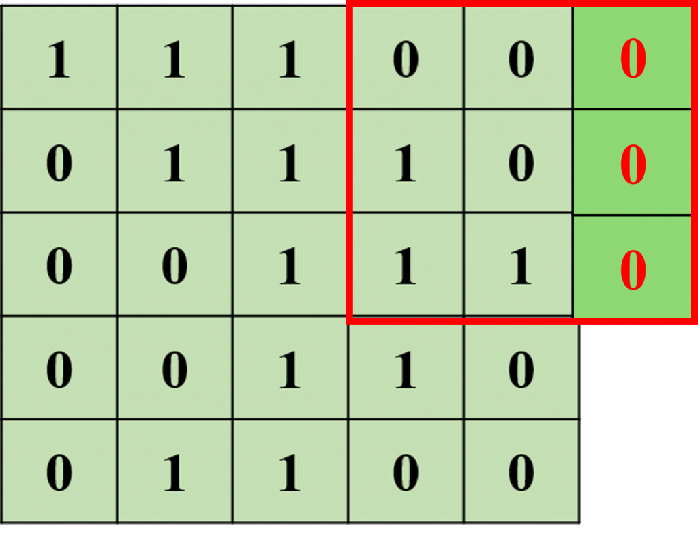

其中最常用的方法是`零填充 (Zero Padding)`，即把超出邊界的部分補上0。這樣可以保持原始圖像的尺寸，從而產生最終的`特徵圖 (Feature Map)`。而對於卷積層我們可以用以下公式表達(`I`為輸入的圖像特徵、`K`為卷積核矩陣)

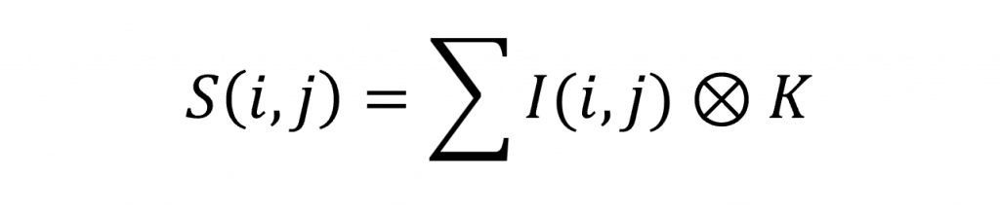

而通過應用不同的卷積核，**每一層卷積層將會擷取到更加抽象和高階的特徵**，而對於其特徵圖的長與寬我們則可以代入以下公式計算(`k`為卷積核大小、`d`卷積核之間的間隔數、`s`為步長、`p`為是否要進行填充)


### 池化層(Pooling Layer)


接下來是`池化層（Pooling Layer）`，**這一層的作用是為了減少圖像的空間維度**，通常採用`最大池化（Max Pooling）`或`平均池化（Average Pooling）`來進行運算。

而在池化層中透過設定步長來選擇對應的目標範圍，並在這個範圍內計算平均值或找出最大值。有這一層的原因是我們通常會將一張圖像經過多次運算轉變為高維度的特徵圖，因此透過減少運算量可以防止`過度擬合（Overfitting）`的問題。在這裡我們可以來看到其數學公式如下(上公式為最大池化、下公式則為平均池化):

> 過度擬合是指模型在訓練集上表現良好，但在驗證或測試集上表現不佳的一種現象。這表示模型的複雜性過高，使其過分記住訓練集上的特徵，反而讓模型失去了泛化性。因此在設計適當的模型大小與深度時，必須參考資料集的大小，才能達到較佳的模型效果。


同樣的該層的特徵圖的長與寬我們同樣的可以使用卷積核的計算公式進行運算。

### 全連接層(Fully Connected Layer)

在我們討論了卷積神經網路的兩個層級之後，你可能會問為什麼需要計算每一層的輸出長度和寬度。這樣做的重要原因在於，**卷積層和池化層主要負責提取圖像的特徵，而實際的計算工作大多數是在全連接層中進行**。因此我們需要知道在設計時設定的特徵圖數量，以及經過一連串卷積層後的圖像尺寸。這樣我們才能將這些數據`攤平(Flatten)`，讓全連接層進行運算。前面的章節中我們已多次講解過全連接層的計算公式，所以在這裡就不再詳細說明。

### 交叉熵損失（CrossEntropyLoss）

在昨天的內容中，我們使用了 `交叉熵損失（CrossEntropyLoss）` 函數，該函數主要應用於分類任務。其數學公式相對簡單，通過真實標籤的概率分佈 `p(i)` 與預測的概率分佈 `p\hat(i)` 進行運算，並對每一類進行 `log` 運算後相乘。我們通過這種方式懲罰預測概率與真實標籤（標籤值為 1）的差異，同時對其他類別的預測概率與 0 之間的差異進行處理。

如下圖所示的公式是用於多分類預測問題時的交叉熵計算。在這種情況下我們會使用 `softmax` 激勵函數將預測結果 `y\hat` 轉換為概率分佈，而不僅僅是直接的數值。至於 `p(i)`，它的取值是 1（對應真實標籤）或 0（非真實標籤）。

> 在Pytorch中，我們不需要對最後一層進行`softmax`運算，其原因是在Pytorch中的`CrossEntropyLoss`函數中內建了`softmax`運算。因此，我們切記不能再次加入`softmax`，不然會導致運算效果不如預期。

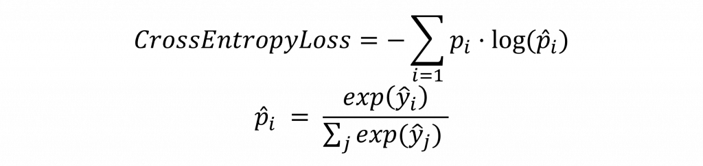

通常在卷積神經網路的應用中，多會使用這個損失函數來進行運算。我們在日常生活中其實經常遇到這類技術的應用，例如車牌辨識、人臉辨識、口罩辨識等系統，就是通過卷積神經網路與該損失函數所衍生出來的。

總結
--

在今天我們特別解析了卷積神經網路的模型結構以及其數學公式，其中**最重要的部分其實是計算每一層的特徵圖大小**，因為當我們將特徵圖輸入全連接層時，需要在Pytorch中手動計算這些大小。因此當我們在撰寫一些通用的輸入公式時，這些計算公式就變得特別重要。

另外我們也解釋了昨天使用的損失函數的原理，讓你對分類任務中的損失函數有更深刻的理解。同時我們也能瞭解到，為什麼在昨天的內容中，儘管沒有使用到`softmax`這個激勵函數，我們仍然能夠計算每一個輸出的機率。

---

<a id="7467-day-10"></a>

## Day 10｜【Day 10】用卷積神經網路解CIFAR10影像辨識 - 建立一套屬於自己優化方式的訓練器

- 原文：https://ithelp.ithome.com.tw/articles/10357353

前言
--

今天我們將進行Pytorch中的第二個模型建立，並使用`CIFAR-10`資料集進行影像辨識。不過這樣聽起來有點單調，所以在今天的章節中，我將跟大家介紹如何建立一個屬於自己的訓練器，並在這個訓練器上定義優化方法。

而**在本章節之後我們將會繼續使用這個訓練器進行模型的優化與調整**，因此在本章節建立卷積神經網路時我們將會把損失函數的結果應用到前向傳播的結果中，並在前向傳播的傳入參數使用`**kwargs`的方式傳遞以符合訓練器的設定。

而我們今天的主要目的是告訴你在建立訓練器之前**我們需要先了解在訓練模型時會發生的三件事情**。並將這些方案融入到訓練器中，以完成卷積神經網路的訓練。

建立訓練器(Trainer)
--------------

在**我們訓練模型時第一件需要注意的事情過度擬合的解決與適應**。由於我們很難配置一個完全符合資料集的模型，因此當模型訓練到後期，大多數情況下都會發生過度擬合的狀況。能夠完美收斂的模型非常罕見。因此我們需要找到一種方式來判斷模型在何時開始過度擬合，在下圖中展示了訓練時損失值與訓練周期之間的過度擬合現象。


我們可以看到，在這個訓練曲線中應該在損失值最低的部分儲存該模型的權重，並中斷模型的訓練，因此為了解決這個問題我們需要使用`提早停止(Early stopping)`這一項技術。該作法是**經過每訓練一個週期或一定`步數(Step)`後，透過驗證集來驗證當前模型的效能，如果驗證集的損失在一定的週期內不再下降則停止訓練**。

第二件事情則是**我們需要隨時儲存損失值最低的模型**。這樣配合提早停止的策略，我們將能夠獲得最佳的模型，同時達成適時中斷訓練這兩項目標。如此一來，我們也可以減少對於週期超參數的設計，直接依賴提早停止即可。

> 提早停止這項技術特別依賴驗證資料集，若無驗證資料集或是驗證資料集過少，就很容易導致模型訓練效果比為加入此技術的狀態還差，因此該技術通常作用在有一定數量的資料集上時就會顯得比就有優勢。

第三件事情是我們**要如何將損失值收斂到極限**。由於我們的學習率都是相同的，因此在訓練過程中，如果陷入局部最優解，可能會因為動力不足而無法跳脫。而這種情況下我們應該增加學習率，使模型能夠脫離這個困境。因此**我們需要一種能夠動態調整學習率的方法來優化模型**，這個方法就叫做`排程器（scheduler）`。除了幫助模型跳脫局部最優解之外，這個方法的應用非常廣泛，可以確保模型收斂到全局最優點、幫助找出資料的特徵方向等等。而在今天我們要將此策略一次寫入到`訓練器(Trainer)`中，現在讓我們看一下以下步驟:

### 【STEP 1】初始化訓練器類別

這次我們在初始化類別時，需要傳入以下參數：`訓練次數（epochs）`、`訓練資料集（train_loader）`、`驗證資料集（valid_loader）`、`模型（model）`、`優化器（optimizer）`、`排程器（scheduler）`、`提前停止的週期數（early_stopping）`、`模型權重的儲存名稱（save_name）`以及`訓練所使用的裝置（device）`。

而在這邊由於**我們的模型可能是由多個架構組合而成**，所以`optimizer`與`scheduler`實際上會被傳入一個容器型態，讓模型能夠各自更新。在`device`的部分，我們可以選擇自動判斷Pytorch版本是否能使用GPU進行運行，若能則自動抓取GPU進行訓練，或是讓使用者自行判斷是否要在CPU上運行或是使用GPU。保留這一點的彈性是因為**在GPU上運行程式碼時，Pytorch有時會無法正確判斷錯誤的代號**，因此我們有時需要手動轉換為CPU版本來進行除錯動作。

```
from tqdm import tqdm
import torch
import matplotlib.pyplot as plt

class Trainer:
    def __init__(self, epochs, train_loader, valid_loader, model, optimizer, device = None, scheduler=None, early_stopping = 10, save_name = 'model.ckpt'):
        # 總訓練次數
        self.epochs = epochs

        # 訓練用資料
        self.train_loader = train_loader
        self.valid_loader = valid_loader

        # 優化方式
        self.optimizer = optimizer # 優化器
        self.scheduler = scheduler # 排程器(用於動態調整學習率)
        self.early_stopping = early_stopping # 防止模型在驗證集上惡化
        
        # 若沒輸入自動判斷裝置環境
        if device is None:
            self.device = torch.device('cuda' if torch.cuda.is_available() else 'cpu')
        else:
            self.device = device

        # 宣告訓練用模型
        self.model = model

        # 模型儲存名稱
        self.save_name = save_name
```

### 【STEP 2】建立訓練方法與驗證方式

訓練時由於我們不清楚模型的訓練時間與進度，我們可以使用`tqdm`對`train_loader`進行包裝，以顯示這些資訊。並且我們在這裡需要特別注意一點，由於在**模型的前向傳播時所需要的參數可能各不相同**，因此我使用了`**input_datas`的方式，將輸入資料以`**kwargs`的方式傳入。**在之後模型定義中，我會將第一個回傳值設為損失值，第二個則為前向傳播結果**。因此，我們取出`outputs[0]`就能夠取得損失值，以進行反向傳播的計算。這樣子我們就寫出了一個叫通識化的訓練方法了。

```
def train_epoch(self, epoch):
        train_loss = 0
        train_pbar = tqdm(self.train_loader, position=0, leave=True)  # 進度條
        
        self.model.train() 
        for input_datas in train_pbar:
            for optimizer in self.optimizer:
                optimizer.zero_grad() 

            input_datas = {k: v.to(self.device) for k, v in input_datas.items()} # 將資料移動到GPU上
            outputs = self.model(**input_datas) # 進行前向傳播
            loss = outputs[0] # 取得損失值
            loss.backward() # 反向傳播

            # optimizer 可能有數個
            for optimizer in self.optimizer:
                optimizer.step()

            # scheduler 可能有數個
            if self.scheduler is not None:
                for scheduler in self.scheduler:
                    scheduler.step()
            

            postfix_dict = {'loss': f'{loss.item():.3f}'} # 定義進度條尾部顯示的資料
            train_pbar.set_description(f'Train Epoch {epoch}')  # 進度條開頭
            train_pbar.set_postfix(postfix_dict)                # 進度條結尾

            train_loss += loss.item()  # 加總損失值

        return train_loss / len(self.train_loader) # 計算平均損失
```

同樣地，我們還需要一個驗證的函數。這個函數與我們前幾天撰寫的測試準確率的函數相似，只需要將**訓練函數中包含梯度計算的部分全部移除即可**。

```
def validate_epoch(self, epoch):
        valid_loss = 0
        valid_pbar = tqdm(self.valid_loader, position=0, leave=True)
        
        self.model.eval()     # 將模型轉換成評估模式
        with torch.no_grad(): # 防止梯度計算
            for input_datas in valid_pbar:
                input_datas = {k: v.to(self.device) for k, v in input_datas.items()}
            
                outputs = self.model(**input_datas) 
                loss = outputs[0]
                
                valid_pbar.set_description(f'Valid Epoch {epoch}')
                valid_pbar.set_postfix({'loss':f'{loss.item():.3f}'})

                valid_loss += loss.item()

        return valid_loss / len(self.valid_loader)
```

### 【STEP 4】訓練模型的策略

現在我們來實現提早停止的策略，在這裡我們需要進行三個主要動作，分別是：

1.   紀錄訓練與驗證的損失值，並繪製出損失值的變化圖，以便觀察模型的訓練狀態。
2.   使用驗證損失值來紀錄模型的最低損失值。只要每次出現新的最低損失值，就儲存當前的最佳模型。
3.   設定提早停止的機制：當驗證損失值不再更新最低值時，將會增加一個名為 `stop_cnt` 的參數。如果這個參數的數值超過了設定的閾值，就表示模型可能已經發生過度擬合的現象，此時我們就需要啟用提早停止策略。

這三個步驟可以幫助我們在訓練過程中新快速定位最佳模型，同時避免過度擬合，提高模型的泛化能力，現在讓我們可以看到以下程式碼的撰寫方式。

```
def train(self, show_loss=True):
        best_loss = float('inf')
        loss_record = {'train': [], 'valid': []}
        stop_cnt = 0
        for epoch in range(self.epochs):
            train_loss = self.train_epoch(epoch)
            valid_loss = self.validate_epoch(epoch)

            loss_record['train'].append(train_loss) # 加入訓練的平均損失
            loss_record['valid'].append(valid_loss) # 加入驗證的平均損失

            # 儲存最佳的模型
            if valid_loss < best_loss:
                best_loss = valid_loss
                torch.save(self.model.state_dict(), self.save_name) # 儲存模型
                print(f'Saving Model With Loss {best_loss:.5f}')
                stop_cnt = 0
            else:
                stop_cnt += 1

            # Early stopping
            if stop_cnt == self.early_stopping:
                output = "Model can't improve, stop training"
                print('-' * (len(output) + 2))
                print(f'|{output}|')
                print('-' * (len(output) + 2))
                break

            print(f'Train Loss: {train_loss:.5f}', end='| ')
            print(f'Valid Loss: {valid_loss:.5f}', end='| ')
            print(f'Best Loss: {best_loss:.5f}', end='\n\n')
        
        # 顯示訓練曲線圖
        if show_loss:
            self.show_training_loss(loss_record)
```

### 【STEP 5】繪製損失函數

當我們取得驗證和訓練的損失值後，我們還需要建立一個繪製損失函數的方式，我們需要使用到 `plt.plot` 這個方法。這個方法會把我們儲存的數值轉換成 Y 軸的數值，並自動產生對應的 X 軸，然後將這些點連接起來形成折線圖。這樣一來我們能夠更直觀地了解在模型訓練過程中是否出現`梯度爆炸（Gradient Explosion）`和`梯度消失（Gradient Vanishing）`的問題。

> 梯度消失指的是在反向傳播過程中，誤差的梯度在每一層傳遞時，**梯度逐漸變小最終趨於零，導致網路的權重無法有效更新**。而梯度爆炸則是指在反向傳播過程中，**梯度值隨著網路層數增加而變得越來越大，最終導致權重更新幅度過大**，造成網路訓練發散，模型無法收斂。
> 
> 
> 梯度消失問題通常會發生在使用sigmoid或tanh激勵函數的神經網路中（當輸出值接近0時，梯度值會非常小），而梯度爆炸問題則常出現在激勵函數未對輸入進行有效限制的情況下發生。

```
def show_training_loss(self, loss_record):
            train_loss, valid_loss = [i for i in loss_record.values()]

            plt.plot(train_loss)
            plt.plot(valid_loss)
            # 標題
            plt.title('Result')
            # Y軸座標
            plt.ylabel('Loss')
            # X軸座標
            plt.xlabel('Epoch')
            # 顯示各曲線名稱
            plt.legend(['train', 'valid'], loc='upper left')
            # 顯示曲線
            plt.show()
```

總結
--

今天我們主要介紹了如何在 PyTorch 中建立一個訓練器。建立訓練器的原因是訓練時的步驟通常具備高度重複性，因此我們自行建立一個訓練器可以幫助我們縮短日後撰寫相同程式碼的時間，更能夠理解相關的優化策略，以防止模型過度擬合、儲存最佳模型，並動態調整學習率。最後我們還視覺化了損失變化，以便更好地理解模型的訓練過程。至於明天我會介紹如何建立模型的架構，讓你能夠使用這個訓練器進行模型的訓練與優化。

本文中的程式碼都放置在我的GitHub中:

[Learning-AI-in-30-Days-by-Using-Math-for-Better-Understanding](https://github.com/AUSTIN2526/Learning-AI-in-30-Days-by-Using-Math-for-Better-Understanding)

---

<a id="7467-day-11"></a>

## Day 11｜【Day 10】用卷積神經網路解CIFAR10影像辨識 - 如何建立一個通識化神經網路

- 原文：https://ithelp.ithome.com.tw/articles/10358293

前言
--

在今天的內容中，我們主要討論以下兩個重點。第一個重點是如何建立一個通用的神經網路模型。因為在神經網路中，模型可能會因為色彩通道或長寬不相等的情況，需要不斷重新計算每一層的輸出，這種方式顯得非常不切實際。第二個重點是通過對`資料集（Dataset）`進行二次包裝，來解釋資料集與`數據加載器（Dataloader）`究竟做了哪些事情。

建立神經網路並訓練
---------

今天我們會用到昨日使用昨日建立的`Trainer`類別進行訓練，因此我們需要先將其文件命名為`Trainer.py`才能夠完成我們後續的步驟。

### 【STEP 1】正規化與資料下載

由於同樣是對圖像進行處理，在第一步我們同樣使用`torchvision`進行圖像前處理與正規化的動作。此外，我們需要多`import`昨日建立的`Trainer`類別來幫助我們進行訓練。

```
import torch
import torch.nn as nn
import torch.optim as optim
import torchvision
import torchvision.transforms as transforms
import matplotlib.pyplot as plt
from Trainer import Trainer

# 資料轉換操作，將圖片數據正規化並進行標準化處理
transform = transforms.Compose([
    transforms.ToTensor(),  # 將圖片轉為張量
    transforms.Normalize((0.5, 0.5, 0.5), (0.5, 0.5, 0.5))  # 標準化
])

# CIFAR-10 類別名稱
classes = ['plane', 'car', 'bird', 'cat', 'deer', 'dog', 'frog', 'horse', 'ship', 'truck']

# 載入 CIFAR-10 資料集 (訓練集與測試集)
trainset = torchvision.datasets.CIFAR10(root='./data', train=True, download=True, transform=transform)
testset = torchvision.datasets.CIFAR10(root='./data', train=False, download=True, transform=transform)
```

在這裡，我們的操作與MNIST基本上沒有變化，唯一的差別是我們還需要定義CIFAR-10類別名稱。**這是因為在深度學習中，我們所對應的標籤通常是數字而非文字，因為文字是無法直接計算損失值的**。因此我們需要一個映射列表來對這些標籤進行轉換。

### 【STEP 2】建立資料加載器

在 PyTorch 中，通常會將一個容器型態的資料交由資料加載器進行包裝。這麼做的主要原因是將資料切割成批量，便於模型進行訓練。此外我們還能指定在每個周期訓練完後重新打亂數據的排列，這樣模型就不會在每個周期中學到相同排列的訓練資料。只需要設定 `shuffle=True` 這個參數即可。在非 Windows 環境中，PyTorch 的資料加載器可以透過設定 `num_workers` 來進行平行處理資料，但在 Windows 環境中，該值不能超過 `0`，否則程式會出現錯誤。

```
# 將資料加載器的輸出調整為字典格式以符合 Trainer 的需求
class DatasetWrapper(torch.utils.data.Dataset):
    def __init__(self, dataset):
        self.dataset = dataset

    def __len__(self):
        return len(self.dataset)

    def __getitem__(self, idx):
        data, label = self.dataset[idx]
        return {'input': data, 'labels': label}  # 對應Trainer的格式使用字典存放
```

資料加載器通常包括三個主要部分：`__init__`、`__len__` 和 `__getitem__`。其中，`__init__` 負責初始化資料集，這點大家應該已經很熟悉了。`__len__` 則用於返回資料集的大小，讓我們可以使用 `len()` 函數來計算其長度。至於 `__getitem__`，這是資料加載器的核心部分。當我們使用 `data_loader[index]` 語法來存取資料時，`__getitem__` 會被調用，返回對應索引的資料。這種按需存取的方式特別適合處理大型資料集，避免一次性載入所有資料，從而節省記憶體。

```
# 重新包裝資料加載器
trainloader_wrapped = torch.utils.data.DataLoader(DatasetWrapper(trainset), batch_size=32, shuffle=True)
testloader_wrapped = torch.utils.data.DataLoader(DatasetWrapper(testset), batch_size=32, shuffle=False)
print(next(iter(trainloader_wrapped))['input'].shape)
# -----輸出-----
(32, 3, 32, 32)
```

接下來我們只需要將剛剛下載的資料傳入該類別中，就能讓資料在每次迭代時以批量方式運行。這裡我們還展示了每一筆迭代出來的圖片大小，其輸入維度是 `(batch_size, input_channel, height, width)`。

### 【STEP 3】顯示圖片資料

同樣的，我們可以先繪製圖片來觀察這些圖片的特徵。在這裡我們直接使用`dataloader`來顯示圖片，但需要注意的是，由於我們在第一步驟中將圖像從`(height, width, input_channel)`轉換成`(input_channel, height, width)`，並且進行了正規化（公式為`(image - mean) / std`），因此其還原公式為`img_grid * std + mean`，並且在顯示時需要將其維度轉換回來。

```
# 顯示圖片的工具函數
def imshow(dataloader, num_images=8):
    dataiter = iter(dataloader)
    images, labels = next(dataiter).values()  # 取得一個批次的圖片和標籤
    
    # 隨機選擇 num_images 張圖片
    selected_images = images[:num_images]
    selected_labels = labels[:num_images]

    # 把多張圖片組合成一個網格
    img_grid = torchvision.utils.make_grid(selected_images, nrow=num_images)
    
    # 反正規化
    # 由於我們設置的mean和std都是0.5，因此具體公式為`img_grid / 2 + 0.5`。
    img_grid = img_grid / 2 + 0.5
    
    # 轉換維度以適應 matplotlib 的顯示要求 (C, H, W -> H, W, C)
    npimg = img_grid.permute(1, 2, 0).numpy()

    # 顯示圖片
    plt.imshow(npimg)
    plt.axis('off')  # 隱藏座標軸

    # 設置標籤
    num_per_row = min(num_images, 8)  # 每行最多顯示8張圖片
    for i in range(num_images):
        plt.text(i * (npimg.shape[1] // num_per_row) + 5, npimg.shape[0] - 5, f'{selected_labels[i].item()}', 
                 color='white', fontsize=12, ha='center', backgroundcolor='black')

    plt.show()
imshow(trainloader_wrapped)
```

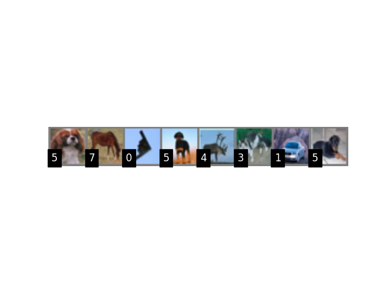

而當程式執行過後我們就可以看到其對應的圖片與類別

### 【STEP 4】定義卷積神經網路模型

前天我們說到，在計算卷積神經網路模型時，需要計算每一層的卷積神經網路輸出維度。這是因為 `input_shape_H` 與 `input_shape_W` 在遇到不同資料集時，輸出維度會有所不同。這時進入全連接層就可能會導致模型發生 `shape error` 的問題。

因此**我們可以將前天提到的卷積神經網路輸出公式代入，以更好地計算每一層的輸出**。如此一來，當我們更換資料集或放大縮小圖像時，模型就能夠自動適應其資料，以下將所有模型的輸出與輸入細節寫入註解中。

```
# 定義 CNN 模型
class CNNModel(nn.Module):
    def __init__(self, input_channels=3, input_shape_H=32, input_shape_W=32, output_shape = 10):
        super(CNNModel, self).__init__()
        # 第一層卷積：將輸入圖像 (batch_size, 3, 32, 32) 經過 32 個 3x3 的卷積核 (padding=1)
        # 輸出形狀為 (batch_size, 32, 32, 32)
        self.conv1 = nn.Conv2d(input_channels, 32, 3, padding=1)

        # 第二層卷積：將 (batch_size, 32, 32, 32) 經過 64 個 3x3 的卷積核 (padding=1)
        # 輸出形狀為 (batch_size, 64, 16, 16)
        self.conv2 = nn.Conv2d(32, 64, 3, padding=1)

        # 最大池化層：每次將高和寬減半
        # 在第一次池化後，輸出形狀為 (batch_size, 32, 16, 16)
        # 在第二次池化後，輸出形狀為 (batch_size, 64, 8, 8)
        self.pool = nn.MaxPool2d(2, 2)

        # 計算全連接層輸入的特徵圖大小
        # conv_output_H = input_shape_H // 4 = 32 // 4 = 8
        # conv_output_W = input_shape_W // 4 = 32 // 4 = 8
        conv_output_H = input_shape_H // 4
        conv_output_W = input_shape_W // 4

        # 全連接層1：輸入來自卷積層的展平結果，4096 = 64 * 8 * 8
        # 輸出 256 維度，輸入形狀 (batch_size, 4096)，輸出形狀 (batch_size, 256)
        self.fc1 = nn.Linear(64 * conv_output_H * conv_output_W, 256)

        # 全連接層2：輸入 256 維度，輸出 64 維度，輸出形狀 (batch_size, 64)
        self.fc2 = nn.Linear(256, 64)

        # 全連接層3：輸入 64 維度，輸出 output_shape 維度，對應 output_shape 個類別
        # 輸出形狀為 (batch_size, output_shape)
        self.fc3 = nn.Linear(64, output_shape)

        self.criterion = nn.CrossEntropyLoss()

    def forward(self, input, labels):
        # 第一層卷積 + 池化：將輸入 (batch_size, 3, 32, 32) -> (batch_size, 32, 16, 16)
        x = self.pool(torch.relu(self.conv1(input)))

        # 第二層卷積 + 池化：將輸入 (batch_size, 32, 16, 16) -> (batch_size, 64, 8, 8)
        x = self.pool(torch.relu(self.conv2(x)))

        # 展平：將輸入 (batch_size, 64, 8, 8) 展平成 (batch_size, 4096)
        x = x.view(x.size(0), -1)

        # 全連接層1：輸入 (batch_size, 4096) -> (batch_size, 256)
        x = torch.relu(self.fc1(x))

        # 全連接層2：輸入 (batch_size, 256) -> (batch_size, 64)
        x = torch.relu(self.fc2(x))

        # 全連接層3：輸入 (batch_size, 64) -> (batch_size, 10)
        x = self.fc3(x)

        return self.criterion(x, labels), x # 回傳Loss與前向傳播結果。
        
model = CNNModel()
```

在這裡還有一個很重要的點，為了符合我們的`Trainer`設計，`forward(self, input, labels)`中的`input`和`labels`必須要與資料載入器中定義的字典鍵(`key`)相同，並且**在回傳時要把損失的位子設定成損失值，否則程式就會發生錯誤。**

### 【STEP 5】開始訓練模型

由於訓練器已經建立完畢，因此只需將相關參數傳入即可。這裡因為我們沒有從訓練資料集中分割出驗證資料集，所以直接用測試資料集來代替。

```
# 定義損失函數和優化器
optimizer = optim.Adam(model.parameters(), lr=0.001)

# 建立 Trainer 實例並開始訓練
trainer = Trainer(
    epochs=10,
    train_loader=trainloader_wrapped,
    valid_loader=testloader_wrapped,
    model=model,
    optimizer=[optimizer],          # 當初設計的時候有考慮多的優化器，因此要用容器型態
)
# 開始訓練
trainer.train(show_loss=True)
# -----輸出-----
Train Epoch 2: 100%|██████████████████████████████████████████████████| 1563/1563 [00:14<00:00, 109.76it/s, loss=0.853]
Valid Epoch 2: 100%|████████████████████████████████████████████████████| 313/313 [00:01<00:00, 159.68it/s, loss=0.941]
Saving Model With Loss 0.83767
Train Loss: 0.74112| Valid Loss: 0.83767| Best Loss: 0.83767
```


在這裡我們發現，模型在第三次訓練時達到了最佳損失，隨後的過程中出現了過擬合的現象。我們也看到儘管損失值達到了約0.83已經在可用範圍內，但明顯的有優化空間。

但是我不會先告訴你該如何優化的答案，而是希望你能先自行測試與調整這些參數設計與模型結構。這樣做的原因是，這些調整將成為實際應用中的寶貴經驗。不過我能給你一個提示：**為什麼模型損失值下降如此之快，以及模型訓練損失值為何會持續下降。**

總結
--

在今天的內容中，我們學習了如何使用昨天建立的`Trainer`類別來訓練卷積神經網路模型，並深入探討了資料加載器的運作原理與優勢。並且也知道了該如何建立了一個簡單的卷積神經網路模型，並自動計算每一層的輸出維度，已適應不同的資料輸入大小。

並且我們使用`Trainer`進行模型訓練，並繪製出損失值之間的相互關係，讓我們能一眼察覺到過度擬合的問題。不過，今天的內容還沒結束。你可以嘗試進一步優化模型，例如調整學習率、批次大小、網路層數，甚至是使用不同的優化器或正則化方法來提升模型的性能。這些實踐不僅能增強你的深度學習技能，也能幫助你更好地理解模型訓練中的細節。

---

<a id="7467-day-12"></a>

## Day 12｜【Day 12】在深度學習中電腦是如何辨識文字資料的

- 原文：https://ithelp.ithome.com.tw/articles/10358901
- 發佈時間：2024-09-26 23:02:10

前言
--

不知道你是否對模型進行了優化？如果效果還不理想，我可以給你個建議：我們應該降低學習率，以便模型能更好地收斂。如果出現過度擬合，可能是模型的複雜度過高。因此我們可以減少其卷積層和模型層數，使其更好地貼合數據，而我也會把完整的優化過程放在我的GitHub中，你也可以參考我的優化方式。現在讓我們進入今天的主題

在過去的11天中，我們學習了如何辨識圖像，了解電腦如何將視覺資訊轉換為數位訊號，並透過各種技術與演算法進行分類與分析。利用圖像辨識技術，我們學會了如何讓電腦看見並理解圖片中的物體、形狀和顏色等元素。

然而除了圖像辨識外，現代應用中也經常需要處理大量的文字資料，無論是搜尋引擎、自動翻譯、語音助手甚至是我們日常使用的社群平台，文字的理解與處理都扮演著至關重要的角色。因此在**今天的部分，我們將重點放在自然語言處理的概述上，讓先清楚自然語言處理的完整系統架構。**

自然語言處理(Natural Language Processing)
-----------------------------------

`自然語言處理（Natural Language Processing, NLP）`主要分為`自然語言理解（Natural Language Understanding, NLU）`和`自然語言生成（Natural Language Generation, NLG）`。基本上**`NLU`側重於理解和解釋人類語言，從中提取語義信息；而`NLG`側重於生成可讀的人類語言文本，將結構化數據轉化為語言表達**。現在先讓我們看看這兩個技術的共同基礎技術。

### 分詞器(Tokenizer)與詞彙(Token)

文字對於人類來說是一種自然的溝通方式，但對於電腦而言文字並不是一開始就能直接理解的資料。在進行文字辨識的過程中，電腦需要將這些「符號」轉化成它能夠處理的格式，然後進行分析與理解。

我們在前面的章節知道**電腦必須將任何形式的文字資料轉換為數位格式**，這可以是由鍵盤輸入的文字，也可以是圖像中提取出來的文字（光學字符識別，OCR）。每個字元在電腦中以編碼的形式儲存，比如說最常見的編碼方式是ASCII或Unicode。

而對於`自然語言處理（Natural Language Processing, NLP）`來說，在需要獲取一段文字時，第一步是進行`分詞（word segmentation）`處理。對於英文來說這相對簡單，**因為單詞之間是用空格隔開的可以直接進行分詞的動作**；但是在中文或其他語言中，電腦需要更多的邏輯來分辨哪些字符組合成一個詞。這時我們就需要利用 `BPE（Byte Pair Encoding）`、`隱藏式馬可夫模型（Hidden Markov Model）`等分析數據的算法，**找出重複率最高的文字，並進行分詞動作**。這些高階算法的好處在於能夠將一個單字拆分成更小的單位`子詞（Subword）`。

例如在英文中，`Happy` 和 `Happiness` 可能語意相似，只不過是後面的文法有些變化。但在深度學習中，**這兩個單字會被分割成不同的單字**。因此拆分成子詞的好處在於能夠將其分割成 `happ` 和 `iness` 這樣的文字向量。**這樣我們只需分別計算每一個文字中的子詞，就能夠計算出這些被拆分出來的文字向量權重**。這時電腦就能更好地理解這些文字之間的關係了。而這些被通過算法切割出來的文字就被稱之為`詞彙(Token)`，而協助我們完成分詞的的工具就叫做`分詞器(Tokenizer)`。

**分詞器的建立通常是先通過大量分析文本找出對應的`Token`後，再建立成一個可轉換的映射表**，讓我們能夠重複利用。此外一個模型中通常會有對應的`Tokenizer`，以將正確的映射數字投射到更高維的空間向量。

### 詞嵌入(Word Embedding)

`詞嵌入（Word Embedding）`是一種將詞彙轉換為數字向量的技術，這些向量可以捕捉詞語之間的語義和語法關係。詞嵌入的主要目的是使電腦能夠理解和處理自然語言文本。這些詞嵌入之間的關係通過模型訓練，使相對應的`Token`靠攏在一起，從而達到更好的分類效果。


**詞嵌入層的作法是將原始的`Token`映射到一個大小為`emb_dim`的隨機初始化向量空間**。假設我們的`詞彙表(Vocabulary)`大小是100，`emb_dim`大小是50，這樣就會產生一個大小為(100, 50)的向量矩陣。在深度學習中，**我們的目標是訓練這50維的向量空間，使得相似的Token映射到相近的向量**。接下來的步驟是在這些向量空間中劃分數條不規則的線，以進行分隔和分類。這項技術在自然語言處理中非常重要，甚至可以說，只要有一個出色的`Word Embedding`，就能達到良好的分類效果。

總結
--

在今天的文章中，我的主要目的是讓你了解 NLP 的核心概念及其兩大分支——自然語言理解（NLU）和自然語言生成（NLG）。我也介紹了這兩者技術之間的根本技術——詞嵌入（Word Embedding），並解釋了將文字拆分的概念，以幫助你更好地理解分詞器（Tokenizer）和詞彙（Token）。這樣做的目的是為了讓你更好地理解這些名詞之間的關聯性，這樣子當你真正遇到時才能更好的加深你對這些名詞的印象

---

<a id="7467-day-13"></a>

## Day 13｜【Day 13】探索文字與時間依賴關係-時間序列模型介紹與數學推導

- 原文：https://ithelp.ithome.com.tw/articles/10359218
- 發佈時間：2024-09-27 23:20:18

前言
--

在昨天的課程中，我們已經介紹完了自然語言處理的基礎名詞，因此今天將開始進入文字辨識的環節。不過在此之前，我們需要先理解為何文字與時間有關，並介紹處理時間序列的重要模型`循環神經網路（Recurrent Neural Network, RNN）`與`長短期記憶（Long Short-Term Memory, LSTM）`。因此在這幾天的內容中我們會探討這兩個模型如何經過`Word Embedding`後進行運算，並成功進行文字辨識。

循環神經網路（Recurrent Neural Network, RNN）
-------------------------------------

讓我們首先來理解文字與時間的關係。文字在自然語言中有`順序（Sequence）`和`上下文關係（Context）`，這意味著前後文的詞語會影響整個句子的意義。例如，"他拿了錢就走"和"他走了才拿錢"的詞組相同，但意思完全不同：前者表示「先拿錢再離開」，而後者表示「先離開後再拿錢」。這展示了文本的`時間序列特性（Temporal Sequence Characteristic）`如何影響句子的具體意思。

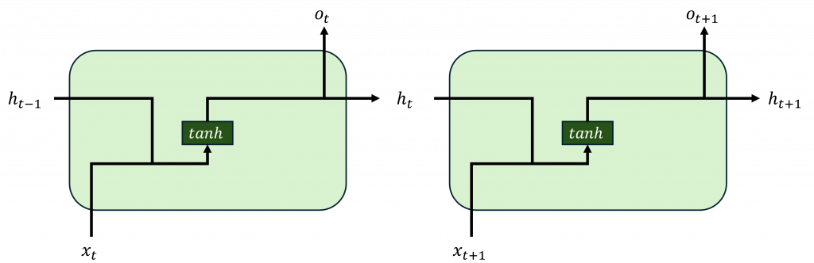

因此在設計神經網路模型時，需要考慮每個時序的位置，並根據這些時序的排列組合來預測正確的結果而循環神經網路是一種專門用於處理時間序列數據的神經網路模型，**其核心思想是通過內部的循環結構來保留之前的信息。**

循環神經網路的基本運算可分為兩個部分：第一部分計算當前時序的輸入`x(t)`；第二部分則計算前幾個時序的`隱狀態（Hidden State, h(t)）`。這兩者的結果會結合在一起，並通過`tanh`激勵函數將結果縮放到-1到1之間，其數學公式如下：


而在公式中這裡選用`tanh`激勵函數而不是`sigmoid`或`ReLU`，是因為**`tanh`能夠提供更廣泛的信息範圍**。與`sigmoid`函數的返回值範圍為0到1不同，`tanh`的範圍是-1到1，能夠提供負相關的特徵，這對於時間序列模型來說非常重要，因為它能夠保留更多有效的信息，讓資訊能夠更有效地傳遞下去，從而提升預測的效能。

長短期記憶（Long Short-Term Memory, LSTM）
-----------------------------------

循環神經網路在處理長期依賴的序列時，常常會遇到梯度消失問題。這是因為當**某些數據在輸入時，其輸出值非常接近於0，隨著時間推移，這些資料造成的梯度將趨近於0**，導致模型無法正常更新。為了解決這個問題，長短期記憶網路應運而生。

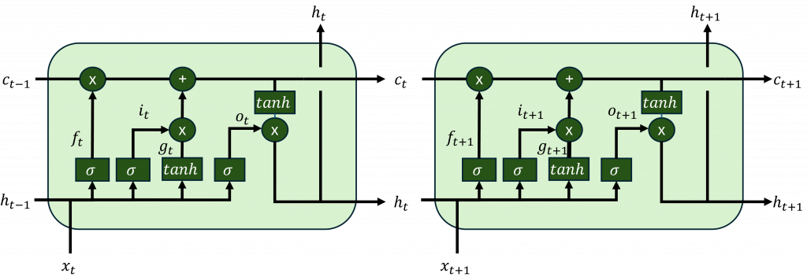

LSTM使用不同的`門控機制（Gating Mechanism）`來控制信息的傳遞和保護，使其能更好地處理長期依賴問題。LSTM的結構由多個單元組成，每個單元包含三個主要的門控機制：`輸入門（Input Gate）`、`遺忘門（Forget Gate）`和`輸出門（Output Gate）`，以及一個貫通整個網路的`記憶單元（Cell State）`。這些門控機制的作用如下：

### 輸入門（Input Gate）

輸入門的主要功能是決定是否將新的信息寫入記憶單元，這層主要根據前一個時間步驟的隱藏狀態來進行計算，用來模擬人類接收新信息時對其重要性的評估，**決定是否將其存儲到長期記憶（記憶單元）中**。這層涉及兩個主要參數其公式如下：


`候選記憶單元g(t)`的概念類似於循環神經網路中的下一個`隱藏狀態h(t)`，其目的是生成潛在的新信息。在LSTM中，每一層的計算都需要先生成候選結果，然後與對應的門控機制進行運算。

因此在輸入門層中，首先通過前一個時間步驟和當前的輸入進行計算，然後通過`tanh`函數生成其概率分布。接下來，這個結果會與`i(t)`進行哈達瑪乘積運算。**由於`i(t)`是經過`sigmoid`函數處理的，其值介於0到1之間，因此這個乘積運算能夠剔除不重要的信息，只保留重要的信息進入記憶單元形成長期記憶。**

### 遺忘門（Forget Gate）

遺忘門的作用是控制哪些信息應該從記憶單元中遺忘，這類似於人類選擇性遺忘不再重要的記憶，以避免記憶過載。公式相對簡單，通過`sigmoid`函數計算前一個記憶單元`c(t-1)`中的信息應該被遺忘的程度其數學公式如下：

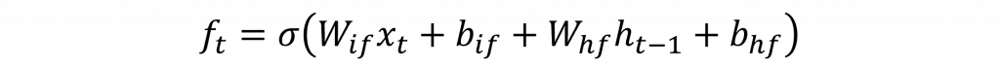

### 記憶單元（Cell State）

有了輸入門和遺忘門的計算結果後，可以更新當前時間步的記憶單元`c(t)`，該公式是將兩者的輸出結果進行加法運算，具體公式如下：


### 輸出門（Output Gate）

當我們得到記憶單元的結果後，接下來像循環神經網路一樣，計算短期記憶`o(t)`的資料分布，並將其與記憶單元`c(t)`的長期記憶進行哈達瑪乘積運算。這樣**每一層的輸出就能同時保留過去的信息並融合當前的最新信息**


這些門控機制使LSTM在處理長期依賴關係時能夠保持關鍵信息，避免了梯度消失問題，因此與傳統RNN相比，LSTM在處理較長的序列時表現得更加出色。

總結
--

在今天的內容中，我們公式從中可以得知**其時序是單向的運算，例如由左到右或由右到左**。這樣的運算方式實其跟我們人類觀看在文字時的方式不太一樣。我們人類有時候跳著會觀看一些文字，或在序順時相反也能自動解析夠這些文字。所以一個好的模型應要該的具備這樣特性。對於前者可能我們的模型無法有效解決，但對於後者我們可以通過輸入一些混亂的文字讓來模型學會更多特徵。**這個做法在深度學習中，即是種透過加入噪音以提升效能模型的正化規方法。**~~不信你認真的重新閱讀一下這段文字~~。

---

<a id="7467-day-14"></a>

## Day 14｜【Day 14】用LSTM解IMDB情緒分析- 排成器的使用與空白分詞

- 原文：https://ithelp.ithome.com.tw/articles/10360065

前言
--

IMDB情緒分析資料集是NLP領域中的入門磚，該資料集從IMDB網站抽取的電影評論，並以`正面（positive）`或`負面（negative）`方式標註。它包含50000條電影評論，其中25,000條用於訓練與驗證，另外25,000條則用於測試。**由於資料量龐大且任務相對簡易，因此非常適合學習和優化模型的方向**，同時也有助於更好地理解自然語言處理的模型架構。在今天的內容中，我們可以前往其資料的[官方網站](https://ai.stanford.edu/~amaas/data/sentiment/)下載該資料集。

使用PyTorch建立LSTM情感分析模型
---------------------

今天我們會使用 `HuggingFace` 公司的分詞器對 IMDB 影評資料集進行切割。這樣做的原因是，使用空白斷詞法會產生大量的 `Tokens`，並且會出現相似詞彙被識別為不同詞彙的問題。`HuggingFace` 的分詞器提供了一個很好的解決辦法。

今天我們要使用的 `BERT` 分詞器是通過分析文本並運用 `BPE` 算法獲取的詞彙表，這種方式更能達成我們的目標。現在讓我們看看自然語言處理模型如何進行分詞、填充、訓練，最後我們還會介紹如何使用 `Warmup` 排程器來改善模型性能，以提升最終表現。

### 【STEP 1】IMDB影評資料轉換與標註

由於我們下載的 IMDB 的影評資料是一個非常大型的`.txt` 檔案，因此我們在讀寫資料時必須不斷地使用`open`函數將其開啟，這一點在讀取資料時就會顯得異常緩慢，因此我們可以先通過讀取資料後將其轉換成一個 CSV 檔案，這樣做的好處是可以利用 Pandas 來方便地處理數據已加後續資料讀取的速度，而大多的自然語言處理資料集也都是使用CSV檔案進行保存的。

```
import pandas as pd
import os

def convert_IMDB_to_csv(directory, csv_file_path):
    data = []
    labels = []
    for label in ['pos', 'neg']:
        for subset in ['train', 'test']:
            path = f"{directory}/{subset}/{label}"
            for file in os.listdir(path):
                if file.endswith(".txt"):
                    with open(f'{path}/{file}', 'r', encoding='utf-8') as f:
                        data.append(f.read())
                        labels.append('positive' if label == 'pos' else 'negative')
    df = pd.DataFrame({'review': data, 'sentiment': labels})
    df.to_csv(csv_file_path, index=False)

convert_IMDB_to_csv('aclImdb', 'imdb_data.csv')
```

我們下載下來的`aclImdb`資料夾中，有`train`與`test`資料夾，它們的標籤是通過`pos`與`neg`資料夾分割的。因此我們可以使用 `os.listdir` 去開啟這些文件，並存成一個列表，最後通過`pd.DataFrame`轉換其資料型態，儲存成CSV資料。

### 【STEP 2】設定亂數種子以確保結果的可重現性

在進行優化實驗時，隨機性的影響常常導致每次驗證結果的差異，因此確保結果的可重現性至關重要。為了解決這一問題，我們可以通過固定隨機種子來確保每次模型訓練的結果一致。所以我們需要設定 `Python` 標準亂數生成器、`NumPy` 和 `PyTorch` 的亂數種子，從而有效控制訓練過程中的隨機性，方便重現實驗結果。

```
import torch
import numpy as np
import random

def set_seeds(seed):
    random.seed(seed)
    np.random.seed(seed)
    torch.manual_seed(seed)
    if torch.cuda.is_available():
        torch.cuda.manual_seed(seed)
        torch.cuda.manual_seed_all(seed)
    torch.backends.cudnn.benchmark = False
    torch.backends.cudnn.deterministic = True

set_seeds(2526)
```

### 【STEP 3】讀取 CSV 並進行空白斷詞

接下來我們需要讀取 CSV 檔案中的影評資料，並使用 BERT 的 `AutoTokenizer` 導入期分詞器，已幫助我們進行填充與分詞的工作

```
import pandas as pd
from transformers import AutoTokenizer

df = pd.read_csv('imdb_data.csv')
reviews = df['review'].values
sentiments = df['sentiment'].values
labels = (sentiments == 'positive').astype('float32')

tokenizer = AutoTokenizer.from_pretrained("bert-base-uncased")
input_datas = tokenizer(reviews[:2].tolist(), max_length=10, truncation=True, padding="longest", return_tensors='pt')

print('Tokenizer輸出:')
print(input_datas)
# ----- 輸出 -----
Tokenizer輸出:
{'input_ids': tensor([[  101, 22953,  2213,  4381,  2152,  2003,  1037,  9476,  4038,   102],
        [  101, 11573,  2791,  1006,  2030,  2160, 24913,  2004,  2577,   102]]), 'token_type_ids': tensor([[0, 0, 0, 0, 0, 0, 0, 0, 0, 0],
        [0, 0, 0, 0, 0, 0, 0, 0, 0, 0]]), 'attention_mask': tensor([[1, 1, 1, 1, 1, 1, 1, 1, 1, 1],
        [1, 1, 1, 1, 1, 1, 1, 1, 1, 1]])}
```

這裡我們能看到他返回了三個參數。第一個參數 `input_ids` 代表文字經過斷詞後轉換成數字的結果，第二個參數 `token_type_ids` 則代表的是該文字是第幾句，第三個參數 `attention_mask` 則表示被填充的序列，其中 0 代表該位置被填充。而在這裡我們只會使用 `input_ids` 的部分，後續兩個參數的實際用途會在講解 BERT 模型時詳細說明。

### 【STEP 4】建立Dataset與DataLoader

由於先前我們都是通過直接使用Pytorch官方提供的`Dataset`類別，因此今天是我們第一次手動建立資料型態。其方式類似於我們之前重新包裝CIFAR10的`Dataset`類別，但需要注意的是，這裡每個批次中的文字長度不盡相同，因此我們還需要定義一個`collate_fn`函數。這個函數會在`DataLoader`中被調用，以完成動態填充的功能。

在DataLoader這一類別中其動作順序會先通過`__getitem__`取得其批量資料，接下來交給`collate_fn`進行輸出或轉換的動作，而這一條件就將在達到`len(self.x)`時停止，因此我們定義`collate_fn`其實就是將其批量取出，並通過`self.tokenizer`將我們輸入的文字轉換成Tokens並對其進行填充與截斷的功能

```
from torch.utils.data import Dataset, DataLoader
from sklearn.model_selection import train_test_split

class IMDB(Dataset):
    def __init__(self, x, y, tokenizer):
        self.x = x
        self.y = y
        self.tokenizer = tokenizer

    def __getitem__(self, index):
        return self.x[index], self.y[index]
       
    def __len__(self):
        return len(self.x)
    
    def collate_fn(self, batch):
        batch_x, batch_y = zip(*batch)
        input_ids = self.tokenizer(batch_x, max_length=128, truncation=True, padding="longest", return_tensors='pt').input_ids[:,1:-1]
        labels = torch.tensor(batch_y)
        return {'input_ids': input_ids, 'labels': labels}

x_train, x_valid, y_train, y_valid = train_test_split(reviews, labels, train_size=0.8, random_state=46, shuffle=True)
trainset = IMDB(x_train, y_train, tokenizer)
validset = IMDB(x_valid, y_valid, tokenizer)

train_loader = DataLoader(trainset, batch_size=32, shuffle=True, collate_fn=trainset.collate_fn)
valid_loader = DataLoader(validset, batch_size=32, shuffle=True, collate_fn=validset.collate_fn)
```

而在這裡我們除了建立一個DataLoader之外，我們還使用了`train_test_split`這一個函數，將資料分成8:2的比例，已進行訓練與驗證的動作。

### 【STEP 5】建立 LSTM 模型

由於 RNN 和 LSTM 都是時間序列模型，所以我們可以將它們一起討論。在過程中，我們使用了 `bidirectional=True` 這個參數，該參數表示時間序列模型是否要進行雙向運算。如果這個參數設為 `True`，意味著每個輸入序列都會經過兩個 LSTM 層：一個是前向 LSTM，另一個是後向 LSTM。這兩個 LSTM 層分別產生各自的隱藏狀態，然後將它們拼接在一起作為最終的輸出。因此，當我們設定這個參數為 `True` 時，隱藏狀態特徵的數量將會是原來的兩倍。

而經過時間序列模型的輸出會返回兩個變數：`output` 和 `h_n`。`output` 是所有時間步的隱狀態輸出，在設置 `batch_first=True` 和 `bidirectional=True` 的情況下，其資料維度是 `(batch_size, time_step, hidden_size * 2)`。`h_n` 代表最後一個時間步的運算（在 LSTM 中則是 `c(t)` 的輸出），其資料維度為 `(1 * 2, batch_size, hidden_size)`，因此我們可以從`output`中的最後一個`time_step`的資料，這樣子就代表的是LSTM最後的運算結果了。

```
import torch.nn as nn

class TimeSeriesModel(nn.Module):
    def __init__(self, vocab_size, embedding_dim, hidden_size, padding_idx, num_layers=1, bidirectional=True, model_type='LSTM'):
        super().__init__()
        self.criterion = nn.BCELoss() #定義損失函數
        self.embedding = nn.Embedding(vocab_size, embedding_dim, padding_idx=padding_idx) 
        
        # 切換模型
        rnn_models = {'LSTM': nn.LSTM, 'RNN': nn.RNN}
        self.series_model = rnn_models.get(model_type, nn.LSTM) (
            embedding_dim, 
            hidden_size,
            num_layers=num_layers, 
            bidirectional=bidirectional, 
            batch_first=True
        )

        # 如果是雙向運算則最終的hidden state會變成2倍
        hidden = hidden_size * 2 if bidirectional else hidden_size
        self.fc = nn.Linear(hidden, 1)
        self.sigmoid = nn.Sigmoid()

    def forward(self, **kwargs):
        # 取得輸入資料
        input_ids = kwargs['input_ids']
        labels = kwargs['labels']          
        #轉換成詞嵌入向量
        emb_out = self.embedding(input_ids)
        # 時間序列模型進行運算
        output, h_n = self.series_model(emb_out)
        # output: (batch_size, seq_len, hidden_size * 2)
        h_t = output[:, -1, :]
        # h_t: (batch_size, 1, hidden_size * 2)
        y_hat = self.sigmoid(self.fc(h_t))
        # h_t: (batch_size, 1)

        # 返回loss與logit
        return self.criterion(y_hat.view(-1), labels), y_hat
```

在程式中，我們發現輸入是經過一層`Word Embedding`進行轉換的。實際上給予的`Tokens`會先通過`Embedding`層將其轉換到更高的資料維度，再交由LSTM進行運算。在這裡需要注意的是，由於`Padding Tokens`的存在，`Word Embedding`在反向傳播時會計算這些`Tokens`的梯度。因此我們需要設定`padding_idx`，以忽略這些梯度的運算。

### 【STEP 6】使用排程器訓練模型

接下來我們要使用排程器來訓練模型，今天我們將使用`Warmup（暖身）`這個排程器進行優化。該優化器的概念是，當我們一次輸入較大量的批量資料時，可能無法立即得知當前這組資料的方向。假設我們知道右邊路徑是最佳解，但當前的這個批量資料卻往左邊移動，這樣模型在一開始學習的方向就會錯誤。因此我們需要在一開始還沒確認方向時，先給予很小的學習率，直到暖身結束。這樣就能讓模型逐漸掌握資料的方向性。

```
import torch.optim as optim
from torch.optim.lr_scheduler import LambdaLR
from Trainer import Trainer

# 自定義 Warmup Scheduler
def get_warmup_scheduler(optimizer, warmup_steps, total_steps):
    def lr_lambda(current_step):
        # 計算 warmup 比例
        if current_step < warmup_steps:
            return float(current_step) / float(max(1, warmup_steps))
        # 隨後開始隨著 total_steps 逐漸減小學習率 (線性衰減或其他方法)
        return max(0.0, float(total_steps - current_step) / float(max(1, total_steps - warmup_steps)))
    
    return LambdaLR(optimizer, lr_lambda)

# 模型、優化器和其他設置
model = TimeSeriesModel(
    vocab_size=len(tokenizer), # Embedding的總大小等同於詞彙表大小
    embedding_dim=50, 
    hidden_size=32, 
    model_type='LSTM', 
    padding_idx=tokenizer.pad_token_id
)

optimizer = optim.Adam(model.parameters(), lr=1e-3, weight_decay=0.001)
warmup_steps = len(train_loader) * 0.2
total_steps = len(train_loader) * 10
scheduler = get_warmup_scheduler(optimizer, warmup_steps, total_steps)
```

而在排成器上我們選擇使用在train_loader的總步數(Step)上取0.2的比例進行暖身找到方向，並且總訓練步數為10個週期，因此total_steps為 len(train_loader) * 10，這時我們同樣的使用Trainer進行訓練並會驗證模型在驗證集上的表現，並使用早停法則來防止過擬合。

```
# 訓練過程中的 Trainer 設置
trainer = Trainer(
    epochs=10, 
    train_loader=train_loader, 
    valid_loader=valid_loader, 
    model=model, 
    optimizer=[optimizer],
    scheduler=[scheduler],  # 加入學習率排成器
)

# 訓練過程
trainer.train(show_loss=True)
# ----- 輸出 -----
Train Epoch 9: 100%|██████████| 1250/1250 [00:27<00:00, 45.54it/s, loss=0.450]
Valid Epoch 9: 100%|██████████| 313/313 [00:05<00:00, 60.19it/s, loss=0.631]
Saving Model With Loss 0.39172
Train Loss: 0.31513| Valid Loss: 0.39172| Best Loss: 0.39172
```

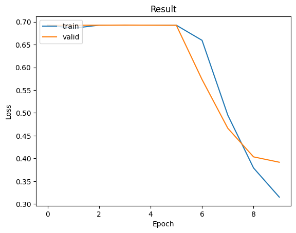

而這時我們將能看到模型在訓練的後期已經達到很漂亮的收斂結果其訓練損失值與驗證損失值也並無太大的差異，因此在這裡我們可以在撰寫一個函數來去觀看這個訓練出來的準確率

### 【STEP 7】模型評估

現在我們先載入表現最佳的模型，並且修改`Trainer`中的驗證函數。在這裡我們將超過0.5的數值視為正標籤，小於0.5的則視為負標籤，然後統計結果集以進行最終的驗證，計算模型的準確度：

```
model.load_state_dict(torch.load('model.ckpt'))
model.eval()
device = torch.device('cuda' if torch.cuda.is_available() else 'cpu')

total_correct = 0
total_samples = 0
with torch.no_grad():
    for input_data in valid_loader:
        input_datas = {k: v.to(device) for k, v in input_data.items()}
        _, y_hat = model(**input_datas)
        pred = (y_hat > 0.5).long()
        labels = input_datas['labels']
        total_correct += torch.sum(pred.view(-1) == labels).item()
        total_samples += labels.size(0)

accuracy = total_correct / total_samples
print(f'Validation Accuracy: {accuracy*100:.3f} %')
# ----- 輸出 -----
Validation Accuracy: 82.920 %
```

在這裡我們可以看到驗證數據已經達到了82.92%。不過這個結果仍有優化空間。我們發現在`collate_fn`中，輸入的Token只有128個就被截斷了，同時這些資料的相似性也相當高。因此我們可以用L2正則化的方式來處理這些高度相似的資料。此外，在我們的模型經過學習率調整後，也可以加入其他的排程器邏輯，使其能夠更佳地收斂。

總結
--

今天我們從頭到尾完成了一個自然語言處理的任務，同時進行了模型優化。為了保證每次模型訓練結果的一致性，我們特別強調了設置隨機種子的必要性。我們手動創建了 Dataset 並自定義了 `collate_fn` 函數，以實現動態填充的功能。這些功能在自然語言處理和模型優化中都是非常重要的技術。

當然我們可以不使用動態填充資料，但這樣會導致增加太多的`Pandding Tokens`使模型運算時間大幅增加。在最後我還提到了一些可以進一步優化的建議，這些為你提供了進一步學習和改進模型的方向，通過這些策略你可以嘗試將模型的準確率優化到 90% 以上看看吧~

---

<a id="7467-day-15"></a>

## Day 15｜【Day 15】圖片生成的老前輩-DCGAN介紹與數學推導

- 原文：https://ithelp.ithome.com.tw/articles/10360582
- 發佈時間：2024-09-29 21:36:03

前言
--

現在我們的學習進度已經達到一半，並且已經完成了圖像與文字的辨識任務。接下來我們將進入一個更加特殊的單元`生成式AI(Generative AI)`。今天的課程重點是介紹圖片生成的簡易模型。現在讓我們先來了解其技術原理吧!

`生成對抗網路（Generative Adversarial Networks, GANs）`是由Ian Goodfellow等人在2014年提出的一種方法。其基本概念是通過一個生成模型從`潛在空間（latent space）`中隨機取樣作為輸入，這個潛在空間是由亂數產生的。生成模型嘗試生成與訓練集中真實樣本相似的結果。由於該技術是一種非監督式學習技術，因此我們還需要建立一個判別模型，用來判斷生成的圖片的真偽，其目的是**盡可能準確地分辨生成的結果和真實樣本，以計算損失值。**

DCGAN（Deep Convolutional GAN）
-----------------------------

而不同於GANs這類只使用深度神經網路建立的生成式模型，DCGAN（Deep Convolutional GAN）更是在生成圖像的應用中扮演了重要角色，因**其結合了卷積神經網路和GAN的力量，大幅提升了圖像生成的品質與穩定性**，現在讓我們看看其核心概念與數學推導吧!


DCGAN的架構主要由兩部分組成`判別器（Discriminator）`和`生成器（Generator）`。**判別器負責判斷輸入的圖像是真實的還是生成的**，它接受的資料包括由生成器產生的圖像，或是從我們資料集中取得的真實圖像。判別器的目標是將真實圖像與生成圖像區分開來，這些資料會通過多個卷積層進行特徵提取，最終輸出一個表示真實或虛假的概率。而生成器的目的是通過一個隨機的向量，經過一系列`轉置卷積層（Transposed Convolution Layers）`，**最終生成與目標圖像相似的圖像**。

**在判別器中圖像會逐步通過卷積層縮小成一個特徵圖，而在生成器中則使用轉置卷積層來逐步放大特徵圖**，從`隨機噪音(Random Noize)`中合成完整的圖像。

> 轉置卷積層也會被稱為`反卷積層(Deconvolution)`，因此在Paper中你看到兩個名詞時其實都在指向相同的東西。

而對於DCGAN的數學公式其實只有一個損失函數的設計。該函數是基於博弈論中的零和博弈設計，旨在讓生成器和判別器進行對抗訓練，其損失函數為：


在以上公式中`G` 是生成器，負責生成圖像；`D` 是判別器負責區分真實圖像和生成圖像。`x` 是真實數據來自於真實的圖片輸入 `p(x)`；`z` 是隨機噪聲來自於事先定義的噪聲分佈 `p(z)`。

該損失函數的目標是生成器希望最大化判別器的錯誤率，也就是說**生成的圖像越難被判別器識別出來，生成器的表現就越好**。反之判別器則希望能正確區分真實圖像與生成圖像。

訓練DCGAN的技巧
----------

在訓練DCGAN時我們需要注意的事情就是緩解不同層之間的`內部協變轉移（Internal Covariate Shift）`，**即由於前面幾層參數的改變會引起後面幾層輸入分佈的劇烈變化**。因為在DCGAN這類的深層網路，模型的梯度會由於深度而更加不穩定導致梯度爆炸或梯度消失，而且**由於DCGAN訓練時的兩個網路是對抗性的，容易陷入不穩定的訓練狀態**。因此我們通常會加入`批量標準化(Batch Normalization)`平滑這種對抗，讓判別器和生成器都能更好地學習。

批量標準化會對每一個`特徵通道（Channel）`分別計算均值和標準差。這些計算是在`小批量（mini-batch）`的數據上進行的。均值`E[x]`是每個通道的平均值，而標準差`Var[x]`是根據`偏差估計（biased estimator）`計算的，**這表示在計算方差時分母使用了批量大小。**

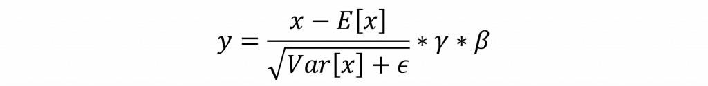

而在這個過程中，每個特徵通道都有對應的可學習參數向量`γ`（縮放）和`β`（偏移）。這兩個參數的維度都是特徵通道的大小。而在Pytorch預設情況下，`γ`的元素初始化為1，而β的元素初始化為0。**這意味著初始的批量標準化不會改變標準化後數據的比例和位置。**

一個問題在於我們通常會選擇使用ReLU作為這些模型的激勵函數，然而**標準的ReLU函數在輸入小於0時會輸出0，這會導致負輸入的神經元在後續的訓練過程中無法更新（梯度為0）**，也就是所謂的`神經元死亡問題(Dead ReLU Problem)`。

因此在DCGAN這類深層網路中，通常會改用 `Leaky ReLU`。因為它能透過設定 `α` 值，允許負輸入有一個小的正梯度，使得這些神經元仍然能夠更新，保持負輸入的梯度。這有助於在訓練過程中維持更好的梯度，特別是在深層網路中。這使得模型能夠學習更複雜的數據表示，從而可能提高模型的整體性能。

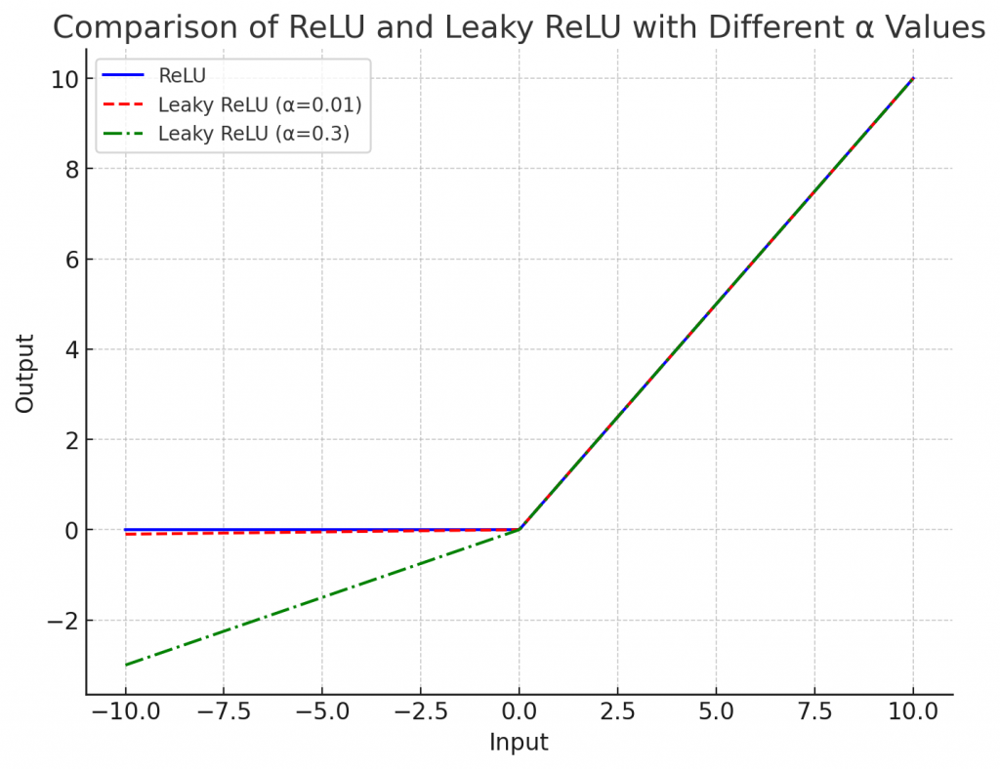

而這也是我們在[Day 8](https://ithelp.ithome.com.tw/articles/10356442)中提到在後續的網路中都是使用`ReLU`的變化版本，而就是其中一種該激勵函數特別適合用於需要處理較深層網路結構的情況，能夠有效地緩解死神經元問題，提高模型的訓練效率和性能。

總結
--

在今天的內容中，我們可以看到DCGAN的數學推導其實並不複雜，基本上就是一個CNN的延伸。唯一的差異在於一個基於博弈論的損失函數，使其能夠完成生成圖像的工作。不過雖然數學式簡單，但在程式的建立上會有一些難度。因此，我們今天還介紹了如何更好地優化這些模型。而在明日我會告訴你如何完整地建立出一個DCGAN模型。

---

<a id="7467-day-16"></a>

## Day 16｜【Day 16】用DCGAN生成假的MNIST手寫辨識集

- 原文：https://ithelp.ithome.com.tw/articles/10361289

前言
--

在昨天我們介紹了DCGAN的原理，並且分享了一些訓練技巧。不過昨日的內容可能不夠詳盡，例如模型訓練過程中的各個步驟，如何調整鑑別器和生成器，並對其進行優化。這次我將透過拆解程式碼，詳細介紹如何使用DCGAN來生成MNIST風格的手寫數字圖片。我們將逐步說明程式碼中的重要部分，介紹生成器和鑑別器的設計、損失函數的計算以及模型訓練的具體流程。

在本次的內容中我們將繼續延續前面章節所提到的基礎設定，具體來說就是導入本次將會使用到的完整函式庫，並設置固定的亂數種子。這些步驟我們在前面章節中已經詳細講解過，因此在此不再重複過多敘述。而在本次的重點放在生成器與鑑別器的構建以及它們的訓練過程上，這部分內容至關重要因為它將決定整個生成對抗網絡模型的最終性能表現。

```
import torch
import torch.nn as nn
import torch.optim as optim
import torchvision as tv
from torch.utils.data import DataLoader
import numpy as np
import random
from tqdm import tqdm
from matplotlib import pyplot as plt

def set_seed(seed):
    random.seed(seed)
    np.random.seed(seed)
    torch.manual_seed(seed)
    if torch.cuda.is_available():
        torch.cuda.manual_seed(seed)
        torch.cuda.manual_seed_all(seed)
    torch.backends.cudnn.benchmark = False
    torch.backends.cudnn.deterministic = True

set_seed(0)
```

### 【STEP 1】數據集準備

在這次的生成任務中我們依然選用經典的 MNIST 數據集來進行圖片生成操作。雖然這次的任務看似與我們之前在使用深度神經網路進行分類任務的程式碼相似，但有幾個關鍵點需要我們格外注意。首先**這次的模型訓練屬於非監督式學習**，也就是說我們並不會使用標籤來指導模型進行學習。因此不需要像監督式學習那樣通過驗證集來評估模型的性能。

而**我們的主要目標是讓生成器和鑑別器在對抗過程中不斷優化，直到生成器能夠生成與真實數據分布極為相似的圖片**，因此為了增加訓練數據量並提高模型的泛化能力，**我們可以將訓練集和測試集進行合併，讓模型能夠接觸到更多樣的數據樣本**，從而達到更好的生成效果。

```
transform = tv.transforms.Compose([
    tv.transforms.ToTensor(),
    tv.transforms.Normalize(mean=[0.5,], std=[0.5,])
])

trainset = tv.datasets.MNIST("MNIST/", train=True, transform=transform, download=True)
validset = tv.datasets.MNIST("MNIST/", train=False, transform=transform, download=True)
dataset = trainset + validset
train_loader = DataLoader(dataset, batch_size=128, shuffle=True, num_workers=0, pin_memory=True)
```

### 【STEP 2】建立鑑別器

昨日提到鑑別器的作用是將輸入的圖片分類為真實或偽造，因此他的輸出式屬於一種二分類的算法，最終輸出一個經過Sigmoid激活函數的值，表示該圖片是真實的概率。而在這裡我們也加入了昨日提到的`BatchNorm2d`並在每一層之中加入LeakyReLU激活函數來解決ReLU的死亡神經元問題。

```
class Discriminator(nn.Module):
    def __init__(self):
        super(Discriminator, self).__init__()
        self.D = nn.Sequential(
            # input is (1) x 28 x 28
            nn.Conv2d(1, 64, 4, 2, 1, bias=False),
            nn.BatchNorm2d(64),
            nn.LeakyReLU(0.2, inplace=True),
            # state size. (64) x 14 x 14
            nn.Conv2d(64, 128, 4, 2, 1, bias=False),
            nn.BatchNorm2d(128),
            nn.LeakyReLU(0.2, inplace=True),
            # state size. (128) x 7 x 7
            nn.Conv2d(128, 256, 3, 2, 1, bias=False),
            nn.BatchNorm2d(256),
            nn.LeakyReLU(0.2, inplace=True),
            # state size. (256) x 4 x 4
            nn.Conv2d(256, 1, 4, 1, 0, bias=False),
            # state size. (1) x 1 x 1
            nn.Sigmoid()
        )

    def forward(self, x):
        return self.D(x)
```

在鑑別器的設計中我們的方式基本上與傳統的卷積神經網路非常相似。通過逐層提取圖片的特徵，將特徵圖的通道數量逐漸增加，從而使模型能夠捕捉到圖片中越來越多的高級特徵。**這個過程的核心是對圖片特徵的逐步縮小和濃縮，這就是卷積網路的典型特性**隨著層數加深，圖片的空間維度會逐漸減小，而特徵通道的數量會逐步增多。

### 【STEP 2】建立生成器

生成器的目標是將隨機噪聲（`noize_dim`）轉換成一張28x28的MNIST風格圖片。因此我們使用了卷積轉置層來進行上採樣，並且使用BatchNorm2d來穩定訓練過程。而最後一層之所以使用Tanh而不是Sigmoid而是tanh是因為我們需要將輸出範圍映射到[-1,1]，對應數據集的標準化範圍。而在這裡我們假設輸入的`noize_dim`是一個(100, 1, 1)大小的隨機噪音資料

> `上採樣（Upsampling）`是一種將低維度數據轉換為高維度數據的技術，通常應用在生成模型中，尤其是像生成對抗網絡中的生成器。例如本次生成器的任務是將一個小的隨機噪聲向量（比如大小為 (100, 1, 1) 的向量）轉換為與目標圖片大小相同的數據（比如 MNIST 圖片為 28x28 的大小）。為了實現這個過程，我們使用了卷積轉置層，這個層負責進行上採樣。

```
class Generator(nn.Module):
    def __init__(self, noize_dim):

        super(Generator, self).__init__()

        self.G = nn.Sequential(
            # input is (100) x 1 x 1
            nn.ConvTranspose2d( noize_dim, 256, 4, 1, 0, bias=False),
            nn.BatchNorm2d(256),
            nn.ReLU(True),
            # state size. (256) x 4 x 4
            nn.ConvTranspose2d(256, 128, 4, 2, 1, bias=False),
            nn.BatchNorm2d(128),
            nn.ReLU(True),
            # state size. (128) x 8 x 8
            nn.ConvTranspose2d( 128, 64, 4, 2, 1, bias=False),
            nn.BatchNorm2d(64),
            nn.ReLU(True),
            # state size. (64) x 16 x 16
            nn.ConvTranspose2d( 64, 1, 4, 2, 3, bias=False),
            # state size. (1) x 28 x 28
            nn.Tanh()
        )

    def forward(self, x):
        return self.G(x)
        
device = torch.device('cuda' if torch.cuda.is_available() else 'cpu')
noize_dim = 100
G = Generator(noize_dim).to(device)
D = Discriminator().to(device)
criterion = nn.BCELoss()
G_optimizer = optim.Adam(G.parameters(), lr = 1e-3)
D_optimizer = optim.Adam(D.parameters(), lr = 1e-3)
```

在生成對抗網絡的訓練過程中，**由於生成器和鑑別器是兩個獨立的模型，它們各自的權重更新過程需要分開進行**，因此我們需要為生成器和鑑別器分別定義兩個優化器。這樣可以靈活地對每個模型設置不同的學習率，從而達到更好的效果。

通常來說生成器和鑑別器的學習速率不同。**因為生成器的目標是學會欺騙鑑別器，這是一個較為困難的任務，因此生成器可能需要較高的學習率**來加速其學習過程，而鑑別器則需要更加穩定的更新，因此學習率可以設置得稍微低一點。

### 【STEP 4】訓練鑑別器與生成器

該模型的訓練方式比較特殊，我們需要分別訓練鑑別器與生成器而在鑑別器的部分我的就會顯得比較值觀，還記得昨日的損失公式嗎?

我們要讓鑑別器最大會真實圖像的機率，並減少生成器的圖像機率，因此對於鑑別器來說，**我們需要先計算一次鑑別器對於真實圖像的損失值，在計算一次由生成器計算出來的損失值，最後將兩者加總已計算梯度。**

```
def D_train():
    D_optimizer.zero_grad()
    x_real = x.to(device)
    y_real = torch.ones(x.size(0)).to(device)
    x_real_predict = D(x_real)
    D_real_loss = criterion(x_real_predict.view(-1), y_real)
    D_real_loss.backward()

    noise = torch.tensor(torch.randn(x.size(0), noize_dim, 1, 1)).to(device)
    y_fake = torch.zeros(x.size(0)).to(device)
    x_fake = G(noise)
    x_fake_predict = D(x_fake)
    D_fake_loss = criterion(x_fake_predict.view(-1), y_fake)
    D_fake_loss.backward()

    D_total_loss = D_real_loss + D_fake_loss
    D_optimizer.step()

    return D_total_loss.item()
```

生成器的訓練則是讓鑑別器將生成的假圖片判定為真實圖片，因此我們將生成的假圖片輸入鑑別器，並將其結果與標籤（即1）進行比較，計算生成器的損失並更新其參數。生成器的部分只需要一個標籤，我們只需要將鑑別器所判定的標籤與實際標籤進行對比即可。在這裡我們要注意，**由於我們要求生成器生成出來的是實際標籤，因此我們使用`torch.ones`來生成一個全為真實標籤的張量。**

```
def G_train():
    G_optimizer.zero_grad()
    noise = torch.tensor(torch.randn(x.size(0), noize_dim, 1, 1)).to(device)
    y_target = torch.ones(x.size(0)).to(device)
    x_fake = G(noise)
    y_fake = D(x_fake)
    G_loss = criterion(y_fake.view(-1), y_target)
    G_loss.backward()
    G_optimizer.step()

    return G_loss.item()
```

### 【STEP 6】開始訓練模型

當我們定義好優化器後，只需將 `Trainer` 中的訓練部分移動出來即可。在訓練時，我們應使用 `D_train()` 和 `G_train()` 這兩個函數，而不是 `train()` 和 `valid()`。

```
epochs = 1000
early_stopping = 100
stop_cnt = 0
show_loss = True
best_loss = float('inf')
loss_record = {'Discriminator': [], 'Generator': []}

for epoch in range(epochs):
    train_pbar = tqdm(train_loader, position=0, leave=True)
    D_record, G_record = [], []
    for idx, (x, _) in enumerate(train_pbar):
        D_loss = D_train()
        G_loss = G_train()

        D_record.append(D_loss)
        G_record.append(G_loss)
        
        train_pbar.set_description(f'Train Epoch {epoch}')
        train_pbar.set_postfix({'D_loss': f'{D_loss:.3f}', 'G_loss': f'{G_loss:.3f}'})
    
    D_loss = sum(D_record) / len(D_record)
    G_loss = sum(G_record) / len(G_record)

    loss_record['Discriminator'].append(D_loss)
    loss_record['Generator'].append(G_loss)

    if G_loss < best_loss:
        best_loss = G_loss
        torch.save(D.state_dict(), 'D_model.ckpt')
        torch.save(G.state_dict(), 'G_model.ckpt')
        print(f'Saving Model With Loss {best_loss:.5f}')
        stop_cnt = 0
    else:
        stop_cnt += 1

    if stop_cnt == early_stopping:
        output = "Model can't improve, stop training"
        print('-' * (len(output) + 2))
        print(f'|{output}|')
        print('-' * (len(output) + 2))
        break

    print(f'D_Loss: {D_loss:.5f} G_Loss: {G_loss:.5f}', end='| ')
    print(f'Best Loss: {best_loss:.5f}', end='\n\n')
# ----- 輸出 -----
Train Epoch 26: 100%|██████████| 469/469 [00:27<00:00, 17.18it/s, D_loss=0.531, G_loss=1.482]
Saving Model With Loss 2.92682
D_Loss: 0.43517 G_Loss: 2.92682| Best Loss: 2.92682
```


在整個訓練過程中，我們可以看到生成器的損失值一直居高不下，而鑑別器的損失值則持續下降。這顯然不是理想的狀況，不過在生成式對抗網路中非常常見。我們只能通過一些正規化方式或調整訓練策略來加強生成器的效果。例如，我們可以加入Warmup並延長鑑別器的暖身時間，以便生成器先行取得一定的優勢，或者改變訓練方式，讓生成器多訓練幾次再訓練鑑別器。這些措施都能顯著改善模型的訓練結果。

### 【STEP 7】使用生成器

而在模型上我們只需要調用訓練好的生成器並給予一個雜訊即可完成模型生成的工作，而不需要引入鑑別器，在鑑別器的部分單純就是為了讓生成器與他對抗已達成非監督式學習的概念。不過我們可以看到對於這種簡單的圖形來說，損失值就算達到了2.9，其生成效果也是非常良好的，而在這裡我們記得由於我們輸入給模型的資料是(batch_size, noize_dim, 1, 1)，因此我們也可以隨意地更改其batch_size大小讓能一次生成多筆資料。

```
import cv2

G = Generator(noize_dim)
G.load_state_dict(torch.load('G_model.ckpt'))
G.eval().to(device)
noize = torch.tensor(torch.randn(1, noize_dim, 1, 1)).to(device) 
fake = G(noize)
fake = np.array(fake.detach().cpu())
for cnt, img in enumerate(fake):
    npimg = (img/2+0.5)*255        
    npimg = np.transpose(npimg, (1, 2, 0))      
    #cv2.imwrite(f'fake_image/fake_{cnt}.png', npimg.astype('uint8'))
plt.imshow(npimg)
```


總結
--

這次我們使用DCGAN來生成MNIST手寫數字圖片，並透過拆解程式碼一步步說明了數據集、生成器和鑑別器的建立、損失函數計算，以及模型的訓練流程。而我們可以觀察到雖然在整個訓練過程中生成器的損失可能持續較高，但這在GAN訓練中是常見的現象，因此在這類的模型中我們要調適兩個模型之間的對抗強度是有一定的挑戰性的，不過我們可以看到就算損失值很高我們依然能生成效果良好的圖片，而這次的程式中我們也可以得知不是所有資料都需要標註的，我們也可以透過非監督式學習的方式來達成模型生成的目標。

---

<a id="7467-day-17"></a>

## Day 17｜【Day 17】文字生成的老前輩-Seq2Seq介紹與數學推導

- 原文：https://ithelp.ithome.com.tw/articles/10361288
- 發佈時間：2024-10-01 23:31:54

前言
--

昨天提到生成式 AI 中生成器負責根據隨機噪聲生成逼真的數據或圖片，這種架構在早期的生成任務中有廣泛應用，不過隨著技術進步Encoder-Decoder架構被提出，這種架構逐漸取代了單純的生成器，成為更強大且靈活的工具。這裡的Decoder與生成器相似，它也能生成新的數據，不過其背後的工作原理更為複雜和高效。而今天我們就要來說說在這種架構中是如何生成文字的。

Seq2Seq（Sequence to Sequence）
-----------------------------

`Seq2Seq（Sequence to Sequence）`模型是一種非常經典的深度學習模型，該模型是Google開發用於翻譯的一種特殊架構，其架構特別適用於處理序列輸入並生成序列輸出的任務該模型的核心思想是使用`編碼器（Encoder）`將輸入序列編碼為一個固定長度的向量，然後使用`解碼器（Decoder）`將這個向量解碼為目標序列，而現在讓我們來分別介紹該模型的詳細數學吧。

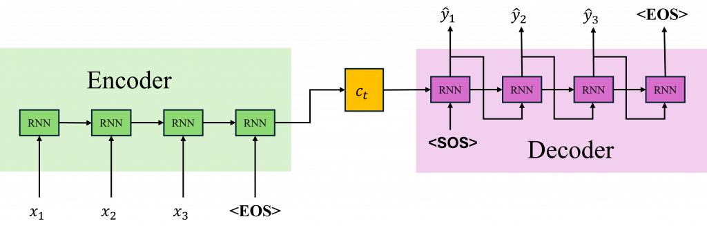

Encoder
-------

在Seq2Seq的模型架構中，其中的構造都是使用循環神經網路或長短期記憶這類的模型組合而成的。**在Encoder的部分，和進行文字分類時一樣將輸入序列轉換成一個隱藏狀態**，但在Seq2Seq架構中我們稱這個隱藏狀態為`上下文向量(Context Vector)`。

在分類任務中我們是通過分析這個上下文向量，並交給全連結層進行運算與分析；而在Seq2Seq架構中，我們則是把這個隱藏狀態當作整個架構的知識庫並傳遞到Decoder中，也就是Enocder扮演的角色是負責理解我們輸入資料的詳細內容。


因此對其Encoder的數學公式其實就非常的簡單，他就與我們之前講到的循環神經網路與LSTM完全一模一樣，沒有任何的變化，不過我們在後續Decoder會提到一些比較複雜的部份因此我們將其上下文向量的簡化成以下模式(其中`c(t)`上的`e`代表的是由Encoder生成的)


但是在Encoder階段，由於生成的文字與輸入的文字長度往往不相等，**我們需要透過一個特殊Token `<EOS>（End of Sequence）`來讓Encoder學習到文字的結尾**，並將這訊息傳遞給Decoder，使模型知道何時停止生成文字。如果沒有EOS標記，**模型可能會無限生成詞彙，導致無法正確判斷何時該結束輸出序列**。

Decoder
-------

不過在 Decoder 的生成過程中就有所不同了，我們會在第一步將 `<SOS>`（Start of Sequence）特殊標記作為第一個時序的輸入讓它產生對應的翻譯或相對應的文字目標，直到遇到 `<EOS>` 才停止生成。

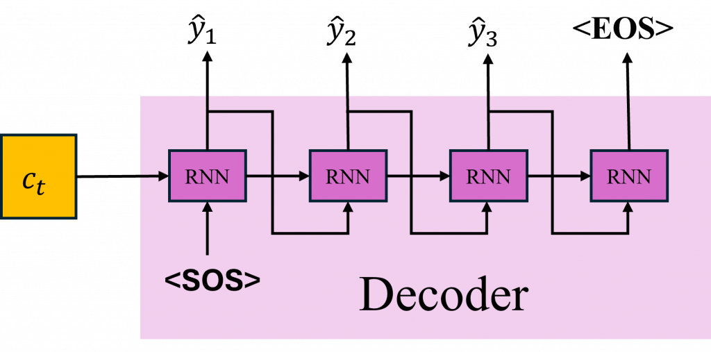

而觀察圖片中的 Decoder 架構，可以發現，**它會將上一個生成的文字當作當前時序的輸入進行運算**。因此我們必須先計算出每個 Decoder 的隱藏狀態中最有可能對應的文字機率，並將其轉換成對應的標記給模型進行運算。以上這段文字我們可以轉換成以下三個公式：


這三個公式你應該不陌生了。第一個是每一個隱藏狀態的輸出，而我們知道隱藏狀態的輸出需要通過全連接層的計算才能轉換為對應的維度以計算出機率。因此，第二個公式就是全連接層的公式，第三個則是`softmax`的公式，用來計算機率並轉換出最終生成的Token。

但是這樣的運算會發生問題，我們知道**生成動作永遠是學習最困難的部分**，因此在一開始模型肯定會生成錯誤的目標序列。這就導致當這個**錯誤的目標序列被用作下一個時序的輸入時，生成的結果每出錯一個字，後續的文字也會跟著出錯**。因此實際上我們會使用`Teacher Forcing（教師強迫）`技術來協助模型的訓練。

在`Teacher Forcing`這個方法中，其運作方式是**在訓練階段使用真實目標序列的元素作為Decoder的輸入**，而不是使用上一個時間步(上一個文字)的資料。也就是說**不管每個生成出來的文字是什麼，我們輸入的都會是正確的序列給Decoder**。這樣當Decoder在每一步單獨計算損失值時，模型就能夠更快地學習目標序列的結構和模式。

總結
--

在今天的內容中，我們可以發現這些技術都是一步步地延伸而成的，而這些公式基本上可以從前面幾個章節中取得。這表明在深度學習領域中，基礎公式的重要性。在今日討論的Seq2Seq架構中，我們能發現其作法與DCGAN相似，非常簡單。但是，仔細想想這篇文章中有沒有什麼奇怪的地方，以及這個模型還有哪裡可以優化的。而在明天我將會告訴你這個模型的缺陷並告訴你改進的數學證明。

---

<a id="7467-day-18"></a>

## Day 18｜【Day 18】Seq2Seq中的上下文向量為何無法很好的傳遞訊息-Attention介紹與數學推導

- 原文：https://ithelp.ithome.com.tw/articles/10362423
- 發佈時間：2024-10-02 23:13:32

前言
--

在學習時間序列模型時，我們了解到無論是長短期記憶還是循環神經網路，**在經過多個時序運算後，都有可能出現梯度消失的問題**。這意味著當我們的輸入到達最後一個隱藏狀態時，原始資料可能已經經歷了一定程度的失真。因此，在`Seq2Seq`模型中Enocder所給予的上下文向量便是這一個狀態。

而在Decoder中，則需要使用這個上下文向量作為其初始的隱藏狀態來生成文字。這樣做會導致生成越靠近前側的時序被模型遺忘，使得接近結尾的部分可能產生錯誤。因此我們需要找到一種改善的方法，這種方法就是`Attention（注意力機制）。`

Seq2Seq + Attention
-------------------

`Attention`的核心思想是，Decoder在每一步生成輸出時，不是只依賴一個固定的上下文向量，而是根據當前Decoder的時序，動態地計算出Encoder所拋出的上下文向量哪一個是更重要的。


其計算概念是先對Encoder當前的上下文向量`c(t)`和Decoder上一個時間點的上下文向量`c(t-1)`進行運算。這種運算方式有很多種，例如：我們可以直接將兩個向量相加、結合或相乘。**只要有一種方式能夠將其資訊融合即可**。其中最廣為人知的算法就是`Bahdanau Attention`算法。該算法實際上是我們在**循環神經網路中用來計算概率分佈的方法**，其數學公式如下：


而這次看到這個公式後，你應該能夠完全理解其數學表達和程式的執行方式了。簡單來說，就是先將Encoder與Decoder各自的資訊融合，再將這個機率分佈狀態通過全連接層轉換成對應的資料，最後由`softmax`函數轉換成各自的機率。**這樣我們就可以獲取一個包含所有時序狀態的`注意力權重(Attention Weights)`矩陣了。**

這時注意力權重會產生一個與上下文向量長度相等的矩陣。**然後我們只需將每一個上下文向量與注意力權重相乘。這樣，當注意力權重越大時，對應的Encoder上下文向量會保留更多信息**，我們可以通過以下公式來計算：


現在你是不是對於`Attention`機制有更深入的了解了呢？然而你可能還是有一些問題，例如`c(t)`是來自Encoder還是Decoder需要被計算，以及Decoder上下文向量的詳細輸入方式。為了理解這些部分，我們可以先看看圖片中的運算方式，然後再回頭查看公式，而明天我也會用程式碼的方式來加深你的印象，讓你更能夠理解這些公式的到理

總結
--

我相信你看到這裡，已經非常了解這些數學式的含意了。而這也是我想要傳達的概念之一：在深度學習的領域中，往往是同一公式不斷重複使用，只不過**每一次技術的改良都有可能替換掉架構中的一些部份**。例如，我們可能不再使用tanh來計算機率分佈，而是改用sigmoid，或者不使用加法而改用乘法來結合資訊。**這些看似微小的改動，可能正是產生新模型的一個關鍵技術**。因此當你理解了這些數學後，你更能做到的是根據需要改動模型，並進行優化與調整。

> 在這裡補充一點通常不會用乘法來結合資料，因為這樣會破壞掉正負關係，同時會導致資料之間的大小變得更大，使的模型更難運算

---

<a id="7467-day-19"></a>

## Day 19｜【Day 19】用Seq2Seq+Attention進行文字翻譯

- 原文：https://ithelp.ithome.com.tw/articles/10362968

前言
--

在今天的內容中，我們將使用 [ManyThings](https://www.manythings.org/anki/) 這個網站中的中英文資料，來進行文字翻譯任務的訓練。在這次內容中，我們會分別使用兩個 `Tokenizer` 給予 Encoder 與 Decoder 進行分析與訓練，我們會使用 BERT 的 `Tokenizer` 來進行處理。在這裡需要注意的是，BERT 的 `Tokenizer` 在使用時會產生 `[CLS]` 與 `[SEP]` 這兩個特殊 Token，這剛好可以作為我們模型中的 `SOS` 與 `EOS` Token。現在讓我們直接來看程式碼的部分。

由於ManyThings這個網站沒有繁體中文資料，我們需要先使用`OpenCC`這個函式庫將其進行簡體轉繁體操作。這也是解決繁體中文語料庫不足的一種方法。去年國科會開發的LLaMA繁體中文版出現大量簡體資訊，就是因為直接使用了簡體中文資料而未刪除特定國家的資訊所導致的問題。然而在我們的情況下，因為只需要簡單的資料處理，所以直接進行簡轉繁即可。

### 【STEP 1】將txt文件轉換成csv

與我們在IMDB時的做法一樣，我習慣將資料先轉換成csv格式。在該資料集中，每個英文和中文之間都是通過`\t`這個特殊符號分割。主要有三個欄位，第一個欄位是英文，第二個欄位是中文，第三個欄位是相關資訊。因此，我們只需將資料分割後取得前兩個欄位，再將其儲存為csv文件即可。

```
import pandas as pd
from opencc import OpenCC

def convert_news_to_csv(data_path, csv_file_path):
    cc = OpenCC('s2tw') # 簡體轉繁體
    with open(data_path, 'r', encoding = "utf-8") as f:
        lines = f.read().split('\n')
        english, chinese = [], []
        for line in lines:
            if line:
                en, cn, _, = line.split('\t') # 資料是\t分割的
                english.append(en)
                
                chinese.append(cc.convert(cn))
    df = pd.DataFrame({'chinese':chinese, 'english':english})
    df.to_csv(csv_file_path)
    
convert_news_to_csv('cmn.txt', 'translate.csv')
df = pd.read_csv('translate.csv')
input_texts = df['chinese'].values
target_texts = df['english'].values
```

### 【STEP 2】將資料轉換成Pytorch DataLoader

在這一步中大多數的操作都與先前相同，但唯一不同的地方在於`collate_fn`所需填充的內容各不相同。因此在這裡我們特別進行講解。首先**輸入給Encoder的中文資料不需要有sos Token**，因此我們需要使用`input_ids[:, 1:]`這種寫法，其中**`:,`的寫法是取出第二個維度的資料**。由於我們當前的資料維度是(batch_size, seq_len)，因此我們需要取出`seq_len`的維度並移除第1個`[CLS]` Token，以達到移除`sos` Token的功能，而Deocder則不需要進行改動。

```
from torch.utils.data import Dataset, DataLoader
from sklearn.model_selection import train_test_split
from transformers import AutoTokenizer

class TranslateDataset(Dataset):
    def __init__(self, x, y, src_tokenizer, tgt_tokenizer):
        self.x = x
        self.y = y
        self.src_tokenizer = src_tokenizer
        self.tgt_tokenizer = tgt_tokenizer

    def __getitem__(self, index):
        return self.x[index], self.y[index]
       
    def __len__(self):
        return len(self.x)
    
    def collate_fn(self, batch):    
        batch_x, batch_y = zip(*batch)
        inputs = self.src_tokenizer(batch_x, max_length=256, truncation=True, padding="longest", return_tensors='pt').input_ids[:, 1:]
        targets = self.tgt_tokenizer(batch_y, max_length=256, truncation=True, padding="longest", return_tensors='pt').input_ids
       
        return {'src_input_ids':inputs, 'tgt_input_ids': targets}

        
x_train, x_valid, y_train, y_valid = train_test_split(input_texts, target_texts, train_size=0.8, random_state=46, shuffle=True)

src_tokenizer = AutoTokenizer.from_pretrained('bert-base-chinese')
tgt_tokenizer = AutoTokenizer.from_pretrained('bert-base-uncased')

trainset = TranslateDataset(x_train, y_train, src_tokenizer, tgt_tokenizer)
validset = TranslateDataset(x_valid, y_valid, src_tokenizer, tgt_tokenizer)

train_loader = DataLoader(trainset, batch_size = 64, shuffle = True, num_workers = 0, pin_memory = True, collate_fn=trainset.collate_fn)
valid_loader = DataLoader(validset, batch_size = 64, shuffle = True, num_workers = 0, pin_memory = True, collate_fn=validset.collate_fn)
```

### 【STEP 3】建立Encoder模型

在Encoder模型中與我們在LSTM章節中所建立的方式完全相同，唯一的差異在於我們不需要經過全連接層的運算，並且需要使用到`output`這一個參數，其原因是**`output`包含者整個模型在運算時的隱藏狀態，因此我們在計算`Attention`時會需要使用其變數，而`hidden`則會做為Decoder的初始隱狀態。**

```
import torch.nn as nn

class EncoderGRU(nn.Module):
    def __init__(self, vocab_size, hidden_size, padding_idx):
        super(EncoderGRU, self).__init__()
        self.embedding = nn.Embedding(vocab_size, hidden_size, padding_idx=padding_idx)
        self.gru = nn.GRU(hidden_size, hidden_size, batch_first=True)
        self.dropout = nn.Dropout(0.1)

    def forward(self, token_ids):
        embedded = self.dropout(self.embedding(token_ids))
        #embedded: (batch_size, time_step, emb_dim)
        output, hidden = self.gru(embedded) 
        # output: (batch_size, time_step, hidden_size * 2)
        # hidden: (2, batch_size, hidden_size)
        return output, hidden
```

### 【STEP 4】建立Attention

在Attention層時，我們需要仔細考慮輸入的資料格式。首先，我們要了解Attention的輸出是一個單一向量，即上下文向量。這個上下文向量會輸入給當前時序的Decoder。因此，我們的`decoder_hidden`其實是一個(batch_size, 1, hidden)的輸入，而Encoder則是(Batch_size, seq_len, hidden)。通過Bahdanau Attention的公式運算後，這些輸入會被轉換成相同大小，因此可以順利加總起來。接下來的步驟就是將各類運算轉換為上下文向量。我會把每層輸出的註解都打在程式碼中，以便你理解每個過程發生了什麼事情。

```
class BahdanauAttention(nn.Module):
    def __init__(self, hidden_size):
        super(BahdanauAttention, self).__init__()
        self.encoder_projection = nn.Linear(hidden_size, hidden_size)
        self.decoder_projection = nn.Linear(hidden_size, hidden_size)
        self.attention_v = nn.Linear(hidden_size, 1)
        self.tanh = nn.Tanh()
        self.softmax = nn.Softmax(dim=-1)

    def forward(self, encoder_hidden, decoder_hidden):
        energy = self.tanh(self.encoder_projection(encoder_hidden) + self.decoder_projection(decoder_hidden))
        #energy: (batch_size, time_step, hidden_size)
        scores = self.attention_v(energy)
        #scores: (batch_size, time_step, 1)
        scores = scores.squeeze(2).unsqueeze(1)
        #scores: (batch_size, 1, time_step)

        attention_weights = self.softmax(scores)
        # attention_weights (batch_size, 1, time_step)
        context_vector = torch.bmm(attention_weights, decoder_hidden)
        #context_vector: (batch_size, 1, hidden_size)
        return context_vector
```

### 【STEP 5】建立Decoder

在Decoder部分，**我們需要將`Embedding`的資訊與經過Attention計算後的上下文向量結合，然後將這些資訊傳遞到輸出層**。在輸出層，信息會經過全連接層的轉換，最終生成適合進行`softmax`運算的向量。這樣模型在推理時能夠計算出下一個時間步的Token。

> 需要經過`softmax`運算的資料必須轉換為維度為 (batch_size, 1, seq_len) 的格式。因此，無論是在Attention機制中還是Decoder中，我們都會看到為了滿足此需求而進行的維度轉換操作。

```
class DecoderGRU(nn.Module):
    def __init__(self, attention, hidden_size, output_size, padding_idx):
        super(DecoderGRU, self).__init__()
        self.embedding = nn.Embedding(output_size, hidden_size, padding_idx=padding_idx)
        self.gru = nn.GRU(2 * hidden_size, hidden_size, batch_first=True)
        self.output_projection = nn.Linear(hidden_size, output_size)
        self.dropout = nn.Dropout(0.1)
        self.attention = attention

    def forward(self, encoder_outputs, decoder_hidden, decoder_input_ids):
        # decoder_input_ids: (batch_size, 1)
        embedded = self.dropout(self.embedding(decoder_input_ids)) 
        # embedded: (1, batch_size, emb_dim)
        decoder_state = decoder_hidden.permute(1, 0, 2) 
        #decoder_state (batch_size, 1, emb_dim)
        context = self.attention(decoder_state, encoder_outputs) 
        # (batch_size, 1, hidden_size)
        input_gru = torch.cat((embedded, context), dim=-1) 
        # input_gru (batch_size, 1, hidden_size + emb_dim)
        output, decoder_hidden = self.gru(input_gru, decoder_hidden) 
        # output: (batch_size, time_step, hidden_size)
        # decoder_hidden: (1, batch_size, hidden_size)
        decoder_output = self.output_projection(output)
        # decoder_output: (batch_size, 1, output_size)
        return decoder_output, decoder_hidden
```

### 【STEP 6】組合組件並完成生成方法

這次的模型定義較為特殊。在理解具體模型之前，我們先了解整體的運作流程，如此可以幫助我們更好地理解接下來的內容。首先我們會通過Encoder模型計算當前批量的整體隱藏狀態。接著，建立一個初始給予Decoder的SOS Token `decoder_next_input`，並將Encoder最後的隱藏狀態傳入Decoder進行運算。

接下來，我們使用for迴圈，將真實的目標序列作為下一個`decoder_next_input`，並繼續交給模型生成文字（即`Teacher Forcing`）。同時，我們會記錄每個序列的生成結果，以便計算正確的損失值。

```
class Attentionseq2seq(nn.Module):
    def __init__(self, encoder, decoder, padding_idx):
        super(Attentionseq2seq, self).__init__()
        self.encoder = encoder
        self.decoder = decoder
        self.criterion = nn.NLLLoss(ignore_index=padding_idx)
        self.logsoftmax = nn.LogSoftmax(dim=-1)

    def forward(self, src_input_ids, tgt_input_ids):
        input_ids = src_input_ids
        targets = tgt_input_ids

        # Encoder
        encoder_outputs, decoder_hidden = self.encoder(input_ids)
        # encoder_outputs: (batch_size, time_step, hidden_size)
        # decoder_hidden: (1, batch_size, hidden_size)
        decoder_next_input = torch.empty(targets.shape[0], 1, dtype=torch.long).fill_(101).to(input_ids.device.type) # 加入CLS token
        # decoder_next_input: (batch_size, 1)

        # Decoder
        decoder_outputs = []
        for i in range(targets.shape[1]):
            decoder_next_input, decoder_hidden = self.decoder(encoder_outputs, decoder_hidden, decoder_next_input)
            # decoder_next_input: (batch_size, 1, hidden_size)
            # decoder_hidden: (1, batch_size, hidden_size)

            decoder_outputs.append(decoder_next_input)      # 儲存當前時序的文字分布狀態
            decoder_next_input = targets[:, i].unsqueeze(1) # 取出下一個對應的文字進行生成
            # decoder_next_input: (batch_size, 1)

        decoder_outputs = torch.cat(decoder_outputs, dim=1) # 完整的Decoder隱狀態輸出
        # decoder_outputs: (batch_size, time_step, output_dim)
        decoder_outputs = self.logsoftmax(decoder_outputs)  # 計算個文字機率
        # decoder_outputs: (batch_size, time_step, output_dim)
       
        # 計算損失值
        loss = self.criterion(
            decoder_outputs.view(-1, decoder_outputs.size(-1)), # (batch_size * time_step,  output_dim)
            targets.view(-1) # (batch_size * time_step)
        )
        
        return loss, decoder_outputs
```

我們的生成方式有所不同，**因為沒有目標序列，所以只能依賴 `SOS` Token 來進行生成**。生成過程的邏輯是首先通過 Encoder 進行計算，接著直接使用 `SOS` Token 作為起始輸入開始生成，並將每次生成的結果作為下一次的輸入序列，持續進行直到生成 `EOS` Token 為止生成才會結束。

```
def generate(self, input_ids, sos_token=101, eos_token=102, max_len=50):
        with torch.no_grad():
            encoder_outputs, decoder_hidden = self.encoder(input_ids)
            decoder_outputs = []
            decoder_next_input = torch.empty(1, 1, dtype=torch.long).fill_(sos_token).to(input_ids.device.type)
            for _ in range(max_len):
                decoder_next_input, decoder_hidden = self.decoder(encoder_outputs, decoder_hidden, decoder_next_input)
                decoder_outputs.append(decoder_next_input)

                _, top_token_index = decoder_next_input.topk(1)
                if top_token_index == eos_token:
                    break
                
                decoder_next_input = top_token_index.squeeze(-1).detach()  # detach from history as input
            decoder_outputs = torch.cat(decoder_outputs, dim=1)
            decoder_outputs = self.logsoftmax(decoder_outputs)

            _, generated_ids = decoder_outputs.topk(1)
        return generated_ids.squeeze()
```

### 【STEP 7】訓練模型

在訓練模型時我們可以為 Encoder 和 Decoder 分別使用不同的優化器。然而需要注意的是，`Encoder`、`Attention` 和 `Decoder` 的 `hidden_size` 必須保持相同大小，否則可能會導致錯誤。

```
import torch.optim as optim
from trainer import Trainer

# 主程式部分
device = torch.device('cuda' if torch.cuda.is_available() else 'cpu')
hidden_size = 768
encoder = EncoderGRU(
    vocab_size=len(src_tokenizer), 
    hidden_size=hidden_size, 
    padding_idx=src_tokenizer.pad_token_id
)

decoder = DecoderGRU(
    attention = BahdanauAttention(hidden_size=hidden_size),
    hidden_size=hidden_size, 
    output_size=len(tgt_tokenizer), 
    padding_idx=tgt_tokenizer.pad_token_id
)

model = Attentionseq2seq(
    encoder = encoder,
    decoder = decoder,
    padding_idx = tgt_tokenizer.pad_token_id
).to(device)

optimizer_e = optim.Adam(encoder.parameters(), lr=1e-4)
optimizer_d = optim.Adam(decoder.parameters(), lr=1e-4)
trainer = Trainer(
    epochs=30, 
    train_loader=train_loader, 
    valid_loader=valid_loader, 
    model=model, 
    optimizer=[optimizer_e, optimizer_d],
    early_stopping=3
)
trainer.train()
# ----- 輸出 -----
Train Epoch 21: 100%|██████████| 374/374 [00:23<00:00, 16.02it/s, loss=0.589]
Valid Epoch 21: 100%|██████████| 94/94 [00:01<00:00, 51.56it/s, loss=1.494]
Saving Model With Loss 1.84741
Train Loss: 0.53640| Valid Loss: 1.84741| Best Loss: 1.84741
```

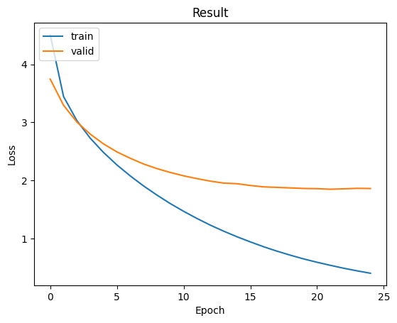

我們可以觀察到，模型的訓練損失雖然持續下降，但驗證損失卻沒有明顯上升，這表明模型已經達到了優化的瓶頸。由於驗證損失已經收斂，且尚未出現過擬合的情況，**這時我們可以採取進一步的措施來提升模型性能，例如引入最佳化技巧或擴充資料集，以促進模型的進一步改善。**

### 【STEP 7】生成訓練結果

最後我們使用驗證數據生成文字結果。在這過程中我們需要將 `SOS` token 移除，因為**模型的輸入是在 Encoder 處理後再傳遞給 Decoder，而 Decoder 的 SOS token 已在 `generate` 函數中自動定義**。因此在生成短語時儘管偶爾會偏離原意，但整體的生成效果仍然不錯，而這種偏離主要是由於訓練數據不足，如果我們能夠擁有更多的數據，生成效果將會有明顯的提升。

```
model.load_state_dict(torch.load('model.ckpt'))
model.eval()

for idx in range(3):
    input_ids = src_tokenizer(x_valid[idx], max_length=256, truncation=True, padding="longest", return_tensors='pt').to(device).input_ids[:, 1:]
    generated_ids = model.generate(input_ids, max_len=20)
    print('\n輸入文字:', x_valid[idx])
    print('目標文字:', y_valid[idx])
    print('翻譯文字:', tgt_tokenizer.decode(generated_ids))
# ----- 輸出 -----
輸入文字: 他要愛。
目標文字: He wants affection.
翻譯文字: [CLS] he's love. [SEP]

輸入文字: 別再讓我做那事了。
目標文字: Don't make me do that again.
翻譯文字: [CLS] don't do that again. [SEP]

輸入文字: 我們愛湯姆。
目標文字: We love Tom.
翻譯文字: [CLS] we love tom. [SEP]
```

總結
--

在今天的內容中，我們發現程式碼非常複雜，因此我們在註解中詳細說明了每個維度的輸出。在文章的主要部分，我們解釋了為何在程式設計中需要這樣處理。不過由於內容很複雜，因此你可能還是需要多看幾次程式碼才能了解這些程式的內容及其相關的數學公式。

---

<a id="7467-day-20"></a>

## Day 20｜【Day 20】主宰的AI世界強大模型架構-Transformer數學證明

- 原文：https://ithelp.ithome.com.tw/articles/10363463
- 發佈時間：2024-10-04 22:56:51

前言
--

昨天我們學到的Seq2Seq架構中，其實有一個很嚴重的問題，該架構的核心是使用循環神經網路進行運算，撇開梯度消失的問題之蔡，其**最大的缺點是運算速度非常緩慢**，每次運算必須等待上一個單元計算完畢後才能取得結果無法進行平行運算，而且該模型**承襲了循環神經網路只能單向運算的特性**，因此不論是效能或速度上其實都有可以改善的地方，而在今天介紹的模型`Transformer`同樣的也是Encoder與Decoder架構的模型，但他在效能與執行速度上則有了大幅的提升，現在讓我們看看該模型的架構與數學式吧

Transformer
-----------

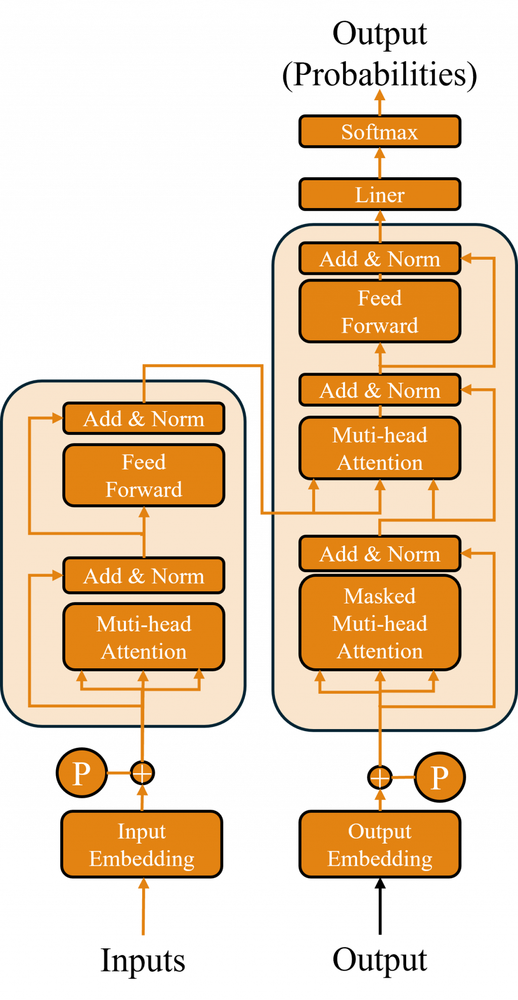

`Transformer` 是一種基於`注意力機制（Attention Mechanism）`的深度學習模型架構，是由 Vaswani 等人於 2017 年在論文《Attention is All You Need》中提出。雖然一開始是被設計用於自然語言處理任務，但隨著時間的推移，**其應用範圍擴展到了電腦視覺等其他領域**，基本上現今所有強大的模型都是基於此架構開發而成的，而其主要特點是能夠更高效地處理序列數據，尤其是在長序列上具有出色的表現，現在讓我們拆解模型架構來看看其內容吧。

### Positional Encoding

在循環神經網路這類的時間序列模型中，其遞迴結構保留了序列中元素的順序資訊，**但 Transformer 模型完全依賴平行運算並不具備順序意識**。如果直接將序列傳送到模型中，可能會導致模型學到混亂的序列資訊，進而影響效果。因此我們需要一種方法將位置信息引入模型中而這種方式就是 `Positional Encoding`。


在 `Positional Encoding` 中，其編碼方式是將位置信息嵌入到輸入給模型的嵌入層中，並通過正弦與餘弦函數來實現。具體方法是對**奇數位置使用正弦函數進行編碼，對偶數位置則使用餘弦函數進行計算**。其數學公式如下所示：

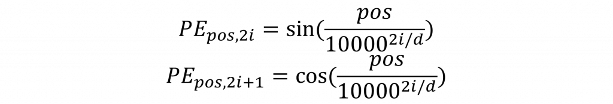

該公式的設計主要利用了 `sin()` 和 `cos()` 函數的**周期性特性**，因為這些函數非常適合表現循環性特徵。通過將不同頻率的 `sin()` 和 `cos()` 函數用於位置編碼，可以在多個尺度上捕捉序列中元素的相對距離，從而使每個位置的編碼具有獨特且可區分的特性。這種方法有助於模型更有效地學習詞與詞之間的相對位置關係。

### Encoder

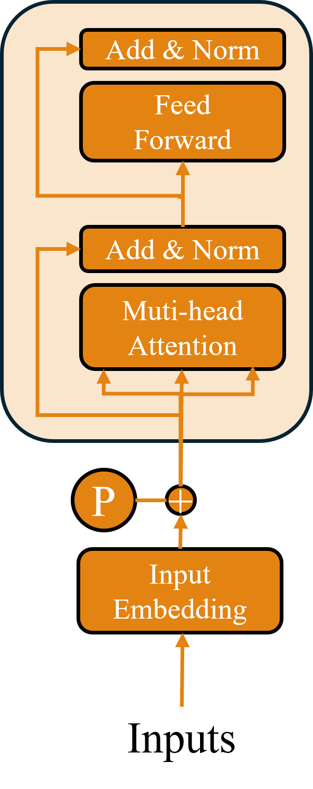

在Transformer中，最重要的部分是其`自注意機制（Self-Attention）`。該機制不同於Seq2Seq模型需要通過編碼器（Encoder）和解碼器（Decoder）之間的運算。自注意機制是使用每一個序列的`查詢向量（Query, Q）`、`鍵向量（Key, K）`和`值向量（Value, V）`，在內部進行注意力運算。這三個向量分別通過與各自的`權重矩陣W`進行運算得到，其運算流程圖如下所示。

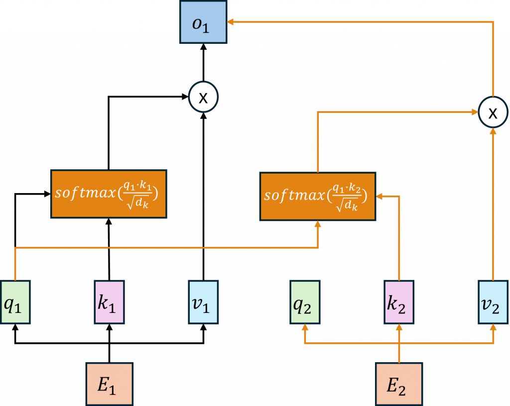

**在所有的注意力機制中，計算的核心是通過計算注意力權重，並將其應用於對應的向量進行操作**。例如在 Seq2Seq 模型中，首先利用Encoder和Decoder的隱藏狀態來計算注意力權重，然後與對應的上下文向量進行加權運算。

而在 Transformer 模型中，則是通過查詢向量與鍵向量計算出注意力權重，再將其應用於值向量上進行運算

，**這種方式的目的是評估序列中的每個元素對其他元素的關注程度**。具體而言對於 Transformer 中的Encoder其主要公式如下:

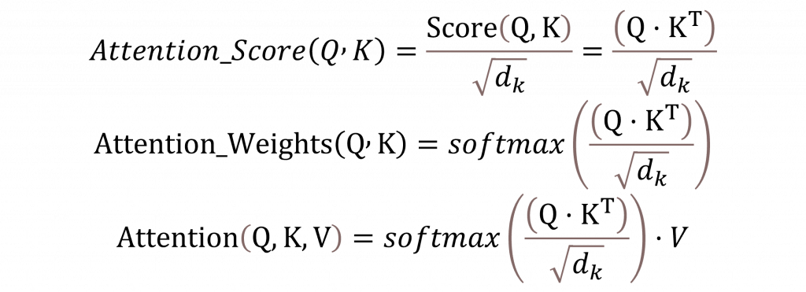

其中 √𝑑 是與鍵向量維度大小相等的數值，其目的是為了**調整查詢向量與鍵向量相乘後可能出現過大的數值**。這樣做是為了防止數值過大導致梯度消失或爆炸的問題，因此需要將這些放大的數值縮放回合理範圍。

在整個計算過程中，我們可以看到，最後一步與 Seq2Seq 模型相同，都是通過 Softmax 函數來計算注意力權重，並且與值向量進行加權運算，這代表**每個輸出都是基於每一個查詢向量與鍵向量所計算的權重與機率**。因此**每一個輸出都反映了模型對所有輸入資訊的考量**，這使得每個輸出結果比 Seq2Seq 方法更加豐富，因為Transformer 能夠更有效地捕捉全局關聯，從而產生更具信息性的結果。


實際上Transformer 模型使用的是**多頭自注意力機制（Multi-Head Self-Attention）**來進行運算，這與單純的自注意力機制不同。多頭自注意力機制的主要區別在於，**它會將查詢向量、鍵向量和值向量進行多次投影，生成多組查詢、鍵、和值向量**，並在不同的`頭（head）`上進行獨立的注意力計算。每個頭能夠專注於輸入序列中的不同部分或特性，從而使模型能夠捕捉到更豐富的語意特性和上下文關係。

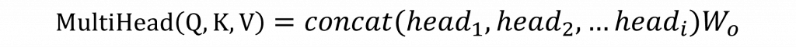

在經過注意力機制之後，為了能夠進行最終的輸出或計算機率，我們可以使用全連接層來處理數據。這個概念在 Transformer 中依然適用，但 Transformer 和 DCGAN 一樣，屬於較深層的網路，因此需要解決內部協變量偏移問題。

為了解決這個問題，Transformer 中引入了 `Layer Normalization`，其原理是**通過對每一層的輸入 x 進行正規化處理，來穩定每一層的輸出結果**從而促進模型更快、更穩定地收斂。`Layer Normalization` 的作用類似於 `Batch Normalization`，但它是針對每一個樣本的輸入進行正規化，而不是針對整個 batch。


ε的用途主要是為了**防止出現除以零的情況**，因此其數值通常會設定得非常小，這樣可以確保計算過程中的穩定性，避免數值不穩定帶來的計算錯誤。至於γ則是用來**控制縮放輸出的幅度**，它在每一層中都可以進行調整，從而使模型能夠靈活地學習到不同特徵的權重。這樣可以幫助模型更好地適應不同數據的特性。而β則是**代表該層的偏移量**，這個偏移量可以幫助模型在學習過程中更好地調整輸出，使其更加接近真實數據的分佈。

### Decoder

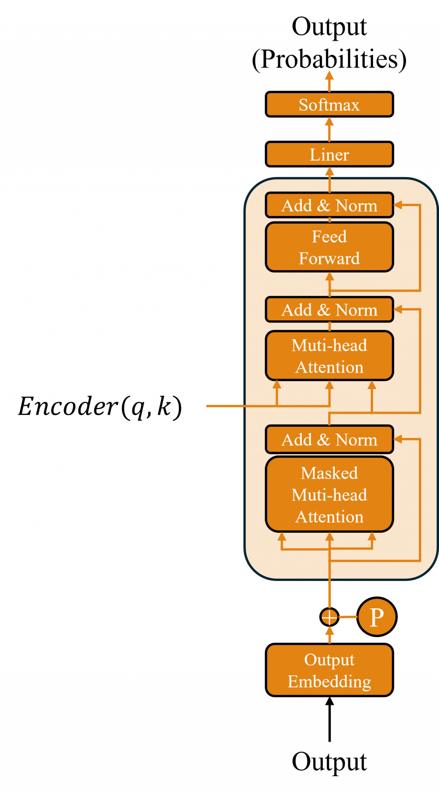

我們了解到Decoder在訓練時使用了 `Teacher Forcing` 方法，這種方法依賴於上一時間步的輸出和當前的輸入，但 **Transformer 模型使用的是並行運算，在這種情況下，如果不進行特定的處理，注意力機制可能會包含完整的注意力權重信息，導致模型提前看到未來的時序信息，進而引發運算錯誤。**

為了解決這個問題，Transformer 的 Decoder 中引入了一個 **Masked Multi-head Attention（遮蔽式多頭注意力機制）** 層。這一層的作用是確保模型在當前步驟中，僅能關注到當前或之前的位置信息，而無法看到未來的輸入。具體做法是生成一個 **遮蔽矩陣（Masking Matrix）**，來遮蔽掉未來時間步的信息。


其計算原理是通過遮蔽注意力權重中的未來位置，從而防止當前生成的序列包含未來信息，這有效解決了信息泄露的問題。在計算注意力權重時，**對於那些代表未來位置的部分（遮蔽矩陣中為 1 的部分），賦予一個負無窮大的值，這樣在進行 Softmax 計算時，這些位置的權重會趨近於零，幾乎不起作用。**

這樣的設計確保了模型在生成序列時只能依賴當前和之前的輸入，避免提前看到未來的信息，從而保持生成的序列順序性和合理性。簡單來說，在進行多頭注意力機制計算之前，首先執行遮蔽操作，其他的計算過程則與 Encoder 中的多頭自注意力機制相同。

總結
--

我們的學習進度已經來到了 2/3，今天進入的章節可以說是整個 AI 發展中最關鍵的部分。這個模型在語音變式、文字生成、語音生成等領域中，已經成為最重要的技術之一，這都要歸功於該模型中的 Self-Attention 機制。因此而在接下來的章節中，我們將深入學習和探索以這個模型為基礎的各種技術演變與優化，通過改進與調整該模型的架構，讓你逐步了解這些技術的發展過程與背後的原理。

---

<a id="7467-day-21"></a>

## Day 21｜【Day 21】用Transformer來進行文本摘要

- 原文：https://ithelp.ithome.com.tw/articles/10363976

前言
--

在今天的內容中，我們不會像在Seq2Seq模型中那樣，所有元件都需要自己手寫。因為在Pytorch中，其實已經有幫我們定義好Transformer的框架。但由於Transformer中的運算是平行進行的，**這個模型最麻煩的部分在於遮罩矩陣的設定**，因此今天我們將使用[NEWS SUMMARY](https://www.kaggle.com/datasets/sunnysai12345/news-summary)數據集，來介紹這些矩陣的創建方式與實際用途。

而在本次內容中，由於我們的資料都是英文，因此在`Tokenizer`的部分只需要導入`bert-base-uncased`這一個英文的Tokenizer就好。而且這次我們除了使用該`Tokenizer`的`input_ids`之外，還會使用`attention_mask`來幫助我們產生對應的遮蔽矩陣。現在讓我們來看看完成的模型訓練過程吧！

### 【STEP 1】 導入資料集與Tokenizer

在這一步中，由於資料本身就是 CSV 文件，因此我們不需要進行轉換，直接使用 `os.listdir()` 讀取資料即可。在這個資料欄中，`text` 為完整的新聞資料，`summary` 則為對應的摘要文字。我們需要將其讀取出來，將 `text` 給予 Encoder 運算，而將 `summary` 給予 Decoder 運算。

```
from transformers import AutoTokenizer
import pandas as pd
import os

def read_csv_data(data_path):
    source, target = [], []
    for file_name in os.listdir(data_path):
        df = pd.read_csv(f'{data_path}/{file_name}')
        src, tgt = df['text'].values, df['summary'].values
        source.extend(src)
        target.extend(tgt)
    return source, target
    
x_train_data, y_train_data = read_csv_data('news/train')
x_test, y_test = read_csv_data('news/test')

tokenizer = AutoTokenizer.from_pretrained('bert-base-uncased')
```

### 【STEP 2】 建立Pytorch DataLoader

接下來我們在建立 Pytorch DataLoader 時，需要從 `Tokenizer` 中取出 `input_ids` 與 `attention_mask` 這兩個參數。不過由於這些參數是分別提供給 Encoder 和 Decoder 的，因此我們需要在 `collate_fn` 中修改這些參數的鍵名稱，以便在後續撰寫模型的前向傳播時，更能清晰地了解這些參數的實際用途。

```
from torch.utils.data import Dataset, DataLoader
from sklearn.model_selection import train_test_split

class SummaryeDataset(Dataset):
    def __init__(self, x, y, tokenizer):
        self.x = x
        self.y = y
        self.tokenizer = tokenizer

    def __getitem__(self, index):
        return self.x[index], self.y[index]
       
    def __len__(self):
        return len(self.x)
    
    def collate_fn(self, batch):    
        batch_x, batch_y = zip(*batch)
        src = self.tokenizer(batch_x, max_length=256, truncation=True, padding="longest", return_tensors='pt')
        tgt = self.tokenizer(batch_y, max_length=256, truncation=True, padding="longest", return_tensors='pt')
        src = {f'src_{k}':v for k, v in src.items()}
        tgt = {f'tgt_{k}':v for k, v in tgt.items()}

        return {**src, **tgt}

x_train, x_valid, y_train, y_valid = train_test_split(x_train_data, y_train_data, train_size=0.8, random_state=46, shuffle=True) 

trainset = SummaryeDataset(x_train, y_train, tokenizer)
validset = SummaryeDataset(x_valid, y_valid, tokenizer)

train_loader = DataLoader(trainset, batch_size = 32, shuffle = True, num_workers = 0, pin_memory = True, collate_fn=trainset.collate_fn)
valid_loader = DataLoader(validset, batch_size = 32, shuffle = True, num_workers = 0, pin_memory = True, collate_fn=validset.collate_fn)
```

### 【STEP 3】 建立Positional Encoding

在這一步開始，我們要建立Transformer的模型架構了。**不過在Pytorch中並沒有為我們預設`Positional Encoding`**，這是因為其實現方法多種多樣，且很多後續的改動也會針對`Positional Encoding`進行調整。因此Pytorch將這一部分的功能交給使用者自行定義。

在這裡我們的實際做法將遵照原始的方式進行，通過`sin()`與`cos()`的位置信息分別嵌入到傳給`Positional Encoding`的對應Embedding層中，而以下的程式碼都只是對應我們昨日所說明到的公式實現方式。

```
import torch
import torch.nn as nn

class PositionalEncoding(nn.Module):
    def __init__(self, emb_size, dropout, maxlen=5000):
        super(PositionalEncoding, self).__init__()
        self.dropout = nn.Dropout(p=dropout)
        
        pe = torch.zeros(maxlen, emb_size)
        position = torch.arange(0, maxlen, dtype=torch.float).unsqueeze(1)
        div_term = torch.exp(torch.arange(0, emb_size, 2).float() * (-torch.log(torch.tensor(10000.0)) / emb_size))
        pe[:, 0::2] = torch.sin(position * div_term)
        pe[:, 1::2] = torch.cos(position * div_term)
        pe = pe.unsqueeze(0).transpose(0, 1)
        self.register_buffer('pe', pe)

    def forward(self, x):
        x = x + self.pe[:x.size(0), :]
        return self.dropout(x)
```

不過我們需要注意一點，在 PyTorch 中`self.register_buffer` 是一個比較特殊的技巧，**特別是當我們想要定義一些不需要參與模型訓練（不需要追蹤梯度）的變量時我們必須調用它**。像是Positional Encoding是一個不會被模型訓練而改變的絕對位子，而這時使用常規的變量宣告方法，PyTorch 會默認追蹤梯度導致其位子有所變化，因此我們通過 `register_buffer` 的方式來避免這個問題。

### 【STEP 4】 建立Transformer

在這裡我們同樣將模型拆成多個區段進行簡要講解，而在Transformer中其實非常簡單，我們只需要宣告兩者的Embedding與剛剛建立的`PositionalEncoding`組件，接著直接呼叫`nn.Transformer`與Decoder輸出時的`nn.Linear`。這些就是我們昨天繪製的Transformer中所包含的全部物件。我會把相關參數的函數寫在註解中，如果你看不懂註解，建議先回去看看昨日的模型架構圖，這樣你會更理解該模型的實際函數。

```
class Seq2SeqTransformer(nn.Module):
    def __init__(self, vocab_size, emb_size, d_model, nhead, num_encoder_layers, num_decoder_layers, dim_feedforward):
        super(Seq2SeqTransformer, self).__init__()
        self.src_embedding = nn.Embedding(vocab_size, emb_size)
        self.tgt_embedding = nn.Embedding(vocab_size, emb_size)
        self.positional_encoding = PositionalEncoding(emb_size, dropout=0.1)

        self.transformer = nn.Transformer(
            d_model=d_model, # 對應的嵌入層維度跟emb_size相同大小
            nhead=nhead,     # Muti-head Attention head數量
            num_encoder_layers=num_encoder_layers, # 要幾個Encoder進行運算
            num_decoder_layers=num_decoder_layers, # 要幾個Decoder進行運算
            dim_feedforward=dim_feedforward,       # Layer Norm輸出維度
            batch_first=True
        )

        # 用於生成最終輸出的線性層
        self.fc = nn.Linear(d_model, vocab_size)
        self.criterion = torch.nn.CrossEntropyLoss(ignore_index=tokenizer.pad_token_id)
```

而在前向傳播時，我們需要注意到 `src_input_ids` 與 `tgt_input_ids` 是分別給予模型的資料，此外還需提供`Positional Encoding`以賦予位置信息。因此我特別設定了一個 `embedding_step` 方法，讓我們能夠快速賦予其位置信息。

而在這裡最重要的部分是其遮蔽矩陣。昨日我們提到的遮蔽矩陣是只有Decoder為了遮蔽未來訊息的矩陣，但是**實際上我們在進行運算時會有Padding的動作**。因此我們需要從`attention_mask`中取出Padding的索引，但是在Transformer中，與其相反**需要被填充的位置是1，未被填充的則是0**。因此，在`src_key_padding_mask`的部分，我們可以看到我們簡單的轉換。

為了生成遮蔽未來訊息的矩陣，我們只需使用`torch.triu`來生成一個大小為`emb_dim * emb_dim`的遮蔽矩陣。此外，我們需要注意正如昨天所提到的，我們需要將**矩陣中的0轉換為-inf，1轉換為0**，這樣在模型計算softmax時才不會考慮被遮蔽的數值。

```
def forward(self, **kwargs):
        src_ids = kwargs['src_input_ids']
        tgt_ids = kwargs['tgt_input_ids']
        src_emb, tgt_emb = self.embedding_step(src_ids, tgt_ids)

        src_key_padding_mask = (kwargs['src_attention_mask'] == 0)
        tgt_key_padding_mask = (kwargs['tgt_attention_mask'] == 0)

        src_mask = torch.zeros((src_emb.shape[1], src_emb.shape[1]),device=device).type(torch.bool)
        tgt_mask = self.generate_square_subsequent_mask(tgt_emb.shape[1])

        # 將嵌入通過transformer模型
        outs = self.transformer(
            src_emb, tgt_emb, 
            src_mask=src_mask, 
            tgt_mask=tgt_mask, 
            src_key_padding_mask=src_key_padding_mask,
            tgt_key_padding_mask=tgt_key_padding_mask, 
            memory_key_padding_mask=src_key_padding_mask
        )

        logits = self.fc(outs)

        tgt_ids_shifted = tgt_ids[:, 1:].reshape(-1)
        logits = logits[:, :-1].reshape(-1, logits.shape[-1])
        loss = self.criterion(logits, tgt_ids_shifted)

        return loss, logits

    def embedding_step(self, src, tgt):
        src_emb = self.src_embedding(src)
        tgt_emb = self.tgt_embedding(tgt)
        
        return self.positional_encoding(src_emb), self.positional_encoding(tgt_emb)
    
    def generate_square_subsequent_mask(self, sz):
        mask = (torch.triu(torch.ones(sz, sz)) == 1).transpose(0, 1)
        mask = mask.float().masked_fill(mask == 0, float('-inf')).masked_fill(mask == 1, float(0.0))
        return mask.to(device)
```

這裡其實有兩點不同。由於Encoder會將部分資訊傳送給Decoder，因此我們需要在這個過程中再次對Encoder中被Padding的序列進行Padding，這一個遮蔽矩陣就是程式中的`memory_key_padding_mask`。另一個遮蔽矩陣是`src_mask`，其功能是讓Decoder遮蔽未來的訊息。**在原始的Transformer中，我們不需要這樣處理，因此可以直接將其設定為0。**

我們需要完成生成的方式，這個過程其實與Transformer的前向傳播方式相同，也與Seq2Seq類似。我們會用for迴圈將BOS Token給模型，然後讓它生成下一個新序列，直到遇到Eos Token為止。其實這就是利用Seq2Seq的生成方式與Transformer的方式進行結合。

```
def generate(self, max_length=50, cls_token_id=101, sep_token_id=102, **kwargs):
        src_input_ids = kwargs['input_ids']
        src_attention_mask = kwargs['attention_mask']

        # 先嵌入源序列
        src_emb = self.positional_encoding(self.src_embedding(src_input_ids))
        src_key_padding_mask = (src_attention_mask == 0)

        # 初始化目標序列，開始符號 (BOS)
        tgt_input_ids = torch.full((src_input_ids.size(0), 1), cls_token_id, dtype=torch.long).to(src_input_ids.device)
        for _ in range(max_length):
            tgt_emb = self.tgt_embedding(tgt_input_ids)
            tgt_emb = self.positional_encoding(tgt_emb)

            # Transformer 前向傳播
            outs = self.transformer(
                src_emb, tgt_emb, 
                src_key_padding_mask=src_key_padding_mask, 
                memory_key_padding_mask=src_key_padding_mask
            )
            logits = self.fc(outs)
            next_token_logits = logits[:, -1, :]
            next_token = torch.argmax(next_token_logits, dim=-1).unsqueeze(1)
            tgt_input_ids = torch.cat([tgt_input_ids, next_token], dim=1)

            # 停止條件: 如果生成的序列中包含了結束符號 (EOS)
            if next_token.item() == sep_token_id:
                break

        return tgt_input_ids
```

### 【STEP 5】 訓練模型

最後，當我們設定好相關的參數後，就可以開始訓練模型的參數了。同樣地我們使用Trainer進行訓練。不過這次，我們會使用Warmup加餘弦退火法進行訓練。**該算法在一開始使用Warmup，以確認學習的方向，然後通過Cos波型不斷調整模型的學習率，使其能夠達到最佳收斂。**

```
# 設定模型
device = torch.device('cuda' if torch.cuda.is_available() else 'cpu')
model = Seq2SeqTransformer(
    vocab_size=len(tokenizer),
    emb_size=512,
    d_model=512,
    nhead=8,
    num_encoder_layers=6,
    num_decoder_layers=6,
    dim_feedforward=2048
).to(device)

import torch.optim as optim
from transformers import get_cosine_with_hard_restarts_schedule_with_warmup
from trainer import Trainer

# 優化器與排成器
optimizer = optim.AdamW(model.parameters(), lr=1e-4)
scheduler = get_cosine_with_hard_restarts_schedule_with_warmup(
        optimizer, 
        num_warmup_steps=len(train_loader), 
        num_training_steps=len(train_loader) * 100, 
        num_cycles=1, 
)

# 訓練模型
trainer = Trainer(
    epochs=100, 
    train_loader=train_loader, 
    valid_loader=valid_loader, 
    model=model, 
    optimizer=[optimizer],
    scheduler=[scheduler]
)
trainer.train(show_loss=True)
# ----- 輸出 -----
Train Epoch 29: 100%|██████████| 4643/4643 [06:25<00:00, 12.04it/s, loss=0.390]
Valid Epoch 29: 100%|██████████| 1161/1161 [00:33<00:00, 34.50it/s, loss=0.950]
Train Loss: 0.34809| Valid Loss: 2.26407| Best Loss: 2.18540
```

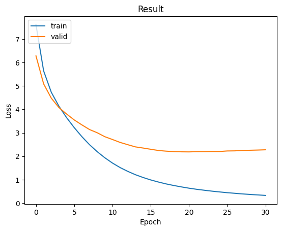

最終我們所看到的結果是目前訓練效果最好的曲線，這是由於Transformer強大的架構，再加上我們利用排程器進行優化，使其能夠呈現出極佳的曲線。

### 【STEP 6】實際生成文字

我們可以直接調用`generate`方法進行生成，從生成的結果中可以看出，其生成的文字與實際情況並無太大誤差。當然與市面上這些大型語言模型相比，還是存在一些差異，但就個人訓練的結果而言，這已經是一個很好的成績了。

```
model.load_state_dict(torch.load('model.ckpt'))
model.eval()
idx = 7778
input_data = tokenizer(x_test[idx], max_length=1024, truncation=True, padding="longest", return_tensors='pt').to(device)
generated_ids = model.generate(**input_data, max_len=50)

print('輸入文字:\n', x_test[idx])
print('目標文字:\n', y_test[idx])
print('模型文字:\n', tokenizer.decode(generated_ids[0]))
# ----- 輸出 ------
輸入文字:
 mandsaur police tuesday filed 350page chargesheet two accused eightyearold girls gangrape case chargesheet names 92 witnesses lists 100 pieces evidence accused girl allegedly kidnapped waiting family member outside school raped secluded place
目標文字:
 92 witnesses 100 evidences mandsaur gangrape chargesheet
模型文字:
 [CLS] 92 witnesses 100 evidences mandsaur gangrape chargesheet [SEP]
```

總結
--

今天我向你們講解了如何使用 PyTorch 的 Transformer 模型進行文本摘要，**重點在於如何建立遮罩矩陣以及如何將 Embedding 與 Transformer 中的 Positional Encoding 合併**。並且在昨天的內容中我通過公式幫助你更容易理解 Transformer 的架構和應用。

最後我們也見識到了 Warmup 加餘弦退火法進行模型訓練，以優化模型並取得良好的生成效果，這一點我們從生成的結果中，看到了當前最強大模型架構所擁有的能力。在接下來的內容中，我會告訴你如何將 Transformer 應用於預訓練模型。

---

<a id="7467-day-22"></a>

## Day 22｜【Day 22】何謂遷移式學習? 預訓練模型又是什麼?

- 原文：https://ithelp.ithome.com.tw/articles/10364503
- 發佈時間：2024-10-06 23:28:47

前言
--

在Seq2Seq與Transformer的章節中，如果你有跟著我們的內容進行訓練，你可能會發現：欸？怎麼訓練一個週期的時間都需要用到1小時呢？而我們花費這麼多時間訓練出來的結果，好像也沒有這些頂尖商業模型的效果來得好。那麼，我為什麼要自己訓練，而不是直接使用這些商業模型呢？答案其實很簡單，大多數的AI工作者並不會使用完全由自己訓練的模型進行工作。

第一點，**我們並沒有充足的資料讓模型進行良好的學習**。第二點，**即便我們有足夠的資料，我們也缺乏足夠的硬體來訓練對應資料集和參數量的模型**。因此，對於AI工作者而言，自行訓練模型往往不是最佳解答。那麼我們究竟該如何處理這些模型呢？今天我就是來告訴在AI領域中另一個重要概念`遷移式學習（Transfer Learning）`與`預訓練模型（Pre-trained Model）`

遷移學習（Transfer Learning）
-----------------------

假設你今天是一個從事醫療領域的AI工作者，而你收到的指令是需要訓練一個英文病例報告摘要的模型。**由於手頭上可用來訓練的資料數量有限，無論你如何訓練或修改Transformer，都無法訓練出理想的摘要模型。**

這時你想到你曾在iThome上讀過austin70915的一篇文章，該文章講述了使用英文新聞進行訓練的文本摘要模型，而恰巧這個模型架構是你想要的Transformer模型，更幸運的是這位作者將權重開源出來了。於是你找到austin70915的GitHub帳號，將完整的模型架構與權重下載，並將手頭上的英文病例報告與對應的摘要文本作為訓練資料，在原始的模型上進行`微調 (Fine-tuning)`的動作，藉此讓模型的相關權重可以進行調整，使其從新聞的方向轉向醫療的方向。

這時問題來了這樣將Transformer以英文新聞摘要為基礎進行訓練，效果是否會比只使用英文醫療報告摘要資料來得更好呢？答案是肯定的，**因為這個模型已經具備一定的摘要能力。即便換了一個領域，我們只需通過少量的資料來微調模型**，因此這種既可以省下先前訓練Transformer的時間，還能提升模型的性能的方式，就叫做`遷移式學習（Transfer Learning）`。

預訓練模型（Pre-trained Model）
------------------------

`預訓練模型（Pre-trained Model）`是一種遷移學習的應用。**這類模型在訓練時不僅限於單一方向，而是廣泛地多方面訓練，這意味著該模型的目標是達成通用性功能**，例如同一個模型能進行翻譯、摘要、生成等不同操作。之所以能做到這點，是因為這些模型在大型資料集上進行了大量訓練，掌握了大量數據特徵，並能應對多種應用場景。但是這些模型通常具備數億甚至更多的參數量，因此訓練這些模型所耗費的資源極為龐大，通常只有頂尖的企業能做到這類型的訓練與開發。

打個比方預訓練模型就像是經過廣泛學習的專家，他們掌握了很多不同領域的知識，當遇到新的問題時，能夠基於這些已掌握的知識，快速理解並應對新的挑戰。因此使用預訓練模型有兩個主要目的，第一點是**透過使用已經學習大量知識的模型，企業或研究機構可以省去大量的初期訓練時間**，直接在預訓練模型基礎上進行應用開發。而第二點是預訓練模型可以更快速有效地應對各種任務，因為它已經學會如何處理大量通用的特徵，**從而在少量的新資料上也能產生較好的結果。**

而整個預訓練模型的過程包括**預訓練階段**和**微調階段**。在預訓練階段，大型模型架構（源模型）通常會由頂尖的科學家和技術團隊設計，並在龐大的資料集（源資料）上進行訓練。這個過程中，模型會學習大量通用的特徵，例如語言模型會學習到詞彙之間的關聯性、句子結構，圖像模型則會學習到物體的形狀、顏色和紋理等信息。

而在微調階段時我們通常會使用一個特定領域的小型資料集（目標資料），對預訓練模型進行微調，以適應具體任務需求。這個微調過程不需要像預訓練時那麼多的計算資源，因為大部分的學習已經在預訓練階段完成，微調只需要對部分權重進行調整，來適應新的目標資料。在訓練微調階段，我們的目標資料由於量少，可能會導致模型無法很好地調整其新方向。因此通常在開源預訓練模型後，**會將其線性分類器的權重初始化，讓新資料來重新調整這個線性分類器的權重，以更好地將資料融合到模型中**。

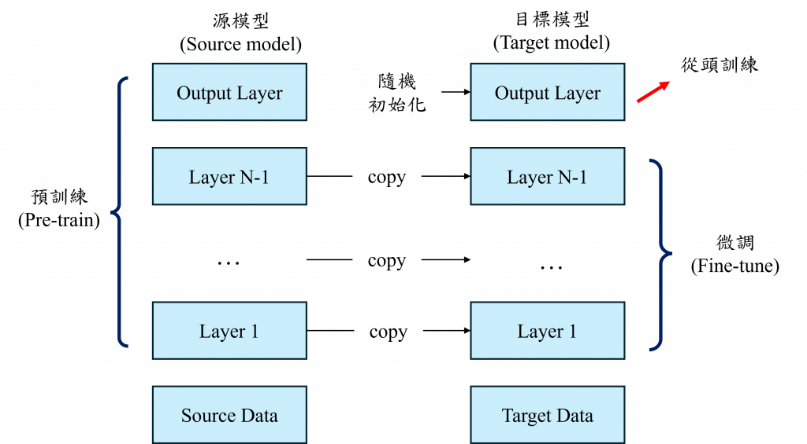

儘管預訓練模型帶來了許多便利，但其也面臨一些挑戰。**由於模型架構已經是別人設定好的，我們想要對其架構進行修改時會遇到一定的難度**。通常我們在修改模型架構時只能調整後續幾層的線性分類器，以免影響原始模型的權重。而且**模型的資料集可能不包含我們當前任務所需的資訊**。例如，該模型可能沒有訓練過文本摘要的任務，但我們卻用它來進行文本摘要，這樣會導致效果較差。因此**在使用預訓練模型前，我們需要了解其架構與相關的論文，才能更好地理解並利用它。**

而在微調上也有很多不同的應用，例如我們知道在Transformer的`Q`、`K`、`V`很重要，因此**我們可以選擇`凍結(Freeze)`這些層以外的權重，讓模型在反向傳播時不會影響到其餘層的權重，來加速模型的訓練**。或者，我們也可以選擇凍結所有線性分類器權重以外的層，讓模型只專注於能夠線性分類的結果。諸如此類的方式很多，大多數的目的就是為了減少記憶體的消耗並增加模型的效能。因此對於預訓練模型的優化與改動則非常依賴我們對於該模型架構的理解程度與經驗。~~當然就算不懂直接進行微調大多也能比自己訓練的模型還要來的好~~

總結
--

簡單來說**預訓練模型的出現讓我們能方便地使用他人已訓練好的模型來處理自己的資料**。我們不必再花時間設計模型的架構，也不需特別考慮模型的前向傳播，只需要知道如何進行訓練就好。不過其實你現在應該已經瞭解了預訓練模型是如何訓練的，**因為我在前面的章節中的程式碼，都是採用了Hugging Face公司的預訓練模型架構進行設計**，因此在後續的幾天中我們也可以使用Trainer進行訓練。而當你理解了前面20天的內容後，會發現你對這些預訓練模型的架構及設計方式已經有了更深入的了解，這樣子你就能夠更好的對其架構進行改動與優化了~

---

<a id="7467-day-23"></a>

## Day 23｜【Day 23】BERT的出現雙向Transformer模型的崛起與強大預訓練策略

- 原文：https://ithelp.ithome.com.tw/articles/10364739
- 發佈時間：2024-10-07 21:39:05

前言
--

在今天，我們要介紹一個在預訓練模型中相當經典的模型。基本上，我們可以認為這個模型就是一個Transformer模型，但它的預訓練策略非常強大，使其成為2018年最強大的模型之一，甚至到現在仍然具備強大的能力。話不多說，讓我們來看看這個模型為何如此強大吧。

BERT (Bidirectional Encoder Representations from Transformers)
--------------------------------------------------------------

`BERT(Bidirectional Encoder Representations from Transformers)`是2018年由Google提出的，其模型參數設計與原始的Transformer模型並未有太多的改動，而最大的改動是**它只保留了Transformer的Encoder部分**。這麼做的原因是如果我們訓練一個完整的Encoder-Decoder模型，其架構會變得非常複雜，而**BERT這個模型基本上就是一個專門的分類模型**，因此不需要Decoder生成的部分。

BERT與Transformer不同的關鍵特徵在於，它是一個**雙向（bidirectional）**的模型，能同時從左到右和從右到左建模文本上下文。不過，這時你可能會想，Transformer不是依靠將位置信息嵌入到Embedding層中來理解位置信息的嗎？那為什麼還會有單向與雙向之分呢？現在我們來看看BERT所進行的兩個預訓練策略吧。

BERT與Transformer不同的關鍵特徵在於，它是一個**雙向（bidirectional）**的模型，能同時從左到右和從右到左建模文本上下文。不過，這時你可能會想，Transformer不是依靠將位置信息嵌入到Embedding層中來理解位置信息的嗎？這裡的區別在於，傳統的Transformer模型通常是在在編碼和解碼過程中依次處理文本，而BERT則能同時考慮整個句子的上下文，從而在理解和生成文本時提供更豐富的語義信息。現在我們來看看BERT所進行的兩個預訓練策略吧。

### BERT的預訓練策略

這讓我想起在Transformer中使用的`src_mask`參數。這個參數作用類似於Decoder中的`tgt_mask`參數，目的是遮蔽未來的信息。因此這種設計使我們有了單向的Transformer。然而BERT的雙向模型不僅限於此，BERT的雙向特性體現在它的`MLM( Masked Language Model)`策略中。MLM，即「隱藏語言模型」策略，是**通過隱藏部分文本並讓模型從數萬個Token中找出正確的Token來實現的。**


例如: `我今天吃了[MASK]，很好吃`，BERT會隨機將「吃了」後面的詞遮蔽，並要求模型根據上下文來預測這個被遮蔽的詞是什麼。與單向模型不同，BERT不僅會考慮前文「我今天吃了」來做出預測，還能利用後文來幫助確定遮蔽的詞。這種雙向語境理解能力是BERT能更精準進行語義預測的關鍵，而能有這種交互式的運算也要歸功於Self-Attention的模型架構與其能將整段文字中的每個詞彙都相互關聯計算的能力。

> 在BERT的MLM任務中，其實並不會每次都把遮蔽的文字用[MASK]代替，偶爾會使用真實的隨機Token進行替換與猜測。這是因為在我們實際使用時，不會出現[MASK]這一標籤。為了減少上下游任務之間的差異，採用真實的隨機Token的方式，讓模型在預訓練階段就能夠熟悉沒有[MASK]的推理狀態。這麼做的目的是讓模型在實際應用時更加靈活和準確。當模型學習到即使沒有[MASK]標籤也能準確預測上下文時，它在面對各種不同類型的文本時表現會更好。因此使用隨機Token替換部分遮蔽的文字，是一種有效的訓練策略。


而BERT也有另一個訓練策略，就是`NSP(Next Sentence Prediction)`。這個策略的目的是幫助模型理解句子與句子之間的邏輯關係，這在處理例如問答系統或文本推理等任務時非常重要。這個方法是給BERT兩個句子，然後模型需要判斷第二個句子是否真的是緊接在第一個句子之後的合理連續句子。在預訓練階段，BERT會隨機選取一些句對，其中一半的句對是連續的，另一半則是沒有邏輯連貫性的，並讓模型學習判斷這兩個句子是否相關。該任務也在某些程度上強化了BERT模型對於MLM的任務能力，因為該任務更能讓模型學會這些上下文之間的關聯性。

而只使用了這兩個策略，BERT就在理解文本上下文時取得了多個資料集的`SOTA（State-of-the-Art）`成績。這兩個策略讓模型與以往的時間序列模型或使用遮罩的Transformer不同，不僅僅是從左向右或從右向左解讀文本，而是同時考慮兩個方向，讓BERT到現在還是在自然語言處理上非常熱門的模型。

### BERT的特殊Token

在前面的章節中我們在撰寫程式碼時都是使用了BERT的Tokenizer進行模型的訓練，而這時如果你有嘗試還原文字時，你會發現[CLS]、[SEP]、[PAD]，這三個標籤，以下讓我們看看這三個特殊Token的功能:

`[CLS] (Classification)`: 這個Token用於句子的開頭，通知模型這是一個新句子的開始，類似我們之前學到的`<SOS>`或`<BOS>`，而三個特殊Token它們的功能完全相同只不過在Seq2Seq會叫做`<SOS>`、Transformer會叫他`<BOS>`，BERT則叫做`[CLS]`。

然而在BERT中有一個比較特殊的部分，由於Transformer在進行Attention後，每個輸出都包含整個句子的完整訊息。因此為了避免這些輸出訊息過多，BERT在進行分類時只會使用`[CLS]`這個序列的對應輸出，將其提供給線性分類器進行分類，讓[CLS]能夠經過訓練後代表了整個句子的語意。

而`[SEP] (Separation)`通常用來分割不同的句子，尤其是 BERT 在進行問答系統、文字相似度比對、邏輯性判斷時，就會在兩句之間加入`[SEP]` Token，例如:[CLS]今天天氣如何?[SEP]很好[SEP]，像是這樣的操作，讓模型能夠更好的理解其上下文。

最後就是`[PAD] (Padding)`這一個Token其目的就是用於填充的這一點我們應該很熟悉了，不過其時BERT還有[MASK]這一個特殊Token，這一個Token只會出現在MLM任務中，因此我們在實際上訓練時並不會使用到該特殊Token。

### BERT的Embedding

BERT模型的Embedding與我們之前學習到的Embedding有所不同，它有三層Embedding層。首先，BERT會經過Token Embeddings的處理，這個過程與我們先前學習的Embedding完全相同，就是將每個Token映射到對應的詞嵌入中。由於BERT可以同時處理兩個句子的輸入，所以會使用[SEP]標記來區分句子。每個標記會被分配一個片段嵌入，用來指示它是屬於第一句（A句子）還是第二句（B句子）。這樣，我們就能將剛剛完成映射的詞嵌入分別添加到相應的Segment Embedding中。


另外由於Transformer模型本身不具備位置信息，BERT採用了Position Embeddings，而不是Transformer中的絕對Positional Encoding。這使得每個Token能夠學習到對應的相對位置。最終，這三個Embedding會被相加，形成最終的詞嵌入表示。這些詞嵌入會被傳遞到Transformer中的多層編碼器，進行進一步的語義表示學習。

總結
--

在這次介紹中，我們講到了BERT模型的強大預訓練策略，以及其中的創新，包括MLM（遮蔽語言模型）和NSP（下一句預測）這兩個策略。這兩個策略看似簡單，但實際上效果非常強大，能夠使BERT的雙向性在同時考慮文本的上下文方面超越了單向模型的限制。此外BERT還使用了特殊的[CLS]、[SEP]等Token及三層嵌入的設計，進一步提升了語言理解和位置資訊捕捉的能力。當然除了上述這些特點，BERT還依托於龐大的資料集，才得以在2018年成為最強的模型之一。而在本次內容中可以發現我們並沒有數學式，因為在BERT中其實也沒什麼特別的數學是好說，這一現象其實也出現在後續的預訓練模型中，因為其概念本質上就是一個Transformer。

---

<a id="7467-day-24"></a>

## Day 24｜【Day 24】用BERT再次進行IMDB情緒分析

- 原文：https://ithelp.ithome.com.tw/articles/10365403
- 發佈時間：2024-10-08 23:24:52

前言
--

這次我們為了體驗BERT與我們最初學習的LSTM究竟有多少不同，今天依然使用IMDB這個資料集進行處理。而在本章節中，我們主要是讓你熟悉Hugging Face這家公司的預訓練模型的格式與使用方法。因此，程序碼介紹時，我會向你展示如何將之前的Trainer與Hugging Face的預訓練模型結合使用。在本章節中，程式碼應該是目前為止最簡單的，因為我們不需要自行處理模型，而是直接進行以下四個步驟：

1.   資料前處理（使用Collate_fn完成）
2.   導入模型與相關分類器（從Hugging Face導入）
3.   使用Trainer訓練模型
4.   評估與驗證

話不多說，讓我們開始今天的內容吧。

用預訓練模型進行情緒分析
------------

在本次的內容中，我們會採用與[Day 14](https://ithelp.ithome.com.tw/articles/10360065)相似的程式碼。然而這次我們會特別針對BERT模型及先前未補充的知識，在撰寫程式碼的同時進行補充。現在我們來看到以下步驟。

### 【STEP 1】讀取IMDB CSV文件

在今天我們將直接採用在[Day 14](https://ithelp.ithome.com.tw/articles/10360065)時建立的CSV文件開始。在BERT模型中，其實有許多不同的版本，例如我們之前一直使用的`bert-base-uncased`就是原始BERT的base版本。由於該模型能接受的Token數量最多為512個，因此在使用`tokenizer`時，我們必須將`max_length`設定為512，否則程式會出錯。當然我們還有`bert-large-uncased`版本，它可以支援最多1024個Token，同時該版本的模型參數量也更加龐大。

> 模型後面的`uncased`代表著其Tokenizer與模型不會區分大小寫；若標示為`cased`則會區分大小寫。

```lua
import pandas as pd
from transformers import AutoTokenizer

df = pd.read_csv('imdb_data.csv')
reviews = df['review'].values
sentiments = df['sentiment'].values
labels = (sentiments == 'positive').astype('int')

tokenizer = AutoTokenizer.from_pretrained("bert-base-uncased")
input_datas = tokenizer(reviews[:2].tolist(), max_length=10, truncation=True, padding="longest", return_tensors='pt')

print('Tokenizer輸出:')
print(input_datas)
# ----- 輸出 -----
Tokenizer輸出:
{'input_ids': tensor([[  101, 22953,  2213,  4381,  2152,  2003,  1037,  9476,  4038,   102],
        [  101, 11573,  2791,  1006,  2030,  2160, 24913,  2004,  2577,   102]]), 'token_type_ids': tensor([[0, 0, 0, 0, 0, 0, 0, 0, 0, 0],
        [0, 0, 0, 0, 0, 0, 0, 0, 0, 0]]), 'attention_mask': tensor([[1, 1, 1, 1, 1, 1, 1, 1, 1, 1],
        [1, 1, 1, 1, 1, 1, 1, 1, 1, 1]])}
```

上次我們沒有討論到 `token_type_ids` 這個特殊的輸入。這一點對應了BERT的Segment Embedding層。当Token為0時代表第一句，為1時則代表第二句。在BERT的Tokenizer中，這個功能已經被預先定義。如果我們想要輸入兩句話，可以這樣寫： `tokenizer('句子A', '句子B')`。這樣，模型在處理資料時就會將其轉換成 `[CLS] 句子A [SEP] 句子B [SEP]` 的形式，同時附上對應的 `token_type_ids`。

> 注意這次我們會將資料轉換成 `int` 格式。這個問題其實由來已久詳細狀況可以參考[這篇文章](https://discuss.huggingface.co/t/valueerror-target-size-torch-size-8-must-be-the-same-as-input-size-torch-size-8-8/12133)。

### 【STEP 2】建立Pytorch DataLoader

在這一步中，我們之前所建立的模型格式是根據 Hugging Face 的規定進行的。在這些模型中，參數定義包括由對應的 Tokenizer 產生的 `input_ids`、`token_type_ids` 和 `attention_mask`，並將其分別傳遞給模型。不過，其中只有 `input_ids` 是必須輸入的參數，其餘參數我們其實可以選擇不傳遞，但這可能會導致 Padding 等 Token 與句子訊息遺漏。儘管如此模型仍然可以進行訓練。

```python
from torch.utils.data import Dataset, DataLoader
from sklearn.model_selection import train_test_split
import torch

class IMDB(Dataset):
    def __init__(self, x, y, tokenizer):
        self.x = x
        self.y = y
        self.tokenizer = tokenizer

    def __getitem__(self, index):
        return self.x[index], self.y[index]
       
    def __len__(self):
        return len(self.x)
    
    def collate_fn(self, batch):
        batch_x, batch_y = zip(*batch)
        input_ids = self.tokenizer(batch_x, max_length=512, truncation=True, padding="longest", return_tensors='pt').input_ids
        labels = torch.LongTensor(batch_y)
        return {'input_ids': input_ids, 'labels': labels}

x_train, x_valid, y_train, y_valid = train_test_split(reviews, labels, train_size=0.8, random_state=46, shuffle=True)
trainset = IMDB(x_train, y_train, tokenizer)
validset = IMDB(x_valid, y_valid, tokenizer)

train_loader = DataLoader(trainset, batch_size=8, shuffle=True, collate_fn=trainset.collate_fn)
valid_loader = DataLoader(validset, batch_size=8, shuffle=True, collate_fn=validset.collate_fn)
```

這裡我們將 `max_length` 設定為 512，同時定義 `labels`。雖然 `labels` 參數不是每次都需要傳入，但在訓練模型時則必須傳遞。這樣模型會自動使用 `NULLoss` 計算損失值。如果我們想更換損失函數，只需在訓練時將模型的 `Logit`（我們之前定義的 `output[1]`）與實際標籤進行損失值計算後在反向傳播即可。

> 由於這次的模型參數量較大`batch_size`可以設置的小一些，以免產生`OOM(Out-Of-Memory)`的問題。

### 【STEP 3】下載並使用模型

在BERT中，由於其線性分類器的設計需要根據任務進行調整，例如在進行QA任務時，我們需要從文本中找到答案，因此須建立兩個線性分類器，一個用於找尋答案的開頭位置，另一個則是結尾。而這次我們則需要使用文本分類的線性分類器。最麻煩的作法是先繼承BERT的基礎模型，然後手動建立一個線性分類器，並取得其[CLS]標籤的輸出進行訓練。這種方式能對模型做出更高自由度的改動，但其實我們不需要這樣做。在Hugging Face中，已經幫我們定義好了這些類別。比如說，這次的線性分類器，我們可以調用`BertForSequenceClassification`來進行文本分類。

```javascript
from transformers import BertForSequenceClassification
import torch.optim as optim
model = BertForSequenceClassification.from_pretrained("bert-base-uncased", num_labels=2)
optimizer = optim.AdamW(model.parameters(), lr=1e-4)
```

在這裡需要注意的是 `num_labels` 的設計。該值的預設值是2，如果我們有更多的選項，記得要進行修改，否則就會導致模型訓練錯誤。

### 【STEP 4】訓練模型

在這裡我們同樣的使用Trainer進行訓練，而在這裡我們要注意一點若我們的Labels不是整數時，其計算的損失函數會有所變動，因此若發生`ValueError: Target size (torch.Size([8])) must be the same as input size (torch.Size([8, 2]))`這一類的錯誤時，請檢查在DataLoader時是否設定成`LongTensor`，以及原始的資料是否為**整數狀態**。

```yaml
from Trainer import Trainer
trainer = Trainer(
    epochs=10, 
    train_loader=train_loader, 
    valid_loader=valid_loader, 
    model=model, 
    optimizer=[optimizer],
    early_stopping=3
)
trainer.train()
# ----- 輸出 ------
Train Epoch 4: 100%|██████████| 1123/1123 [23:33<00:00,  1.26s/it, loss=0.004]
Valid Epoch 4: 100%|██████████| 281/281 [02:59<00:00,  1.56it/s, loss=0.003]
```


而我們可以從結果看出，模型在第一個週期就已經完成了訓練，後續反而會導致 Loss 升高現象。**這是因為我們的模型在預訓練階段已經被有效訓練過了，因此通常線性分類器的調整也會在此期間完成**。這正是為何在實際訓練 AI 模型時，會採用預訓練模型的原因。我們可以看到其損失值非常低，僅需短短的時間便可完成整個模型的訓練。

總結
--

這次我們介紹了如何使用 Hugging Face 的預訓練模型來進行情緒分析，並與先前的 LSTM 模型做比較，檢視其損失值的結果。在這篇文章中，我們將看到只需簡單的四個步驟就能完成整個程式的訓練，不僅程式碼量大幅減少，效能上也有顯著提升。不過，由於這次任務較為簡單，且使用的是 Encoder 架構，因此變化不大（Encoder 架構通常較重視資料前處理，以符合模型的預期輸入）。明天，我會告訴你如何在只有 Decoder 架構的模型上進行操作，以及有哪些技術可以應用於這類模型。

---

<a id="7467-day-25"></a>

## Day 25｜【Day 25】Decoder Transformer的模型演進 - 從GPT-1到GPT-3的技術突破介紹

- 原文：https://ithelp.ithome.com.tw/articles/10365402
- 發佈時間：2024-10-09 21:42:08

前言
--

如果說BERT是Transformer的Encoder代表，那麼今天提到的GPT系列模型可以說是Decoder的代表。這些模型的架構與技術原理奠定了當今許多熱門的大型語言模型的基礎，後續的許多改進與技術都是從今天的內容中衍生而成的。講到這些與ChatGPT相關的技術，也意味著我們進入了學習的最終階段。今天我們就先來看看最早的GPT模型GPT-1，以及它的每一代模型究竟是怎麼練成的吧。

GPT-1
-----

GPT-1 是由 OpenAI 於 2018 年推出的基於 Decoder 的語言模型，其發表時間比 BERT 稍早，是 GPT 系列的第一個版本。**其訓練方式採用了基於無監督學習的自回歸方法**，擺脫了傳統 NLP 模型依賴大量標註數據進行監督學習的限制。在訓練過程中，GPT-1 通過之前的輸出來預測下一個詞。具體來說，給定一個詞序列 `x(1)、x(2)、x(3)...x(t-1)`，模型的目標是預測下一個詞 `x(t)`，即最大化條件概率 `P(x(t) | x(1)、x(2)、x(3)...x(t-1))`。該模型透過維基百科和書籍等開放數據源的未標註文本數據進行訓練，這使 GPT 系列的模型能夠通過當前的文字序列來找出下一個最有可能出現的文字，以生成多領域的內容，而無需像 BERT 那樣必須經過微調才能使用。

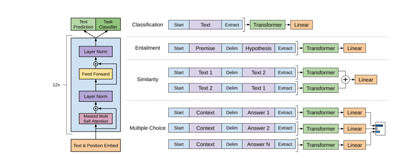

如同BERT的論文所述，儘管GPT-1具備一定的通用性，**但由於它僅使用Transformer的解碼器部分，因此在語義理解方面相對較弱**，特別是在處理複雜語義關係時顯得不足。同時**自回歸方式需要依賴之前的所有輸入來預測下一個詞，在長文本生成中容易導致信息丟失和誤差累積，並且是一種單向的語言模型**。雖然GPT-1的開發目的是成為一個通用模型，但最終還是需要經過微調才能在九項NLP資料集中取得SOTA表現，而未經微調的情況下，其泛化能力仍有所不足。

GPT-2
-----

而在 2019 年OpenAI 推出了 GPT-2。相較於 GPT-1，GPT-2 的模型參數和訓練數據量均大幅增加。**GPT-2 的訓練數據量是 GPT-1 的八倍，而參數量則增加了四十倍。**這使得 GPT-2 在更多元化的任務上表現出色。GPT-2 的規模效應顯而易見，參數量的巨幅提升讓模型能夠捕捉到更豐富的語言結構和語義信息，**甚至在未經過微調的狀態下，就在七項 NLP 資料集上達到了 SOTA 水準。**

**然而在某些任務中進行微調後，GPT-2 的性能反而有所下降，這可能是由於微調數據的特異性導致模型過度擬合，從而損失了通用性。**這一點強調了預訓練和微調之間需要取得平衡，以在提升特定任務性能的同時保持模型的泛化能力。GPT-2 的推出也引發了關於 AI 生成文本潛在濫用的關注，例如生成假新聞和垃圾信息。出於這些擔憂，OpenAI 最初選擇不公開 GPT-2 的完整模型，這促使研究界更重視 AI 的安全和倫理問題。

而在GPT-2的架構與模型中並未有太大的創新，但在這次的模型訓練中，我們得知了兩件事情。第一件事是當模型的**參數量與訓練資料量越大時，模型將會有更強大的能力**，甚至可以在不進行微調的情況下取得優異的成績。第二件事是當**模型參數量增加時，微調的效果反而可能變差**，這讓我們需要找尋一些新的微調策略或是方法。

GPT-3
-----

而 GPT-3 的出現標誌著模型規模的又一次飛躍，其參數量達到 1750 億，相較於 GPT-2 的 15 億提升了數個量級。如此龐大的模型需要處理海量數據，OpenAI 使用了約 45TB 的社群網路數據來訓練 GPT-3。而在 GPT-3 的訓練中，採用了`元學習（meta-learning）`的策略，元學習的概念就是將無標註的訓練結果當成一個新的結果已讓模型學習，~~而在GPT-3使用了`MAML（Model-Agnostic Meta-Learning）`這一元學習技術。~~ (這邊原文理解錯誤，GPT-3使用ICL的方式達成內循環，感謝[hlb](https://ithelp.ithome.com.tw/users/20164115/profile)的勘誤)

**MAML的主要概念是希望模型具備「學習如何學習」的能力，能夠快速適應在新任務上**。具體而言MAML 的目標是訓練一個模型，使其能夠在接收到新任務時，僅通過幾次梯度下降就能取得良好的表現。

### MAML的核心步驟

MAML 是一種元學習演算法，其訓練過程包含兩個主要部分：`內部循環更新（Inner Loop Update`和`外部循環更新（Outer Loop Update）`。首先MAML 從訓練數據集中隨機抽取一批任務，這些任務具有不同的數據分佈，可能涉及完全不同的問題類型，例如物體分類、數學題解、程式執行等。每個任務被分為`支持集（Support Set）`和`測試集（Query Set）`。


在**內部循環更新**中，模型基於當前參數，使用支持集進行多次梯度下降更新，目的是讓模型學習如何解決當前任務。這個過程可以採用各種適合的優化算法，如隨機梯度下降（**SGD**）或 Adam。這其實類似於我們在傳統訓練過程中對模型進行優化的動作，但在這裡，模型會針對不同的任務分別學習對應的數據集。每當訓練一組數據集時，模型會產生各自的權重與參數。

接下來，這些權重與參數會被用於**外部循環更新**。在這一步，模型**利用每個任務測試集計算內部更新後的損失，然後根據這些損失來更新模型的原始參數。**外部更新的目標是找到一組`初始參數（Initial Parameters）`，使模型能夠在面對新任務時，通過少量的梯度更新快速適應並獲得良好的結果。

而在大量的資料與學習下 MAML 這一方法不僅學習如何解決具體任務，還通過了初始參數讓模型學習如何快速適應新任務，這賦予了它`模型無關（Model-Agnostic）`的特性。這意味著該方法可以應用於不同類型的任務。透過這種方法，模型能夠學習到`更通用的特徵（Generalizable Features）`，使其在少量數據和有限次數的更新下，仍能取得卓越的表現。

### Few-shot 與 Zero-shot Learning

GPT-3 的論文則是基於類似 MAML 的特性，提出了 `Few-shot` 和 `Zero-shot` 的概念，進一步擴展了模型的學習能力。`Zero-shot` 是指模型在未見過特定類別的訓練樣本的情況下，仍能對該類別進行準確預測；而 `Few-shot` 則是模型在僅有少量訓練樣本的情況下，能適應上下文並推理出正確答案。**這兩種學習方式使 GPT-3 能夠通過上下文推理和學習，而無需對模型參數進行顯式調整，這種能力也被稱為 `In-Context Learning`。**


### Prompting Learning

另一個關鍵概念是`Prompting Learning`，這項技術對於 GPT-3 性能的提升起到了重要作用。**`Prompting` 是在模型的輸入中提供明確的上下文提示，以引導模型生成預期的回答**。例如，在執行翻譯任務時，提供「請將中文翻譯為英文」這樣的提示，能幫助模型正確理解當前的任務是翻譯，從而生成更準確的結果，而這些技術也是當前大型語言模型中不可或缺的一環。

總結
--

在今天的內容中，突然出現了一堆名詞，所以我在文章的最後做一些統整。首先，`In-Context Learning`是一個很廣泛的概念，基本上任何我們輸入一段文字以幫助模型推理的方式都可以叫做`In-Context Learning`。因此，`Prompting Learning`和`Few-shot`也能算是`In-Context Learning`的一環，但兩者之間又有差別。

`Prompting Learning`是指通過一個提示詞讓模型知道需要進行的任務，而`Few-shot`通常指的是我們的資料集內容。模型會通過`Few-shot`的內容作為上下文，以推理出我們想要的目標答案。以ChatGPT的使用範例來說，我們問GPT問題就是屬於`Prompting Learning`，而這時如果有一些歷屆答案我們把它有一同給予GPT那就是`Few-shot`。

不知道這樣子有沒有更了解這些名詞了呢?

*   [留言 1](http://ithelp.ithome.com.tw/articles/10365402#reply)
*   [追蹤](https://ithelp.ithome.com.tw/users/login)
*   [檢舉](https://ithelp.ithome.com.tw/users/login)

[上一篇 【Day 24】用BERT再次進行IMDB情緒分析](https://ithelp.ithome.com.tw/articles/10365403)

[下一篇 【Day 26】用GPT-2解squad_v2問答資料集 - Prompting Learning與遮蔽策略的調整](https://ithelp.ithome.com.tw/articles/10366209)

---

<a id="7467-day-26"></a>

## Day 26｜【Day 26】用GPT-2解squad_v2問答資料集 - Prompting Learning與遮蔽策略的調整

- 原文：https://ithelp.ithome.com.tw/articles/10366209

前言
--

在今天的教學中，我會介紹如何訓練一個只有Decoder部分的模型。我們選用GPT系列中的GPT-2進行訓練，並使用squad_v2這個資料集進行語意理解和問題回答的測試。這個資料集專門用來測試模型在語意理解與問題回答上的能力，答案通常會在文章的某處。但是由於該資料集是以Json格式處理，整理起來可能會有一些難度。詳細的整理方式可以參考我去年的文章：[【Day 23】因為站在巨人的肩膀上才能眺望更遠的風景(下)-使用SQuAD做QA問答](https://ithelp.ithome.com.tw/articles/10336290)。或是可以直接從我的[GitHub](https://github.com/AUSTIN2526/learn-NLP-in-30-days-book-version/tree/main/Ch.07%20%E7%AB%99%E5%9C%A8%E5%B7%A8%E4%BA%BA%E8%82%A9%E8%86%80%E4%B8%8A%E7%9A%84%E9%A0%90%E8%A8%93%E7%B7%B4%E6%A8%A1%E5%9E%8BBERT)上取得對應的文件。

### 【STEP 1】讀取資料集

首先我們先讀取`squad_v2`資料集的`context`, `question`, `answer`，這三個欄位，`context`代表的是文章本身，`question`是對應的文章問題`answer`則是對應的答案，一個`context`會有數個`question`與`answer`。

```
import pandas as pd
from sklearn.model_selection import train_test_split
from transformers import AutoTokenizer

tokenizer = AutoTokenizer.from_pretrained("openai-community/gpt2")
# 由於GPT-2沒有PAD token所以使用EOS Token
tokenizer.pad_token_id = tokenizer.eos_token_id 

# 讀取CSV檔案並只選取指定的3個欄位
df = pd.read_csv('squad2.0_converted.csv', usecols=['context', 'question', 'answer'])
df = df.fillna('nan')
```

不過由於在squad_v2的資料集上，會有沒有解答的問題，而我在資料集的處理上將他設定為`nan`而這將會讓模型的運算出現錯誤，因此我使用了`df.fillna('nan')`將`nan`轉換成字串版本的`'nan'`，以讓模型可以正常生成文字，

### 【STEP 2】加入Prompt

接下來我們需要把這些文字組合再一起並加入Prompt讓模型能夠更理解每一個斷若的用處，而在這裡的方式很簡單，我們通過加入`###`與`\n`讓模型能夠去分割與判別出模型的涵義，不過注意一點，我們要手動的在Ans之後加入EOS token不然模型將會無法學習到結尾的地方。

```
# 加入Prompt
df['context'] = '### Context:\n' + df['context']
df['question'] = '\n### Question:\n' + df['question']

# 在答案後方加入EOS token表示文本結尾
df['answer'] = '\n### Answer:\n' + df['answer'] + tokenizer.eos_token
```

而我們也可以通過以下程式碼觀看讀取後的資料結果。

```
train_df, valid_df = train_test_split(df, train_size=0.8, random_state=46, shuffle=True)
print(train_df['context'][0], end='')
print(train_df['question'][0], end='')
print(train_df['answer'][0])
# ----- 輸出 -----
### Context:
Beyoncé Giselle Knowles-Carter (/biːˈjɒnseɪ/ bee-YON-say) (born September 4, 1981) is an American singer, songwriter, record producer and actress. Born and raised in Houston, Texas, she performed in various singing and dancing competitions as a child, and rose to fame in the late 1990s as lead singer of R&B girl-group Destiny's Child. Managed by her father, Mathew Knowles, the group became one of the world's best-selling girl groups of all time. Their hiatus saw the release of Beyoncé's debut album, Dangerously in Love (2003), which established her as a solo artist worldwide, earned five Grammy Awards and featured the Billboard Hot 100 number-one singles "Crazy in Love" and "Baby Boy".
### Question:
When did Beyonce start becoming popular?
### Answer:
in the late 1990s<|endoftext|>
```

### 【STEP 3】建立Pytorch Dataloader

這次的 `collate_fn` 難度有點高，原因在於進行文字生成時，我們需要讓 `x(1)、x(2)、x(3)...x(t)` 去預測 `x(t+1)`。實際的操作是將 `input_ids` 與 `labels` 錯開，以使模型學習這個特徵（這部分模型內部已經幫我們完成，所以不必處理）。不過，我們可以採用更好的遮蔽策略，例如在輸入完成的 input_ids 序列時，我們只需特別計算答案位置的損失，而不是已知輸入（`context` 與 `question`）。這樣模型能夠更加關注答案的結果。

不過，`input_ids` 可以通過 Attention Mask 來進行遮蔽，但 Labels 卻沒有相對應的方法。因此，我們必須手動將 `[PAD]` 和在 answer 序列之前的 `input_ids` 通通轉換成 `-100`。這是因為 Pytorch 的損失函數預設會忽略索引值為 `-100` 的項目，這樣模型就不會將其計算在損失中。

```
import torch
from torch.utils.data import Dataset, DataLoader

class SquadDataset(Dataset):
    def __init__(self, dataframe, tokenizer):
        self.dataframe = dataframe
        self.tokenizer = tokenizer

    def __getitem__(self, index):
        item = self.dataframe.iloc[index]
        return item['context'], item['question'], item['answer']
       
    def __len__(self):
        return len(self.dataframe)
    
    # 將文本進行分詞
    def tokenize_data(self, texts, max_length=512):
        tokenized_inputs = self.tokenizer(
            list(texts),
            truncation=True,
            padding='longest',
            max_length=max_length,
            return_tensors='pt',
        )
        
        return tokenized_inputs.input_ids, tokenized_inputs.attention_mask

    # 定義數據加載過程中的數據整理方法
    def collate_fn(self, batch):
        contexts, questions, answers = zip(*batch)
        
        # 輸入和答案
        question_ids, question_attention_mask = self.tokenize_data(questions)
        answer_ids, answer_attention_mask = self.tokenize_data(answers)
        context_ids, context_attention_mask = self.tokenize_data(contexts, max_length=1024-answer_ids.shape[1]-question_ids.shape[1])
       

        # 模型的輸入 = context_ids + question_ids + answer_ids
        combined_input_ids = torch.cat((context_ids, question_ids, answer_ids), dim=-1)
        # 模型的MASK = context_attention_mask + question_attention_mask + answer_attention_mask
        combined_attention_mask = torch.cat((context_attention_mask, question_attention_mask, answer_attention_mask), dim=-1)

        # 模型的標籤 = context_ids * [-100] + question_ids * [-100] + answer_ids + [EOS] 
        context_ignore_mask = torch.full((context_ids.shape[0], context_ids.shape[-1]), -100) # 產生context_ids * [-100]
        question_ignore_mask = torch.full((question_ids.shape[0], question_ids.shape[-1]), -100) # 產生question_ids * [-100]
        answer_ignore_indices = (answer_attention_mask == 0) # 找出Answer的[PAD] idx
        answer_ids[answer_ignore_indices] = -100 # 將Answer為[PAD]的部分轉換成-100
        combined_answers = torch.cat((context_ignore_mask, question_ignore_mask, answer_ids), dim=-1) #context_ignore_mask + question_ignore_mask + answer_ids

        return {
            'input_ids': combined_input_ids,
            'attention_mask': combined_attention_mask,
            'labels': combined_answers,
        }
```

不過我們還要注意一點，由於GPT-2的輸入限制為1024個Token，因此我在這裡所使用的策略是減少context的Token數量。這是因為context通常包含多個部分，所以模型其實不需要多次學習這些相關的知識。因此，我們只需要專注於學習question與answer兩個部分即可。

```
# 建立資料集
trainset = SquadDataset(train_df, tokenizer)
validset = SquadDataset(valid_df, tokenizer)

# 創建 DataLoader
train_loader = DataLoader(trainset, batch_size=4, shuffle=True, collate_fn=trainset.collate_fn)
valid_loader = DataLoader(validset, batch_size=4, shuffle=True, collate_fn=validset.collate_fn)
```

而在最後的流程則與先前相同，不過要特別注意這次模型很大，因此`batch_size`需要設置的更小，以免發生OOM。

### 【STEP 4】建立模型與優化器

同樣的我們這次採用Warmup和餘弦退火進行排程優化。但要注意一點，在參數量較大的模型上，我們應該使用較小的學習率進行調整，否則很可能會出現調整錯誤，導致模型梯度爆炸。因此本次的學習率將採用5e-5，這也是大多數人在調整大型語言模型時會選擇的學習率。

```
import torch.optim as optim
from transformers import get_cosine_with_hard_restarts_schedule_with_warmup
from transformers import AutoModelForCausalLM

# 訓練設置
model = AutoModelForCausalLM.from_pretrained("openai-community/gpt2")

optimizer = optim.AdamW(model.parameters(), lr=5e-5)
scheduler = get_cosine_with_hard_restarts_schedule_with_warmup(
        optimizer, 
        num_warmup_steps=len(train_loader) * 0.2, 
        num_training_steps=len(train_loader) * 10, 
        num_cycles=1, 
)
```

### 【STEP 5】進行訓練並驗證生成結果

我們同樣使用Trainer進行訓練，最終損失值來到了0.47061。雖然這個結果不太理想，但對於GPT-2這一模型來說已是相當不錯，因為它需要進行推理以找出最合適的Token，而不是像BERT只需進行分類便能找出答案，因此這部分的難度更高。

```
from trainer import Trainer
trainer = Trainer(
    epochs=10, 
    train_loader=train_loader, 
    valid_loader=valid_loader,
    model=model, 
    optimizer=[optimizer],
    scheduler=[scheduler],
    early_stopping=3,
    device=device
)
trainer.train()
# ----- 輸出 -----
Train Epoch 5: 100%|██████████| 26021/26021 [27:23<00:00, 15.83it/s, loss=0.090]
Valid Epoch 5: 100%|██████████| 6506/6506 [02:28<00:00, 43.72it/s, loss=0.584]
Train Loss: 0.13366| Valid Loss: 0.48269| Best Loss: 0.47061
```


而我們也可以撰寫一個`inference`函數，讓模型能夠調用 `model.generate` 進行生成，同時擷取出答案，完成最終的生成動作。

```
def inference(model, tokenizer, context, question, device):
    # 準備輸入數據
    inference_data = f"{context}{question}\n### Answer:\n"
    # 進行編碼和截斷
    try:
        inputs = tokenizer(inference_data, max_length=1024, truncation=True, return_tensors='pt').to(device)
        # 禁用梯度計算，進行生成
        with torch.no_grad():
            outputs = model.generate(**inputs, max_new_tokens=1024, do_sample=False)
        
        # 解碼並提取答案部分
        generated_text = tokenizer.decode(outputs[0], skip_special_tokens=True)
        answer = generated_text.split('\n### Answer:\n')[1].strip()
        
        return answer
    except:
        return 'Error'

# 載入模型和設定評估模式
model.load_state_dict(torch.load('model.ckpt'))
model.eval()

# 指定要進行推理的索引
idx = 7

# 準備推理資料
context = valid_df['context'].values[idx]
question = valid_df['question'].values[idx]
answer = valid_df['answer'].values[idx]

# 進行推理
model.generation_config.pad_token_id = tokenizer.eos_token_id
model_answer = inference(model, tokenizer, context, question, device)

# 輸出原始上下文、問題、真實答案和模型生成的答案
print(f"{context}")
print(f"{question}")
print(f"{answer.split(tokenizer.eos_token)[0]}")
print("\n### Model Answer:\n" + model_answer)
# ----- 輸出 -----
### Context:
At her Silver Jubilee in 1977, the crowds and celebrations were genuinely enthusiastic, but in the 1980s, public criticism of the royal family increased, as the personal and working lives of Elizabeth's children came under media scrutiny. Elizabeth's popularity sank to a low point in the 1990s. Under pressure from public opinion, she began to pay income tax for the first time, and Buckingham Palace was opened to the public. Discontent with the monarchy reached its peak on the death of Diana, Princess of Wales, though Elizabeth's personal popularity and support for the monarchy rebounded after her live television broadcast to the world five days after Diana's death.

### Question:
What did Elizabeth start paying in the 1990 s?

### Answer:
income tax

### Model Answer:
income tax
```

而我們最終也能從程式中看到`### Model Answer:`這一行的答案，該答案就是模型經過推理後取得的結果。當然，不是每次的生成結果都是正確的，但經過我們使用遮蔽策略與Prompt的方式，可以最大程度地引導出模型的推理能力。由於GPT-2的參數量較小，我們無法見到最佳的成效，但這樣的策略仍能有效防止文字生成無限延續，並提升答案的推理能力。

總結
--

在這次的內容中，我們可以很明顯地看到，GPT-2 的效果不如 BERT 那樣通用和出色。這也對應了我們昨天所討論到的問題：微調後的模型不一定會產生更好的能力。因此GPT-2 在 2019 年的生成能力已經是最佳成果之一。雖然文字生成在過去不被看好，但當時也是不可或缺的技術之一。而這次我所使用的遮蔽策略和方法，是我在參加 AI CUP 時所採用的技巧之一。

---

<a id="7467-day-27"></a>

## Day 27｜【Day 27】大型語言模型的常用技巧Instruction Learning 與 COT Few-Shot 技術解析

- 原文：https://ithelp.ithome.com.tw/articles/10366494
- 發佈時間：2024-10-11 22:25:51

前言
--

在大型語言模型的領域，除了GPT-3中提到的`Prompting`與`Few-shot`等技術之外，還有許多衍生的應用。第一個應用是由於GPT-3生成的文字存在高度危險性(可能生成一些過激言論、腥羶色文字等)，OpenAI開發了`InstructGPT`模型，這一技術引入了新的學習方式`Instruction learning`，使得語言模型更具回應能力，更好地理解使用者的需求，並更能符合特定生成規則。該模型在處理複雜指令和生成高品質回應方面，展示了相較於 GPT-3的**Prompt learning**的強大效能與其安全性。

而另一項技術是基於`few-shot`學習衍生出的`COT (Chain-of-Thought) few-shot`技術則是進一步提升模型能力的關鍵技術，它主要透過更詳細的推理規則來增強模型的效能，接下來我將詳細介紹這兩者之間的差異以及它們在現代語言模型中的應用。

### **Instruction Learning**

`Instruction learning` 的核心在於在輸入中提供清晰的指令，這樣模型能夠理解具體任務要求。這與 Prompt learning 的不同點在於，`Prompt learning` 只依賴提示來引導模型，而 `Instruction learning` 則是明確告訴模型應該做什麼。例如：

*   `Prompt learning` 只會告訴你任務目標：

```makefile
context: 蘋果是什麼？
question: 這是一個水果嗎？
```
*   `Instruction learning` 中，則會明確告訴模型如何回答：

```makefile
Instruction: 根據背景信息回答問題，不要使用任何冒犯性語言。
context: 蘋果是什麼？
question: 這是一個水果嗎？
```

`Instruction learning` 的好處在於它讓模型更精確地執行任務，避免生成錯誤或不當的回應，這在涉及隱私或敏感問題時尤為重要。這種方法能明確地告訴模型哪些內容應該生成，哪些內容應避免。而 `Prompting learning` 則是增加模型的推理能力。兩者的區分在於，**只要明確告訴模型生成目標**，就能歸類為 `Instruction learning`；**而讓模型通過上下文或方向生成更佳結果的則屬於**`Prompting learning`。

> 這裡我就想要吐槽一下，兩者其實很相近，唯一的差別就在於指令是否夠明確。但這一點又很主觀，所以在閱讀論文時，很多人也會把`Instruction`直接叫做`Prompting`，因為`Instruction`其實是`Prompting`中的一個更細小的分支(類似於機器學習與深度學習這樣的關係)。

### **COT (Chain-of-Thought Few-Shot Learning)**

**Chain-of-Thought (COT)** 是一種進一步提升模型推理能力的方法，特別是在`多步推理（multi-step reasoning）任務中`，**該方式與常規生成方式不同 `COT` 提倡通過逐步展示解題過程來引導模型推理和思考**，這種方式可以幫助模型更清楚地理解任務要求並且提供更有邏輯性的回應，讓我們看到以下兩個案例

*   在傳統的`Zero-shot`方法中，模型通常是直接生成答案，沒有中間的推理過程：

```makefile
context: 如果今天是星期三，兩天後是星期幾？
answer: 星期五。
```
*   而在 COT 中，我們會加入推理過程的想法，讓模型模型能夠逐步推理，展開中間步驟：

```makefile
context: 如果今天是星期三，兩天後是星期幾？
推理過程: 今天是星期三，明天是星期四，後天是星期五。
answer: 星期五。
```

而這種 `COT` 可以有多個步驟與方式，因此也被稱為 `COT few-shot`。這種方法可以幫助模型將推理步驟顯示出來，以避免跳過關鍵邏輯步驟或產生錯誤的回應。這對於解決數學推理、語言邏輯分析等複雜問題非常有用。

> 不過要注意一點，該方式的應用不能作用於參數量較小的模型爭，這是因為參數量較小的模型通常在邏輯推理能力上不佳，這時我們又將一堆更複雜的指令給予到這些模型中只會讓他更加的混亂，該技術的主要原理就是模型本身知道這些知識，但是卻可能忽略掉一些細節，因此我們需要給他詳細的步驟將其引導生成的方向。

### Instruction learning 與 COT 的結合

在大多數情境中我們可以將這些技術結合使用，例如通過在指示中明確告訴模型採用COT的方式進行操作，我們能夠進一步提高模型在生成的邏輯性。

```makefile
Instruction: 請按照步驟來進行推理，並回答問題。
context: 今天是星期三，兩天後是星期幾？
推理過程: 今天是星期三，明天是星期四，後天是星期五。
answer: 星期五。
```

這種技術結合使模型能夠更準確地解決具難度的問題，而這一方式也應用於OpenAI近期發表的`O1`模型上。該模型的基本原理是先透過一個模型生成對應的COT，然後讓模型根據這個COT去解決對應的任務。然而，`O1`的模型參數量可能較小，根據生成速度推測，整體回覆能力尚未達到GPT-4的水準，但在處理困難任務上仍有不錯的表現，最後讓我們看看這些技術的差異性吧。

| **技術** | **核心思想** | **應用情境** | **優勢** |
| --- | --- | --- | --- |
| Prompt learning | 透過提示引導模型生成回應 | 基本的問答、文本生成等 | 簡單有效，適合單步推理任務。 |
| Instruction learning | 提供明確的指導，使模型理解如何執行任務 | 適合複雜的指令執行和任務，特別是需要明確的回應時 | 可以避免不當內容，生成內容品質更高。 |
| COT (Chain-of-Thought) | 強調逐步推理，展示中間推理過程 | 複雜的邏輯推理、多步數學計算、語言推理等 | 提供邏輯清晰的回應，減少錯誤的推理步驟。 |

### **總結**

今天的內容主要是一系列名詞的介紹，其實我們可以大致將這些方式進行歸類。首先我們可以把所有提供給模型的文字歸類在`In-context Learning`中，而所有增強模型推理能力的方法都可以稱為`Prompting`。其中如果在這個`Prompting`下的指令具有指令性，則稱為`Instruction`。如果不給予歷史樣本，則叫做`zero-shot`；如果給予的是歷史樣本，則叫做`few-shot`。若這些`few-shot`不是歷史資料而是引導性的句子，則稱為`COT`；如果有多個引導句子，則稱為`COT few-shot`。~~看到這裡你就知道我為什麼我會說這些搞AI的人都很喜歡創一堆名詞但其實都指向類似的東西了吧~~

---

<a id="7467-day-28"></a>

## Day 28｜【Day 28】Meta大規模語言模型 LLaMA 介紹：LLaMA 系列的歷史與數學推導

- 原文：https://ithelp.ithome.com.tw/articles/10366983
- 發佈時間：2024-10-12 22:27:13

前言
--

`LLaMA(Large Language Model Meta AI)`系列大型語言模型是Meta公司在自然語言處理領域的重要進展，每一代的開發都展示了強大的效能和出色的開源理念，並通過減少Transformer上的一些運算，以實現更快的推理速度，從而解決這些大型語言模型對硬體高度依賴的問題。

而在今天的文章中我們將了解LLaMA系列模型（包括LLaMA 1、LLaMA 2 和 LLaMA 3）的強大之處，而這些技術也是在當前大型語言模型的主流研究，因此我在今天會特別把一些數學式展示出來，讓你迅速掌握這些模型的要點與實際應用。

LLaMA 1
-------

LLaMA 1是Meta首次進軍大型語言模型領域的重要作品。**它的問世打破了OpenAI、微軟和Google對大型語言模型的壟斷，成為開源語言模型的先驅**。雖然LLaMA 1的開源僅限於學術研究，但其擁有130億（13B）至650億（65B）個模型參數，讓不少學者能減少訓練資源不足的問題。而13B的模型甚至可以在單塊消費級顯卡（內存24GB的顯卡如：3090、4090、V100等）上使用，而且其效能在大多數基準上能與參數量高達1750億的GPT-3競爭。

而其訓練資料集並不像OpenAI、微軟和Google等企業那樣不公開透明。他使用的技術完全來自我們能自行找到的資料。如果我們的資源足夠，甚至可以完全訓練出自己的LLaMA模型，以下是LLaMA在訓練時使用的公開資料集名稱，若有興趣也可以去看看這些資料的詳細資訊。

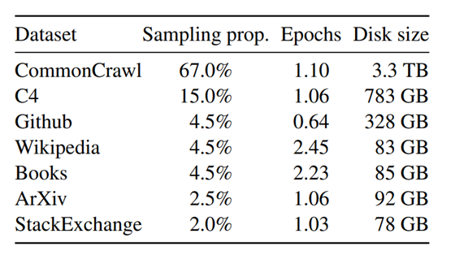

當然LLaMA 1不僅僅是開源在模型設計上也做出了許多優化。首先是`RMSNorm`歸一化函數，相比於Transformer的`LayerNorm`，**`RMSNorm`只計算特徵值的均方根，而不計算均值**，這使得計算速度更快梯度也更穩定，其數學公式其實與LayerNorm相似，只是移除了均值的計算並改用均方根。


第二個改動是針對激勵函數，在原始的Transformer中通常會使用`ReLU`或`GELU`（例如BERT使用`GELU`），但是`ReLU`在輸入小於0時會導致梯度消失的問題，**而`GELU`雖然平滑，計算成本卻較高**。LLaMA則採用了`SwiGLU`激勵函數，**該函數結合了門控機制和平滑運算**，其數學式如下:


對於每個輸入 `X`，該激勵函數會首先通過兩個線性變換 `W1` 和 `W2`，分別產生兩個不同的輸出。其中在 `W1` 上會通過 Sigmoid 函數來產生一個在 `[0, 1]` 範圍內的門控信號，用以控制每一層的訊息流入，並與 `XW2` 進行逐元素相乘。**這提供了一個更平滑且可微的激活函數，使模型訓練更加穩定並提高效能**。我們可以看到這些 ReLU 變體的相關曲線圖如下。

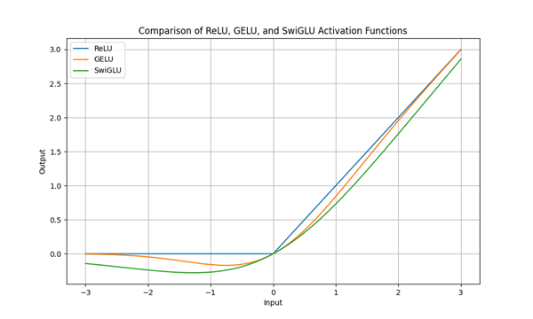

最後一個方法是將 `Positional Encoding` 改為`旋轉位置編碼（Rotary Embeddings, RoPE）`。**這種方式基於數學中的極座標系統，通過將每個 token 的位置編碼與查詢和鍵向量進行旋轉變換，來實現相對位置編碼**。`Rotary Embeddings` 的核心思想是通過旋轉變換矩陣影響查詢和鍵向量的內積，從而編碼相對位置。這裡的旋轉變換基於複數數學或二維向量旋轉的概念。對於每個維度 d，我們將奇數和偶數維度組成一對進行旋轉變換。因此我們針對Transfromer時其旋轉變換可以寫成：

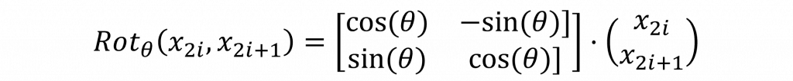

簡單來說這意味著**每對奇偶維度會被旋轉一個角度，而這個角度通常是根據 token 的位置信息設置的**。通過這種方式，`Rotary Embeddings` 可以有效地引入位置資訊，並保留相對位置之間的關係，從而提升模型的表現。此外，上述數學公式可以用原始論文中的圖片來表示。

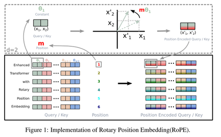

LLaMA 2
-------

2023年7月Meta推出LLaMA 2，**此版本不僅擴大了40%的預訓練數據，還延長了輸入的文本長度**，並繼續使用與LLaMA 1類似的架構，但它最大的改進來自於`Global Query Attention`，**這種改進使每個`Q`可以共享全局`Q`向量，從而顯著減少了記憶體需求和計算量**，使其運算與訓練速度更快。

具體來說多頭注意力機制需要為每個head計算`Q`、`K`和`V`之間的關係，**而每個head都需要獨立計算注意力分數並拼接在一起進行線性變換**，這導致計算量非常大。LLaMA 2採用了`Global Query Attention`的架構，**讓一組全局共享的Q與所有的K和V進行交互**，而不是為每個查詢單獨計算，這大大減少了計算需求並提高了效率。


LLaMA 2 也針對`長文本處理（GMS8K）`、`程式碼編寫（HumanEval）`和`語意理解（MMLU）`等自然語言處理任務進行了優化，使性能提升明顯，而自此版本開始允許商業用途，為企業應用打開了大門。

LLaMA 3
-------

在2024年4月LLaMA 3問世再次引起轟動。根據公開的測試結果，**LLaMA 3的70B參數模型在性能上與主要競爭對手相當，並且相較於LLaMA 2性能提升了超過20%。**LLaMA 3的優勢在於進一步優化了多頭注意力機制，同時改進了模型的訓練策略，使得相同參數量下的性能得到了大幅度的提升。且Llama 2相比，**Llama 3的預訓練資料量從1.8兆增加到15兆，大幅提升了模型訓練資料的規模。**


目前公開的LLaMA 3版本包括8B、70B和405B的模型，而LLaMA 3在原始的論文中被稱為「herd of language models」，這是因為其效能旨在與目前最先進的語言模型（如GPT-4）競爭並且能做到多個語言模型才能做到的事情。此外與LLaMA 1和LLaMA 2只能輸入4k與8k個Token不同，這次模型一口氣提升到了128k個Token的輸入，是一個強而有力的進展。

其模型在架構上並未與前代有太大的差異，最大的差異在於它使用了兩個主要訓練階段預訓練和`後訓練（Post-Training）`，並在這兩個任務中加入了許多優化技巧，例如:在預訓練階段是為了適應人類指令並優化特定能力（如程式設計、推理等），而其最主要的任務就是讓模型預測下一個Token。這個訓練過程包括從標準預訓練到進一步的預訓練，以擴展模型的上下文視窗（Context Windows），即Token的輸入數量。而在後訓練階段，模型進行了Instruction learning和`DPO(Direct Preference Optimization)`，**使它更加符合人類回饋，並具備特定的功能，如工具使用和推理能力。**

而在資料集的方面進行了更嚴謹的資料處理。例如: 在預訓練階段進行了相似文件的去重，且在訓練過程中，不像MAML那樣先用單一類型的資料集分階段訓練或調整**，而是使用了混合資料集來提高模型的泛化能力**。

在後訓練階段，除了採用`SFT(Supervised Fine-Tuning)`與`DPO`外，還使用了`拒絕採樣（Rejection Sampling）`策略，使其能從從大量模型生成的數據中選取最優輸出，並通過`PagedAttention`提高了採樣效率。

> 拒絕抽樣是一種從目標分布中產生樣本的蒙地卡羅方法，**用於在無法直接從目標分布中抽樣的情況下進行樣本生成**。它依賴於一個較易抽樣的`提議分布（Proposal Distribution）`，並利用拒絕/接受樣本的機制來逼近目標分布。
> 
> `PagedAttention`則是一種改進 Transformer 模型中的注意力機制的方法，它旨在**減少計算資源的使用，尤其是記憶體佔用**。在原始的 Transformer 模型中，**隨著輸入序列長度的增加，注意力機制的計算量和記憶體需求會急劇上升**，因為每個序列的每個位置都需要與其他所有位置進行計算。而`PagedAttention` 目的是為了應對這一問題，並使其在更長的輸入序列上運行得更加高效。[[Paper]](https://arxiv.org/abs/2309.06180)

簡單來說LLaMA 3 的強大能力源自於以下幾點：**基於更多且更乾淨的資料集、使用更加細膩的 Token 進行訓練、修改了 RoPE 的基頻超參數並增加到 500000[[paper]](https://arxiv.org/html/2403.00071v1)**，以達到更長的輸入。這些改進使得模型在處理複雜任務時表現更佳。此外，它還採用了與 ChatGPT 中 RLHF 技術[去年的文章](https://ithelp.ithome.com.tw/articles/10339382)相似的 DPO 來進行人類優化。

> RLHF是一種將`強化學習（Reinforcement Learning，RL）`與人類反饋相結合的技術，用於訓練人工智慧系統，特別是在處理複雜、模糊的目標時，這些目標難以透過明確的數學公式來定義或衡量，其方式就是收集人類反饋資訊讓模型知道該回復的好壞，已讓他計算出對應的獎勵來更新模型的相關參數。
> 
> DPO則是直接根據人類的偏好來優化模型的行為，而不是依賴間接的獎勵信號，這一技術可以被視為RLHF的一種變體，因為他只會根據人類的偏好來優化模型的行為，避免了強化學習中獎勵設計過於複雜或不直觀的問題。

總結
--

在整個 LLaMA 系列中，其實是從多篇論文中找尋方法，包括我們先前提到的 `GPT-1` 到 `InstructGPT` 以及後續 `ChatGPT` 的 `RLHF` 技術。LLaMA 還參考了多項優化記憶體與速度的技術論文，例如 `PagedAttention`與 `Global Query Attention` 架構。這些方法的應用造就了 LLaMA 3 的強大能力。

不過該論文信息量相當大，因此我僅擷取了一些重點來幫助你理解 LLaMA 3 的強大之處，因此今天的內容中我只會擷取前幾天提到的重點，並忽略論文中有關圖像、語音和記憶體空間節省的詳細資訊。如果你有興趣了解更完整的相關知識，可以參閱 LLaMA 3 的[原論文](https://arxiv.org/abs/2407.21783)。

---

<a id="7467-day-29"></a>

## Day 29｜【Day 29】探索大型語言模型的高效微調方式與優化技巧：QLoRA 和 NEFTune

- 原文：https://ithelp.ithome.com.tw/articles/10367343
- 發佈時間：2024-10-13 22:17:14

前言
--

在最新的自然語言技術進展中，語言模型的規模變得越來越龐大，模型的參數量從數百萬到數十億，甚至上千億。雖然這些大型語言模型在許多任務中表現出卓越的能力，但也帶來了嚴峻的計算效能與記憶體空間問題。例如：LLaMA 3 擁有 4050 億個參數，僅進行微調就至少需要 3-4 張 H100 顯卡（每張內存 80GB，且單張售價近百萬台幣），這對大多數研究機構和企業來說是巨大的負擔。

因此有許多研究開始探索如何在有限資源下高效微調這些大型語言模型。今天我們要特別介紹的 `QLoRA` 就是一種這樣的方法，它能夠在不犧牲模型性能的前提下，顯著減少計算和存儲需求。且我還會介紹一種針對大型語言模型的優化技術 `NEFTune`，這是一種正規化技術，為大型語言模型提供了另一種發展方向。

QLoRA（Quantized Low-Rank Adaptation）
------------------------------------

`QLoRA（Quantized Low-Rank Adaptation）`是一種針對大型語言模型的高效微調技術。其目標是減少模型參數數量和計算需求，通過`量化(Quantization)`和`低秩適應(Low-Rank Adaptation)`技術達到高效微調的效果。具體來說**該技術通過量化模型來降低精度，使其能夠用更少的存儲空間在記憶體中運行**。這個概念就像是將`float64`的資料轉換成`float32`一樣，雖然這會減少記憶體的消耗，但也會導致部分精度的丟失。

當然QLoRA技術中的模型並非如此簡單，其量化技術通常基於`固定點量化（Fixed-Point Quantization）`與`動態範圍量化（Dynamic Range Quantization）`。對於有興趣深入了解的讀者，可以參閱[原論文](https://arxiv.org/abs/2305.14314)中的詳細介紹。


不過量化後的模型在推理能力上其實並沒有顯著減少效能，甚至可以說是完全沒有變化。因此量化後的模型往往能使用更少的資源來進行文字內容的生成。但是對於微調模型而言則不然，由於大型語言模型是多層的Transformer Decoder結構，**在經度丟失的情況下進行微調時，模型可能會出現一步錯步步錯的現象，這很容易導致模型不知道何時該生成EOS Token，或者推理出的內容出現嚴重問題。**總體而言對比全量微調（我們之前的訓練方式稱為全量微調），這種方法會導致模型性能明顯下降。

因此`LoRA`這一方法被用來解決這個問題的，如果我們沒辦法調整原本的模型架構，那麼我們可以訓練一個適配器，並外掛在模型旁邊來輔助該模型嗎？答案是可以的。所以在 LoRA 這一方法中，**在微調模型時會凍結大部分模型權重僅調整少量的參數以減少計算量**。而 LoRA 的方式是通過微調過程中需要更新的權重矩陣 `ΔW`，將其分解成兩個較小的矩陣 `A` 和 `B`，來達到降低計算需求的效果：


這樣的矩陣分解方式可以顯著減少所需的存儲和計算資源。例如當 `r = 2` 時，A 和 B 只會是兩個列向量和行向量。當 `r = 3` 時，則變成三個列和行向量。這種方法能有效降低訓練時的計算複雜度，同時保持模型的高效能。

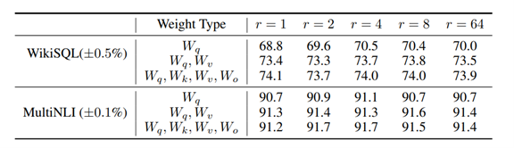

而我們通常會將其LoRA框架加入在Transformer的`Q`、`K`、`V`與輸出層`O`上，而根據研究顯示`LoRA`這種微調方式在 `WikiSQL` 和 `MultiNLI` 等數據集上的表現與傳統微調幾乎無異。但更重要的是該方式顯著的減少了模型在微調時的時間。

NEFTune(Noisy Embeddings Improve Instruction Finetuning)
--------------------------------------------------------

`NEFTune（Noisy Embeddings Improve Instruction Finetuning）`是一種針對語言模型微調的創新方法，**通過在嵌入層中引入噪音（如高斯分布噪音），來提高模型面對不確定數據的性能表現。**這樣的技術模擬了現實世界中數據的隨機性和變異，類似於訓練飛行員在各種惡劣天氣下駕駛飛機，以便應對突發狀況。對語言模型來說，這樣的噪聲正規化技術能有效防止模型過度擬合訓練數據，使其學會如何在「有噪音」的環境中依然準確執行指令。

而另外一點適在訓練過程中，神經網絡的每一層往往需要設定不同的學習率。例如，詞嵌入層的學習率通常需要較低，否則容易過度擬合特定的數據特徵。通過引入噪音，這種技術與數據增強技術相似，能提高模型的泛化能力，幫助其在面對新情況時表現出更好的適應性。這樣的策略能促使模型學習更廣泛的特徵和模式，並有效提升模型的整體性能。而其程式碼的實現也非常簡易讓我們先看看原始的Paper所開放出來的寫法:

```python
from torch.nn import functional as F

def NEFTune(model, noise_alpha=5):
    def noised_embed(orig_embed, noise_alpha):
        def new_func(x):
            # during training, we add noise to the embedding
            # during generation, we don't add noise to the embedding
            if model.training:
                embed_init = orig_embed(x)
                dims = torch.tensor(embed_init.size(1) * embed_init.size(2))
                mag_norm = noise_alpha/torch.sqrt(dims)
                return embed_init + torch.zeros_like(embed_init).uniform_(-mag_norm, mag_norm)
            else:
                return orig_embed(x)
        return new_func
    ##### NOTE: this is for a LLaMA model ##### 
    ##### For a different model, you need to change the attribute path to the embedding #####
    orig_forward = model.base_model.embed_tokens.forward
    model.base_model.embed_tokens.forward = noised_embed(orig_forward, noise_alpha)
    return model
```

在原始的論文中，由於測試使用了LLaMA 2，當提取其嵌入架構時，我們使用了`model.base_model.embed_tokens.forward`。接著將原始的嵌入層通過`new_func`加入噪音。我們可以看到，這個方法非常簡單，首先通過提取`seq_len * 嵌入特徵數`來獲取當前輸入的資料長度，然後通過嵌入維度的平方根調整噪音的幅度，並用`uniform_(-mag_norm, mag_norm)`生成一個範圍為`[-mag_norm, mag_norm]`的雜訊，並將其加入到原始的嵌入層中，而這簡單的實現就能讓模型瞬間提升了許多能力。


研究結果顯示，NEFTune 能在更複雜、多變的環境下進行指令微調訓練，使模型的表現達到顯著進步。實驗顯示在某些數據集上，**NEFTune 的引入甚至能帶來將近兩倍的性能提升**。這種技術展示了噪音注入對語言模型微調的強大潛力，進一步拓展了模型在真實世界應用中的實用性。

總結
--

這次主要是為了傳達了幾個重點，首先在量化模型下進行微調並不太理想，雖然能取得一定效果，但生成出的結果多半會有問題。正確的做法是凍結原始參數，加入適配器以達到微調的目的。由於我們進行了量化並凍結參數，即使加入了多個適配器，訓練速度依然會變快。

另外NEFTune是一種專門針對大型語言模型的方法。大型語言模型具有強大的推理能力，因此通過加入噪音的方式反而能增強效能。然而，如果將此技術應用於類似BERT的模型，效果只會更差。這兩項技術為大型語言模型的高效微調提供了創新解決方案，能以更少的硬體成本實現更佳的訓練效果和推理能力，適合應對真實世界中的資源挑戰。

---

<a id="7467-day-30"></a>

## Day 30｜【Day 30】用LLaMA 3訓練屬於你的鄉民風格聊天機器人 - 從資料轉換到微調的完整教學

- 原文：https://ithelp.ithome.com.tw/articles/10367570

前言
--

今天是整個系列的最後一天啦，在系列結尾，我會告訴你如何訓練一個屬於自己的聊天機器人。這在企業的內部培訓或解答系統中非常有用。我們只需要請每位員工列出他們可能遇到的幾個問題，並給予對應的答案即可。而聊天機器人的訓練並不像我們想像中那麼困難。我們其實只要按照今天介紹的幾個簡單步驟，之後只需要更換資料集的內容，就能培訓出不同版本的聊天機器人。現在讓我們來看看如何使用LLaMA 3這一個強大模型吧。另外在這次我們同樣使用[PTT鄉民的語料庫](https://github.com/zake7749/Gossiping-Chinese-Corpus)來幫助我們訓練出一個充滿鄉民風格的聊天機器人。

> LLaMA 3需要先申請才能夠使用，相關的申請流程可以看到我[去年鐵人賽](https://ithelp.ithome.com.tw/articles/10339382)的文章，只不過申請的URL變成了[LLaMA 3](https://huggingface.co/meta-llama/Llama-3.1-8B-Instruct)

### 【STEP 1】轉換資料成模型輸入格式

在我們GPT的章節中可以知道在轉換資料格式時其實非常的麻煩，而在LLaMA中又有自己的獨特轉換方式，例如我們想要賦予系統一個Instruction時就必須讓該系統的指令放置在`<|begin_of_text|><|start_header_id|>system<|end_header_id|>0x0A0x0A這是系統指令<|eot_id|>`這一段指令中其中`0x0A`是換行符號，輸入與模型對應的回復也要轉換成相對應的格式。而會出現這樣的問題，是因為LLaMA基本上是一個支援多輪對話的模型。因此，每一輪的對話會疊加在這些Token上，所以需要使用不同的Token來判斷角色、對話內容以及對話結尾。

那麼LLaMA模型中的Token系統是如何工作的呢？每個Token標籤都有其特定的功能。例如，`<|start_header_id|><|end_header_id|>`這組Token用來標示角色，這樣模型便可以區分不同對話者。而當模型讀取這組Token時，它會知道接下來的信息是該角色的台詞，這些台詞在實際對應的對話中是由兩個`0x0A`來間隔開。除此之外，`<|begin_of_text|><|eot_id|>`這組Token則負責界定某一角色對話的開頭和結尾，以便模型能夠正確了解每段對話的開始和結束位置。這整套系統使得LLaMA模型能夠有效管理和處理多輪對話，確保每一個對話回合之間的上下文得以正確理解和關聯。這樣一來，模型便能夠在多輪對話中保持高水準的連貫性和精確性。

不過，在 Hugging Face 的最新版本中，已經幫我們設定了一個 `apply_chat_template` 方法。因此，我們可以直接通過傳入一個由多個字典包圍住的列表，快速地轉換這些格式。其方式很簡單，就是通過 `role` 賦予我們要給予的指令與對應的文字到 `content` 中。最後，我們可以通過 `append` 等方式，將對話依序通過該方法轉換。這樣子，在後續多輪流的對話中，我們只需要不斷地 `append` 使用者和模型的回覆，就能讓用戶和使用者順利地進行聊天。

```
# 讀取Tokenizer
from transformers import AutoTokenizer

tokenizer = AutoTokenizer.from_pretrained(
    'meta-llama/Meta-Llama-3-8B-Instruct',
    trust_remote_code=True,
    add_special_tokens=False
)
tokenizer.pad_token = tokenizer.eos_token

system_format = {"role": "system", "content": '這是系統指令'}
question_format = {"role": "user", "content": '這是用戶的輸入'}
answer_format = {"role": "assistant", "content": '這是模型回復'}

chat_format = tokenizer.apply_chat_template([system_format, question_format, answer_format])
print(tokenizer.decode(chat_format))
# ----- 輸出 -----
<|begin_of_text|><|start_header_id|>system<|end_header_id|>

這是系統指令<|eot_id|><|start_header_id|>user<|end_header_id|>

這是用戶的輸入<|eot_id|><|start_header_id|>assistant<|end_header_id|>

這是模型回復<|eot_id|>
```

### 【STEP 2】量化設定

同樣的我們使用 Hugging Face 提供的 `BitsAndBytesConfig` 來進行模型的量化動作，將原本 32-bit 浮點數轉換成更低精度4-bit使模型能使用一張消費及險卡進行訓練。

```
from transformers import BitsAndBytesConfig
import torch

quantization_params = {
            'load_in_4bit': True,
            'bnb_4bit_quant_type': "nf4",
            'bnb_4bit_use_double_quant': True,
            'bnb_4bit_compute_dtype': torch.bfloat16
        }
bnb_config = BitsAndBytesConfig(**quantization_params)
```

而在上述的參數中我們基本上不會有變動，雖然可以直接照抄但我們還是先來理解一下這些參數的用處:

*   `load_in_4bit`: 將模型的權重加載為 4-bit 的精度。
*   `bnb_4bit_quant_type`: 設定量化的類型為 `nf4(Normalized Float 4)`，這是一種比較先進的量化技術，能在低精度的條件下保持更好的數值表現。
*   `bnb_4bit_use_double_quant`: 開始雙重量化技術，開啟後會將權重和計算的中間數據都會被壓縮，節省更多資源。
*   `bnb_4bit_compute_dtype`: 設定計算時的精度類型為 `torch.bfloat16`，這是一種比 32-bit 更低精度但表現較穩定的浮點數格式，在不顯著降低模型精度的前提下，能減少計算資源需求，但只有部分顯卡支援`bfloat16`的運算，若顯卡不支援則可以轉換成`float16`。

### 【STEP 3】讀取模型

這裡與之前並無太大的差異，唯一的不同之處在於我們使用了`Accelerator`來判斷顯示卡的位置。這是因為在訓練大型語言模型時，可能會面臨多張顯示卡訓練的需求。如果有多張顯示卡的話，使用`Accelerator`可以自動將模型拆分並分配到多張顯示卡上進行訓練。當然如果只有一張顯示卡，使用`to(device)`也是可以的。

```
from accelerate import Accelerator
from transformers import AutoModelForCausalLM

device_map = {"": Accelerator().local_process_index}
model = AutoModelForCausalLM.from_pretrained(
        'meta-llama/Meta-Llama-3-8B-Instruct',
        quantization_config=bnb_config,
        torch_dtype=torch.bfloat16,
        device_map=device_map,
        use_cache=False,
    )
print(model)
# ----- 輸出 -----
LlamaForCausalLM(
  (model): LlamaModel(
    (embed_tokens): Embedding(128256, 4096)
    (layers): ModuleList(
      (0-31): 32 x LlamaDecoderLayer(
        (self_attn): LlamaSdpaAttention(
          (q_proj): Linear4bit(in_features=4096, out_features=4096, bias=False)
          (k_proj): Linear4bit(in_features=4096, out_features=1024, bias=False)
          (v_proj): Linear4bit(in_features=4096, out_features=1024, bias=False)
          (o_proj): Linear4bit(in_features=4096, out_features=4096, bias=False)
          (rotary_emb): LlamaRotaryEmbedding()
        )
        (mlp): LlamaMLP(
          (gate_proj): Linear4bit(in_features=4096, out_features=14336, bias=False)
          (up_proj): Linear4bit(in_features=4096, out_features=14336, bias=False)
          (down_proj): Linear4bit(in_features=14336, out_features=4096, bias=False)
          (act_fn): SiLU()
        )
        (input_layernorm): LlamaRMSNorm()
        (post_attention_layernorm): LlamaRMSNorm()
      )
    )
    (norm): LlamaRMSNorm()
  )
  (lm_head): Linear(in_features=4096, out_features=128256, bias=False)
```

而這時我們把模型的結構print出來時可以看到`self_attn`下的`Q`、`K`、`V`、`O`層，而這幾個參數也是我們下一個步驟中需要進行加入LoRA適配器的部分。

### 【STEP 4】加入LoRA適配器

我們把剛剛找到的Attention層資料寫入到`target_modules`以幫助我們在這些層中加入LoRA適配器，而我們在這裡不需要手動凍結其他網路層，這是因為在`peft`庫當我們自動加入LoRA層時就會幫我們自動凍結`target_modules`的參數。

在進行4-bit類型的訓練時，我們通常會使用`prepare_model_for_kbit_training`進行包裝。這個方法主要用於在進行低位量化的過程中，為模型做好準備，使其在記憶體有限的環境下可以更高效地進行訓練和推理，同時儘量減少量化帶來的性能損失。完成這個步驟後，接著使用`get_peft_model`將剛剛設定好的`peft_config`傳入，就完成模型的配置了。

```
from peft import LoraConfig, get_peft_model, prepare_model_for_kbit_training

peft_params = {
            'r': 32,        
            'target_modules': ["q_proj", "k_proj", "v_proj", "o_proj"],
            'lora_dropout': 0.1,
            'task_type': "CAUSAL_LM",
        }
peft_config = LoraConfig(**peft_params)

model = prepare_model_for_kbit_training(model, use_gradient_checkpointing=True)
model = get_peft_model(model, peft_config)
print(model)
```

### 【STEP 5】加入NEFtune

最後，我們來將NEFtune的方法加入到模型中。在這裡，我們不是採用原始論文的方法來找出模型的Embedding層，而是先通過`unwrap_model`的方式找出模型的Embedding層，再用`register_forward_hook`的方式讓模型在前向傳播時先執行NEFtune公式，再傳遞到下一層。我已經將相關的知識寫在註解中。因此加入NEFtune的程式可以撰寫成以下形式。

```
from transformers.modeling_utils import unwrap_model

def activate_neftune(model, neftune_noise_alpha = 5):
        unwrapped_model = unwrap_model(model)
        embeddings = unwrapped_model.base_model.model.get_input_embeddings()
        embeddings.neftune_noise_alpha = neftune_noise_alpha # 讓Embedding層的__init__多一個neftune_noise_alpha參數
        # hook embedding layer
        hook_handle = embeddings.register_forward_hook(neftune_post_forward_hook)
        
        return model
        
def neftune_post_forward_hook(module, input, output):
    # 公式來源:https://github.com/neelsjain/NEFTune
    # 論文網址:https://arxiv.org/abs/2310.05914
    if module.training: # 讓他再訓練時有用而已
        # 實現NEFtune公式
        dims = torch.tensor(output.size(1) * output.size(2))
        mag_norm = module.neftune_noise_alpha / torch.sqrt(dims) # 這裡的neftune_noise_alpha就是在__init__的參數
        output = output + torch.zeros_like(output).uniform_(-mag_norm, mag_norm)
            
    return output
model = activate_neftune(model)
```

### 【STEP 6】轉換資料集成對話格式

而在我們這次的對話集中由於是單輪對話格式，因此`user`與`assistant`只會有一個，而我在這個過程中也加入了一個簡單的Instruction: `你是一個zh-tw版本的聊天機器人`，加強模型的回覆可以用繁體中文進行聊天與回覆的能力。。

```
import pandas as pd

def transform_format(questions, answers, system='你是一個zh-tw版本的聊天機器人'):
    context = []
    for q, a in zip(questions, answers):
        system_format = {"role": "system", "content": system}
        question_format = {"role": "user", "content": q}
        answer_format = {"role": "assistant", "content": a}
        context.append([system_format, question_format, answer_format])
    return context

# 讀取CSV檔案
df = pd.read_csv('Gossiping-QA-Dataset-2_0.csv')

# 提取問題和答案的列表
questions = df['question'].tolist()[:5000]
answers = df['answer'].tolist()[:5000]

# 轉換格式
formatted_context = transform_format(questions, answers)
```

不過由於這次資料集的數量過於龐大，而模型又有著`8B`的參數量，因此為了節省時間，我將資料限制在5000個，這樣我們才能夠順利進行Demo。

### 【STEP 7】建立Pytorch DataLoader

這次的DataLoader建立起來比較簡單。因為在聊天版本的大型語言模型中，無論是輸入的文字還是答案，都是下一輪對話的一部分，模型應該能更好地理解這些上下文關係。因此，我們只需要對Padding的Token進行處理即可。

```
import torch
from torch.utils.data import Dataset, DataLoader

# 定義自定義 Dataset
class PTTDataset(Dataset):
    def __init__(self, formatted_context, tokenizer):
        self.formatted_context = formatted_context
        self.tokenizer = tokenizer

    def __getitem__(self, index):
        return self.formatted_context[index]
       
    def __len__(self):
        return len(self.formatted_context)

    def collate_fn(self, batch):
        formatted_contexts = self.tokenizer.apply_chat_template(batch, padding=True, return_dict=True, max_length=8192, return_tensors='pt', truncation=True)
        attention_mask = formatted_contexts['attention_mask']
        labels = formatted_contexts['input_ids'].clone()
        labels[attention_mask == 0] = -100
        formatted_contexts['labels'] = labels
        return formatted_contexts

# 建立資料集
trainset = PTTDataset(formatted_context, tokenizer)
validset = PTTDataset(formatted_context, tokenizer)

# 創建 DataLoader
train_loader = DataLoader(trainset, batch_size=4, shuffle=True, collate_fn=trainset.collate_fn)
valid_loader = DataLoader(validset, batch_size=4, shuffle=True, collate_fn=validset.collate_fn)
```

### 【STEP 7】訓練模型與生成結果

而在訓練模型的部分我們同樣使用`get_cosine_with_hard_restarts_schedule_with_warmup`進行排程，而後續的動作都與之前相同，無任何的差異。

```
import torch.optim as optim
from transformers import get_cosine_with_hard_restarts_schedule_with_warmup
from trainer import Trainer

# 訓練設置
device = torch.device('cuda' if torch.cuda.is_available() else 'cpu')

optimizer = optim.AdamW(model.parameters(), lr=5e-5)
scheduler = get_cosine_with_hard_restarts_schedule_with_warmup(
        optimizer, 
        num_warmup_steps=len(train_loader) * 0.2, 
        num_training_steps=len(train_loader) * 10, 
        num_cycles=1, 
)

trainer = Trainer(
    epochs=10, 
    train_loader=train_loader, 
    valid_loader=valid_loader,
    model=model, 
    optimizer=[optimizer],
    scheduler=[scheduler],
    early_stopping=3,
    device=device
)
trainer.train()
# ------ 輸出 -----
Train Epoch 9: 100%|██████████| 1250/1250 [12:01<00:00,  1.73it/s, loss=1.960]
Valid Epoch 9: 100%|██████████| 1250/1250 [04:07<00:00,  5.04it/s, loss=2.114]
Saving Model With Loss 1.80411
Train Loss: 1.83201| Valid Loss: 1.80411| Best Loss: 1.80411
```

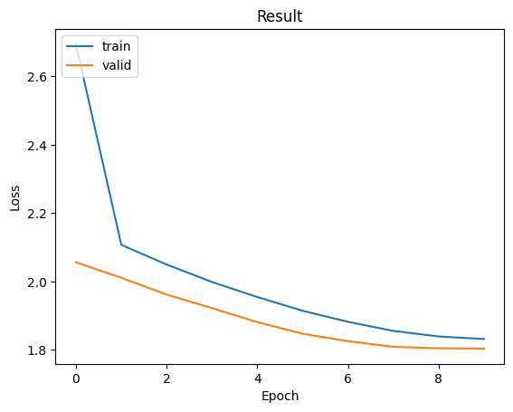

而在訓練曲線上可以發現在這9次的訓練中沒有發生過度擬合的狀況，且模型正在進行收斂，而對於這種狀況我們其實還可以繼續訓練，因為這時模型的損失值明顯還能在下降。

最後讓我們來看看生成的效果。在生成時，我們要注意一點，也就是和使用Tokenizer時一樣，由於該模型沒有Padding Token，因此我們要通過 `model.generation_config.pad_token_id = tokenizer.eos_token_id` 來設定這個數值。不然程式會出現警告（其實這不是很大的問題，因為生成時不該出現PAD token）。

```
model.load_state_dict(torch.load('model.ckpt'))
model.eval()
model.generation_config.pad_token_id = tokenizer.eos_token_id
messages = [
    {"role": "system", "content": '你是一個zh-tw版本的聊天機器人'},
    {"role": "user", "content": 'PTT是甚麼阿?'},
]
input_data = tokenizer.apply_chat_template(messages, padding=True, return_dict=True, max_length=8192, return_tensors='pt', truncation=True).to(device)
ids = model.generate(**input_data)
print(tokenizer.decode(ids[0]))
# ----- 輸出 ------
<|begin_of_text|><|start_header_id|>system<|end_header_id|>

你是一個zh-tw版本的聊天機器人<|eot_id|><|start_header_id|>user<|end_header_id|>

PTT是甚麼阿?<|eot_id|><|start_header_id|>assistant<|end_header_id|>

一個垃圾論壇<|eot_id|>
```

而我們可以看到，我們僅僅使用了10個訓練週期和5000筆資料，就讓模型成為了一個~~沒素質~~的聊天機器人。因此，我們也可以發現這些大型語言模型的能力其實非常強大。這一點歸功於它具備強大的基礎知識，所以在微調時才能更好地收斂損失值。

總結
--

我們的`從零開始學AI：數學基礎與程式碼撰寫全攻略`的30天教學終於結束啦。在這段期間，你可能會發現我在前幾天特別強調數學公式的講解，**這是因為我希望你們能理解這些基礎公式的用途與用法**。通過這樣的學習，你是否能夠在後續的模型中更好地理解這些作者在設計模型時的想法呢？

因此在預訓練模型之後，我基本上不再詳細講解這些公式，因為這些公式大致相同。唯一的差異通常可以用文字講解相關理念來說明，就算我們想模仿這些做法時，我們只需參考原始論文的程式碼即可，因此對數學公式的依賴相對減少。

而在這30天的內容中，我的主要目的是幫助你們慢慢理解相關領域的發展與應用，更重要的是我要傳達的是該如何遇到問題後找到解決的方向，而不是單純教你如何使用最新技術。這樣一來當你們遇到問題時，可以更有條理地分析問題並找到解決方法，而不會成為我們在AI界所說的“套模仔”。

參賽後紀
----

這次的內容主要是想把我在研究所中自學這些AI知識的過程整理成一篇文章讓大家可以跟我一樣慢慢的進入AI的領域，所以在這篇文章中的內容我在文章中的細節中加入了我以前遇過的問題，並且把我踩過的坑告訴大家，來增加你學習的速度，當然一開始不一定要馬上的理解這些數學式而是先知道相關的概念即可，這樣子你至少會有著撰寫程式的能力，而當你有這能力後你會慢慢的理解這些數學式，而今年也是我第三年參加鐵人賽了，從懵懂無知的AI人蛻變到現在有能力站上AI競賽的舞台，而這次撰寫內容的過程只能說是壓力山大啊，雖然說寫作的速度變快了，但對於內容的壓縮與編排真的是我這次最大的挑戰，希望這次的學習內容能對你們有所幫助，那麼我們明年再見(?

---

<a id="series-2025-8357"></a>

# 2025｜零基礎 AI 入門！從 Wx+b 到熱門模型的完整之路！

- 系列原址：https://ithelp.ithome.com.tw/users/20152236/ironman/8357
- 預期篇數：30
- 整理篇數：30
- 缺漏天數：無

## 目錄

- [Day 01 - 【Day 1】在2025年的現在我們該怎麼學習AI呢？](#8357-day-01)
- [Day 02 - 【Day 2】前向傳播？單層感知器？WX+b究竟是什麼？](#8357-day-02)
- [Day 03 - 【Day 3】如何找到模型的最佳解？](#8357-day-03)
- [Day 04 - 【Day 4】不可微或梯度為零的函數為何無法在深度學習網路中做使用？](#8357-day-04)
- [Day 05 - 【Day 5】當 Wx+b 不再孤單多層感知器的誕生](#8357-day-05)
- [Day 06 - 【Day 6】單層劃不開的謎題靠多層來解](#8357-day-06)
- [Day 07 - 【Day 7】PyTorch的威力， 20 行程式碼讓神經網路自己跑起來！](#8357-day-07)
- [Day 08 - 【Day 8】卷積神經網路不是深度學習的「原創」？從影像處理出發的 AI 革命](#8357-day-08)
- [Day 09 - 【Day 9】60% 準確率只是起點用 CNN 與 CIFAR-10 探索深度學習優化之路](#8357-day-09)
- [Day 10 - 【Day 10】用一支「通用訓練器」打天下逐行理解開源Trainer的內容](#8357-day-10)
- [Day 11 - 【Day 11】賦予 WX+b 時序感知力神經網路如何理解過去與未來](#8357-day-11)
- [Day 12 - 【Day 12】「你真的懂LSTM嗎？」手刻雙向LSTM讓你從不會到秒懂！](#8357-day-12)
- [Day 13 - 【Day 13】模型真的理解語言嗎？從 Seq2Seq 看 AI 如何學會翻譯](#8357-day-13)
- [Day 14 - 【Day 14】模型記性差？Attention 來幫忙！](#8357-day-14)
- [Day 15 - 【Day 15】Attention is All You Need？先別急來看看 LSTM 的最後一舞](#8357-day-15)
- [Day 16 - 【Day 16】從零開始拆 Transformer，原來 Encoder 是這樣運作的！](#8357-day-16)
- [Day 17 - 【Day 17】只懂 Wx + b 也能搞懂 BERT？當然可以！](#8357-day-17)
- [Day 18 - 【Day 18】一篇文章讓你搞懂BERT預訓練任務與模型實作（MLM + NSP）](#8357-day-18)
- [Day 19 - 【Day 19】看起來很簡單？BERT 實作假新聞分類超簡單教學](#8357-day-19)
- [Day 20 - 【Day 20】Decoder 為何會胡說八道 Transformer 的生成機制與幻覺真相](#8357-day-20)
- [Day 21 - 【Day 21】從 Wx+b 到能寫詩的模型GPT-2 的煉成](#8357-day-21)
- [Day 22 - 【Day 22】不靠 Encoder？用 GPT-2 試試翻譯的可能性](#8357-day-22)
- [Day 23 - 【Day 23】語音模型原來長這樣？Wx+b拆給你看Whisper 架構！](#8357-day-23)
- [Day 24 - 【Day 24】LoRA 是什麼？一篇文章教你 Whisper 中文微調全流程！](#8357-day-24)
- [Day 25 - 【Day 25】語言模型的認知轉向，GPT 系列中的提示學習與指令學習解析](#8357-day-25)
- [Day 26 - 【Day 26】GPT 落伍了嗎？來看看 LLaMA 怎麼反向壓制參數怪獸](#8357-day-26)
- [Day 27 - 【Day 27】RoPE(x) = cosθx + sinθ(-x)？LLaMA 3 的 Wx + b 的完整拆解](#8357-day-27)
- [Day 28 - 【Day 28】弱智吧 is all you need？教AI聽懂亂流語言的奇幻旅程](#8357-day-28)
- [Day 29 - 【Day 29】Decoder-only 模型也能搞定 NER？用 LLaMA3 找出個資](#8357-day-29)
- [Day 30 - 【Day 30】不是模型變強是你變懂 Decoder-only 訓練中的那些事](#8357-day-30)

---

<a id="8357-day-01"></a>

## Day 01｜【Day 1】在2025年的現在我們該怎麼學習AI呢？

- 原文：https://ithelp.ithome.com.tw/articles/10380119
- 發佈時間：2025-09-15 16:57:02

前言
==

身為一個重度拖延症患者，每年參賽前我都立志要先屯好稿再開賽，但結果總是拖到最後一刻一字未動。今年是我第四次參賽，本以為狀況會跟以往一樣，不過這次卻完全不同。已經不像學生時期那樣能靠瘋狂熬夜硬撐，所以我帶著可能會斷賽的心態來面對。好在這次難度應該不算太高，就算時間緊迫，還是想拚一拚。

那麼就從今天開始展開今年的 30 天學習挑戰。

帶著好奇與決心，一起踏入 AI 的世界，邁出屬於我們的第一步吧！

這次所學習到的知識
=========

這次我們的目標，是學習如何正確開啟 `Hugging Face` 社群的程式碼世界。雖然 `Hugging Face` 為使用者帶來極高的便利性，將許多複雜概念高度封裝，但這也讓初學者容易忽略背後真正的原理與邏輯。為了彌補這樣的斷層，我們在接下來的 30 天裡，將採取理論與實作並進的方式，逐步建立 AI 的核心觀念。

這次同樣的會從 AI 的數學基礎「矩陣」談起，並透過 `Numpy` 動手實作，以打好根基。接著我們會進入 `PyTorch` 的世界，從最簡單的模型搭建開始，一步一步堆疊成更完整的深度學習模型。

在這個過程中，我會帶你閱讀多篇經典論文，並以**程式碼實現的方式拆解其中的數學與架構**，幫助你把艱澀的理論轉化為清晰可見的實作內容。**每一章節也會介紹不同的模型優化技巧**，深入分析各種方法的優劣與適用情境。

當你完整走完這 30 天的內容，你將擁有一套扎實的 AI 基礎能力。此時你不僅能夠看懂主流模型，更能有能力去分析並解決實務或研究中遇到的各種問題。而這種思考與拆解問題的能力，正是學習 AI 最核心、也最有價值的地方。

*   [留言 1](http://ithelp.ithome.com.tw/articles/10380119#reply)
*   [追蹤](https://ithelp.ithome.com.tw/users/login)
*   [檢舉](https://ithelp.ithome.com.tw/users/login)

[下一篇 【Day 2】前向傳播？單層感知器？WX+b究竟是什麼？](https://ithelp.ithome.com.tw/articles/10380992)

---

<a id="8357-day-02"></a>

## Day 02｜【Day 2】前向傳播？單層感知器？WX+b究竟是什麼？

- 原文：https://ithelp.ithome.com.tw/articles/10380992
- 發佈時間：2025-09-16 14:39:13

前言
==

在開始學習之前，我們需要先理解一個最基本的概念，再複雜的模型，本質上都可以用 `WX + b` 來表示。這個公式是人工智慧中最基礎的基礎，但往往在任何一門 AI 課程裡，老師都不會直接告訴你這件事。今天我要分享的，就是這個公式究竟如何推理，並一步步導出正確答案。

單層感知器的數學公式
==========

單層感知器（Perceptron）是深度學習中最基礎、也是最早提出的模型之一。它能夠模擬邏輯閘（如 AND 與 OR）的運算。其數學形式可表示為


其中 𝑊 表示權重（weights）、 𝑋 表示輸入向量（inputs）、𝑏為偏置（bias），而在模型初始化時，權重通常會隨機設定，至於**偏置有時可以省略，因為它主要用於調整資料的偏向性**，我們可以先看到以下兩張圖片。

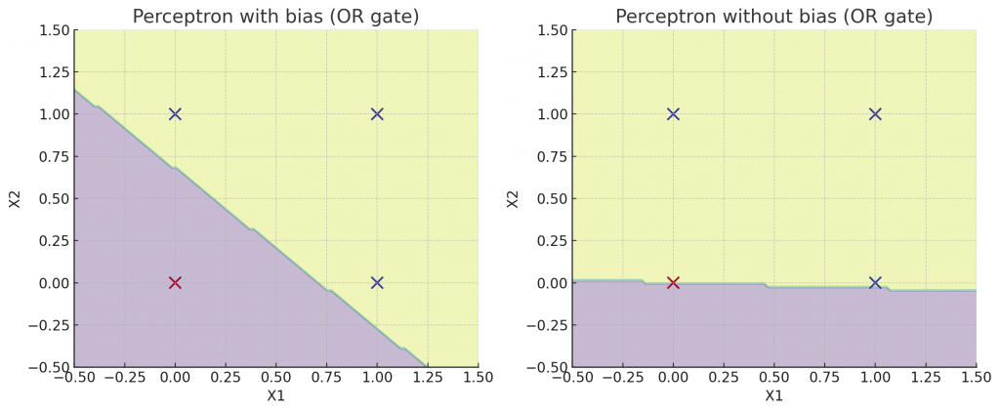

在左圖中由於引入了偏置，決策邊界得以適當平移，因此能正確區分 OR 邏輯閘的輸入資料。相較之下右圖中的決策邊界被迫通過原點 (0,0)，使得模型無法正確表示 OR 邏輯，因而產生分類錯誤。因此我們可以知道偏置的核心作用在於**賦予模型調整決策邊界位置的彈性**，避免受限於原點，從而更準確地刻劃資料的分布特性，不過讓我們回到剛剛的公式


在公式中可以看到，**權重會直接與輸入相乘**，因此它對模型輸出的影響遠大於偏置。這也代表著**即便偏置的初始設定不理想，模型依然能透過不斷訓練來調整權重，最終收斂到正確的答案。**

但對於模仿邏輯閘的動作，我們通過這樣的計算公式緊緊為很接近於1或0而已，實際上我們並沒有辦法完美貼近於1，因此在單層感知器上通常會使用階躍函數（Step Function）這一個`激勵函數（Activation Function）來進行轉換`，我們可以看到以下的數學式子

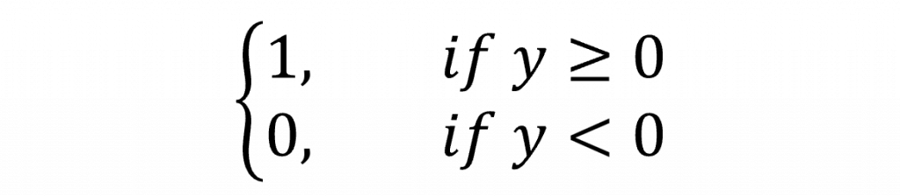

如此一來，我們便能完整地得到模型的輸出。而上述的計算流程，正是我們所稱的`前向傳播（Forward Propagation）`，這個過程的核心在於將輸入數據傳遞並轉換為輸出結果，進而計算出模型的預測值。以上就是我們在學習深度學習的第一步，理解模型的構造並理解該模型的前向傳播中個參數的含意。

下集預告
====

今天我們理解了「權重」的重要性。不過你可能還不清楚該如何去最佳化這個參數。而這正是我們明天要學習的新數學方法的核心，只需要運用國中階段的知識，就能掌握。

但在進入新內容之前，我們不妨先思考一個問題：如何找到一個參數的變動速度與方向？這個問題的答案，將會是我們理解最佳化的關鍵起點。

---

<a id="8357-day-03"></a>

## Day 03｜【Day 3】如何找到模型的最佳解？

- 原文：https://ithelp.ithome.com.tw/articles/10381929
- 發佈時間：2025-09-17 15:43:43

前言
==

在學習深度學習模型的時候，很多同學常常會有一個疑問，模型是怎麼一步一步變得「更聰明」的呢？其實模型的進步並不是一次到位，而是透過不斷修正與調整來完成的。就好比學生做題目一樣，先嘗試寫答案，再根據老師批改的錯誤慢慢修正，最後才會越來越接近正確答案。

今天我們要談的，就是這個「修正錯誤」的過程，也就是所謂的模型最佳化。它的核心原理在於計算目標值（正確答案）與預測值（模型的答案）之間的誤差，然後利用這些誤差去更新模型的權重。透過這樣的循環，模型會一步一步學會如何更準確地做出預測，這個步驟也是整個深度學習訓練中最關鍵的一環。

模型如何計算誤差
========

昨天我們學習了模型的前向傳播，了解了模型是如何計算出答案的。但僅僅有答案還不夠，我們還需要知道「模型答得好不好」。這時候就需要引入`損失函數（Loss Function）`。

損失函數的作用，是透過比較`模型的預測值（Prediction）`與`真實的目標值（Target）`，計算出它們之間的差距，這個差距就稱為`損失（Loss）`。損失越小，代表模型的預測越接近正確答案；反之損失越大，就表示模型還有很多地方需要改進，而其中我們最基本的損失函數就是`均方誤差(Mean square error，MSE)`，其數學公式為

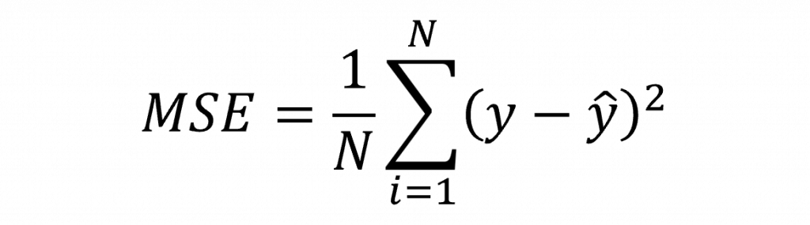

這種「利用目標值來指導模型學習」的方式，就是`監督式學習（Supervised Learning）`。你可以把它想像成一個老師在批改作業：模型寫出答案後，老師（損失函數）會根據正確答案指出錯誤的地方（損失），再幫助模型一步一步修正，直到能更精準地回答問題。

單層感知器的反向傳播
==========

在單層感知器中我們的模型輸出可以表示為`WX+b`，其中，權重 𝑊 是需要透過訓練不斷更新與優化的核心參數。

優化的依據就是損失函數，也就是模型預測與真實標籤之間的差距。因此訓練的目標就是讓權重找到能夠使損失函數最小化的位置。我們可以將損失函數隨權重變化的關係繪製成如下圖所示的曲線：


從圖中可以看到，損失函數會隨著權重 𝑊 的不同而變化，而我們的目標就是找到曲線的最低點。那麼如何讓權重一步步移動到這個最低點呢？

答案是我們需要知道當前權重的**運動方向**與**速度**，這可以透過**損失函數對權重的偏導數**來獲得，也就是計算出權重的`梯度（Gradient）`其中方向由梯度的正負號決定，指引權重該往左還是往右移動。速度則由梯度的絕對值大小決定，代表當前坡度的陡峭程度。

因此在反向傳播的第一步就是計算出`∂L/∂W`，但因損失函數為複合函數，因此我們先要使用連鎖率展開其算式，因此我們可以整理出以下公式：


其中∂L/∂y^

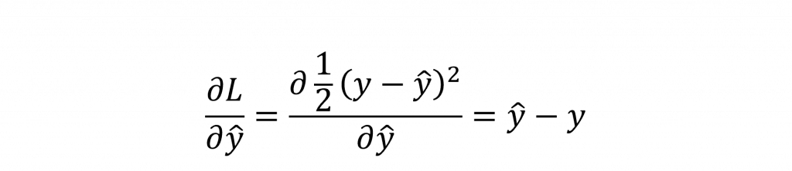

而∂y^/∂W

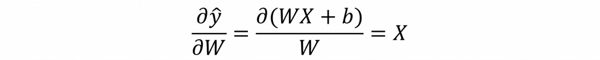

因此我們可得單層感知器的梯度公式為


在推導出梯度公式後，我們便能利用梯度的大小來調整權重的 更新方向 與 更新速度。

但需要特別注意的是，如果更新步伐過大，雖然移動速度很快，卻可能因為跨越谷底而錯失最佳解，甚至在損失函數曲線上不斷震盪、無法收斂。

為了避免這種情況，我們引入一個稱為`學習率 (learning rate)`的超參數，用來控制每次更新的幅度。

基於此，`梯度下降法 (Gradient Descent)`的更新公式為：

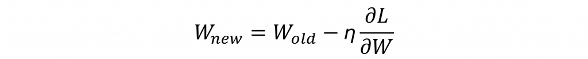

> η：學習率，控制更新步伐大小

因此選擇合適的學習率是梯度下降能否順利找到最佳權重的關鍵。至此我們已完整說明了反向傳播的流程與數學推導。在深度學習的訓練過程中，模型透過不斷重複的前向傳播與反向傳播，不斷更新權重，最終找到最佳解。如此一來，模型便能根據不同的輸入資料，產生正確且對應的輸出結果。

下集預告
====

學習的關鍵在於「眼到、口到、心到、手到」。目前我們仍缺乏「手到」這一步的實踐，因此明天將示範如何使用 NumPy 來模擬各種邏輯閘，並觀察不同學習率與偏置對結果所帶來的影響。這一環節對於後續模型的優化具有至關重要的意義。

---

<a id="8357-day-04"></a>

## Day 04｜【Day 4】不可微或梯度為零的函數為何無法在深度學習網路中做使用？

- 原文：https://ithelp.ithome.com.tw/articles/10382401
- 發佈時間：2025-09-18 11:39:32

前言
==

在我們昨天的做法中其實是後續的改良方法，因為單層感知器並不是透過**損失函數與梯度下降**來更新權重，而是依照`感知器學習規則 (Perceptron Learning Rule)`進行調整。這種規則的邏輯是當預測輸出為 0、而目標值為 1 時，就會增加權重，讓輸出更接近 1。

但是這樣的更新方式其實相對直觀卻顯得粗糙也缺乏靈活性，因為我們不可能對每個標籤產生新的規則，且也缺乏嚴謹的數學意義，因此我將透過程式實作，讓你更直觀地理解昨天的方式為何能夠取代感知器學習規則。

單層感知器實作(以OR為範例)
===============

1. 準備資料
-------

在 Python 中，`[]` 表示的是`列表 (list)`，而不是數學上的`矩陣（Array）`，所以如果要進行矩陣或向量計算，建議使用 `NumPy` 函式庫，讓我我們方便後續的運算，因此我們的輸入與標籤可以如此定義。輸入與輸出資料：

```python
import numpy as np

x_data = np.array([
    [0, 0],
    [0, 1],
    [1, 0],
    [1, 1]
])

y_data = np.array([0, 1, 1, 1])

print("x_data shape:", x_data.shape)
print("y_data shape:", y_data.shape)
```

輸出結果：

```python
x_data shape: (4, 2)
y_data shape: (4,)
```

在這個步驟中，我們必須先弄清楚輸入資料 `x_data` 的實際意義。這一點非常重要，因為在任何模型中，都需要理解每個維度所代表的涵義，否則在設計或使用模型時，可能會因為誤解輸入而導致錯誤。

對於 `x_data`其維度為 `(data_size, feature)`，表示共有 4 筆資料 (data_size=4)，而每筆資料包含 2 個特徵 (feature=2)。對於 `y_data` 則是 4 個對應的標籤值 (答案)，對應 `x_data` 的 4 筆資料。

2. 定義模型前向傳播
-----------

在單層感知器中，模型在前向傳播時需要兩個可訓練的參數權重與偏置。因此在模型初始化時，我們必須先定義這兩個參數以便後續使用。接著我們需要定義前向傳播的計算方式，也就是透過公式`y=f(WX+b)`完成計算，因此我們的模型可以如此定義

```python
class Perceptron:
    def __init__(self, input_size):
        # 隨機初始化w與b
        self.w = np.random.randn(input_size)
        self.b = np.random.randn()           # 可為0
        
    def forward(self, x):
        logit = np.dot(x, self.w) + self.b   # 前向傳播公式
                y = (logit >= 0).astype(int)

        return logit

    def __call__(self, x):
        return self.forward(x)

    
model = Perceptron(input_size=x_data.shape[1])
y_pred = model(x_data)
output = (y_pred < 0).astype(int) # 激勵函數
print(output)
```

輸出結果：

```csharp
[0 0 0 0] # 不一定是這個因為權重是隨機初始化
```

在這裡可以看到，模型的輸出結果並非我們預期的`[0 1 1 1]`，所以接下來的步驟就是調整模型的權重來改善預測表現。在程式設計上我們透過覆寫 `__call__` 方法來呼叫 `forward`，如此一來，就能以 `model(...)` 的形式呼叫，而不需要明確撰寫 `model.forward(...)`，讓程式碼更加簡潔直觀。

3. 計算參數梯度
---------

在這裡我們採用 MSE Loss作為損失函數。它的主要作用是計算模型輸出與真實值之間的誤差，並進一步獲得該誤差對權重與偏置的梯度方向與大小。由於我們在昨日已經推導出完整並簡化後的公式，因此這裡可以直接套用簡化後的過程進行計算：

```python
def perceptron_grad(x, y_pred, y_true):
    err = (y_pred - y_true)
    grad_w = x.T @ err / x.shape[0]   # 平均每個損失
    grad_b = err.mean()               # 平均每個損失
    return grad_w, grad_b

grad_w, grad_b = perceptron_grad(x_data, y_pred, y_data)
print('權重梯度:', grad_w)
print('偏置梯度:', grad_b)
```

輸出結果：

```makefile
權重梯度: [0. 0.]
偏置梯度: 0.25
```

與先前逐筆樣本計算不同，這裡我們採用了`批量（Batch`運算。在批量模式下，模型同時處理多筆樣本資料，因此每一步所回傳的損失值必須取**平均值**，避免因樣本數量而影響梯度的大小。

3. 更新模型參數
---------

前面我們已經成功計算出權重與偏置的梯度，接下來的步驟就是利用梯度下降法來更新參數，這裡我們透過建立一個簡單的類別，將學習率與更新規則封裝起來，並觀察執行前後的差異：

```python
class GD:
    def __init__(self, model, lr=1e-3):
        self.model = model
        self.lr = lr

    def step(self, grad_w, grad_b):
        self.model.w -= self.lr * grad_w
        self.model.b -= self.lr * grad_b
        
optimizer = GD(model, lr=0.1)

y_pred = model(x_data)

print("更新前的 w:", model.w)
print("更新前的 b:", model.b)
optimizer.step(grad_w, grad_b)
print("更新後的 w:", model.w)
print("更新後的 b:", model.b)
```

輸出結果：

```yaml
更新前的 w: [1.25326675 1.9396813 ]
更新前的 b: 1.4974228700042376
更新後的 w: [1.25326675 1.9396813 ]
更新後的 b: 1.4724228700042377
```

在反向傳播完成後，我們可以觀察到偏置已經更新，但權重卻完全沒有變動。這代表傳入的 `grad_w` 幾乎是一個全接近零的陣列。**對於淺層網路來說，這種情況通常與初始化方式、學習率或激勵函數有關**。

在這裡問題的根源來自所使用的階梯函數作為激勵函數。由於**它在 0 處不可微分，且在其他區域梯度為零，導致權重無法透過梯度下降有效更新。** 正因如此這類不可微或梯度為零的函數在深度學習中幾乎已經被淘汰。

4.進行模型訓練
--------

不過由於我們的任務還是較簡單，因此我們還是能夠正常訓練出模型，而在訓練模型的方式我們只需要設定訓練次數並重複使用上述動作即可完成最基本的步驟。

```pyhon
epochs = 100
for epoch in range(epochs):
    y_pred = model(x_data)  # 前向傳播
    grad_w, grad_b = perceptron_grad(x_data, y_pred, y_data)  # 計算梯度
    optimizer.step(grad_w, grad_b)  # 更新參數

print('訓練完成！')
y_pred = model(x_data)  # 預測結果
print(y_pred)
```

輸出結果：

```csharp
訓練完成！
[0 1 1 1]
```

到這裡，我們就已經成功實作出一個符合前兩天所學理論的簡單 AI 模型，而本次的完整程式碼將會放置在[這裡](https://github.com/AUSTIN2526/learning-wx-b-in-30-days)後續有相關內容也會持續更新在這一儲存庫中！

下集預告
====

明天我們將進一步探討單層感知器的延伸以及其背後的數學公式，並更清楚地體現其中的線性組合WX+b的意義。同時我也會介紹另一種激勵函數的使用方式，讓大家比較在 0 處可微與不可微 的差異，進一步理解為什麼選擇適當的激勵函數對模型訓練如此重要。

---

<a id="8357-day-05"></a>

## Day 05｜【Day 5】當 Wx+b 不再孤單多層感知器的誕生

- 原文：https://ithelp.ithome.com.tw/articles/10383078
- 發佈時間：2025-09-19 15:59:35

前言
==

昨天我們只用了一個 `Wx + b` 就能模擬出邏輯閘的運作情況。那麼，如果將多個 `Wx + b` 組合起來呢？這樣是否能處理更複雜的任務？答案是肯定的。第一個採用這種思路的方法，就被稱為`多層感知器（MLP, Multi-Layer Perceptron）`。

多層感知器的前向傳播
==========

1.輸入層->隱藏層
----------

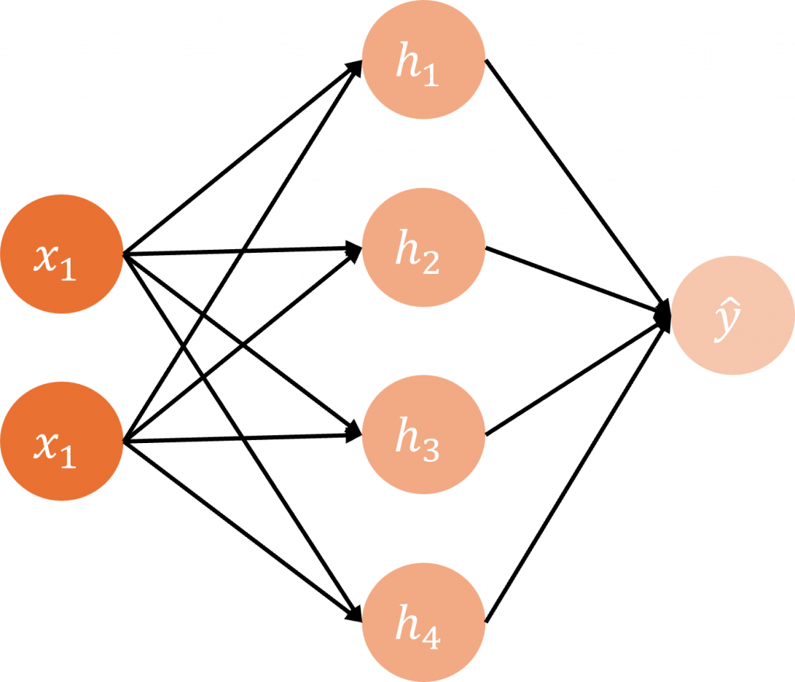

與單層感知器相比，多層感知器中的每一個隱藏層，都可以看作是由多個單層感知器的輸出所組成，就像圖片中的 `h1 ~ h4` 這些節點，其實就是單層感知器的輸出，而在多層感知器裡，這些組合起來的層被稱為隱藏層。在隱藏層中，我們同樣可以選擇不同的激勵函數，其中最常見的就是 `ReLU（Rectified Linear Unit）`。

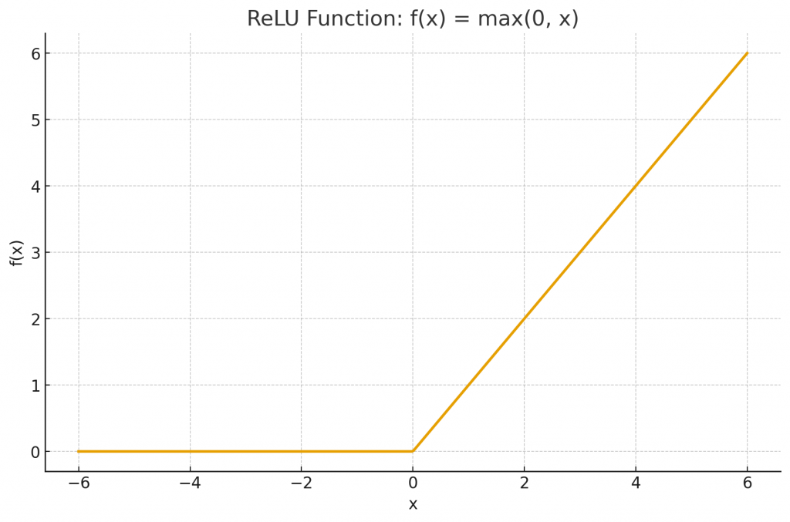

在上一章節提到的階梯函數中，由於在 0 的位置不可微，會導致在反向傳播過程中導數非常小甚至為 0。這樣一來，梯度在逐層傳遞時會不斷縮小最終幾乎消失。這種情況被稱為 `梯度消失（vanishing gradient）`。當梯度消失時，前層的權重幾乎無法更新，使得神經網路難以學到有效的特徵，讓我們先看看ReLU的公式。


在這一個公式中，它的導數x>0 時為 1，在 x≤0 時為 0，這表示在正區域中，梯度不會趨近於 0，能有效避免梯度消失問題，這時我們輸入層->隱藏層(使用ReLU)的公式是


2.隱藏層->輸出層
----------

而在隱藏層到輸出層時，常依任務性質選擇不同的激活函數，若是二分類問題，通常使用 sigmoid，因為它能將輸出壓縮到 (0,1)，自然解釋為正類的機率；若是多分類問題，則會使用 softmax，因為它能將輸出轉換成一個總和為 1 的機率分布，表示樣本屬於每一類的相對可能性。


在圖片中我們可以直觀的看到左邊是 Sigmoid 函數，輸入在 (−10,10) 區間，輸出壓縮在 (0,1)；右邊是 Softmax 函數，模擬三個類別的輸出，可以看到隨著輸入變化，三個類別的機率會動態分配，且總和始終為 1。兩者對應的公式如下

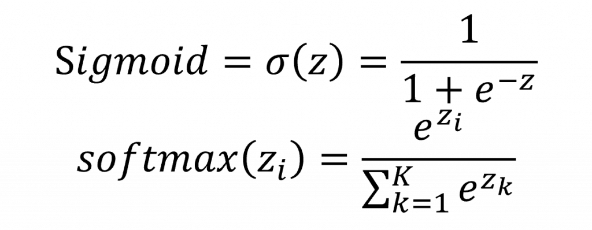

而在這裡我們使用Sigmoid，因此我們的隱藏層到輸出層的數學公式可以寫成


多層感知器的反向傳播
==========

在前巷傳播中我們的流程是輸入層(x)->隱藏層(h)->隱藏層激勵函數(a)->輸出層(z)->輸出層激勵函數(y)->損失函數，因此我們在反向傳播時需要將這個返回來計算，因此讓我們看看第一步，在這裡我們損失函數同樣是MSE Loss

1. 損失函數對輸出層激勵函數
---------------

首先計算損失對輸出層輸出的偏導，這一步是誤差的來源，代表我們要最小化的方向。


2. 損失函數對輸出層權重
-------------

接下來透過連鎖率展開，其中我們會使用到上一層的偏導結果。


3. 損失函數對隱藏層激勵函數
---------------

誤差往前傳，會傳到隱藏層激勵輸出(a)，這是輸出層誤差「回流」給隱藏層的梯度。

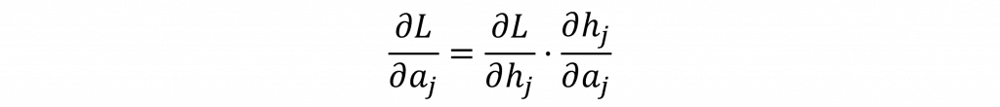

4. 損失函數對隱藏層權重
-------------

同樣使用連鎖率展開


5. 損失函數對輸入層權重
-------------

如果前面還有更深的層，誤差會繼續往前傳，形式會一直套用這就是「誤差反向傳遞」的一般公式。

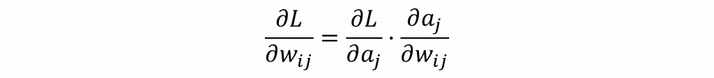

6.結合上述展開
--------

總結來說整個誤差傳遞可以用以下公式表示


這樣就得到了完整的反向傳播公式。其實你會發現我們只是將前向傳播的流程反過來計算，並一步步地帶入各個結果。當你理解了這一點後，就能夠自行推導出各種 AI 模型的傳播與訓練過程。

下集預告
====

今天我們透過數學公式與推導，完整的了解多層感知器的前向傳播與反向傳播流程，理解了梯度如何一層層回傳，讓模型能逐步修正權重。明天我將帶你實際用程式碼一步步實現這個過程，這時你將會發現，數學公式與程式碼是一一對應的，當理解了推導之後，實作就只是把公式「翻譯」成程式語言。到時候你會真正體會到模型是如何一步步學會的。

---

<a id="8357-day-06"></a>

## Day 06｜【Day 6】單層劃不開的謎題靠多層來解

- 原文：https://ithelp.ithome.com.tw/articles/10384245
- 發佈時間：2025-09-20 19:53:49

前言
==

在 Day 4 中，如果你嘗試將 OR 與 AND 換成其他邏輯閘，就會發現 XOR 與 XNOR 無法用單層感知器實現。原因是單層感知器的本質，其實就是在二維平面上劃出一條直線，把資料分開；然而 XOR 與 XNOR 的特性，並無法用單一直線完成區分。這也就是為什麼昨天提到的多層感知器特別重要，它能透過隱藏層增加非線性，使得模型能在更高維度的空間中進行分類，進而解決這類問題，而在今天我要來教你該如何用 NumPy 產生多層感知器的神經網路結構。

多層感知器辨別XOR
==========

1. 準備資料
-------

準備資料的方式與Day 4一樣，不過在這裡我們要將y_data給更換成XOR的邏輯，這樣才能進行監督是學習。

```lua
x_data = np.array([[0,0],[0,1],[1,0],[1,1]], dtype=float)
y_data = np.array([0,1,1,0], dtype=float)
```

2. 定義模型前向傳播
-----------

在建立神經網路模型時，**網路層數的加深會顯著提高對參數設定的敏感性**。若參數選擇不當，模型可能在訓練過程中出現無法收斂的情況，影響預測效果。在本次實作的多層感知器模型中，我們選用了 ReLU 作為隱藏層的激勵函數。由於 ReLU 的輸出特性會將所有小於零的數值歸零，因此在初始化偏置項時，我們刻意加入一個微小的正值，以減少`神經元死亡（Dead Neuron）`的風險，確保隱藏層的神經元仍能有效參與學習。

> 所謂「神經元死亡（Dead Neuron）」，是指在訓練過程中，某些使用 ReLU 激勵函數的神經元長期輸出為 0，進而無法參與誤差反向傳播，對模型的學習與預測毫無貢獻。

我們可以先定義 ReLU 與輸出層使用的 sigmoid 函數，讓後續模型建構時更加清楚前向傳播的過程。

```python
def relu(x):
    return np.maximum(0, x)

def sigmoid(x):
    x_clip = np.clip(x, -60, 60)
    return 1.0 / (1.0 + np.exp(-x_clip))
```

接下來在初始化權重時我們採用 `He 初始化方法（He initialization）`，這有助於保持訊息在前向傳播過程中的穩定性。He 初始化是專門為 ReLU 類激活函數設計的權重初始化方式，核心想法是由於 ReLU 會將一半輸入壓成 0，若不調整權重分佈，訊號的方差會在逐層傳遞時衰減，因此該設計的目的是經過 ReLU 後，讓輸出的方差大致與輸入保持一致，避免梯度消失或爆炸。

> He, K., Zhang, X., Ren, S., & Sun, J. (2015). Delving deep into rectifiers: Surpassing human-level performance on imagenet classification. In Proceedings of the IEEE international conference on computer vision (pp. 1026-1034).

```python
class MLP:
    def __init__(self, input_dim, hidden_dim):
        self.W1 = np.random.randn(input_dim, hidden_dim) * np.sqrt(2.0 / input_dim)
        self.b1 = np.full((1, hidden_dim), 0.01)  # 微小正值，避免神經元死亡
        self.W2 = np.random.randn(hidden_dim, 1) * np.sqrt(2.0 / hidden_dim)
        self.b2 = np.zeros((1, 1))

    def forward(self, X):
        self.x = X
        self.h_pre = X @ self.W1 + self.b1
        self.h = relu(self.h_pre)
        self.z = self.h @ self.W2 + self.b2
        self.y = sigmoid(self.z)
        return self.y

    __call__ = forward
```

而這樣的設計主要就能讓模型可以讓後續有更好的訓練基礎

2. 模型梯度計算
---------

同樣地我們會先逐步拆解出 ReLU 的梯度以及 Sigmoid 的梯度推導公式以方便後續使用。

```python
def relu_grad(x):
    g = np.zeros_like(x)
    g[x > 0] = 1.0
    return g

def sigmoid_grad(s):
    return s * (1.0 - s)
```

接下來我們將昨日推導出的反向傳播公式整合進模型中。但需要注意這次的設計是將計算梯度的邏輯直接寫在模型的內部方法中，這樣做可以讓參數的更新流程更為簡潔和集中。

```python
def compute_grads(self, y_true):
    # 均方誤差 (MSE)：L = (1/N) * sum((y - t)^2)
    y_true = y_true.reshape(-1, 1)
    y_pred = self.y
    N = y_pred.shape[0]

    # 計算 Loss 值
    loss_val = np.mean((y_pred - y_true) ** 2)

    # 反向傳播
    dy = (y_pred - y_true)
    dz = dy * sigmoid_grad(y_pred)

    dW2 = self.h.T @ dz
    db2 = np.sum(dz, axis=0, keepdims=True)

    dh = dz @ self.W2.T
    dh_pre = dh * relu_grad(self.h_pre)

    dW1 = self.x.T @ dh_pre
    db1 = np.sum(dh_pre, axis=0, keepdims=True)

    grads = {"dW1": dW1, "db1": db1, "dW2": dW2, "db2": db2}
    return grads, loss_val
```

3. 定義優化器(梯度下降法)
---------------

接下來，我們只需實作梯度下降法來更新模型參數。本模型中需要調整的參數包括輸入層到隱藏層的權重與偏差（W1 與 `b1`），以及隱藏層到輸出層的權重與偏差（`W2` 與 `b2`）。

```python
class GD:
    def __init__(self, model, lr=0.05):
        self.model = model
        self.lr = lr

    def step(self, grads):
        self.model.W2 -= self.lr * grads["dW2"]
        self.model.b2 -= self.lr * grads["db2"]
        self.model.W1 -= self.lr * grads["dW1"]
        self.model.b1 -= self.lr * grads["db1"]
```

4. 開始訓練模型並預測
------------

在這裡與先前相比變化不大，只是將 `compute_grads` 移入模型內部。這樣一來，模型在輸出時就不必再依賴內部參數來進行計算。我們只需將 `y_data` 傳入 `compute_grads`，就能透過優化器直接更新模型參數。

```go
epochs = 5000
for epoch in range(epochs):
    _ = model(x_data)
    grads = model.compute_grads(y_data)
    optimizer.step(grads)
    
print("訓練完成！")
y_pred = model(x_data)
print("Raw predictions:", y_pred.ravel())
print("Pred labels   :", (y_pred >= 0.5).astype(int).ravel())
print("True labels   :", y_data.astype(int))
```

輸出結果：

```less
訓練完成！
Raw predictions: [0.03090754 0.96877249 0.97453328 0.02507739]
Pred labels   : [0 1 1 0]
True labels   : [0 1 1 0]
```

由於我們的模型使用了 Sigmoid 函數作為輸出層的啟用函數，因此預測結果會被壓縮到 0 到 1 之間。正因如此，在進行分類判斷時，我們通常會以 0.5 作為分界點——大於 0.5 的視為正類（1），小於等於 0.5 的則歸為負類（0）。

而這樣子我們就可以看到，模型已經能學會處理比單層感知器更高維度、更複雜的預測結果，該模型不僅能解決 XOR 這類經典的非線性問題，它的設計理念也成為現今許多深度學習模型的重要基礎，這一點我們會在後續持續地看見其方式的身影。

下集預告
====

到目前為止，我們一步步推導出多層感知器如何解決 XOR 問題，從數學公式到 NumPy 實作都完整走過了一遍。雖然這樣能幫助我們理解深度學習的本質，但你可能也發現了 **光是手動推導梯度與更新規則，就已經相當繁瑣且耗時。如果每次要做更複雜的模型都得如此，效率會非常低。**

這也是為什麼我們需要更高效的深度學習框架。因此明天開始我將帶你安裝並使用 PyTorch，重新構建一次 MLP 模型來解決 XOR 問題。透過 PyTorch，你將能體驗到自動微分與高效訓練的便利，並大幅減少程式碼與數學推導的負擔。

---

<a id="8357-day-07"></a>

## Day 07｜【Day 7】PyTorch的威力， 20 行程式碼讓神經網路自己跑起來！

- 原文：https://ithelp.ithome.com.tw/articles/10384445
- 發佈時間：2025-09-21 15:49:11

前言
==

在當前人工智慧與深度學習的開發領域中，PyTorch 已逐漸成為最具影響力的主流框架之一。相較於早期由 Google 推出的 TensorFlow，PyTorch 以更貼近 Python 語言習慣的程式風格，讓研究人員與開發者能夠更直觀地進行模型構建與實驗。此外我們後續會介紹的 Hugging Face 也將 PyTorch 作為其主要架構基礎，可見其在業界的重要地位。

因此今天我們就來看看 PyTorch 的安裝方式與基本使用方法，幫助大家快速上手這個強大的深度學習工具。

Pytorch GPU安裝
=============

在安裝 PyTorch 的時候，如果直接輸入以下指令：

```undefined
pip install torch
```

那麼你安裝到的會是 **CPU 版本** 的 PyTorch，雖然CPU版本一樣能跑模型、做推論，但一旦遇到需要大量計算的大型深度學習模型或龐大的資料集，效能就會變得相當有限。為了真正發揮硬體的效能，建議改裝 **支援 GPU 的版本**來大幅加快訓練與推論的速度。

而安裝GPU的版本時，我們往往會因為個人設備不同驅動程式不同，因此我們需要根據以下步驟一步一步來正確的安裝Pytorch GPU版本。

1. 確認你的 CUDA 版本
---------------

首先我們需要知道你的顯示卡支援哪個版本的 CUDA。打開命令提示字元（CMD），輸入：

```undefined
nvidia-smi
```

接著畫面上會出現一張表格，會顯示你的 GPU 狀態與驅動資訊。在右上角就可以看到「CUDA Version」，這就是你目前可以使用的最高 CUDA 版本。

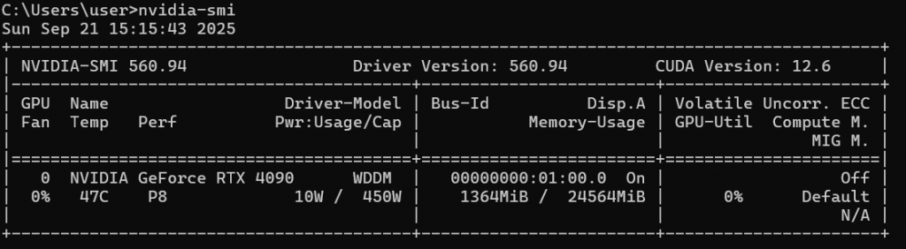

2. 前往 PyTorch 官方網站
------------------

打開瀏覽器進入 [PyTorch 官網](https://pytorch.org/)。你會看到一個安裝指令產生器（可以選擇你的作業系統、Package 管理工具、Python 版本，以及 CUDA 版本。

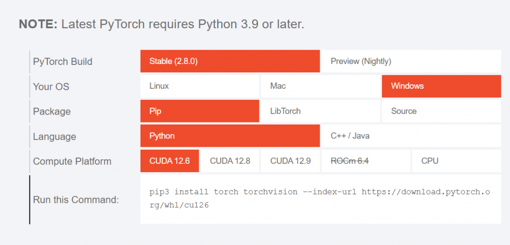

記得根據剛剛查到的 CUDA 版本來選擇對應的安裝方式，這樣才能順利使用 GPU。

3. 執行 GPU 版本安裝指令
----------------

假設你的 CUDA 版本是跟我一樣是12.6，則可以使用下列指令來安裝 GPU 版本的 PyTorch：

```perl
pip3 install torch torchvision --index-url https://download.pytorch.org/whl/cu126
```

如果你的 CUDA 版本不同，可以在剛剛的官網頁面中下拉選單選擇其他版本，網站會自動幫你產生對應的指令。

4. 確認安裝是否成功
-----------

安裝完成後，建議測試一下是否真的安裝了 GPU 版本的 PyTorch。在命令提示字元輸入：

```undefined
python
```

進入 Python 的互動模式後，再輸入以下兩行：

```python
import torch
torch.cuda.is_available()
```

如果回傳是 `True`，恭喜你，代表 PyTorch 已經可以正確使用你的 GPU 了，這樣子我們就能夠繼續下一階段的動作。

Pytorch建立DNN
============

現在讓我們根據Pytroch的方式修改昨天的模型訓練過程。

1.建立模型資料
--------

在 PyTorch 裡，模型的核心資料結構不是傳統的「矩陣」，而是更靈活的`張量（Tensor）`。這樣的設計並非隨意而為，其實藏著幾個關鍵的考量。簡單來說**矩陣本質上只是一種二維資料表現形式（由行和列構成）**，而**張量則是矩陣的延伸版本**，可以自由擴展到任意維度從一維、二維，到三維，甚至更高維的資料結構都能涵蓋。

這種靈活性讓我們能夠更自然地處理像影像、語音或時間序列這類多維資料，而不必被侷限在傳統線性代數的框架之中，而在程式碼中，其實與我們先前差不多，只不過改成使用了`torch.tensor`。

```ini
# 製作 XOR 資料
x_data = torch.tensor([[0., 0.],
                       [0., 1.],
                       [1., 0.],
                       [1., 1.]], dtype=torch.float32)
y_data = torch.tensor([0., 1., 1., 0.], dtype=torch.float32).view(-1, 1)
```

此外PyTorch 的張量不只是一種靜態資料容器，**它具備「自動微分」（autograd）功能，能即時追蹤和計算梯度**。這種設計大幅簡化了從資料建構、模型運算到訓練優化的整個流程，讓使用者無需在數據結構與運算邏輯之間來回切換。

2.建立模型與前向傳播
-----------

在 PyTorch 中建立模型時，其實我們只需要關注「前向傳播（forward）」的邏輯就好。你可能會注意到，`forward` 這個方法的名稱是**不能亂改的**。為什麼呢？因為當你呼叫模型本身（例如 `model(x)`）時，PyTorch 內部其實會自動呼叫 `forward()` 方法。這就有點像你自訂了 `__call__` 的行為一樣——如果你把 `forward` 改成其他名字，模型就找不到對應的前向傳播邏輯，直接報錯！

```python
class MLP(nn.Module):
    def __init__(self, input_dim=2, hidden_dim=4):
        super().__init__()
        self.fc1 = nn.Linear(input_dim, hidden_dim)
        self.fc2 = nn.Linear(hidden_dim, 1)
        
        # He 初始化權重 + 加上一點正偏置，避免 ReLU 神經元死掉
        nn.init.kaiming_normal_(self.fc1.weight, nonlinearity='relu')
        nn.init.constant_(self.fc1.bias, 0.01)
        nn.init.kaiming_normal_(self.fc2.weight, nonlinearity='linear')
        nn.init.zeros_(self.fc2.bias)

    def forward(self, x):
        h = F.relu(self.fc1(x))
        z = self.fc2(h)
        y = torch.sigmoid(z)
        return y

model = MLP(input_dim=2, hidden_dim=4)
```

這裡的 `fc1` 和 `fc2` 分別代表兩層線性轉換。`fc1` 是從輸入層到隱藏層，`fc2` 則是從隱藏層到輸出層。簡單來說，`nn.Linear()` 就是在幫你處理 `Wx + b` 這種線性運算，寫起來比手動計算來得簡潔許多，也讓模型架構一目了然。

所以只要搞懂 `forward()` 為什麼不能亂動，再加上幾層 `nn.Linear()` 結合你要的激勵函數，一個簡單的 MLP 模型就完成了！

3. 訓練模型
-------

在過去手動實作神經網路時，我們可能需要自己動手計算梯度，然後再更新權重。但幸好，PyTorch 幫我們省下了這些麻煩事。它有自動微分（autograd）系統，可以自動追蹤張量之間的運算過程，並在需要時自動計算梯度。

也就是說，我們只要從損失函數出發，PyTorch 就能幫我們沿著計算圖自動向後傳播誤差，計算出每個參數的梯度。接著再交給優化器去根據這些梯度來更新模型權重。首先我們得定義兩個關鍵元件：

```ini
criterion = nn.MSELoss()          # 與原版相同：MSE
optimizer = torch.optim.SGD(model.parameters(), lr=0.05)
```

在進入訓練過程前，先快速複習一下完整流程：

*   前向傳播：用模型計算預測結果。
*   計算損失：把預測值和實際值丟進損失函數。
*   反向傳播：從損失出發自動計算每個參數的梯度。
*   更新參數：優化器根據梯度調整模型的權重。

這一點在Pytorch上也相同，因此我們的程式碼可以如此撰寫

```csharp
# 訓練
# 訓練
epochs = 5000
for epoch in range(epochs):
    y_pred = model(x_data)            # Step 1: 前向傳播
    loss = criterion(y_pred, y_data)  # Step 2: 計算損失

    optimizer.zero_grad()             # Step 3a: 清空舊的梯度
    loss.backward()                   # Step 3b: 反向傳播，計算新的梯度
    optimizer.step()                  # Step 4: 更新模型參數
```

這裡有個超級關鍵但容易被忽略的小細節 `optimizer.zero_grad()`，為什麼我們每次都要先清掉梯度呢？

**因為 PyTorch 的預設行為是會累加梯度的！** 這樣的設計其實是有彈性的，方便我們做像是 mini-batch 或累積多次梯度的進階訓練策略。不過對於大多數情況來說，我們希望每次訓練時的梯度都是「全新的」，否則就會把上一次的梯度也加進來，導致權重更新錯誤，訓練結果就不準了。

與手刻神經網路相比PyTorch 真的是一大解脫，不但省去了繁瑣的數學運算與手動梯度推導，還讓整個訓練流程更直觀、易懂。這也正是為什麼我們只需要專注在「前向傳播」的設計上因為 PyTorch 會自動幫你處理後面的梯度計算與參數更新。

這樣的好處是什麼？就是當你開始接觸更複雜的模型時（像是 CNN、RNN、Transformer 等），你不會被一堆數學推導卡住，反而能夠聚焦在每一層的設計意圖與功能上。

下集預告
====

明天我們即將進入全新的模型架構`卷積神經網路（CNN）`。它其實是從我們熟悉的 Wx + b 線性變換邏輯所延伸出來的，只是設計上更適合處理像是影像這類具有空間結構的資料。

在接下來的章節裡，我會繼續透過 PyTorch 的框架，帶你一步步實作整個模型訓練流程。從資料前處理、模型建構，到訓練與預測，每一步我都會細細拆解。特別是在模型結構上，我們會繼續使用 `nn.Linear()` 搭配其他 PyTorch 元件，來打造出屬於你的完整神經網路。

可以說**這將會是我們整個 30 天深度學習系列中最核心的內容之一**。 透過這個單元，你不只會學會怎麼用 CNN 解決實際問題，也會真正理解每一層模型背後的運作邏輯。

準備好了嗎？從今天開始，我們要正式進入深度學習的主戰場。

---

<a id="8357-day-08"></a>

## Day 08｜【Day 8】卷積神經網路不是深度學習的「原創」？從影像處理出發的 AI 革命

- 原文：https://ithelp.ithome.com.tw/articles/10385289
- 發佈時間：2025-09-22 12:28:15

前言
==

當我們談到圖像深度學習第一個跳出來的技術名詞，往往就是 **CNN（Convolutional Neural Network）卷積神經網路**。這個架構幾乎成了影像識別與分類的代名詞，從自動駕駛到醫學影像分析，處處可見它的身影。

但如果我們把鏡頭拉遠一些，不難發現**CNN 的核心概念其實並非誕生於深度學習時代，而是深深植根於過去的影像處理與訊號分析傳統中。**

換句話說，CNN 與其說是 AI 的全新創造，不如說是「舊瓶裝新酒」：將早已有之的數學技術，如影像卷積、局部特徵提取，結合神經網路與反向傳播等深度學習的精華，再一次推向極致。

卷積從哪來？
======

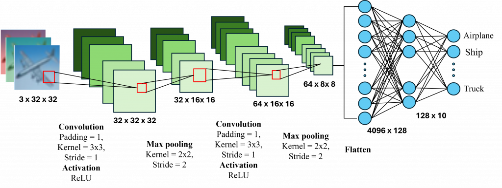

早在深度學習尚未崛起的年代`卷積（convolution）`就已經是影像處理界的基本功。不論是 **邊緣偵測、模糊處理、銳化濾鏡** 或是 **紋理強化**，都少不了這個數學工具的身影。

它的核心概念很簡單：使用一個小小的`濾波器（kernel）`，在圖片上滑動，針對周圍像素做加權運算。如下圖所示：


舉例來說，當我們用 **Sobel** 或 **Laplacian** 這類經典的邊緣偵測濾波器去掃描圖片時，只要碰到像素值變化劇烈的區域（例如物體邊界），便會產生強烈響應，讓邊緣浮現出來。這種技術，即便在沒有深度學習的時代，也早就是圖像分析的核心工具。

CNN 怎麼進行卷積？
===========

在卷積神經網路中，**卷積層（Convolution Layer）** 是整個架構的基礎，與傳統影像處理不同的是，CNN 不再仰賴人為設計的濾波器，而是讓系統「自己學」，學會該使用什麼樣的卷積核來辨認特徵，這些濾波器可以理解為 AI 的視覺「眼鏡」：

*   初階的濾波器可能只會辨識線條或角落；
*   中階的則能看出紋理、形狀；
*   高階的甚至可以抓出「眼睛」、「車輪」、「臉部輪廓」這類複雜圖樣。

而針對CNN的數學公式我們可以先看到以下寫法


這裡的 `X` 是輸入的`特徵圖（Feature Map）`，`K` 則是卷積核。運算方式就是簡單的`滑動視窗（Sliding Windows）`每次針對小區域的像素進行乘法加總，生成新的影像特徵。

圖解卷積的實際動作
=========

雖然數學公式能精確描述卷積操作，但對多數人來說，圖像化理解往往更直觀。因此我們不談複雜的運算式，而是用一張圖來說明整個卷積的邏輯：


### 1. 輸入影像的局部視窗

首先看圖左邊那個大格子。這代表的是原始輸入影像中的一小塊區域。你可以想像它是一張圖裡的某個「局部」，例如某隻貓咪耳朵上的一小塊畫素矩陣。這些數字代表像素的強度（通常是灰階或 RGB 數值），是電腦眼中「看見」影像的方式。這樣的格子稱為特徵圖的一部分。

### 2. 卷積核（濾波器）

接下來中間的小格子就是所謂的卷積核(也常被稱為濾波器)，這個小小的矩陣裡面裝的是一組數字權重，它們的功能就像是一副特定的眼鏡——可能專門用來偵測邊緣、水平線、紋理等等。而這些權重是 CNN 自己學出來的。

### 3. 逐元素相乘與加總

現在這個濾波器會疊在原始影像的某個區塊上。它們之間會一一對應，也就是每個位置的像素值，會和濾波器對應位置的權重值相乘。完成這一輪逐元素相乘後，接下來會把所有的乘積加總起來。這個加總結果，就是這次濾波後的輸出值。

用白話說這個數字反映了原始影像在這個區塊裡，有多符合濾波器關注的特徵，你可以把它想像成一個圖像掃描器或偵測器，會專注在某一種視覺特徵上。

### 4. 像拼圖一樣滑動整張圖

濾波器不會只做一次操作，它通常是往右移一格或往下移一格，然後在每一個新的位置上，重複剛才的乘法與加總步驟，這個「滑動」的動作，稱為捲積運算中的`步長（stride）`。透過這種方式，整張輸入圖就會被掃過一遍。

### 5. 產生特徵圖

每一次滑動產生的輸出值，會被放到一個新的矩陣中。這些數值組成的結果，就是所謂的`特徵圖（Feature Map）`。這張特徵圖是 CNN 對原圖的一次詮釋，會強調出原圖中符合濾波器特徵的區塊。

例如這個濾波器專門抓水平邊緣，那麼在有邊緣的地方，特徵圖上會出現高值；反之則是低值或零。可以說，CNN 就是透過這一層層的特徵圖疊加，逐步抽象出圖像中的重要資訊。

池化層
===

在 CNN 的架構中，除了卷積層之外，另一個不可或缺的角色就是 `池化層（Pooling Layer）`。它的功能可以被視為一種資訊的濃縮器，**用來簡化資料，同時保留最具代表性的特徵**。具體來說池化可以降低特徵圖的尺寸，進而減少模型的運算負擔；它也能過濾掉多餘的細節與雜訊，讓神經網路聚焦在關鍵特徵上。

此外池化還具有強化「平移不變性」的效果，意思是即使影像中的物體稍微位移、旋轉或變形，模型仍能正確辨識出相同的特徵，其中最常見的是`最大池化（Max Pooling）`與`平均池化（Average Pooling）`。


如圖中顯示**最大池化會在小區塊中取出數值最大的那個，聚焦於最強烈的特徵訊號**；而**平均池化則取該區塊中的平均值，使特徵圖整體趨於平滑**，兩者本質上都是為了讓網路在保留關鍵訊息的同時，降低圖像維度與計算成本。

全連接層
====

經過前面的卷積與池化步驟後CNN已經完成了它的任務，它抽取了像是邊緣、紋理、形狀，甚至更抽象的高階概念，但接下來，一個問題浮現了：**我們該如何根據這些特徵，做出具體的判斷？** 這個答案就是`全連接層（Fully Connected Layer）`。

所謂全連接其實就是我們的DNN，只不過接收的是特徵圖，而該層也是在 CNN 中進行「決策」的地方。例如，當我們訓練一個用來分類狗、貓、人臉的模型時，前面的卷積層與池化層負責抽取特徵，而全連接層則會根據這些特徵值，最終輸出「這張圖是哪一類」的判斷結果。

> 在實作上 **CNN 中的特徵圖會先被攤平成一維向量，再送入一個或多個全連接層進行加權計算**，並搭配**激勵函數（如 ReLU、Sigmoid 或 Softmax）**產出最終輸出。

簡單來說，卷積層與池化層像是圖像的觀察者，而全連接層則是做決定的人。這三者各司其職，構成了一個能夠學習、理解並判斷視覺資訊的完整神經網路架構。

下集預告
====

到這裡，我們已經完整理解了 CNN 的基本架構從卷積層如何提取特徵、池化層如何濃縮資訊、到全連接層如何完成分類判斷。明天我們將透過一個實際的圖像分類任務，一步步帶你用 PyTorch 從零建構 CNN 架構，讓你親手實踐今天所學的內容。

不只是學理更是實戰！但一旦動手實作，就會變得具體而清晰。

---

<a id="8357-day-09"></a>

## Day 09｜【Day 9】60% 準確率只是起點用 CNN 與 CIFAR-10 探索深度學習優化之路

- 原文：https://ithelp.ithome.com.tw/articles/10386111

前言
--

在深度學習的實務應用中，圖像數據的處理與模型的優化是非常重要的環節。今天將帶你了解如何在 Python 中讀取圖像，並且利用 PyTorch 進行模型的訓練、優化與儲存，同時解釋訓練、驗證、測試資料集的差異與使用場警，最終告訴你該如何觀察損失值來評估模型的表現。

CIFAR-10 是電腦視覺領域中非常經典的影像資料集，包含 10 個類別（如飛機、汽車、貓、狗等）。每張圖片的大小為 32×32 的彩色影像。在進行深度學習任務時，輸入資料的理解與處理是關鍵的一環，因此我們首先要學會如何在 PyTorch 中正確準備資料集。

1. 定義資料正規化方法
------------

在深度學習的影像處理任務中，「正規化」是一個關鍵步驟。它的主要目的，是讓輸入數據的數值範圍保持一致。以常見的影像資料來說，像素值原本落在 `[0, 255]` 之間，而透過正規化，我們會將這些值縮放至 `[0, 1]` 或 `[-1, 1]` 的範圍。這麼做不只是為了美觀的數據分佈，更能有效提升模型訓練的穩定性，減少像是梯度爆炸或梯度消失等常見問題，也能加速優化器的收斂速度。

在 PyTorch 框架中，`torchvision` 是一個非常實用的套件，不僅能快速下載如 CIFAR-10 等常用的影像資料集，還內建支援資料增強與標準化的功能。在載入資料之前，我們可以先定義好一組轉換方式，例如以下這段程式碼：

```
import torch
import torchvision
import torchvision.transforms as transforms

# 定義影像轉換流程，包括 Tensor 化與正規化
transform = transforms.Compose([
    transforms.ToTensor(),
    transforms.Normalize((0.5, 0.5, 0.5), (0.5, 0.5, 0.5))  # 將像素值縮放至 [-1, 1]
])
```

這裡的 `Normalize` 函式會針對每個顏色通道（紅、綠、藍）分別進行正規化。這個處理除了提升數據一致性外，也能減少不同通道之間因尺度差異所導致的學習偏差。換句話說，模型在這樣的條件下，更能「公平」地學習各種影像特徵。整體來看正規化不僅讓訓練過程更穩定高效，也有助於模型在面對不同光照或色彩變化的情境時，展現更好的泛化能力。

2. 載入訓練資料集
----------

**載入與處理資料集**是訓練模型的重要前置步驟。我們使用 `torchvision.datasets.CIFAR10` 套件來下載 CIFAR-10 資料集，並搭配前面設定好的 `transform` 進行資料預處理，確保圖片在進入模型前已具備良好格式與特徵分佈。

```
# 下載完整訓練集（共 50,000 張），再進一步拆分為訓練集與驗證集
full_train = torchvision.datasets.CIFAR10(
    root='./data', train=True, download=True, transform=transform
)

train_size = int(0.9 * len(full_train))   # 90% 作為訓練資料
val_size   = len(full_train) - train_size # 剩餘 10% 作為驗證資料
trainset, valset = random_split(full_train, [train_size, val_size])

trainloader = DataLoader(trainset, batch_size=64, shuffle=True,  num_workers=0)
valloader   = DataLoader(valset,   batch_size=64, shuffle=False, num_workers=0)
```

在預處理階段，我們將原始的訓練資料拆分為兩個子集：**訓練集（train）**與**驗證集（validation）**，它們在模型訓練過程中扮演著不同角色：

*   **訓練集**：用來調整模型參數，讓模型學習圖片與對應標籤之間的關聯。
*   **驗證集**：雖然來自同一批資料，但在訓練過程中不參與模型學習，主要用來檢查模型是否過擬合，並協助調整超參數。

這樣的劃分方式能幫助我們更有系統地控制訓練流程，進一步提升模型的泛化能力。除了訓練與驗證之外，在更嚴謹的實驗或比賽中，通常還會使用第三組資料：**測試集（test）**。測試集完全不參與模型訓練，只在模型訓練結束後用來評估最終的性能表現，模擬模型在實際應用中的預測效果。

| 資料類型 | 功能 | 是否用於訓練 | 是否打亂順序 |
| --- | --- | --- | --- |
| 訓練集 | 學習模型參數 | ✅ 是 | ✅ 是 |
| 驗證集 | 監控訓練過程、調整模型 | ❌ 否 | ❌ 否 |
| 測試集 | 最終模型評估 | ❌ 否 | ❌ 否 |

我們也同樣下載了測試資料集：

```
# 載入測試資料集（共 10,000 張）
testset = torchvision.datasets.CIFAR10(
    root='./data', train=False, download=True, transform=transform
)
testloader = torch.utils.data.DataLoader(
    testset, batch_size=64, shuffle=False, num_workers=0
)
```

在程式中，資料的讀取與分批由 **`DataLoader`** 負責。由於一次將所有資料送入模型會超出 GPU 記憶體限制，因此透過 mini-batch 的方式，每次僅處理部分資料，不僅有效率，也利於模型收斂。

而`DataLoader` 也支援 **資料隨機化（shuffle）**。在訓練階段開啟 `shuffle=True` 可以避免模型過度記住資料順序，提高泛化能力；而在驗證與測試階段則關閉隨機化，以確保結果的穩定性與可重現性。

3. 建立 CNN 模型
------------

對於初學者來說，在設計卷積神經網路時，最常見的疑問之一莫過於：**每一層的輸入與輸出尺寸到底是怎麼算出來的？那全連接層的參數數量又該如何推導？** 要釐清這些問題，我們得從最基本的輸入特徵結構與各層之間的轉換邏輯談起。

就拿本次資料集來說，每張圖像的尺寸都是固定的：

```
(Height=32, Width=32, Channels=3)
```

也就是說，原始影像的格式為 `(H, W, C)`。不過在 PyTorch 的卷積層中，模型預期的張量格式則是 `(C, H, W)`。幸好這樣的轉換在 `torchvision.datasets.CIFAR10` 裡已經幫我們處理好了，所以不必手動調整。而實際訓練時，資料通常會以「批次」的形式餵給模型，因此整體的輸入格式會變成：

```
(Batch_size, Channels, Height, Width) → (N, C, H, W)
```

這種設計使得模型能夠分別處理 R、G、B 三個顏色通道，也就是說進而在不同的色彩維度中萃取出關鍵特徵，因此我們可以這樣設計模型架構：

```
import torch.nn as nn
import torch.nn.functional as F

class Net(nn.Module):
    def __init__(self):
        super(Net, self).__init__()
        self.conv1 = nn.Conv2d(3, 6, 5)     # 第一層卷積：從 RGB 三通道轉成 6 個特徵圖
        self.conv2 = nn.Conv2d(6, 16, 5)    # 第二層卷積：再從 6 個特徵圖提取出 16 個
        self.fc1 = nn.Linear(16 * 5 * 5, 120)  # 第一層全連接，輸入來自 flatten 後的特徵圖
        self.fc2 = nn.Linear(120, 84)
        self.fc3 = nn.Linear(84, 10)        # 最終輸出對應 10 個分類

    def forward(self, x):
        x = F.max_pool2d(F.relu(self.conv1(x)), 2)
        x = F.max_pool2d(F.relu(self.conv2(x)), 2)
        x = x.view(-1, 16 * 5 * 5)          # 將三維特徵圖展平
        x = F.relu(self.fc1(x))
        x = F.relu(self.fc2(x))
        x = self.fc3(x)                     # 最後一層直接輸出 logits
        return x
```

在進入全連接層前，有一個重要的細節需要注意：**`16 × 5 × 5`** 這個數字到底怎麼來的？它其實是前面經過兩次卷積與池化操作後，最後一層輸出特徵圖的維度計算結果。我們可以透過以下的數學公式來推導每一層輸出大小

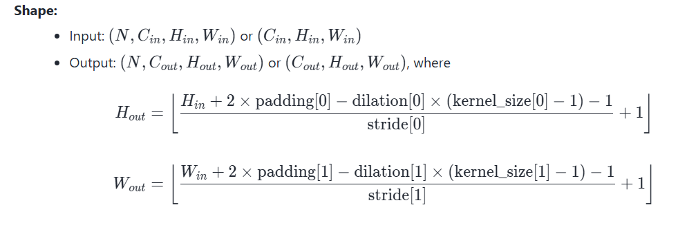

具體的過程可以整理成一張表：

| 層級 | 輸入尺寸 | 輸出尺寸 |
| --- | --- | --- |
| conv1 | (3, 32, 32) | (6, 28, 28) |
| maxpool1 | (6, 28, 28) | (6, 14, 14) |
| conv2 | (6, 14, 14) | (16, 10, 10) |
| maxpool2 | (16, 10, 10) | (16, 5, 5) |
| flatten | - | 400 |
| fc1 | 400 | 120 |
| fc2 | 120 | 84 |
| fc3 | 84 | 10 |

而經過這樣的轉換後，我們會得到 16 張大小為 5×5 的特徵圖。這就是為什麼在進入第一個全連接層時，我們需要先把三維的 `(16, 5, 5)` 展平成一個長度為 400 的向量，作為後續神經網路層的輸入來源。

4. 模型訓練流程與最佳模型保存
----------------

而這次訓練的核心目標，是根據驗證集的表現來監控模型學習進度，並在表現最優時儲存對應的參數設定。由於本次任務屬於分類問題，因此我們選擇了常見的損失函數 `交叉熵損失（CrossEntropyLoss）`，而優化器則採用 `隨機梯度下降法（SGD）`，並加入`動量（momentum）`來加速收斂。

```
import torch.optim as optim

criterion = nn.CrossEntropyLoss()  # 分類任務標配的損失函數
optimizer = optim.SGD(net.parameters(), lr=0.001, momentum=0.9)  # 可調整學習率與動量
```

而正常的訓練中通常會在每個訓練週期使用訓練集資料更新模型權重，再透過驗證集來觀察泛化能力，而這樣的設計是為了早偵測是否發生過擬合，並在訓練過程中或是後續的驗證查看模型訓練是否產生Overfitting的問題。

```
import torch
import matplotlib.pyplot as plt

device = torch.device("cuda" if torch.cuda.is_available() else "cpu")
net.to(device)

num_epochs = 20
best_val_loss = float('inf')

train_losses, val_losses = [], []

for epoch in range(num_epochs):
    # -------- Training --------
    net.train()
    running_loss = 0.0
    for inputs, labels in trainloader:
        inputs, labels = inputs.to(device), labels.to(device)

        optimizer.zero_grad()
        outputs = net(inputs)
        loss = criterion(outputs, labels)
        loss.backward()
        optimizer.step()

        running_loss += loss.item()

    # -------- Validation --------
    net.eval()
    val_loss = 0.0
    correct, total = 0, 0
    with torch.no_grad():
        for inputs, labels in valloader:
            inputs, labels = inputs.to(device), labels.to(device)
            outputs = net(inputs)
            loss = criterion(outputs, labels)
            val_loss += loss.item()

            _, predicted = torch.max(outputs, 1)
            total += labels.size(0)
            correct += (predicted == labels).sum().item()

    avg_train_loss = running_loss / len(trainloader)
    avg_val_loss = val_loss / len(valloader)
    val_acc = 100 * correct / total

    train_losses.append(avg_train_loss)
    val_losses.append(avg_val_loss)

    print(f"Epoch [{epoch+1}/{num_epochs}] "
          f"Train Loss: {avg_train_loss:.4f} "
          f"Val Loss: {avg_val_loss:.4f} "
          f"Val Acc: {val_acc:.2f}%")

    # -------- Save Best Model --------
    if avg_val_loss < best_val_loss:
        best_val_loss = avg_val_loss
        torch.save(net.state_dict(), "best_cifar10_model.pth")
        print(">> Model saved with Val Loss:", best_val_loss)

# -------- Plotting Training Curve --------
plt.figure(figsize=(10, 5))
plt.plot(range(1, num_epochs+1), train_losses, label='Train Loss')
plt.plot(range(1, num_epochs+1), val_losses, label='Validation Loss')
plt.xlabel('Epoch')
plt.ylabel('Loss')
plt.title('Training and Validation Loss Curve')
plt.legend()
plt.grid(True)
plt.show()
```

輸出結果：

```
...
Epoch [15/20] Train Loss: 1.1974 Val Loss: 1.2446 Val Acc: 55.56%
>> Model saved with Val Loss: 1.2446476824675934
Epoch [16/20] Train Loss: 1.1670 Val Loss: 1.2554 Val Acc: 55.52%
Epoch [17/20] Train Loss: 1.1447 Val Loss: 1.2216 Val Acc: 56.44%
>> Model saved with Val Loss: 1.2215879235086562
Epoch [18/20] Train Loss: 1.1205 Val Loss: 1.1978 Val Acc: 58.04%
>> Model saved with Val Loss: 1.1978471565850173
Epoch [19/20] Train Loss: 1.1039 Val Loss: 1.1918 Val Acc: 57.80%
>> Model saved with Val Loss: 1.1918227981917466
Epoch [20/20] Train Loss: 1.0851 Val Loss: 1.1921 Val Acc: 57.70%
```

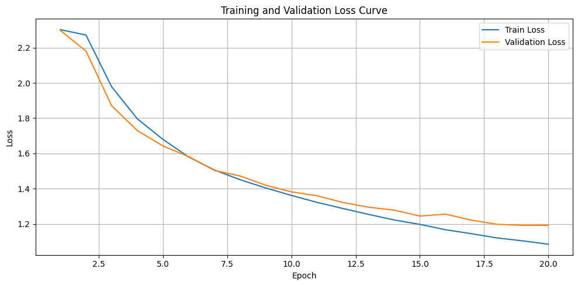

在訓練過程中，我們可以透過程式碼自動在驗證損失下降時保存模型，並繪製損失曲線圖來觀察模型的學習狀況。當我們看到**訓練損失持續下降**，就表示模型正在一步步學會資料中的特徵；如果**驗證損失也跟著下降**，那代表模型不只記住訓練資料，還能在新資料上有不錯的表現，顯示出良好的泛化能力。不過在訓練後期，若出現**訓練損失持續下降，但驗證損失開始上升**的情況，就要小心這可能是過擬合。遇到這種狀況時，可以考慮提早停止訓練，或是透過更換優化器、修改模型架構、加入正則化或資料增強等方法來改善。

5. 測試與使用模型
----------

當模型訓練告一段落，接下來最關鍵的，就是進行最終測試。我們只需要載入訓練期間表現最好的模型權重，接著透過測試資料看看它在真實環境下的表現如何。

```
# 載入訓練期間表現最佳的模型
best_model = Net().to(device)
best_model.load_state_dict(torch.load("best_cifar10_model.pth", map_location=device))
best_model.eval()
```

這邊我們會用先前準備好的 `testloader` 來進行測試。理論上如果模型沒有發生 overfitting，那它在測試集上的準確率應該會和驗證集差不多。反之，如果測試結果落差很大，那就有可能是訓練過程中出了些狀況——可能是資料分布不平均，也有可能是模型架構或訓練方式需要重新檢視。現在就讓我們實際測試看看成果如何吧：

```
import torch
import torch.nn as nn

criterion = nn.CrossEntropyLoss()

test_loss = 0.0
correct, total = 0, 0

best_model.eval()
with torch.no_grad():
    for inputs, labels in testloader:
        inputs, labels = inputs.to(device), labels.to(device)
        outputs = best_model(inputs)
        loss = criterion(outputs, labels)
        test_loss += loss.item()

        _, predicted = torch.max(outputs, 1)
        total += labels.size(0)
        correct += (predicted == labels).sum().item()

avg_test_loss = test_loss / len(testloader)
test_acc = 100.0 * correct / total
print(f"[Test] Loss: {avg_test_loss:.4f}  |  Acc: {test_acc:.2f}%")
```

輸出結果如下：

```
[Test] Loss: 1.1549  |  Acc: 59.14%
```

從結果可以看出，我們的模型最終達到了大約 60% 的準確率。雖然不是特別高，但這其實也代表模型已經進入了收斂狀態換句話說，它已經學到了它目前能學到的最佳表現。那接下來呢？這就是深度學習中最有挑戰性的部分了：如何更進一步優化模型。

這時候我們可以開始探索像是：

*   改良模型架構（例如引入更深的卷積層、使用正規化技巧）
*   使用資料增強（Data Augmentation）來擴充訓練資料的多樣性
*   嘗試不同的學習率策略或優化器

每一個微小的改動，都有可能讓模型再往上突破一點點。雖然這條路沒有捷徑，但每一次的測試與調整，都是朝著更成熟的人工智慧邁進的重要一步。

下集預告
----

訓練的流程基本上大同小異，目前我們都是透過手動的 for 迴圈來跑完整個訓練過程，包括訓練、驗證、測試，還有手動儲存表現最好的模型。這種做法雖然能讓我們一目了然每個細節，但隨著模型變得越來越複雜、需要測試的超參數組合越來越多，這樣的方式就顯得冗長且不易維護。

因此從明天開始，我們會動手打造一個通用的 Trainer 類別，讓整個訓練流程變得更有系統。我們希望能把訓練邏輯包裝成一個模組化、可重複使用的工具，讓後續不論是改模型、換資料集，甚至更新章節內容，都可以沿用同一套訓練器。這樣一來，我們可以把重心放回在「模型的設計與優化」上，而不是被大段樣板程式碼拖住進度。

---

<a id="8357-day-10"></a>

## Day 10｜【Day 10】用一支「通用訓練器」打天下逐行理解開源Trainer的內容

- 原文：https://ithelp.ithome.com.tw/articles/10386818

前言
--

今天終於進入第 10 天的學習了！雖然我們已經準備好了資料與模型，但卻還不太清楚如何將整個訓練流程封裝成一個乾淨、可重複使用的訓練器。一般來說一個基礎的 `Trainer` 類別至少需要具備以下功能：完整的訓練/驗證迴圈、最佳模型的保存機制、`Early Stopping（提前停止）`、學習率排程器，甚至還要能處理 LoRA 的載入與保存。接下來我會分段說明這些設計的考量，以及為什麼必須這樣做。

這支訓練器在解決什麼問題？
-------------

簡單來說我們今天的內容就是要**把「單個 Epoch 內要完成的工作」與「跨 Epoch 之間需要比較或保存的工作」清楚拆開**。在這樣的設計下，訓練器應該提供：

*   可插拔的資料載入器（`train_loader`、`valid_loader`）
*   任意的模型與最佳化器（`model`、`optimizer`）
*   可選擇性啟用的學習率排程器（`scheduler`）
*   Early Stopping 與最佳權重保存（支援 general / LoRA 兩種模式）
*   訓練與驗證損失的可視化

也就是說這樣的訓練器就是一個樣板化事務的自動化框架，你只需要準備好資料並丟進來，其餘的重複性流程都能交給它處理，大幅減少額外的程式碼負擔。

在設計訓練器的時候，第一步就是把所有「可能會變動的東西」都丟進 `__init__`，這樣之後要改參數或實驗就不用大改程式。

```
class Trainer:
    def __init__(self, epochs, train_loader, valid_loader, model, optimizer,
                 device=None, scheduler=None, early_stopping=10, save_dir='./checkpoints',
                 load_best_model=False, grad_clip=None, is_lora=False):
        self.epochs = epochs
        self.train_loader = train_loader
        self.valid_loader = valid_loader
        self.optimizer = optimizer
        self.scheduler = scheduler
        self.early_stopping = early_stopping
        self.load_best_model = load_best_model
        self.grad_clip = grad_clip
        self.is_lora = is_lora

        if device is None:
            self.device = torch.device('cuda' if torch.cuda.is_available() else 'cpu')
            print('Using device:', self.device)
        else:
            self.device = device

        self.model = model.to(self.device)

        self.save_dir = save_dir
        self.save_name = 'best_model.ckpt'
        if not os.path.exists(self.save_dir):
            os.makedirs(self.save_dir)
```

這裡我特別考慮了三個問題：

*   裝置選擇：GPU 還是 CPU？

在深度學習裡，GPU 幾乎是標配，因為它能大幅加速矩陣運算。不過這裡還有一個容易忽略的細節，當 PyTorch 在 GPU 上報錯時訊息往往很模糊，會讓人不知道是哪個層或張量出了問題。

相較之下放在 CPU 上執行，雖然速度慢但錯誤訊息更清晰。因此我在設計 `Trainer` 的時候，把 `device` 留作可選參數，如果使用者沒有指定就自動檢查 CUDA 是否可用，能用就跑 GPU，否則退回 CPU。這樣的設計兼顧效能與除錯便利。

### **LoRA 模型保存與載入的分流**

`LoRA（Low-Rank Adaptation）`是一種高效的微調方法，**它的特點是只訓練小部分權重，而不是整個大模型**，這也導致它的保存與載入方式和一般模型不太一樣一般模型可以直接 `torch.save(model.state_dict())`，但 LoRA 模型則需要透過 Hugging Face 的 `peft` 套件，僅保存 adapter 權重，並在載入時附加到基礎模型上。

為了兼容這兩種情境，我在 `Trainer` 的初始化裡增加了一個布林參數 `is_lora`，讓保存與載入流程能夠自動分流，不需要使用者額外操心。

### **學習率排程器**

固定學習率往往不是最佳選擇，若設得過高模型容易震盪甚至無法收斂；設得過低則可能導致訓練進展緩慢，甚至停留在某個`次佳解（local minimum）`。這正是 **學習率排程器（Scheduler）** 。

它存在的理由就是能根據訓練進度動態調整學習率。常見做法包括：`StepLR` 每隔幾個 epoch 將學習率乘上一個係數、`CosineAnnealingLR` 讓學習率以餘弦函數方式週期性下降、`ReduceLROnPlateau` 則在驗證表現停滯時才降低學習率。

這樣的設計能幫助模型在陷入次佳解時，透過調整學習率跳脫卡住的區域，從而提升最終的收斂效果。此外Scheduler 也分為兩種更新頻率：有些在 **每個 step** 更新，有些則在 **每個 epoch** 更新。因此在 `Trainer` 中，我只保留一個 `scheduler` 參數，讓使用者自由決定要採用哪一種策略。

> 在訓練器的設計中，我也加入了一些輔助功能來提升實用性。像是 **`early_stopping`**，可以設定當模型在驗證集上連續若干個 epoch 沒有進步時就自動停止訓練。接著是 **`save_dir` / `save_name`**，用來統一管理模型檔案的保存位置，避免不同實驗互相覆蓋。**`load_best_model`** 則決定在訓練結束後，是否要自動載入表現最佳的權重，省去手動切換的麻煩。最後還有 **`grad_clip`**，這是梯度裁剪的設定，用來防止梯度爆炸，特別是在訓練深層模型時非常實用。

單一訓練迴圈的方式
---------

在訓練模型時，使用 `self.model.train()` 是為了啟用訓練模式，確保像 `BatchNorm` 和 `Dropout` 這些特定模組能正確運作，這兩個模組在訓練和推論時的行為不同：

*   **BatchNorm**：訓練時根據每個 mini-batch 的數據進行標準化，幫助模型更快收斂；推論時則使用訓練期間累積的統計值，以避免結果不穩定。
*   **Dropout**：訓練時會隨機關閉部分神經元，降低過擬合風險；推論時則保留所有神經元提供穩定輸出。

所以我們在訓練與驗證時需要透過 `model.train()` 和 `model.eval()` 的切換，讓模型在不同階段用對的方式運作，確保訓練有效、推論穩定。

```
def train_epoch(self, epoch):
    train_loss = 0
    train_pbar = tqdm(self.train_loader, position=0, leave=True)
    self.model.train()

    for input_datas in train_pbar:
        self.optimizer.zero_grad()
        input_datas = {k: v.to(self.device) for k, v in input_datas.items()}
        outputs = self.model(**input_datas)
        loss = outputs[0]
        loss.backward()

        if self.grad_clip is not None:
            torch.nn.utils.clip_grad_norm_(self.model.parameters(), self.grad_clip)

        self.optimizer.step()

        if self.scheduler is not None:
            self.scheduler.step()

        train_pbar.set_description(f'Train Epoch {epoch}')
        train_pbar.set_postfix({'loss': f'{loss.item():.3f}'})

        train_loss += loss.item()

    return train_loss / len(self.train_loader)
```

由於我們無法確定模型使用的損失函數或輸入資料格式，因此採用兩個做法來增加彈性：

1.   **模型回傳損失值**，方便後續處理；
2.   **用 `dict` 傳入輸入參數**，例如 `{k: v.to(self.device) for ...}`，這樣寫法簡潔，能確保每個張量都正確移到指定設備上，避免遺漏。

此外為了防止梯度爆炸，我們用 `clip_grad_norm_` 來限制梯度大小，而學習率則透過排程器動態調整，每個 batch 更新一次，根據設定來決定更新時機（step 或 epoch），讓訓練過程更穩定靈活。

乾淨的驗證流程
-------

在驗證階段，許多訓練時需要的設定其實都不再需要。此時我們只需要模型具備基本的前向傳播功能，因此會透過 `self.model.eval()` 將模型切換到驗證模式，確保像 Dropout、BatchNorm 這類模組能以推論時的行為運作。

```
def validate_epoch(self, epoch):
    valid_loss = 0
    valid_pbar = tqdm(self.valid_loader, position=0, leave=True)
    self.model.eval()

    with torch.no_grad():
        for input_datas in valid_pbar:
            input_datas = {k: v.to(self.device) for k, v in input_datas.items()}
            outputs = self.model(**input_datas)
            loss = outputs[0]
            valid_pbar.set_description(f'Valid Epoch {epoch}')
            valid_pbar.set_postfix({'loss': f'{loss.item():.3f}'})
            valid_loss += loss.item()

    return valid_loss / len(self.valid_loader)
```

而通常為了提升推理效率，還會搭配 `torch.no_grad()` 停用梯度運算，這麼做可以節省記憶體並加快運算速度，因為驗證過程中並不需要進行反向傳播或更新權重。

主回圈進行Early Stopping 與最佳權重保存
---------------------------

在模型訓練中有幾個實用的技巧能提升效果與效率。首先是 `Early Stopping`，透過計數器 `stop_cnt` 追蹤驗證表現是否持續進步。**只要連續幾個 epoch 沒有改善，就會提前停止訓練**，這不僅能有效避免過擬合，還能節省時間與資源。

接著是昨日提到的最佳權重保存，每當 `valid_loss` 出現新低時就會立即覆蓋並儲存目前的模型狀態，但要注意在使用 LoRA 時會是要透過 `save_pretrained()` 儲存，若是一般模型則採用 `state_dict()` 方式。

```
def train(self, show_loss=True):
    best_loss = float('inf')
    loss_record = {'train': [], 'valid': []}
    stop_cnt = 0

    for epoch in range(self.epochs):
        train_loss = self.train_epoch(epoch)
        valid_loss = self.validate_epoch(epoch)

        loss_record['train'].append(train_loss)
        loss_record['valid'].append(valid_loss)

        # Save best model
        if valid_loss < best_loss:
            best_loss = valid_loss
            if self.is_lora:
                self.model.save_pretrained(self.save_dir)
            else:
                save_path = os.path.join(self.save_dir, self.save_name)
                torch.save(self.model.state_dict(), save_path)
            print(f'Saving Model With Loss {best_loss:.5f}')
            stop_cnt = 0
        else:
            stop_cnt += 1

        print(f'Train Loss: {train_loss:.5f} | Valid Loss: {valid_loss:.5f} | Best Loss: {best_loss:.5f}\n')

        if stop_cnt == self.early_stopping:
            msg = "Model can't improve, stop training"
            print('-' * (len(msg) + 4))
            print(f'| {msg} |')
            print('-' * (len(msg) + 4))
            break

    if show_loss:
        self.show_training_loss(loss_record)

    if self.load_best_model:
        if self.is_lora:
            from peft import PeftModel
            self.model = PeftModel.from_pretrained(self.model, self.save_dir)
            print(f'Best LoRA model loaded from {self.save_dir}')
        else:
            best_model_path = os.path.join(self.save_dir, self.save_name)
            self.model.load_state_dict(torch.load(best_model_path))
            print(f'Best model loaded from {best_model_path}')
```

而我們若設定 `load_best_model=True`，訓練結束後會自動載入表現最好的模型，方便後續的測試操作。

繪製損失曲線看趨勢
---------

這部分和昨天的做法一樣，我們可以透過繪製曲線圖來觀察訓練與驗證的損失變化。如果你是在 Colab 或 Jupyter Notebook 上操作，這樣的圖表呈現已經非常直觀且實用。

```
def show_training_loss(self, loss_record):
    train_loss, valid_loss = [i for i in loss_record.values()]
    plt.plot(train_loss)
    plt.plot(valid_loss)
    plt.title('Training Loss')
    plt.ylabel('Loss')
    plt.xlabel('Epoch')
    plt.legend(['train', 'valid'], loc='upper left')
    plt.show()
```

不過注意一點若是在命令列介面（CLI）或遠端伺服器上訓練就建議將圖表儲存成檔案（使用 `plt.savefig()`），或者輸出到像 TensorBoard 或 Weights & Biases 這類工具中做更進一步的視覺化與紀錄，這樣會較為方便查看時實的動態。

以下是將原本的教學以更完整、條理清晰的文章形式呈現，適合用作部落格、筆記或專案說明文件：

* * *

AMP、自動混合精度、梯度累積與多指標支援
---------------------

在深度學習的訓練過程中，**隨著模型規模與資料量的提升，計算效能與記憶體使用變得越來越關鍵**。因此我們還可以這麼的優化現有的訓練器。

1. 自動混合精度（AMP: Automatic Mixed Precision）
-----------------------------------------

AMP 是 PyTorch 提供的功能，讓你能在不犧牲模型精度的情況下，自動在 float16 與 float32 之間切換，顯著加速訓練，並節省 GPU 記憶體。我們可以在在 `train_epoch` 函式中，修改訓練 loop。

```
scaler = torch.cuda.amp.GradScaler()

with torch.cuda.amp.autocast():
    outputs = self.model(**input_datas)
    loss = outputs[0]

scaler.scale(loss).backward()
if self.grad_clip is not None:
    scaler.unscale_(self.optimizer)
    torch.nn.utils.clip_grad_norm_(self.model.parameters(), self.grad_clip)
scaler.step(self.optimizer)
scaler.update()
```

2. 梯度累積（Gradient Accumulation）
------------------------------

在實際訓練中，如果因 GPU 記憶體限制無法使用較大的 batch size，那麼使用 `optimizer.zero_grad()` 搭配梯度更新的傳統方式可能會導致訓練不穩定。這時，`梯度累積（gradient accumulation）`是一種非常實用的技巧。

其核心概念是將多個小 batch 的梯度累加起來，等累積一定步數後再進行一次參數更新。這樣就能模擬大 batch 的效果，同時避免顯存爆炸。

```
accumulate_steps = 4
for step, input_datas in enumerate(train_pbar, start=1):
    ...
    (loss / accumulate_steps).backward()
    if step % accumulate_steps == 0:
        optimizer.step()
        optimizer.zero_grad()
```

在這裡，`accumulate_steps` 設為 4，代表每 4 個 mini-batch 才更新一次權重，而每次的 loss 都會除以 4 以保持梯度的 scale 一致。

3. 多指標回傳與模型保存策略
---------------

在驗證階段，我們當然可以根據任務需求靈活地更換評估指標。實際上你可能希望同時計算多個指標（如 Accuracy、F1-score、BLEU 等），以更全面地觀察模型表現。而一個實用的做法是在 `validate_epoch()` 中建立一個包含多項指標的 `metrics` 字典。

```
def validate_epoch(self, ...):
    metric_dict = {
        "accuracy": ...,
        "f1": ...,
        "loss": ...
    }
    return metric_dict
```

接著在訓練主流程中，你可以指定其中某個主指標作為儲存模型的依據

```
val_metrics = self.validate_epoch(...)
main_metric = val_metrics["f1"]
if main_metric > self.best_score:
    self.best_score = main_metric
    self.save_model()
```

雖然 AMP、梯度累積與多指標支援等技巧能有效提升訓練效率，也確實讓模型開發流程更加穩定且具可擴展性，但對我而言，這類設計其實也帶來了更多超參數的調整成本，進一步增加了實作的複雜度。

因此在實務上，我並不常主動採用這些擴充技巧，除非有明確的需求，例如希望縮短訓練時間，或在資源受限下提升表現。這類情境下，再引入這些優化手段，通常能顯著改善整體專案的品質與效率。

下集預告
----

明天我會帶你實作如何使用 `nn.Linear()` 建立像 RNN 這樣的神經網路，並在後續的所有章節都會透過我們自定義的 `Trainer` 啟動訓練流程。這個 `Trainer` 的設計其實與後續會使用的 Hugging Face 訓練架構是相容的，因此非常值得理解怎麼撰寫。未來你也可能會擴充資料增強、分布式訓練、AMP/Apex、自定義評估指標等等。但只要有了這個 `Trainer`路就算鋪好了剩下的，就是你在這基礎上，慢慢搭建屬於自己的訓練方式。

---

<a id="8357-day-11"></a>

## Day 11｜【Day 11】賦予 WX+b 時序感知力神經網路如何理解過去與未來

- 原文：https://ithelp.ithome.com.tw/articles/10387444
- 發佈時間：2025-09-25 09:11:03

前言
==

現在做資料分析或機器學習，選模型這件事真的很重要。除了那些大家常聽到的分類、回歸這類基本模型，其實還有一種比較特別的模型，它專門拿來處理時間序列資料。

這類資料的特性在於，**數據之間是有時間順序的**，前後資料會互相影響不是單純的靜態資訊。像是股票走勢、氣象預報，甚至是病患的心跳紀錄甚至是文字，都是典型的時間序列。如果用傳統模型來處理這些資料，往往會忽略時間的關聯性，導致效果不佳。所以這些專門為時間序列設計的模型就變得越來越重要，也越來越常被拿來解決這類問題。而今天我就會來告訴你該怎麼從DNN延伸到時間序列模型

RNN
===

在我們日常生活中最常見的時間資料就是文字，因為文字是有順序、有上下文的，簡單來說，**前面出現的詞會影響後面詞的理解**。想要讓模型搞懂這種時間上的連續性，我們得用一種會記憶的網路結構，而 `RNN（Recurrent Neural Network）`就是基於這一點而成的。


RNN 的核心想法其實不難，它用一個叫 `隱藏層狀態(hidden state)` 的東西，把前面時間步的資訊傳到下一步。每看到一個詞，就把它轉成向量，再結合上一個隱藏層狀態做些運算，更新出新的隱藏層狀態，你可以把它想成是一張小小的便條紙，從句子開頭一路寫到結尾，記錄下語意的脈絡。


當我們從數學的角度來看這個過程，可以把它拆成兩個部分第一部分是計算當前時間點的輸入 `x(t)`，而第二部分則是處理之前幾個時間點所累積的隱藏層狀態。這兩個結果會被結合起來，然後透過 tanh 這個激勵函數把值壓縮在 -1 到 1 之間。簡單來說就是把輸入和保留下來的記憶狀態拿來做一個 Wx 加上 b 的運算。

在這裡我們使用 `nn.Linear` 來自行建造一個 RNN 模型，讓你更直觀地理解數學概念：

```python
class LinearTanhRNN(nn.Module):
    def __init__(self, input_size, hidden_size, output_size):
        super().__init__()
        # 輸入 -> 隱層
        self.i2h = nn.Linear(input_size, hidden_size, bias=True)
        # 前一隱狀態 -> 隱層
        self.h2h = nn.Linear(hidden_size, hidden_size, bias=True)
        # 隱層 -> 輸出
        self.h2o = nn.Linear(hidden_size, output_size, bias=True)

        self.hidden_size = hidden_size
```

首先我們理解一下數學公式，在每一層輸入的 `o(t)` 都是由 `i2h` 與 `h2h` 這兩個 Wx+b 運算構成的，因此我們首先要定義這兩個 `nn.Linear`。而最終的輸出通常會在最後加入一個 `h2o`，這個作法是為了將整個複雜的網路做線性運算，這和我們在 CNN 結尾接上全連接層的概念是一樣的。

```python
def forward(self, x, h0=None):
        B, T, _ = x.shape
        # 初始化隱狀態
        h = x.new_zeros(B, self.hidden_size) if h0 is None else h0
        for t in range(T):    # 逐時間步展開
            # 線性累加後做 tanh 非線性
            h = torch.tanh(self.i2h(x[:, t, :]) + self.h2h(h))
        # 輸出層：將最後隱狀態投影到目標維度
        y_last = self.h2o(h)
        return y_last, h
```

在前向傳播方面，我們需要初始化一個隱狀態的單元，這個單元會提供模型初始的隱藏資訊（畢竟在 x(0) 的時候還沒有任何記憶）。接著我們用一個 for 迴圈，逐步取出時間序列的每個時間步進行運算。由於我們的輸入是三維的`（batch_size, seq_len, feature）`，所以使用 `seq_len` 作為時間長度進行迴圈運算。這個流程就是最簡單的時序模型原型。

LSTM
====

LSTM 可以把它想成替 RNN 裝上一條能長距離搬運訊息的「傳送帶」，名字叫 cell state。每一步模型先決定要把舊資料擦掉多少，再決定新東西要不要寫進傳送帶，最後才決定當下要露出哪一部分當成輸出。因為 cell state 的更新以加法為主，不是層層相乘，所以重要訊號不會在長序列裡被稀釋到幾乎看不見，梯度也比較能往回傳。


直觀地說，追劇追到第十季時，你不會把第一季的所有細節硬背在腦中而是留下一本長期筆記。每一集先把過時的備註劃掉再把新的劇情補進去，輪到要回答朋友問題時才翻出相關段落。LSTM 就是把這三步學起來忘多少、寫多少、秀多少。對應到數學式就是先算出三個 0 到 1 的比例，再用一個候選內容去更新筆記，最後把更新後的筆記過一層非線性變成當前的隱狀態，他基本上可以歸類以下幾個元件。

*   遺忘門：負責刪掉沒用的舊資訊


*   輸入門：決定要不要寫入新資訊


*   輸出門：控制要輸出哪些東西


*   Cell State: 記憶管理


LSTM 裡面數學式很多，邏輯有點像你在過濾郵件該刪的就丟掉，重要的就留下來，最後再決定要不要回覆，而同樣的我們一樣用`nn.Linear()`展開，讓你更直觀的理解LSTM在做些什麼。

```python
import torch
import torch.nn as nn
import torch.nn.functional as F

class LinearTanhLSTM(nn.Module):
    def __init__(self, input_size, hidden_size, output_size):
        super().__init__()
        H = hidden_size

        # x 路徑（含 bias_ih）
        self.x_i = nn.Linear(input_size, H, bias=True)
        self.x_f = nn.Linear(input_size, H, bias=True)
        self.x_g = nn.Linear(input_size, H, bias=True)
        self.x_o = nn.Linear(input_size, H, bias=True)

        # h 路徑（含 bias_hh）
        self.h_i = nn.Linear(H, H, bias=True)
        self.h_f = nn.Linear(H, H, bias=True)
        self.h_g = nn.Linear(H, H, bias=True)
        self.h_o = nn.Linear(H, H, bias=True)

        # 輸出層
        self.h2o = nn.Linear(H, output_size, bias=True)
        self.hidden_size = H
```

用程式碼讀起來也很直白，每個時間步把輸入 `x` 和前一刻的隱狀態 `h` 各丟進四個線性層，得到四組向量，再套上 `sigmoid` 或 `tanh`。`i` 表示寫入比例，`f` 表示遺忘比例，`g` 是候選內容，`o` 決定要輸出多少。

```python
def forward(self, x, h0=None, c0=None):

        B, T, _ = x.shape
        H = self.hidden_size
        device = x.device

        h = torch.zeros(B, H, device=device) if h0 is None else h0
        c = torch.zeros(B, H, device=device) if c0 is None else c0

        for t in range(T):
            xt = x[:, t, :]

            i = torch.sigmoid(self.x_i(xt) + self.h_i(h))
            f = torch.sigmoid(self.x_f(xt) + self.h_f(h))
            g = torch.tanh(   self.x_g(xt) + self.h_g(h))
            o = torch.sigmoid(self.x_o(xt) + self.h_o(h))

            c = f * c + i * g
            h = o * torch.tanh(c)

        y_last = self.h2o(h)
        return y_last, (h, c)
```

而其餘計算也與RNN相似，差別在於要將cell state與隱狀態更新也就是`c = f*c + i*g`，`h = o*tanh(c)`。這樣一來關鍵資訊可以沿著 `c` 這條通道跨很多步而不崩壞，`h` 則負責提供當下的可見表徵，同樣地最後丟進 `h2o` 產生你要的輸出大小即可。

而LSTM最大的問題其實就是運算速度過慢，每一個 `cell` 都要等上一個 `h_t, c_t` 算完才能動，等於把整條序列綁在一個長 for 迴圈裡，而GPU 最怕這種細碎依賴鏈很長的工作，每步只做幾個中小型矩陣乘法，且核心限制仍在「下一步必須等上一步」，因此後續雖然有著結構相似用於改善速度的GRU，但種結構性問題是沒辦法解決此類問題的。

下集預告
====

明天我們將運用今天介紹的 LSTM 模型，來捕捉句子中那些細微卻關鍵的語意轉折。你將看到一段文字如何被模型逐層拆解、理解，再被重組成一種「機器的詮釋」。**這將引領你正式踏入自然語言處理（NLP）的領域**，並親手構建一個情緒分析器，體驗從數據到洞察的完整流程。

---

<a id="8357-day-12"></a>

## Day 12｜【Day 12】「你真的懂LSTM嗎？」手刻雙向LSTM讓你從不會到秒懂！

- 原文：https://ithelp.ithome.com.tw/articles/10388170

前言
--

昨天你學過 LSTM但你肯定還搞不清楚它到底在做什麼，而今天我會帶你從零手刻一個雙層 LSTM，並套用在經典的 IMDB 影評情緒分類任務中。這篇重點不在於訓練出一個超強、超快的模型，而是幫你搞懂 LSTM 的真正運作邏輯與自然語言處理的最基礎，從Embedding、到手動實作 forward 傳播流程，通通自己動手來一遍。

而今天重點會在 Padding 怎麼處理才不會影響模型學習？為何要自己 Embedding 是在幹嘛用的？BiLSTM 又是怎麼同時捕捉前後文語意的？透過完整拆解與 PyTorch 實作，我們要的不只是會用，而是真正理解每一層背後的運算邏輯與設計。

IMDB 資料集是情感分析任務中最經典的語料之一，通常包含兩欄：一欄是使用者撰寫的電影評論（`review`），另一欄是該評論的情感標籤（`sentiment`），標示為 `positive` 或 `negative`。

我們之所以能從中分析情緒，是因為使用者在撰寫評論時往往會自然表達感受，例如「好看」、「無聊」等詞語隱含了正面或負面的情緒傾向。這些語言特徵能被電腦模型學習，透過大量標註資料建立語意與情感之間的對應關係，進而判斷新評論的情緒屬性。

檔案連結：[點我](https://github.com/AUSTIN2526/learning-wx-b-in-30-days)

1. 準備資料集
--------

因此第一步就是對資料進行前處理，其中我們需要將這些文字標籤轉換成數值型態，例如把 `positive` 映射成 1，`negative` 映射成 0，這樣做的目的是為了讓模型能夠計算損失函數，而在這裡由於我把檔案轉換成csv文件，因此我們會使用 `pandas` 來讀取其檔案，並用`values`轉換成numpy格式。

```
import pandas as pd

df = pd.read_csv('imdb_data.csv')
reviews = df['review'].values
sentiments = df['sentiment'].values
sentiments = (sentiments == 'positive').astype(int)  # positive→1, negative→0
print(f'review: {reviews[0][:30]}...\nsentiment label：{sentiments[0]}')
```

> 在資料前處理方面，雖然建議先移除評論中的 HTML 標籤或特殊換行符號，以提升模型的穩定性與表現，但由於這在本任務中並非重點，因此此處先略過相關處理。

2. 使用 Tokenizer
---------------

接下來我們要讓文字變成電腦看得懂的格式，也就是把它轉成 ID 序列。這裡我們直接用 Hugging Face 提供的 `AutoTokenizer`，選的是 `bert-base-uncased` 這個模型所搭配的 **WordPiece** 斷詞器（有時候大家口語上會叫它 BPE，但嚴格來說 BERT 用的是 WordPiece），這個 tokenizer 會幫你做好以下事情：

1.   它會把不認得的`單字(Word)`拆成`子詞(subword)`；
2.   自動加上模型需要的特殊標記（此章節用不到)
3.   也會幫你自動做截斷和 padding，讓每筆資料長度一致。

簡單來說就是一句話丟進去，它會處理好一切，把東西變成模型可以使用的格式。

```
from transformers import AutoTokenizer

tokenizer = AutoTokenizer.from_pretrained("bert-base-uncased")
input_datas = tokenizer(
    reviews[:2].tolist(),
    max_length=10,
    truncation=True,
    padding="longest",
    return_tensors='pt'
)

print('Tokenizer 輸出:')
print(input_datas)
print('還原文字:')
print(tokenizer.decode(input_datas['input_ids'][0]))
print(tokenizer.decode(input_datas['input_ids'][1]))
```

當我們把句子丟進 `tokenizer` 後，它會輸出像這樣的結果：

```
Tokenizer輸出:
{'input_ids': tensor([[  101, 22953,  2213,  4381,  2152,  2003,  1037,  9476,  4038,   102],
        [  101, 11573,  2791,  1006,  2030,  2160, 24913,  2004,  2577,   102]]), 
 'token_type_ids': tensor([[0, 0, 0, 0, 0, 0, 0, 0, 0, 0],
                          [0, 0, 0, 0, 0, 0, 0, 0, 0, 0]]), 
 'attention_mask': tensor([[1, 1, 1, 1, 1, 1, 1, 1, 1, 1],
                           [1, 1, 1, 1, 1, 1, 1, 1, 1, 1]])}
```

這裡的 `input_ids` 就是把原始文字轉成了一串 ID，也就是模型可以理解的形式。像 `[CLS]` 是 101、`[SEP]` 是 102每個單字或子詞也會對應到唯一的編號。`token_type_ids` 則是用來區分兩個句子的標記（像做句子配對任務時會用到），而 `attention_mask` 則是用來告訴模型哪些位置是實際的字哪些只是 padding。而當我們用 `decode()` 還原這些 ID，可以看到結果像這樣：

```
還原文字:
[CLS] bromwell high is a cartoon comedy [SEP]
[CLS] homelessness ( or houselessness as george [SEP]
```

通常我們會加上像 `truncation=True`、`padding="longest"` 這類參數，是為了讓每筆輸入長度一致、不會爆記憶體，又能有效利用資源。而 `decode(...)`中如果不想看到[CLS]、[SEP]被還原出來還可以加上 `skip_special_tokens=True`，還可以讓還原結果更乾淨，看起來就像單純的原始句子。

3. 建立 DataLoader
----------------

這是我們第一次真的動手做 DataLoader，所以邊做邊解釋一下。PyTorch 裡的 `Dataset` 是用來定義一筆資料長什麼樣子，而 `DataLoader` 則是負責怎麼把多筆資料湊成一個 batch。

在用 DataLoader 的時候它會先透過 `__getitem__` 回傳原始的文字跟標籤，再透過 `__len__` 來知道整筆資料有多長，判斷什麼時候跑完。通常除了 `Dataset` 跟 `DataLoader`，我們還會搭配 `collate_fn` 一起用。

這個 `collate_fn` 的功能就是在每次組 batch 的時候，可以動態地處理資料，像是做 padding 或是隨機資料增強之類的操作都會放在這裡。所以我們這邊也是把**真正的斷詞放在 `collate_fn` 裡面做**，這樣可以一次處理整個 batch 的文本。

```
from sklearn.model_selection import train_test_split
from torch.utils.data import Dataset, DataLoader
import torch

class IMDB(Dataset):
    def __init__(self, x, y, tokenizer):
        self.x = x
        self.y = y
        self.tokenizer = tokenizer

    def __getitem__(self, index):
        return self.x[index], self.y[index]
       
    def __len__(self):
        return len(self.x)
```

至於 `collate_fn` 的實際做法，其實就是根據 `__getitem__` 回傳的 `(text, label)` 把資料拿出來做進一步處理。在這裡我們會先把文字轉成張量，然後把 `[CLS]` 跟 `[SEP]` 這兩個 token 拿掉（這兩個是什麼意思我們後面會講），只留下中間的 token。最後我們會回傳一個字典，裡面包含 `input_ids` 跟 `labels`。

為什麼要用字典格式呢？因為我們在 Day 10 做的訓練器設計是動態的，也就是說它會根據這些 key 自動抓對應的輸入來餵模型。所以這邊這兩個欄位，剛好就是模型訓練時要用的兩個輸入。

```
def collate_fn(self, batch):
        batch_x, batch_y = zip(*batch)
        ids = self.tokenizer(
            batch_x,
            max_length=128,
            truncation=True,
            padding="longest",
            return_tensors='pt'
        ).input_ids
        # 移除 [CLS] 與 [SEP]（通常在頭尾）
        input_ids = ids[:, 1:-1]
        labels = torch.tensor(batch_y, dtype=torch.long)
        return { 'input_ids': input_ids, 'labels': labels }
```

在切分資料跟建立 DataLoader 的時候，**為什麼在 Windows 上 `num_workers` 一定要設成 0 呢？**

因為 Windows 跑`多線程（multi-processing）`預設是用 spawn 的方式開子程序，簡單來說就是它會重新執行一次主程式。如果你的程式沒有包在 `if __name__ == "__main__":` 裡就很容易整個炸掉，出現奇怪的錯誤。

```
x_train, x_valid, y_train, y_valid = train_test_split(
    reviews, sentiments, train_size=0.8, random_state=46, shuffle=True
)

trainset = IMDB(x_train, y_train, tokenizer)
validset = IMDB(x_valid, y_valid, tokenizer)

valid_loader = DataLoader(
    validset, batch_size=32, shuffle=True, num_workers=0,
    pin_memory=True, collate_fn=validset.collate_fn
)
train_loader = DataLoader(
    trainset, batch_size=32, shuffle=True, num_workers=0,
    pin_memory=True, collate_fn=trainset.collate_fn
)
```

當然如果你之後是在 Linux 或 WSL 環境下跑的話，就可以放心把 `num_workers` 調高，加速資料載入速度。

4. 手刻 Embedding
---------------

在自然語言處理（NLP）中，**Embedding 是一個非常關鍵的模型層**。它的本質其實就是一張「`vocab_size × emb_dim`」的表格，也可以想成是一個詞彙查詢表。每個 token（詞或字）對應到表格中的一列向量，而這個向量的長度就是 `emb_dim`，通常是模型設定的參數。

這些向量在一開始是隨機初始化的，也就是說每個 token 剛開始都只是亂數對應到某個位置。但在模型訓練的過程中，這些向量會不斷被調整。最終模型會學到讓**語意相近的 token 對應到相近的向量**，也就是說，它能幫助模型理解詞與詞之間的語意關係。

你可以把 Embedding 想成一個查表的機制只要輸入 token 的 ID，就能快速查到對應的語意向量，而這張表不只是存資料，更會隨著模型學習自動調整。在實作的時候有個小細節要特別注意：為了讓每個 batch 裡的句子長度一樣，我們會在比較短的句子後面補上一些 padding token。但這些 padding 其實只是拿來對齊格式，**它們本身沒有任何語意**。

所以當我們把這些 token 丟進 embedding 裡時，不能讓它們產生真正的特徵值。也就是說，padding 對應的那一列向量應該是全 0，而且在訓練過程中也不能被更新。

```
import torch
import torch.nn as nn
import torch.nn.functional as F

class MyEmbedding(nn.Module):
    def __init__(self, num_embeddings, embedding_dim, padding_idx=None):
        super().__init__()
        self.weight = nn.Parameter(torch.empty(num_embeddings, embedding_dim))
        self.padding_idx = padding_idx
        nn.init.normal_(self.weight, mean=0.0, std=embedding_dim ** -0.5)
        if padding_idx is not None:
            with torch.no_grad():
                self.weight[padding_idx].zero_()
            # 確保反傳不更新 padding 列
            self.weight.register_hook(self._zero_pad_grad)
```

為了做到這件事，我們會幫模型加一個小小的 hook，裡面用 `_zero_pad_grad` 這個做法，在反向傳播的時候手動把 `padding_idx` 對應那一列的梯度清成 0。像是 `self.weight[padding_idx].zero_()` 這行，就是確保這個 padding 向量一開始就是 0，而且以後也不會被動到。這樣模型在訓練時就不會誤以為 padding 有什麼實際意義，能讓學到的語意表示更乾淨。

```
def _zero_pad_grad(self, grad):
        if self.padding_idx is None:
            return grad
        grad = grad.clone()
        grad[self.padding_idx].zero_()
        return grad
```

```
def forward(self, input_ids):  # [B,T] -> [B,T,E]
        out = self.weight[input_ids]
        if self.padding_idx is not None:
            mask = (input_ids == self.padding_idx).unsqueeze(-1)
            out = out.masked_fill(mask, 0.0)
        return out
```

> 那有人可能會問，這跟直接用 nn.Embedding 有什麼不一樣？ 其實我們這邊手動實作，是為了讓大家更清楚地看到怎麼處理 padding_idx，還有搭配 mask 的邏輯。畢竟這些細節在實際應用中很重要，理解原理才能靈活調整。但如果是實務上其實直接用 PyTorch 內建的 nn.Embedding(num_embeddings, embedding_dim, padding_idx=...) 就可以了，不用自己手動寫。

5.建立單向 LSTM（忽略 padding 版）
-------------------------

padding token 沒有實際語意，那麼對於像 LSTM 這種一個時間步一個時間步處理的模型，我們該怎麼讓它**跳過 padding 呢？**這邊我們就用昨天的 LSTM進行改寫讓大家看得更清楚。

```
class LinearTanhLSTMCore(nn.Module):
    def __init__(self, input_size, hidden_size):
        super().__init__()
        H = hidden_size
        self.x_i = nn.Linear(input_size, H, bias=True)
        self.x_f = nn.Linear(input_size, H, bias=True)
        self.x_g = nn.Linear(input_size, H, bias=True)
        self.x_o = nn.Linear(input_size, H, bias=True)

        self.h_i = nn.Linear(H, H, bias=True)
        self.h_f = nn.Linear(H, H, bias=True)
        self.h_g = nn.Linear(H, H, bias=True)
        self.h_o = nn.Linear(H, H, bias=True)

        self.hidden_size = H

        for m in self.modules():
            if isinstance(m, nn.Linear):
                nn.init.xavier_uniform_(m.weight)
                nn.init.zeros_(m.bias)
```

因此我們要看forward時每個時間步我們都會看一下當下這個 token 是不是 padding，這是靠 `mask` 來判斷的。有效的 token 對應到 `mask` 裡是 1，padding 的地方則是 0。

```
def forward(self, x, mask=None, h0=None, c0=None):
        B, T, _ = x.shape
        H = self.hidden_size
        device = x.device

        h = torch.zeros(B, H, device=device) if h0 is None else h0
        c = torch.zeros(B, H, device=device) if c0 is None else c0

        if mask is None:
            mask = torch.ones(B, T, dtype=torch.bool, device=device)

        for t in range(T):
            xt = x[:, t, :]
            valid = mask[:, t].unsqueeze(1).to(x.dtype)  # [B,1] 1.0 有效, 0.0 padding

            i = torch.sigmoid(self.x_i(xt) + self.h_i(h))
            f = torch.sigmoid(self.x_f(xt) + self.h_f(h))
            g = torch.tanh(   self.x_g(xt) + self.h_g(h))
            o = torch.sigmoid(self.x_o(xt) + self.h_o(h))

            c_new = f * c + i * g
            h_new = o * torch.tanh(c_new)

            # 只在有效 token 上更新狀態
            h = valid * h_new + (1.0 - valid) * h
            c = valid * c_new + (1.0 - valid) * c

        return h, (h, c)
```

所以我們在更新 LSTM 的狀態（hidden state 跟 cell state）時，就能根據這個 `mask` 決定要不要更新。如果是 padding，那我們就**保留原本的狀態**，不讓它參與學習。這樣模型就能專注在真正有內容的部分，不會被 padding 影響。簡單來說就是在每個時間步都問一句：「這個 token 有沒有意義？」如果沒有，就當作沒看到，LSTM 的狀態維持原樣不變。

> 同樣的這樣的做法雖然不是最快的，只是為了展示基礎原理，在實務上如果要快可以搭配Pytorch的 PackedSequence 或其他更進階的做法來優化。

6.結合雙單向 LSTM（BiLSTM）
--------------------

當我們在處理自然語言時，一個詞的意思常常不只是看它本身，而是要搭配前後文一起理解。但如果模型只能從頭讀到尾，就可能錯過那種「看到後面才恍然大悟」的情況。這時候，雙向 LSTM（BiLSTM）就派上用場了。它的做法是一邊用正向 LSTM 從前面讀過去，一邊用反向 LSTM 從後面讀回來，然後把這兩邊的資訊合起來，讓模型能同時抓住上下文的意思。

這時候如果我們只用單向的 LSTM，也就是模型**只能從左讀到右**（正向），那它就只能看到目前 token 的過去，沒辦法預測或理解後面可能發生的事。

而在實作方式上我們可以用剛剛建立的兩個 `LinearTanhLSTMCore`各自跑完，把兩個 LSTM 的最後 hidden state 接起來最後丟進一個全連接層，做二分類任務

```
class BiLSTMClassifier(nn.Module):
    def __init__(self, vocab_size, emb_dim, hidden_size, num_classes=2, padding_idx=0, dropout=0.2):
        super().__init__()
        self.embed = MyEmbedding(vocab_size, emb_dim, padding_idx=padding_idx)
        self.fwd = LinearTanhLSTMCore(emb_dim, hidden_size)
        self.bwd = LinearTanhLSTMCore(emb_dim, hidden_size)
        self.dropout = nn.Dropout(dropout)
        self.fc = nn.Linear(hidden_size * 2, num_classes)
        nn.init.xavier_uniform_(self.fc.weight)
        nn.init.zeros_(self.fc.bias)
        self.padding_idx = padding_idx
        self.criterion = nn.CrossEntropyLoss()  # 二分類用 CE 配 2-logits

    def forward(self, input_ids, labels=None):  # input_ids: [B,T], labels: [B]
        mask = input_ids != self.padding_idx               # [B,T] bool
        x = self.embed(input_ids)                          # [B,T,E]

        h_fwd, _ = self.fwd(x, mask=mask)                  # [B,H]
        x_rev = torch.flip(x, dims=[1])
        mask_rev = torch.flip(mask, dims=[1])
        h_bwd, _ = self.bwd(x_rev, mask=mask_rev)          # [B,H]

        h_cat = torch.cat([h_fwd, h_bwd], dim=1)           # [B,2H]
        logits = self.fc(self.dropout(h_cat))              # [B,2]

        loss = None
        if labels is not None:
            loss = self.criterion(logits, labels)          # labels: int64 in {0,1}
        return loss, logits

model = BiLSTMClassifier(
    vocab_size=len(tokenizer),
    emb_dim=256,
    hidden_size=128,
    num_classes=2,
    padding_idx=tokenizer.pad_token_id or 0,
    dropout=0.2
)
```

這裡我們把 loss 放在輸出的第 0 個位置，預測結果放在第 2 個位置，這樣設計是為了配合我們之前設定好的訓練器。另外，輸入的 `input_ids` 跟 `labels` 的名稱也不能亂改，因為這些名稱是根據 Dataloader 產生的索引來對應資料的。如果換了名字，整個流程就對不上了。

7.使用 Trainer 訓練
---------------

到了這一步我們就是把資料跟模型交給你現成提供的 Trainer 來訓練就好。至於優化器的部分，直接用大家最常用的 Adam 起手式就可以了簡單又夠用。

```
from trainer import Trainer
import torch.optim as optim

optimizer = optim.Adam(model.parameters(), lr=1e-3)
trainer = Trainer(
    epochs=100,
    train_loader=train_loader,
    valid_loader=valid_loader,
    model=model,
    optimizer=optimizer,
)
trainer.train(show_loss=false)
```

輸出結果：

```
Train Epoch 0: 100%|██████████| 1250/1250 [17:25<00:00,  1.20it/s, loss=0.487]
Valid Epoch 0: 100%|██████████| 313/313 [01:19<00:00,  3.96it/s, loss=0.249]
Saving Model With Loss 0.44163
Train Loss: 0.50866 | Valid Loss: 0.44163 | Best Loss: 0.44163

Train Epoch 1: 100%|██████████| 1250/1250 [17:21<00:00,  1.20it/s, loss=0.412]
Valid Epoch 1: 100%|██████████| 313/313 [01:21<00:00,  3.83it/s, loss=0.495]
Saving Model With Loss 0.38657
Train Loss: 0.31322 | Valid Loss: 0.38657 | Best Loss: 0.38657

Train Epoch 2: 100%|██████████| 1250/1250 [17:16<00:00,  1.21it/s, loss=0.113]
Valid Epoch 2: 100%|██████████| 313/313 [01:20<00:00,  3.90it/s, loss=0.144]
Train Loss: 0.19454 | Valid Loss: 0.45054 | Best Loss: 0.38657
```

在訓練的過程中，有幾個實用的小建議可以參考。首先要注意觀察 `train` 和 `valid loss` 是否出現分岔的情況，如果可能代表模型過擬合，這時可以在模型加入 `dropout` 或設定 優化器的`weight_decay` 來做正規化。或是我們用`trainer`的`grad_clip`防止梯度爆炸的問題。

下集預告
----

現在你應該已經更了解LSTM這個模型到底在做什麼了。今天我們也順便介紹了Embedding的架構，這其實就是自然語言處理裡的核心基礎之一。不過在AI模型的應用裡，除了我們常見的分類模型之外，還有一種很重要的生成式模型，明天我會帶你一步步理解一個簡單的文字生成框架，讓你知道怎麼讓模型「寫出文字」。

---

<a id="8357-day-13"></a>

## Day 13｜【Day 13】模型真的理解語言嗎？從 Seq2Seq 看 AI 如何學會翻譯

- 原文：https://ithelp.ithome.com.tw/articles/10389023

前言
--

模型大致上可以分成兩大類**分類型**的跟**生成型**的。通常分類的模型會用到 `Encoder` 架構，也就是我們前面幾個章節提到的那些內容，其實都是在講 Encoder 的應用。那如果我們想要讓模型具備生成的能力，就需要導入 Decoder 架構來處理。

Decoder 架構又可以分成兩種做法**一種是單純使用 Decoder**，另一種則是先**透過 Encoder 把輸入轉換成比較複雜的特徵，再交給 Decoder 來解讀**並產生輸出。

後面的章節會一直圍繞在這個主題上，介紹不同類型的 Encoder 和 Decoder 架構，它們之間有什麼差別、又是怎麼演進的。而今天我們會先來看看一個滿經典的 Encoder-Decoder 架構`Seq2Seq`。

`Seq2Seq（Sequence to Sequence）`是一種經典的架構，主要是拿來處理輸入跟輸出都是「序列」的任務，最典型的例子就是**機器翻譯**。比如說我們給它一句英文，它就會輸出一段對應的中文翻譯，**輸入是一串文字，輸出也是一串文字。**這個模型背後的概念其實不難它基本上是由`Encoder（編碼器）`和一個 `Decoder（解碼器）`。


Encoder
-------

Encoder 的目的是先把輸入的句子「看過一遍」然後把它壓縮成一個高維向量（通常會叫它 `context vector` 或 `hidden state`），也可以把它想像成是模型對整個輸入句子的「理解」。接著這個向量會傳給 Decoder，Decoder 再根據這個資訊一步一步地產生輸出。

簡單來說當我們在做英文翻譯任務的時候，模型會先讀取大量的文字，然後根據這些內容產生一個 context vector。如果你還記得我們之前在情緒分析那一章提到的東西，那個時候模型在最後進入線性分類器之前，其實也會產生一個類似的向量。


但這兩者其實有一點差別，在情緒分析裡我們的目標是根據 context vector 判斷出這句話是正面還是負面，也就是說，我們是用這個向量來分類。但在 Encoder-Decoder 架構裡，context vector 是要給 Decoder 使用的，它不是用來分類，而是幫助 Decoder 去理解輸入的句子，然後一步步地產生正確的翻譯。

簡單來說情緒分析就像是看完一整部電影後，寫下一句**這部電影讓我感到很感動**或**這部片子真無聊**，你不是要講出電影的內容，只是把整體的感受濃縮成一句話而**翻譯任務**則比較像是你看完這部電影後，要跟一個不懂這部語言的朋友轉述整個劇情。你腦中先把電影的內容理解一遍（這就是 Encoder 做的事），再用你朋友聽得懂的語言，把故事重新講一遍（這就是 Decoder 的工作）。


其實這背後的數學邏輯你早就學過了，就是我們在 Day 11 學時間序列模型的時候用到的那些概念。所以你會發現，現在寫這個 Encoder 程式碼，其實也沒什麼特別神祕的地方。說穿了我們只是把原本時間序列模型裡面最後那個線性分類器拿掉而已，剩下的結構幾乎都一樣。而這邊我們是用 PyTorch 的方式來實作，基本上就是沿用你已經熟悉的那套寫法。

```
import torch
import torch.nn as nn

class LSTMEncoder(nn.Module):
    def __init__(self, input_dim, emb_dim, hidden_dim, num_layers=1, bidirectional=False, dropout=0.0):
        super(LSTMEncoder, self).__init__()
        self.embedding = nn.Embedding(input_dim, emb_dim)
        self.lstm = nn.LSTM(emb_dim, hidden_dim, num_layers=num_layers,
                            bidirectional=bidirectional, dropout=dropout if num_layers > 1 else 0)

        self.hidden_dim = hidden_dim
        self.bidirectional = bidirectional

    def forward(self, src):
        # src shape: [seq_len, batch_size]
        embedded = self.embedding(src)  # [seq_len, batch_size, emb_dim]
        outputs, (hidden, cell) = self.lstm(embedded)
        # outputs shape: [seq_len, batch_size, hidden_dim * num_directions]
        # hidden, cell shape: [num_layers * num_directions, batch_size, hidden_dim]
        return outputs, (hidden, cell)
```

不過這邊有幾個地方要特別注意一下，通常在做 Encoder 處理的時候，我們會加上一些**對齊**的設計，目的就是幫助模型更清楚地知道一句話的開始和結束。

為了達成這個目的，我們常常會在輸入序列的開頭加上一個 `SOS token（也叫 BOS token，Start/Beginning of Sentence）`，然後在結尾加上一個 `EOS token（End of Sentence）`。這樣模型在讀取context vector的時候，就能比較有方向感，知道什麼時候是句子的起點，什麼時候是終點。

Decoder
-------

Decoder 的做法就跟 Encoder 有點不一樣了。你還記得我們在 Day 11 學時間序列的時候，通常是怎麼初始化 hidden state 嗎？那時候我們會在 t=0 的時候給一個全 0 的陣列，或者是用隨機的值來當作起始狀態。


但在 Decoder 裡，t=0 的起點不是隨便給的，而是**直接拿 Encoder 最後輸出的 context vector**，也就是它對整段輸入文字的理解，來當作 Decoder 的第一個 hidden state，這時候我們會再加上一個 **SOS token**代表我要開始生成了，來讓 Decoder 開始產出 t=1 的第一個文字，我們可以用以下數學式大表示。


所以這其實也代表，Decoder 在一開始可能會先產出「我」，接著根據它剛剛自己輸出的「我」，再產出下一個字「喜歡」，然後是「你」，最後當它判斷整句話已經完成，就會輸出一個 **EOS token**，整個句子就結束了。

```
import torch
import torch.nn as nn

class LSTMDecoder(nn.Module):
    def __init__(self, output_dim, emb_dim, hidden_dim, num_layers=1, dropout=0.0):
        super(LSTMDecoder, self).__init__()
        self.embedding = nn.Embedding(output_dim, emb_dim)
        self.lstm = nn.LSTM(emb_dim, hidden_dim, num_layers=num_layers, dropout=dropout if num_layers > 1 else 0)
        self.fc_out = nn.Linear(hidden_dim, output_dim)

    def forward(self, input_token, hidden, cell):
        # input_token: [batch_size] → 只是一個 token 的 ID
        input_token = input_token.unsqueeze(0)  # → [1, batch_size]
        embedded = self.embedding(input_token)  # → [1, batch_size, emb_dim]

        output, (hidden, cell) = self.lstm(embedded, (hidden, cell))
        # output: [1, batch_size, hidden_dim]
        
        prediction = self.fc_out(output.squeeze(0))  # → [batch_size, output_dim]
        return prediction, hidden, cell
```

如果用比較程式化的角度來看，Decoder 的每一步基本上都是這樣運作的它會接收一個來自 Encoder 的 **context vector**，再加上一個當前的輸入 token，然後根據這些資訊算出一個 **機率分布**，這個分布就是模型對所有字彙表（embedding 中的詞）的預測。最後透過 **softmax** 函數，我們就能得到每一個詞在這個時間點被選中的機率，而機率最高的那個詞，就會被 Decoder 當作這一步的輸出。

Encoder-Decoder架構
-----------------

雖然我們剛剛提到 Decoder 是一個時間點接著一個時間點往下產生字，像是先輸出「我」，再輸出「喜歡」，然後「你」這樣接續下去。但其實在訓練的時候通常不會真的拿模型自己在前一個時間點產生的字來當作下一個時間點的輸入。因為生成任務本身就比分類困難很多你可以想像，分類只是選「對或錯」，但生成是要從上千個詞裡挑一個字，還要文意通順、語法正確。如果模型在早期訓練時，輸出的字就錯了，那後面一整串就會跟著歪掉，完全走偏，這在長序列特別明顯。

所以我們在訓練的時候，通常會用一種技巧叫做 **Teacher Forcing**。這個方法很簡單，就是在每個時間點，不管模型剛剛自己預測了什麼，我們都**強制餵給它正確答案**，也就是 ground truth 的那個字，當作它下一步的輸入。這樣做可以幫助模型看清楚理想的路線，不用一開始就承擔自己的錯誤後果，也更快學會正確的語言模式。

```
class Seq2Seq(nn.Module):
    def __init__(self, encoder, decoder, device, sos_token_id):
        super(Seq2Seq, self).__init__()
        self.encoder = encoder
        self.decoder = decoder
        self.device = device
        self.sos_token_id = sos_token_id

    def forward(self, src, trg, teacher_forcing_ratio=0.5):
        # src: [seq_len_src, batch_size]
        # trg: [seq_len_trg, batch_size]
        batch_size = trg.shape[1]
        trg_len = trg.shape[0]
        output_dim = self.decoder.fc_out.out_features

        outputs = torch.zeros(trg_len, batch_size, output_dim).to(self.device)

        encoder_outputs, (hidden, cell) = self.encoder(src)

        # 第一步的輸入是 SOS token
        input_token = torch.tensor([self.sos_token_id] * batch_size).to(self.device)

        for t in range(trg_len):
            output, hidden, cell = self.decoder(input_token, hidden, cell)
            outputs[t] = output

            teacher_force = torch.rand(1).item() < teacher_forcing_ratio
            top1 = output.argmax(1)  # 選出機率最高的 token

            input_token = trg[t] if teacher_force else top1

        return outputs
```

不過**完全依賴 Teacher Forcing** 也不是一件好事，雖然這種做法在訓練初期能加快收斂速度，但它也有一個很明顯的缺點模型變得太依賴「正確答案」來幫它導路。這會導致什麼問題？就是當模型真正上場、要自己一路生成句子的時候，它可能一下就迷路了。因為它在訓練時從來沒有**犯錯後自我修正**的機會，一旦輸出錯了一個字，它根本不知道該怎麼把句子拉回來。

所以比較理想的做法是什麼？就是**適度地加入一點模型自己的輸出**，當作下一步的輸入，讓它學會在雜訊中也能找到方向。這種策略有時候會用 **scheduled sampling** 來實作，也就是慢慢降低 Teacher Forcing 的比例，讓模型逐步學習自立自強。簡單說就是你一開始牽著它的手走，但久了你要放手，讓它自己練習怎麼走，即使跌倒，也得學會站起來。

同時這也是一個很重要的步驟，因為在推論（inference）時，它就不能再靠正確答案了這樣一步錯、步步錯，就可能完全偏離主題，開始產出不相關、胡說八道、邏輯不通的文字，這就是所謂的「幻覺」。這也是為什麼現在越來越多的研究都強調，要在訓練中加入一定程度的雜訊或不確定性，讓模型學會面對錯誤情境，才不會一到真實應用就崩潰。

下集預告
----

讓一個 context vector 承擔整段輸入句子的所有資訊，其實對 Decoder 來說是滿吃力的。尤其當句子越來越長時，後面的資訊就越容易被壓縮掉甚至遺忘，這也導致模型在產生句尾的時候，常常會出現內容不清楚、語意走偏的狀況。

為了改善這個問題早期的方法會用一種叫 sliding window 的技巧，簡單來說就是把長句子切成一段一段的固定長度，分批進行翻譯。但這樣做其實還是有侷限，因為它沒辦法真正解決「資訊集中在一個向量裡」這個根本問題。

所以後來就出現了一個非常重要的技術`Attention`所以明天我們就要來進一步看看：要怎麼在 Seq2Seq 裡面加上 Attention，讓它更聰明、更靈活地生成文字。

---

<a id="8357-day-14"></a>

## Day 14｜【Day 14】模型記性差？Attention 來幫忙！

- 原文：https://ithelp.ithome.com.tw/articles/10389847
- 發佈時間：2025-09-28 20:56:28

前言
==

不管是 LSTM 還是 RNN，只要時間步太多，就很容易遇到梯度消失的問題——這點我們在 Day 11 也有提過。當資料一路傳到最後一個 context vector 的時候，原本的資訊可能早就已經失真了。這也意味著在 Seq2Seq 模型裡，Encoder 最後輸出的那個 context vector，其實能提供的有用資訊可能很有限。

接著 Decoder 就只能靠這個 context vector 當作初始狀態開始生成文字。但這樣一來就很容易出現一個狀況：模型會逐漸忘記前面的輸入內容，導致產生到後段文字時容易出錯。那要怎麼解決這個問題呢？這就是 Attention（注意力機制）出場的原因了。

Seq2Seq + Attention
===================

當我們講到 Attention 的核心概念其實可以這樣想，Decoder 在每次產生一個字或詞的時候，並不是死板地依賴某一個固定的上下文，而是會**根據當下的情境，動態地去「挑選」Encoder 所給的那些資訊**裡，哪些比較重要、該多看一點，哪些相對次要、可以少關注。這就像人在聽人講話時會根據對方說的內容有選擇性地去注意某些重點一樣。


以下為了方便解說我們稱Encoder的輸出為context vector而Deocder則為hidden state。

Attention
=========

它的計算方式其實不難理解。基本上就是把 Encoder 目前的context vector ( c(t) ) 和 Decoder 上一個時間點的context vector ( c(t-1) ) 拿來做運算，這個運算可以有很多種做法，比如說直接把兩個向量加在一起、拼接起來，或者互相相乘，在這麼多做法當中，最有名的就是 Bahdanau Attention 這個方式。


其實這個公式的邏輯不難，簡單講就是把 Encoder 的輸出 ( c(t) ) 跟 Decoder 當下的狀態 ( h(t) ) 拿來湊一湊，變成一個上下文向量。然後這個組合資訊會先丟進一個全連接層，也就是 ( e(t) )，做個線性轉換。接著，再把這些轉換後的結果丟進 Softmax，算出一組機率分布，也就是 Attention Score ( a_t(i) )，這樣一來我們就能得到一個 Attention Weights 的矩陣，也就是每個時間點該注意哪一部分輸入的程度，全部都列出來了。

在程式上我們可以這樣寫要注意的是，Decoder 的 hidden state 通常只有一個，因為我們的模型架構設計是讓 Decoder 根據當下的狀態，去找出 Encoder 裡面最關鍵的 context vector。

```python
class BahdanauAttention(nn.Module):
    def __init__(self, hidden_size):
        super(BahdanauAttention, self).__init__()
        self.encoder_projection = nn.Linear(hidden_size, hidden_size)
        self.decoder_projection = nn.Linear(hidden_size, hidden_size)
        self.attention_v = nn.Linear(hidden_size, 1)
        self.tanh = nn.Tanh()
        self.softmax = nn.Softmax(dim=-1)

    def forward(self, encoder_hidden, decoder_hidden):
        # encoder_hidden: (batch, time, hidden)
        # decoder_hidden: (batch, 1, hidden)
        energy = self.tanh(self.encoder_projection(encoder_hidden) + self.decoder_projection(decoder_hidden))
        scores = self.attention_v(energy)                 # (batch, time, 1)
        scores = scores.squeeze(2).unsqueeze(1)           # (batch, 1, time)
        attn = self.softmax(scores)                       # (batch, 1, time)
        context = torch.bmm(attn, encoder_hidden)         # (batch, 1, hidden)
        return context
```

所以Encoder 的部分會對每個時間步都算出一個 context vector，而 Decoder 則是只關注**當下這一刻**的 hidden state，來做對應的注意力計算。換句話說Decoder 是根據目前的位置，去決定該把注意力放在哪些 Encoder 的輸出上。

Encoder
=======

至於 Encoder 的部分寫法其實跟之前差不多，不過這次有個小地方不太一樣，我們這次用的是模型的 `output`，不是 `hidden`。為什麼呢？因為 `output` 會包含每一個時間步的資訊，也就是整個序列的 context vectors，而 `hidden` 只會給你最後一個時間點的狀態，對注意力機制來說就不夠用了。

```python
class EncoderLSTM(nn.Module):
    def __init__(self, vocab_size, hidden_size, padding_idx):
        super(EncoderLSTM, self).__init__()
        self.embedding = nn.Embedding(vocab_size, hidden_size, padding_idx=padding_idx)
        self.lstm = nn.LSTM(hidden_size, hidden_size, batch_first=True)
        self.dropout = nn.Dropout(0.1)

    def forward(self, token_ids):
        embedded = self.dropout(self.embedding(token_ids))
        # embedded: (batch_size, time_step, emb_dim)
        output, (h, c) = self.lstm(embedded)
        # output: (batch_size, time_step, hidden_size)
        # h, c: (1, batch_size, hidden_size)
        return output, (h, c)
```

Decoder
=======

那在 Decoder 這邊，除了原本輸入的 Embedding 後的 Token，我們還要把 Attention 機制算出來的 context vector 加進來。這兩個向量我們這裡就直接用 concatenate 的方式把它們接起來。

當然啦也可以選擇先用一個 Linear 層來把維度壓縮一下，這樣可以讓模型的 hidden state 不會變太大。不過這種做法沒有一個標準答案，看實作需求而定。我們這裡就先用 `cat` 來拼接，做法簡單直觀一點。

```python
class DecoderLSTM(nn.Module):
    def __init__(self, attention, hidden_size, output_size, padding_idx):
        super(DecoderLSTM, self).__init__()
        self.embedding = nn.Embedding(output_size, hidden_size, padding_idx=padding_idx)
        self.lstm = nn.LSTM(2 * hidden_size, hidden_size, batch_first=True)
        self.output_projection = nn.Linear(hidden_size, output_size)
        self.dropout = nn.Dropout(0.1)
        self.attention = attention

    def forward(self, encoder_outputs, decoder_hidden, decoder_input_ids):
        # decoder_hidden: (h, c), each (1, batch, hidden)
        embedded = self.dropout(self.embedding(decoder_input_ids))  # (batch, 1, emb_dim)
        h, c = decoder_hidden
        decoder_state = h.permute(1, 0, 2)                          # (batch, 1, hidden)
        context = self.attention(encoder_outputs, decoder_state)    # (batch, 1, hidden)
        lstm_in = torch.cat((embedded, context), dim=-1)            # (batch, 1, 2*hidden)
        output, (h, c) = self.lstm(lstm_in, (h, c))                 # output: (batch, 1, hidden)
        logits = self.output_projection(output)                     # (batch, 1, vocab)
        return logits, (h, c)
```

這兩種做法的差別其實蠻有意思的用 `cat` 的方式，意思就是我們單純把兩個向量並排起來，讓它們分開保留各自的資訊，沒有做太多加工。

但如果是用 Linear 層來處理，那代表我們想要把這些資訊融合起來，讓模型自己去學哪些特徵比較重要。這時候，通常還會搭配像 `tanh` 這種非線性函數，來讓輸出變得更平滑、更接近一種平均分佈的 hidden state。

下集預告
====

明天我會帶大家實際操作，看看怎麼把這些元件組合起來，完成一個簡單的機器翻譯任務。我也會講解，該怎麼用評估指標來判斷模型生成的結果到底好不好。

這點其實蠻重要的，因為我們不能只看 Loss 值來決定模型表現。Loss 只是模型在訓練資料上的損失，跟實際應用的品質可能不完全對應。實際上，我們要根據任務的需求來選擇適合的評估標準。

比如說，有些任務特別在意準確率，而生成模型又會因為策略（像是 greedy、beam search 或 sampling）不同而產生不同的輸出結果。所以如果我們只看 Loss，是沒辦法全面掌握模型表現的。

---

<a id="8357-day-15"></a>

## Day 15｜【Day 15】Attention is All You Need？先別急來看看 LSTM 的最後一舞

- 原文：https://ithelp.ithome.com.tw/articles/10389873

前言
--

昨天我們把 Seq2Seq 搭配 Attention 的模型結構完整實作出來，而今天的重點就放在訓練與應用，讓它能處理基本的中英翻譯。那問題來了怎麼判斷這些翻譯結果到底好不好？我們會先聊各種量化生成品質的方法，接著還會討論生成策略這個關鍵主題，並用實際翻譯範例對照，看看不同策略會讓輸出產生哪些差異。

文字翻譯模型
------

1. 固定隨機亂數
---------

當我們在訓練深度學習模型時，特別是在處理高準確度的任務時，一個常見卻經常被忽略的問題就是**隨機性**帶來的結果波動。簡單來說如果我們今天用同樣的資料、同樣的模型、甚至同樣的訓練設定重跑一次，卻得到了不一樣的結果，這就讓我們很難判斷模型的實際效能。這時固定隨機亂數種子就派上用場了。

在深度學習中有許多環節會用到隨機性，例如：初始化權重、資料打亂（shuffling）、Dropout 機制等，這些隨機因素會導致每次訓練時模型的行為略有不同。為了確保結果具有`可重現性（reproducibility）`，我們通常會在程式的一開始就鎖定這些亂數來源，讓訓練的每一步都能夠照著一樣的隨機路徑走，這對於實驗的比較與調參工作極為重要，而程式碼我們可以如此撰寫。

```
import torch
import numpy as np
import random

def set_seeds(seed):
    random.seed(seed)  # 設定 Python 標準庫的亂數生成器種子
    np.random.seed(seed)  # 設定 NumPy 亂數生成器種子
    torch.manual_seed(seed)  # 設定 PyTorch 的 CPU 亂數生成器種子
    if torch.cuda.is_available():
        torch.cuda.manual_seed(seed)  # 設定 PyTorch 在單個 GPU 上的亂數種子
        torch.cuda.manual_seed_all(seed)  # 設定 PyTorch 在所有 GPU 上的亂數種子
    torch.backends.cudnn.benchmark = False  # 禁用 cuDNN 的基準測試功能
    torch.backends.cudnn.deterministic = True  # 強制 cuDNN 使用確定性算法

set_seeds(2526)
```

而在這程式中特別要注意的是最後兩行 `torch.backends.cudnn` 的設定，這是在使用 GPU 訓練時的一個小技巧。因為 cuDNN 在預設情況下會自動尋找最佳化的算法來加速運算，但這種最佳化有時候是非確定性的，也會造成結果的不同，因此我們關閉這個功能改用比較穩定、可重現的算法。

2. 資料前處理
--------

我已經先把中英文對照的資料整理好，存在 `translate.csv` 這個檔案裡。用 Pandas 讀進來之後，我們就能很快把這些資料轉成好操作的格式：

```
import pandas as pd
df = pd.read_csv('translate.csv')
input_texts = df['chinese'].values
target_texts = df['english'].values
```

這邊的 `input_texts` 裡面放的是中文原文，而 `target_texts` 則是對應的英文翻譯。這種格式對於訓練像 Transformer 這類的 Seq2Seq 模型來說非常實用。

在翻譯任務中，我們會需要兩個不同的 Tokenizer，分別處理中英文。這時就可以用 Hugging Face 提供的 `AutoTokenizer`，像下面這樣：

```
from transformers import AutoTokenizer

def process_texts(tokenizer, texts):
    ids = tokenizer(texts[20]).input_ids
    return tokenizer.decode(ids)

src_tokenizer = AutoTokenizer.from_pretrained('bert-base-chinese')
tgt_tokenizer = AutoTokenizer.from_pretrained('bert-base-uncased', use_fast=False)

cn_text = process_texts(src_tokenizer, input_texts)
en_text = process_texts(tgt_tokenizer, target_texts)

print('中文轉換後的結果:', cn_text, '\n英文轉換後的結果:', en_text)
```

輸出看起來像這樣：

```
中文轉換後的結果: [CLS] 我 沒 事 。 [SEP] 
英文轉換後的結果: [CLS] i'm ok. [SEP]
```

可以看到，Tokenizer 已經自動幫我們把 BERT 所需的特殊符號 `[CLS]` 跟 `[SEP]` 加上去了，這對於後面模型的輸入格式來說是很關鍵的。

3. Pytorch DataLoader包裝
-----------------------

當我們準備好中英文對照資料，要拿來訓練模型之前，會先自己寫一個叫做 `TranslateDataset` 的類別，幫助我們處理像是 Tokenizer 還有把資料打包成 batch 這些步驟。

```
from torch.utils.data import Dataset, DataLoader
from sklearn.model_selection import train_test_split

class TranslateDataset(Dataset):
    def __init__(self, x, y, src_tokenizer, tgt_tokenizer):
        self.x = x
        self.y = y
        self.src_tokenizer = src_tokenizer
        self.tgt_tokenizer = tgt_tokenizer

    def __getitem__(self, index):
        return self.x[index], self.y[index]
       
    def __len__(self):
        return len(self.x)
    
    def collate_fn(self, batch):    
        batch_x, batch_y = zip(*batch)
        src_tokens = self.src_tokenizer(
            list(batch_x),
            max_length=256,
            truncation=True,
            padding="longest",
            return_tensors='pt'
        )
        tgt_tokens = self.tgt_tokenizer(
            list(batch_y),
            max_length=256,
            truncation=True,
            padding="longest",
            return_tensors='pt'
        )
       
        return {
            'input_ids': src_tokens.input_ids,
            'labels': tgt_tokens.input_ids
        }

        
x_train, x_valid, y_train, y_valid = train_test_split(
    input_texts,
    target_texts,
    train_size=0.8,
    random_state=46,
    shuffle=True
)

trainset = TranslateDataset(x_train, y_train, src_tokenizer, tgt_tokenizer)
validset = TranslateDataset(x_valid, y_valid, src_tokenizer, tgt_tokenizer)

train_loader = DataLoader(
    trainset,
    batch_size=64,
    shuffle=True,
    num_workers=0,
    pin_memory=True,
    collate_fn=trainset.collate_fn
)
valid_loader = DataLoader(
    validset,
    batch_size=64,
    shuffle=True,
    num_workers=0,
    pin_memory=True,
    collate_fn=validset.collate_fn
)
```

不過在正式開始之前，有一個超級關鍵的地方一定要注意，我們在用 `train_test_split` 把資料分成訓練集和驗證集的時候，**一定要記得把 `shuffle` 設成 `True`**！這點為什麼這麼重要呢？因為我們的資料原本是照句子長度排好的從短的排到長的。如果你沒有打亂順序直接切一刀，那訓練集可能就全是短句，驗證集就會變成一堆長句。

這樣一來問題就大了模型在訓練階段只看過簡單的短句，根本沒機會學習怎麼處理比較長的句子。等到驗證階段突然丟給它一堆沒見過的長句，它當然會表現得很爛。

4. 建立Seq2Seq模型
--------------

在這裡我們使用昨天已經準備好的 LSTM Encoder、Decoder 還有 Attention 模組，來組成一個完整的 Attention-based Seq2Seq 模型。我們把這個包成一個 `Attentionseq2seq` 類別。

```
class Attentionseq2seq(nn.Module):
    def __init__(
        self,
        src_vocab_size: int,
        tgt_vocab_size: int,
        hidden_size: int,
        src_pad_idx: int,
        tgt_pad_idx: int,
        bos_token_id: int,
        eos_token_id: int,
        max_decode_len: int = 128
    ):
        super().__init__()
        self.encoder = EncoderLSTM(src_vocab_size, hidden_size, src_pad_idx)
        self.attn = BahdanauAttention(hidden_size)
        self.decoder = DecoderLSTM(self.attn, hidden_size, tgt_vocab_size, tgt_pad_idx)
        self.bos_id = bos_token_id
        self.eos_id = eos_token_id
        self.max_decode_len = max_decode_len
        # 用 CrossEntropyLoss 直接吃 raw logits
        self.criterion = nn.CrossEntropyLoss(ignore_index=tgt_pad_idx)

        self.src_pad_idx = src_pad_idx
        self.tgt_pad_idx = tgt_pad_idx
```

在模型的前向傳遞過程中，主要分為幾個關鍵步驟。首先輸入的句子會被送進 Encoder，透過其處理後得到對應的輸出（`enc_out`）以及最後的隱藏狀態`（h, c）`。接著會根據輸入的 padding 資訊建立 source mask，這是為了讓後續的Attention能夠忽略掉那些不應參與計算的 padding 位置。

進入 Decoder 階段後，模型會從起始標記 `<BOS>` 開始，逐步產生目標句子中的每個詞。這裡會用到 teacher forcing 技術，也就是在每一步決定是用 Ground truth 作為下一步的輸入，還是用模型自己預測出來的詞。這個選擇是透過機率來控制的。

```
def forward(self, src_ids, tgt_ids, teacher_forcing_ratio: float = 1.0):
        device = src_ids.device
        enc_out, (h, c) = self.encoder(src_ids)             # enc_out: (B, T, H)
        src_mask = (src_ids != self.src_pad_idx)            # (B, T), True=valid

        T = tgt_ids.size(1)
        logits_steps = []
        cur = tgt_ids[:, 0:1]  # BOS

        for t in range(1, T):
            step_logits, (h, c) = self.decoder(enc_out, (h, c), cur, src_mask)
            logits_steps.append(step_logits)

            # 每 step 的隨機 teacher forcing
            use_tf = torch.rand((), device=device) < teacher_forcing_ratio
            next_in = tgt_ids[:, t:t+1]
            pred = step_logits.argmax(-1)
            cur = next_in if use_tf else pred

        logits = torch.cat(logits_steps, dim=1)  # (B, T-1, V)

        target = tgt_ids[:, 1:]
        loss = self.criterion(
            logits.reshape(-1, logits.size(-1)),
            target.reshape(-1)
        )
        return loss, logits
```

在訓練階段，我們會把每個時間步驟模型輸出的 logit 都收集起來，然後跟對應的正確目標詞比對，用 CrossEntropyLoss 來計算整體的損失。這部分沒什麼懸念。

但到了生成階段情況就不一樣了，我們不再依賴 ground truth也就是說模型得靠自己一步一步地生出接下來的詞，這就是所謂的`自回歸（autoregressive）`生成過程。

```
@torch.no_grad()
    def generate(self, input_ids, max_len=50):
        self.eval()
        batch_size = input_ids.size(0)

        # Encoder
        encoder_outputs, decoder_hidden = self.encoder(input_ids)
        src_mask = (input_ids != self.src_pad_idx)   # (B, T_src)

        # 初始化 decoder 輸入為 BOS
        decoder_input = torch.full(
            (batch_size, 1),
            self.bos_id,
            dtype=torch.long,
            device=input_ids.device
        )

        generated_ids = []
        finished = torch.zeros(batch_size, dtype=torch.bool, device=input_ids.device)

        for _ in range(max_len):
            # decoder: (B,1,V)
            step_logits, decoder_hidden = self.decoder(
                encoder_outputs, decoder_hidden, decoder_input, src_mask
            )

            # 直接 argmax 拿下一個 token
            next_token = step_logits.argmax(dim=-1)  # (B,1)

            # 對已完成序列固定輸出 EOS
            next_token = next_token.masked_fill(finished.unsqueeze(1), self.eos_id)

            generated_ids.append(next_token)
            decoder_input = next_token

            finished |= next_token.eq(self.eos_id).squeeze(1)
            if finished.all():
                break

        generated_ids = torch.cat(generated_ids, dim=1)  # (B, L)
        return generated_ids
```

Decoder 的輸入一開始是 `<BOS>`，然後每次迭代都把上一步產生的 token 當成下一步的輸入，這就是模型在自己跟自己對話的過程。模型每步會輸出 logits，我們直接對它做 argmax，挑出最有機會的下一個 token。要注意的是，如果某個樣本已經產生了 `<EOS>`，那後面的步驟就會固定讓它繼續產生 `<EOS>`，這是透過 `masked_fill` 這一行達成的。

為了追蹤哪些句子已經結束，我們用一個 `finished` 的布林張量記錄每個樣本的狀態。只要全部樣本都完成了，我們就可以提早跳出回圈，省一點計算資源。最後把每一輪產生的 token 串起來，組成完整的輸出序列，這就是模型最終生成的結果。

> 我們在每個時間步都直接用 argmax 選出機率最大的那個 token，這種做法就叫做 Greedy Decode。它的意思很簡單**每一步都貪婪地挑目前看起來最有可能的選項**，完全不回頭、也不考慮全局最優。雖然簡單快速，但有可能錯過更好的整體序列。

最後我們就可以實際把模型建起來了，這裡比較特別的地方是，我們直接把 tokenizer 裡的特殊符號拿來當成生成任務的起點和終點：也就是把 CLS 當作 `<BOS>`，SEP 當作 `<EOS>`。雖然這些符號原本不是設計來這樣用的，但它們在語意上其實也挺接近，實務上也很常這樣處理。

```
model = Attentionseq2seq(
    src_vocab_size=len(src_tokenizer),
    tgt_vocab_size=len(tgt_tokenizer),
    hidden_size=512,
    src_pad_idx=src_tokenizer.pad_token_id,
    tgt_pad_idx=tgt_tokenizer.pad_token_id,
    bos_token_id=tgt_tokenizer.cls_token_id,          # 目標 BOS
    eos_token_id=tgt_tokenizer.sep_token_id,          # 目標 EOS
    max_decode_len=128
)
```

其他設定就比較直觀了我們把來源和目標語言的 vocabulary 長度、padding token 的位置，以及最大生成長度這些資訊都傳進模型裡，讓它能正確處理序列的開始、中止、以及忽略不重要的 padding 區塊。

4. 建立Seq2Seq模型
--------------

有了模型之後，接下來就是進入訓練階段啦。這裡我們使用 AdamW 這個優化器來更新模型參數，學習率設成 1e-3。設定上同樣沒有太多華麗的花招但該考慮的都有顧到：我們讓訓練最多跑 100 個 epoch，每一輪都會經過訓練集和驗證集的評估；同時設置了 early stopping 的機制，若模型在驗證集上的表現連續五輪沒有進步，就會自動停下來，避免過擬合或多餘的運算。而這次還加入了 grad_clip=1.0 來限制梯度的最大值，這可以防止訓練過程中出現梯度爆炸的情況。

```
from trainer import Trainer
import torch.optim as optim

optimizer = optim.AdamW(model.parameters(), lr=1e-3)
trainer = Trainer(
    epochs=100,
    train_loader=train_loader,
    valid_loader=valid_loader,
    model=model,
    optimizer=optimizer,
    early_stopping=5,
    load_best_model=True,
    grad_clip=1.0,
)

trainer.train(show_loss=True)
```

輸出結果：

```
Train Epoch 10: 100%|██████████| 374/374 [00:26<00:00, 13.86it/s, loss=0.330]
Valid Epoch 10: 100%|██████████| 94/94 [00:03<00:00, 29.75it/s, loss=1.707]
Train Loss: 0.30791 | Valid Loss: 2.14102 | Best Loss: 2.06168

Train Epoch 11: 100%|██████████| 374/374 [00:26<00:00, 13.91it/s, loss=0.275]
Valid Epoch 11: 100%|██████████| 94/94 [00:03<00:00, 30.11it/s, loss=2.064]
Train Loss: 0.25543 | Valid Loss: 2.14524 | Best Loss: 2.06168

--------------------------------------
| Model can't improve, stop training |
--------------------------------------
```

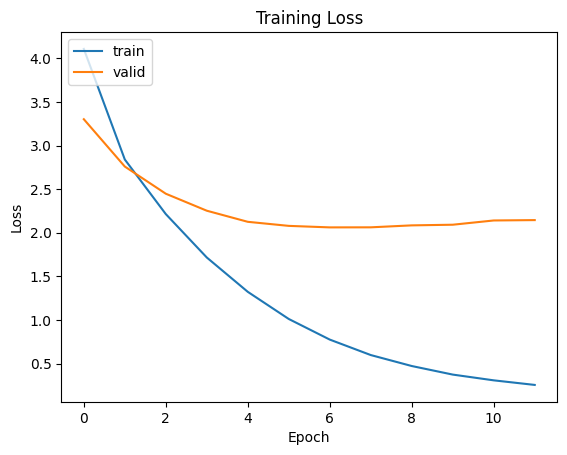

從圖中可以看出，train loss 隨著 epoch 增加穩定下降，表示模型對訓練資料的學習效果不斷提升；但相對地，valid loss 則是在前幾個 epoch 有所下降後便趨於平緩甚至略有上升，最後大致停留在 2.1 附近。

這種現象代表模型雖然學會了訓練資料的特徵，但泛化能力卻沒有同步跟上**是典型的Overfitting**。這些原因有可能是**模型容量過大，相對於資料規模來說太複雜**，而這裡其實最有可能的是**資料本身的多樣性不足，使得模型很快就掌握了可泛化的部分**。

為了解決這個問題我可以試著加一些正規化的方法，讓模型不要太記得訓練資料的細節，也可以用資料增強來讓樣本看起來更有變化或是直接把模型縮小一點。甚至也可以用AI產生一些新的資料，混進去再重新訓練看看。

5. 評估模型效果
---------

當你訓練好一個翻譯模型後，第一個冒出來的問題大概就是：「它翻得好嗎？」這時，`BLEU 分數（Bilingual Evaluation Understudy）` 就是一個常見又方便的自動評估指標，能快速幫你判斷模型在測試資料上的表現。這裡我們會用 `sacrebleu` 套件來幫忙計算：

```
import torch
import sacrebleu

def translate_and_eval(model, tokenizer, loader):
    device = torch.device('cuda' if torch.cuda.is_available() else 'cpu')
    model.to(device).eval()

    hyps, refs = [], []
    with torch.no_grad():
        for batch in loader:
            batch = {k:v.to(device) for k,v in batch.items()}
            out = model.generate(input_ids=batch['src_ids'])
            hyps += tokenizer.batch_decode(out, skip_special_tokens=True)
            refs += tokenizer.batch_decode(batch['tgt_ids'], skip_special_tokens=True)

    bleu = sacrebleu.corpus_bleu(hyps, [refs], lowercase=True)
    print(f"Corpus BLEU: {bleu.score:.2f}")

translate_and_eval(model, tgt_tokenizer, valid_loader)
```

輸出結果會長這樣：

```
Corpus BLEU: 23.23
```

從這個分數來看，模型的翻譯表現已經有一定水準。雖然還談不上可以直接應用在真實場景，但至少比亂猜好得多了。而且這次訓練資料其實不多，還能拿到這樣的 BLEU 分數，說真的已經是個不錯的起步點了。

下集預告
----

我們花了大約兩個禮拜的時間，一步步介紹過去那些經典的模型架構。今天終於實作了基於 LSTM 的 Seq2Seq 模型，還加上了 Attention 機制。老實說，這套架構雖然經典又實用，但現在已經慢慢不那麼流行了。原因很簡單**當資料量一大、模型一複雜，LSTM 的訓練效率就會變得很差**。

這是因為它的運算方式只能一個步驟接著一個步驟來，沒辦法平行處理，每個時間點都得等前一個跑完。這樣的特性對 GPU 來說很不友善，訓練速度也自然受限。

所以從接下來的章節開始，我們就要正式進入 Transformer 的世界了。會從它的核心架構講起，一步步帶大家拆解 Self-Attention 的原理和實作，並說明它為什麼這麼快、這麼受歡迎。下一站我們就從 Attention 前進到 Self-Attention，從線性序列的處理邏輯，跨進一口氣可以同時處理整個矩陣的世界！

---

<a id="8357-day-16"></a>

## Day 16｜【Day 16】從零開始拆 Transformer，原來 Encoder 是這樣運作的！

- 原文：https://ithelp.ithome.com.tw/articles/10391136

前言
--

這幾天我會陸續和大家介紹 Transformer 模型的結構細節。老實說這個模型的重要性真的不容小覷，**它幾乎可以說是現在 AI 世界的核心**。不誇張地說只要你搞懂了 Transformer，基本上就掌握了現今大多數主流 AI 模型的運作邏輯。過去那些模型（像是 RNN、LSTM）當然也有它們的貢獻，不過你不需要太執著於它們的細節，因為 Transformer 的出現，某種程度上已經統一了這個領域的主流架構。

所，為了讓大家能更扎實地理解這套系統，我會把整個 Transformer 拆解成幾個章節來慢慢講，每一部分都會盡量用清楚、直白的方式來說明，讓你不用被艱澀的數學或名詞卡住也能理解核心概念。

今天我們就從 Transformer 裡的一個關鍵模組Encoder開始談，可以說Encoder 是整個架構的基石。如果你能搞清楚 Encoder 的邏輯和它是怎麼處理資訊的，後面在看 Decoder 或更複雜的應用（像是 GPT 或 BERT）時就會順很多。所以這篇我會一步步拆解 Encoder 的基本組成、每個模組的功能，還有它們背後的設計理念，希望能幫助你真正理解這個影響深遠的系統到底是怎麼運作的。

Transfomer Encoder
------------------

Transformer 是一種很有意思的深度學習模型架構，核心是所謂的`注意力機制（Attention Mechanism`。這個架構最早是 2017 年由 Vaswani 等人在一篇叫《Attention is All You Need》的論文中提出的。雖然一開始是專門為自然語言處理（像是翻譯、對話生成）設計的，但後來也慢慢被用在其他領域，比如電腦視覺，甚至現在很多最強的 AI 模型，幾乎都是靠這個架構做出來的。


Transformer 最厲害的一點就是它處理「序列資料」的效率特別高，尤其是面對很長的句子或段落時，表現依然穩定。那接下來我們可以先來看看它的 Encoder，也就是整個模型裡負責讀懂輸入資料的部分，到底是怎麼運作的。

Positional Encoding
-------------------

傳統的時間序列模型像是 RNN，本身就具備遞迴結構，所以它會自然而然保留輸入資料的順序，也就是前後文的關聯。但 Transformer 完全不是這樣設計的，它靠的是平行運算，意思就是它在處理輸入時，根本不知道每個字是排在第幾個。因此為了讓 Transformer 也能理解順序，就需要額外的機制來補上這一塊資訊。

因此我們就會需要 `Positional Encoding（位置編碼）`，它的做法是把每個詞在句子裡的位置，用一組數學方式編碼進詞向量裡。這個編碼會跟原本的`embedding`加在一起送進模型。


而這個位置資訊的編碼方式，是靠`正弦（sin`）和`餘弦（cos）`函數來實現的，而其原因很簡單，因為這兩個函數的波動有週期性，可以用來表示變化的節奏，在偶數編號的維度用 sin 函數來表示

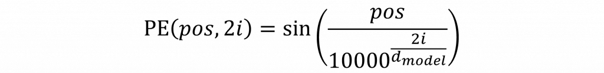

奇數編號的維度用 cos 函數來表示

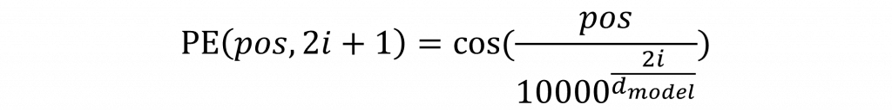

公式中的 `pos` 表示詞在整個句子中的位置，而 `i` 是詞向量的第幾個維度，`d_model` 是整個詞向量的總維度，其中當 i 越大，分母中的值也會越大，這**會讓 sin/cos 的變化變得比較慢**。這種設計會讓不同的維度以不同的頻率在震盪，進而讓模型能更精細地感受到每個詞在句子中所處的相對位置。

在公式裡那個看起來有點突兀的 10000，其實不是隨便挑的數字，它是一個`縮放因子（scaling factor）`，目的是讓不同維度的變化頻率有所區隔。舉個簡單的比喻你可以把這整個 Positional Encoding 想像成一個「頻率混音器」，每個維度像是一條獨立的聲音軌，頻率高低不同但混在一起可以幫助模型聽出句子中每個詞的位置。

具體來說低維度的變化比較劇烈（頻率高），高維度則變化得比較慢（頻率低），這種設計能讓模型從不同角度感受到詞序的影響，就像同一個場景用廣角與長焦鏡頭各拍一張照片一樣，提供多層次的空間訊息。而在程式碼中我們可以這樣撰寫

```
import torch
import torch.nn as nn
import math

class PositionalEncoding(nn.Module):
    def __init__(self, d_model, max_len=5000):
        super(PositionalEncoding, self).__init__()

        # 建立 (max_len, d_model) 大小的位置編碼矩陣
        pe = torch.zeros(max_len, d_model)
        position = torch.arange(0, max_len, dtype=torch.float).unsqueeze(1)  # shape: (max_len, 1)
        div_term = torch.exp(torch.arange(0, d_model, 2).float() * 
                             (-math.log(10000.0) / d_model))

        # 偶數維度用 sin，奇數維度用 cos
        pe[:, 0::2] = torch.sin(position * div_term)
        pe[:, 1::2] = torch.cos(position * div_term)

        # 增加 batch 維度方便加到輸入上
        pe = pe.unsqueeze(0)  # shape: (1, max_len, d_model)

        # 註冊 buffer，不會更新參數但會一起移到 GPU
        self.register_buffer('pe', pe)

    def forward(self, x):
        """
        x shape: (batch_size, seq_len, d_model)
        """
        seq_len = x.size(1)
        # 加上對應長度的 positional encoding
        return x + self.pe[:, :seq_len, :]
```

再來講講 `max_len` 的角色，**這個參數其實是告訴模型你最多會處理多長的句子**。在初始化位置編碼時，我們會先建立一個尺寸為 `(max_len, d_model)` 的矩陣，意思是我先準備好所有從第 0 個詞到第 max_len-1 個詞的所有位置編碼。不管你之後輸入的句子多長，我都有辦法從這個表裡撈出對應的那一段位置資訊來加進去。如果你的模型只會處理短句子，比如最多 128 個 token，那就可以把 `max_len` 設成 128。相對地，如果你在處理長篇文本（像是摘要、小說等），那就要把 max_len 設得大一點，避免在 forward 時出現超出範圍的錯誤。

還有一點比較進階但很重要的`register_buffer`，這不是普通的變數註冊，而**是 PyTorch 中用來儲存不參與訓練但又需要跟著模型移動（像是轉到 GPU 上）」的資料**。也就是說我們並不希望這個位置編碼在訓練過程中被改動，但又不能把它當成一般常數，因為它得跟著模型搬到 CUDA 裡才能正確運作。`register_buffer` 就是解這個問題的標準做法。

Multi-Head Self-Attention
-------------------------

在 Transformer 架構裡最核心的技術就是 `Self-Attention（自注意力機制）`，這個機制有點像是模型在讀一段文字時會自己去看整個句子，判斷哪些詞跟現在這個詞有關係，然後把注意力放在那些比較重要的詞上。也因為這樣，Transformer 才能慢慢取代像 Seq2Seq 那種比較傳統、需要 Encoder 跟 Decoder 不斷互動的架構，變得又快又準。

講到自注意力，會牽扯到三種向量`查詢（Query, Q）`、`鍵（Key, K）`、`值（Value, V）`，每個輸入的詞（也就是 Token）都會被轉換成這三種向量。怎麼轉？其實就是把原本的詞向量（通常是 embedding）乘上三個不同的權重矩陣，分別是`W_Q`、`W_K`、`W_V`，你可以想像成是先經過一層 embedding，再用三個不同的線性層（nn.Linear）做運算。


而在上圖中的動作簡單來說，Q 就是拿來問問題的，K 是拿來比對的，而 V 是答案內容。接下來的流程是這樣：我們會拿查詢向量 Q 去跟所有詞的鍵向量 K 做點積，算出一個數值這個數值代表兩個詞之間的關聯程度，稱為 Attention Score。

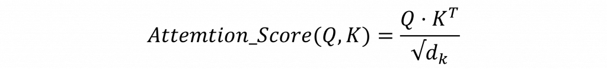

然後我們會把這些 Score 丟進 Softmax，把它們變成一組機率，這組機率就是所謂的 `Attention Weights`，也就是我現在該多關注哪個詞的分數。

最後我們用這些機率去加權每個詞的值向量 V，加總後就得到這次注意力機制的輸出。

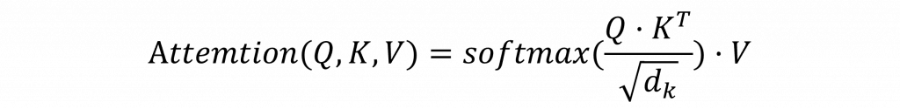

其中 `√𝑑` 這是 Q 和 K 向量的維度大小開根號(也就是詞向量空間)。為什麼要除這個？因為當向量維度太高時，Q 和 K 的點積結果可能會變得非常大，導致 Softmax 結果變得很極端，模型就學不好了。所以我們會用這個值來做縮放，把結果拉回合理的範圍。


講到這裡其實 Transformer 真正厲害的地方在於它用的是`Multi-Head Self-Attention（多頭自注意力機制）`，不是只有一個頭在做注意力運算，而是會把 Q、K、V 拆成好幾組，每組都各自計算注意力，最後再把這些結果合起來，也就是以下的公式


每個 attention head 本質上就是一次 `Attention(Q, K, V)` 的運算，而為什麼要用多個 head 呢？簡單來說，這樣做的好處是，每個頭可以專心」輸入句子的不同面向。像是有的 head 可能比較關注句子的語法結構，有的可能在抓語氣或情緒，還有的也許專注在主題相關的詞，這種設計讓模型能從多個角度來理解整個句子。

不過這邊有個小細節要注意，我們在計算 Attention 分數的時候有一個除以 `√d` 的操作，這個 `d`代表的是每個 head 的向量維度，既然我們把整體的 `d_model` 切成多個 head，那每個 head 的向量空間就要平均分配，這樣 `scale` 才會算得對。所以在程式碼裡，可以看到我們是把整個詞向量的維度平均分成多份：

```
class MultiHeadAttention(nn.Module):
    def __init__(self, d_model, nhead, dropout=0.1):
        super(MultiHeadAttention, self).__init__()
        assert d_model % nhead == 0
        
        self.d_model = d_model
        self.nhead = nhead
        self.d_k = d_model // nhead
        
        self.w_q = nn.Linear(d_model, d_model)
        self.w_k = nn.Linear(d_model, d_model)
        self.w_v = nn.Linear(d_model, d_model)
        self.w_o = nn.Linear(d_model, d_model)
        
        self.dropout = nn.Dropout(dropout)
        self.scale = math.sqrt(self.d_k)
```

而在前向傳播時這邊不使用 `torch.cat` 來合併，而是用了 `view + transpose`，目的是把整個向量拆成多個子空間，好讓每個 head 處理屬於自己的那一份資料。如果使用`cat`會需要使用迴圈，而選擇 `view` 和 `transpose` 只是比較快的做法。

```
def forward(self, query, key, value, mask=None, key_padding_mask=None):
        batch_size = query.size(0)
        seq_len_q = query.size(1)
        seq_len_k = key.size(1)
        
        # 將 Q/K/V 映射後 reshape 成 (batch_size, nhead, seq_len, d_k)
        Q = self.w_q(query).view(batch_size, seq_len_q, self.nhead, self.d_k).transpose(1, 2)
        K = self.w_k(key).view(batch_size, seq_len_k, self.nhead, self.d_k).transpose(1, 2)
        V = self.w_v(value).view(batch_size, seq_len_k, self.nhead, self.d_k).transpose(1, 2)
        
        # 計算注意力分數
        scores = torch.matmul(Q, K.transpose(-2, -1)) / self.scale
        
        # 套用 attention mask
        if mask is not None:
            # 確保 mask 的形狀正確
            if mask.dim() == 2:
                mask = mask.unsqueeze(0).unsqueeze(0)  # (1, 1, seq_len, seq_len)
            elif mask.dim() == 3:
                mask = mask.unsqueeze(1)  # (batch_size, 1, seq_len, seq_len)
            scores = scores.masked_fill(mask, float('-inf'))
        
        # 套用 padding mask
        if key_padding_mask is not None:
            # key_padding_mask: (batch_size, seq_len_k)
            # 需要擴展為 (batch_size, 1, 1, seq_len_k)
            key_padding_mask = key_padding_mask.unsqueeze(1).unsqueeze(2)
            scores = scores.masked_fill(key_padding_mask, float('-inf'))
        
        # 計算注意力權重
        attn_weights = F.softmax(scores, dim=-1)
        attn_weights = self.dropout(attn_weights)
        
        # 計算 weighted sum 後 reshape 回原始形狀
        context = torch.matmul(attn_weights, V)
        context = context.transpose(1, 2).contiguous().view(
            batch_size, seq_len_q, self.d_model
        )
        
        # 最終輸出線性變換
        output = self.w_o(context)
        return output
```

而在 Attention 分數計算中，我們其實是把每個詞對其他所有詞都看一遍，但我們不希望模型「偷看」，這時就要用到 mask，舉個例子：

*   在語言模型裡，我們不希望模型在預測第 t 個詞的時候，看到第 t+1、t+2 的詞，所以要遮住未來。
*   在處理不同長度句子的時候，為了讓它們長度一致，我們會加上 `<pad>` token，但這些其實沒有意義，也要遮起來，不然模型可能會把注意力浪費在這些 padding 上。

這兩種情況分別會用到：

*   **Attention Mask**：避免看到未來的詞。
*   **Key Padding Mask**：忽略 padding 的位置。

遮的方式其實也不難，就是把不想看的地方換成 `-inf`，這樣在做 softmax 的時候，那些位置就會變成 0，模型自然就不會理它們。

FeedForward
-----------

當我們在講 Transformer 的架構時，除了大家常提到的 Attention，其實還有一個很重要但常被忽略的部分`前饋神經網路（FeedForward Network,  FFN）`。

這一層的設計其實不複雜，就像是兩個線性層夾一個非線性函數，你可以把它想像成每個詞在經過 Attention 和其他詞聊天溝通後，還需要回過頭來自己想一想，把剛剛收到的資訊消化一下、重新組織，提煉出更有代表性的內部特徵。

```
import torch
import torch.nn as nn
import torch.nn.functional as F

class FeedForward(nn.Module):
    def __init__(self, d_model, d_ff, dropout=0.1, activation='gelu'):
        super(FeedForward, self).__init__()
        self.linear1 = nn.Linear(d_model, d_ff)
        self.linear2 = nn.Linear(d_ff, d_model)
        self.dropout = nn.Dropout(dropout)
        
        if activation == 'relu':
            self.activation = F.relu
        elif activation == 'gelu':
            self.activation = F.gelu
        else:
            raise ValueError('Unsupported activation function: {}'.format(activation))
    
    def forward(self, x):
        return self.linear2(self.dropout(self.activation(self.linear1(x))))
```

簡單來說，它就是：

1.   把輸入丟進第一層線性轉換（通常維度會變大）；
2.   接個非線性函數讓資料「彎一下」；
3.   dropout 避免 overfitting；
4.   再轉回原本的維度。

那為什麼需要這一層？因為 Attention 在處理的是詞與詞之間的「關係」，比如說「你說了什麼、我怎麼回應」這種互動。而 FFN 則是讓每個詞有自己的「內心戲」，可以獨立思考、加工資訊，強化自己的表示能力。

這種搭配其實就像是你開完會（Attention），回到座位還是要自己整理筆記、做功課（FFN），這樣整體的表現才會更強。

Layer Normalization
-------------------

另一個值得注意的地方是，在 Transformer 裡面引入了所謂的 `Layer Normalization`。簡單講它的作用就是幫每一層的輸入做個標準化處理，讓輸出的結果更穩定，這樣整個模型在訓練時就比較容易收斂，也能跑得更快、更穩定。雖然它聽起來有點像 Batch Normalization，但其實兩者做法不太一樣 `Layer Norm` 是針對每個樣本自己做正規化，而不是像 Batch Norm 那樣，是一整批資料一起處理。


你可能有注意到公式裡會出現個 `ε`這個小符號，它的主要功能其實就是防止在運算過程中除以零這種尷尬情況發生。所以它通常會被設得非常小，基本上就是個保險機制，確保計算的穩定性。而 `γ`則是控制輸出要放大多少的參數，它其實會在每一層都被調整，讓模型可以學會不同特徵的重要性。至於 `β`，它的角色是偏移量，讓模型可以微調輸出的整體分佈，讓結果更貼近真實數據的樣貌。

Encoder Skip Connection
-----------------------

現在我們來把這些零件組起來看一下。你會發現在 Encoder 的程式碼裡有兩次出現 `output + layer['dropout'](src2)` 這樣的寫法，這其實就是大家常提到的 `Skip Connection（跳躍連接）`，也有人叫它 `Residual Connection（殘差連接）`。

那這東西到底有什麼用？你可以想像一下，神經網路一層一層往下走，訊息每經過一層就會被改寫一次，但有時候改著改著，原本的重要訊息可能就不見了或者變得模糊了。Skip Connection 的概念就是不要把原始訊息整個丟掉，讓它繞個小路走旁邊，再回來跟處理後的結果合在一起，這樣做有兩個好處：

*   **幫助梯度流動**：尤其是網路層很多的時候，這種跳躍連接可以減少梯度消失的問題，讓整個模型比較好訓練。
*   **保留原始資訊**：讓後面的層還能看到一點原本輸入的樣子，不會完全被加工得面目全非。

所以Encoder 大致上會長這樣：

```
class Encoder(nn.Module):
    def __init__(self, d_model, nhead, d_ff, num_layers, dropout=0.1, norm=None):
        super(Encoder, self).__init__()
        self.layers = nn.ModuleList([
            nn.ModuleDict({
                'self_attn': MultiHeadAttention(d_model, nhead, dropout),
                'feed_forward': FeedForward(d_model, d_ff, dropout),
                'norm1': nn.LayerNorm(d_model),
                'norm2': nn.LayerNorm(d_model),
                'dropout': nn.Dropout(dropout)
            }) for _ in range(num_layers)
        ])
        self.num_layers = num_layers
        self.norm = norm

    def forward(self, src, mask=None, src_key_padding_mask=None):
        output = src
        for layer in self.layers:
            # 自注意力 + Skip Connection + LayerNorm
            src2 = layer['self_attn'](output, output, output, mask, src_key_padding_mask)
            output = layer['norm1'](output + layer['dropout'](src2))

            # 前饋網路 + Skip Connection + LayerNorm
            src2 = layer['feed_forward'](output)
            output = layer['norm2'](output + layer['dropout'](src2))

        if self.norm is not None:
            output = self.norm(output)
        return output
```

整個流程就是這樣`src2` 是注意力學出來的新訊息，而 `output` 是進來這一層的輸入，兩個加在一起，再丟進 LayerNorm，這樣就可以把新的資訊跟原本的訊息自然地融合起來。這個設計真的很關鍵，可以說是 Transformer 成功的秘密武器之一，因為這樣不只穩定訓練，還不太容易出現梯度爆炸或訓練發散的問題。

下集預告
----

明天我們會來聊聊 Transformer Encoder的經典代表`BERT`，這個模型從推出以來一直是自然語言處理領域的主力選手，至今仍被廣泛應用在各種任務上。明天會聚焦在它的整體架構、與原始 Transformer 的差異，以及它為什麼能夠這麼強大。而明天不會有數學而是基於今天內容的模型講解，目標是讓你真正理解 BERT 究竟做對了什麼，才讓它能紅這麼久、用得這麼廣。

---

<a id="8357-day-17"></a>

## Day 17｜【Day 17】只懂 Wx + b 也能搞懂 BERT？當然可以！

- 原文：https://ithelp.ithome.com.tw/articles/10391682

前言
--

在深度學習的世界裡，從頭開始訓練一個模型，不只費時，還非常燒資源。更不用說為了讓訓練有效果，還得準備大量資料，這正是許多人卡關的地方。畢竟資料不是想收就收得到的。這時候一個很聰明的策略就派上用場了：**如果已經有一個表現不錯的模型，能不能稍微改一下，讓它去處理我們的新任務？**

當然有這個方法，而這就是所謂的`遷移式學習（Transfer Learning）`，所以今天的內容就會帶大家從最基本的 Wx + b 開始，一步步走到如何建立一個完整的 BERT 預訓練模型。

遷移式學習跟預訓練模型是什麼？
---------------

講白一點就是把一個已經有訓練過的模型拿來做別的事，尤其是你手上的資料不多的時候特別好用。這不只可以省下一堆時間，效果通常還比你自己從頭訓練來得更穩。而像 BERT 這種模型，就是所謂的`預訓練模型（Pre-trained Model）`。這類型的模型在訓練時不是只學某一種任務，而是什麼都學一點、學得廣。它可以拿來做翻譯、摘要、甚至是文本生成，因為它本身在超大量的資料上訓練過，對各種語言特徵都有概念。

可以把它想像成一個很博學的人，雖然不是每一科都超強，但什麼都懂一點。你只要教它一點點新的東西，它就能舉一反三。這也是為什麼現在很多研究機構或公司會直接用這些預訓練模型，不用自己從零開始練一個，省時又省力。


整個預訓練模型的使用流程，通常會分成預訓練跟`微調（fine-tuning）`兩個階段。預訓練這階段基本上都是大公司或研究機構在使用，因為他們會設計一個大型的模型架構，丟進超大量的資料裡面去訓練讓模型學會不同資料的特徵。接下來就是微調也就是我們這些一般使用者的重點，**我們拿一小筆資料集，針對某個任務去調整這個預訓練模型**，因為大部分的知識模型早就學好了，所以我們只需要動一些權重，讓它配合我們的任務就可以。

> 而在這裡模型的主體部分通常是共用權重的，而在後續的模型部分通常會不使用或不公開，而我們只需要自己加入一層分類器，讓它重新學習分類新資料，這樣效果會比較好。

不過預訓練模型的架構通常是固定好的，我們想改會有點麻煩。而且它原本訓練的資料，可能跟我們的任務不完全一樣。舉例來說如果一個模型根本沒學過怎麼做摘要，我們卻硬要拿它來做，那效果可能就不怎麼樣。所以我們在用之前，最好還是去看看它的架構是怎麼設計的、相關的論文怎麼說，這樣比較能掌握它的優缺點。

`BERT(Bidirectional Encoder Representations from Transformers)`是2018年由Google提出的，其模型參數設計與原始的Transformer模型並未有太多的改動，而最大的改動是它只保留了Transformer的Encoder部分與其特殊的預訓練方式，而在開始之前我們先深度理解一下BERT的模型架構

Embedding
---------

昨天我們有提到，Transformer 會用一種 Positional Encoding 的方式來處理輸入的資料，讓模型知道每個詞出現的位置，不過那個位置資訊是固定的，也就是模型本身不會去改它。但在 BERT 裡，位置的資訊是可以學習的他不只是吃進去詞語的內容，還會自己學會每個詞出現在句子中不同位置時，應該要有什麼樣的特徵。

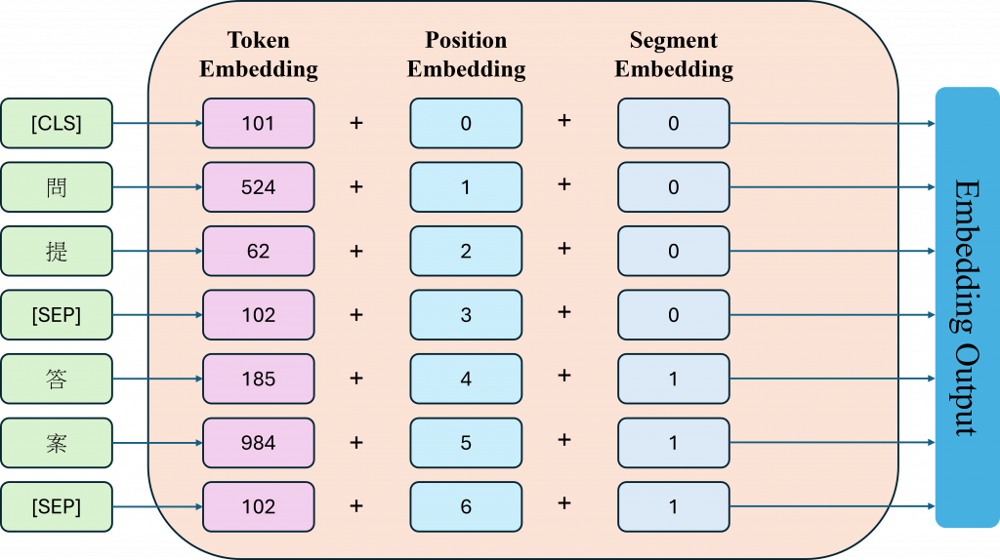

而 BERT 會用三種embedding來把句子轉換成數值資料給模型讀：

1.   **Token Embedding**：就是把每個字或詞轉成對應的向量，跟我們之前學詞向量的概念差不多。
2.   **Segment Embedding**：因為 BERT 一次可以處理兩個句子，所以會加個編號標記這個字是來自第一句還是第二句。
3.   **Position Embedding**：這就是用來表示每個詞在句子中的「位置」。

這三個 embedding 加起來之後，還會再經過一層正規化（LayerNorm）和 dropout 處理，才會送進 BERT 模型的下一層。因此在 Huggingface 的 BERT 架構中，你會看到類似這樣的設計：

```
(embeddings): BertEmbeddings(
    (word_embeddings): Embedding(30522, 768, padding_idx=0)
    (position_embeddings): Embedding(512, 768)
    (token_type_embeddings): Embedding(2, 768)
    (LayerNorm): LayerNorm((768,), eps=1e-12, elementwise_affine=True)
    (dropout): Dropout(p=0.1, inplace=False)
)
```

如果我們要自己寫一個 `BertEmbeddings` 類別的話，就得依照它需要的參數大小來設定。不過在這裡我們是透過 `config` 的方式來設定這些參數。這麼做的好處是因為 BERT 有很多不同版本的模型，我們就可以根據所選的版本，快速載入對應的權重，不用每次都手動調整。

```
class BertEmbeddings(nn.Module):
    def __init__(self, config):
        super().__init__()
        self.word_embeddings = nn.Embedding(config.vocab_size, config.hidden_size, padding_idx=config.pad_token_id)
        self.position_embeddings = nn.Embedding(config.max_position_embeddings, config.hidden_size)
        self.token_type_embeddings = nn.Embedding(getattr(config, "type_vocab_size", 2), config.hidden_size)
        self.LayerNorm = nn.LayerNorm(config.hidden_size, eps=config.layer_norm_eps)
        self.dropout = nn.Dropout(config.hidden_dropout_prob)
```

在實作 `forward` 的時候，有兩點要特別留意。第一是 `token_type_ids` 這個參數有可能沒被傳進來，這時候我們就要預設它的值全部是 0。第二是 `position_ids`，這部分要根據實際輸入的長度來動態產生，例如如果輸入是 10 個字，那位置編號就會是 `[0, 1, ..., 9]`。這樣才能確保每個 token 都有正確的位置資訊。接下來就是整個 `forward` 方法的完整寫法。

```
def forward(self, input_ids, token_type_ids=None):
    B, T = input_ids.size()
    if token_type_ids is None:
        token_type_ids = torch.zeros_like(input_ids)

    position_ids = torch.arange(T, device=input_ids.device, dtype=torch.long).unsqueeze(0).expand(B, T)

    w = self.word_embeddings(input_ids)
    p = self.position_embeddings(position_ids)
    t = self.token_type_embeddings(token_type_ids)

    x = w + p + t
    x = self.LayerNorm(x)
    x = self.dropout(x)
    return x
```

BERT Encoder
------------

我們現在看到的是 BertEncoder 的整體架構，**它的核心就是一個有 12 層的 Transformer Encoder堆疊**，每一層就是一個 BertLayer。乍看之下可能有點可怕，但其實可以拆解成幾個重複的小模組，而且這些模組大多就是 Transformer 裡的經典元件。

```
(encoder): BertEncoder(
    (layer): ModuleList(
      (0-11): 12 x BertLayer(
        (attention): BertAttention(
          (self): BertSelfAttention(
            (query): Linear(in_features=768, out_features=768, bias=True)
            (key): Linear(in_features=768, out_features=768, bias=True)
            (value): Linear(in_features=768, out_features=768, bias=True)
            (dropout): Dropout(p=0.1, inplace=False)
          )
          (output): BertSelfOutput(
            (dense): Linear(in_features=768, out_features=768, bias=True)
            (dropout): Dropout(p=0.1, inplace=False)
            (LayerNorm): LayerNorm((768,), eps=1e-12, elementwise_affine=True)
          )
        )
        (intermediate): BertIntermediate(
          (dense): Linear(in_features=768, out_features=3072, bias=True)
          (intermediate_act_fn): GELU(approximate='none')
        )
        (output): BertOutput(
          (dense): Linear(in_features=3072, out_features=768, bias=True)
          (dropout): Dropout(p=0.1, inplace=False)
          (LayerNorm): LayerNorm((768,), eps=1e-12, elementwise_affine=True)
        )
      )
    )
  )
```

### 1. BertSelfAttention

這個模組負責看哪裡重要，也就是我們常說的 Attention 機制。它裡面有三個 Linear layer，分別做出 Query, Key, Value，這跟我們昨天提到的 Self-Attention 概念完全一樣。

它會把這三個東西 reshape 成Multi-head Attention 需要的格式。接著就是計算 Attention Score，並經過 Softmax，再加上一點 Dropout處理Attention Weight，最後會把算出來的Attention Weight跟 Value 做乘法，得到我們的Attention結果。

```
class BertSelfAttention(nn.Module):
    def __init__(self, config):
        super().__init__()
        if config.hidden_size % config.num_attention_heads != 0:
            raise ValueError("hidden_size must be divisible by num_attention_heads")
        self.num_attention_heads = config.num_attention_heads
        self.attention_head_size = config.hidden_size // config.num_attention_heads
        self.all_head_size = self.num_attention_heads * self.attention_head_size

        self.query = nn.Linear(config.hidden_size, self.all_head_size)
        self.key = nn.Linear(config.hidden_size, self.all_head_size)
        self.value = nn.Linear(config.hidden_size, self.all_head_size)

        self.dropout = nn.Dropout(config.attention_probs_dropout_prob)

    def transpose_for_scores(self, x):
        new_shape = x.size()[:-1] + (self.num_attention_heads, self.attention_head_size)
        x = x.view(*new_shape)  # [B, T, nh, hd]
        return x.permute(0, 2, 1, 3)  # [B, nh, T, hd]

    def forward(self, hidden_states, attention_mask=None):
        q = self.query(hidden_states)
        k = self.key(hidden_states)
        v = self.value(hidden_states)

        q = self.transpose_for_scores(q)
        k = self.transpose_for_scores(k)
        v = self.transpose_for_scores(v)

        attn_scores = torch.matmul(q, k.transpose(-1, -2)) / math.sqrt(self.attention_head_size)  # [B, nh, T, T]
        if attention_mask is not None:
            attn_scores = attn_scores + attention_mask

        attn_probs = F.softmax(attn_scores, dim=-1)
        attn_probs = self.dropout(attn_probs)

        context = torch.matmul(attn_probs, v)  # [B, nh, T, hd]
        context = context.permute(0, 2, 1, 3).contiguous()
        new_context_shape = context.size()[:2] + (self.all_head_size,)
        context = context.view(*new_context_shape)  # [B, T, H]
        return context
```

### 2. BertSelfOutput：Add & Norm 區塊

其實在 BertSelfOutput 裡，有個很關鍵的步驟，就是 Transformer 裡常見的 Add & Norm。簡單來說，它就是先把 Attention 的輸出再經過一層 Linear，然後加上 Dropout，接著再把這個結果跟原本進來的輸入做個 skip connection，最後再做 Layer Normalization。這樣做的目的是為了讓訓練過程更穩定。

```
class BertSelfOutput(nn.Module):
    def __init__(self, config):
        super().__init__()
        # name: attention.output.dense
        self.dense = nn.Linear(config.hidden_size, config.hidden_size)
        self.dropout = nn.Dropout(config.hidden_dropout_prob)
        # name: attention.output.LayerNorm
        self.LayerNorm = nn.LayerNorm(config.hidden_size, eps=config.layer_norm_eps)

    def forward(self, hidden_states, input_tensor):
        hidden_states = self.dense(hidden_states)
        hidden_states = self.dropout(hidden_states)
        hidden_states = self.LayerNorm(hidden_states + input_tensor) # Skip Connection
        return hidden_states
```

### 3. BertIntermediate與BertOutput(FFN)

每層 Transformer 結尾的一個重要部分，主要是用來進一步轉換和處理前面得到的資訊。它被拆成兩個部分來進行，首先是 BertIntermediate，這裡會先用一層 Linear 把原本的 768 維向量放大成 3072 維，接著通過一個GELU來處理它的線性變換(這裡也是唯一跟Transformer不同的地方)。

```
class BertIntermediate(nn.Module):
    def __init__(self, config):
        super().__init__()
        # name: intermediate.dense
        self.dense = nn.Linear(config.hidden_size, config.intermediate_size)
        self.intermediate_act_fn = nn.GELU()

    def forward(self, hidden_states):
        return self.intermediate_act_fn(self.dense(hidden_states))
```

然後是 BertOutput，它再把剛剛拉高的 3072 維壓回到原來的 768 維。最後跟之前 Attention Output 的流程很像先做 Dropout，再加上原始輸入的 Skip Connection，然後做 Layer Normalization，這整個流程有助於模型更穩定地學習。

```
class BertOutput(nn.Module):
    def __init__(self, config):
        super().__init__()
        # name: output.dense
        self.dense = nn.Linear(config.intermediate_size, config.hidden_size)
        self.dropout = nn.Dropout(config.hidden_dropout_prob)
        # name: output.LayerNorm
        self.LayerNorm = nn.LayerNorm(config.hidden_size, eps=config.layer_norm_eps)

    def forward(self, hidden_states, input_tensor):
        hidden_states = self.dense(hidden_states)
        hidden_states = self.dropout(hidden_states)
        hidden_states = self.LayerNorm(hidden_states + input_tensor) # Skip Connection
        return hidden_states
```

### 4. BERT Encoder

你會發現整個 BERT Encoder 的定義基本上與我們的Transformer根本沒有差異，而現在我們只需要建立BertLayer與BertEncoder就能完成整個模型的建立了，而這樣的設計只是為了方便動態調動多層Transformer

```
class BertLayer(nn.Module):
    def __init__(self, config):
        super().__init__()
        self.attention = BertAttention(config)
        self.intermediate = BertIntermediate(config)
        self.output = BertOutput(config)

    def forward(self, hidden_states, attention_mask=None):
        attention_output = self.attention(hidden_states, attention_mask)
        intermediate_output = self.intermediate(attention_output)
        layer_output = self.output(intermediate_output, attention_output)
        return layer_output
```

而我們經過前面的建立現在就能夠只使用簡單幾行就完成 Transformer Layer 的精髓了，雖然你在這邊沒看到像昨天的明顯加法或 LayerNorm，這是因為再HF架構中的BERT把skip connection 都藏在 Attention 跟 Output 裡面(我上面程式碼註解的地方)。

而`BertEncoder`則是進行實際堆疊的地方，不過在HF風格上通常會有一個 `output_hidden_states=True`，它也會幫你把每一層的輸出都存下來，這對於分析模型或做視覺化非常有用。

```
class BertEncoder(nn.Module):
    def __init__(self, config):
        super().__init__()
        # name path: encoder.layer.0 ... encoder.layer.N
        self.layer = nn.ModuleList([BertLayer(config) for _ in range(config.num_hidden_layers)])

    def forward(self, hidden_states, attention_mask=None, output_hidden_states=False):
        all_hidden_states = [] if output_hidden_states else None
        for layer_module in self.layer:
            if output_hidden_states:
                all_hidden_states.append(hidden_states)
            hidden_states = layer_module(hidden_states, attention_mask)
        if output_hidden_states:
            all_hidden_states.append(hidden_states)
        return hidden_states, all_hidden_states
```

BERT Encoder 看起來很複雜，但其實就是 12 層完全一樣的 Transformer 結構堆起來。每層做注意力 → 前饋網路 → skip，加起來就可以學到上下文關係。

BertPooler
----------

當我們把一句話丟進 BERT 模型裡，它其實不會馬上就開始「理解」文字，而是會先幫句子加上一些特別的符號，例如 `[CLS]` 和 `[SEP]`，簡單來說：

```
單一句子： [CLS] 句子 [SEP]  
兩句話：   [CLS] 句子A [SEP] 句子B [SEP]
```

而`[SEP]` 是用來分隔句子的，像是句子中間的逗號，也順便當作句尾。那開頭的 `[CLS]` 呢？這就比較特別了。雖然一開始它只是個空白 token，沒什麼意思，但 BERT 會訓練它變成整句話的代表，**就像是一個總結整句意思的代言人。**

為什麼它可以代表整句話？這就要靠 Transformer 裡厲害的東西**Self-Attention 機制**。它的概念有點像是每個詞都會去注意整句話裡其他詞，看看彼此的關聯性。就算詞在句首或句尾，都會把整句的資訊融合進來，只是每個詞吸收的重點可能不同。

數學上在做什麼？其實就是幫每個詞算出對 [CLS] 來說，它有多重要，也就是`softmax((Q · K.T) / sqrt(d))`，而些注意力分數會用來加權每個詞的 Value（V），再全部加總起來，因此CLS 就像是一個訊息總管，根據自己的關注程度去吸收其他詞的資訊，最後變成它的新向量。

因此到這時候就輪到 `BertPooler` 出場了雖然模型裡寫得很簡單：

```
(pooler): BertPooler(
    (dense): Linear(in_features=768, out_features=768, bias=True)
    (activation): Tanh()
)
```

但重點是它只拿 `[CLS]` 的向量來用，也就是在程式裡會看到`hidden_states[:, 0]`意思就是只抓第一個 token，也就是 `[CLS]` 的位置。這個 `[CLS]` 的向量會先丟進一個 Linear 層做轉換，再經過一個 Tanh 函數做激活，讓輸出的值被限制在 -1 到 1 之間，讓後面的模型更好的進行分類或運算。

```
class BertPooler(nn.Module):
    def __init__(self, config):
        super().__init__()
        self.dense = nn.Linear(config.hidden_size, config.hidden_size)
        self.activation = nn.Tanh()

    def forward(self, hidden_states):
        first_token_tensor = hidden_states[:, 0]
        pooled_output = self.dense(first_token_tensor)
        pooled_output = self.activation(pooled_output)
        return pooled_output
```

講到這邊，其實我們已經把 BERT 的整體模型架構講得差不多了。不過要注意這還不是全部！我們現在談的主要是 模型的底層架構，也就是 BERT 怎麼處理文字、怎麼用 Self-Attention、怎麼透過 [CLS] 來代表整句話，但實際上，BERT 在做預訓練時，還會在這個基礎上加上一些額外的分類器。

這些分類器有點像是訓練小助手，專門幫助模型學會更準確地用 [CLS] 去做各種任務，而使用這些訓練技巧，會讓 [CLS] 的表示學得更有意義，也就是我們俗稱的「讓它更懂句子」。不過這部分就留到明天再說吧，今天先消化一下這些架構和機制，不然一次塞太多，頭腦真的會轉不過來。

下集預告
----

今天我們介紹了 [https://huggingface.co/google-bert/bert-base-uncased](https://huggingface.co/google-bert/bert-base-uncased) 這個模型架構，順便用程式碼來幫助你更清楚理解 BERT 的原理。這個架構其實你也可以直接套用我貼的連結裡的預訓練權重，不過這部分我們會留到後面再詳細說明。

明天我們會進一步聊聊**BERT 是怎麼被訓練出來的？它到底學了哪些東西？** 還有在訓練過程中加入的一些小技巧，像是 MLM（Masked Language Modeling）和 NSP（Next Sentence Prediction），這些又是怎麼幫助 BERT 更懂語言的？

---

<a id="8357-day-18"></a>

## Day 18｜【Day 18】一篇文章讓你搞懂BERT預訓練任務與模型實作（MLM + NSP）

- 原文：https://ithelp.ithome.com.tw/articles/10391896

前言
--

在自然語言處理的世界裡BERT 可說是近十年來最具代表性的模型之一，它不僅改寫了多項語言任務的表現標準，更奠定了後續各類 Transformer 模型的核心架構。不過儘管許多開發者早已習慣透過 Hugging Face 等工具輕鬆調用 BERT，我們今天要做的則是往原理層更進一步。

今天將帶你**一步步手動實作 BERT 的預訓練架構**，包括 `MLM（Masked Language Modeling）`與 `NSP（Next Sentence Prediction）`兩大訓練任務，並將昨天的`BertModel`與今天的預訓練head進行官方模型的權重對齊。

BERT 的預訓練階段以 `MLM（Masked Language Model）` 任務為核心，這是一種讓模型透過**遮蔽部分詞彙**來學習語境理解的策略。他在處理輸入文本時大約 **15% 的 token** 會被選中進行遮蔽處理，但這個遮蔽並非單一操作

*   多數會被替換為 `[MASK]` 標記
*   一小部分會被替換成 **隨機的 token**
*   還有些則會 **保留原詞**

這樣的設計表面上看似無意義，但實際上是一種有意識的安排，目的在於讓模型自訓練初期便能接觸多樣且貼近真實使用情境的語境變化，而非僅在理想化的條件下學習。


在實際應用中使用者所輸入的語句並不會包含 `[MASK]`這類特殊標記。如果模型過度依賴明確的遮蔽提示來進行預測，則在面對完全不具備此類提示的任務時，其推理能力與表現可能會明顯下降。基於此考量，訓練設計中刻意引入隨機詞替換與保留原詞的機制，目的是使模型逐步習慣於在缺乏遮蔽提示的情況下，依然能夠理解語句的語意邏輯，並在此基礎上自主地進行語境推理。

其實這種 MASK 的設計還有一個蠻大的優點。傳統的語言模型像是那種從左讀到右的 `RNN`，它們只能依靠前面出現的字來預測下一個詞，這樣在理解整個語境的時候就有點受限了。相對來說，BERT 用的是 `Transformer` 結構，裡面有個叫做 `Self-Attention` 的機制，這讓它可以做到**真正的雙向語境理解**。

簡單來說，BERT 在預測被遮起來的字時，不只看前面的詞，連後面的也一起考慮。像我們昨天提到的例子，今天如果輸入這句話：

```
我今天吃了 [MASK]，很好吃。
```

BERT 的處理方式會先加上一個 `[CLS]` 的 token，用來做**整句話的語意摘要**。然後在訓練的時候，它不是只根據「我今天吃了」這段來猜，而是也會看「很好吃」這個線索。這樣一來，它就更有可能猜出像「壽司」或「牛肉麵」這種合理的食物名詞。

NSP任務
-----

除了預測被遮住的token之外BERT 還有另一個蠻關鍵的訓練方法，叫做 `NSP（Next Sentence Prediction）`，意思是「下一句預測」。那這個任務到底是幹嘛用的呢？簡單來說就是要讓模型能夠理解「句子跟句子之間到底有沒有邏輯關係」。這在什麼情況下特別有用？比如說問答系統、文章閱讀理解，甚至是對話生成。這些任務不只是單句理解而已，而是要搞懂句子跟句子之間是不是一脈相承、有沒有邏輯順序。

那 NSP 是怎麼訓練的？在 BERT 的預訓練階段，會拿一對句子給模型判斷，其中有一半是真的連在一起的，比如：

```
A：我今天去了圖書館。
B：我借了一本關於機器學習的書。
```

這樣的句子對是正確連續的，而另一半則是硬湊的、不相干的句子比如：

```
A：我今天去了圖書館。
B：香蕉是黃色的。
```

這種就完全沒關係，屬於隨機組合。

BERT 在訓練時的任務，就是要學會判斷 B 句到底是不是合理地接在 A 句後面。也就是說，它不只是看單句內容，還要考慮整體語意的銜接。更有意思的是**NSP 這個訓練任務也會在某種程度上加強 BERT 做 MLM 的能力**。因為為了判斷兩個句子是不是相關的，模型必須更深入地理解語境，甚至得學會抓出潛在的語意線索，這對整體語言理解是很有幫助的。

程式實現
----

今天的重點，是透過實作方式來更直觀地理解 BERT 模型的架構。不過在動手編碼之前，我們先快速回顧一下昨天寫過的程式碼，並進一步結合 Hugging Face（HF）上的預訓練模型，來做權重的轉移。這樣的操作不只是為了好玩，而是幫助我們確保自己手動實作的模型，能夠與 HF 官方版本在結構與參數上完全對齊。

在Hugging Face 提供的 `bert-base-uncased` 模型中，內建了一個 `config` 檔案，其中包含了模型架構的關鍵設定，例如 Transformer 的層數、每層的神經元維度、hidden size 等。所以等等我們會直接利用這個 `config` 來初始化我們自己的 `BertModel` 類別。

1. 轉移 BERT 模型權重
---------------

在進行權重轉移時，第一步是從 Hugging Face 的 `bert-base-uncased` 模型讀取已訓練好的參數，並將這些參數載入到我們自己撰寫的 `BertModel` 類別中。雖然這樣的模型在使用上與直接呼叫 HF 提供的模型沒有功能差異，但重點在於理解與驗證：我們是否成功複製出與官方版本完全一致的結構。這對於未來想要修改模型（例如自訂 Attention 機制或更動 Pooler 結構）特別有幫助。

相較於直接調整 HF 封裝過的模型，我們自己實作一份會更直觀、自由度也更高。當然如果你已經非常熟悉 PyTorch，也可以透過 `hook` 的方式來動態改變模型的前向傳播邏輯。

```
from transformers import BertModel as HFBertModel

# 從 Hugging Face 載入 BERT encoder
hf_encoder = HFBertModel.from_pretrained("bert-base-uncased")
```

2. 自訂 BertModel 類別
------------------

而我們現在把昨天的組件組合成一個自己定義的 `BertModel` 類別，這裡一定要讓參數名稱與 HF 模型對齊，這是成功載入權重的關鍵。只要有任何一個參數名稱不一致，`.load_state_dict()` 可能就會報錯。

```
class BertModel(nn.Module):
    """
    State dict keys match Hugging Face's `BertModel`.
    Accepts an HF BertConfig directly. No local Config duplication.
    """
    def __init__(self, config):
        super().__init__()
        self.config = config
        # names: embeddings, encoder, pooler
        self.embeddings = BertEmbeddings(config)
        self.encoder = BertEncoder(config)
        self.pooler = BertPooler(config)

        self.apply(self._init_weights)

    def _init_weights(self, module):
        if isinstance(module, nn.Linear):
            nn.init.normal_(module.weight, mean=0.0, std=self.config.initializer_range)
            if module.bias is not None:
                nn.init.zeros_(module.bias)
        elif isinstance(module, nn.Embedding):
            nn.init.normal_(module.weight, mean=0.0, std=self.config.initializer_range)
        elif isinstance(module, nn.LayerNorm):
            nn.init.ones_(module.weight)
            nn.init.zeros_(module.bias)

    @staticmethod
    def _extend_attention_mask(attention_mask, dtype):
        """
        Input mask: [B, T] with 1 for tokens to keep, 0 for padding
        Output mask: [B, 1, 1, T] with 0 for keep and -inf for mask (same dtype as scores)
        """
        if attention_mask.dim() == 2:
            extended = attention_mask[:, None, None, :]
        elif attention_mask.dim() == 3:
            extended = attention_mask[:, None, :, :]
        else:
            extended = attention_mask
        extended = extended.to(dtype=dtype)
        # 1 -> 0.0, 0 -> -inf
        neg_inf = torch.finfo(dtype).min
        extended = (1.0 - extended) * neg_inf
        return extended

    def forward(
        self,
        input_ids,
        token_type_ids=None,
        attention_mask=None,
        output_hidden_states=False,
        return_dict=False,
    ):
        if token_type_ids is None:
            token_type_ids = torch.zeros_like(input_ids)

        if attention_mask is None:
            attention_mask = (input_ids != self.config.pad_token_id).long()

        embedding_output = self.embeddings(input_ids, token_type_ids)
        # build extended mask in the same dtype as attention scores (float)
        extended_attention_mask = self._extend_attention_mask(attention_mask, embedding_output.dtype)

        sequence_output, all_hidden_states = self.encoder(
            embedding_output, attention_mask=extended_attention_mask, output_hidden_states=output_hidden_states
        )
        pooled_output = self.pooler(sequence_output)

        if return_dict:
            return {
                "last_hidden_state": sequence_output,
                "pooler_output": pooled_output,
                "hidden_states": all_hidden_states,
            }
        return (sequence_output, pooled_output, all_hidden_states if output_hidden_states else None)
```

在這段程式中使用了我們昨日實作的三大模組，並補上了完整的前向傳播邏輯。特別注意我們對 `attention_mask` 和 `token_type_ids` 的處理方式是模仿 Hugging Face 的內部作法，確保計算方式完全一致。

3. 載入 Hugging Face 的權重
----------------------

接下來我們建立模型實例，並載入 HF 模型的 `state_dict`，並檢查有哪些參數對不上。

```
model_encoder_only = BertModel(hf_encoder.config)
sd_encoder = hf_encoder.state_dict()
missing_e, unexpected_e = model_encoder_only.load_state_dict(sd_encoder, strict=False)
print("[Encoder] Missing:", missing_e)
print("[Encoder] Unexpected:", unexpected_e)
```

理想情況下，輸出應該是這樣：

```
[Encoder] Missing: []
[Encoder] Unexpected: []
```

這表示我們的模型與 HF 提供的 Encoder 架構與參數名稱完全一致，沒有遺漏任何參數，也沒有多餘的設定。這個步驟除了驗證模型正確性之外，也為未來的模型微調與客製化打下基礎。

4. 建立BertPreTrainingHeads
-------------------------

接下來我們要談的是 BERT 在預訓練任務（如 MLM 和 NSP）中所使用的架構擴充，具體來說，Hugging Face 中的 BertPreTrainingHeads 模組會在原始的 BertModel 上疊加一層額外結構，這層就是針對預訓練目標所設計的head，而整個 BertPreTrainingHeads 的結構如下：

```
(cls): BertPreTrainingHeads(
    (predictions): BertLMPredictionHead(
      (transform): BertPredictionHeadTransform(
        (dense): Linear(in_features=768, out_features=768, bias=True)
        (transform_act_fn): GELUActivation()
        (LayerNorm): LayerNorm((768,), eps=1e-12, elementwise_affine=True)
      )
      (decoder): Linear(in_features=768, out_features=30522, bias=True)
    )
    (seq_relationship): Linear(in_features=768, out_features=2, bias=True)
  )
```

從結構上來看，這個 head 分為兩個部分：

1.   **`BertLMPredictionHead`**：對應於 MLM 任務。它的邏輯流程很簡單，先經過一個線性變換（Linear），再接 GELU 啟動函數與 LayerNorm 正規化，最後由一個 decoder 層將 hidden state 映射回原始詞彙空間（vocab size = 30522）。
2.   **`seq_relationship`**：則是用來處理 NSP 任務。這部分直接將 `[CLS]` token 的表示輸入一個 linear 層，用來分類兩個句子是否相鄰。

簡單來說就是在 BERT 主體的基礎上，額外疊加兩個分類器，用來同時學習語言模型和句子關聯的預訓練目標。

### 一、BertLMPredictionHead

因此BertLMPredictionHead 本質上其實只是進行一組簡單的線性與非線性轉換，也就是 Linear → GELU → LayerNorm 的運算流程。乍看之下，這部分似乎只是基本的前向傳播組合，沒有特別複雜。不過為了與 Hugging Face 的結構保持一致，我們仍需依照它的定義方式來實作。這不僅是為了能夠順利轉移權重，更能確保我們的自訂模型在功能上完全對齊原始實作。

```
class BertPredictionHeadTransform(nn.Module):
    """
    HF key path: cls.predictions.transform.{dense, LayerNorm}
    """
    def __init__(self, config):
        super().__init__()
        self.dense = nn.Linear(config.hidden_size, config.hidden_size)
        # BERT 使用 GELU
        self.transform_act_fn = nn.GELU()
        self.LayerNorm = nn.LayerNorm(config.hidden_size, eps=config.layer_norm_eps)

    def forward(self, hidden_states):
        hidden_states = self.dense(hidden_states)
        hidden_states = self.transform_act_fn(hidden_states)
        hidden_states = self.LayerNorm(hidden_states)
        return hidden_states

class BertLMPredictionHead(nn.Module):
    """
    HF key path:
      cls.predictions.transform.{dense,LayerNorm}
      cls.predictions.decoder.weight  (tied with embeddings.word_embeddings.weight)
      cls.predictions.decoder.bias
    """
    def __init__(self, config):
        super().__init__()
        self.transform = BertPredictionHeadTransform(config)
        # decoder 是 Linear，但 weight 會在外部與 embeddings.word_embeddings.weight 綁定
        self.decoder = nn.Linear(config.hidden_size, config.vocab_size, bias=False)
        self.bias = nn.Parameter(torch.zeros(config.vocab_size))
        # 綁定 bias 名稱以符合 HF
        self.decoder.bias = self.bias

    def forward(self, hidden_states):
        hidden_states = self.transform(hidden_states)
        hidden_states = self.decoder(hidden_states) + self.bias
        return hidden_states
```

### 二、BertPreTrainingHeads

至於 NSP 部分，因為它的任務相對單純只需判斷兩個句子是否相鄰，因此我們只需將 [CLS] token 的表示向量輸入一個 linear 層，即可完成分類任務。也就是說，當我們完成 MLM 預測之後，只要額外接上`seq_relationship` 這個線性分類器，就能同時進行 NSP 的訓練。

```
class BertPreTrainingHeads(nn.Module):
    """
    HF key path base: cls.{predictions, seq_relationship}
    """
    def __init__(self, config):
        super().__init__()
        self.predictions = BertLMPredictionHead(config)
        self.seq_relationship = nn.Linear(config.hidden_size, 2)

    def forward(self, sequence_output, pooled_output):
        prediction_scores = self.predictions(sequence_output)
        seq_relationship_score = self.seq_relationship(pooled_output)
        return prediction_scores, seq_relationship_score
```

因此我們的 `BertForPreTraining` 模型至此也算正式完成了。整體架構其實相當直觀：我們僅需將前面已經建立的 `BertModel` 主體，與`BertPreTrainingHeads`（負責 MLM 和 NSP 任務）結合起來即可。

```
class BertForPreTraining(nn.Module):
    """
    State dict keys match Hugging Face's `BertForPreTraining`.
    Heads under `cls.predictions.*` and `cls.seq_relationship`.
    """
    def __init__(self, config):
        super().__init__()
        self.config = config
        self.bert = BertModel(config)
        self.cls = BertPreTrainingHeads(config)
```

接下來我們來看 `forward` 函式的實作邏輯。在這裡有一個重要的細節需要特別注意，當我們呼叫內部的 `BertModel` 時，它會同時回傳兩個關鍵輸出：

1.   `sequence_output`：這是整段輸入的 contextual representation，會被用於 MLM 任務。
2.   `pooled_output`：這是來自 `pooler` 層的輸出，對應的是 `[CLS]` token 的表示，主要用於 NSP 任務。

```
def forward(
        self,
        input_ids,
        token_type_ids=None,
        attention_mask=None,
        labels=None,                # MLM labels: [B, T], 使用 -100 忽略
        next_sentence_label=None,   # NSP labels: [B]
        output_hidden_states=False,
        return_dict=False,
    ):
        sequence_output, pooled_output, all_hidden_states = self.bert(
            input_ids=input_ids,
            token_type_ids=token_type_ids,
            attention_mask=attention_mask,
            output_hidden_states=output_hidden_states,
            return_dict=False,
        )

        prediction_scores, seq_relationship_score = self.cls(sequence_output, pooled_output)

        total_loss = None
        mlm_loss = None
        nsp_loss = None

        if labels is not None:
            loss_fct = nn.CrossEntropyLoss(ignore_index=-100)
            mlm_loss = loss_fct(prediction_scores.view(-1, prediction_scores.size(-1)), labels.view(-1))

        if next_sentence_label is not None:
            nsp_loss_fct = nn.CrossEntropyLoss()
            nsp_loss = nsp_loss_fct(seq_relationship_score.view(-1, 2), next_sentence_label.view(-1))

        if (mlm_loss is not None) and (nsp_loss is not None):
            total_loss = mlm_loss + nsp_loss
        elif mlm_loss is not None:
            total_loss = mlm_loss
        elif nsp_loss is not None:
            total_loss = nsp_loss

        if return_dict:
            return {
                "loss": total_loss,
                "prediction_logits": prediction_scores,
                "seq_relationship_logits": seq_relationship_score,
                "hidden_states": all_hidden_states,
            }
        return (total_loss, prediction_scores, seq_relationship_score, all_hidden_states)

    # 方便與 HF 對齊命名空間
    @property
    def embeddings(self):
        return self.bert.embeddings
```

因此我們可以看到在程式碼中

*   使用 `sequence_output` 作為輸入，傳給 `BertLMPredictionHead` 以預測遮蔽詞（Masked Language Modeling）。
*   使用 `pooled_output` 作為輸入，傳給 `seq_relationship` 分類器以預測句子關聯（Next Sentence Prediction）。

這樣的設計不僅讓兩個任務共享底層的 BERT 編碼器，還能針對各自目標使用專屬的輸出 head，體現了經典的「多任務學習」思維一個骨幹、兩個任務並行訓練。最後我們也同樣驗證自定義模型與 Hugging Face 官方版本的參數是否一致，確保整體架構與權重對齊正確：

```
# 測試與 HF BertForPreTraining 對齊（含 MLM + NSP）
    hf_full = HFBertForPreTraining.from_pretrained("bert-base-uncased")
    model_full = BertForPreTraining(hf_full.config)
    sd_full = hf_full.state_dict()
    missing_f, unexpected_f = model_full.load_state_dict(sd_full, strict=False)
    print("[PreTraining] Missing:", missing_f)
    print("[PreTraining] Unexpected:", unexpected_f)
```

理想情況下的輸出為：

```
[PreTraining] Missing: []
[PreTraining] Unexpected: []
```

這表示我們的 `BertForPreTraining` 模型在架構與參數命名上，已與 Hugging Face 官方版本完全對齊，成功重現了整個預訓練模型的設計與實作。這不僅是技術驗證的一環，也為後續進行 fine-tuning 或客製化模型奠定了穩固基礎。

下集預告
----

我們終於完成了一個經典預訓練模型的完整拆解與實作。回顧整個過程可以發現 BERT 的架構其實並不算特別複雜。真正的挑戰反而在於如何讓我們自行實作的模型精確對齊 Hugging Face 的權重與設計細節。透過這樣的過程，我們不僅深入理解了 Transformer 的核心結構，也更熟悉了 Hugging Face 模型在模組化與命名上的邏輯。這些知識將對你日後進行模型調整、客製化設計，甚至是 debug 問題時發揮極大作用。

而在明天，我將帶你實際使用 Hugging Face 提供的 API 來進行一次 BERT 的 fine-tuning 實作。當你已經掌握了模型底層架構的細節，這時再進行微調操作，你將更清楚地知道這些高階封裝到底在做些什麼。這不只是使用工具，而是真正理解模型的開始。

---

<a id="8357-day-19"></a>

## Day 19｜【Day 19】看起來很簡單？BERT 實作假新聞分類超簡單教學

- 原文：https://ithelp.ithome.com.tw/articles/10392188
- 發佈時間：2025-10-03 09:40:40

前言
==

這幾天從 Day 16 到 Day 18，我們把 Transformer 的數學公式拆得超細，連帶著整個 BERT 的架構也講得蠻透徹了。現在，是時候來點實作了。你可能不會相信，這次的程式碼簡單到讓你懷疑人生。跟之前一樣，我們不會直接拿 Hugging Face 現成的 sequence classification 模型來用，而是要自己從頭搭一個完整的 BERT 分類器，這樣才學得到東西嘛。

BERT 假新聞辨證
==========

在通訊軟體上你應該也常常看到那種標題超聳動的新聞連結吧？第一眼就被吸住忍不住想點進去看看到底發生什麼事。可是一旦你點了這個行為就會被某些追蹤或推薦系統記錄下來，也正因為這樣，假新聞才會一篇接一篇地被擴散出去。

更有趣的是假新聞在文字上常常會有種說不出的怪感，句子時常誇大，語意也常常偏離正常的用法。這時候我們就可以利用像 BERT 這樣的語意分析模型，來幫助我們做分類，所以現在來看看我們要怎麼進行分類吧。

1. BertForSequenceClassification 裝啥呢？
-------------------------------------

而在HF中這個分類器的寫法其實蠻直觀的我們只需要把 BERT 的輸出拿來接一層 Dropout 再接 Linear 就好了。具體來說就是抓出 BERT 輸出的 `pooled output`（也就是那個 [CLS] token 對應的向量），然後丟進 Dropout 做一點 regularization，最後接一層線性分類器，把它變成我們想要的分類結果。

```python
import torch.nn as nn
from transformers import AutoModel, AutoTokenizer
from transformers.modeling_outputs import SequenceClassifierOutput

class CustomBertForSequenceClassification(nn.Module):
    def __init__(self, model_name="bert-base-uncased", num_labels=2):
        super().__init__()
        self.num_labels = num_labels
        self.bert = AutoModel.from_pretrained(model_name)
        self.dropout = nn.Dropout(0.1)
        self.classifier = nn.Linear(self.bert.config.hidden_size, num_labels)

    def forward(self, input_ids=None, attention_mask=None, token_type_ids=None, labels=None):
        outputs = self.bert(
            input_ids=input_ids,
            attention_mask=attention_mask,
            token_type_ids=token_type_ids,
            return_dict=True
        )
        pooled_output = outputs.pooler_output
        pooled_output = self.dropout(pooled_output)
        logits = self.classifier(pooled_output)

        loss = None
        if labels is not None:
            loss_fn = nn.CrossEntropyLoss()
            loss = loss_fn(logits.view(-1, self.num_labels), labels.view(-1))

        return SequenceClassifierOutput(
            loss=loss,
            logits=logits,
            hidden_states=outputs.hidden_states,
            attentions=outputs.attentions
        )

model = CustomBertForSequenceClassification("bert-base-uncased", num_labels=2)
tokenizer = AutoTokenizer.from_pretrained("bert-base-uncased")
```

而我們整個分類器的輸出最後會包裝成 Hugging Face 官方提供的 `SequenceClassifierOutput` 這個格式。這個輸出物件裡面會包含幾個東西一個是訓練時用的 loss（如果有給 label 的話就會自動計算），再來是預測結果的 logits，另外還有 attention weights 跟 hidden states，說白了就是把輸出結果包裝起來讓我們更好呼叫罷了。

2. 資料準備
-------

而我們一開始當然就是從資料讀取[點我下載](https://github.com/AUSTIN2526/learning-wx-b-in-30-days)開始囉！這邊我們會用 `pandas` 來讀兩份 CSV 檔案一份是假的新聞 `Fake.csv`，另一份是真的新聞 `True.csv`。為了讓模型知道誰真誰假，我們會先各自給它們加上一個欄位 `label`，假新聞標 0，真新聞標 1。接著，再把這兩份資料合併起來，變成我們訓練用的完整 dataset，這樣資料前處理的第一步就完成了。

```python
import pandas as pd
from sklearn.model_selection import train_test_split

df_fake = pd.read_csv('Fake.csv')[['text']].assign(label=0)
df_real = pd.read_csv('True.csv')[['text']].assign(label=1)

df_all = pd.concat([df_fake, df_real], ignore_index=True)

x_train, x_valid, y_train, y_valid = train_test_split(
    df_all['text'].values,
    df_all['label'].values,
    train_size=0.8,
    random_state=46,
    shuffle=True
)
```

資料切分的部分，我們會用比較標準的做法把整體資料按照 8:2 的比例分成訓練集和測試集，這樣的切法可以幫助我們取得比較穩定、可靠的評估結果。

3. Dataset & Dataloader
-----------------------

接下來我們會自定義一個 Dataset 類別，讓 PyTorch 能夠輕鬆讀取我們處理好的資料。這個類別會把每一筆資料的標題或內容和對應的標籤包起來。

```python
import torch
from torch.utils.data import Dataset, DataLoader

class NewsDataset(Dataset):
    def __init__(self, texts, labels):
        self.texts = texts
        self.labels = labels

    def __getitem__(self, idx):
        return self.texts[idx], self.labels[idx]

    def __len__(self):
        return len(self.texts)

def news_collate_fn(batch):
    texts, labels = zip(*batch)
    encoded = tokenizer(
        list(texts),
        max_length=512,
        truncation=True,
        padding="longest",
        return_tensors='pt'
    )
    encoded['labels'] = torch.tensor(labels, dtype=torch.long)
    return encoded

trainset = NewsDataset(x_train, y_train)
validset = NewsDataset(x_valid, y_valid)

train_loader = DataLoader(
    trainset,
    batch_size=32,
    shuffle=True,
    num_workers=0,
    pin_memory=True,
    collate_fn=news_collate_fn
)

valid_loader = DataLoader(
    validset,
    batch_size=32,
    shuffle=False,
    num_workers=0,
    pin_memory=True,
    collate_fn=news_collate_fn
)
```

同樣地為了讓 DataLoader 能夠正確處理 batch，我們還會寫一個 `collate_fn` 函式。這個函式會利用事先載好的 tokenizer，把每一筆文字轉成模型可以吃的格式：像是 `input_ids`、`attention_mask` 等等，同時也會進行 padding，確保每個 batch 的長度一致。這樣處理過後，我們的資料就能夠被順利丟進 BERT 裡跑起來了。

4. 開始訓練
-------

同樣地訓練的部分我們就直接沿用前幾天寫好的訓練器，把整個流程接起來就好。而且別忘了BERT 這種大型預訓練模型，其實在微調任務上收斂得非常快大約 1 到 2 個 epoch 就能有不錯的結果了。所以這邊我們會把 `early_stopping` 的值調得比較低，可能設個 1 或 2，讓模型只要稍微沒進步就停止訓練，避免過度擬合、也節省時間。整體來說就是讓訓練過程更有效率，畢竟這套模型本身已經夠聰明了。

這邊有一個地方要特別注意一下如果你是用昨天我們那種整套模型架構都自己搬過來的方式，那麼你其實可以不受 BERT 的輸入長度限制，也就是超過 512 tokens 也 OK，因為你可以自行修改 positional embedding 或其他底層設定。

但像我這邊如果是直接用 Hugging Face 提供的 `BertModel.from_pretrained`，那就得遵守它的輸入長度限制，最多只能接受 512 個 tokens。這是因為 BERT base 的設計就是在這個長度下預訓練的，超過的話就會出錯或自動截斷掉。

```python
from trainer import Trainer
import torch.optim as optim

optimizer = optim.AdamW(model.parameters(), lr=1e-3)
trainer = Trainer(
    epochs=100,
    train_loader=train_loader,
    valid_loader=valid_loader,
    model=model,
    optimizer=optimizer,
    early_stopping=2,
    load_best_model=True,
    grad_clip=1.0,
)

trainer.train(show_loss=True)
```

輸出結果：

```yaml
Using device: cuda
Train Epoch 0: 100%|██████████| 1123/1123 [05:57<00:00,  3.14it/s, loss=0.725]
Valid Epoch 0: 100%|██████████| 281/281 [00:30<00:00,  9.16it/s, loss=0.689]
Saving Model With Loss 0.69998
Train Loss: 0.71012 | Valid Loss: 0.69998 | Best Loss: 0.69998
```

看到這裡有沒有覺得整體流程突然變簡單很多？這也就是為什麼這麼多人喜歡用 Hugging Face 的模型架構因為它真的包裝得很完善，從模型、Tokenizer 到訓練工具，幾乎一條龍搞定，對開發者來說非常友善。

但這種幫你都弄好的包裝也不是沒有代價的。過度依賴的情況下，當模型出了問題，你可能根本搞不清楚是哪裡出錯，也不知道該怎麼下手 debug。這也是為什麼我們前幾天花了那麼多時間，一步步講解 Transformer 和 BERT 的內部運作，還帶你自己動手搭建架構就是希望你不只是「會用」，而是「真的懂」。這樣一來不管你未來想改模型、優化結構，還是針對特定任務調整設計，你都能游刃有餘，不會被框死在現成工具的限制裡。

下集預告
====

OK，Transformer Encoder的部分我們已經打好了穩固的基礎，明天就要進入全新的主題：**Transformer Decoder**。而且接下來幾天，我們也會開始介紹一些 **Decoder-only 的預訓練模型**，像是 GPT 這類的架構。

不過別擔心後面的章節不會再像前面那樣塞滿一堆數學公式了。為什麼？因為你該學的數學基礎，其實我們在講 Transformer Encoder 的時候早就打過一輪了。注意力機制、位置編碼、殘差結構、LayerNorm……那些核心元素你都已經接觸過。

這也是我之前一直強調的：**當你真正理解 Transformer，是 Encoder 也好、Decoder 也罷，甚至 GPT、BART、T5 這些變形體，其實也就差不多懂了。** 後面更多是結構上的變化與任務上的調整，而不是概念上的大轉彎。總之明天我們就正式開始學習 Decoder 吧

*   [留言 1](http://ithelp.ithome.com.tw/articles/10392188#reply)
*   [追蹤](https://ithelp.ithome.com.tw/users/login)
*   [檢舉](https://ithelp.ithome.com.tw/users/login)

[上一篇 【Day 18】一篇文章讓你搞懂BERT預訓練任務與模型實作（MLM + NSP）](https://ithelp.ithome.com.tw/articles/10391896)

[下一篇 【Day 20】Decoder 為何會胡說八道 Transformer 的生成機制與幻覺真相](https://ithelp.ithome.com.tw/articles/10392213)

---

<a id="8357-day-20"></a>

## Day 20｜【Day 20】Decoder 為何會胡說八道 Transformer 的生成機制與幻覺真相

- 原文：https://ithelp.ithome.com.tw/articles/10392213

前言
--

前一章我們拆解了 Transformer Encoder 的結構，從多層的 Self-Attention 到 Feed Forward Network，看到它如何在編碼過程中同時捕捉序列中長短距依賴關係，並且將輸入轉換成上下文相關的語意表示。這樣的設計使得 Encoder 能夠提供一個固定不變的語境基底，而今天我們將要延續這些程式與邏輯繼續介紹Transformer Deocer

很多人第一次看到 Transformer 的 Decoder 都會冒出一個疑問：「欸？這東西不是並行運算嗎？那它怎麼確保模型不會偷看答案啊？」這個問題的答案就是`Masked Multi-Head Attention`。

Masked Multi-Head Attention
---------------------------


想像你在考試寫作文，規定是一個字一個字往下寫，不能偷看老師在後面偷偷幫你寫好的段落。如果模型沒有限制，它在訓練時就能一次看完整句話，那生成就變成抄答案而不是預測下一步，這樣的話測試時效果肯定會出問題，因此我們做法很簡單，就是在注意力矩陣裡塞一個「下三角遮罩」，而我們可以分常兩個

*   下三角（包含對角線）保留 → 可以看自己和過去。
*   上三角遮起來 → 未來字通通消失。

在 PyTorch 裡，一般的習慣是 True = 要遮，False = 可以算。所以程式碼會長這樣：

```
import torch

def create_causal_mask(seq_len, device=None):
    mask = torch.triu(torch.ones(seq_len, seq_len), diagonal=1).bool()
    if device is not None:
        mask = mask.to(device)
    return mask

# 測試
mask = create_causal_mask(5)
print(mask.int())
```

輸出結果：

```
tensor([[0, 1, 1, 1, 1],
        [0, 0, 1, 1, 1],
        [0, 0, 0, 1, 1],
        [0, 0, 0, 0, 1],
        [0, 0, 0, 0, 0]], dtype=torch.int32)
```

很直覺吧？0 代表「可以看到」，1 代表「未來要遮起來」。

Cross Attention
---------------

Decoder 裡每一層都有兩個注意力模組。第一個就是 `Masked Multi-Head Attention`，它的作用是讓模型「只能看到自己已經寫出來的東西」。簡單來說就是我們的Encoder模型的Attention作法只不過會多計算一個下三角遮罩罷了。

另一個模組是 `Cross-Attention`，這個比較有趣。它的功能是讓 Decoder 抬頭去看 Encoder 給的資訊。打個比方像你在做英文翻中文的翻譯，Decoder 在寫中文的時候，會不時抬頭瞄一眼原本的英文句子，確認現在該怎麼翻才比較貼切。

```
class DecoderLayer(nn.Module):
    def __init__(self, d_model: int, num_heads: int, d_ff: int, dropout: float = 0.1):
        super().__init__()
        self.self_attn = MultiHeadAttention(d_model, num_heads, dropout)
        self.cross_attn = MultiHeadAttention(d_model, num_heads, dropout)
        self.ff = FeedForward(d_model, d_ff, dropout)
        self.norm1 = nn.LayerNorm(d_model)
        self.norm2 = nn.LayerNorm(d_model)
        self.norm3 = nn.LayerNorm(d_model)
        self.drop = nn.Dropout(dropout)

    def forward(self, x, memory, tgt_mask: torch.Tensor | None, memory_mask: torch.Tensor | None):
        x = self.norm1(x + self.drop(self.self_attn(x, x, x, tgt_mask)))
        x = self.norm2(x + self.drop(self.cross_attn(x, memory, memory, memory_mask)))
        x = self.norm3(x + self.drop(self.ff(x)))
        return x
```

因此如果 Decoder 沒有 Cross-Attention，它就像是在自己講自己的話。雖然句子可能文法正確，聽起來也很順，但問題是它根本沒在參考原始輸入的內容。加上 Cross-Attention，就像搭了一座橋，讓 Decoder 在每一步生成時，都能回頭看看 Encoder 理解了什麼，這樣才有辦法寫出真正有對應關係的翻譯或回應。

但如果我們根本沒有 Encoder 模型，那當然也就不會用到 Cross-Attention。這也正是現在的語言模型模型產生`幻覺（hallucination`的最大原因之一。因為現在的語言模型大多是Decoder Only，當 Decoder 只用Self-Attention時，**它在生成內容時就是一邊看自己剛剛寫過什麼、一邊繼續編**。整個過程像是它在和自己對話。這樣雖然結果可能語句通順、邏輯也還行，可惜的是，它沒真的在看輸入內容，所以很容易就開始自己想像，寫出來的東西看似合理，其實跟原文沒啥關係這就是我們說的幻覺。

當然Cross-Attention 雖然能降低幻覺風險，但它不是萬靈丹，幻覺出現還可能是其他原因比如：

*   **Encoder 抓錯重點**：一開始 Encoder 就沒理解輸入的意思，那 Decoder 再怎麼看，也只能瞎猜。
*   **訓練資料品質差**：如果模型在訓練時學到的資料本來就錯配、亂寫，那學出來當然也不準。
*   **生成策略設計不佳**：像是用 Beam Search 時設定太貪心，或溫度參數設得太高，這些都可能讓模型變得亂編。

所以 Cross-Attention 的確像是一道安全鎖，但幻覺這件事的核心，還是出在模型自己講自己的話加上訓練過程中的偏差，要真的解決這個問題至今還是很困難的事情，因為這已經是模型的特性了。

Transformer Encoder-Decoder
---------------------------

而接下來讓我們看看標準的 Transformer 架構中，來清楚看到 Encoder 和 Decoder 的分工，而 memory（即 Encoder 最後一層的輸出）在 Decoder 的整個 forward 過程中保持不變。這其實是 Transformer 的一個經典設計Encoder 提供一個固定的語境表示，而 Decoder 則以此為基礎進行條件生成。

```
class Decoder(nn.Module):
    def __init__(self, vocab_size, d_model, N, num_heads, d_ff, dropout=0.1, pad_idx=0):
        super().__init__()
        self.embed = nn.Embedding(vocab_size, d_model, padding_idx=pad_idx)
        self.pos = PositionalEncoding(d_model)
        self.layers = nn.ModuleList([DecoderLayer(d_model, num_heads, d_ff, dropout) for _ in range(N)])
        self.drop = nn.Dropout(dropout)
        self.pad_idx = pad_idx
        self.d_model = d_model

    def forward(self, tgt, memory, memory_key_mask):
        # tgt: (B, Lt), memory: (B, Ls, d), memory_key_mask: (B,1,1,Ls) True=遮
        B, Lt = tgt.shape
        device = tgt.device

        # 1) self-attn 的三種遮罩：causal（未來）、key padding（tgt中<pad>當K/V）、query padding（tgt中<pad>當Q）
        causal = make_causal_mask(Lt, device)                     # (1,1,Lt,Lt)
        kpad_t = make_key_pad_mask(tgt, self.pad_idx)             # (B,1,1,Lt)
        qpad_t = make_query_pad_mask(tgt, self.pad_idx)           # (B,1,Lt,1)
        self_mask = causal | kpad_t | qpad_t                      # (B,1,Lt,Lt)

        # 2) cross-attn 遮罩：memory 的 key padding + 當前查詢若是 pad 也一併遮
        cross_mask = memory_key_mask | qpad_t                     # (B,1,Lt,Ls)

        x = self.embed(tgt) * math.sqrt(self.d_model)
        x = self.drop(self.pos(x))
        for layer in self.layers:
            x = layer(x, memory, self_mask, cross_mask)
        return x

class Transformer(nn.Module):
    def __init__(self, src_vocab, tgt_vocab, d_model=512, N=6, num_heads=8, d_ff=2048, dropout=0.1, pad_idx=0):
        super().__init__()
        self.encoder = Encoder(src_vocab, d_model, N, num_heads, d_ff, dropout, pad_idx)
        self.decoder = Decoder(tgt_vocab, d_model, N, num_heads, d_ff, dropout, pad_idx)
        self.generator = nn.Linear(d_model, tgt_vocab)
        self.pad_idx = pad_idx

        # 實務優化：輸出層與輸入嵌入權重綁定（可省參數、常帶來微幅提升）
        self.generator.weight = self.decoder.embed.weight

    def forward(self, src, tgt):
        # encoder 回傳：memory, src_key_mask(B,1,1,Ls) True=遮
        memory, src_key_mask = self.encoder(src)
        dec_out = self.decoder(tgt, memory, src_key_mask)   # (B,Lt,d)
        logits = self.generator(dec_out)                    # (B,Lt,Vt)
        return logits
```

然而這樣的設計也不是完全無懈可擊，這個固定不變的 memory 在一些應用場景中，特別是需要細緻地根據 Decoder 當前狀態調整語境的情況下，可能會成為一種限制。就像我們在討論 Seq2Seq 架構的時候提到的那樣，靜態的編碼表示有時候無法提供足夠的彈性來處理複雜輸出序列的生成。

完整程式碼
-----

不過前面那些 Encoder、Decoder 的內容可能有點久遠了，你大概也忘了 Attention、FFN、Skip connection 這些是怎麼做的。所以這邊我們就直接把完整的 Transformer Wx+b 程式碼貼給你參考。

```
# transformer.py
# Python 3.10+, PyTorch 2.x
import math
import torch
import torch.nn as nn
import torch.nn.functional as F

# ---- Positional Encoding (sinusoidal) ----
class PositionalEncoding(nn.Module):
    def __init__(self, d_model: int, max_len: int = 5000):
        super().__init__()
        pe = torch.zeros(max_len, d_model)
        pos = torch.arange(0, max_len, dtype=torch.float).unsqueeze(1)
        div = torch.exp(torch.arange(0, d_model, 2).float() * (-math.log(10000.0) / d_model))
        pe[:, 0::2] = torch.sin(pos * div)
        pe[:, 1::2] = torch.cos(pos * div)
        self.register_buffer("pe", pe.unsqueeze(0))  # (1, max_len, d_model)

    def forward(self, x: torch.Tensor) -> torch.Tensor:
        # x: (B, L, D)
        return x + self.pe[:, :x.size(1)]

# ---- Masks ----
def make_subsequent_mask(L: int, device=None) -> torch.Tensor:
    # (L, L), True=可見
    m = torch.tril(torch.ones(L, L, dtype=torch.bool, device=device))
    return m

def make_pad_mask(seq: torch.Tensor, pad_idx: int) -> torch.Tensor:
    # seq: (B, L) -> (B, 1, 1, L), True=非PAD
    return (seq != pad_idx).unsqueeze(1).unsqueeze(2)

# ---- Multi-Head Attention (純線性 Wx+b 投影) ----
class MultiHeadAttention(nn.Module):
    def __init__(self, d_model: int, num_heads: int, dropout: float = 0.1):
        super().__init__()
        assert d_model % num_heads == 0
        self.h = num_heads
        self.dk = d_model // num_heads
        self.Wq = nn.Linear(d_model, d_model)  # Wx+b
        self.Wk = nn.Linear(d_model, d_model)
        self.Wv = nn.Linear(d_model, d_model)
        self.Wo = nn.Linear(d_model, d_model)
        self.drop = nn.Dropout(dropout)

    def forward(self, q, k, v, mask: torch.Tensor | None = None):
        B = q.size(0)

        def split_heads(x):
            # (B, L, D) -> (B, h, L, dk)
            return x.view(B, -1, self.h, self.dk).transpose(1, 2)

        Q = split_heads(self.Wq(q))
        K = split_heads(self.Wk(k))
        V = split_heads(self.Wv(v))

        scores = Q @ K.transpose(-2, -1) / math.sqrt(self.dk)  # (B, h, Lq, Lk)
        if mask is not None:
            scores = scores.masked_fill(mask == 0, float("-inf"))

        attn = torch.softmax(scores, dim=-1)
        attn = self.drop(attn)
        out = attn @ V  # (B, h, Lq, dk)

        out = out.transpose(1, 2).contiguous().view(B, -1, self.h * self.dk)  # (B, Lq, D)
        return self.Wo(out)  # (B, Lq, D)

# ---- Position-wise FeedForward (兩層線性 Wx+b) ----
class FeedForward(nn.Module):
    def __init__(self, d_model: int, d_ff: int = 2048, dropout: float = 0.1):
        super().__init__()
        self.lin1 = nn.Linear(d_model, d_ff)
        self.lin2 = nn.Linear(d_ff, d_model)
        self.drop = nn.Dropout(dropout)

    def forward(self, x):
        return self.lin2(self.drop(F.relu(self.lin1(x))))

# ---- Encoder/Decoder Layer ----
class EncoderLayer(nn.Module):
    def __init__(self, d_model: int, num_heads: int, d_ff: int, dropout: float = 0.1):
        super().__init__()
        self.self_attn = MultiHeadAttention(d_model, num_heads, dropout)
        self.ff = FeedForward(d_model, d_ff, dropout)
        self.norm1 = nn.LayerNorm(d_model)
        self.norm2 = nn.LayerNorm(d_model)
        self.drop = nn.Dropout(dropout)

    def forward(self, x, src_mask: torch.Tensor | None = None):
        x = self.norm1(x + self.drop(self.self_attn(x, x, x, src_mask)))
        x = self.norm2(x + self.drop(self.ff(x)))
        return x

class DecoderLayer(nn.Module):
    def __init__(self, d_model: int, num_heads: int, d_ff: int, dropout: float = 0.1):
        super().__init__()
        self.self_attn = MultiHeadAttention(d_model, num_heads, dropout)
        self.cross_attn = MultiHeadAttention(d_model, num_heads, dropout)
        self.ff = FeedForward(d_model, d_ff, dropout)
        self.norm1 = nn.LayerNorm(d_model)
        self.norm2 = nn.LayerNorm(d_model)
        self.norm3 = nn.LayerNorm(d_model)
        self.drop = nn.Dropout(dropout)

    def forward(self, x, memory, tgt_mask: torch.Tensor | None, memory_mask: torch.Tensor | None):
        x = self.norm1(x + self.drop(self.self_attn(x, x, x, tgt_mask)))
        x = self.norm2(x + self.drop(self.cross_attn(x, memory, memory, memory_mask)))
        x = self.norm3(x + self.drop(self.ff(x)))
        return x

# ---- Stacks ----
class Encoder(nn.Module):
    def __init__(self, vocab_size: int, d_model: int, N: int, num_heads: int, d_ff: int,
                 dropout: float = 0.1, pad_idx: int = 0):
        super().__init__()
        self.embed = nn.Embedding(vocab_size, d_model, padding_idx=pad_idx)
        self.pos = PositionalEncoding(d_model)
        self.layers = nn.ModuleList([EncoderLayer(d_model, num_heads, d_ff, dropout) for _ in range(N)])
        self.drop = nn.Dropout(dropout)
        self.pad_idx = pad_idx

    def forward(self, src):
        src_mask = make_pad_mask(src, self.pad_idx)  # (B,1,1,Ls)
        x = self.embed(src) * math.sqrt(self.embed.embedding_dim)
        x = self.drop(self.pos(x))
        for layer in self.layers:
            x = layer(x, src_mask)
        return x, src_mask

class Decoder(nn.Module):
    def __init__(self, vocab_size: int, d_model: int, N: int, num_heads: int, d_ff: int,
                 dropout: float = 0.1, pad_idx: int = 0):
        super().__init__()
        self.embed = nn.Embedding(vocab_size, d_model, padding_idx=pad_idx)
        self.pos = PositionalEncoding(d_model)
        self.layers = nn.ModuleList([DecoderLayer(d_model, num_heads, d_ff, dropout) for _ in range(N)])
        self.drop = nn.Dropout(dropout)
        self.pad_idx = pad_idx
        self.d_model = d_model

    def forward(self, tgt, memory, memory_mask):
        B, Lt = tgt.shape
        pad = make_pad_mask(tgt, self.pad_idx)               # (B,1,1,Lt)
        causal = make_subsequent_mask(Lt, tgt.device)        # (Lt,Lt)
        tgt_mask = pad & causal.unsqueeze(0).unsqueeze(1)     # (B,1,Lt,Lt)

        x = self.embed(tgt) * math.sqrt(self.d_model)
        x = self.drop(self.pos(x))
        for layer in self.layers:
            x = layer(x, memory, tgt_mask, memory_mask)
        return x

# ---- Transformer ----
class Transformer(nn.Module):
    def __init__(self, src_vocab: int, tgt_vocab: int, d_model: int = 512, N: int = 6,
                 num_heads: int = 8, d_ff: int = 2048, dropout: float = 0.1, pad_idx: int = 0):
        super().__init__()
        self.encoder = Encoder(src_vocab, d_model, N, num_heads, d_ff, dropout, pad_idx)
        self.decoder = Decoder(tgt_vocab, d_model, N, num_heads, d_ff, dropout, pad_idx)
        self.generator = nn.Linear(d_model, tgt_vocab)  # 最終 Wx+b
        self.pad_idx = pad_idx

    def forward(self, src, tgt):
        memory, src_mask = self.encoder(src)
        out = self.decoder(tgt, memory, src_mask)
        logits = self.generator(out)  # (B, Lt, Vt)
        return logits

    @torch.no_grad()
    def greedy_decode(self, src, bos_idx: int, eos_idx: int, max_len: int = 64, device: str = "cpu"):
        self.eval()
        memory, src_mask = self.encoder(src.to(device))
        B = src.size(0)
        ys = torch.full((B, 1), bos_idx, dtype=torch.long, device=device)
        for _ in range(max_len - 1):
            dec = self.decoder(ys, memory, src_mask)
            next_token = self.generator(dec[:, -1:, :]).argmax(-1)  # (B,1)
            ys = torch.cat([ys, next_token], dim=1)
            if (next_token == eos_idx).all():
                break
        return ys
```

下集預告
----

下一章我們要聚焦於 Decoder-only 架構的 GPT-2，與 Encoder-Decoder 不同 GPT-2 完全放棄 Encoder，只依靠多層 Decoder 與 Causal Mask 來進行生成。這樣的設計大幅簡化了結構並提升了可擴展性，但同時也增加了幻覺的風險。因此明天解析 GPT-2 的設計理念、它與 Encoder-Decoder 的差異，以及為何這種簡化的架構能成為現今大型語言模型的主流基礎。

---

<a id="8357-day-21"></a>

## Day 21｜【Day 21】從 Wx+b 到能寫詩的模型GPT-2 的煉成

- 原文：https://ithelp.ithome.com.tw/articles/10392231

前言
--

今天我們來聊聊 GPT 模型的架構，特別是現在很常見、也很實用的「Decoder-only」設計。這類模型其實已經在各種任務上展現出超強的能力，無論是生成長篇文章、聊天對話，甚至是寫程式，都有非常不錯的表現。

所以今天我們就從 GPT-2 的基本設計開始，一步步帶大家拆解這種架構到底怎麼組成、有哪些地方容易踩雷，又有哪些訓練技巧是真的有幫助的。我們不會去講太多花俏的設計，而是回到最小可行架構希望讓大家可以從底層真正搞懂這個模型的原理，也能在實作的時候少走一點冤枉路。

**GPT-2，全名是 Generative Pre-trained Transformer 2，它在自然語言處理（NLP）這個領域裡可以說是一個超重要的里程碑。**

它雖然跟 Google 的 BERT 一樣，都是基於 Transformer 架構打造出來的模型，但它們的設計邏輯其實大不相同。BERT 的重點是「理解語意」，所以它會從前後兩邊同時讀取文字，透過所謂的「雙向編碼」來預測句子中被遮蔽的詞語。簡單說，它是在考你對上下文的理解力。

但 GPT-2 玩的是另一種套路。它的策略是「自回歸生成」，也就是從左到右一個詞一個詞慢慢生出來。這樣的方式，就像人類在寫東西時，一邊想、一邊打字的邏輯流動。因為它是按順序產出語句，所以在生成像小說、聊天對話、甚至程式碼時，它的自然度跟創造力都表現得非常強。

> GPT 的目標不是理解文字，而是要創作，而作這件事本來就不是先知道全部再倒推，而是像人類一樣，一步步寫下去。

GPT 的預訓練任務
----------

GPT-2 訓練的核心任務叫做 **自回歸語言建模（Causal Language Modeling）**，意思是它要學會預測下一個詞會是什麼，舉例來說，給它一串文字 `[x₁, x₂, …, xₙ]`，它的工作是學會在每個時間點預測下一個 token 的機率。這用數學式子表示如下：

```
P(x₁, x₂, …, xₙ) = ∏ P(xᵢ | x₁, x₂, …, xᵢ₋₁)
```

這句話翻成白話就是每個詞的出現只能根據它前面那些詞來判斷，不能偷看後面還沒出現的內容。這種規則也就是自回歸的本質。而這樣才貼近人類書寫時的真實狀況。當我們在打字時，是不知道未來幾個字會怎樣寫的，我們只能根據現在的語境去決定下一步。

GPT 的模型結構
---------

雖然 GPT 和 BERT 都是建立在 Transformer 這個架構之上，但其實它們對這個原始設計並沒有大刀闊斧地改造，基本骨架幾乎一模一樣。大多數的變化，其實只是一些細節上的調整。以 GPT 為例最主要的幾個修改包括：使用了`可學習的位置編碼（learnable position embeddings）`，還有把 LayerNorm 的位置做了調整。

我們先來看 Transformer 原始的設計。在 2017 年的那篇經典論文中，每一層的處理流程大概是這樣的：

```
x = x + Sublayer(x)  
x = LayerNorm(x)
```

這叫做 **Post-LN 架構**，意思是模組處理完後，再加上原來的輸入最後做 Layer Normalization。這樣做的好處是**訓練初期穩定**，不容易一開始就亂掉。但隨著模型越來越深，比如 GPT-2 有幾十層那種深度，就發現這種設計會在訓練後期出現 **梯度消失** 的問題模型變得學不動了。

所以 GPT-2 改用了一種叫做 **Pre-LN 架構** 的設計，它把 LayerNorm 移到一開始，流程變成這樣：

```
y = x + Sublayer(LayerNorm(x))
```

這個改動讓模型在非常深的情況下還能保持穩定，也比較容易訓練得好。這也是為什麼 GPT-2 能做出像 1.5 億個參數、甚至超過 40 層深度的大型模型，還能有效運作。

> 你可能會想為什麼 LayerNorm 的位置會影響這麼大？因為 LayerNorm 是在調整訊號的穩定性。如果等模組跑完才正規化，深層模型可能會累積太多訊號雜訊，最後訓練失效。反過來，一開始就做正規化，會讓整個訊號流程更穩。

Wx + b 就能造出 GPT-2？
------------------

如果你對 Transformer 架構有點概念，那 GPT-2 的設計應該不會太陌生。這邊就不從頭細講整個架構了，我們挑幾個比較核心的部分來聊一下。先來看看 HuggingFace 的 `transformers` 套件裡 GPT-2 的模型結構，大致上是這樣：

```
GPT2LMHeadModel(
  (transformer): GPT2Model(
    (wte): Embedding(50257, 768)
    (wpe): Embedding(1024, 768)
    (drop): Dropout(p=0.1, inplace=False)
    (h): ModuleList(
      (0-11): 12 x GPT2Block(
        (ln_1): LayerNorm((768,), eps=1e-05, elementwise_affine=True)
        (attn): GPT2Attention(
          (c_attn): Conv1D()
          (c_proj): Conv1D()
          (attn_dropout): Dropout(p=0.1, inplace=False)
          (resid_dropout): Dropout(p=0.1, inplace=False)
        )
        (ln_2): LayerNorm((768,), eps=1e-05, elementwise_affine=True)
        (mlp): GPT2MLP(
          (c_fc): Conv1D()
          (c_proj): Conv1D()
          (dropout): Dropout(p=0.1, inplace=False)
        )
      )
    )
    (ln_f): LayerNorm((768,), eps=1e-05, elementwise_affine=True)
  )
  (lm_head): Linear(in_features=768, out_features=50257, bias=False)
)
```

### 1. Attention

在 GPT 的 Attention 設計裡，**其實跟原本 Transformer Decoder 的做法是一樣的**，使用的是 **causal attention**。這種設計的關鍵在於模型在預測下一個詞的時候，只能看到它前面的詞，不能偷看後面的內容，這樣才能符合語言生成的因果順序。而在 GPT 的實作裡，Attention 中的 Q、K、V 是透過一個叫 `c_attn` 的模組來計算的，輸出結果則是透過 `c_proj` 來處理。這兩個部分，其實本質上都是用一個叫 `Conv1D` 的模組來實作的。

不過這裡的 `Conv1D` 有點容易讓人誤會。它名字裡雖然有`Conv`，但其實跟我們在 CNN 裡學到的那種一維卷積完全不一樣。這裡的 `Conv1D` 其實就是一個線性層，本質上就是做一個矩陣乘法加上偏置，所以它不是真的做卷積，而是把輸入的向量轉成我們需要的維度。

```
class Conv1D(nn.Module):
    def __init__(self, nf, nx):
        super().__init__()
        self.nf = nf
        self.weight = nn.Parameter(torch.empty(nx, nf))
        self.bias = nn.Parameter(torch.zeros(nf))
        nn.init.normal_(self.weight, mean=0.0, std=0.02)

    def forward(self, x):
        # x: [..., nx]
        size_out = x.size()[:-1] + (self.nf,)
        x = torch.addmm(self.bias, x.view(-1, x.size(-1)), self.weight)
        x = x.view(size_out)
        return x
```

而GPT-2 把 QKV 和 O 分開處理（用 `c_attn` 處理 QKV，用 `c_proj` 處理 O）其實還有個很實用的好處，就是做 `hook` 或分析模型的時候方便很多。如果你只是想抓出來看看模型在跑的時候產生的 Q、K、V 值，那只要 hook 一下 `attn.c_attn` 這個模組就好，不但寫起來簡單、程式碼也比較乾淨好維護。反之如果你只關心最後注意力的輸出（也就是 O），那就可以直接 `hook attn.c_proj`。

```
class GPT2Attention(nn.Module):
    def __init__(self, config):
        super().__init__()
        nx = config.n_embd
        n_head = config.n_head
        if nx % n_head != 0:
            raise ValueError("n_embd must be divisible by n_head")
        self.n_head = n_head
        self.head_dim = nx // n_head
        self.scale_attn = 1.0 / math.sqrt(self.head_dim)

        # c_attn projects to q, k, v concatenated
        self.c_attn = Conv1D(3 * nx, nx)
        self.c_proj = Conv1D(nx, nx)

        self.attn_dropout = nn.Dropout(config.attn_pdrop)
        self.resid_dropout = nn.Dropout(config.resid_pdrop)

        # Register a causal mask buffer up to max positions
        max_pos = config.n_positions
        mask = torch.tril(torch.ones((max_pos, max_pos), dtype=torch.bool))
        self.register_buffer("causal_mask", mask[None, None, :, :], persistent=False)  # [1,1,T,T]

    def _split_heads(self, x):
        # x: [B, T, n_embd] -> [B, n_head, T, head_dim]
        B, T, C = x.size()
        x = x.view(B, T, self.n_head, self.head_dim).permute(0, 2, 1, 3)
        return x

    def _merge_heads(self, x):
        # x: [B, n_head, T, head_dim] -> [B, T, n_embd]
        x = x.permute(0, 2, 1, 3).contiguous()
        B, T, _, _ = x.size()
        return x.view(B, T, self.n_head * self.head_dim)

    def forward(self, x, attention_mask=None):
        B, T, _ = x.size()

        qkv = self.c_attn(x)  # [B, T, 3*n_embd]
        q, k, v = qkv.split(qkv.size(-1) // 3, dim=2)

        q = self._split_heads(q)  # [B, h, T, hd]
        k = self._split_heads(k)  # [B, h, T, hd]
        v = self._split_heads(v)  # [B, h, T, hd]

        attn_scores = torch.matmul(q, k.transpose(-1, -2)) * self.scale_attn  # [B,h,T,T]

        # Causal mask
        attn_scores = attn_scores.masked_fill(self.causal_mask[:, :, :T, :T] == 0, float("-inf"))

        # Additive attention mask [B,1,1,T], if provided
        if attention_mask is not None:
            attn_scores = attn_scores + attention_mask  # broadcast on last dim

        attn_probs = F.softmax(attn_scores, dim=-1)
        attn_probs = self.attn_dropout(attn_probs)

        context = torch.matmul(attn_probs, v)  # [B,h,T,hd]
        context = self._merge_heads(context)   # [B,T,n_embd]
        out = self.c_proj(context)
        out = self.resid_dropout(out)
        return out
```

### 2. FFN

而 FFN 在 GPT-2 裡是透過 GPT2MLP 這個類別來實作的。不過要特別注意GPT-2 採用的是 Pre-LN 架構，也就是說，在進入 FFN（以及 Self-Attention）之前，會先做 LayerNorm，而不是像某些其他模型那樣把 LayerNorm 放在最後。

```
class GPT2MLP(nn.Module):
    def __init__(self, config):
        super().__init__()
        nx = config.n_embd
        # HF uses intermediate size = 4 * n_embd by default (config.n_inner may override)
        n_inner = getattr(config, "n_inner", None) or 4 * nx
        self.c_fc = Conv1D(n_inner, nx)
        self.c_proj = Conv1D(nx, n_inner)
        self.act = nn.GELU()
        self.dropout = nn.Dropout(config.resid_pdrop)

    def forward(self, x):
        x = self.c_fc(x)
        x = self.act(x)
        x = self.c_proj(x)
        x = self.dropout(x)
        return x
```

### 3. GPT2Block

GPT2Block 所採用的其實正是 Pre-LN 架構，其實現方式並不複雜，基本延續了我們先前所構建的處理流程，只是在每個子模組執行前引入 LayerNorm 而已。

```
class GPT2Block(nn.Module):
    def __init__(self, config):
        super().__init__()
        eps = getattr(config, "layer_norm_epsilon", 1e-5)  # HF key
        self.ln_1 = nn.LayerNorm(config.n_embd, eps=eps)
        self.attn = GPT2Attention(config)
        self.ln_2 = nn.LayerNorm(config.n_embd, eps=eps)
        self.mlp = GPT2MLP(config)

    def forward(self, x, attention_mask=None):
        x = x + self.attn(self.ln_1(x), attention_mask=attention_mask)
        x = x + self.mlp(self.ln_2(x))
        return x
```

### 4. GPT2Model

在最終階段我們構建了 `GPT2Model` 架構，開頭部分的 `wte`（word token embedding）負責將輸入的 token 映射到向量空間。這裡的 `50257` 是 GPT-2 的詞彙表大小，表示模型能識別的 token 總數，而 `768` 則代表每個 token 的向量維度。

接下來是 `wpe`（position embedding），它負責加入位置資訊。與原始 Transformer 採用固定的正弦位置編碼不同，GPT-2 選擇了 **可訓練的嵌入向量**，也就是說每個位置都有一個參數化的向量，能夠在訓練過程中學習序列中位置的語義特徵。預設最大長度為 1024，表示這個模型最多能處理 1024 個 token 的輸入長度。這兩者加總後會經過 dropout 層，再傳入一連串的 `GPT2Block`。

```
class GPT2Model(nn.Module):
    """
    Matches HF GPT2Model module/param names:
      - wte, wpe, h.{i}.attn.{c_attn,c_proj}, h.{i}.ln_1, h.{i}.mlp.{c_fc,c_proj}, ln_f
    """
    def __init__(self, config):
        super().__init__()
        self.config = config

        self.wte = nn.Embedding(config.vocab_size, config.n_embd)
        self.wpe = nn.Embedding(config.n_positions, config.n_embd)
        self.drop = nn.Dropout(config.embd_pdrop)
        self.h = nn.ModuleList([GPT2Block(config) for _ in range(config.n_layer)])
        eps = getattr(config, "layer_norm_epsilon", 1e-5)
        self.ln_f = nn.LayerNorm(config.n_embd, eps=eps)
        
    def forward(self, input_ids, attention_mask=None, output_hidden_states=False, return_dict=False):
        B, T = input_ids.size()
        if T > self.config.n_positions:
            raise ValueError(f"Sequence length {T} exceeds n_positions {self.config.n_positions}")

        # Positions
        pos = torch.arange(T, device=input_ids.device, dtype=torch.long).unsqueeze(0).expand(B, T)

        # Embeddings
        x = self.wte(input_ids) + self.wpe(pos)
        x = self.drop(x)

        # Attention mask -> additive [B,1,1,T]
        ext_mask = _make_extended_attn_mask(attention_mask, x.dtype) if attention_mask is not None else None

        all_hidden_states = [] if output_hidden_states else None
        for block in self.h:
            if output_hidden_states:
                all_hidden_states.append(x)
            x = block(x, attention_mask=ext_mask)
        x = self.ln_f(x)
        if output_hidden_states:
            all_hidden_states.append(x)

        if return_dict:
            return {"last_hidden_state": x, "hidden_states": all_hidden_states}
        return (x, all_hidden_states)
```

到目前為止我們已經完成了模型的主體結構，不過很明顯還少了一個關鍵部分，輸出層現在模型僅產生了 hidden states，也就是最後一層 Decoder 的隱表示。但這些向量本身還不能直接對應到語言輸出。為了讓模型能夠預測下一個詞或 token，還需要一個額外的線性層，將 hidden states 投影回詞彙表的大小，從而生成 logits 分佈。

換句話說我們還少了一個 詞彙投影層（language modeling head），它負責將隱藏狀態轉換為每個 token 的機率分佈，這才是實際生成文字的關鍵步驟。

### 5.`GPT2LMHeadModel`

有個滿關鍵的細節是，lm_head 的權重其實是跟 wte（也就是輸入的詞嵌入層）共用的。這種做法叫做 `weight tying`，簡單來說就是把輸入跟輸出用同一組權重。這樣不只可以大幅減少模型的參數量，也能讓學習過程更穩定。而 `lm_head` 這一層，正是模型用來產生最終文字的那個head

```
class GPT2LMHeadModel(nn.Module):
    """
    Matches HF GPT2LMHeadModel heads and weight tying:
      - transformer (GPT2Model)
      - lm_head.weight tied to transformer.wte.weight
    """
    def __init__(self, config):
        super().__init__()
        self.transformer = GPT2Model(config)
        self.lm_head = nn.Linear(config.n_embd, config.vocab_size, bias=False)
        # tie weights
        self.lm_head.weight = self.transformer.wte.weight

    # HF API helpers
    def get_output_embeddings(self):
        return self.lm_head

    def set_output_embeddings(self, new_embeddings):
        self.lm_head = new_embeddings
```

接著在 forward 函數裡，模型會先算出最後一層的 hidden states，然後通過 lm_head 把它轉換成 logits，也就是每個 token 對應所有詞彙的預測分數。通常我們在訓練的時候，會對 logits 和 labels 做個「右移」對齊，這樣模型才能學會預測「下一個」字。

```
def forward(self, input_ids, attention_mask=None, labels=None, output_hidden_states=False, return_dict=False):
        outputs = self.transformer(
            input_ids=input_ids,
            attention_mask=attention_mask,
            output_hidden_states=output_hidden_states,
            return_dict=True,
        )
        hidden_states = outputs["last_hidden_state"]
        logits = self.lm_head(hidden_states)

        loss = None
        if labels is not None:
            # Shift for next-token prediction
            shift_logits = logits[..., :-1, :].contiguous()
            shift_labels = labels[..., 1:].contiguous()
            loss_fct = nn.CrossEntropyLoss(ignore_index=-100)
            loss = loss_fct(shift_logits.view(-1, shift_logits.size(-1)), shift_labels.view(-1))

        if return_dict:
            return {"loss": loss, "logits": logits, "hidden_states": outputs["hidden_states"]}
        return (loss, logits, outputs["hidden_states"])
```

最後如果我們要讓模型產生文字，最終輸出的 logits 是個三維的張量，形狀是 `[batch_size, sequence_length, vocab_size]`，每個位置都表示那個時間點上，每個詞出現的機率。然後就可以用像是取最大值或是抽樣的方法，從這些機率裡選出最有可能的下一個字，完成一整段的生成。

下集預告
----

今天我們從 GPT-2 的基礎設計一路拆解到整個模型的實作細節，應該可以感受到Decoder-only架構雖然看起來簡單，背後其實藏了不少設計巧思。那明天我們要來換個口味，實際動手做一個簡單但實用的應用場景：語言翻譯任務。這個任務看似老派但正因為夠直觀，也能夠比對與seq2seq的差異，那麼我們明天再見！

---

<a id="8357-day-22"></a>

## Day 22｜【Day 22】不靠 Encoder？用 GPT-2 試試翻譯的可能性

- 原文：https://ithelp.ithome.com.tw/articles/10393194

前言
--

在進行中文翻英文的任務時，我們這次使用 GPT-2 進行訓練，並延續先前提到過的資料集與概念。回顧一下之前我們提過像是 [CLS] 和 [SEP] 這類特殊標籤在 BERT 類模型中的作用，但在 GPT-2 這類僅由 Decoder 組成的模型架構中，它的運作邏輯是不同的。

GPT-2 模型主要是依賴因果語言建模（Causal Language Modeling）來預測序列中的下一個詞，而不是整體句子的分類或雙句任務。因此在這種語言生成的場景中，我們會直接餵入原始的中文句子，讓模型去生成對應的英文翻譯。

1.準備資料集
-------

我們首先同樣的透過 pandas 讀取 CSV 檔案並且使用 sklearn 的 train_test_split 將整體資料集以 8:2 的比例劃分為訓練與驗證集。

```
import pandas as pd
from sklearn.model_selection import train_test_split

df = pd.read_csv('translate.csv')
input_texts = df['chinese'].values
target_texts = df['english'].values

x_train, x_val, y_train, y_val = train_test_split(input_texts, target_texts, train_size=0.8, random_state=46)
```

2. 讀取模型權重
---------

接著到了模型載入的階段第一種較為直接我們可以透過 Hugging Face 的 transformers 套件，直接調用官方訓練好的 GPT-2 模型與對應的 tokenizer。這裡特別要注意的一點是，GPT-2 原生並未設定 padding token，因此我們手動將 pad_token 設定為 eos_token，這樣在批次處理時才不會出錯。

```
from transformers import AutoTokenizer, AutoModelForCausalLM

tokenizer = AutoTokenizer.from_pretrained("gpt2")
model = AutoModelForCausalLM.from_pretrained("gpt2")
tokenizer.pad_token = tokenizer.eos_token  # 避免 padding 出錯
```

另一種方式則是利用自己自定義的 GPT-2 模型結構來承接 Hugging Face 所提供的模型權重。這裡我們透過 GPT2LMHeadModel 載入 Hugging Face 的 GPT-2 權重，並取得其中的 config 配置資訊，再根據這份設定來初始化我們自己的 GPT-2 模型架構。

```
from transformers import GPT2LMHeadModel as HFGPT2

    # Load HF model and config
    hf = HFGPT2.from_pretrained("gpt2")
    config = hf.config  # GPT2Config with fields: n_embd, n_head, n_layer, n_positions, layer_norm_epsilon, etc.

    # Build our model with the same config and load weights
    model = GPT2LMHeadModel(config)
    sd = hf.state_dict()
    missing, unexpected = model.load_state_dict(sd, strict=False)
    print("Missing keys:", missing)
    print("Unexpected keys:", unexpected)

    # Quick forward
    B, T = 2, 16
    input_ids = torch.randint(0, config.vocab_size, (B, T))
    labels = input_ids.clone()
    attn_mask = torch.ones(B, T, dtype=torch.long)  # keep all tokens

    out = model(
        input_ids=input_ids,
        attention_mask=attn_mask,
        labels=labels,
        output_hidden_states=True,
        return_dict=True,
    )
    print("Loss:", float(out["loss"]))
    print("Logits shape:", tuple(out["logits"].shape))  # [B, T, vocab]
```

最後我們也可以使用 state dict 讀入我們的模型中，並找出有遺漏或不匹配的鍵值名稱，以確認權重是否正確套用。同時為了保險起見，我們也跑了一次 forward pass，隨機產生兩筆長度為 16 的序列資料，讓模型輸出 loss 與 logits，藉此驗證模型的基本功能是否正常。

3.建立DataLoader
--------------

在GPT-2這類的預訓練模型中，通常會使用prompt進行訓練，因此我們可以在DataLoader抓取資料時自動套用一個特定的 prompt 模板，例如 "Translate Chinese to English: 你好 => Hello"。這種方式其實有點像是做「少量提示學習（few-shot prompting）」，利用 prompt 結構告訴模型它目前的任務是翻譯中文成英文。

接下來這個類別裡最核心的其實是 collate_fn 這個方法，我們把每一筆資料按照指定格式拼接成一段文字，然後一口氣送進 tokenizer。這裡做了一個重要的處理我們在每一段訓練輸入後面都加上了 tokenizer.eos_token，這是讓 GPT-2 知道句子結束的信號。

```
from torch.utils.data import Dataset, DataLoader

# ---------- 自訂 Dataset 類別 ----------
class GPT2TranslateDataset(Dataset):
    def __init__(self, sources, targets, tokenizer, prompt="Translate Chinese to English: {} =>"):
        self.sources = sources
        self.targets = targets
        self.tokenizer = tokenizer
        self.prompt = prompt

    def __len__(self):
        return len(self.sources)

    def __getitem__(self, idx):
        return self.sources[idx], self.targets[idx]

    def collate_fn(self, batch):
        sources, targets = zip(*batch)
        texts = [self.prompt.format(src) + tgt + self.tokenizer.eos_token for src, tgt in zip(sources, targets)]

        tokenized = self.tokenizer(texts, padding=True, truncation=True, max_length=512, return_tensors='pt')

        input_ids = tokenized['input_ids']
        attention_mask = tokenized['attention_mask']

        labels = input_ids.clone()
        labels[attention_mask == 0] = -100

        return {
            'input_ids': input_ids,
            'attention_mask': attention_mask,
            'labels': labels
        }
    
prompt_template="Translate Chinese to English: {} =>"
trainset = GPT2TranslateDataset(x_train, y_train, tokenizer, prompt_template)
validset = GPT2TranslateDataset(x_val, y_val, tokenizer, prompt_template)

train_loader = DataLoader(
    trainset,
    batch_size = 16,
    shuffle = True,
    num_workers = 0,
    pin_memory = True,
    collate_fn = trainset.collate_fn
)

valid_loader = DataLoader(
    validset,
    batch_size = 16,
    shuffle = False,
    num_workers = 0,
    pin_memory = True,
    collate_fn = validset.collate_fn
)
```

而在這裡我們將padding 的部分在 labels 裡標記為 -100，這樣在計算 loss 的時候就會自動忽略這些 token，避免干擾模型的訓練(Pytorch的損失函數預設-100是不被計算的)

4.訓練模型
------

接下來訓練的時候我們會加上一個叫 `get_cosine_schedule_with_warmup` 的方法，簡單來說就是一種把學習率先拉高再慢慢降下來的策略。它一開始會用 warmup 的方式讓學習率慢慢升高，接著再按照餘弦曲線慢慢往下調，這樣可以幫助模型在訓練初期更穩定，不會一開始就學太快、搞得很不穩。

這邊我們把 warmup 的步數設成整個訓練步數的 20%，也就是說前 20% 的時間學習率會漸漸升上去，之後再緩緩下降。

```
from trainer import Trainer
import torch.optim as optim
from transformers import get_cosine_schedule_with_warmup

# 總步數 = epoch 數 * 每個 epoch 的 batch 數
num_training_steps = len(train_loader) * 100  # 100 是總 epoch 數
num_warmup_steps = int(0.2 * len(train_loader))  # 可調整 warmup 比例

optimizer = optim.AdamW(model.parameters(), lr=1e-3)
scheduler = get_cosine_schedule_with_warmup(
    optimizer,
    num_warmup_steps=num_warmup_steps,
    num_training_steps=num_training_steps,
)
trainer = Trainer(
    epochs=100,
    train_loader=train_loader,
    valid_loader=valid_loader,
    model=model,
    optimizer=optimizer,
    scheduler=scheduler,
    early_stopping=2,
    load_best_model=True,
    grad_clip=1.0,
)

trainer.train(show_loss=True)
```

輸出結果：

```
Train Epoch 1: 100%|██████████| 1496/1496 [01:23<00:00, 17.83it/s, loss=1.221]
Valid Epoch 1: 100%|██████████| 374/374 [00:07<00:00, 48.00it/s, loss=1.512]
Saving Model With Loss 1.42683
Train Loss: 1.39996 | Valid Loss: 1.42683 | Best Loss: 1.42683
```

其實這種模型不用花太多時間訓練，因為我們大多只會調最後那層 head 的權重，讓它更貼近我們要解決的問題。

5.模型評估
------

當模型需要把輸入補到一樣長的時候，通常會選擇把 padding token 加在「左邊」，這在做生成任務的時候特別重要，尤其是像 GPT 這種自回歸模型。因為這類模型是從左到右一個字一個字慢慢生成的。如果 padding 加在右邊，而又沒給 attention mask，那模型一開始就會看到一堆沒用的 padding，結果可能會亂生成。

而且左側 padding 還有個實務上的好處——它讓計算更有效率。舉例來說，batch 處理時模型會用 attention mask 去跳過 padding 的部分。如果所有 padding 都在左邊，那有效的文字內容就會整齊地對齊在右邊，這樣在做矩陣運算的時候資料會比較緊湊，對像 GPU 這種硬體來說也比較好發揮，速度會更快。

```
import torch
import sacrebleu

def translate_and_eval(model, tokenizer, loader):
    device = torch.device('cuda' if torch.cuda.is_available() else 'cpu')
    model.to(device).eval()
    hyps, refs = [], []
    with torch.no_grad():
        for batch in loader:
            batch = {k:v.to(device) for k,v in batch.items()}
            out = model.generate(**{k: v for k,v in batch.items() if k != 'labels'})
            
            # decode hypotheses
            hyps += tokenizer.batch_decode(out, skip_special_tokens=True)

            # handle -100 in labels
            labels = batch['labels'].clone()
            labels[labels == -100] = tokenizer.pad_token_id
            refs += tokenizer.batch_decode(labels, skip_special_tokens=True)

    bleu = sacrebleu.corpus_bleu(hyps, [refs], lowercase=True)
    print(f"Corpus BLEU: {bleu.score:.2f}")

# 呼叫
tokenizer.padding_side = "left"
tokenizer.pad_token = tokenizer.eos_token
translate_and_eval(model, tokenizer, valid_loader)
```

輸出結果：

```
Corpus BLEU: 28.46%
```

可以看到我們最終的結果，雖然跟傳統的 seq2seq 模型差不多，但在訓練速度和評估效率上還是有蠻明顯的差別。至於為什麼效能沒有差太多，主要是因為 Decoder 模型不像 Encoder 那樣擅長「理解」語言的結構和語意，所以兩者在效果上不會差太遠。

下集預告
----

現在我們已經學過了 Encoder 和 Decoder，那接下來就來看看把這兩個結合起來的 Encoder-Decoder 架構吧！順帶一提，明天我們也會進入一個新主題，第一次接觸語音模型，不過你已經理解的Transformer所以我相信你很快就能知道這些模型在幹嘛了。

---

<a id="8357-day-23"></a>

## Day 23｜【Day 23】語音模型原來長這樣？Wx+b拆給你看Whisper 架構！

- 原文：https://ithelp.ithome.com.tw/articles/10394402

前言
--

訓練一個語音模型其實比你想的還難，因為你需要大量的語音資料、逐字的轉錄、還有很強的硬體資源。所以大家常見的做法就是先拿一個已經學會很多語音跟語言規則的現成模型，然後換自己的資料來做微調。而用得最廣的選擇之一就是 OpenAI 推出的 Whisper。這次我們會一步步拆解 Whisper 的架構、它是怎麼被訓練的、怎麼微調，最後還會給你一個 PyTorch + Hugging Face 的實作範例。

簡單來說，Whisper 是一個 Encoder–Decoder 的 Transformer 架構，它前面多了一段卷積層處理聲音輸入，並用了大量的半監督學習資料來訓練。

輸入資料會先變成一張 log-Mel 頻譜圖（就是聲音的視覺化表示），然後先經過兩層 1D 卷積，讓時間軸資料變成原本的四分之一，再丟進 Encoder 做特徵抽象。接下來Decoder 就會從文字 token開始產出輸出，利用 cross-attention 把聲音資訊對齊，逐步生成文字或其他任務的結果。


> 圖片來源:[OpenAi](https://www.google.com/url?sa=i&url=https%3A%2F%2Fopenai.com%2Fzh-Hant%2Findex%2Fwhisper%2F&psig=AOvVaw0aWrhtPtNP7zYeLnmcuHd1&ust=1759883110783000&source=images&cd=vfe&opi=89978449&ved=0CBUQjRxqFwoTCNjbuc_pkJADFQAAAAAdAAAAABAE)

Whisper 最大的優勢是，它不只會做語音轉文字，它一開始訓練時就同時學會了語音辨識、語言辨識、翻譯、時間戳記標註等等任務。所以你只要選擇你要做的任務，丟一些資料，它就能幫你做微調訓練，非常方便。

Whisper 模型架構介紹
--------------

我們來看一下 Hugging Face 上實作 Whisper 的程式碼結構長什麼樣子，裡面有 Encoder、Decoder、Attention、FFN 等組件：

```
WhisperForConditionalGeneration(
  (model): WhisperModel(
    (encoder): WhisperEncoder(
      (conv1): Conv1d(80, 384, kernel_size=(3,), stride=(1,), padding=(1,))
      (conv2): Conv1d(384, 384, kernel_size=(3,), stride=(2,), padding=(1,))
      (embed_positions): Embedding(1500, 384)
      (layers): ModuleList(
        (0-3): 4 x WhisperEncoderLayer(
          (self_attn): WhisperAttention(
            (k_proj): Linear(in_features=384, out_features=384, bias=False)
            (v_proj): Linear(in_features=384, out_features=384, bias=True)
            (q_proj): Linear(in_features=384, out_features=384, bias=True)
            (out_proj): Linear(in_features=384, out_features=384, bias=True)
          )
          (self_attn_layer_norm): LayerNorm((384,), eps=1e-05, elementwise_affine=True)
          (activation_fn): GELUActivation()
          (fc1): Linear(in_features=384, out_features=1536, bias=True)
          (fc2): Linear(in_features=1536, out_features=384, bias=True)
          (final_layer_norm): LayerNorm((384,), eps=1e-05, elementwise_affine=True)
        )
      )
      (layer_norm): LayerNorm((384,), eps=1e-05, elementwise_affine=True)
    )
    (decoder): WhisperDecoder(
      (embed_tokens): Embedding(51865, 384, padding_idx=50257)
      (embed_positions): WhisperPositionalEmbedding(448, 384)
      (layers): ModuleList(
        (0-3): 4 x WhisperDecoderLayer(
          (self_attn): WhisperAttention(
            (k_proj): Linear(in_features=384, out_features=384, bias=False)
            (v_proj): Linear(in_features=384, out_features=384, bias=True)
            (q_proj): Linear(in_features=384, out_features=384, bias=True)
            (out_proj): Linear(in_features=384, out_features=384, bias=True)
          )
          (activation_fn): GELUActivation()
          (self_attn_layer_norm): LayerNorm((384,), eps=1e-05, elementwise_affine=True)
          (encoder_attn): WhisperAttention(
            (k_proj): Linear(in_features=384, out_features=384, bias=False)
            (v_proj): Linear(in_features=384, out_features=384, bias=True)
            (q_proj): Linear(in_features=384, out_features=384, bias=True)
            (out_proj): Linear(in_features=384, out_features=384, bias=True)
          )
          (encoder_attn_layer_norm): LayerNorm((384,), eps=1e-05, elementwise_affine=True)
          (fc1): Linear(in_features=384, out_features=1536, bias=True)
          (fc2): Linear(in_features=1536, out_features=384, bias=True)
          (final_layer_norm): LayerNorm((384,), eps=1e-05, elementwise_affine=True)
        )
      )
      (layer_norm): LayerNorm((384,), eps=1e-05, elementwise_affine=True)
    )
  )
  (proj_out): Linear(in_features=384, out_features=51865, bias=False)
)
```

1. 一些舊的組件簡單回顧
-------------

Whisper 的架構其實很多部分你應該都不陌生，如果你對 Transformer 有基本認識的話。這邊快速回顧一下幾個熟面孔：

*   `Attention(self_attn)`：就是自注意力機制。
*   `Pre-LN residual`：也就是在 LayerNorm 前先加殘差連接（像是 `encoder_attn_layer_norm`、`final_layer_norm`）。
*   `FFN(fc1、fc2)`：前饋神經網路，包含兩層線性變換。

### 一、WhisperAttention

講到 Attention，我們來仔細看一下 Whisper 的注意力模組是怎麼實作的。整體邏輯其實跟一般 Transformer 差不多，都是多頭注意力的結構，比較特別的一點是，Whisper 的線性投影層沒有加 bias，也就是說在 `W*x + b` 裡面，這邊把 `b` 拿掉了，這樣做可能會讓模型更簡潔，或是訓練更穩定一些。

```
class WhisperAttention(nn.Module):
    # 與 HF 對齊：q/k/v/out 使用 bias=False
    def __init__(self, embed_dim, num_heads, attn_dropout=0.0, resid_dropout=0.0):
        super().__init__()
        if embed_dim % num_heads != 0:
            raise ValueError("embed_dim must be divisible by num_heads")
        self.embed_dim = embed_dim
        self.num_heads = num_heads
        self.head_dim = embed_dim // num_heads
        self.scale_attn = 1.0 / math.sqrt(self.head_dim)

        self.q_proj = nn.Linear(embed_dim, embed_dim, bias=False)
        self.k_proj = nn.Linear(embed_dim, embed_dim, bias=False)
        self.v_proj = nn.Linear(embed_dim, embed_dim, bias=False)
        self.out_proj = nn.Linear(embed_dim, embed_dim, bias=False)

        self.attn_dropout = nn.Dropout(attn_dropout)
        self.resid_dropout = nn.Dropout(resid_dropout)

    def _shape(self, x, bsz, tgt_len):
        return x.view(bsz, tgt_len, self.num_heads, self.head_dim).permute(0, 2, 1, 3)

    def forward(self, hidden_states, key_value_states=None, attention_mask=None, causal_mask=None):
        bsz, tgt_len, _ = hidden_states.size()
        kv = hidden_states if key_value_states is None else key_value_states

        q = self.q_proj(hidden_states)
        k = self.k_proj(kv)
        v = self.v_proj(kv)

        q = self._shape(q, bsz, tgt_len)
        k = self._shape(k, bsz, kv.size(1))
        v = self._shape(v, bsz, kv.size(1))

        attn_scores = torch.matmul(q, k.transpose(-1, -2)) * self.scale_attn
        if causal_mask is not None:
            attn_scores = attn_scores.masked_fill(causal_mask == 0, float("-inf"))
        if attention_mask is not None:
            attn_scores = attn_scores + attention_mask

        attn_probs = F.softmax(attn_scores, dim=-1)
        attn_probs = self.attn_dropout(attn_probs)

        context = torch.matmul(attn_probs, v)
        context = context.transpose(1, 2).contiguous().view(bsz, tgt_len, self.embed_dim)

        out = self.out_proj(context)
        out = self.resid_dropout(out)
        return out
```

### 二、LayerNorm 與 FFN

接著來談 LayerNorm 和 FFN。Transformer 的每一層通常都會包著 Attention 跟 FFN，而這些模塊的前後都會套上一層 LayerNorm。這樣的設計目的是讓模型的輸出分佈比較穩定，避免梯度爆炸或消失。在 Whisper 裡面用的是所謂 Pre-LN 架構，這是目前很多強化版 Transformer 模型常用的做法。

```
self.self_attn_layer_norm = nn.LayerNorm(embed_dim, eps=eps)
self.encoder_attn_layer_norm = nn.LayerNorm(embed_dim, eps=eps)
```

FFN 的結構就比較簡單了，基本上就是先把輸入維度放大（用一個線性層），再通過一個激活函數（通常是 GELU），最後再投影回原本的維度

```
self.fc1 = nn.Linear(embed_dim, config.encoder_ffn_dim, bias=True)
self.fc2 = nn.Linear(config.encoder_ffn_dim, embed_dim, bias=True)
```

這邊後續我們會看到實際的前項傳播，這裡先告訴你們該怎麼宣告。

### 三、WhisperEncoderLayer

在 Whisper 中一層 Encoder 主要包含了 self-attention 和 FFN 這兩大塊。這一層會先對輸入做 LayerNorm，然後進行自注意力計算，再把注意力的輸出加回原始輸入，形成第一個殘差連接。接著它會再做一次 LayerNorm，把資料丟進 FFN 裡做特徵轉換，轉換完的結果也會再加回前面的輸出，形成第二個殘差。

```
class WhisperEncoderLayer(nn.Module):
    # 命名對齊 HF：self_attn/self_attn_layer_norm、fc1/fc2、final_layer_norm
    def __init__(self, config):
        super().__init__()
        embed_dim = config.d_model
        n_head = config.encoder_attention_heads
        eps = getattr(config, "layer_norm_eps", 1e-5)

        self.self_attn = WhisperAttention(embed_dim, n_head, attn_dropout=config.attention_dropout, resid_dropout=config.dropout)
        self.self_attn_layer_norm = nn.LayerNorm(embed_dim, eps=eps)

        self.fc1 = nn.Linear(embed_dim, config.encoder_ffn_dim, bias=True)
        self.fc2 = nn.Linear(config.encoder_ffn_dim, embed_dim, bias=True)
        self.activation_fn = _get_act(getattr(config, "activation_function", "gelu"))
        self.dropout = nn.Dropout(config.dropout)

        self.final_layer_norm = nn.LayerNorm(embed_dim, eps=eps)

    def forward(self, x, attention_mask=None):
        x = x + self.self_attn(self.self_attn_layer_norm(x), attention_mask=attention_mask, causal_mask=None)
        y = self.final_layer_norm(x)
        y = self.fc2(self.activation_fn(self.fc1(y)))
        y = self.dropout(y)
        x = x + y
        return x
```

簡單來說這整個架構基本上就是一個標準的Attention + FFN + Pre-LN 設計流程。

2. encoder
----------

OpenAI 原版的 Encoder 採用的是**固定的正弦位置嵌入（sinusoidal positional embedding）**，也就是說，這部分的權重是根據公式算出來的，而且在訓練過程中不會被更新，也不需要學習。

相反地Hugging Face 的版本雖然一開始也是用正弦方式初始化這些位置嵌入，但它是透過 `nn.Embedding` 來實作的，**而這層預設是可訓練的**，當然你可以選擇把這層 Embedding 凍結（也就是不讓它更新權重），讓它維持原本的正弦初始化狀態，不過這麼做其實會失去使用 nn.Embedding 的彈性優勢。

如果你都要把它凍結不動，那倒不如直接使用固定的正弦位置編碼，反而更省記憶體、也不需要額外的參數更新。換句話說，如果不打算讓位置嵌入參與訓練，選擇 nn.Embedding 就有點多此一舉。

```
class WhisperEncoder(nn.Module):
    def __init__(self, config):
        super().__init__()
        self.config = config

        d_model = config.d_model
        num_mel = config.num_mel_bins
        eps = getattr(config, "layer_norm_eps", 1e-5)

        self.conv1 = nn.Conv1d(num_mel, d_model, kernel_size=3, stride=2, padding=1, bias=True)
        self.conv2 = nn.Conv1d(d_model, d_model, kernel_size=3, stride=2, padding=1, bias=True)

        self.embed_positions = nn.Embedding(config.max_source_positions, d_model)
        self.dropout = nn.Dropout(config.dropout)

        self.layers = nn.ModuleList([WhisperEncoderLayer(config) for _ in range(config.encoder_layers)])
        self.layer_norm = nn.LayerNorm(d_model, eps=eps)
```

而在模型的前向傳播過程中，一開始輸入的聲音資料（經過轉換後的 log-Mel 頻譜圖）會先通過兩層一維卷積（1D convolution）。這兩層卷積的設計其實滿直觀的第一層保持時間解析度不變，主要是做特徵提取，第二層則使用了 stride=2，把時間軸壓縮，也就是讓每一步代表的時間範圍變寬，進一步減少後面 Transformer 模組要處理的序列長度。

```
def forward(self, input_features, attention_mask=None, output_hidden_states=False):
        x = input_features.transpose(1, 2)
        x = F.gelu(self.conv1(x))
        x = F.gelu(self.conv2(x))
        x = x.transpose(1, 2)

        B, T_enc, _ = x.size()
        if T_enc > self.config.max_source_positions:
            raise ValueError(f"Encoder sequence length {T_enc} exceeds max_source_positions {self.config.max_source_positions}")

        pos = torch.arange(T_enc, device=x.device, dtype=torch.long).unsqueeze(0).expand(B, T_enc)
        x = x + self.embed_positions(pos)
        x = self.dropout(x)

        if attention_mask is not None:
            attention_mask = _downsample_mask(attention_mask, times=2, stride=2)
        ext_mask = _make_extended_attn_mask(attention_mask, x.dtype) if attention_mask is not None else None

        all_hidden = [] if output_hidden_states else None
        for layer in self.layers:
            if output_hidden_states:
                all_hidden.append(x)
            x = layer(x, attention_mask=ext_mask)

        x = self.layer_norm(x)
        if output_hidden_states:
            all_hidden.append(x)
        return x, all_hidden
```

這樣做的好處是，前面這段卷積不只幫忙做了特徵抽象，還順便降低了計算負擔，讓模型可以用比較少的資源處理長語音。簡單來說，就是先用卷積把聲音濃縮一下，再交給 Transformer 去處理比較高層的語言邏輯。

3. Decoder
----------

Whisper 的 Decoder大致上就是一個從文字 token 開始，一步一步地產生輸出的過程。每一層在做事情時，會同時考慮兩個方向的資訊：一邊是它自己目前已經生成的文字（這部分是透過 self-attention 完成的），另一邊則是來自 Encoder（編碼器）那邊的語音特徵（用 cross-attention 處理）。這樣設計的目的是要讓模型能夠把語音訊號正確對應到文字上。

在self-attention這一塊，模型會去理解目前已經產生的文字序列上下文。不過因為這是一個生成任務，所以會加上一種叫做 causal mask 的機制。模型在生成某個 token 時，只能參考它之前看到的文字，而不能看未來還沒產生的內容。接著是 cross-attention，也就是去參考從 Encoder 傳過來的聲音資訊，最後它會經過一個 FFN做向量轉換，讓輸出更有意義。

```
class WhisperDecoderLayer(nn.Module):
    # 命名對齊 HF：self_attn/encoder_attn + fc1/fc2 + final_layer_norm
    def __init__(self, config, max_positions):
        super().__init__()
        embed_dim = config.d_model
        n_head = config.decoder_attention_heads
        eps = getattr(config, "layer_norm_eps", 1e-5)

        self.self_attn = WhisperAttention(embed_dim, n_head, attn_dropout=config.attention_dropout, resid_dropout=config.dropout)
        self.encoder_attn = WhisperAttention(embed_dim, n_head, attn_dropout=config.attention_dropout, resid_dropout=config.dropout)

        self.self_attn_layer_norm = nn.LayerNorm(embed_dim, eps=eps)
        self.encoder_attn_layer_norm = nn.LayerNorm(embed_dim, eps=eps)

        self.fc1 = nn.Linear(embed_dim, config.decoder_ffn_dim, bias=True)
        self.fc2 = nn.Linear(config.decoder_ffn_dim, embed_dim, bias=True)
        self.activation_fn = _get_act(getattr(config, "activation_function", "gelu"))
        self.dropout = nn.Dropout(config.dropout)

        self.final_layer_norm = nn.LayerNorm(embed_dim, eps=eps)

        mask = torch.tril(torch.ones((max_positions, max_positions), dtype=torch.bool))
        self.register_buffer("causal_mask", mask[None, None, :, :], persistent=False)

    def forward(self, x, encoder_hidden_states, self_attn_mask=None, cross_attn_mask=None):
        B, T, _ = x.size()
        causal = self.causal_mask[:, :, :T, :T]
        x = x + self.self_attn(self.self_attn_layer_norm(x), attention_mask=self_attn_mask, causal_mask=causal)
        x = x + self.encoder_attn(
            self.encoder_attn_layer_norm(x),
            key_value_states=encoder_hidden_states,
            attention_mask=cross_attn_mask,
            causal_mask=None,
        )
        y = self.final_layer_norm(x)
        y = self.fc2(self.activation_fn(self.fc1(y)))
        y = self.dropout(y)
        x = x + y
        return x
```

這樣一層一層疊上去，其實整體設計跟現在很多語言模型滿像的。唯一的差別就是加了 cross-attention，這讓 Decoder 不只是靠前面文字來猜接下來的內容，還能根據語音資訊來決定怎麼產生正確的文字。也正因為這樣，Whisper 的 Decoder 本質上就是一個可以學各種語言輸出的系統。你可以把它想成是一個文字產生器，但靈感來源是你的聲音，而不是一段文字。

這也是為什麼 Whisper 可以同時處理語音轉文字、語音翻譯，甚至處理多國語言因為它的 Decoder 很靈活，能夠根據語音特徵產出各種語言的文字內容。

```
class WhisperDecoder(nn.Module):
    def __init__(self, config):
        super().__init__()
        self.config = config
        d_model = config.d_model
        eps = getattr(config, "layer_norm_eps", 1e-5)

        self.embed_tokens = nn.Embedding(config.vocab_size, d_model)
        self.embed_positions = nn.Embedding(config.max_target_positions, d_model)
        self.dropout = nn.Dropout(config.dropout)

        self.layers = nn.ModuleList([WhisperDecoderLayer(config, max_positions=config.max_target_positions) for _ in range(config.decoder_layers)])
        self.layer_norm = nn.LayerNorm(d_model, eps=eps)

    def forward(self, input_ids, encoder_hidden_states, decoder_attention_mask=None, encoder_attention_mask=None, output_hidden_states=False):
        B, T_dec = input_ids.size()
        if T_dec > self.config.max_target_positions:
            raise ValueError(f"Decoder seq len {T_dec} exceeds max_target_positions {self.config.max_target_positions}")

        pos = torch.arange(T_dec, device=input_ids.device, dtype=torch.long).unsqueeze(0).expand(B, T_dec)
        x = self.embed_tokens(input_ids) + self.embed_positions(pos)
        x = self.dropout(x)

        ext_dec_mask = _make_extended_attn_mask(decoder_attention_mask, x.dtype) if decoder_attention_mask is not None else None
        ext_enc_mask = _make_extended_attn_mask(encoder_attention_mask, x.dtype) if encoder_attention_mask is not None else None

        all_hidden = [] if output_hidden_states else None
        for layer in self.layers:
            if output_hidden_states:
                all_hidden.append(x)
            x = layer(x, encoder_hidden_states, self_attn_mask=ext_dec_mask, cross_attn_mask=ext_enc_mask)

        x = self.layer_norm(x)
        if output_hidden_states:
            all_hidden.append(x)
        return x, all_hidden
```

看到這邊應該開始有點開竅的感覺了吧？其實一開始看 Attention 架構可能會覺得有點複雜，但當你一層一層拆開來看，會發現它們的組成就那幾個固定的套路，這類模型的架構大致上就繞不開幾個核心元件：

*   **Embedding**：把原始輸入（不管是文字還是其他形式的資料）轉成模型看得懂的向量。
*   **Encoder / Decoder**：這兩者的角色不同，但內部結構都逃不出 Attention 和 FFN 的循環。 
    *   裡面會有 **Self-Attention** 處理序列內的關聯
    *   **Cross-Attention**（只有在 Decoder 中才有）用來連結 Encoder 的輸出
    *   再加上 **Feed Forward Network** 做非線性轉換
    *   最後加上 **LayerNorm** 做穩定處理（有的架構放前面叫 pre-LN，有的放後面叫 post-LN）。

說白了這些大型模型雖然名字多、功能強，但核心就是這幾塊在組合變形。越看越多你就會開始發現：欸？這不就是 Transformer 套路的某個變形嗎？

下集預告
----

隨著我們一路介紹到現在，可以發現模型的架構其實越講越大，但也越來越清楚它們是怎麼運作的。理解這些基礎後，明天我們會進一步討論一個很實用的主題，怎麼透過比較另類的微調方式，來加速模型的訓練流程。也就是說不用從頭訓練一個龐大的模型，我們也能有效調整它，讓訓練成本更低、效率更高。因此明天我會帶你一步一步看，該怎麼實際訓練出一個中文語音模型。

---

<a id="8357-day-24"></a>

## Day 24｜【Day 24】LoRA 是什麼？一篇文章教你 Whisper 中文微調全流程！

- 原文：https://ithelp.ithome.com.tw/articles/10394982

前言
--

今天我們要來聊聊 LLM 的微調技巧。因為 Whisper 是一個參數量非常大的模型，所以我們會簡單介紹一下什麼是 QLoRA，還有怎麼在程式裡面進行量化，並轉換成 QLoRA 的格式。那就讓我們一起來看看，要怎麼微調一個中文的 ASR Whisper 模型吧。

QLoRA簡介
-------

`QLoRA（Quantized Low-Rank Adaptation）`是一種專為大型語言模型設計的高效微調技術，旨在顯著降低訓練過程中的參數量與計算成本。它巧妙地結合了`量化（Quantization）`與`低秩適應（Low-Rank Adaptation）`兩種方法，實現了資源節省與模型表現之間的平衡。


QLoRA 的核心作法是在將原始神經網路進行量化並凍結其參數後，額外加上一個外掛模組 `Adapter（適配器）`。這樣的設計背後有其必要性，由於模型權重經過量化，從高精度格式（如 float64）轉為較低精度（如 float32 甚至更低），雖然顯著降低了記憶體消耗，卻也可能犧牲部分精度。為了補償這種潛在損失，Adapter 被用來模擬參數更新的能力，使模型在保持輕量的同時，仍能維持良好的學習與泛化效果。這種策略不僅提升了微調效率，也大幅擴展了大型模型在資源受限環境中的應用潛力。

1. 設定量化參數
---------

我們首先使用 `BitsAndBytesConfig` 來設定量化相關的參數。這次選擇的是 4-bit 量化，也就是將模型中的部分浮點數權重轉換成更小的格式，以此降低記憶體的使用量。

```
quant_config = BitsAndBytesConfig(
    load_in_4bit=True,  # 啟用 4-bit 量化
    bnb_4bit_compute_dtype=torch.float16,  # 運算時用 float16，速度與精度兼顧
    bnb_4bit_use_double_quant=True,  # 啟用雙層量化，進一步壓縮
    bnb_4bit_quant_type='nf4'  # 使用 nf4（Normalized Float 4）作為量化方式
)
```

接下來我們載入 `whisper-large-v3-turbo` 模型，並將前面設定好的量化參數套用到模型中。這個過程非常簡單，只需要將設定好的參數作為引數傳入即可。

```
base_model = AutoModelForSpeechSeq2Seq.from_pretrained(
    'openai/whisper-large-v3-turbo',
    quantization_config=quant_config,
    torch_dtype=torch.float16,
    use_cache=False
)
```

如果我們 print 出模型結構，可以發現許多原本的 Linear 層已經被替換成了 Linear4bit。這代表這些層的權重如今都已經轉換成 4-bit 格式起來會像這樣：

```
WhisperForConditionalGeneration(
  (model): WhisperModel(
    (encoder): WhisperEncoder(
      (conv1): Conv1d(128, 1280, kernel_size=(3,), stride=(1,), padding=(1,))
      (conv2): Conv1d(1280, 1280, kernel_size=(3,), stride=(2,), padding=(1,))
      (embed_positions): Embedding(1500, 1280)
      (layers): ModuleList(
        (0-31): 32 x WhisperEncoderLayer(
          (self_attn): WhisperSdpaAttention(
            (k_proj): Linear4bit(in_features=1280, out_features=1280, bias=False)
            (v_proj): Linear4bit(in_features=1280, out_features=1280, bias=True)
            (q_proj): Linear4bit(in_features=1280, out_features=1280, bias=True)
            (out_proj): Linear4bit(in_features=1280, out_features=1280, bias=True)
          )
          (self_attn_layer_norm): LayerNorm((1280,), eps=1e-05, elementwise_affine=True)
          (activation_fn): GELUActivation()
          (fc1): Linear4bit(in_features=1280, out_features=5120, bias=True)
          (fc2): Linear4bit(in_features=5120, out_features=1280, bias=True)
          (final_layer_norm): LayerNorm((1280,), eps=1e-05, elementwise_affine=True)
        )
      )
      (layer_norm): LayerNorm((1280,), eps=1e-05, elementwise_affine=True)
    )
    (decoder): WhisperDecoder(
      (embed_tokens): Embedding(51866, 1280, padding_idx=50257)
      (embed_positions): WhisperPositionalEmbedding(448, 1280)
      (layers): ModuleList(
        (0-3): 4 x WhisperDecoderLayer(
          (self_attn): WhisperSdpaAttention(
            (k_proj): Linear4bit(in_features=1280, out_features=1280, bias=False)
            (v_proj): Linear4bit(in_features=1280, out_features=1280, bias=True)
            (q_proj): Linear4bit(in_features=1280, out_features=1280, bias=True)
            (out_proj): Linear4bit(in_features=1280, out_features=1280, bias=True)
          )
          (activation_fn): GELUActivation()
          (self_attn_layer_norm): LayerNorm((1280,), eps=1e-05, elementwise_affine=True)
          (encoder_attn): WhisperSdpaAttention(
            (k_proj): Linear4bit(in_features=1280, out_features=1280, bias=False)
            (v_proj): Linear4bit(in_features=1280, out_features=1280, bias=True)
            (q_proj): Linear4bit(in_features=1280, out_features=1280, bias=True)
            (out_proj): Linear4bit(in_features=1280, out_features=1280, bias=True)
          )
          (encoder_attn_layer_norm): LayerNorm((1280,), eps=1e-05, elementwise_affine=True)
          (fc1): Linear4bit(in_features=1280, out_features=5120, bias=True)
          (fc2): Linear4bit(in_features=5120, out_features=1280, bias=True)
          (final_layer_norm): LayerNorm((1280,), eps=1e-05, elementwise_affine=True)
        )
      )
      (layer_norm): LayerNorm((1280,), eps=1e-05, elementwise_affine=True)
    )
  )
  (proj_out): Linear(in_features=1280, out_features=51866, bias=False)
```

實際上他們的轉換方式大致就是透過類似下面這樣的步驟，逐一將模型中的每個 nn.Linear 層替換成對應的 Linear4bit 模組。這裡的 Linear4bit 跟 PyTorch 裡常用的 nn.Linear 最大的差別就是它的權重格式不同。nn.Linear 使用的是 float32 或 float16，而 Linear4bit 則是使用更壓縮的 4-bit 格式，就是你把原本用 float32 的大胖模型換成了壓縮過的瘦身模型，跑起來比較快、佔的記憶體也少，對部署來說非常實用。

2. 載入QLoRA Adapter
------------------

我們現在要做的事情，是讓一個大型語言模型準備好進行`低位元量化訓練（k-bit training）`。這個做法可以大幅節省記憶體、提升訓練效率，特別是在 GPU 資源有限的情況下非常實用。而這裡的關鍵步驟就是使用 `prepare_model_for_kbit_training` 這個方法。這個函式會幫我們做幾件很重要的事情，來讓模型進入可訓練、可量化的狀態：

啟用 gradient checkpointing 時，系統預設會啟用以下幾項優化策略，首先模型在前向傳播階段通常會保留每一層的`中間值（activations）`，以便於後續的反向傳播。不過當啟用 gradient checkpointing 後，僅會儲存關鍵節點的中間值，其餘部分則在反向傳播時再動態重新計算，以節省記憶體。

其次為了避免不必要的運算資源浪費，系統會自動凍結那些不需要參與訓練的參數，例如 LayerNorm 或 embedding 層中原本就不打算更新的部分。最後還會根據執行環境，自動設定資料型別（`dtype`）與運算設備（`device`），進一步提升執行效率與穩定性。

```
# 準備模型支援量化訓練
base_model = prepare_model_for_kbit_training(base_model, use_gradient_checkpointing=False)
```

接著我們建立一個 LoRA 訓練的設定檔，這個設定檔會指定：

*   r: 低秩矩陣的維度（越大代表模型容量越大，你可以把它當成參數量的概念）
*   lora_alpha: 控制訓練過程中權重的縮放程度
*   lora_dropout: LoRA 層的 dropout 比例
*   bias: 是否也訓練 bias（這裡我們設定為 'none'，代表不訓練）
*   target_modules: 指定哪些模組要加上 LoRA 層，例如 q_proj, v_proj 是 transformer attention 裡的查詢和鍵值投影層。

```
from peft import (
    LoraConfig,
    get_peft_model,
    prepare_model_for_kbit_training,
)

# 建立 LoRA 配置
lora_config = LoraConfig(
    r=8,
    lora_alpha=16,
    lora_dropout=0.05,
    bias='none',
    target_modules=['q_proj', 'v_proj']
)
```

當我們用 `get_peft_model` 這個函式時，其實就是在模型上加上像 LoRA 或其他 PEFT 的層，讓它可以被訓練。它會根據你給的 `peft_config` 插入像 LoRA 這種 adapter 模組，然後把這些 adapter 設定成可訓練的，其他原本的模型參數就會被凍結起來不動。這樣一來只訓練 adapter 的部分，就可以達到快速又節省資源的微調效果。

```
# 加入 LoRA 模型
model = get_peft_model(base_model, lora_config)
```

3. 載入資料
-------

接下來我們需要從 [GitHub](https://github.com/AUSTIN2526/learning-wx-b-in-30-days) 下載這次要用的資料集，下載完之後我們會用 `librosa` 這個音訊處理套件來讀取音檔。

在讀取的時候，有兩個重要的設定要注意：

1.   **`sr=16000`**：這表示我們把音檔的取樣率（sampling rate）設成 16kHz。這個設定在語音處理領域非常常見，尤其是像 Whisper 這樣的語音辨識模型，**它要求輸入的音訊一定得是 16kHz**，否則模型無法正確處理。透過這個參數，我們可以在讀取時直接把音檔轉換成 16kHz，確保後續處理流程順利進行。
2.   **`mono=True`**：這表示不管原始音檔是單聲道還是立體聲，我們都會把它轉成`單聲道（mono）`，這樣處理起來比較一致也省記憶體。

簡單來說就是用 `librosa` 幫我們讀音檔，確保格式是統一的、適合後面模型使用。

```
import os
import pandas as pd
import librosa
from tqdm import tqdm

def load_dataset(audio_dir, transcript_file='ASR_CN.csv', target_sr=16000):
    df = pd.read_csv(transcript_file, encoding='utf-8-sig')
    df['path'] = df['ID'].apply(lambda x: os.path.join(audio_dir, x))

    print(f'>>> 共有 {len(df)} 筆紀錄，開始載入音訊...')

    audio_list = []
    sentence_list = []

    for _, row in tqdm(df.iterrows(), total=len(df), desc="載入音訊中", unit="記錄"):
        wav_path = row['path']
        sentence = row.get('sentence', '').strip()
        audio, sr = librosa.load(wav_path, sr=target_sr, mono=True)

        audio_list.append(audio)
        sentence_list.append(sentence)

    return audio_list, sentence_list

audios, sentences = load_dataset('audio', 'ASR_CN.csv', target_sr=16000)
```

4. 載入特徵抽取器
----------

在 Whisper 模型中，`WhisperProcessor` 是專門設計來處理語音資料的工具，它融合了`特徵擷取（feature extraction）`和 tokenizer 的功能。在 Whisper 中不直接處理`聲音波形（raw waveform）`，而是透過 `WhisperFeatureExtractor` 將聲音轉換成對應的`對數梅爾頻譜圖（log-Mel spectrogram）`。這個格式能保留語音的音高與語調特徵，是模型理解聲音的基礎。

在Whisper 的 tokenizer 會在輸入序列中加上特定的控制 token，這些 token 讓模型知道它要做什麼任務、處理哪種語言、是否需要加入標點或時間戳。例如：

*   `<|en|>`：代表這段語音是英文。
*   `<|transcribe|>`：代表這是語音轉文字（ASR）任務。
*   `<|notimestamps|>`：指示模型不要在輸出中加入時間戳。
*   `<|startoftranscript|>`：代表轉錄的開始。
*   `<|endoftext|>`：代表文本結束。

像是如果我們要告訴模型：「我要開始轉錄英文語音，任務是語音轉文字，請不要加時間戳。」可以這樣撰寫

```
input_tokens = ["<|startoftranscript|>", "<|en|>", "<|transcribe|>", "<|notimestamps|>"]
```

而模型對應的輸出則會像是

```
output_tokens = ["▁Hello", "▁world", "!", "<|endoftext|>"]
```

其中 `▁` 是空格的標記（代表 subword tokenization），而 `<|endoftext|>` 告訴系統這是文本結尾。而這些Token我們可以直接在一開始就使用`AutoProcessor`進行設定。

```
from transformers import AutoProcessor

processor = AutoProcessor.from_pretrained(
    'openai/whisper-large-v3-turbo',
    predict_timestamps=False,
    task="transcribe",
    language='zh'
)
```

5. 建立Pytorch DataLoader
-----------------------

Whisper 模型在輸入的時候，需要三樣東西：

*   input_features：語音特徵（像是 Mel spectrograms）
*   attention_mask：注意力遮罩，用來標示哪些部分是有效輸入
*   labels：實際的文字標註（也就是我們要模型學會產生的輸出）

這些資料不會一開始就剛好符合 PyTorch DataLoader 的格式，所以我們得自訂一個類別來整理這些資料。

```
from torch.utils.data import Dataset, DataLoader

class SpeechSeq2SeqDataset(Dataset):

    def __init__(self, input_features, attention_masks, sentences, processor):
        assert len(input_features) == len(attention_masks) == len(sentences)
        self.input_features = input_features
        self.attention_masks = attention_masks
        self.sentences = sentences
        self.processor = processor

    def __len__(self):
        return len(self.input_features)

    def __getitem__(self, idx):
        return {
            "input_features": self.input_features[idx],
            "attention_mask": self.attention_masks[idx],
            "sentence": self.sentences[idx],
        }

    def collate_fn(self, batch):
        input_feats = torch.stack([item['input_features'] for item in batch])
        attention_masks = torch.stack([item['attention_mask'] for item in batch])
        sentences = [item['sentence'] for item in batch]

        # 處理 target：tokenizer 編碼句子
        tok = self.processor.tokenizer(
            sentences,
            padding=True,
            return_tensors='pt',
            return_attention_mask=True
        )

        # 對非 padding 的部分保留，其他設為 -100 以供 loss 使用
        labels = tok['input_ids'].masked_fill(tok['attention_mask'].ne(1), -100)

        return {
            'input_features': input_feats,
            'attention_mask': attention_masks,
            'labels': labels
        }

from sklearn.model_selection import train_test_split

# 拆分資料
feat_train, feat_valid, attn_train, attn_valid, sent_train, sent_valid = train_test_split(
    input_features, attention_mask, sentences, train_size=0.8, random_state=2526, shuffle=True
)

# 建立 Dataset
train_dataset = SpeechSeq2SeqDataset(feat_train, attn_train, sent_train, processor)
valid_dataset = SpeechSeq2SeqDataset(feat_valid, attn_valid, sent_valid, processor)

# DataLoader
train_loader = DataLoader(train_dataset, batch_size=4, shuffle=True, collate_fn=train_dataset.collate_fn)
valid_loader = DataLoader(valid_dataset, batch_size=4, shuffle=False, collate_fn=valid_dataset.collate_fn)
```

在寫程式的邏輯上其實跟我們用 GPT 的時候滿像的。先在 `collate_fn` 裡把語音的特徵跟 attention mask 疊成一個 batch，然後把文字丟給 tokenizer 把它轉成數字。為了讓模型專心學有意義的部分，我們會把 padding 的地方設成 -100，這樣在算 loss 的時候就會自動跳過那些沒內容的地方。

6. 訓練模型
-------

同樣的這次整合了 AdamW 優化器與 cosine warmup 學習率調整策略。但要記得 `is_lora=True` 時，表示模型啟用了 LoRA 格式。在此設定下若使用舊有的模型儲存方式，將會導致錯誤，因此必須使用與 LoRA 相容的保存與載入方式。

```
from trainer import Trainer
import torch.optim as optim
from transformers import get_cosine_schedule_with_warmup

# 總步數 = epoch 數 * 每個 epoch 的 batch 數
num_training_steps = len(train_loader) * 100  # 100 是總 epoch 數
num_warmup_steps = int(0.2 * len(train_loader))  # 可調整 warmup 比例

optimizer = optim.AdamW(model.parameters(), lr=1e-4)
scheduler = get_cosine_schedule_with_warmup(
    optimizer,
    num_warmup_steps=num_warmup_steps,
    num_training_steps=num_training_steps,
)
trainer = Trainer(
    epochs=100,
    train_loader=train_loader,
    valid_loader=valid_loader,
    model=model,
    optimizer=optimizer,
    scheduler=scheduler,
    early_stopping=5,
    load_best_model=True,
    grad_clip=1.0,
    is_lora=True
)

trainer.train(show_loss=True)
```

輸出結果：

```
Train Epoch 5: 100%|██████████| 200/200 [02:35<00:00,  1.28it/s, loss=0.123]
Valid Epoch 5: 100%|██████████| 50/50 [00:15<00:00,  3.13it/s, loss=0.611]
Train Loss: 0.24830 | Valid Loss: 0.54996 | Best Loss: 0.51839

Train Epoch 6: 100%|██████████| 200/200 [02:36<00:00,  1.28it/s, loss=0.061]
Valid Epoch 6: 100%|██████████| 50/50 [00:15<00:00,  3.13it/s, loss=0.600]
Train Loss: 0.21451 | Valid Loss: 0.56744 | Best Loss: 0.51839

Train Epoch 7: 100%|██████████| 200/200 [02:36<00:00,  1.28it/s, loss=0.048]
Valid Epoch 7: 100%|██████████| 50/50 [00:15<00:00,  3.14it/s, loss=0.601]
Train Loss: 0.18471 | Valid Loss: 0.58050 | Best Loss: 0.51839
```


在訓練過程中模型的訓練損失初期較高，約為 1.0，但隨著訓練推進損失穩定下降。到了第 7 個 epoch，訓練損失已降至約 0.2，顯示模型對訓練資料的擬合能力明顯提升。但驗證損失的變化趨勢則有所不同：儘管初期從約 0.55 降至 0.5 左右，之後卻出現逐步上升，特別是在第 4 到第 7 個 epoch 間，上升趨勢更加明顯。這現象暗示模型在驗證資料上的泛化能力開始退化，代表出現過度擬合。這種情況在預訓練模型中相當常見，反映出這類模型即便在小資料集上也能迅速學習特定模式，卻也因此更容易過度擬合。

下集預告
----

好啦今天的 Whisper 介紹就先告一段落啦，也代表你現在已經掌握 Transformer 的架構，還有預訓練模型的基本概念了。不簡單欸。今天我們也小小地踏進了 LLM 的微調世界，學了一種滿基礎但超實用的方法，叫做 LoRA。

那明天呢，我們來輕鬆一點，聊聊什麼是 prompt。不同的 prompt 類型又有什麼差別？我會慢慢帶你看，從最早的 prompt 到現在這些花招百出的技巧，它們是怎麼一步一步演進而來的。

---

<a id="8357-day-25"></a>

## Day 25｜【Day 25】語言模型的認知轉向，GPT 系列中的提示學習與指令學習解析

- 原文：https://ithelp.ithome.com.tw/articles/10395520
- 發佈時間：2025-10-09 23:56:21

前言
==

自從 GPT-2 問世以來，OpenAI 很快就推出了功能更強大的 GPT-3這個版本不只是模型參數暴增，連訓練資料的規模也大幅提升。但真正令人注意的是，從 GPT-3 開始，透過提示來引導模型的做法突然爆紅，幾乎成為與大型語言模型互動的主要方式。某種程度上，這也象徵著語言模型的發展邁入了一個全新的階段。

Few-shot 與 Zero-shot 是什麼
========================

其實在 GPT-2 時期，模型就已經展現出一點多功能的潛力，雖然沒經過特別訓練卻能處理不同的任務。不過真正讓 `Zero-shot Learning` 成為焦點並證實其可行性的是 GPT-3。簡單來說這種學習方式的驚人之處在於，即使模型從未接觸過特定任務，它仍能依靠語言知識進行推論與判斷。

打個比方就像聽人說斑馬長著黑白條紋，生活在非洲草原雖然沒親眼看過，大概也能想像牠的模樣。GPT-3 的推論方式正是如此，透過語意的拼湊補足知識的缺口。例如若問 GPT-3：「一封申請大學的動機信應該包含哪些內容？」即使它從沒接受過這類任務的訓練，也能根據語言知識與常識推理出如個人背景、學術目標、以及對該學校的了解等要素。

相比之下 `Few-shot Learning` 的作法則是在提示中提供幾個範例，讓模型看過幾題後就能上手，不需額外訓練。這種方式又稱為 `In-Context Learning`，也就是模型透過當下的語境做出即時判斷。例如：若給 GPT-3 三組「問答配對」的例子，再問它第四題，它就能依照前面範例的格式與邏輯，自行產出正確答案。

模型越大 Few-shot 效果越明顯？
====================

研究發現一個有趣的現象，模型越大 Few-shot 的表現通常越出色。大型模型在語言理解與模式識別上具備優勢，即使只提供一兩個例子，它在翻譯或問答等任務中也能明顯提升表現。

這一點在實務上非常關鍵，尤其在資料稀少、註記成本高的情況下，Few-shot 能夠有效減少對資料的依賴，卻依然能產出有水準的結果。

在 GPT-3 的使用中，`Prompt Learning` 幾乎成了整套技術的核心。簡單來說提示的設計會影響模型的表現。只要在輸入前加入明確的任務描述，例如要求翻譯時寫上請將以下句子從中文翻成英文，模型便能立刻切換模式，反應自然也更精準。實驗結果顯示，這樣的提示設計對模型的理解力與輸出品質有明顯提升，尤其在處理語言任務時更是如此。有時候，一句關鍵的提示語就足以讓結果高下立判。從這個角度看，提示不只是開啟模型的指令，更是我們與其溝通的橋梁。

Prompt Learning 和 Instruction Learning 有何不同
===========================================

GPT-3 的問世在自然語言處理領域引發極大關注，因為它在許多語言任務中的表現已經與人類相當接近。然而，它並非毫無缺陷，像是偶爾產出具攻擊性或涉及隱私的內容，這些風險必須正視。

為了解決這些問題，OpenAI 推出了 InstructGPT，也就是針對 GPT-3 再進一步調整的版本。它引入了一種名為 `Instruction Learning` 的方法，目的是讓模型更準確理解人類需求。這種做法與早期依賴提示語操作的方式有所不同。

GPT-3 的使用方式大致是透過提示語提供範例引導模型，例如給出背景資訊、問題與答案的格式，讓模型依樣畫葫蘆。雖然這種方式有效，但效果很依賴提示設計的精細度，也較不具彈性。

而 InstructGPT 採用更清楚的指令說明，像是直接告訴模型根據以下內容回答問題，甚至可以加入限制條件，例如請避免使用冒犯或涉及隱私的詞語。這樣的設計不僅有助於模型掌握語境，也能有效降低產出不當內容的風險。

從訓練角度來看，Prompt Learning 比較像提供許多範例讓模型學著模仿；而 Instruction Learning 則進一步告訴它任務的本質與原則。這不僅是格式上的轉變，更是模型從模仿語言走向理解意圖的過程。

總的來說從 GPT-3 的 Prompt Learning 到 InstructGPT 的 Instruction Learning，這條發展路徑不只是操作上的演進，更是大型語言模型對人類意圖理解能力的一大飛躍。過去我們透過反覆舉例引導模型猜測任務，如今則是以清楚的任務說明直接對話，這不只提升效率，也有助於避免潛在的誤解與風險。未來如何設計與語言模型互動的方式，不論是提示語還是任務指令，或許將成為一種嶄新的溝通技藝。

下集預告
====

既然對於 Prompt 的運作方式已經有了完整的認識，那麼下一步便是進入大型語言模型的具體實踐層面。而其中一個不可不提的重要代表，就是由 Meta 所推出的 LLaMA 系列。這套模型的誕生不只是技術上的突破，更某種程度上代表了開源力量在語言模型領域的一次集體反擊。

那麼LLaMA 究竟在技術上做了哪些關鍵調整？又為什麼它能在不到 GPT-3 規模的情況下，展現媲美甚至超越的表現？這一點就是我們明天要深入探討的重點。

---

<a id="8357-day-26"></a>

## Day 26｜【Day 26】GPT 落伍了嗎？來看看 LLaMA 怎麼反向壓制參數怪獸

- 原文：https://ithelp.ithome.com.tw/articles/10395690

前言
--

自從 GPT 系列爆紅之後大家一提到大型語言模型，腦中浮現的幾乎都是那幾個熟悉的縮寫 GPT-2、GPT-3、GPT-4⋯⋯ 但有趣的是這幾年另一條技術支線正在快速崛起，並以更少的參數、更快的推理效率，打出了媲美甚至超越 GPT 的性能。這條支線的主角之一正是 Meta 所推出的 LLaMA 模型系列。

LLaMA 的設計理念幾乎反其道而行不是一昧堆疊參數，而是透過精巧的架構優化、數學設計與訓練策略，達到小而強的模型效果。你可能會好奇它怎麼做到的？又為什麼越來越多研究者和開發者開始轉向 LLaMA 生態系？

今天這篇文章就帶你一探究竟，從 RMSNorm、SwiGLU、RoPE 到 GQA，一步步拆解 LLaMA 的底層設計，看它如何在不走傳統套路的情況下，重塑大型語言模型的技術格局。

從 2023 年 2 月 LLaMA 問世以來，Meta 已推出多個版本的改進型模型，每一代皆具備獨特的架構創新與設計理念，以下為各版本的概覽：

*   **LLaMA 1（2023.02）**：採用 Decoder-only Transformer 架構，核心技術包括 RMSNorm、SwiGLU 以及 RoPE，支援原生 2K 上下文長度。常見的模型參數規模有 7B、13B、33B 與 65B，奠定了 LLaMA 架構的基礎。

*   **LLaMA 2（2023.07）**：在訓練資料規模與品質上有所提升，並同步推出針對對話應用與商用授權的版本。延續前代核心技術，並引入 **Grouped-Query Attention（GQA）**，有效減少 KV cache 占用。原生支援 4K 上下文，模型尺寸涵蓋 7B、13B 與 70B。

*   **LLaMA 3（2024.04）**：初期推出 8B 與 70B 版本，原生支援 8K 上下文。這一代強調使用大規模、乾淨的語料，並透過更加嚴謹的後訓練流程（如 SFT 與 DPO）來提升模型表現。

*   **LLaMA 3.1（2024.07）**：新增 405B 的超大模型版本，將上下文長度擴展至 128K，並全面採用 GQA。此版本著重於強化長上下文推理能力與工具使用的整合性，展現出更強大的實用性與泛化能力。

而架構中的 `RMSNorm`、`SwiGLU`、`RoPE` 和 `GQA` 這些技術，現在幾乎已經成了 LLM 的基本配備，幾乎每個新模型都少不了它們，因此我們現在來特別了解一下這些架構是基於何種的理由進行改動，並他與原始究竟差異在哪裡。

1.RMSNorm
---------

RMSNorm 是一種用來取代 LayerNorm 的正規化技術，主要目的是提升模型的運算效率與梯度穩定性。與 LayerNorm 不同的是，**RMSNorm 不會計算輸入的平均值**，而是專注於根據輸入的`均方根（RMS）`進行縮放。

簡單來說它的運作方式如下。首先將每個輸入值平方，接著計算這些平方值的平均，再開根號得到 RMS 值。


然後將原始輸入除以該 RMS，達到穩定整體數值的效果，最後再乘上一組可學習的縮放參數，使模型能根據任務需求自動調整輸出尺度。


這組參數為逐維度的縮放向量，不僅簡化了計算流程，省去均值與方差的處理，也有助於保持反向傳播時的梯度穩定。在 LLaMA 架構中，則採用了 Pre-Norm 策略，將 RMSNorm 放置於注意力層與前饋神經網路，進一步提升訓練的穩定性。而在程式中我們可以如此表示。

```
import torch
import torch.nn as nn

class RMSNorm(nn.Module):
    def __init__(self, dim, eps=1e-6):
        super().__init__()
        self.eps = eps
        self.weight = nn.Parameter(torch.ones(dim))

    def forward(self, x):
        # x: (B, T, C)
        rms = x.pow(2).mean(dim=-1, keepdim=True).add(self.eps).sqrt()
        x_hat = x / rms
        return self.weight * x_hat
```

2.SwiGLU 前饋層
------------

當我們在講 Transformer 架構裡的 FFN 傳統的做法就是兩層線性轉換，中間夾一個像 ReLU 或 GELU 這樣的激勵函數。這種設計其實蠻直覺的但它有個問題，激勵函數是直接套用在整個中間層輸出上，沒辦法幫我們選擇哪些資訊比較重要，導致模型在處理複雜表達時比較不靈活。

用比較簡單的方式來看，整個 FFN 就像這樣運作先做一次線性轉換，套個激勵函數，再做一次線性轉換，因此公式可以寫成樣：

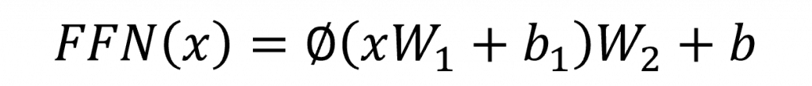

但這樣的設計它不會告訴你：「欸，這個資訊有用，那個沒用」。在深度學習裡當我們想要讓模型自己決定哪些特徵該留下，通常的做法就是用 `Wx + b`，讓它透過參數自己學。所以這時就出現了 SwiGLU 這個比較新穎的前饋層設計。

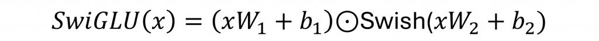

這個方法的核心在於引入一種閘控機制，概念上與我們學過的 LSTM 中使用 `sigmoid(Wx + b)` 的結構相似，用來判斷哪些訊號該被保留、哪些該被抑制。SwiGLU 的實作方式，是將中間層的輸出切成兩半其中一半直接作為主要訊號保留，另一半則經過 Swish 函數處理後，作為閘門訊號使用。

這個閘門負責調整哪些訊號應該被強化，哪些應該被抑制，等於替模型增加了一層訊息過濾的能力，使其在表達複雜關係時更具彈性，也更容易聚焦於關鍵特徵。對應的程式碼實作如下，展示了如何用 PyTorch 實現 SwiGLU 的前饋計算邏輯：

```
import torch
import torch.nn as nn
import torch.nn.functional as F

class SwiGLU(nn.Module):
    def __init__(self, d_model, d_ff):
        super().__init__()
        self.linear1 = nn.Linear(d_model, d_ff)  # 主訊號
        self.linear2 = nn.Linear(d_model, d_ff)  # 閘門訊號
        self.output_proj = nn.Linear(d_ff, d_model)  # 最終輸出維度投影

    def swish(self, x):
        return x * torch.sigmoid(x)

    def forward(self, x):
        gate = self.swish(self.linear2(x))       # 閘門經 Swish
        signal = self.linear1(x)                 # 主訊號
        fused = signal * gate                    # 逐元素相乘
        return self.output_proj(fused)           # 投影回輸出維度
```

3.RoPE
------

`RoPE（Rotary Positional Embedding）`是一種相當有趣且逐漸成為主流的位置信息編碼方式，它徹底改變了我們過去處理位置的方法。傳統的 Positional Encoding 通常是將一組 sin/cos 值加進詞向量中，等於是替每個詞貼上位置標籤。但 RoPE 採取的是完全不同的策略它不加而是轉進向量中。

更具體地說RoPE 將位置資訊以旋轉的方式直接作用在注意力機制中的 Query 和 Key 向量上。可以想像一下原始的向量是一根箭頭，而位置資訊就像是在多維空間中給這根箭頭旋轉一個角度，讓每個位置的向量指向不同的方向。這種旋轉式融合會讓模型更自然地感知相對位置，特別在處理長距離依賴的文本時，效果相當顯著。


當我們看圖中上半部的時候，其實它就是在講 RoPE 是怎麼動手處理這些向量的，假設現在我們只看一小部分的向量，也就是 Query 或 Key 裡面的一對維度首先 θ₁ 是根據位置算出來的一個角度，就有點像以前 Positional Encoding 用 sin/cos 去搞出的那些週期性訊號。然後紅色的 m 就是你目前這個詞的位置（比如說是第 1 個字、第 2 個字…這樣）。

接著你原本那個向量是`(x₁, x₂)`，RoPE 就是拿那個位置算出來的角度`mθ₁`，然後把這個向量整個旋轉一下。想像一下你在平面上拿著一根箭頭，把它轉個角度，方向就變了，但它還是同樣的長度。而這個轉過角度的新向量 `(x′₁, x′₂)`，就是經過 RoPE 編碼後的版本。這種方式不只加上了位置感，而且還讓每個位置的向量指向不一樣的方向，這對模型來說非常有幫助，因為它就能更靈活地理解 **誰跟誰的距離感** 這種語言特性。

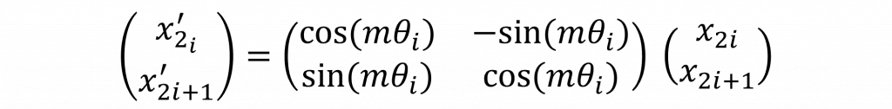

在數學實作上，RoPE 結合了 sin 與 cos 函數所構成的旋轉基底（這點與傳統方法相似），圖像上你可以把它想成，對於每一維的特徵，RoPE 都是在複數平面上轉了一圈而這個角度由位置決定。值得注意的是，它所使用的參數 θ 和傳統 Positional Encoding 中的 `10000^(2i/d)`結構其實很接近，只是 RoPE 沒有把它當成加法項處理，而是作為旋轉角度使用。這也意味著 RoPE 可以自然保留向量之間的相對位置信息，並在注意力內積的過程中持續發揮作用，而這樣子的好處是，**因此注意力可天然編碼相對距離 m−n** 使其知道序列之間的距離，而原始的RoPE我們可以如此撰寫

```
import torch

class RoPEOriginal:
    def __init__(self, seq_len, dim, base=10000.0, device="cuda"):
        # 確保維度是偶數，因為 RoPE 會將維度分成兩半處理
        assert dim % 2 == 0
        half = dim // 2

        # 建立索引，用於計算不同頻率的旋轉角度
        idx = torch.arange(half, device=device)

        # 計算每個維度對應的旋轉頻率比例 θ
        # theta = base^(-2i/dim)
        theta = base ** (-2 * idx / dim)

        # 建立序列位置 pos，形狀為 [seq_len, 1]
        pos = torch.arange(seq_len, device=device).float().unsqueeze(1)

        # 計算位置與頻率的乘積角度矩陣 [seq_len, dim/2]
        angles = pos * theta.unsqueeze(0)

        # 預先儲存 cosine 與 sine 值，供後續旋轉使用
        self.cos = angles.cos()  # [seq_len, dim/2]
        self.sin = angles.sin()  # [seq_len, dim/2]

    def apply(self, x):
        # x 的形狀為 [batch, seq_len, dim]
        # 將最後一個維度拆分成偶數與奇數索引兩部分
        x1, x2 = x[..., ::2], x[..., 1::2]

        # 將 cos 和 sin 的形狀擴展以便與 x 對齊
        # 形狀變為 [1, seq_len, 1, dim/2]
        cos = self.cos.unsqueeze(0).unsqueeze(2)
        sin = self.sin.unsqueeze(0).unsqueeze(2)

        # 套用旋轉位置編碼公式
        # x1p = x1 * cos - x2 * sin
        # x2p = x1 * sin + x2 * cos
        x1p = x1 * cos - x2 * sin
        x2p = x1 * sin + x2 * cos

        # 將旋轉後的結果重新拼接回 [batch, seq_len, dim]
        return torch.stack([x1p, x2p], dim=-1).flatten(-2)
```

其實你仔細看程式碼就會發現，原本的 RoPE 是先把整個 cos/sin 的表格都算好，這種做法在序列長度不長、模型又比較小的時候還算 OK。但一旦進入長序列訓練或推理這樣的表格就會使用超多記憶體。LLaMA 2 為了解決這問題，就改成「動態計算」cos 跟 sin，不再預先建立整張表。還有一點原本的頻率縮放是用 `10000^(2i/d)`，但 LLaMA 2 把它換成了 `base^(−d/2i)`，其實兩種寫法在數學上是等價的，只是後者看起來更簡潔，還直接表達出每半個維度頻率會降低的這個特性。

```
import torch
import torch.nn.functional as F

class RoPELlama2:
    def __init__(self, dim, base=10000.0, device="cuda"):
        assert dim % 2 == 0, "dim 必須為偶數"
        half = dim // 2

        # 頻率比例 (inv_freq)，根據維度遞減
        # θ_i = base^(-2i/dim)
        self.inv_freq = base ** (-torch.arange(0, half, device=device).float() / half)
        self.device = device

    def get_cos_sin(self, seq_len):
        # 建立位置索引 [seq_len]
        pos = torch.arange(seq_len, device=self.device).float()

        # 計算每個位置的角度 pos * inv_freq -> [seq_len, dim/2]
        angles = torch.einsum('i,j->ij', pos, self.inv_freq)

        # cos, sin 形狀 [seq_len, dim/2]
        cos = angles.cos()
        sin = angles.sin()
        return cos, sin

    def apply_rotary(self, x, cos, sin):
        # 將維度拆成兩半 (even, odd)
        x1 = x[..., ::2]
        x2 = x[..., 1::2]

        # 擴展 cos, sin 尺寸匹配
        cos = cos.unsqueeze(0).unsqueeze(2)  # [1, seq_len, 1, head_dim/2]
        sin = sin.unsqueeze(0).unsqueeze(2)

        # 套用旋轉公式
        x_rotated_even = x1 * cos - x2 * sin
        x_rotated_odd = x1 * sin + x2 * cos

        # 合併回原始形狀
        return torch.stack([x_rotated_even, x_rotated_odd], dim=-1).flatten(-2)
```

在 LLaMA 3 中，為了支援極長上下文 RoPE 的設計再最關鍵的變化是將旋轉頻率的 base 值從 LLaMA 2 的 10000 提升至 500000，這樣的調整使得角度變化的頻率下降得更慢，進而讓模型在面對長距離的 token 時仍能保持穩定且可區分的相對位置信息。

> 由於 sin 與 cos 本質上是週期函數，當序列長度變得非常長時，若 base 選得過小，會出現位置編碼繞回來的現象，使得序列尾端的位置信息與開頭產生混淆。而提升 base 的設定，正是為了拉長這樣的週期，避免長序列尾端出現與序列開頭環環相扣的錯位對齊問題，從而確保模型能穩定地捕捉遠距依賴關係。

```
import torch

class RoPELLama3:
    def __init__(self, head_dim, max_seq_len=4096, base=500000.0, device="cuda", dtype=torch.float32):
        # head_dim 必須為偶數
        assert head_dim % 2 == 0
        self.dim = head_dim
        self.device = device
        self.dtype = dtype

        # LLaMA 3 採用較大的 base（500000）以支援長上下文
        half = head_dim // 2
        idx = torch.arange(half, device=device, dtype=dtype)
        inv_freq = 1.0 / (base ** (idx / half))  # 頻率倒數，用於控制角度變化速度

        # 建立位置張量 [seq_len, 1]
        pos = torch.arange(max_seq_len, device=device, dtype=dtype).unsqueeze(1)

        # 角度矩陣 [seq_len, dim/2]
        angles = pos * inv_freq.unsqueeze(0)

        # 儲存 cosine/sine 值供後續使用
        self.register_buffers(angles)

    def register_buffers(self, angles):
        self.cos_cached = angles.cos()  # [seq_len, dim/2]
        self.sin_cached = angles.sin()  # [seq_len, dim/2]

    def apply_rotary_emb(self, x, seq_len=None):
        if seq_len is None:
            seq_len = x.shape[1]

        # 取對應長度的 cos/sin
        cos = self.cos_cached[:seq_len].unsqueeze(0).unsqueeze(2)  # [1, seq_len, 1, dim/2]
        sin = self.sin_cached[:seq_len].unsqueeze(0).unsqueeze(2)

        # 拆分偶數與奇數索引
        x1, x2 = x[..., ::2], x[..., 1::2]

        # 旋轉操作
        x1p = x1 * cos - x2 * sin
        x2p = x1 * sin + x2 * cos

        # 合併回 [batch, seq_len, num_heads, head_dim]
        return torch.stack([x1p, x2p], dim=-1).flatten(-2)
```

並且你可以看到 LLaMA 3 不再在每次 forward pass 中動態生成 sin 與 cos 表格，而是在初始化時就根據預設的最大序列長度（如 4096 或更長）預先計算好整張角度矩陣並緩存起來。這種方式在推理時只需從快取中擷取對應長度的部分，兼顧了執行效率與記憶體使用。

4.Grouped-Query Attention
-------------------------

`Grouped-Query Attention（GQA）` 的核心想法是讓多個查詢（Query）頭共用較少數量的鍵（Key）和值（Value）頭。假設有 `H` 個 attention 頭，我們可以將它們分成 `G` 組，讓每組共用同一組 Key 和 Value。這麼做的好處包括：

*   **計算成本下降**：只需要為 G 組計算 K 和 V，而非 H 組。
*   **記憶體使用量減少**：降低了儲存 Key 和 Value 的需求。

在 LLaMA 系列模型中ROPE 是套用在 `q` 和 `k` 上，因此在此實作中我們也使用該作法。

```
class GQAAttention(nn.Module):
    def __init__(self, dim, num_heads, num_kv_heads, rope_base=500000.0, max_seq_len=4096):
        super().__init__()
        assert num_heads % num_kv_heads == 0  # 確保 Query 頭數能被 KV 頭數整除（好做分組）
        
        self.dim = dim  # 輸入特徵維度
        self.h = num_heads  # Query 總頭數
        self.kvh = num_kv_heads  # KV 頭數
        self.head_dim = dim // num_heads  # 每個 attention 頭的維度

        # 線性轉換層：生成 Q, K, V
        self.wq = nn.Linear(dim, dim, bias=False)  # 為所有 Q 頭產生 Q
        self.wk = nn.Linear(dim, self.kvh * self.head_dim, bias=False)  # 為 G 組產生 K
        self.wv = nn.Linear(dim, self.kvh * self.head_dim, bias=False)  # 為 G 組產生 V
        self.wo = nn.Linear(dim, dim, bias=False)  # 輸出映射層

        # Rotary Positional Embedding：LLaMA 風格的位置編碼
        self.rope = RoPELLama3(self.head_dim, max_seq_len=max_seq_len, base=rope_base)

    def forward(self, x, mask=None):
        B, T, C = x.shape  # B: batch size, T: sequence length, C: hidden dim

        # 產生 Q, K, V，並 reshape 成多頭格式
        q = self.wq(x).view(B, T, self.h, self.head_dim)
        k = self.wk(x).view(B, T, self.kvh, self.head_dim)
        v = self.wv(x).view(B, T, self.kvh, self.head_dim)

        # 套用 Rotary Positional Embedding 到 Q 和 K 上
        q = self.rope.apply_rotary_emb(q, seq_len=T)
        k = self.rope.apply_rotary_emb(k, seq_len=T)

        # 將較少的 KV 頭複製，使其能與所有 Q 頭對應
        group_size = self.h // self.kvh  # 每組共享多少 Q 頭
        k = k.repeat_interleave(group_size, dim=2)
        v = v.repeat_interleave(group_size, dim=2)

        # 計算注意力分數
        attn_scores = torch.einsum("bthd,bThd->bhtT", q, k) / math.sqrt(self.head_dim)
        
        # 如果有 mask，將無效位置設為 -inf 以避免注意力聚焦
        if mask is not None:
            attn_scores = attn_scores.masked_fill(mask == 0, float("-inf"))
        
        # 計算 softmax 注意力權重
        attn = torch.softmax(attn_scores, dim=-1)
        
        # 使用注意力權重加權 V 並輸出
        out = torch.einsum("bhtT,bThd->bthd", attn, v).contiguous().view(B, T, C)
        return self.wo(out)
```

到這裡為止我們可以清楚地看到，目前的大型語言模型在設計上已進行了多項技術層面的革新，而這些改良往往不只是單純的效能優化，更是針對原有方法進行深度的重構。像是 RoPE 的演進過程便是一個鮮明的例子從原始版本中的預算旋轉表格，到 LLaMA 2 採用的動態計算策略，再到 LLaMA 3 透過提升 base 值來穩定長距離表徵，這些變化雖然在實作上大幅度偏離了傳統 Positional Encoding 的架構，但其核心概念仍舊保留在其中。

這些創新不是完全拋棄舊技術，而是在其原理的基礎上，針對現代模型的需求進行了極具針對性的強化與轉化。這種保留骨幹、重構細節的策略，幾乎成為了所有AI模型的演化方式。

下集預告
----

今天我們已經把 LLaMA 這個語言模型的架構拆解完畢，讓大家對它的內部運作有了初步了解。那明天呢我們會進一步教你們怎麼從零開始建立一整個 LLaMA 模型，還會帶你操作怎麼登入 Hugging Face、取得權限，還有其他實用功能。

接下來我們也會陸續介紹 base 版本跟 chat 版本的建構方式，以及怎麼優化推理速度、提升效能等重要資訊。這些通通都會在之後的內容中告訴你們，就敬請期待囉！

我們明天見～

---

<a id="8357-day-27"></a>

## Day 27｜【Day 27】RoPE(x) = cosθx + sinθ(-x)？LLaMA 3 的 Wx + b 的完整拆解

- 原文：https://ithelp.ithome.com.tw/articles/10396096

前言
--

今天這篇文章我們就要從 HuggingFace 的 LLaMA 3 實作出發，帶大家完整解析其內部架構與運作邏輯。特別聚焦在 Transformer 模型裡最常見也最重要的推論加速技巧 KV cache 的運作方式。我們會一步步拆開 RoPE 的位置編碼設計、GQA 如何降低計算成本、KV 快取如何避免重複運算，同時實際帶你看看它們的 PyTorch 程式碼長什麼樣子。

先來談談 LLaMA 3 的整體架構它的參數規模非常的高。在8B參數量的模型中，它支援最多 **128256 個輸入 token**，而像是 embedding、FFN、Attention 模組等部分的參數也都比前代大幅提升。再加上整整 **32 層 Decoder**，不難看出這是一個相當重型的模型。從 HuggingFace 的模型結構來看，`LlamaForCausalLM` 類別裡包含了主要的模型與語言模型頭（`lm_head`），而主體架構可大致拆解如下：

```
LlamaForCausalLM(
  (model): LlamaModel(
    (embed_tokens): Embedding(128256, 4096)
    (layers): ModuleList(
      (0-31): 32 x LlamaDecoderLayer(
        (self_attn): LlamaAttention(
          (q_proj): Linear(in_features=4096, out_features=4096, bias=False)
          (k_proj): Linear(in_features=4096, out_features=1024, bias=False)
          (v_proj): Linear(in_features=4096, out_features=1024, bias=False)
          (o_proj): Linear(in_features=4096, out_features=4096, bias=False)
        )
        (mlp): LlamaMLP(
          (gate_proj): Linear(in_features=4096, out_features=14336, bias=False)
          (up_proj): Linear(in_features=4096, out_features=14336, bias=False)
          (down_proj): Linear(in_features=14336, out_features=4096, bias=False)
          (act_fn): SiLU()
        )
        (input_layernorm): LlamaRMSNorm((4096,), eps=1e-05)
        (post_attention_layernorm): LlamaRMSNorm((4096,), eps=1e-05)
      )
    )
    (norm): LlamaRMSNorm((4096,), eps=1e-05)
    (rotary_emb): LlamaRotaryEmbedding()
  )
  (lm_head): Linear(in_features=4096, out_features=128256, bias=False)
)
```

在這個結構中我們是看不到位子設計的，過去許多模型都會在 `embedding` 階段就把位置資訊加進去，例如使用 sinusoidal 或 learned positional embedding。但 LLaMA 3 採取的路線是embedding 階段只專注於詞彙本身的向量表示，位置資訊則完全交由 **RoPE 搭配 GQA** 在 Attention 計算階段動態處理。這種做法雖然設計上更複雜，但好處是彈性高且更符合實際語境中的 token 排列邏輯。

不過今天的主角不只有這兩個設計，還有一個跟推論效率息息相關的元件 **KV cache**。該方式簡單來說當模型用於聊天或文本生成時，它每次推論只會產生一個新 token。若每次都重新計算所有的 Query、Key、Value，那效率會大打折扣。KV cache 的做法是把已經算好的 K 和 V 快取起來，下一次生成時就可以直接使用，省下重複計算的時間和資源。

所以在今天我們將會一步步拆解如何為一個大型語言模型設計一套高效、可擴展的 KV cache 機制。

1. RoPE
-------

在這裡 RoPE 的實作我們昨天已經知道該如何進行了，也就是透過餘弦與正弦角度生成方式，建立可快取的旋轉張量，再將這些角度作用到向量上，實現位置嵌入：

```
class RotaryEmbedding(nn.Module):
    """
    RoPE cache in cos/sin。與 HF 相同的 rope_theta。
    """
    def __init__(self, dim, max_position_embeddings=8192, base=10000.0, device=None):
        super().__init__()
        self.dim = dim
        self.base = base
        self.max_position = max_position_embeddings
        inv_freq = 1.0 / (base ** (torch.arange(0, dim, 2, device=device).float() / dim))
        self.register_buffer("inv_freq", inv_freq, persistent=False)
        self._set_cos_sin_cache(max_position_embeddings, device)

    def _set_cos_sin_cache(self, seq_len, device):
        t = torch.arange(seq_len, device=device, dtype=self.inv_freq.dtype)  # [T]
        freqs = torch.einsum("i,j->ij", t, self.inv_freq)  # [T, dim/2]
        emb = torch.cat([freqs, freqs], dim=-1)  # [T, dim]
        self.register_buffer("cos_cached", emb.cos()[None, None, :, :], persistent=False)  # [1,1,T,dim]
        self.register_buffer("sin_cached", emb.sin()[None, None, :, :], persistent=False)  # [1,1,T,dim]

    def forward(self, seq_len_needed):
        """
        回傳 cos/sin cache（直到需要的 seq_len）。
        只負責提供索引所需長度，實際 slice 在 attention 內完成。
        """
        if (self.cos_cached is None) or (seq_len_needed > self.cos_cached.size(2)):
            new_len = max(seq_len_needed, (self.max_position * 2 if self.max_position else 16384))
            self._set_cos_sin_cache(new_len, device=self.inv_freq.device)
        return self.cos_cached[:, :, :seq_len_needed, :], self.sin_cached[:, :, :seq_len_needed, :]
```

同樣地 LLaMA 3 使用 `inv_freq` 這個變數來為不同維度建立頻率變化，這是實現 RoPE 的第一步。接下來它會根據這些頻率，事先為每一個可能的位置準備好對應的 **cos/sin 向量**。這些向量會被**快取（cache）**起來，避免在每次推論時重複運算。

這樣一來每當模型需要嵌入位置資訊時，就能直接從快取中取出對應的旋轉角度，快速完成計算。同時這套設計也支援 **動態長度擴展**，能靈活應對不同長度的輸入序列。不過真正把這些位置資訊應用到 token 向量上的關鍵，其實藏在下面這個函式中：

```
def apply_rotary_pos_emb(x, cos, sin):
    x1, x2 = x[..., : x.size(-1) // 2], x[..., x.size(-1) // 2 :]
    x_rot = (x * cos) + (torch.cat([-x2, x1], dim=-1) * sin)
    return x_rot
```

這樣一來就算模型本身沒用絕對位置編碼，它依然能夠根據這些相對位置信息，理解整個序列的順序。

當然可以，這段說明我幫你口語化整理如下：

2. GQA + KV cache
-----------------

複習一下傳統的多頭注意力機制，基本上一般的做法是 Q、K、V這三個的頭數都是一樣的，也就是說如果你有 H 個注意力頭，那 Q、K、V 都會各有 H 個對應的頭。但 GQA 保留了 Q 有 H 個頭不變，但是把 K 跟 V 的頭數減少了，可能只保留原來的四分之一或八分之一的數量。那這樣少了怎麼辦？很簡單，**就是把這些比較少的 K/V 頭「重複使用」，讓每個 Q 頭都還是能跟它們互動。**

這樣做有幾個明顯的好處：

1.   **省記憶體**：因為 K/V 的矩陣小了很多。
2.   **跑得快**：資料量變少，速度自然就上來了。
3.   **表現依然不錯**：即便簡化了，在 decoder-only 的模型裡效果也還是很穩定。

再來看看程式碼的部分：

```
def _repeat_kv(self, x):
    if self.num_kv_heads == self.num_heads:
        return x
    repeat = self.num_heads // self.num_kv_heads
    return x.repeat_interleave(repeat, dim=1)
```

這段程式碼的意思是如果 K/V 的頭數和 Q 一樣多，那就直接回傳原本的資料。否則就用 `repeat_interleave` 把 K/V 重複幾次，湊到跟 Q 一樣多的頭數。這樣輸出的形狀會變成 `(batch_size, num_heads, ...)`，方便接下來做 dot product。

接著談到 **kv cache** 在Transformer的處理，如果模型有使用 cache（像 Hugging Face 的 `use_cache=True`），它就會先檢查之前有沒有存過的 Key/Value。如果有就拿出來；然後再把這次新來的 token 加上之前的，變成一整段更長的序列。

```
if past_key_value is not None:
    past_k, past_v = past_key_value
    T_past = past_k.size(2)
else:
    past_k = past_v = None
    T_past = 0
T_total = T_past + t
```

然後它就會把舊的和新的 K/V 合併起來（`concat`），存到 `present` 變數裡下次還可以接著用。

```
if past_k is not None:
    k_cat = torch.cat([past_k, k_new], dim=2)
    v_cat = torch.cat([past_v, v], dim=2)
else:
    k_cat, v_cat = k_new, v
present = (k_cat, v_cat) if use_cache else None
```

這樣一來不管是延續上下文還是加快推論速度，因此整個GQA我們可以如此撰寫程式碼。

```
class LlamaAttention(nn.Module):
    def __init__(self, config):
        super().__init__()
        hidden_size = config.hidden_size
        self.num_heads = config.num_attention_heads
        self.num_kv_heads = getattr(config, "num_key_value_heads", self.num_heads)
        if self.num_heads % self.num_kv_heads != 0:
            raise ValueError("num_attention_heads must be divisible by num_key_value_heads for GQA.")
        self.head_dim = hidden_size // self.num_heads
        self.scale = 1.0 / math.sqrt(self.head_dim)

        # Projections: 形狀匹配 HF
        self.q_proj = nn.Linear(hidden_size, self.num_heads * self.head_dim, bias=False)
        self.k_proj = nn.Linear(hidden_size, self.num_kv_heads * self.head_dim, bias=False)
        self.v_proj = nn.Linear(hidden_size, self.num_kv_heads * self.head_dim, bias=False)
        self.o_proj = nn.Linear(self.num_heads * self.head_dim, hidden_size, bias=False)

        attn_pdrop = getattr(config, "attention_dropout", 0.0)
        resid_pdrop = getattr(config, "hidden_dropout", 0.0)
        self.attn_dropout = nn.Dropout(attn_pdrop)
        self.resid_dropout = nn.Dropout(resid_pdrop)

        # RoPE
        rope_theta = getattr(config, "rope_theta", 10000.0)
        max_pos = getattr(config, "max_position_embeddings", 8192)
        self.rotary_emb = RotaryEmbedding(self.head_dim, max_position_embeddings=max_pos, base=rope_theta)

        # 預建上三角 causal mask；必要時動態擴張
        mask = torch.triu(torch.ones((max_pos, max_pos), dtype=torch.bool), diagonal=1)
        self.register_buffer("causal_mask", mask[None, None, :, :], persistent=False)  # [1,1,T,T]

    def _repeat_kv(self, x):
        # x: [B, kv_heads, T, D] -> 重複到 [B, heads, T, D]
        if self.num_kv_heads == self.num_heads:
            return x
        repeat = self.num_heads // self.num_kv_heads
        return x.repeat_interleave(repeat, dim=1)

    def _grow_causal_mask(self, tgt_len, device):
        if self.causal_mask.size(-1) < tgt_len:
            new_max = max(tgt_len, self.causal_mask.size(-1) * 2)
            mask = torch.triu(torch.ones((new_max, new_max), dtype=torch.bool, device=device), diagonal=1)
            self.causal_mask = mask[None, None, :, :]

    def forward(self, x, attention_mask=None, past_key_value=None, use_cache=False):
        B, t, _ = x.size()
        device = x.device

        # 新片段投影
        q = self.q_proj(x)  # [B, t, H*D]
        k = self.k_proj(x)  # [B, t, KV*D]
        v = self.v_proj(x)  # [B, t, KV*D]

        q = q.view(B, t, self.num_heads, self.head_dim).permute(0, 2, 1, 3)      # [B, H, t, D]
        k = k.view(B, t, self.num_kv_heads, self.head_dim).permute(0, 2, 1, 3)  # [B, KV, t, D]
        v = v.view(B, t, self.num_kv_heads, self.head_dim).permute(0, 2, 1, 3)  # [B, KV, t, D]

        # === KV Cache：取出 past，並計算總長度 ===
        if past_key_value is not None:
            past_k, past_v = past_key_value  # [B, KV, T_past, D]
            T_past = past_k.size(2)
        else:
            past_k = past_v = None
            T_past = 0
        T_total = T_past + t  # K/V 的最終長度（包含 past + 新片段）

        # RoPE：取得到 T_total 的 cos/sin，並切出「新片段的 t 行」
        self._grow_causal_mask(T_total, device=device)
        cos_full, sin_full = self.rotary_emb(T_total)  # [1,1,T_total,D]
        cos = cos_full[:, :, T_total - t : T_total, : q.size(-1)]  # [1,1,t,D]
        sin = sin_full[:, :, T_total - t : T_total, : q.size(-1)]  # [1,1,t,D]

        # 套用 RoPE（僅對新片段）
        q = apply_rotary_pos_emb(q, cos, sin)          # [B, H, t, D]
        k_new = apply_rotary_pos_emb(k, cos, sin)      # [B, KV, t, D]

        # === KV Cache：拼接 past_k/past_v 與新片段 ===
        if past_k is not None:
            k_cat = torch.cat([past_k, k_new], dim=2)  # [B, KV, T_total, D]
            v_cat = torch.cat([past_v, v],     dim=2)  # [B, KV, T_total, D]
        else:
            k_cat, v_cat = k_new, v

        # 需要回傳 present 以便下次快取
        present = (k_cat, v_cat) if use_cache else None

        # GQA：將 KV 重複到與 H 相同的 head 數
        k_rep = self._repeat_kv(k_cat)  # [B, H, T_total, D]
        v_rep = self._repeat_kv(v_cat)  # [B, H, T_total, D]

        # 注意力計算：Q @ K^T -> [B, H, t, T_total]
        attn_scores = torch.matmul(q, k_rep.transpose(-1, -2)) * self.scale  # [B,H,t,T_total]

        # Causal mask：僅取對應「最後 t 列 x T_total 欄」的區塊，等價於行索引 [T_past: T_total]
        causal_slice = self.causal_mask[:, :, T_total - t : T_total, :T_total]  # [1,1,t,T_total]
        attn_scores = attn_scores.masked_fill(causal_slice, float("-inf"))

        # Padding additive mask（若提供，形狀 [B,1,1,T_total]，可廣播到 [B,H,t,T_total]）
        if attention_mask is not None:
            attn_scores = attn_scores + attention_mask

        attn_probs = F.softmax(attn_scores, dim=-1)
        attn_probs = self.attn_dropout(attn_probs)

        context = torch.matmul(attn_probs, v_rep)  # [B,H,t,D]
        context = context.transpose(1, 2).contiguous().view(B, t, self.num_heads * self.head_dim)  # [B,t,C]
        out = self.o_proj(context)
        out = self.resid_dropout(out)
        return out, present  # === 回傳 present（KV Cache）===
```

3. FFN
------

複習一下在傳統的 Transformer 裡 FFN 通常就是兩層線性層中間加個非線性激活函數形式大概是這樣：

```
FFN(x) = Linear2(activation(Linear1(x)))
```

而在昨天數學公式中我們其實需要**三個線性層** ，在這裡我們先看看程式碼。

```
class LlamaMLP(nn.Module):
    def __init__(self, config):
        super().__init__()
        hidden_size = config.hidden_size
        intermediate_size = config.intermediate_size
        self.gate_proj = nn.Linear(hidden_size, intermediate_size, bias=False)
        self.up_proj = nn.Linear(hidden_size, intermediate_size, bias=False)
        self.down_proj = nn.Linear(intermediate_size, hidden_size, bias=False)
        self.dropout = nn.Dropout(getattr(config, "hidden_dropout", 0.0))

    def forward(self, x):
        x_g = F.silu(self.gate_proj(x))
        x_u = self.up_proj(x)
        x = x_g * x_u
        x = self.down_proj(x)
        x = self.dropout(x)
        return x
```

一開始的兩個步驟是這樣的 `gate_proj` 會先把輸入資料拉到一個比較大的維度，然後丟進一個叫 SiLU 的激活函數裡，這樣就產生一個gating 向量，有點像是學出來的一組開關。

接著 `up_proj` 這條線也會把原本的輸入資料投影到一樣大的維度，但它本身不做任何非線性處理。然後這兩條路線的輸出會進行 element-wise 相乘，也就是一個位置對應一個位置來做乘法。這樣一來，`gate_proj` 的輸出就變成了選通器，控制 `up_proj` 的訊號要不要通過。

但因為這樣一放大，維度也會跟著變大，所以我們還得用第三個線性層 `down_proj` 把資料縮回原來的維度，這樣才不會影響到後面的結構或計算量。

4. LLaMA Decoder
----------------

在看 Decoder Layer 的時候，其實我們只需要搞清楚一件事：原本論文是用 pre-normalization 還是 post-normalization 的方法。像在 LLaMA 這個架構裡，Decoder 的設計有個很關鍵的點，就是它採用的是 **pre-normalization**。意思就是，每個子層在運算前，先做正規化。這樣的設計對模型來說有幾個好處，像是更穩定，也比較容易收斂，訓練起來效果會比較好。

```
class RMSNorm(nn.Module):
    # 與 HF LlamaRMSNorm 相同語意
    def __init__(self, hidden_size, eps=1e-6):
        super().__init__()
        self.weight = nn.Parameter(torch.ones(hidden_size))
        self.eps = eps

    def forward(self, x):
        # x: [..., hidden_size]
        norm = x.pow(2).mean(dim=-1, keepdim=True)
        x = x * torch.rsqrt(norm + self.eps)
        return self.weight * x
```

在 KV cache 裡我們需要設定一個 `past_key_value`，也就是把之前存下來的 key 跟 value 拿來做 attention 計算。然後系統會回傳一個 `present`（也就是這一層在當前時間步算出來的 key/value），之後推論時就可以直接拿來用。這個機制在做 autoregressive decoding（像是逐字產生文字）時特別有用，因為它可以省下重複算前面那些 token 的 attention 的時間。其他部分的設計其實就跟 Decoder 的原則一樣。

```
class LlamaDecoderLayer(nn.Module):
    def __init__(self, config):
        super().__init__()
        eps = getattr(config, "rms_norm_eps", 1e-6)
        self.input_layernorm = RMSNorm(config.hidden_size, eps=eps)
        self.self_attn = LlamaAttention(config)
        self.post_attention_layernorm = RMSNorm(config.hidden_size, eps=eps)
        self.mlp = LlamaMLP(config)

    def forward(self, x, attention_mask=None, past_key_value=None, use_cache=False):
        """
        past_key_value:  # === KV Cache ===
            該層的 (past_k, past_v) 或 None
        use_cache:
            True -> 回傳 present_key_value 供下次使用
        """
        attn_out, present = self.self_attn(
            self.input_layernorm(x),
            attention_mask=attention_mask,
            past_key_value=past_key_value,
            use_cache=use_cache,
        )
        x = x + attn_out
        x = x + self.mlp(self.post_attention_layernorm(x))
        if use_cache:
            return x, present  # === 回傳 present（KV Cache）===
        return x
```

5. LLaMA主架構
-----------

模型的開頭會先經過一個詞嵌入層，這層的作用就是把每個 token 的索引值轉換成向量的形式，讓後面模型能理解這些詞的語意。接著模型會堆疊好幾層 Transformer Decoder，每一層負責進一步處理與理解輸入的上下文資訊。

比較核心的運算邏輯是寫在 `forward` 方法裡，這部分設計得滿彈性的，支援各種不同的輸入輸出選項。特別值得一提的是，在做推論的時候會用到 `past_key_values`，這東西是用來記錄前面步驟的注意力資訊。

```
def _make_additive_attn_mask(attention_mask, dtype):
    """
    將 [B, T_total] mask (1=keep, 0=pad) 轉成加法遮罩 [B, 1, 1, T_total]
    其中 keep=0，masked=-inf，以供 softmax 前相加。
    """
    if attention_mask is None:
        return None
    if attention_mask.dim() != 2:
        raise ValueError("attention_mask must be [batch, seq_len]")
    extended = attention_mask[:, None, None, :]  # [B,1,1,T_total]
    extended = extended.to(dtype=dtype)
    neg_inf = torch.finfo(dtype).min
    return (1.0 - extended) * neg_inf
    
class LlamaModel(nn.Module):
    def __init__(self, config):
        super().__init__()
        self.config = config

        self.embed_tokens = nn.Embedding(config.vocab_size, config.hidden_size)
        self.layers = nn.ModuleList([LlamaDecoderLayer(config) for _ in range(config.num_hidden_layers)])
        self.norm = RMSNorm(config.hidden_size, eps=getattr(config, "rms_norm_eps", 1e-6))
        self.dropout = nn.Dropout(getattr(config, "hidden_dropout", 0.0))

        self.apply(self._init_weights)

    def _init_weights(self, module):
        # Llama 初始化：normal(0, 0.02)
        if isinstance(module, nn.Linear):
            nn.init.normal_(module.weight, mean=0.0, std=getattr(self.config, "initializer_range", 0.02))
            if module.bias is not None:
                nn.init.zeros_(module.bias)
        elif isinstance(module, nn.Embedding):
            nn.init.normal_(module.weight, mean=0.0, std=getattr(self.config, "initializer_range", 0.02))

    def forward(
        self,
        input_ids,
        attention_mask=None,          # [B, T_total]；含 pad=0 的位置
        past_key_values=None,         # === KV Cache：list(tuple(k,v))，每層一組 ===
        use_cache=False,              # === KV Cache：是否回傳 present ===
        output_hidden_states=False,
        return_dict=False,
    ):
        B, t = input_ids.size()
        x = self.embed_tokens(input_ids)  # [B, t, C]
        x = self.dropout(x)

        # 建立 additive mask（對齊 T_total），若 None 則不加
        ext_mask = _make_additive_attn_mask(attention_mask, x.dtype) if attention_mask is not None else None

        all_hidden_states = [] if output_hidden_states else None
        presents = [] if use_cache else None

        # past_key_values：長度應等於層數；若 None，視為每層皆無 past
        if past_key_values is None:
            past_key_values = [None] * len(self.layers)

        for i, blk in enumerate(self.layers):
            if output_hidden_states:
                all_hidden_states.append(x)

            layer_past = past_key_values[i]  # 該層 past 或 None
            if use_cache:
                x, present = blk(
                    x,
                    attention_mask=ext_mask,
                    past_key_value=layer_past,
                    use_cache=True,
                )
                presents.append(present)  # === 收集 present（KV Cache）===
            else:
                x = blk(
                    x,
                    attention_mask=ext_mask,
                    past_key_value=layer_past,
                    use_cache=False,
                )

        x = self.norm(x)
        if output_hidden_states:
            all_hidden_states.append(x)

        if return_dict:
            return {
                "last_hidden_state": x,
                "hidden_states": all_hidden_states,
                "past_key_values": presents,  # === KV Cache 回傳 ===
            }
        return (x, all_hidden_states, presents)
```

再來談到模型初始化這塊你會注意到它有定義一個 `_init_weights` 的方法，這個方法會自動套用到模型裡所有的線性層和嵌入層上，並用高斯分布（通常是平均為 0、標準差為 0.02）來初始化權重。這種是HF最常見的初始化方式能幫助模型在訓練一開始就比較穩定。

5. LM Head
----------

在這種`因果語言模型（causal language model）`裡，最後通常會接一個叫做LM head的東西。它的工作就是把模型輸出的那些隱藏向量，轉成一個機率分布，簡單來說，就是幫你預測下一個最有可能出現的字是什麼。像這邊提到的 `LlamaForCausalLM`，其實就是把核心的 `LlamaModel` 包起來，再接上一個 `lm_head` 層。這個 `lm_head` 就是一層線性變換，它的輸出大小會對應整個詞彙表，也就是說，模型每預測一個字，就會算出所有詞的分數（logits）。而且通常這個 `lm_head` 的權重，會直接綁定到詞嵌入（`embed_tokens`）那邊的權重，這個技巧在 GPT-2 就有用了，其實在 Transformer 架構裡也滿常見的。

```
class LlamaForCausalLM(nn.Module):
    def __init__(self, config):
        super().__init__()
        self.model = LlamaModel(config)
        self.lm_head = nn.Linear(config.hidden_size, config.vocab_size, bias=False)
        # 權重綁定
        self.lm_head.weight = self.model.embed_tokens.weight

    # HF API helpers
    def get_output_embeddings(self):
        return self.lm_head

    def set_output_embeddings(self, new_embeddings):
        self.lm_head = new_embeddings

    def forward(
        self,
        input_ids,
        attention_mask=None,
        labels=None,
        past_key_values=None,   # === KV Cache：輸入 past ===
        use_cache=False,        # === KV Cache：是否輸出 present ===
        output_hidden_states=False,
        return_dict=False,
    ):
        outputs = self.model(
            input_ids=input_ids,
            attention_mask=attention_mask,
            past_key_values=past_key_values,  # === KV Cache 傳入 ===
            use_cache=use_cache,              # === KV Cache 啟用 ===
            output_hidden_states=output_hidden_states,
            return_dict=True,
        )
        hidden_states = outputs["last_hidden_state"]  # [B, t, C]
        logits = self.lm_head(hidden_states)          # [B, t, vocab]

        loss = None
        if labels is not None:
            # 只對齊自回歸訓練格式
            shift_logits = logits[..., :-1, :].contiguous()
            shift_labels = labels[..., 1:].contiguous()
            loss_fct = nn.CrossEntropyLoss(ignore_index=-100)
            loss = loss_fct(shift_logits.view(-1, shift_logits.size(-1)), shift_labels.view(-1))

        if return_dict:
            return {
                "loss": loss,
                "logits": logits,
                "hidden_states": outputs["hidden_states"],
                "past_key_values": outputs["past_key_values"],  # === KV Cache 回傳 present ===
            }
        return (loss, logits, outputs["hidden_states"], outputs["past_key_values"])
```

而模型第一次開始生成文字時，`past_key_values` 是空的（設為 None），所以模型得從頭開始計算整個序列的 Query、Key 跟 Value。但在接下來繼續生成的過程中，只會輸入最新的一個 token，然後把前一次算好的 `past_key_values` 傳進去。這時如果這時有開啟 `use_cache=True`，模型還會把新的 Key/Value（也就是 `present_key_values`）回傳回來，這樣下一步可以繼續接著用，不用每次都從頭來過來增加推理速度。

下集預告
----

明天我會跟大家分享怎麼訓練出屬於自己的聊天機器人，也會帶你們了解現在這些大型語言模型從訓練到實際應用之間，整個流程是怎麼走的。你可以把明天的內容想像成 ChatGPT 從模型設計、訓練，到最後變成一個網站可以用的那個完整過程。而且我也會講一下，從 GPT-3.5 演進到現在的 GPT，公開資料中到底透露了哪些技術和方法。

---

<a id="8357-day-28"></a>

## Day 28｜【Day 28】弱智吧 is all you need？教AI聽懂亂流語言的奇幻旅程

- 原文：https://ithelp.ithome.com.tw/articles/10396537

前言
--

今天我們要來談談一個很好玩的資料集"弱智吧"，沒錯你沒看錯就是那個在網路上以瘋言瘋語、奇思妙想著稱的討論區。乍看之下這種地方的對話充滿跳針、無厘頭，甚至讓人懷疑發言者是不是認真在講話。但也正因如此這類資料特別適合拿來做語言模型的微調訓練，因為它具備了高度非結構化、多樣語境轉換與語言風格突變的特性——這些恰恰是測試與強化模型對話理解能力的絕佳素材。

而在今天我們先告訴你一個LLM怎麼做的，然後再一步步實作如何用"弱智吧"資料，搭配 Chat 模型格式並加入NEFtune這項技術，打造一個不只能理解亂流對話，還能用哲學角度回應你的人文風格聊天機器人。

Instruction 與 RLHF
------------------

我們先前使用的 GPT‑2 是典型的 base 模型。它在文字生成上表現不俗，能接續段落、創作詩句、撰寫簡短故事，但若給它請總結下列文章或進行多輪對話這類指令型任務，它常常跑題，無法準確執行任務或維持對話連貫性。這是因為 base 模型雖具備語言能力，但缺乏任務導向與上下文理解的機制。

到了 GPT‑3，模型參數量大幅提升，使其在翻譯、摘要、問答、寫程式等多種自然語言處理任務上展現更高水準。不過，原始的 GPT‑3 模型仍然只是被動地接續輸入文字，對於明確執行人類指令這件事並不擅長，回應品質也時常忽高忽低、不穩定。

為了改善這個問題，OpenAI 開發了 **InstructGPT**。它是在 GPT‑3 的基礎上加入了一套關鍵訓練流程`指令微調（instruction tuning）`搭配 `RLHF（Reinforcement Learning from Human Feedback）`。RLHF 的主要目的是讓模型學會產出人類認為好的回答

而實際做法是會讓 base 模型針對同一個 prompt 生成多個回答，並請人類標註者對這些回答依品質進行排序。這些排序資料會用來訓練一個 **獎勵模型（Reward Model）**，這個模型能學會模擬人類偏好，對語言模型輸出的文字進行評分。

接著語言模型會利用這個獎勵模型的評分進行**強化學習**，常用的方法是 **PPO（Proximal Policy Optimization）**。透過 PPO，語言模型的生成策略會逐步朝向人類偏好靠攏，例如更清晰、有條理、符合語境或更具禮貌。這樣的調校大幅提升了語言模型的任務執行力與對話品質。從 InstructGPT 開始，模型能更準確地依據指令回應，理解使用者意圖，並避免不當或偏差的內容。這也為 ChatGPT 的誕生奠定基礎。

**ChatGPT（GPT‑3.5）與 GPT‑4**這種透過 RLHF 調教出來的對話能力更加成熟。這些模型不僅能進行上下文連貫的多輪對話，還能維持語氣一致、合理拒絕敏感請求，甚至在對話中穿插幽默或進行自我澄清。

> 簡單來說一個 LLM 的出現過程大致如下，首先從大量語料訓練出一個預訓練的 base 模型，接著透過 instruction tuning 讓模型具備基本的任務理解與指令回應能力，轉化為 Chat 形式。之後，開發者會收集人類標註者針對模型回答的偏好排序，用來訓練一個獎勵模型，使其能對回應進行自動評分。最後模型根據這些評分結果，透過 PPO進行強化學習，逐步學會產出更符合人類期待的回應。

在中文互聯網文化中弱智吧是一個非常獨特的存在。它原本是百度貼吧中的一個子版塊，內容充滿了看似荒謬、邏輯混亂甚至無厘頭的貼文。這些發言的共同特點是：語言誇張、思路跳脫、常見諧音與反諷。一句話形容的話，「越是正常的說法，越不合這個貼吧的胃口」。

乍看之下這樣的內容似乎沒什麼價值，甚至顯得低俗或反智。但有趣的是近年來這類語言風格反而在人工智慧領域引起關注，特別是在中文語言模型的訓練與微調階段。研究者發現與其使用過度乾淨、正規的語料，不如加入這類語義扭曲、邏輯不穩定的文本，讓模型學會如何處理更複雜的語言變體。例如弱智吧中的問題經常帶有雙關、多義、反問或模稜兩可的用詞，這些正好可以訓練模型面對語言的灰色地帶，而今天我們將要用這個資料集進行模型的訓練。

1. 讀取資料
-------

今天我們用的資料一樣是從 m-a-p/COIG-CQIA 這個資料集中提取的弱智吧內容，大家可以直接到我的 [GitHub](https://github.com/AUSTIN2526/learning-wx-b-in-30-days) 頁面下載資料。至於今天要用的模型，是 Chat 版本的，不像之前我們用的 GPT-2 base model 那樣。這個 Chat 模型是透過微調原本的 base model 來實現的，所以它可以更好地理解並判斷多人對話的情境，例如在LLaMA 3上他的特定輸入格式是：

```
<|begin_of_text|><|start_header_id|>system<|end_header_id|>

這是系統指令<|eot_id|><|start_header_id|>user<|end_header_id|>

這是用戶的輸入<|eot_id|><|start_header_id|>assistant<|end_header_id|>

這是模型回復<|eot_id|>
```

這格式看起來滿複雜的對吧？早期在 HuggingFace上用這類模型的時候，我們還得自己手動加這些 token，真的蠻麻煩的。而且不同的 Chat 模型格式還都不一樣，導致我們寫程式的時候很難統一處理。不過現在比較方便了，只要你用的是 Chat 版本的 tokenizer，它通常都會自帶一個叫做 `apply_chat_template` 的方法，直接就可以把對話格式套進去。這個方法的用法跟現在 ChatGPT API 裡的輸入格式很像，就是一個由多個角色（像 system、user、assistant）組成的訊息列表（messages）。其中 system 就是我們拿來放指令的地方，所以你可以這樣寫程式碼：

```
import pandas as pd

def transform_format(instructions, outputs, system="你是一個繁體中文聊天機器人"):
    data = []
    for q, a in zip(instructions, outputs):
        data.append([
            {"role": "system", "content": system},
            {"role": "user", "content": q},
            {"role": "assistant", "content": a}
        ])
    return data
    
df = pd.read_csv("ruozhiba_trad.csv", encoding="utf-8")
df = df.dropna(subset=["instruction", "output"])
formatted = transform_format(df["instruction"], df["output"])
```

我們先來理解一下關於大型語言模型（LLM）的一個基本概念所謂的 Chat 版本，其實是從 base 版本的 LLM 開始，透過 `SFT（Supervised Fine-Tuning）`這種微調的方式訓練出來的。這個過程同時也會搭配我們在第 25 天講過的 Instruction Learning 技術，讓模型能聽得懂任務的指令，並且學會哪些回答該給、哪些不能亂講。

2. 讀取模型並量化
----------

當我們用 `prepare_model_for_kbit_training` 這個函數來處理模型，其實就是在幫模型做好低位元訓練的準備工作。這一步的主要目的是讓模型在只用少量精度的情況下，還能穩定地訓練，不會因為精度損失導致梯度亂跳、效果變差。順便複習一下這個函數會做幾件事，它會把模型原本的大部分參數凍結起來，這樣可以省下很多資源，然後也會啟用 gradient checkpointing，來進一步節省記憶體用量。

做好這些準備後，我們就可以把 LoRA 模組加進來了，具體來說我們會針對 `k`、`q`、`v`、`o` 這些部分進行訓練，這樣就完成了模型量化跟 LoRA 組件的整合。

```
from transformers import BitsAndBytesConfig, AutoModelForCausalLM, AutoTokenizer
from peft import LoraConfig, get_peft_model, prepare_model_for_kbit_training
import torch

def load_llama_model(model_name='meta-llama/Meta-Llama-3-8B-Instruct'):
    quantization_params = {
        'load_in_4bit': True,
        'bnb_4bit_quant_type': "nf4",
        'bnb_4bit_use_double_quant': True,
        'bnb_4bit_compute_dtype': torch.bfloat16
    }
    bnb_config = BitsAndBytesConfig(**quantization_params)

    tokenizer = AutoTokenizer.from_pretrained(model_name, use_fast=True)
    if tokenizer.pad_token is None:
        tokenizer.pad_token = tokenizer.eos_token

    model = AutoModelForCausalLM.from_pretrained(
        model_name,
        quantization_config=bnb_config,
        torch_dtype=torch.bfloat16,
        device_map="auto",
        use_cache=False,
    )

    peft_params = {
        'r': 32,
        'target_modules': ["q_proj", "k_proj", "v_proj", "o_proj"],
        'lora_dropout': 0.1,
        'task_type': "CAUSAL_LM",
    }
    peft_config = LoraConfig(**peft_params)

    model = prepare_model_for_kbit_training(model, use_gradient_checkpointing=True)
    model = get_peft_model(model, peft_config)

    return model, tokenizer

model = load_llama_model()
```

3. 加入NEFtune
------------

我們要把 **NEFTune** 技術加進模型裡。簡單來說NEFTune 是一種在訓練期間，針對輸入的嵌入加上一點隨機噪音的小技巧。雖然看起來只是加點 noise，但這其實對訓練很有幫助。為什麼要這麼做？因為在低精度訓練的情況下，模型對輸入變化的敏感度會變得比較高，這就容易讓訓練不穩定。NEFTune 就像是在這種不穩的情況下，給模型多一點彈性，讓它能更穩定地收斂。

根據 [原始論文](https://arxiv.org/abs/2310.05914)，這個方法實際在某些資料集上，甚至可以讓 LLaMA 模型的效能提升接近兩倍，效果非常驚人。這也是為什麼現在越來越多人在進行微調時會主動加上 NEFTune，而在程式上我們可以如此撰寫

```
from transformers.modeling_utils import unwrap_model

def activate_neftune(model, neftune_noise_alpha = 5):
        unwrapped_model = unwrap_model(model)
        embeddings = unwrapped_model.base_model.model.get_input_embeddings()
        embeddings.neftune_noise_alpha = neftune_noise_alpha
        # hook embedding layer
        hook_handle = embeddings.register_forward_hook(neftune_post_forward_hook)
        
        return model
        
def neftune_post_forward_hook(module, input, output):
    # 公式來源:https://github.com/neelsjain/NEFTune
    # 論文網址:https://arxiv.org/abs/2310.05914
    if module.training:
        dims = torch.tensor(output.size(1) * output.size(2))
        mag_norm = module.neftune_noise_alpha / torch.sqrt(dims)
        output = output + torch.zeros_like(output).uniform_(-mag_norm, mag_norm)
            
    return output
model = activate_neftune(model)
```

而在這裡的 `activate_neftune` 函數，主要是負責把 NEFTune 整合進我們的模型。而透過 `unwrap_model` 這個工具，把模型外層的包裝拆掉，取得最底層、也就是實際運作的模型架構。接著我們會定位到模型的輸入嵌入層，這是模型接收文字資料的第一個處理環節。

接下來我們會設定一個參數叫 `neftune_noise_alpha`，這個值決定了噪音的強度。設定好之後我們會在嵌入層上註冊一個 `forward hook`。這個 hook 的功能是在每次模型做前向傳遞時，自動在輸出嵌入上加上一點隨機噪音。

4. 建立Pytorch DataLoader
-----------------------

當我們在使用 PyTorch 的 DataLoader 這塊時，整體流程其實和之前差不多。因為我們前面已經把格式處理好了，所以這邊只要直接套用 `apply_chat_template` 就能完成轉換。而且一樣要記得一件事處理 labels 的時候，要把那些 padding 的地方遮蔽起來，這點我們前面講過好幾次了。因為在訓練像這種 causal language model 時，這個步驟是絕對不能少的。

```
from torch.utils.data import Dataset, DataLoader

# 定義自定義 Dataset
class PTTDataset(Dataset):
    def __init__(self, formatted_context, tokenizer):
        self.formatted_context = formatted_context
        self.tokenizer = tokenizer

    def __getitem__(self, index):
        return self.formatted_context[index]
       
    def __len__(self):
        return len(self.formatted_context)

    def collate_fn(self, batch):
        formatted_contexts = self.tokenizer.apply_chat_template(batch, padding=True, return_dict=True, max_length=8192, return_tensors='pt', truncation=True)
        attention_mask = formatted_contexts['attention_mask']
        labels = formatted_contexts['input_ids'].clone()
        labels[attention_mask == 0] = -100
        formatted_contexts['labels'] = labels
        return formatted_contexts

# 建立資料集
trainset = PTTDataset(formatted, tokenizer)
validset = PTTDataset(formatted, tokenizer)

# 創建 DataLoader
train_loader = DataLoader(trainset, batch_size=4, shuffle=True, collate_fn=trainset.collate_fn)
valid_loader = DataLoader(validset, batch_size=4, shuffle=True, collate_fn=validset.collate_fn)
```

5. 開始訓練模型
---------

為什麼會這樣呢？這是因為 LoRA 的設計本身是輕量化的，只是在模型的一小部分（像是 attention weights）中插入少量可訓練的參數並沒有去動整個模型的主要權重，如果你學習率設得太高，那些少數參數很容易就會發散，讓模型的訓練變得不穩定。

```
import torch.optim as optim
from transformers import get_cosine_with_hard_restarts_schedule_with_warmup
from trainer import Trainer

optimizer = optim.AdamW(model.parameters(), lr=5e-5)
scheduler = get_cosine_with_hard_restarts_schedule_with_warmup(
        optimizer, 
        num_warmup_steps=len(train_loader) * 0.2, 
        num_training_steps=len(train_loader) * 10, 
        num_cycles=1, 
)

trainer = Trainer(
    epochs=10, 
    train_loader=train_loader, 
    valid_loader=valid_loader,
    model=model, 
    optimizer=optimizer,
    scheduler=scheduler,
    early_stopping=3,
    is_lora=True
)
trainer.train()
```

輸出結果：

```
rain Epoch 0: 100%|██████████| 60/60 [00:25<00:00,  2.38it/s, loss=1.820]
Valid Epoch 0: 100%|██████████| 60/60 [00:08<00:00,  7.02it/s, loss=1.703]
Saving Model With Loss 1.91710
Train Loss: 1.96181 | Valid Loss: 1.91710 | Best Loss: 1.91710

Train Epoch 1: 100%|██████████| 60/60 [00:25<00:00,  2.39it/s, loss=1.847]
Valid Epoch 1: 100%|██████████| 60/60 [00:08<00:00,  7.02it/s, loss=1.957]
Saving Model With Loss 1.88124
Train Loss: 1.92786 | Valid Loss: 1.88124 | Best Loss: 1.88124
```

5. 比對生成結果
---------

我們用資料集的第一筆資料來做生成和比對。

```
device = "cuda" if torch.cuda.is_available() else "cpu"
chat_input = formatted[0][:-1] 
inputs = tokenizer.apply_chat_template(
    chat_input,
    return_tensors="pt",
    padding=True,
    truncation=True
).to(device)

outputs = model.generate(inputs, max_new_tokens=100)
texts = tokenizer.batch_decode(outputs, skip_special_tokens=True)
reply = texts[0].split(chat_input[-1]["content"])[-1].strip()
print(reply)
```

訓練前的模型回覆長這樣：

```
我們相聚的意義在於創造一個舒適的環境，讓我們一起享用一些美好的時候，例如聚會、旅行、學習、交朋友等。
```

訓練後的模型則是這樣說的：

```
意義在於經驗與成長。相聚是人與人之間交流、理解、影響的過程，其價值不在永恆，而在於曾經共同存在的時間留下了改變。
如莊子所言：「相濡以沫，不如相忘於江湖。」別離不消解意義，只是使它完成。
```

從這兩段可以很明顯看出，模型訓練前後在生成風格上有不小的差異。沒訓練過的模型說話比較直接，像是在描述一個很普通的情境，例如「創造一個舒適的環境」或「一起享用一些美好的時候」，語句通順但比較平淡，內容也偏表面。

而訓練過的模型，講話就不一樣了。不只是用上了「經驗」、「成長」這些抽象概念，還引用了莊子的話，把人際關係拉到哲學的層次去談，整體語氣更有深度，也更有人文氣息。這代表訓練之後的模型，不只是講話變得更有表達力，連理解語境、呈現價值觀的能力也都提升了不少。

下集預告
----

今天我們聊的是一個模型是怎麼從 base 模型變成 chat 模型的第一步，也就是先經過 Instruction 微調，讓它能比較好地理解指令、做出像樣的回答。但其實這還只是開始而已。要讓一個 Chat 模型真正好用，還需要經過後續更複雜的調校流程——也就是我們稍早提到的 RLHF。不過 RLHF 這塊說實在不簡單，因為它牽涉到 "強化學習" 這類比較進階的概念。這次的系列文章不會深入講解這一部分，如果你真的很有興趣，推薦你去看這篇整理得很清楚的說明文：[這篇文章](https://zhuanlan.zhihu.com/p/677607581)。

而明天的內容會更延伸一下LLM的內容除了繼續帶你了解 Chat 版本模型，我也會教你怎麼用 base 模型來處理像是 Encoder 類型的任務。

---

<a id="8357-day-29"></a>

## Day 29｜【Day 29】Decoder-only 模型也能搞定 NER？用 LLaMA3 找出個資

- 原文：https://ithelp.ithome.com.tw/articles/10396698

前言
--

為什麼今天特別想聊聊 base model 呢？因為跟那些早就被綁定特定任務的成品模型比起來，base model 靈活多了、可塑性也更高。我們可以根據需求把它變成聊天機器人、分類器、單輪對話模型，甚至是用來做資訊擷取都沒問題。這種彈性雖然帶來很多設計空間，但也代表你在微調策略、資料處理流程，甚至頭部設計上都得花點心思。

因此今天主要來告訴你，怎麼對資料集進行去識別化前處理、怎麼訓練，然後把之前提到的一些技巧整合起來，像是模型疊加、權重共享、QLoRA 量化等等。你可以把今天的內容當成是一篇總整理，來加深你對整個模型的實作進接近巧。

認識 B-I-O 標註方式
-------------

接下來我們要說到 `B-I-O（Begin-Inside-Outside）`這個東西，它是一種在自然語言處理中很常見的序列標註格式。主要是用來標記一句話裡哪些詞是屬於某個實體，像是人名、地名這類的東西。它的邏輯就是每個詞會有個標籤，告訴你它在實體裡的位置。

像是如果一個詞是某個實體的開頭，那就會標 B（Begin），像是 B-PER 表示是「人名」的開始；如果是在實體中但不是開頭，就標 I（Inside），像是 I-PER；至於不屬於任何實體的，就標 O，代表 Outside。舉個例子：

```
小明  去了 台北  101   。  
B-PER O   B-LOC I-LOC O
```

而在今天我們也會使用這種標註方是對模型進行訓練與評估

## 把 Decoder 當 Encoder？
-----------------------

做去識別化（De-ID）任務，常見會遇到兩件事：

第一要能判斷「這是不是敏感資訊？」

第二得準確標出它的**起訖位置**，有時甚至還得**生成替代的文字**來取代原本的內容。

現在的大型語言模型大多已經是多語言預訓練的，所以做跨語言的任務通常會比較好，這也讓 **Decoder-only** 架構在需要生成或彈性推理的 De-ID 場景中變得特別好用。尤其當你碰到那種 **比較少見的標籤** 時，模型往往可以靠它內建的語言知識把空缺補起來。

當然它也不是沒有缺點。Decoder-only 本質上是 **causal LM**，預測時只能看前面的上下文，沒辦法像雙向模型一樣，同時用到前後資訊。如果你的任務是**單語言、標註很明確、又不需要生成替代文字**，那傳統的 **Encoder-only** 架構其實會更省資源、更有效率。

但今天我們還是要用 Decoder-only 架構實作一次，這主要是讓你知道該怎麼樣設計模型head，還有怎麼做訓練與評估。

1. 讀取模型
-------

這次我們用的模型是 `meta-llama/Meta-Llama-3-8B`，也就是 Llama 3 的 base 版本。接下來的訓練就會以它為主角。

跟之前一樣，我們會對 Q、K、V、O 這幾個部分加上 LoRA，再進行量化處理。這邊的流程其實跟昨天寫的 `load_llama_model` 差不多，所以等等就會直接接著那段程式碼繼續往下寫。

```
import torch
from transformers import (
    AutoModelForCausalLM,
    AutoTokenizer,
    BitsAndBytesConfig
)
from peft import (
    LoraConfig,
    get_peft_model,
    prepare_model_for_kbit_training
)

def load_llama_model(model_name='meta-llama/Meta-Llama-3-8B'):
    quantization_params = {
        'load_in_4bit': True,
        'bnb_4bit_quant_type': "nf4",
        'bnb_4bit_use_double_quant': True,
        'bnb_4bit_compute_dtype': torch.bfloat16
    }
    bnb_config = BitsAndBytesConfig(**quantization_params)

    tokenizer = AutoTokenizer.from_pretrained(model_name, use_fast=True)
    if tokenizer.pad_token is None:
        tokenizer.pad_token = tokenizer.eos_token

    model = AutoModelForCausalLM.from_pretrained(
        model_name,
        quantization_config=bnb_config,
        torch_dtype=torch.bfloat16,
        device_map="auto",
        use_cache=False,
    )

    peft_params = {
        'r': 32,
        'target_modules': ["q_proj", "k_proj", "v_proj", "o_proj"],
        'lora_dropout': 0.1,
        'task_type': "CAUSAL_LM",
    }
    peft_config = LoraConfig(**peft_params)

    model = prepare_model_for_kbit_training(model, use_gradient_checkpointing=True)
    model = get_peft_model(model, peft_config)

    return model, tokenizer

base_model, tokenizer = load_llama_model()
```

2. 讀取資料集
--------

我們此次使用的是來自 `ai4privacy/open-pii-masking-500k-ai4privacy` 的英文資料，並進行 NER 所需的 **BIO 標註格式** 前處理，同樣的整理後的資料集也已備份於我的 GitHub，方便你快速下載，我將每個資料整理成以下格式。

```
{
  "input": "ID de visitante: TJ6QSLSJ8J. Ciudad de residencia: Coyuca de Benítez",
  "spans": [
    {
      "start": 17,
      "end": 26,
      "type": "IDCARDNUM"
    },
    {
      "start": 51,
      "end": 67,
      "type": "CITY"
    }
  ],
  "language": "en"
}
```

資料中的 `input` 欄位是一段純文字，而 `spans` 則標註了該文字中含有個人識別資訊的區段，並標明其對應的類型（例如身份證號或城市名稱）。每個區段的位置是透過 `start` 和 `end` 兩個欄位定義，這些位置是以字元為單位來計算的，並非模型分詞後的 token 索引。因此在進行 BIO 編碼前，我們必須先使用 tokenizer 將文字轉換為 token，同時透過其 `offset_mapping` 功能將字元位置正確對應到 token 索引，如此才能將每個 token 標記為適當的 BIO 標籤，簡單來說就是以下的流程

1.   **取得所有實體類型，建立對應的 BIO 標籤清單**
2.   **對每筆資料進行 tokenizer 編碼，並取得 offset_mapping**
3.   **根據 offset_mapping 將字元級的 span 對應到 token 索引**
4.   **依照 BIO 標準為每個 token 標註對應的實體類型**
5.   **儲存標註後的 `input_ids`、`attention_mask`、`token_labels`、`start_positions`、`end_positions` 回原資料中**

也就是假設某個 `span` 指出位置 17 到 26 是一組 `IDCARDNUM`，我們透過 tokenizer 取得每個 token 對應的文字範圍（offsets），找出落在 17～26 的 token 索引範圍。

*   第一個落在範圍內的 token → 標註為 `B-IDCARDNUM`
*   後續落在範圍內的 tokens → 標註為 `I-IDCARDNUM`
*   未落在任何 span 中的 tokens → 標註為 `O`

最後我們產生的`start_positions` 與 `end_positions` 是額外提供的二進位序列，用於後續的線性分類器計算索引值，整體程式碼看起來就像下面這樣子

```
import json
from tqdm import tqdm
from sklearn.model_selection import train_test_split

def create_bio_labels(types):
    """建立 BIO 標籤系統"""
    bio_labels = ['O']
    for entity_type in sorted(types):
        bio_labels.append(f'B-{entity_type}')
        bio_labels.append(f'I-{entity_type}')
    return bio_labels

def preprocess_data_with_bio(data, tokenizer):
    """使用 BIO 編碼進行前處理"""
    types = sorted({span["type"] for d in data for span in d.get("spans", [])})
    bio_labels = create_bio_labels(types)
    bio2id = {label: i for i, label in enumerate(bio_labels)}
    id2bio = {i: label for label, i in bio2id.items()}

    for sample in tqdm(data, desc="BIO前處理"):
        text = sample["input"]
        encoding = tokenizer(text, return_offsets_mapping=True)
        offsets = encoding["offset_mapping"]
        input_ids = encoding["input_ids"]
        attention_mask = encoding["attention_mask"]
        seq_len = len(input_ids)

        token_labels = [bio2id['O']] * seq_len
        start_positions = [0.0] * seq_len
        end_positions = [0.0] * seq_len

        for span in sample.get("spans", []):
            span_type = span["type"]
            start_char, end_char = span["start"], span["end"]

            token_start, token_end = None, None
            for i, (s, e) in enumerate(offsets):
                if s <= start_char < e:
                    token_start = i
                    break
            for i, (s, e) in enumerate(offsets):
                if s < end_char <= e:
                    token_end = i
                    break
            if token_end is None:
                for i, (s, e) in enumerate(offsets):
                    if s >= end_char:
                        token_end = i - 1
                        break
            if token_end is None:
                token_end = len(offsets) - 1

            span["token_start"] = token_start
            span["token_end"] = token_end

            if token_start is not None and token_end is not None:
                for j in range(token_start, token_end + 1):
                    if j < seq_len:
                        if j == token_start:
                            token_labels[j] = bio2id[f'B-{span_type}']
                        else:
                            token_labels[j] = bio2id[f'I-{span_type}']
                start_positions[token_start] = 1.0
                end_positions[token_end] = 1.0

        sample.update({
            "input_ids": input_ids,
            "attention_mask": attention_mask,
            "token_labels": token_labels,
            "start_positions": start_positions,
            "end_positions": end_positions
        })

    return data, bio2id, id2bio

def load_limited_json(path, limit=None):
    """限制輸入 JSON 的最大筆數"""
    with open(path, "r", encoding="utf-8") as f:
        data = json.load(f)
    if limit is not None and len(data) > limit:
        data = data[:limit]
    return data
```

程式碼中的三個主要函式，各自負責資料前處理流程中的關鍵任務。`create_bio_labels(types)` 會根據資料中出現的所有實體類型，動態建立對應的 BIO 標籤清單，其中每個實體類型都會生成一組 B-（開頭）與 I-（內部）標籤，並加上通用的 O（非實體）標籤。

`preprocess_data_with_bio(data, tokenizer)` 則是整體資料處理的核心函式，負責將每筆文字資料透過 tokenizer 編碼，同時根據 offset_mapping 將字元級的實體區段位置轉換為 token 索引，並套用 BIO 標註規則，同時建立包含 `input_ids`、`attention_mask`、`token_labels`、`start_positions` 和 `end_positions` 等訓練所需欄位。而`load_limited_json(path, limit)` 則是一個簡易的資料載入函式，支援讀取 JSON 格式檔案，並可依需要限制讀入筆數，方便開發與測試階段快速驗證處理流程。

3. 建立線性層
--------

在這個階段我們設計並實作了一個名為 `DeIDModelBIO` 的自定義模型，專門用來處理個資辨識任務。這個模型的核心在於結合兩種關鍵任務BIO 序列標註與Span 起訖位置預測，讓模型能更全面地學習如何定位並標示具有敏感資訊的文字片段，因此先讓我們看看模型架構

```
import torch
import torch.nn as nn

class DeIDModelBIO(nn.Module):
    def __init__(self, base_model, num_bio_labels):
        super().__init__()
        self.num_labels = num_bio_labels
        self.model = base_model
        hidden_size = self.model.config.hidden_size

        # 共用中介層
        self.shared_proj = nn.Sequential(
            nn.Linear(hidden_size, hidden_size),
            nn.GELU(),
            nn.Dropout(0.1)
        )

        # BIO 標籤分類器
        self.token_classifier = nn.Sequential(
            nn.Linear(hidden_size, hidden_size // 2),
            nn.GELU(),
            nn.Dropout(0.1),
            nn.Linear(hidden_size // 2, self.num_labels)
        )

        # Span 起訖點偵測
        self.start_head = nn.Sequential(
            nn.Linear(hidden_size, hidden_size // 4),
            nn.GELU(),
            nn.Linear(hidden_size // 4, 1)
        )

        self.end_head = nn.Sequential(
            nn.Linear(hidden_size, hidden_size // 4),
            nn.GELU(),
            nn.Linear(hidden_size // 4, 1)
        )

        # 移動裝置
        self.main_device = next(self.model.parameters()).device
        self.shared_proj = self.shared_proj.to(self.main_device)
        self.token_classifier = self.token_classifier.to(self.main_device)
        self.start_head = self.start_head.to(self.main_device)
        self.end_head = self.end_head.to(self.main_device)

        # 損失函數
        self.ce_loss = nn.CrossEntropyLoss(ignore_index=-100)
        self.bce_loss = nn.BCEWithLogitsLoss()

    def forward(self, input_ids, attention_mask,
                token_labels=None, start_positions=None, end_positions=None):

        outputs = self.model.base_model(
            input_ids=input_ids,
            attention_mask=attention_mask,
            output_hidden_states=True,
            return_dict=True,
        )

        last_hidden = outputs.hidden_states[-1]
        shared_hidden = self.shared_proj(last_hidden)  # 共用中介層

        # BIO 標籤分類
        token_logits = self.token_classifier(shared_hidden)

        # Span 起訖點預測
        start_logits = self.start_head(shared_hidden).squeeze(-1)
        end_logits = self.end_head(shared_hidden).squeeze(-1)

        losses = {}
        total_loss = 0

        if token_labels is not None:
            token_loss = self.ce_loss(
                token_logits.view(-1, self.num_labels),
                token_labels.view(-1)
            )
            losses['token_loss'] = token_loss
            total_loss += token_loss

        if start_positions is not None and end_positions is not None:
            start_loss = self.bce_loss(start_logits, start_positions.float())
            end_loss = self.bce_loss(end_logits, end_positions.float())
            span_loss = (start_loss + end_loss) / 2
            losses['span_loss'] = span_loss
            total_loss += span_loss * 0.5

        losses['total_loss'] = total_loss

        return (
            losses.get('total_loss', None),
            losses.get('token_loss', None),
            losses.get('span_loss', None),
            token_logits,
            start_logits,
            end_logits,
        )

# 用法範例
model = DeIDModelBIO(base_model, len(bio2id))
```

我們的模型主體是 LLaMA，訓練時會先從 backbone 模型抽出最後一層的 hidden states。這些 hidden states 接著會先通過一層叫做 `shared_proj` 的中介層，做個基本的特徵轉換。這層設計成共用的，是為了讓後面兩個不同任務的 head 可以共享一部分參數，避免各做各的、浪費學習資源。

模型在訓練時會同時處理兩個任務，因此會算兩種損失來一起學習。

*   第一種是 **BIO 標籤分類的損失（token_loss）**，這邊是用 `CrossEntropyLoss` 做多類別分類。對於像是 padding 或沒有標註的 token（通常 index 是 -100），我們會把它們忽略掉，不讓它們影響學習。

*   第二種是 **Span 預測的損失（span_loss）**。這部分是針對每個 token 去預測它是不是某個實體的起點或終點，所以是個二元分類問題，用 `BCEWithLogitsLoss` 來處理。最終會把起點跟終點的 loss 平均，當作整體的 span loss。

這兩個 loss 加起來就是我們的總損失，這樣模型就能同時學到「這是什麼類別的實體」以及「實體的範圍在哪」。

5. 建立DataLoader
---------------

在建立 DataLoader 的時候，因為我們在前處理階段就已經把那些麻煩的 token 轉換處理好了，所以這邊其實只需要加上 padding、再把資料轉成 tensor 就可以用了，沒什麼額外複雜的步驟。

```
import json
import torch
from torch.utils.data import Dataset, DataLoader

# =====================
# Dataset 定義
# =====================
class DeIDDataset(Dataset):
    def __init__(self, data):
        self.data = data

    def __len__(self):
        return len(self.data)

    def __getitem__(self, idx):
        sample = self.data[idx]
        return {
            "input_ids": torch.tensor(sample["input_ids"], dtype=torch.long),
            "attention_mask": torch.tensor(sample["attention_mask"], dtype=torch.long),
            "token_labels": torch.tensor(sample["token_labels"], dtype=torch.long),
            "start_positions": torch.tensor(sample["start_positions"], dtype=torch.float),
            "end_positions": torch.tensor(sample["end_positions"], dtype=torch.float),
        }

def collate_fn(batch):
    batch_size = len(batch)
    max_len = max(len(b["input_ids"]) for b in batch)

    def pad_tensor(seq_list, pad_value=0):
        out = torch.full((batch_size, max_len), pad_value, dtype=seq_list[0].dtype)
        for i, x in enumerate(seq_list):
            out[i, :len(x)] = x
        return out

    input_ids = pad_tensor([b["input_ids"] for b in batch])
    attention_mask = pad_tensor([b["attention_mask"] for b in batch])
    token_labels = pad_tensor([b["token_labels"] for b in batch])
    start_positions = pad_tensor([b["start_positions"] for b in batch])
    end_positions = pad_tensor([b["end_positions"] for b in batch])

    return {
        "input_ids": input_ids,
        "attention_mask": attention_mask,
        "token_labels": token_labels,
        "start_positions": start_positions,
        "end_positions": end_positions,
    }

# 建立 Dataset 和 DataLoader
train_dataset = DeIDDataset(train_data)
valid_dataset = DeIDDataset(valid_data)
test_dataset = DeIDDataset(test_data)

train_loader = DataLoader(
    train_dataset,
    batch_size=4,
    shuffle=True,
    collate_fn=collate_fn,
    pin_memory=True
)

valid_loader = DataLoader(
    valid_dataset,
    batch_size=4,
    shuffle=False,
    collate_fn=collate_fn,
    pin_memory=True
)

test_loader = DataLoader(
    test_dataset,
    batch_size=4,
    shuffle=False,
    collate_fn=collate_fn,
    pin_memory=True
)
```

6. 模型訓練
-------

在模型訓練的過程中，我們不再詳述基本流程一樣主要透過 AdamW 作為優化器，並搭配 `get_cosine_with_hard_restarts_schedule_with_warmup` 排程器來控制學習率。

```
import torch.optim as optim
from transformers import get_cosine_with_hard_restarts_schedule_with_warmup
from trainer import Trainer

optimizer = optim.AdamW(model.parameters(), lr=5e-5)
scheduler = get_cosine_with_hard_restarts_schedule_with_warmup(
        optimizer, 
        num_warmup_steps=len(train_loader) * 0.2, 
        num_training_steps=len(train_loader) * 10, 
        num_cycles=1, 
)

trainer = Trainer(
    epochs=10, 
    train_loader=train_loader, 
    valid_loader=valid_loader,
    model=model, 
    optimizer=optimizer,
    scheduler=scheduler,
    early_stopping=3,
)
trainer.train()
```

訓練結果如下：大概在第 4 到第 5 個 epoch 之間，雖然 training loss 持續往下掉，不過 validation loss 有一點點上升。

```
Train Epoch 4: 100%|██████████| 400/400 [03:55<00:00,  1.70it/s, loss=0.081]
Valid Epoch 4: 100%|██████████| 100/100 [00:20<00:00,  4.92it/s, loss=0.130]
Train Loss: 0.04836 | Valid Loss: 0.14970 | Best Loss: 0.14583

Train Epoch 5: 100%|██████████| 400/400 [03:56<00:00,  1.69it/s, loss=0.026]
Valid Epoch 5: 100%|██████████| 100/100 [00:20<00:00,  4.93it/s, loss=0.154]
Train Loss: 0.03182 | Valid Loss: 0.15171 | Best Loss: 0.14583
```

不過整體來看Valid Loss 雖然有些微波動，不過還算穩定，在可接受的範圍內，模型目前應該是可以拿來用的。

6. 模型評估
-------

接下來我們要讓模型進入評估階段，這次我們採用的是實體級別的評估方式，意思是我們**不是只看每個 token 分類得對不對**，而是更進一步去看：整個實體（起始位置、結束位置、類型）是不是都預測正確。會這樣做是因為在命名實體識別任務裡，只有完整標出一個實體的範圍與類型，才算真的有抓到目標。因此我們的評估流程會長這樣：

```
模型預測 BIO 標籤
        ↓
轉換成實體（從 BIO 標籤還原出起訖位置與類別）
        ↓
比對預測實體與真實標註
        ↓
計算 TP（正確預測）、FP（錯誤預測）、FN（漏掉的實體）
        ↓
算出 Precision / Recall / F1（整體與分類別）
        ↓
把結果顯示出來並儲存
```

整個邏輯其實很直覺，但程式碼就會相對複雜了(詳情計算方式請看註解)，我們這邊直接看評估程式與最終的輸出結果。

```
import numpy as np
from sklearn.metrics import classification_report, f1_score
from collections import defaultdict

def extract_entities_from_bio(token_labels, id2bio, tokens=None):
    """
    從 BIO 標籤序列中提取實體
    返回格式: [(start_idx, end_idx, entity_type), ...]
    """
    entities = []
    current_entity = None
    
    for idx, label_id in enumerate(token_labels):
        label = id2bio[label_id]
        
        if label.startswith('B-'):
            # 如果有正在處理的實體，先保存
            if current_entity is not None:
                entities.append(current_entity)
            # 開始新實體
            entity_type = label[2:]
            current_entity = {
                'start': idx,
                'end': idx,
                'type': entity_type
            }
        elif label.startswith('I-'):
            # 繼續當前實體
            if current_entity is not None:
                entity_type = label[2:]
                if current_entity['type'] == entity_type:
                    current_entity['end'] = idx
                else:
                    # 類型不匹配，保存舊實體，開始新實體
                    entities.append(current_entity)
                    current_entity = {
                        'start': idx,
                        'end': idx,
                        'type': entity_type
                    }
        else:  # 'O' 標籤
            if current_entity is not None:
                entities.append(current_entity)
                current_entity = None
    
    # 保存最後一個實體
    if current_entity is not None:
        entities.append(current_entity)
    
    return [(e['start'], e['end'], e['type']) for e in entities]

def calculate_entity_f1(model, test_loader, id2bio, device='cuda'):
    """
    計算實體級別的 Precision, Recall, F1
    """
    model.eval()
    
    all_pred_entities = []
    all_true_entities = []
    
    with torch.no_grad():
        for batch_idx, batch in enumerate(tqdm(test_loader, desc="評估中")):
            input_ids = batch['input_ids'].to(device)
            attention_mask = batch['attention_mask'].to(device)
            token_labels = batch['token_labels']
            
            # 前向傳播
            _, _, _, token_logits, start_logits, end_logits = model(
                input_ids=input_ids,
                attention_mask=attention_mask
            )
            
            # 獲取預測標籤
            pred_labels = torch.argmax(token_logits, dim=-1).cpu().numpy()
            true_labels = token_labels.numpy()
            attention_mask_np = attention_mask.cpu().numpy()
            
            # 對每個樣本處理
            batch_size = input_ids.size(0)
            for i in range(batch_size):
                # 獲取有效長度（去除 padding）
                valid_length = attention_mask_np[i].sum()
                
                pred_seq = pred_labels[i][:valid_length]
                true_seq = true_labels[i][:valid_length]
                
                # 提取實體
                pred_entities = extract_entities_from_bio(pred_seq, id2bio)
                true_entities = extract_entities_from_bio(true_seq, id2bio)
                
                # 添加批次索引以區分不同樣本
                sample_id = batch_idx * test_loader.batch_size + i
                pred_entities = [(sample_id, start, end, etype) for start, end, etype in pred_entities]
                true_entities = [(sample_id, start, end, etype) for start, end, etype in true_entities]
                
                all_pred_entities.extend(pred_entities)
                all_true_entities.extend(true_entities)
    
    # 轉換為集合以便計算
    pred_set = set(all_pred_entities)
    true_set = set(all_true_entities)
    
    # 計算 TP, FP, FN
    tp = len(pred_set & true_set)
    fp = len(pred_set - true_set)
    fn = len(true_set - pred_set)
    
    # 計算指標
    precision = tp / (tp + fp) if (tp + fp) > 0 else 0
    recall = tp / (tp + fn) if (tp + fn) > 0 else 0
    f1 = 2 * precision * recall / (precision + recall) if (precision + recall) > 0 else 0
    
    # 按類型統計
    type_stats = defaultdict(lambda: {'tp': 0, 'fp': 0, 'fn': 0})
    
    for entity in pred_set & true_set:
        entity_type = entity[3]
        type_stats[entity_type]['tp'] += 1
    
    for entity in pred_set - true_set:
        entity_type = entity[3]
        type_stats[entity_type]['fp'] += 1
    
    for entity in true_set - pred_set:
        entity_type = entity[3]
        type_stats[entity_type]['fn'] += 1
    
    # 計算每個類型的 F1
    type_f1_scores = {}
    for entity_type, stats in type_stats.items():
        tp_t = stats['tp']
        fp_t = stats['fp']
        fn_t = stats['fn']
        
        prec_t = tp_t / (tp_t + fp_t) if (tp_t + fp_t) > 0 else 0
        rec_t = tp_t / (tp_t + fn_t) if (tp_t + fn_t) > 0 else 0
        f1_t = 2 * prec_t * rec_t / (prec_t + rec_t) if (prec_t + rec_t) > 0 else 0
        
        type_f1_scores[entity_type] = {
            'precision': prec_t,
            'recall': rec_t,
            'f1': f1_t,
            'support': tp_t + fn_t
        }
    
    results = {
        'overall': {
            'precision': precision,
            'recall': recall,
            'f1': f1,
            'tp': tp,
            'fp': fp,
            'fn': fn,
            'total_pred': len(pred_set),
            'total_true': len(true_set)
        },
        'by_type': type_f1_scores
    }
    
    return results

def print_evaluation_results(results):
    """
    美化輸出評估結果
    """
    print("\n" + "="*70)
    print("整體評估結果".center(70))
    print("="*70)
    
    overall = results['overall']
    print(f"\nPrecision: {overall['precision']:.4f}")
    print(f"Recall:    {overall['recall']:.4f}")
    print(f"F1 Score:  {overall['f1']:.4f}")
    print(f"\nTP: {overall['tp']}, FP: {overall['fp']}, FN: {overall['fn']}")
    print(f"Total Predicted: {overall['total_pred']}, Total True: {overall['total_true']}")
    
    print("\n" + "="*70)
    print("各類別評估結果".center(70))
    print("="*70)
    print(f"\n{'Entity Type':<20} {'Precision':<12} {'Recall':<12} {'F1':<12} {'Support':<10}")
    print("-"*70)
    
    for entity_type, metrics in sorted(results['by_type'].items()):
        print(f"{entity_type:<20} {metrics['precision']:<12.4f} {metrics['recall']:<12.4f} "
              f"{metrics['f1']:<12.4f} {metrics['support']:<10}")
    
    print("="*70)

# =====================
# 在測試集上評估
# =====================
print("\n開始在測試集上評估...")

# 確保模型在正確的設備上
device = next(model.parameters()).device

# 計算 F1 分數
test_results = calculate_entity_f1(model, test_loader, id2bio, device=device)

# 輸出結果
print_evaluation_results(test_results)

# 保存結果到文件
import json
with open('test_evaluation_results.json', 'w', encoding='utf-8') as f:
    json.dump(test_results, f, ensure_ascii=False, indent=2)

print("\n評估結果已保存到 test_evaluation_results.json")
```

輸出結果：

```
======================================================================
                               各類別評估結果                                
======================================================================

Entity Type          Precision    Recall       F1           Support   
----------------------------------------------------------------------
AGE                  0.7708       0.9136       0.8362       81        
BUILDINGNUM          0.8659       0.7845       0.8232       181       
CITY                 0.4593       0.7045       0.5561       264       
CREDITCARDNUMBER     0.2963       0.5000       0.3721       32        
DATE                 0.7539       0.8283       0.7894       233       
DRIVERLICENSENUM     0.0217       0.0270       0.0241       37        
EMAIL                0.4674       0.5922       0.5225       206       
GENDER               0.3810       0.5926       0.4638       27        
GIVENNAME            0.4810       0.6153       0.5399       1461      
IDCARDNUM            0.2671       0.5286       0.3549       140       
PASSPORTNUM          0.0685       0.0833       0.0752       60        
SEX                  0.5000       0.3488       0.4110       43        
SOCIALNUM            0.0702       0.1026       0.0833       39        
STREET               0.3882       0.4783       0.4286       207       
SURNAME              0.2954       0.4167       0.3457       480       
TAXNUM               0.0972       0.2414       0.1386       29        
TELEPHONENUM         0.8320       0.9192       0.8734       334       
TIME                 0.8571       0.9143       0.8848       315       
TITLE                0.5706       0.7214       0.6372       140       
ZIPCODE              0.4651       0.5714       0.5128       70        
======================================================================
```

為進一步驗證不同架構對命名實體識別任務的影響，我也使用基於 Encoder-only 架構的模型（相關實作細節可於我的 GitHub 上查閱）執行了相同任務，並將其結果與前述主模型進行對照。

```
======================================================================
                               各類別評估結果                                
======================================================================

Entity Type          Precision    Recall       F1           Support   
----------------------------------------------------------------------
AGE                  0.8736       0.9383       0.9048       81        
BUILDINGNUM          0.9313       0.8232       0.8739       181       
CITY                 0.5632       0.7424       0.6405       264       
CREDITCARDNUMBER     0.8889       1.0000       0.9412       32        
DATE                 0.9871       0.9871       0.9871       233       
DRIVERLICENSENUM     0.0000       0.0000       0.0000       37        
EMAIL                0.9670       0.9951       0.9809       206       
GENDER               0.3922       0.7407       0.5128       27        
GIVENNAME            0.7420       0.7817       0.7613       1461      
IDCARDNUM            0.6596       0.4429       0.5299       140       
PASSPORTNUM          0.0826       0.1667       0.1105       60        
SEX                  0.0000       0.0000       0.0000       24        
SOCIALNUM            0.0000       0.0000       0.0000       39        
STREET               0.8107       0.8068       0.8087       207       
SURNAME              0.5150       0.6062       0.5569       480       
TAXNUM               0.3438       0.3793       0.3607       29        
TELEPHONENUM         0.9104       0.9132       0.9118       334       
TIME                 0.9749       0.9873       0.9811       315       
TITLE                0.6387       0.7333       0.6828       135       
ZIPCODE              0.6667       0.7714       0.7152       70        
======================================================================
```

基本上可以發現 Encoder 模型的表現明顯優於LLaMA3的版本，幾乎在所有實體類別上均獲得更高的 Precision、Recall 與 F1 分數。例如在格式結構明確的實體類別如 `CREDITCARDNUMBER`、`EMAIL`、`DATE`、`TIME` 和 `TELEPHONENUM` 上，Encoder 模型的 F1 分數皆突破 0.9，部分甚至接近完美，如 `DATE` 的 F1 分數為 0.9871，`EMAIL` 達到 0.9809。相較之下，先前模型在這些類別的預測表現雖尚可，但普遍偏低，顯示 Encoder 架構在處理規則性輸入上具有極高的敏感度與穩定性。

但也並非所有實體類別在 Encoder 架構下都獲得明顯改善。以 `DRIVERLICENSENUM`、`SEX` 與 `SOCIALNUM` 這三類為例，這些屬於少數標籤類別，模型的 F1 分數皆為 0，顯示即使在其他指標全面提升的情況下，Encoder-only 架構在處理極端稀疏或上下文極度依賴的實體上仍顯吃力。相對而言使用大型語言模型在這類低資源或冷門實體上表現反而更為出色。這很可能是因為 LLM 在預訓練階段已接觸過大量多樣化的識別樣本與背景知識，使得它在面對格式不一或語境不清的資訊時，能更靈活地做出預測。

7. 實際使用
-------

在實際部署模型到應用環境時，我們常會希望有一個結構清晰的推論介面來簡化使用流程。為此我設計一個`DeIDInference`的類別，專門用來處理文本中的實體辨識與去識別化任務。這個類別不僅將模型的推論邏輯封裝起來，還結合了遮蔽敏感資訊的功能，讓使用者可以快速使用。

```
class DeIDInference:
    def __init__(self, model, tokenizer, id2bio, device='cuda'):
        self.model = model
        self.tokenizer = tokenizer
        self.id2bio = id2bio
        self.device = device
        self.model.eval()
```

進行實體辨識的主方法為 `predict()`。這個方法接收一段文字作為輸入，首先會透過 tokenizer 將文字轉換為模型所需的格式，並記錄下各 token 在原始文字中的對應位置。接著模型會輸出每個 token 的分類結果與可能為實體起始或結束的機率分數。

```
def predict(self, text, threshold=0.5):
        """對輸入文本進行去識別化預測"""
        # Tokenize
        encoding = self.tokenizer(
            text,
            return_tensors='pt',
            return_offsets_mapping=True
        )
        
        input_ids = encoding['input_ids'].to(self.device)
        attention_mask = encoding['attention_mask'].to(self.device)
        offsets = encoding['offset_mapping'][0].tolist()
        
        # 推論
        with torch.no_grad():
            _, _, _, token_logits, start_logits, end_logits = self.model(
                input_ids=input_ids,
                attention_mask=attention_mask
            )
        
        # 取得預測結果
        token_preds = torch.argmax(token_logits, dim=-1)[0].cpu().tolist()
        start_probs = torch.sigmoid(start_logits)[0].cpu().tolist()
        end_probs = torch.sigmoid(end_logits)[0].cpu().tolist()
        
        # 解析 BIO 標籤
        entities = self._extract_entities_from_bio(
            token_preds, offsets, text, start_probs, end_probs, threshold
        )
        
        return entities
```

不過由於這些預測資料會透過 `argmax` 取得最有可能的類別編號，但取得的索引卻會是偏移前的位子因此我們要把`offset` 資訊一併傳遞給 `_extract_entities_from_bio()` 方法，以還原文字中實際的實體位置與內容。

```
def _extract_entities_from_bio(self, token_preds, offsets, text, 
                                   start_probs, end_probs, threshold):
        """從 BIO 標籤提取實體"""
        entities = []
        current_entity = None
        
        for i, (pred_id, (start_char, end_char)) in enumerate(zip(token_preds, offsets)):
            bio_label = self.id2bio[pred_id]
            
            # 跳過特殊 token
            if start_char == end_char:
                continue
            
            if bio_label.startswith('B-'):
                # 儲存前一個實體
                if current_entity is not None:
                    entities.append(current_entity)
                
                # 開始新實體
                entity_type = bio_label[2:]
                current_entity = {
                    'type': entity_type,
                    'start': start_char,
                    'end': end_char,
                    'text': text[start_char:end_char],
                    'start_prob': start_probs[i],
                    'end_prob': end_probs[i]
                }
            
            elif bio_label.startswith('I-'):
                # 延續當前實體
                if current_entity is not None:
                    entity_type = bio_label[2:]
                    if current_entity['type'] == entity_type:
                        current_entity['end'] = end_char
                        current_entity['text'] = text[current_entity['start']:end_char]
                        current_entity['end_prob'] = end_probs[i]
            
            elif bio_label == 'O':
                # 結束當前實體
                if current_entity is not None:
                    entities.append(current_entity)
                    current_entity = None
        
        # 儲存最後一個實體
        if current_entity is not None:
            entities.append(current_entity)
        
        # 過濾低信心度的預測
        filtered_entities = [
            e for e in entities 
            if e['start_prob'] >= threshold or e['end_prob'] >= threshold
        ]
        
        return filtered_entities
```

`_extract_entities_from_bio()`會專門負責解析模型預測的 BIO 標籤，並重建出完整的實體段。簡單來說只是判斷是否為實體的開頭（B-）、內部（I-）或非實體（O）。一旦偵測到新的實體開頭，就會開始記錄其起點與類型，並延續後續相關 token。整個處理流程會持續到文本結束，並在最後根據機率閾值過濾掉信心度過低的實體，藉此提升輸出的可靠性。

除了辨識功能我們還要使用整合遮蔽機制的 `predict_and_mask()` 方法。這個方法會先進行實體預測，再根據偵測到的敏感資訊，從原文中逐一將其遮蔽。為了避免遮蔽過程中因文字長度改變導致位置錯亂，我們會將實體依照出現位置由後往前排序，並以對應類型的標籤（例如【NAME】）進行替換。

```
def predict_and_mask(self, text):
        """預測並遮蔽敏感資訊"""
        entities = self.predict(text)
        
        # 按照位置反向排序，從後往前替換
        entities.sort(key=lambda x: x['start'], reverse=True)
        
        masked_text = text
        for entity in entities:
            masked_text = (
                masked_text[:entity['start']] + 
                f"【{entity['type']}】" + 
                masked_text[entity['end']:]
            )
        
        return masked_text, entities
```

而在實際使用上，只需建立一個 DeIDInference 的實例，然後輸入欲分析的文字，即可透過 `predict() 取得所有識別出的實體資訊。若希望直接取得已去識別化的版本，只需呼叫`predict_and_mask()`，就能同時取得遮蔽後的文本與對應的實體列表。

```
inferencer = DeIDInference(model, tokenizer, id2bio)

# 測試文本
test_text = "Hallo Caterino, ich habe deine Formulare für den Kleingartenverein erhalten."
entities = inferencer.predict(test_text)

print("偵測到的敏感資訊：")
for entity in entities:
    print(f"  類型: {entity['type']}, 文本: {entity['text']}, "
        f"位置: [{entity['start']}, {entity['end']}), "
        f"信心度: start={entity['start_prob']:.3f}, end={entity['end_prob']:.3f}")

masked_text, entities = inferencer.predict_and_mask(test_text)
print(f"\n遮蔽後的文本：{masked_text}")
```

輸出結果：

```
偵測到的敏感資訊：
  類型: GIVENNAME, 文本:  Caterino, 位置: [5, 14), 信心度: start=1.000, end=0.923

遮蔽後的文本：Hallo【GIVENNAME】, ich habe deine Formulare für den Kleingartenverein erhalten.
```

這樣子我們不僅能將模型的推論邏輯從主流程中抽離，也讓整合變得更加簡便。只要模型、tokenizer 與標籤對照表準備妥當，開發者幾乎可以毫無痛點地將這個類別直接嵌入現有的系統中。這種結構也特別適合於微服務架構或資料處理pipeline的設計，只需在適當的位置調用 `predict()` 或 `predict_and_mask()`，就能立刻獲得所需的辨識結果或完成敏感資訊的遮蔽處理。

看到這裡，等於我們已經走完了從模型訓練到實際應用的完整流程。從最初的理論分析、資料預處理與模型設計，一路到訓練與驗證，再到最後推論階段的封裝與應用整合，每一個環節其實都為今天的主題鋪好了道路。而這最後一步，也不只是把模型跑起來而已，它象徵的是一個具備實務彈性的框架正式成型。

更重要的是這個框架不是死的。你可以將它視為一個可移植、可調整的模組基礎，在未來處理其他任務或導入不同模型時，依照實際需求加以改造、擴充。這樣一來，無論你要處理的是不同語言的文本，還是完全不同領域的實體辨識問題，都能夠依循這樣的邏輯脈絡快速搭建起應用層，減少重工，提高效率。這，才是機器學習走入現實世界時最需要的一種能力。

下集預告
----

在今天的實作中，其實還有一個值得深思的觀察。當我們發現 Decoder-only 架構在某些實體識別任務上的表現不如預期，這並不一定意味著 Decoder 架構本身不適合用於分類任務。更可能的原因是**我們設計的線性分類層太過粗糙**，無法有效捕捉模型內部豐富的語言表示。

事實上設計一個真正能與 Decoder 輸出深度互動、並擁有足夠容量與抽象能力的分類頭，本身就是一項高難度工程。這也是為什麼在先前的教學中，要從基本漸納入 QLoRA、NEFTune、參數量化技術、Trainer 策略、模型架構的改造觀念、甚至權重共享等概念，這些都與我們之前數學推導或模型架構拆解課程中學到的知識息息相關。

而若你夠了解想要把 Decoder-only 架構發揮到極致，我們還是得理解它的本質，Decoder 模型是以 **causal language modeling** 為核心設計，它天生最擅長的任務並非分類而是文字接龍。若要讓 Decoder 模型在分類任務中發揮更強推理能力，僅僅加上線性分類頭顯然不夠，甚至加 instruction prompt 也只是開始。

因此明天最後一天我會教你一個技巧如何讓 Decoder 模型以 **生成式方式進行實體識別**，進一步超越 Encoder 架構所能達到的分數。

---

<a id="8357-day-30"></a>

## Day 30｜【Day 30】不是模型變強是你變懂 Decoder-only 訓練中的那些事

- 原文：https://ithelp.ithome.com.tw/articles/10397113

前言
--

今天我們要進一步探索如何更有效地使用 Decoder-only 模型進行微調。不過在正式進入主題之前，我想先帶入一點小巧思如果語言模型本身已經夠強大，那我們該怎麼引導它更聚焦在特定任務上？又比如當我們要讓它做文字接龍時，怎樣的輸入格式會更有利於它產生連貫且有邏輯的輸出？所以今天順著這個思路，我們今天的討論會聚焦在這些核心問題上。

我們仍然會沿用之前使用過的資料集來進行訓練，但這次不再透過加入分類器來預測文字的前後關係。相反地我們會更深入地探索 Decoder-only 架構本身的潛力與限制，看看如果完全依賴其生成能力，是否能夠達到相似甚至更好的效果。

1. 讀取模型
-------

同樣的我們這裡用了 `load_llama_model` 這個函數，目的就是把一個LLaMA模型載入進來，而且是用 4-bit 量化 的方式來減少記憶體使用，這邊你也應該很熟悉了就是量化、預處理、加入LoRA凍結參數，而在這裡我們同樣的加入neftune進行使用。

```
import torch
from transformers import (
    AutoModelForCausalLM,
    AutoTokenizer,
    BitsAndBytesConfig
)
from peft import (
    LoraConfig,
    get_peft_model,
    prepare_model_for_kbit_training
)

def load_llama_model(model_name='meta-llama/Meta-Llama-3-8B'):
    quantization_params = {
        'load_in_4bit': True,
        'bnb_4bit_quant_type': "nf4",
        'bnb_4bit_use_double_quant': True,
        'bnb_4bit_compute_dtype': torch.bfloat16
    }
    bnb_config = BitsAndBytesConfig(**quantization_params)

    tokenizer = AutoTokenizer.from_pretrained(model_name, use_fast=True)
    tokenizer.pad_token = tokenizer.eos_token

    model = AutoModelForCausalLM.from_pretrained(
        model_name,
        quantization_config=bnb_config,
        torch_dtype=torch.bfloat16,
        device_map="auto",
        use_cache=False,
    )

    peft_params = {
        'r': 32,
        'target_modules': ["q_proj", "k_proj", "v_proj", "o_proj"],
        'lora_dropout': 0.1,
        'task_type': "CAUSAL_LM",
    }
    peft_config = LoraConfig(**peft_params)

    model = prepare_model_for_kbit_training(model, use_gradient_checkpointing=True)
    model = get_peft_model(model, peft_config)

    return model, tokenizer
from transformers.modeling_utils import unwrap_model

def activate_neftune(model, neftune_noise_alpha = 5):
        unwrapped_model = unwrap_model(model)
        embeddings = unwrapped_model.base_model.model.get_input_embeddings()
        embeddings.neftune_noise_alpha = neftune_noise_alpha
        # hook embedding layer
        hook_handle = embeddings.register_forward_hook(neftune_post_forward_hook)
        
        return model
        
def neftune_post_forward_hook(module, input, output):
    # 公式來源:https://github.com/neelsjain/NEFTune
    # 論文網址:https://arxiv.org/abs/2310.05914
    if module.training:
        dims = torch.tensor(output.size(1) * output.size(2))
        mag_norm = module.neftune_noise_alpha / torch.sqrt(dims)
        output = output + torch.zeros_like(output).uniform_(-mag_norm, mag_norm)
            
    return output

model, tokenizer = load_llama_model()
model = activate_neftune(model)
```

有些人會希望透過加入像 `<TASK_START>` 或 `<MY_TAG>` 這類自定義 token，來讓模型更容易理解任務的格式或邏輯流程。這個做法在直覺上蠻合理的，畢竟多一層提示似乎可以幫助模型更精準地回應。不過事情沒那麼簡單，因為你是在使用 RoPE 架構的模型，這招往往會適得其反。

前面提到 RoPE 的設計原則是它假設輸入 token 的順序是穩定、連貫、而且已知的，如果你突然插進一個模型完全沒看過的新 token，它的位置編碼會出現偏差，導致模型搞不清楚這個 token 應該怎麼被解讀。結果就是它可能學不到這個 token 的語意，甚至還會誤判整段輸入的邏輯結構。

所以想讓這些新 token 在 RoPE 架構下真正發揮作用，其實要下很多功夫，像是手動擴展 RoPE 的位置範圍、微調 embedding 層，甚至要專門訓練這些 token 的位置與語意對應關係。對一般開發者來說，這類處理不但技術門檻高，而且風險也大，很容易得不償失，所以在這裡我們不去做使用是最好的選擇，但我們還是可以使用這一些標籤我們只需要把它視為基本的文字即可，而如果你要訓練我們可以這樣設定。

```
# 新增特殊 token
special_tokens = {"additional_special_tokens": ["<|SYSTEM|>", "<|USER|>", "<|ASSISTANT|>"]}
num_added = tokenizer.add_special_tokens(special_tokens)

# 擴展詞彙表大小以配合新 token
if num_added > 0:
    model.resize_token_embeddings(len(tokenizer))
    
    # 解凍 embedding 層，讓新 token 的 embedding 能被訓練到
    model.get_input_embeddings().weight.requires_grad = True
```

2. 資料處理
-------

在進行命名實體辨識任務時，這次將採用了一種不同於傳統 BIO 標註的策略。傳統方法中模型需學習每個 token 的位置信息（如 B-PER、I-LOC 等），這在處理 tokenizer 對齊或多語言場景時常會帶來額外複雜度。

而這一次是直接讓模型生成包含實體類別與實體名稱的文本結果，例如 `PER|小明、ORG|微軟`，以此達到同樣的任務目的，同時簡化資料處理流程。

```
import json
from tqdm import tqdm
from sklearn.model_selection import train_test_split

def load_limited_json(path, limit=None):
    """限制輸入 JSON 的最大筆數"""
    with open(path, "r", encoding="utf-8") as f:
        data = json.load(f)
    if limit is not None and len(data) > limit:
        data = data[:limit]
    return data

# 載入資料
data = load_limited_json("train_data.json", limit=2000)
test_data = load_limited_json("test_data.json", limit=2000)

# 切分訓練與驗證集
train_data, valid_data = train_test_split(data, test_size=0.2, random_state=42)
```

簡單來說我們先讀取資料後將每一筆資料會先擷取出 input 文字與標註的 spans，接著將這些 spans 根據 start 與 end 字元位置對應到原始文字中，並組合成 type|mention 的格式。這些結果會用頓號 、 串接起來，作為模型最終要生成的 target。

並且這一次我們也加入 prompt 與特定模板。每筆資料會包裝成一個帶有 `<|SYSTEM|>`、`<|USER|>`、`<|ASSISTANT|>` 標記的完整輸入，其中 `<|ASSISTANT|>`部分就是模型的輸出目標，**我們只保留 <|ASSISTANT|> 段落的 token 作為 labels，其餘部份標記為 -100，從而讓模型只學習輸出對應的實體資訊。這不僅保留了上下文語境。**

這個概念有點像是利用生成模型的特性，讓它自己看著文字就知道該怎麼回應，而不是我們一個字一個字告訴它這是什麼詞、那是什麼意思。簡單來說不是硬塞規則給它，而是讓它能學習出如何轉換成特定格式，因此我們可以如此撰寫資料處理的程式碼。

```
import torch

def extract_entities(text, spans):
    entities = []
    for s in spans:
        token = text[s['start']:s['end']]
        entities.append(f'{s["type"]}|{token}')
    return entities

def to_blocks(items, system_prompt, tokenizer):
    result = []
    eos_token_id = tokenizer.eos_token_id

    for item in items:
        text = item.get('input', '')
        spans = item.get('spans', [])
        ents = extract_entities(text, spans)
        output_line = "、".join(ents) if ents else ""

        # 組合完整 prompt
        system_part = f"<|SYSTEM|>\n{system_prompt}\n<|USER|>\n{text}<|ASSISTANT|>\n"
        full_text = system_part + output_line + tokenizer.eos_token

        # tokenize 全部
        encoded = tokenizer(full_text, add_special_tokens=False)
        input_ids = encoded.input_ids
        attention_mask = encoded.attention_mask

        # 分開 tokenize 系統部分與輸出部分
        sys_enc = tokenizer(system_part, add_special_tokens=False)
        out_enc = tokenizer(output_line + tokenizer.eos_token, add_special_tokens=False)

        sys_len = len(sys_enc.input_ids)
        out_len = len(out_enc.input_ids)

        # 建立 labels: 系統部分 -100，assistant 輸出部分保留
        labels = [-100] * sys_len + input_ids[sys_len:sys_len + out_len]

        # 確保長度一致
        if len(labels) < len(input_ids):
            labels += [-100] * (len(input_ids) - len(labels))

        assert len(labels) == len(input_ids)

        result.append({
            "input_ids": torch.tensor(input_ids, dtype=torch.long),
            "attention_mask": torch.tensor(attention_mask, dtype=torch.long),
            "labels": torch.tensor(labels, dtype=torch.long)
        })

    return result

# 範例呼叫
train_blocks = to_blocks(train_data, "Extract entities from text.", tokenizer)
valid_blocks = to_blocks(valid_data, "Extract entities from text.", tokenizer)
test_blocks = to_blocks(test_data, "Extract entities from text.", tokenizer)
```

3. 建立Pytorch DataLoader
-----------------------

這次我們在生成的時候通常會用 left padding 的方式，所以在 Dataloader 裡就直接用 left padding 來處理。這樣做的主要好處是，當我們要拿到模型實際輸入的那部分文本時，用這種方式會比較直覺、方便地把它取出來。

```
input_len = (inputs["input_ids"][j] != tokenizer.pad_token_id).sum().item()
output_text = tokenizer.decode(output[input_len:], skip_special_tokens=True).strip()
```

這裡的程式碼其實跟我們之前寫的差不多，沒什麼太大的不同。

```
import torch
from torch.utils.data import Dataset, DataLoader
from torch.nn.utils.rnn import pad_sequence

class DeIDDataset(Dataset):
    def __init__(self, data):
        self.data = data

    def __len__(self):
        return len(self.data)

    def __getitem__(self, idx):
        return self.data[idx]

def left_pad_sequence(sequences, batch_first=False, padding_value=0):
    # 計算最長序列長度
    max_len = max([seq.size(0) for seq in sequences])
    padded_seqs = []
    for seq in sequences:
        pad_len = max_len - seq.size(0)
        # 在左側補 padding
        padded_seq = torch.cat([
            torch.full((pad_len,), padding_value, dtype=seq.dtype, device=seq.device),
            seq
        ], dim=0)
        padded_seqs.append(padded_seq)
    return torch.stack(padded_seqs, dim=0 if batch_first else 1)

def collate_fn(batch):
    input_ids = [item["input_ids"] for item in batch]
    attention_mask = [item["attention_mask"] for item in batch]
    labels = [item["labels"] for item in batch]

    # 左側補齊
    input_ids = left_pad_sequence(input_ids, batch_first=True, padding_value=tokenizer.eos_token_id)
    attention_mask = left_pad_sequence(attention_mask, batch_first=True, padding_value=0)
    labels = left_pad_sequence(labels, batch_first=True, padding_value=-100)

    return {
        "input_ids": input_ids,
        "attention_mask": attention_mask,
        "labels": labels,
    }

# 建立 Dataset 和 DataLoader
train_dataset = DeIDDataset(train_blocks)
valid_dataset = DeIDDataset(valid_blocks)
test_dataset = DeIDDataset(test_blocks)

train_loader = DataLoader(
    train_dataset,
    batch_size=4,
    shuffle=True,
    collate_fn=collate_fn,
    pin_memory=True
)

valid_loader = DataLoader(
    valid_dataset,
    batch_size=4,
    shuffle=False,
    collate_fn=collate_fn,
    pin_memory=True
)

test_loader = DataLoader(
    test_dataset,
    batch_size=4,
    shuffle=False,
    collate_fn=collate_fn,
    pin_memory=True
)
```

4. 訓練模型與驗證
----------

我們同樣延續昨天設定的訓練參數來繼續訓練，而最終輸出的結果如下：

```
Train Epoch 7: 100%|██████████| 400/400 [05:31<00:00,  1.21it/s, loss=0.017]
Valid Epoch 7: 100%|██████████| 100/100 [00:29<00:00,  3.43it/s, loss=0.089]
Train Loss: 0.02598 | Valid Loss: 0.12116 | Best Loss: 0.10862

Train Epoch 8: 100%|██████████| 400/400 [05:35<00:00,  1.19it/s, loss=0.025]
Valid Epoch 8: 100%|██████████| 100/100 [00:29<00:00,  3.41it/s, loss=0.089]
Train Loss: 0.02164 | Valid Loss: 0.12271 | Best Loss: 0.10862

--------------------------------------
| Model can't improve, stop training |
--------------------------------------
```

但語言模型在進行生成任務時，其最終的損失值未必能準確反映在下游任務中的效能，因此為了驗證實體擷取任務上的真實表現。我們同樣的使用 span-level 進行評估針對模型輸出的文字進行解析，不過在這裡的文字檢索策略我們只是進行簡單的文字匹配來找尋真實的索引值。

```
import re
import torch
from tqdm import tqdm

device = torch.device("cuda" if torch.cuda.is_available() else "cpu")
model.to(device).eval()

tokenizer.padding_side = "left"
if tokenizer.pad_token_id is None:
    tokenizer.pad_token_id = tokenizer.eos_token_id
model.config.pad_token_id = tokenizer.pad_token_id
model.config.use_cache = True

system_prompt = "Extract entities from text."
pattern = r'([A-Z]+)\|([^、]+)'

batch_size = 8 
total_tp = total_fp = total_fn = 0
type_stats = {}

# 建立所有 prompt
prompts = [
    f"<|SYSTEM|>\n{system_prompt}\n<|USER|>\n{item['input']}\n<|ASSISTANT|>\n"
    for item in test_data
]

# 批次處理
for i in tqdm(range(0, len(prompts), batch_size), desc="Processing", ncols=80):
    batch_prompts = prompts[i:i + batch_size]
    inputs = tokenizer(batch_prompts, return_tensors="pt", padding=True).to(device)

    with torch.no_grad():
        outputs = model.generate(
            **inputs,
            max_new_tokens=128,
            pad_token_id=tokenizer.pad_token_id,
            eos_token_id=tokenizer.eos_token_id
        )

    for j, output in enumerate(outputs):
        text = test_data[i + j]["input"]
        item = test_data[i + j]
        input_len = (inputs["input_ids"][j] != tokenizer.pad_token_id).sum().item()
        output_text = tokenizer.decode(output[input_len:], skip_special_tokens=True).strip()

        entities = re.findall(pattern, output_text)
        preds = [{"type": t, "entity": e.strip()} for t, e in entities]

        used_positions = []
        pred_spans = []
        for p in preds:
            entity = p["entity"]
            search_start = 0
            while True:
                start_idx = text.find(entity, search_start)
                if start_idx == -1:
                    break
                end_idx = start_idx + len(entity)
                overlap = any(s < end_idx and e > start_idx for s, e in used_positions)
                if not overlap:
                    used_positions.append((start_idx, end_idx))
                    pred_spans.append((p["type"], start_idx, end_idx))
                    break
                search_start = start_idx + 1

        gold_spans = [(s["type"], s["start"], s["end"]) for s in item["spans"]]
        pred_set = set(pred_spans)
        gold_set = set(gold_spans)
        types = set(t for t, _, _ in gold_spans + pred_spans)

        for t in types:
            gold_t = {(a, b) for ty, a, b in gold_spans if ty == t}
            pred_t = {(a, b) for ty, a, b in pred_spans if ty == t}
            tp = len(gold_t & pred_t)
            fp = len(pred_t - gold_t)
            fn = len(gold_t - pred_t)

            total_tp += tp
            total_fp += fp
            total_fn += fn

            if t not in type_stats:
                type_stats[t] = {"tp": 0, "fp": 0, "fn": 0, "support": 0}
            type_stats[t]["tp"] += tp
            type_stats[t]["fp"] += fp
            type_stats[t]["fn"] += fn
            type_stats[t]["support"] += len(gold_t)

# 統計指標
precision = total_tp / (total_tp + total_fp) if (total_tp + total_fp) else 0.0
recall = total_tp / (total_tp + total_fn) if (total_tp + total_fn) else 0.0
f1 = 2 * precision * recall / (precision + recall) if (precision + recall) else 0.0
support_total = sum(t["support"] for t in type_stats.values())

report_lines = []
report_lines.append("Span-level Entity Extraction Report\n")
report_lines.append(f"{'Entity Type':<20} {'Precision':<10} {'Recall':<10} {'F1':<10} {'Support':<10}\n")

for t, stats in type_stats.items():
    tp, fp, fn, sup = stats["tp"], stats["fp"], stats["fn"], stats["support"]
    p = tp / (tp + fp) if (tp + fp) else 0.0
    r = tp / (tp + fn) if (tp + fn) else 0.0
    f = 2 * p * r / (p + r) if (p + r) else 0.0
    report_lines.append(f"{t:<20} {p:<10.4f} {r:<10.4f} {f:<10.4f} {sup:<10d}\n")

report_lines.append("\nOverall:\n")
report_lines.append(f"Precision: {precision:.4f}\n")
report_lines.append(f"Recall:    {recall:.4f}\n")
report_lines.append(f"F1-score:  {f1:.4f}\n")
report_lines.append(f"Support:   {support_total}\n")

report = "".join(report_lines)
print(report)
```

輸出結果如下：

```
======================================================================
                               各類別評估結果                                
======================================================================

Entity Type          Precision    Recall       F1           Support   
----------------------------------------------------------------------
TELEPHONENUM         0.9515       0.5868       0.7259       334       
EMAIL                0.9928       0.6650       0.7965       206       
AGE                  0.8909       0.5833       0.7050       84        
SEX                  0.5333       0.1778       0.2667       45        
GIVENNAME            0.7504       0.3457       0.4733       1461      
DATE                 0.9815       0.6824       0.8051       233       
CITY                 0.7980       0.6136       0.6938       264       
STREET               0.8298       0.5652       0.6724       207       
BUILDINGNUM          0.9769       0.6318       0.7674       201       
ZIPCODE              0.8281       0.7571       0.7910       70        
SURNAME              0.5995       0.5333       0.5645       480       
TITLE                0.6444       0.2071       0.3135       140       
TIME                 0.9651       0.2635       0.4140       315       
IDCARDNUM            0.7195       0.4214       0.5315       140       
DRIVERLICENSENUM     0.2857       0.1081       0.1569       37        
CREDITCARDNUMBER     0.9091       0.3125       0.4651       32        
GENDER               0.5294       0.3333       0.4091       27        
PASSPORTNUM          0.4865       0.3000       0.3711       60        
SOCIALNUM            0.3333       0.3333       0.3333       39        
TAXNUM               0.2500       0.1379       0.1778       29        
======================================================================
```

在這次最終的實體擷取測試中，我們注意到一個蠻有意思的現象之前表現比較差、而且在資料中出現得不多的幾個類別像是`駕照號碼（DRIVERLICENSENUM）`、`信用卡號碼（CREDITCARDNUMBER）`、`性別（GENDER）`、`社會安全號碼（SOCIALNUM）`以及`稅號（TAXNUM）`這次的表現竟然有明顯進步。

這樣的結果某種程度上說明大型語言模型在理解語意標籤這塊，本身就有一定的優勢，即使這些實體在訓練資料中出現得很少，模型還是能夠靠語境中的語意線索，去推敲出這些標籤背後代表的是什麼類型的資訊。只是它還需要額外學習怎麼正確地分類跟標註，因此對於那些傳統方法不太容易處理的低資源類別，其實是很有幫助的。同樣的我也用正常的方式訓練了一次這個資料集而你可以看到，改良後的資料處理方式還是有比較佳的效果的。

```
======================================================================
                               各類別評估結果                                
======================================================================

Entity Type          Precision    Recall       F1           Support   
----------------------------------------------------------------------
EMAIL                1.0000       0.6311       0.7738       206       
TELEPHONENUM         0.9303       0.5599       0.6991       334       
SEX                  0.6250       0.1111       0.1887       45        
AGE                  0.8750       0.5833       0.7000       84        
GIVENNAME            0.6868       0.3032       0.4207       1461      
DATE                 0.9630       0.6695       0.7899       233       
STREET               0.7113       0.4879       0.5788       207       
CITY                 0.7766       0.5530       0.6460       264       
BUILDINGNUM          0.8779       0.5721       0.6928       201       
ZIPCODE              0.8200       0.5857       0.6833       70        
SURNAME              0.4771       0.4771       0.4771       480       
TITLE                0.6667       0.1571       0.2543       140       
TIME                 0.9767       0.2667       0.4190       315       
IDCARDNUM            0.6618       0.3214       0.4327       140       
DRIVERLICENSENUM     0.2727       0.2432       0.2571       37        
CREDITCARDNUMBER     0.6667       0.2500       0.3636       32        
GENDER               0.3500       0.2593       0.2979       27        
PASSPORTNUM          0.3600       0.1500       0.2118       60        
SOCIALNUM            0.3143       0.2821       0.2973       39        
TAXNUM               0.2500       0.1034       0.1463       29        
======================================================================
```

模型分析與討論
-------

這幾天的實驗下來其實我們已經可以觀察出一些有趣的現象。像是昨天我們把 LLaMA3 的隱狀態拿來做顯性分類，然後跟直接用 BERT 分類的結果做比較。結果蠻明確的第一個發現是：整體來說LLaMA3 在處理那種超級稀疏的資料時表現稍微好一點；但反過來，BERT 在面對那種雖然低頻但還是有語義線索的類別時，穩定性比較高。

不過我自己在猜啦LLaMA3 一旦加上線性層之後，它原本比較擅長處理稀疏資料的特性好像就被削弱了。這其實也蠻值得注意的，因為 decoder-only 的模型本來在資訊量比較少的情況下就已經不太容易抓到細節，再多一層線性轉換，可能就更難保留那些微弱但關鍵的訊號了。

所以我們今天就沒再加線性層，而是直接用比較傳統的推理方式來測原始的模型架構。結果也蠻有意思的，那些原本比較稀疏的類別，平均表現比昨天還要好一些。這某種程度上應該可以說明加上線性層反而讓模型在處理這類訊號的時候失去了一些敏感度，找不到原本應該能抓到的特徵了。

其實我們現在用的方法還有很多可以優化的空間。比方說，我們可以在 instruction 裡加入更細緻的特徵抽取規則，讓模型在推理時有更多指引。或者，也可以讓模型先學習這些規則，但之後在推理階段不定時把規則 Mask 掉，看看它在缺乏明確提示下的表現，這樣可以測試它內部學到的結構到底穩不穩定。另外像 NEFtune 這種方法，其實也可以先暫時移除來觀察它本身對模型的干擾程度。

decoder-only 的模型在這類應用上，其實還有很大的探索空間。像我們目前只能觀察單向輸出，那就可以試著引入 label attention 的機制，幫助模型對輸出標籤有更多理解，甚至建立起某種程度的「回推能力」。這樣的設計，或許能部分彌補它在單向處理上先天的限制。

但這些想法最終還是得靠你自己去深入思考。也正因如此我這 30 天一直反覆強調的，不只是模型能做什麼，而是你要理解它「為什麼能做、為什麼不能做」，這背後的架構設計、數學原理、學習機制，才是你真正該掌握的東西。

完賽心得
----

這 30 天的系列說長不長、說短也不短，反正就是夠我們折騰一輪了。大家能一路陪我走到這裡真的很不簡單，我知道內容節奏其實有點緊湊，有些地方可能還挺燒腦的。不過我盡量讓每一篇都有點連貫、有點鋪陳，不是單純丟概念，而是一步步從最基本的 wx + b 開始，慢慢帶出它怎麼跟 PyTorch 實作串起來，還有像 `cat`、加法這些數學符號在實務裡到底長什麼樣、怎麼用。

整個系列我最希望你們能真正掌握的，其實是 `Transformer`。這個架構說實話剛接觸的時候真的會讓人覺得：「到底在寫什麼？」所以我花了很多力氣在程式碼拆解上，不是拆完一次就丟給你們，而是每拆一次，就多加點新東西，像是循序漸進地把這個龐然大物拆小塊進行學習。

從 wx + b 開始，到 MLP、再到序列建模、Transformer，然後進入 GPT-2、Whisper 語音模型，甚至模型工程化和效能優化，這一路走來，說穿了就是希望讓這些抽象又艱澀的東西，變得「能看懂、能動手做」，讓你真的能感受到：「原來是這樣喔，我也能寫出來。」

所以如果你能把這些核心能力內化，那接下來的世界就更大了。你可以開始挑戰閱讀研究論文、試著理解那些前沿架構的設計邏輯，甚至自己動手實作一個模型出來。因為你現在已經會：

*   拆解並理解主流模型的運作方式，
*   根據任務需求選擇合適的策略，
*   把大問題分拆成一小步一小步的執行流程，
*   懂得怎麼處理資料、怎麼 debug、怎麼優化推論效能。

如果你有跟上這 30 天的節奏，那我相信你接下來一定能學得更深、更廣。接下來我會建議你可以開始碰一碰「強化學習」這塊，因為這個領域其實跟現在大型語言模型背後的一些關鍵技術有很深的關聯。那今天就先到這裡啦。如果明年還有機會的話，我很樂意再陪你們繼續走下一段路，一起把 AI 這條路走得更紮實、更有趣。咱們有緣再見！

這30天的完整程式碼在這裡：[https://github.com/AUSTIN2526/learning-wx-b-in-30-days](https://github.com/AUSTIN2526/learning-wx-b-in-30-days)
